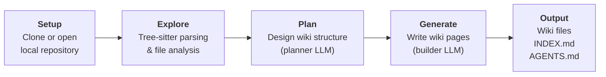

# Repositories Wiki

**Your AI coding agent shouldn't have to rediscover your codebase from scratch every session.**

Repositories Wiki automatically generates structured, interlinked wiki documentation from source code using LLMs. Your AI agent reads it directly from the repo during development, or you can serve it to external tools via MCP. Either way, the result is a persistent, context-aware knowledge layer that gives your agent full architectural context without overloading its context window.

[](https://www.npmjs.com/package/@repositories-wiki/repository-wiki)
[](https://www.npmjs.com/package/@repositories-wiki/mcp)
[](https://opensource.org/licenses/MIT)

> Inspired by Andrej Karpathy's [LLM Wiki](https://gist.github.com/karpathy/442a6bf555914893e9891c11519de94f) pattern — the idea that LLMs should **build and maintain persistent knowledge bases** rather than rediscover information from scratch on every query. Repositories Wiki applies this pattern to source code: parse once, compile into a structured wiki, and let every future session start with full context.

### See it in action

<div align="center">


https://github.com/user-attachments/assets/68a5539a-80ee-422c-8421-2826c767fd79


</div>

---

## What You Get

Run the tool on any repository. It reads every file, plans a wiki structure, and writes detailed documentation — architecture overviews, module deep-dives, data flow explanations — all grounded in actual source code with citations.

The tool generates three things in your repository:

1. **`repository-wiki/`** — A directory of structured markdown pages with an `INDEX.md`, organized by sections
2. **`AGENTS.md`** — Instructions added to your repo root that tell AI agents how to consult the wiki before exploring code, and when to update it
3. **A self-maintaining wiki** — Install the `update-wiki` skill (included in this repo) and your agent will automatically keep the wiki current as your code evolves. No need to re-run the full pipeline — the agent handles incremental updates.

<details>
<summary><b>Example: Wiki generated for the Claude Agent SDK (Python)</b></summary>

> Generated from commit `1def066`.

### Getting Started
| Page | Importance | Relevant Source Files |
|------|------------|----------------------|
| [Overview & Quick Start](./examples/claude-agent-sdk-python/sections/getting-started/overview-quick-start.md) | high | `__init__.py`, `pyproject.toml`, `examples/quick_start.py` |
| [Configuration & Options](./examples/claude-agent-sdk-python/sections/getting-started/configuration-options.md) | high | `types.py`, `subprocess_cli.py`, `examples/setting_sources.py` |

### Core API
| Page | Importance | Relevant Source Files |
|------|------------|----------------------|
| [Query API (One-Shot Requests)](./examples/claude-agent-sdk-python/sections/core-api/query-api-one-shot-requests.md) | high | `query.py`, `_internal/query.py`, `_internal/client.py` |
| [Streaming Client (Bidirectional Conversations)](./examples/claude-agent-sdk-python/sections/core-api/streaming-client-bidirectional-conversations.md) | high | `client.py`, `_internal/client.py`, `examples/streaming_mode.py` |
| [Message Types & Content Blocks](./examples/claude-agent-sdk-python/sections/core-api/message-types-content-blocks.md) | high | `types.py`, `_internal/message_parser.py` |
| [Error Handling](./examples/claude-agent-sdk-python/sections/core-api/error-handling.md) | medium | `_errors.py`, `subprocess_cli.py`, `_internal/client.py` |

### Architecture & Internals
| Page | Importance | Relevant Source Files |
|------|------------|----------------------|
| [Architecture Overview](./examples/claude-agent-sdk-python/sections/architecture-internals/architecture-overview.md) | high | `__init__.py`, `client.py`, `_internal/client.py` |
| [Transport Layer & Subprocess CLI](./examples/claude-agent-sdk-python/sections/architecture-internals/transport-layer-subprocess-cli.md) | medium | `transport/__init__.py`, `subprocess_cli.py` |

### Hooks & Permissions
| Page | Importance | Relevant Source Files |
|------|------------|----------------------|
| ... | | |

*See the [full index](./examples/claude-agent-sdk-python/INDEX.md) for all sections and pages.*

</details>

Browse more examples: [LangChain](./examples/langchain/INDEX.md) | [Pi Mono](./examples/pi-mono/INDEX.md)

---

## How It Works



The pipeline uses three LLM tiers, each optimized for a different part of the job:

| Role | Recommended Tier | What It Does |
|------|-----------------|--------------|
| **Planner** | Opus-class | Reads the full codebase and designs the wiki structure — sections, pages, and how they connect |
| **Explorer** | Haiku-class | Fast, cheap file-level analysis — extracts metadata and summaries for hundreds of files |
| **Builder** | Sonnet-class | Writes each wiki page in detail with architecture diagrams, source citations, and cross-references |

---

## Quick Start

### 1. Generate a wiki

```bash
npm install -g @repositories-wiki/repository-wiki
```

```bash
# Set up your LLM provider credentials
export ANTHROPIC_API_KEY=sk-...

# Generate a wiki from a local repository
repository-wiki \
    --provider-id anthropic \
    --planer-model claude-opus-4-6 \
    --exploration-model claude-haiku-4-5 \
    --builder-model claude-sonnet-4-6 \
    --local-repo-path /path/to/your-project
```

This creates a `repository-wiki/` directory in your project with structured markdown files and an `INDEX.md`, and updates `AGENTS.md` at your repo root with instructions for AI agents.

### 2. Install the `update-wiki` skill

The wiki generation is a one-time step. After that, the wiki stays current through the **`update-wiki` agent skill** — your AI coding agent detects when code changes affect documented pages and surgically updates only what changed.

The generated `AGENTS.md` already tells your agent *when* to update the wiki. The skill teaches it *how*. Copy it into your agent's skills directory:

**Claude Code:**
```bash
cp -r skills/update-wiki ~/.claude/skills/update-wiki
```

**OpenCode:**
```bash
cp -r skills/update-wiki ~/.config/opencode/skills/update-wiki
```

**Cursor:**
```bash
cp -r skills/update-wiki ~/.cursor/skills/update-wiki
```

Once installed, whenever the agent modifies code that's referenced in the wiki, it will automatically update the affected pages, add new pages for new modules, or remove pages for deleted code — no manual re-generation needed.

### 3. Serve to AI tools via MCP (Optional)

```bash
npm install -g @repositories-wiki/mcp
```

Add to your AI tool configuration (Claude Desktop, Cursor, OpenCode, etc.):

```json
{
  "mcpServers": {
    "repositories-wiki": {
      "command": "repositories-wiki-mcp",
      "env": {
        "REPOS_WIKI_MCP_CONFIG": "{\"repos\": [{\"path\": \"/path/to/your-project\"}]}"
      }
    }
  }
}
```

You can serve **multiple repositories** through a single MCP server:

```json
{
  "REPOS_WIKI_MCP_CONFIG": "{\"repos\": [{\"path\": \"/path/to/project-a\"}, {\"url\": \"https://github.com/owner/project-b\", \"token\": \"ghp_...\", \"branch\": \"main\"}]}"
}
```

Your AI agent now has access to three tools: `read_wiki_index`, `read_wiki_pages`, and `read_source_files` — giving it full architectural context for your codebase.

---

## Supported LLM Providers

| Provider | Env Variable | Setup Guide |
|----------|-------------|-------------|
| `anthropic` | `ANTHROPIC_API_KEY` | [LangChain docs](https://docs.langchain.com/oss/javascript/integrations/chat) |
| `openai` | `OPENAI_API_KEY` | [LangChain docs](https://docs.langchain.com/oss/javascript/integrations/chat) |
| `azure_openai` | `AZURE_OPENAI_API_KEY` | [LangChain docs](https://docs.langchain.com/oss/javascript/integrations/chat) |
| `google-genai` | `GOOGLE_API_KEY` | [LangChain docs](https://docs.langchain.com/oss/javascript/integrations/chat) |
| `bedrock` | AWS credentials | [LangChain docs](https://docs.langchain.com/oss/javascript/integrations/chat) |
| `sap-ai-core` | `AICORE_SERVICE_KEY` | [SAP AI SDK docs](https://sap.github.io/ai-sdk/docs/js/overview-cloud-sdk-for-ai-js) |

---

## Tree-sitter Language Support

The tool works with **any programming language** — the LLM reads and documents all source files regardless. However, for the languages below, [Tree-sitter](https://tree-sitter.github.io/tree-sitter/) is used to extract structural signatures (classes, functions, interfaces, etc.) before sending code to the LLM. This produces more focused wiki pages and reduces token usage.

| Language | Extensions |
|----------|-----------|
| TypeScript | `.ts` |
| TSX | `.tsx` |
| JavaScript | `.js`, `.jsx`, `.mjs`, `.cjs` |
| Python | `.py`, `.pyw` |
| Java | `.java` |
| Go | `.go` |

**Want better results for your language?** You can add your own Tree-sitter grammar by implementing a language query in [`packages/repository-wiki/src/tree-sitter/language-queries/`](./packages/repository-wiki/src/tree-sitter/language-queries/) and placing the corresponding `.wasm` grammar file in [`packages/repository-wiki/assets/grammars/`](./packages/repository-wiki/assets/grammars/). See the existing language queries for reference. Contributions for new languages are welcome!

---

## Packages

| Package | npm | Description |
|---------|-----|-------------|
| [`@repositories-wiki/repository-wiki`](./packages/repository-wiki) | [](https://www.npmjs.com/package/@repositories-wiki/repository-wiki) | CLI & library to generate wikis from source code using LLMs |
| [`@repositories-wiki/mcp`](./packages/mcp) | [](https://www.npmjs.com/package/@repositories-wiki/mcp) | MCP server that serves generated wikis to AI coding tools |
| [`@repositories-wiki/common`](./packages/common) | Private | Shared types and utilities (bundled into the above at build time) |

---

## Development

**Prerequisites:** Node.js (v18+), npm

```bash
npm install          # Install dependencies
npm run build        # Build all packages (Turborepo handles ordering)
npm run test         # Run tests
npm run clean        # Clean build artifacts
```

## Contributing

This project uses [Changesets](https://github.com/changesets/changesets) for version management. See [RELEASING.md](./RELEASING.md) for the full release process.

```bash
npx changeset        # Create a changeset describing your change
git add .            # Stage the changeset file with your code
git commit           # Commit everything
```

## License

[MIT](https://opensource.org/licenses/MIT)
