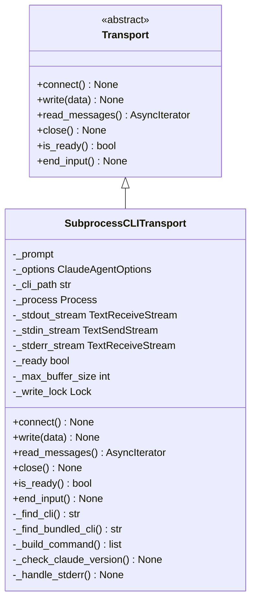
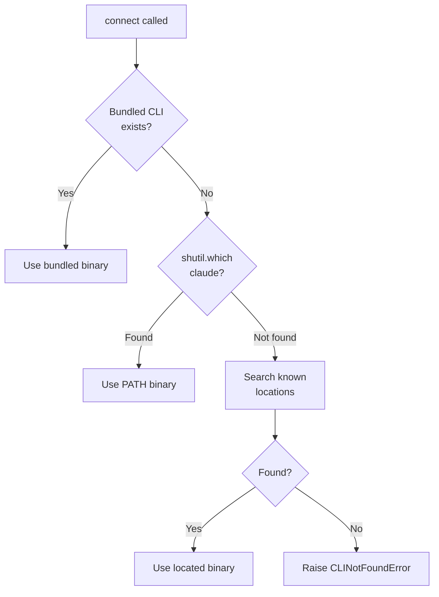
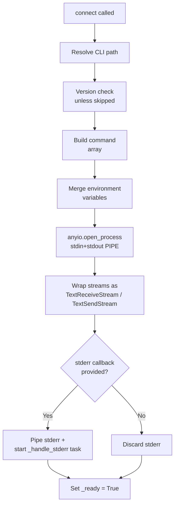
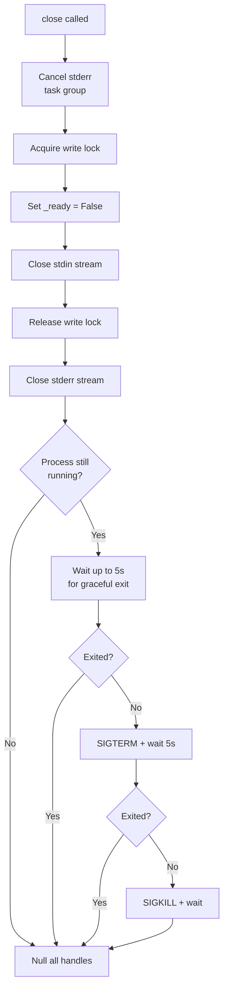
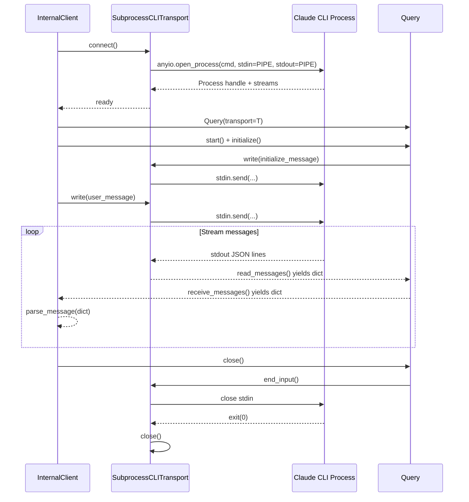

# Transport Layer & Subprocess CLI

The transport layer is the foundational I/O abstraction in the Claude Agent SDK for Python. It decouples the higher-level query and session management logic from the mechanics of actually communicating with the Claude Code process. The primary — and currently only — concrete implementation is `SubprocessCLITransport`, which spawns the Claude Code CLI as a child process, communicates over stdin/stdout using a newline-delimited JSON stream, and manages the full lifecycle of that process from startup through graceful shutdown.

This page covers the abstract `Transport` interface, the `SubprocessCLITransport` implementation, the CLI binary discovery and bundling strategy, the JSON streaming and buffering protocol, and how the transport integrates with the broader `InternalClient` / `Query` pipeline.

---

## Transport Abstraction

### The `Transport` Abstract Base Class

All transport implementations derive from the `Transport` ABC defined in `src/claude_agent_sdk/_internal/transport/__init__.py`. The interface is intentionally minimal, exposing only the raw I/O primitives that higher-level components need.

```python
class Transport(ABC):
    async def connect(self) -> None: ...
    async def write(self, data: str) -> None: ...
    def read_messages(self) -> AsyncIterator[dict[str, Any]]: ...
    async def close(self) -> None: ...
    def is_ready(self) -> bool: ...
    async def end_input(self) -> None: ...
```

Sources: [src/claude_agent_sdk/_internal/transport/__init__.py:1-60](../../../src/claude_agent_sdk/_internal/transport/__init__.py#L1-L60)

### Method Responsibilities

| Method | Description |
|---|---|
| `connect()` | Initialises the transport — for subprocess transports, this spawns the process. |
| `write(data)` | Writes a raw string (typically a JSON-encoded message + newline) to the transport's input. |
| `read_messages()` | Returns an async iterator that yields parsed JSON `dict` objects from the transport's output. |
| `close()` | Tears down the connection and cleans up all resources (streams, process handles, task groups). |
| `is_ready()` | Returns `True` if the transport is ready to send and receive messages. |
| `end_input()` | Signals end-of-input (closes stdin for subprocess transports), triggering graceful CLI shutdown. |

Sources: [src/claude_agent_sdk/_internal/transport/__init__.py:18-58](../../../src/claude_agent_sdk/_internal/transport/__init__.py#L18-L58)

> **Stability warning:** The `Transport` ABC is marked as an internal API. The Claude Code team may change or remove it in any future release. Custom implementations must be updated to match interface changes.

Sources: [src/claude_agent_sdk/_internal/transport/__init__.py:10-17](../../../src/claude_agent_sdk/_internal/transport/__init__.py#L10-L17)

---

## SubprocessCLITransport

`SubprocessCLITransport` is the concrete transport that drives all standard SDK usage. It wraps the Claude Code CLI binary as a subprocess, wires up stdin/stdout/stderr as async streams via `anyio`, and implements the full `Transport` interface.

Sources: [src/claude_agent_sdk/_internal/transport/subprocess_cli.py:1-350](../../../src/claude_agent_sdk/_internal/transport/subprocess_cli.py#L1-L350)

### Class-Level Architecture



Sources: [src/claude_agent_sdk/_internal/transport/subprocess_cli.py:37-100](../../../src/claude_agent_sdk/_internal/transport/subprocess_cli.py#L37-L100)

### Constructor Parameters

| Parameter | Type | Description |
|---|---|---|
| `prompt` | `str \| AsyncIterable[dict]` | The user prompt — either a plain string or an async stream of control-protocol messages. |
| `options` | `ClaudeAgentOptions` | Full SDK options object controlling CLI flags, environment, paths, and limits. |

Key internal fields initialised at construction time:

| Field | Default | Description |
|---|---|---|
| `_is_streaming` | `True` | Always `True`; matches TypeScript SDK behaviour. |
| `_max_buffer_size` | `1 MB` | Maximum bytes buffered while assembling a partial JSON message. Configurable via `options.max_buffer_size`. |
| `_write_lock` | `anyio.Lock()` | Serialises concurrent writes and prevents TOCTOU races with `close()`. |

Sources: [src/claude_agent_sdk/_internal/transport/subprocess_cli.py:50-100](../../../src/claude_agent_sdk/_internal/transport/subprocess_cli.py#L50-L100)

---

## CLI Binary Discovery

Before the subprocess can be launched, the transport must locate the Claude Code CLI binary. The resolution order is:



Sources: [src/claude_agent_sdk/_internal/transport/subprocess_cli.py:102-140](../../../src/claude_agent_sdk/_internal/transport/subprocess_cli.py#L102-L140)

### Bundled CLI

The SDK supports bundling the CLI binary directly inside the Python wheel. `_find_bundled_cli()` looks for a `_bundled/claude` (or `_bundled/claude.exe` on Windows) directory relative to the transport module itself:

```python
bundled_path = Path(__file__).parent.parent.parent / "_bundled" / cli_name
```

Sources: [src/claude_agent_sdk/_internal/transport/subprocess_cli.py:113-126](../../../src/claude_agent_sdk/_internal/transport/subprocess_cli.py#L113-L126)

### Fallback Search Locations

If no bundled binary is found and `shutil.which` returns nothing, the transport checks a hard-coded list of common installation paths:

| Platform | Locations checked |
|---|---|
| Unix/macOS | `~/.npm-global/bin/claude`, `/usr/local/bin/claude`, `~/.local/bin/claude`, `~/node_modules/.bin/claude`, `~/.yarn/bin/claude`, `~/.claude/local/claude` |
| Windows | `~/.local/bin/claude.exe`, `%LOCALAPPDATA%/Claude/claude.exe` |

Sources: [src/claude_agent_sdk/_internal/transport/subprocess_cli.py:128-150](../../../src/claude_agent_sdk/_internal/transport/subprocess_cli.py#L128-L150), [scripts/download_cli.py:22-45](../../../scripts/download_cli.py#L22-L45)

### CLI Bundling Script

The `scripts/download_cli.py` script is run during the wheel build process. It downloads the official Claude Code CLI using the platform-appropriate installer, then copies the binary into `src/claude_agent_sdk/_bundled/`. On Unix it uses `curl | bash`; on Windows it uses a PowerShell one-liner. It includes retry logic (up to 3 attempts with exponential back-off) and a random start jitter to avoid thundering-herd issues in parallel CI matrix builds.

Sources: [scripts/download_cli.py:1-130](../../../scripts/download_cli.py#L1-L130)

---

## Process Lifecycle

### `connect()` — Spawning the Subprocess

`connect()` performs several sequential steps:



Sources: [src/claude_agent_sdk/_internal/transport/subprocess_cli.py:195-280](../../../src/claude_agent_sdk/_internal/transport/subprocess_cli.py#L195-L280)

#### Environment Variable Composition

The process environment is composed as follows (later entries win):

1. Inherited `os.environ` (with `CLAUDECODE` stripped to prevent the subprocess from believing it is running inside a Claude Code parent process).
2. `CLAUDE_CODE_ENTRYPOINT=sdk-py` (default, can be overridden).
3. `options.env` (caller-supplied overrides).
4. `CLAUDE_AGENT_SDK_VERSION=<current version>` (always set).
5. Active OpenTelemetry W3C trace context (`TRACEPARENT`, `TRACESTATE`) — injected when `opentelemetry-api` is installed and there is an active span.

Sources: [src/claude_agent_sdk/_internal/transport/subprocess_cli.py:243-280](../../../src/claude_agent_sdk/_internal/transport/subprocess_cli.py#L243-L280)

### `close()` — Graceful Shutdown

Shutdown follows a carefully ordered sequence to avoid data loss and resource leaks:



The 5-second grace period after stdin EOF is intentional: the CLI needs time to flush its session file before receiving a termination signal, otherwise the last assistant message can be lost.

Sources: [src/claude_agent_sdk/_internal/transport/subprocess_cli.py:295-355](../../../src/claude_agent_sdk/_internal/transport/subprocess_cli.py#L295-L355)

---

## Command Construction

`_build_command()` translates `ClaudeAgentOptions` into the CLI argument array. The command always begins with:

```
<cli_path> --output-format stream-json --verbose --input-format stream-json
```

The `--input-format stream-json` flag is always appended last and is non-negotiable — it enables the control protocol over stdin that allows large configurations (agents, MCP servers, hooks) to be sent via an `initialize` message rather than as CLI flags.

Sources: [src/claude_agent_sdk/_internal/transport/subprocess_cli.py:153-195](../../../src/claude_agent_sdk/_internal/transport/subprocess_cli.py#L153-L195)

### CLI Flag Mapping

| `ClaudeAgentOptions` field | CLI flag(s) |
|---|---|
| `system_prompt` (str) | `--system-prompt <value>` |
| `system_prompt` (file type) | `--system-prompt-file <path>` |
| `system_prompt` (preset + append) | `--append-system-prompt <value>` |
| `tools` | `--tools <comma-list>` |
| `allowed_tools` | `--allowedTools <comma-list>` |
| `disallowed_tools` | `--disallowedTools <comma-list>` |
| `max_turns` | `--max-turns <n>` |
| `max_budget_usd` | `--max-budget-usd <n>` |
| `model` | `--model <name>` |
| `fallback_model` | `--fallback-model <name>` |
| `betas` | `--betas <comma-list>` |
| `permission_prompt_tool_name` | `--permission-prompt-tool <name>` |
| `permission_mode` | `--permission-mode <mode>` |
| `continue_conversation` | `--continue` |
| `resume` | `--resume <session-id>` |
| `session_id` | `--session-id <id>` |
| `settings` / `sandbox` | `--settings <json-or-path>` |
| `add_dirs` | `--add-dir <path>` (repeated) |
| `mcp_servers` | `--mcp-config <json>` |
| `include_partial_messages` | `--include-partial-messages` |
| `fork_session` | `--fork-session` |
| `session_store` (non-None) | `--session-mirror` |
| `plugins` (local) | `--plugin-dir <path>` (repeated) |
| `thinking` | `--thinking <mode>` / `--max-thinking-tokens <n>` |
| `effort` | `--effort <level>` |
| `output_format` (json_schema) | `--json-schema <json>` |
| `extra_args` | `--<flag>` / `--<flag> <value>` |

Sources: [src/claude_agent_sdk/_internal/transport/subprocess_cli.py:153-195](../../../src/claude_agent_sdk/_internal/transport/subprocess_cli.py#L153-L195)

### Settings and Sandbox Merging

When both `settings` and `sandbox` options are provided, `_build_settings_value()` merges them into a single JSON object passed to `--settings`. If only `settings` is provided, it is passed through as-is (either a file path or a JSON string). The `sandbox` key is injected at the top level of the merged object.

Sources: [src/claude_agent_sdk/_internal/transport/subprocess_cli.py:128-153](../../../src/claude_agent_sdk/_internal/transport/subprocess_cli.py#L128-L153)

### Skills and Setting Sources

`_apply_skills_defaults()` computes the effective `allowed_tools` and `setting_sources` lists when `options.skills` is set:

- `skills="all"` → injects the bare `Skill` tool name into `allowed_tools`.
- `skills=["name1", "name2"]` → injects `Skill(name1)`, `Skill(name2)`.
- In either case, `setting_sources` defaults to `["user", "project"]` if not already set.

Sources: [src/claude_agent_sdk/_internal/transport/subprocess_cli.py:155-185](../../../src/claude_agent_sdk/_internal/transport/subprocess_cli.py#L155-L185)

---

## JSON Streaming and Buffering

### Protocol Overview

The CLI communicates over stdout using newline-delimited JSON (NDJSON). Each message is a complete JSON object terminated by a newline. The `--output-format stream-json` flag enables this mode. Similarly, `--input-format stream-json` enables the SDK to write JSON control messages to the CLI's stdin.

### The Buffering Problem

In practice, `anyio`'s `TextReceiveStream` does not guarantee one-line-per-read semantics. Several real-world scenarios require robust buffering:

| Scenario | Description |
|---|---|
| Multiple objects per read | Two or more complete JSON objects delivered as a single string with embedded `\n`. |
| JSON with embedded newlines | String values inside a JSON object that contain literal `\n` characters. |
| Split objects across reads | A single large JSON object fragmented across multiple `TextReceiveStream` reads. |
| Non-JSON debug lines | Lines like `[SandboxDebug] Seccomp filtering not available` emitted before or between JSON messages. |

Sources: [tests/test_subprocess_buffering.py:1-250](../../../tests/test_subprocess_buffering.py#L1-L250)

### Buffering Algorithm

`_read_messages_impl()` implements a speculative-parse accumulator:

```mermaid
graph TD
    A[Read chunk from\nTextReceiveStream] --> B[Strip whitespace]
    B --> C{Empty?}
    C -- Yes --> A
    C -- No --> D[Split on newline\ncharacters]
    D --> E[For each sub-line]
    E --> F{Buffer empty AND\nline starts with {?}
    F -- No, not JSON --> G[Skip line\nlog debug]
    G --> E
    F -- Yes --> H[Append to\njson_buffer]
    H --> I{Buffer exceeds\nmax_buffer_size?}
    I -- Yes --> J[Raise CLIJSONDecodeError]
    I -- No --> K[Attempt json.loads]
    K --> L{Parse OK?}
    L -- Yes --> M[Yield dict\nClear buffer]
    M --> E
    L -- No --> N[Continue accumulating]
    N --> A
```

Sources: [src/claude_agent_sdk/_internal/transport/subprocess_cli.py:375-430](../../../src/claude_agent_sdk/_internal/transport/subprocess_cli.py#L375-L430)

Key properties of the algorithm:
- **Non-JSON lines are skipped** only when the buffer is empty (i.e., we are not mid-parse). This prevents debug output from corrupting a partially-assembled JSON object.
- **Speculative parsing** means `json.loads` is called on every accumulated chunk. A `JSONDecodeError` is silently swallowed and accumulation continues.
- **Buffer overflow** raises `CLIJSONDecodeError` with a message indicating the configured limit.

Sources: [src/claude_agent_sdk/_internal/transport/subprocess_cli.py:390-430](../../../src/claude_agent_sdk/_internal/transport/subprocess_cli.py#L390-L430)

### Buffer Size Configuration

| Constant / Option | Value | Description |
|---|---|---|
| `_DEFAULT_MAX_BUFFER_SIZE` | `1 048 576` (1 MB) | Default maximum bytes for the JSON accumulation buffer. |
| `ClaudeAgentOptions.max_buffer_size` | User-supplied | Overrides the default when set. |

```python
self._max_buffer_size = (
    options.max_buffer_size
    if options.max_buffer_size is not None
    else _DEFAULT_MAX_BUFFER_SIZE
)
```

Sources: [src/claude_agent_sdk/_internal/transport/subprocess_cli.py:36-38](../../../src/claude_agent_sdk/_internal/transport/subprocess_cli.py#L36-L38), [src/claude_agent_sdk/_internal/transport/subprocess_cli.py:93-96](../../../src/claude_agent_sdk/_internal/transport/subprocess_cli.py#L93-L96)

---

## Write Safety

All writes to stdin are serialised through `_write_lock` (an `anyio.Lock`). The lock is also held during `close()` when the stdin stream is torn down, preventing TOCTOU races where a concurrent write could attempt to use a stream that is being closed.

`write()` performs three safety checks inside the lock before sending:

1. `_ready` flag is `True` and `_stdin_stream` is not `None`.
2. The process has not already terminated (`returncode is not None`).
3. No prior write error has been recorded in `_exit_error`.

Sources: [src/claude_agent_sdk/_internal/transport/subprocess_cli.py:355-390](../../../src/claude_agent_sdk/_internal/transport/subprocess_cli.py#L355-L390)

---

## Stderr Handling

Stderr is only piped when the caller provides a `stderr` callback in `ClaudeAgentOptions`. When piped, an async background task (`_handle_stderr`) reads lines from the stderr stream and invokes the callback for each non-empty line. If no callback is provided, stderr is discarded (`stderr_dest = None`).

```python
stderr_dest = PIPE if self._options.stderr is not None else None
```

Sources: [src/claude_agent_sdk/_internal/transport/subprocess_cli.py:270-295](../../../src/claude_agent_sdk/_internal/transport/subprocess_cli.py#L270-L295)

---

## Version Checking

Before spawning the main process, `connect()` optionally runs `<cli_path> -v` to read the CLI's version string. If the version is below `MINIMUM_CLAUDE_CODE_VERSION` (currently `2.0.0`), a warning is logged but execution continues. The check has a 2-second timeout and is entirely suppressed when the environment variable `CLAUDE_AGENT_SDK_SKIP_VERSION_CHECK` is set.

Sources: [src/claude_agent_sdk/_internal/transport/subprocess_cli.py:430-465](../../../src/claude_agent_sdk/_internal/transport/subprocess_cli.py#L430-L465)

---

## Integration with InternalClient

`SubprocessCLITransport` is instantiated and managed by `InternalClient._process_query_inner()`. The client:

1. Creates the transport with the resolved `configured_options`.
2. Calls `transport.connect()` to spawn the subprocess.
3. Passes the transport to a `Query` object, which owns the higher-level control protocol (initialize, user message, tool use, session mirroring).
4. Iterates `query.receive_messages()` and parses each dict into a typed `Message` via `parse_message()`.
5. In a `finally` block, calls `query.close()` → which in turn calls `transport.close()`.

A custom `Transport` implementation can be injected via the `transport` parameter of `process_query()`, bypassing `SubprocessCLITransport` entirely. When a custom transport is supplied, session-store materialisation is also skipped.



Sources: [src/claude_agent_sdk/_internal/client.py:1-200](../../../src/claude_agent_sdk/_internal/client.py#L1-L200)

---

## Error Handling

| Error Type | Trigger | Class |
|---|---|---|
| `CLINotFoundError` | Binary not found anywhere in resolution chain | `CLINotFoundError` |
| `CLINotFoundError` | `FileNotFoundError` from `anyio.open_process` | `CLINotFoundError` |
| `CLIConnectionError` | Working directory does not exist | `CLIConnectionError` |
| `CLIConnectionError` | Any other `open_process` failure | `CLIConnectionError` |
| `CLIConnectionError` | Write to non-ready or terminated process | `CLIConnectionError` |
| `CLIJSONDecodeError` | JSON buffer exceeds `max_buffer_size` | `CLIJSONDecodeError` |
| `ProcessError` | CLI exits with non-zero return code | `ProcessError` |

Sources: [src/claude_agent_sdk/_internal/transport/subprocess_cli.py:195-280](../../../src/claude_agent_sdk/_internal/transport/subprocess_cli.py#L195-L280), [src/claude_agent_sdk/_internal/transport/subprocess_cli.py:355-430](../../../src/claude_agent_sdk/_internal/transport/subprocess_cli.py#L355-L430)

---

## Summary

The transport layer provides a clean boundary between raw process I/O and the SDK's higher-level session and message-routing logic. The `Transport` ABC defines a six-method interface that any implementation must satisfy. `SubprocessCLITransport` is the production implementation: it discovers or uses a bundled CLI binary, constructs a precise argument array from `ClaudeAgentOptions`, spawns the process with carefully composed environment variables, and exposes an async JSON-streaming interface with robust buffering to handle the real-world messiness of subprocess stdout delivery. Thread-safety for writes is guaranteed via an `anyio.Lock`, graceful shutdown is enforced with a 5-second grace period before escalating to `SIGTERM` and then `SIGKILL`, and buffer overflow is detected and surfaced as a typed `CLIJSONDecodeError`. The entire transport is replaceable via dependency injection in `InternalClient`, enabling custom or remote transport implementations for advanced use cases.