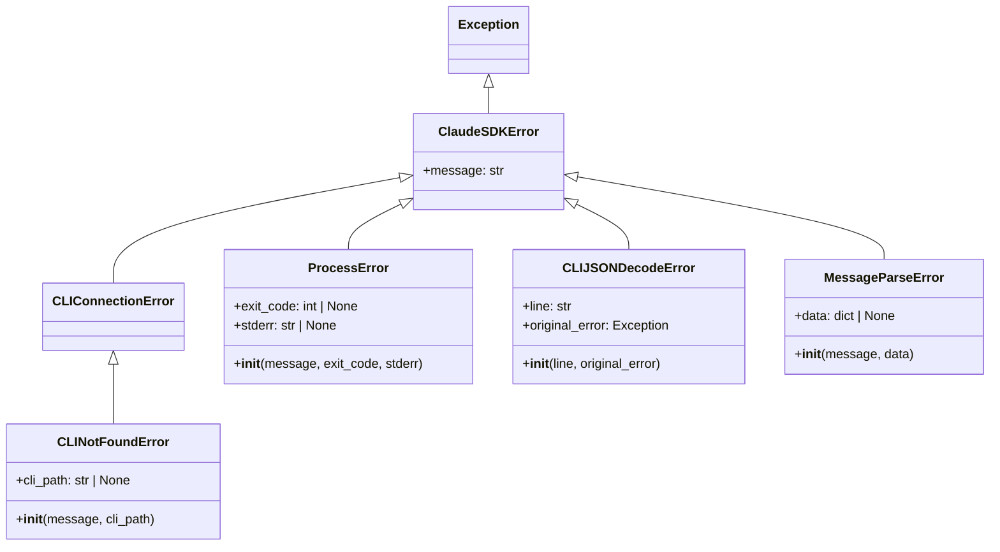
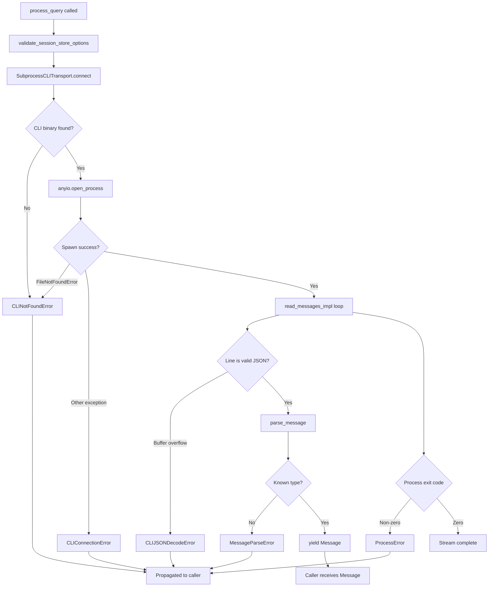

# Error Handling

The Claude Agent SDK defines a structured exception hierarchy that provides consistent, informative error reporting across all layers of the SDK — from CLI discovery and subprocess management to JSON parsing and message processing. All SDK-specific exceptions derive from a single base class, enabling callers to catch either broad or narrow error categories as needed.

This page covers the error types exposed by the SDK, their inheritance relationships, the contextual data they carry, and how they are raised within the transport and client layers.

---

## Error Class Hierarchy

All SDK exceptions are defined in `src/claude_agent_sdk/_errors.py` and inherit from `ClaudeSDKError`, which itself extends Python's built-in `Exception`. This single-root design allows callers to write either a broad `except ClaudeSDKError` handler or target a specific subclass.

```
ClaudeSDKError (base)
├── CLIConnectionError
│   └── CLINotFoundError
├── ProcessError
├── CLIJSONDecodeError
└── MessageParseError
```

Sources: [src/claude_agent_sdk/_errors.py:1-57](../../../src/claude_agent_sdk/_errors.py#L1-L57)

### Class Diagram

The following diagram shows the full inheritance structure and the additional attributes each class introduces.



Sources: [src/claude_agent_sdk/_errors.py:1-57](../../../src/claude_agent_sdk/_errors.py#L1-L57)

---

## Error Type Reference

The table below summarises every error class, its parent, the extra attributes it exposes, and the typical scenario in which it is raised.

| Class | Parent | Extra Attributes | Raised When |
|---|---|---|---|
| `ClaudeSDKError` | `Exception` | — | Base class; never raised directly |
| `CLIConnectionError` | `ClaudeSDKError` | — | General failure to connect to Claude Code |
| `CLINotFoundError` | `CLIConnectionError` | `cli_path` | Claude Code binary not found or not installed |
| `ProcessError` | `ClaudeSDKError` | `exit_code`, `stderr` | The CLI subprocess exits with a non-zero code |
| `CLIJSONDecodeError` | `ClaudeSDKError` | `line`, `original_error` | A line from CLI stdout cannot be parsed as JSON |
| `MessageParseError` | `ClaudeSDKError` | `data` | A parsed JSON object cannot be mapped to a known message type |

Sources: [src/claude_agent_sdk/_errors.py:1-57](../../../src/claude_agent_sdk/_errors.py#L1-L57)

---

## Individual Error Classes

### `ClaudeSDKError`

The root of the SDK exception tree. Extends `Exception` directly and carries only a plain string message. Catching this class will intercept all SDK-originated errors.

```python
class ClaudeSDKError(Exception):
    """Base exception for all Claude SDK errors."""
```

Sources: [src/claude_agent_sdk/_errors.py:6-7](../../../src/claude_agent_sdk/_errors.py#L6-L7)

---

### `CLIConnectionError`

Signals that the SDK could not establish communication with the Claude Code CLI. It does not add attributes beyond the base message, but it serves as a meaningful parent for `CLINotFoundError` and is also raised directly inside `SubprocessCLITransport` when a write fails or when the process is not ready.

Raised in the transport layer in three distinct situations:

1. The process is not yet ready for writing (`write()` guard check).
2. A write to `stdin` fails mid-stream.
3. The working directory supplied to `ClaudeAgentOptions` does not exist.

```python
raise CLIConnectionError("ProcessTransport is not ready for writing")
```

Sources: [src/claude_agent_sdk/_errors.py:10-11](../../../src/claude_agent_sdk/_errors.py#L10-L11), [src/claude_agent_sdk/_internal/transport/subprocess_cli.py:248-251](../../../src/claude_agent_sdk/_internal/transport/subprocess_cli.py#L248-L251)

---

### `CLINotFoundError`

A specialisation of `CLIConnectionError` for the case where the Claude Code binary cannot be located. Its `__init__` accepts an optional `cli_path` argument; when provided, the path is appended to the error message to aid debugging.

```python
class CLINotFoundError(CLIConnectionError):
    def __init__(
        self, message: str = "Claude Code not found", cli_path: str | None = None
    ):
        if cli_path:
            message = f"{message}: {cli_path}"
        super().__init__(message)
```

The transport raises this error in two places:

- `_find_cli()` — when neither the bundled binary nor any well-known system path contains a `claude` executable, including a detailed install hint.
- `connect()` — when `anyio.open_process` raises `FileNotFoundError` (the resolved path does not exist at process-spawn time).

Sources: [src/claude_agent_sdk/_errors.py:14-21](../../../src/claude_agent_sdk/_errors.py#L14-L21), [src/claude_agent_sdk/_internal/transport/subprocess_cli.py:62-73](../../../src/claude_agent_sdk/_internal/transport/subprocess_cli.py#L62-L73), [src/claude_agent_sdk/_internal/transport/subprocess_cli.py:195-201](../../../src/claude_agent_sdk/_internal/transport/subprocess_cli.py#L195-L201)

---

### `ProcessError`

Raised when the CLI subprocess terminates with a non-zero exit code. It stores both `exit_code` and `stderr` as instance attributes and incorporates them into the formatted message automatically.

```python
class ProcessError(ClaudeSDKError):
    def __init__(
        self, message: str, exit_code: int | None = None, stderr: str | None = None
    ):
        self.exit_code = exit_code
        self.stderr = stderr

        if exit_code is not None:
            message = f"{message} (exit code: {exit_code})"
        if stderr:
            message = f"{message}\nError output: {stderr}"

        super().__init__(message)
```

Inside `_read_messages_impl`, after the stdout stream is exhausted the transport awaits the process return code. If the code is non-zero, a `ProcessError` is constructed and raised, and the instance is also stored in `self._exit_error` so that subsequent `write()` calls can surface it immediately:

```python
if returncode is not None and returncode != 0:
    self._exit_error = ProcessError(
        f"Command failed with exit code {returncode}",
        exit_code=returncode,
        stderr="Check stderr output for details",
    )
    raise self._exit_error
```

Sources: [src/claude_agent_sdk/_errors.py:24-37](../../../src/claude_agent_sdk/_errors.py#L24-L37), [src/claude_agent_sdk/_internal/transport/subprocess_cli.py:302-309](../../../src/claude_agent_sdk/_internal/transport/subprocess_cli.py#L302-L309)

---

### `CLIJSONDecodeError`

Raised when a line (or accumulated buffer) from CLI stdout cannot be decoded as valid JSON. It retains the raw `line` string and the `original_error` (a `json.JSONDecodeError` or `ValueError`) for post-mortem inspection.

```python
class CLIJSONDecodeError(ClaudeSDKError):
    def __init__(self, line: str, original_error: Exception):
        self.line = line
        self.original_error = original_error
        super().__init__(f"Failed to decode JSON: {line[:100]}...")
```

The transport buffers partial lines speculatively and only raises this error when the accumulated buffer exceeds `max_buffer_size` (default 1 MB):

```python
if len(json_buffer) > self._max_buffer_size:
    buffer_length = len(json_buffer)
    json_buffer = ""
    raise SDKJSONDecodeError(
        f"JSON message exceeded maximum buffer size of {self._max_buffer_size} bytes",
        ValueError(
            f"Buffer size {buffer_length} exceeds limit {self._max_buffer_size}"
        ),
    )
```

Sources: [src/claude_agent_sdk/_errors.py:40-47](../../../src/claude_agent_sdk/_errors.py#L40-L47), [src/claude_agent_sdk/_internal/transport/subprocess_cli.py:271-280](../../../src/claude_agent_sdk/_internal/transport/subprocess_cli.py#L271-L280)

---

### `MessageParseError`

Raised when a successfully decoded JSON object cannot be mapped to a known SDK message type. The optional `data` attribute holds the raw dictionary that triggered the failure, enabling callers to inspect or log the unexpected payload.

```python
class MessageParseError(ClaudeSDKError):
    def __init__(self, message: str, data: dict[str, Any] | None = None):
        self.data = data
        super().__init__(message)
```

Sources: [src/claude_agent_sdk/_errors.py:50-57](../../../src/claude_agent_sdk/_errors.py#L50-L57)

---

## Error Flow Through the Transport Layer

The diagram below traces how errors propagate from the moment `connect()` is called through to the consumer of `process_query()`.



Sources: [src/claude_agent_sdk/_internal/transport/subprocess_cli.py:147-210](../../../src/claude_agent_sdk/_internal/transport/subprocess_cli.py#L147-L210), [src/claude_agent_sdk/_internal/transport/subprocess_cli.py:240-310](../../../src/claude_agent_sdk/_internal/transport/subprocess_cli.py#L240-L310), [src/claude_agent_sdk/_internal/client.py:1-50](../../../src/claude_agent_sdk/_internal/client.py#L1-L50)

---

## Error Propagation in `InternalClient`

`InternalClient.process_query()` wraps the inner async generator with a `try/finally` block to ensure the subprocess is always terminated and any temporary directories are cleaned up, regardless of whether the error originates inside the generator or in the caller's loop body:

```python
inner = self._process_query_inner(prompt, options, transport, materialized)
try:
    async for msg in inner:
        yield msg
finally:
    try:
        await inner.aclose()   # terminates subprocess
    finally:
        if materialized is not None:
            await materialized.cleanup()  # removes temp CLAUDE_CONFIG_DIR
```

Errors raised by the transport (`CLINotFoundError`, `ProcessError`, `CLIJSONDecodeError`) propagate through `_process_query_inner` unchanged and surface to the caller of `process_query`. Validation errors (e.g., `ValueError` for conflicting `can_use_tool` / `permission_prompt_tool_name` options) are raised synchronously before the subprocess is spawned.

Sources: [src/claude_agent_sdk/_internal/client.py:39-63](../../../src/claude_agent_sdk/_internal/client.py#L39-L63), [src/claude_agent_sdk/_internal/client.py:66-100](../../../src/claude_agent_sdk/_internal/client.py#L66-L100)

---

## Public Exports

All five error classes are exported from the top-level `claude_agent_sdk` package, making them importable without referencing internal modules:

```python
from claude_agent_sdk import (
    ClaudeSDKError,
    CLIConnectionError,
    CLIJSONDecodeError,
    CLINotFoundError,
    ProcessError,
)
```

`MessageParseError` is defined in `_errors.py` but is not shown in the test import list; it is available via `claude_agent_sdk._errors.MessageParseError` for internal use.

Sources: [tests/test_errors.py:1-10](../../../tests/test_errors.py#L1-L10), [src/claude_agent_sdk/_errors.py:1-57](../../../src/claude_agent_sdk/_errors.py#L1-L57)

---

## Testing Error Behaviour

The test suite in `tests/test_errors.py` verifies the following properties for each error class:

| Test | Assertion |
|---|---|
| `test_base_error` | `ClaudeSDKError` is an `Exception`; message is preserved verbatim |
| `test_cli_not_found_error` | `CLINotFoundError` is a `ClaudeSDKError`; message contains the supplied string |
| `test_connection_error` | `CLIConnectionError` is a `ClaudeSDKError`; message is preserved |
| `test_process_error` | `exit_code` and `stderr` attributes set; both values appear in `str(error)` |
| `test_json_decode_error` | `line` and `original_error` attributes set; `"Failed to decode JSON"` in message |

```python
def test_process_error(self):
    error = ProcessError("Process failed", exit_code=1, stderr="Command not found")
    assert error.exit_code == 1
    assert error.stderr == "Command not found"
    assert "exit code: 1" in str(error)
    assert "Command not found" in str(error)
```

Sources: [tests/test_errors.py:12-55](../../../tests/test_errors.py#L12-L55)

---

## Summary

The SDK's error handling is built around a shallow, purpose-driven exception hierarchy rooted at `ClaudeSDKError`. Errors are raised as close to their origin as possible — CLI discovery (`CLINotFoundError`), subprocess communication (`CLIConnectionError`, `ProcessError`), output parsing (`CLIJSONDecodeError`), and message mapping (`MessageParseError`) — and all carry structured contextual data (exit codes, raw lines, original exceptions) to support effective debugging. The `InternalClient` wraps generator execution in `try/finally` blocks to guarantee subprocess cleanup even when errors escape the iteration loop, ensuring no leaked processes or temporary directories regardless of the failure mode.