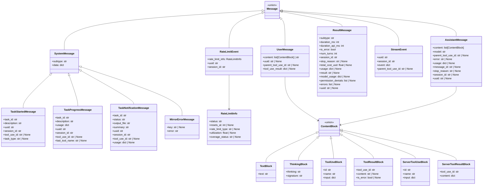
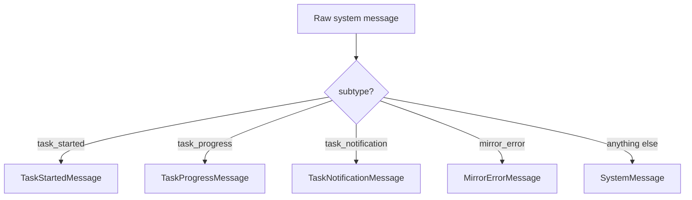
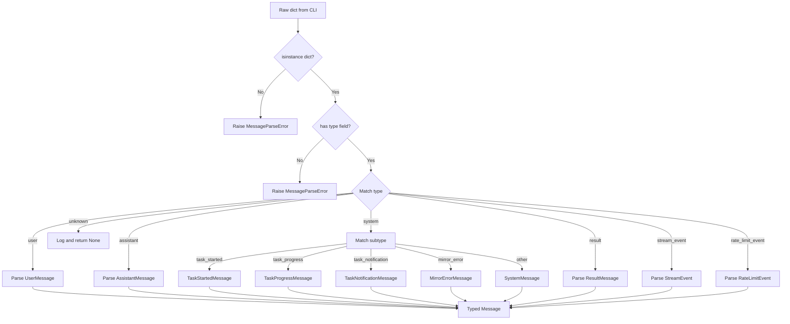
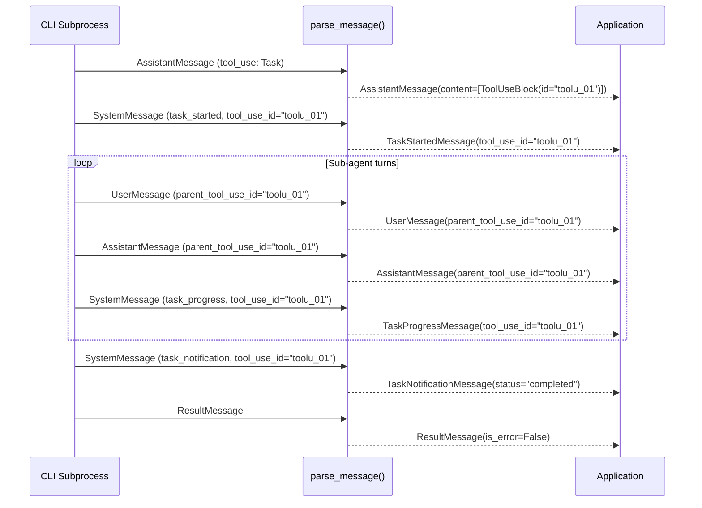

# Message Types & Content Blocks

The Claude Agent SDK for Python defines a rich, strongly-typed message model that mirrors the JSON protocol emitted by the Claude Code CLI subprocess. Every value flowing through the SDK's streaming pipeline is parsed into one of these typed objects, giving application code a predictable surface for pattern matching, filtering, and introspection. This page documents each top-level message type, the content block variants that appear inside them, and the parsing logic that converts raw CLI output into Python dataclasses.

For context on how these messages are produced at runtime, see the transport and session management layers. For hook integration that reacts to specific message events, see the Hooks & Lifecycle page.

---

## Overview of the Message Hierarchy

All messages share a common `Message` union type. The top-level discriminant is the `"type"` field present in every raw JSON object received from the CLI. The parser in `message_parser.py` uses a `match` statement on this field to route each object to the correct constructor.

```
Message
├── UserMessage          (type = "user")
├── AssistantMessage     (type = "assistant")
├── SystemMessage        (type = "system")
│   ├── TaskStartedMessage      (subtype = "task_started")
│   ├── TaskProgressMessage     (subtype = "task_progress")
│   ├── TaskNotificationMessage (subtype = "task_notification")
│   └── MirrorErrorMessage      (subtype = "mirror_error")
├── ResultMessage        (type = "result")
├── StreamEvent          (type = "stream_event")
└── RateLimitEvent       (type = "rate_limit_event")
```

Sources: [src/claude_agent_sdk/_internal/message_parser.py:1-50](../../../src/claude_agent_sdk/_internal/message_parser.py#L1-L50), [src/claude_agent_sdk/__init__.py:75-120](../../../src/claude_agent_sdk/__init__.py#L75-L120)

The class diagram below shows the full inheritance and composition relationships:



Sources: [src/claude_agent_sdk/_internal/message_parser.py:1-200](../../../src/claude_agent_sdk/_internal/message_parser.py#L1-L200), [src/claude_agent_sdk/__init__.py:75-160](../../../src/claude_agent_sdk/__init__.py#L75-L160)

---

## Content Blocks

Content blocks are the building blocks of `UserMessage` and `AssistantMessage` payloads. The `ContentBlock` union encompasses six concrete types. Each block has a `"type"` discriminant in the raw JSON that the parser uses to select the correct dataclass.

### ContentBlock Summary Table

| Block Type | Discriminant (`"type"`) | Appears In | Key Fields |
|---|---|---|---|
| `TextBlock` | `"text"` | User, Assistant | `text: str` |
| `ThinkingBlock` | `"thinking"` | Assistant | `thinking: str`, `signature: str` |
| `ToolUseBlock` | `"tool_use"` | User, Assistant | `id: str`, `name: str`, `input: dict` |
| `ToolResultBlock` | `"tool_result"` | User, Assistant | `tool_use_id: str`, `content`, `is_error` |
| `ServerToolUseBlock` | `"server_tool_use"` | Assistant | `id: str`, `name: str`, `input: dict` |
| `ServerToolResultBlock` | `"advisor_tool_result"` | Assistant | `tool_use_id: str`, `content: dict` |

Sources: [src/claude_agent_sdk/_internal/message_parser.py:65-115](../../../src/claude_agent_sdk/_internal/message_parser.py#L65-L115), [src/claude_agent_sdk/_internal/message_parser.py:118-165](../../../src/claude_agent_sdk/_internal/message_parser.py#L118-L165)

### TextBlock

The most common content block. Carries a plain text string from either the user or the assistant.

```python
TextBlock(text="Hello, human!")
```

Sources: [tests/test_types.py:29-35](../../../tests/test_types.py#L29-L35), [src/claude_agent_sdk/_internal/message_parser.py:71-72](../../../src/claude_agent_sdk/_internal/message_parser.py#L71-L72)

### ThinkingBlock

Represents Claude's extended thinking output. This block is emitted by the assistant when extended thinking is enabled. It carries both the raw thinking text and a cryptographic `signature` for verification.

```python
ThinkingBlock(thinking="I'm thinking about the answer...", signature="sig-123")
```

Sources: [tests/test_message_parser.py:176-196](../../../tests/test_message_parser.py#L176-L196), [src/claude_agent_sdk/_internal/message_parser.py:122-128](../../../src/claude_agent_sdk/_internal/message_parser.py#L122-L128)

### ToolUseBlock

Represents a tool invocation initiated by Claude. The `id` field is the correlation key used to match this call with its corresponding `ToolResultBlock`. The `input` dict contains the tool's arguments.

```python
ToolUseBlock(
    id="tool_123",
    name="Read",
    input={"file_path": "/test.txt"}
)
```

Sources: [tests/test_types.py:38-44](../../../tests/test_types.py#L38-L44), [src/claude_agent_sdk/_internal/message_parser.py:73-80](../../../src/claude_agent_sdk/_internal/message_parser.py#L73-L80)

### ToolResultBlock

Carries the result of a previously issued `ToolUseBlock`. The `tool_use_id` field matches the `id` of the originating `ToolUseBlock`. The `is_error` flag signals whether the tool execution failed.

```python
ToolResultBlock(
    tool_use_id="tool_123",
    content="File contents here",
    is_error=False
)
```

Sources: [tests/test_types.py:47-54](../../../tests/test_types.py#L47-L54), [src/claude_agent_sdk/_internal/message_parser.py:81-88](../../../src/claude_agent_sdk/_internal/message_parser.py#L81-L88)

### ServerToolUseBlock

Represents a call to a server-side tool (e.g., `advisor`, `web_search`) that is handled by Anthropic's infrastructure rather than a local tool. These blocks appear in `AssistantMessage` content and are preserved by the parser even though the SDK does not execute them locally.

```python
ServerToolUseBlock(id="srvtoolu_01ABC", name="advisor", input={})
```

Sources: [tests/test_message_parser.py:198-219](../../../tests/test_message_parser.py#L198-L219), [src/claude_agent_sdk/_internal/message_parser.py:135-142](../../../src/claude_agent_sdk/_internal/message_parser.py#L135-L142)

### ServerToolResultBlock

The counterpart to `ServerToolUseBlock`. The `content` field is a raw dict whose shape is tool-specific — for example, the `advisor` tool may emit `advisor_result`, `advisor_redacted_result`, or `advisor_tool_result_error` subtypes within the dict.

```python
ServerToolResultBlock(
    tool_use_id="srvtoolu_01ABC",
    content={"type": "advisor_result", "text": "Consider edge cases."}
)
```

Sources: [tests/test_message_parser.py:221-262](../../../tests/test_message_parser.py#L221-L262), [src/claude_agent_sdk/_internal/message_parser.py:143-149](../../../src/claude_agent_sdk/_internal/message_parser.py#L143-L149)

---

## Top-Level Message Types

### UserMessage

`UserMessage` represents input from the user side of the conversation. Its `content` field can be either a plain `str` (for simple text prompts) or a `list[ContentBlock]` (for structured multi-part messages). Additional metadata fields support sub-agent correlation and file-edit tracking.

| Field | Type | Description |
|---|---|---|
| `content` | `list[ContentBlock] \| str` | Message body — structured blocks or plain text |
| `uuid` | `str \| None` | Unique message identifier; used for file checkpointing with `rewind_files()` |
| `parent_tool_use_id` | `str \| None` | Non-null when this message originates inside a sub-agent task |
| `tool_use_result` | `dict \| None` | Metadata about tool execution results (e.g., file edit diff, `structuredPatch`) |

The parser handles the dual `str` / `list` content format by checking `isinstance(data["message"]["content"], list)` before attempting block-level parsing.

Sources: [src/claude_agent_sdk/_internal/message_parser.py:55-100](../../../src/claude_agent_sdk/_internal/message_parser.py#L55-L100), [tests/test_message_parser.py:17-130](../../../tests/test_message_parser.py#L17-L130)

### AssistantMessage

`AssistantMessage` carries Claude's responses and always has a structured `list[ContentBlock]` content. It also surfaces per-turn API usage, model metadata, and optional error indicators.

| Field | Type | Description |
|---|---|---|
| `content` | `list[ContentBlock]` | Ordered list of response blocks |
| `model` | `str` | Model identifier (e.g., `"claude-opus-4-1-20250805"`) |
| `parent_tool_use_id` | `str \| None` | Non-null inside sub-agent tasks |
| `error` | `str \| None` | Error type string (e.g., `"authentication_failed"`, `"rate_limit"`, `"unknown"`) |
| `usage` | `dict \| None` | Per-turn token counts including cache breakdown |
| `message_id` | `str \| None` | Anthropic API message ID (e.g., `"msg_01HRq7..."`) |
| `stop_reason` | `str \| None` | API stop reason (e.g., `"end_turn"`, `"max_tokens"`, `"tool_use"`) |
| `session_id` | `str \| None` | CLI session identifier |
| `uuid` | `str \| None` | SDK-level message UUID |

The `usage` field is preserved per-turn so consumers do not need to wait for the aggregate in `ResultMessage`.

Sources: [src/claude_agent_sdk/_internal/message_parser.py:103-166](../../../src/claude_agent_sdk/_internal/message_parser.py#L103-L166), [tests/test_message_parser.py:264-285](../../../tests/test_message_parser.py#L264-L285), [tests/test_message_parser.py:370-400](../../../tests/test_message_parser.py#L370-L400)

### SystemMessage and Subtypes

`SystemMessage` is the base class for all `"type": "system"` messages. The `subtype` field determines the concrete subclass returned by the parser. All subtypes inherit `subtype: str` and `data: dict` from the base class, ensuring backward compatibility — code that pattern-matches against `SystemMessage` continues to work after subtypes are introduced.



Sources: [src/claude_agent_sdk/_internal/message_parser.py:168-230](../../../src/claude_agent_sdk/_internal/message_parser.py#L168-L230), [tests/test_message_parser.py:287-380](../../../tests/test_message_parser.py#L287-L380)

#### TaskStartedMessage

Emitted when a background sub-agent task begins. The `task_type` field distinguishes task categories (e.g., `"background"`).

| Field | Type | Required |
|---|---|---|
| `task_id` | `str` | Yes |
| `description` | `str` | Yes |
| `uuid` | `str` | Yes |
| `session_id` | `str` | Yes |
| `tool_use_id` | `str \| None` | No |
| `task_type` | `str \| None` | No |

Sources: [src/claude_agent_sdk/_internal/message_parser.py:176-188](../../../src/claude_agent_sdk/_internal/message_parser.py#L176-L188), [tests/test_message_parser.py:295-330](../../../tests/test_message_parser.py#L295-L330)

#### TaskProgressMessage

Emitted periodically during a running task. The `usage` dict contains intermediate token counts and duration. The `last_tool_name` field identifies the most recently executed tool.

| Field | Type | Required |
|---|---|---|
| `task_id` | `str` | Yes |
| `description` | `str` | Yes |
| `usage` | `dict` | Yes |
| `uuid` | `str` | Yes |
| `session_id` | `str` | Yes |
| `tool_use_id` | `str \| None` | No |
| `last_tool_name` | `str \| None` | No |

Sources: [src/claude_agent_sdk/_internal/message_parser.py:189-201](../../../src/claude_agent_sdk/_internal/message_parser.py#L189-L201), [tests/test_message_parser.py:332-360](../../../tests/test_message_parser.py#L332-L360)

#### TaskNotificationMessage

Emitted when a task reaches a terminal state. The `status` field holds the final outcome (e.g., `"completed"`, `"failed"`, `"stopped"`). The `output_file` and `summary` fields provide the task's output location and human-readable summary.

| Field | Type | Required |
|---|---|---|
| `task_id` | `str` | Yes |
| `status` | `str` | Yes |
| `output_file` | `str` | Yes |
| `summary` | `str` | Yes |
| `uuid` | `str` | Yes |
| `session_id` | `str` | Yes |
| `tool_use_id` | `str \| None` | No |
| `usage` | `dict \| None` | No |

Sources: [src/claude_agent_sdk/_internal/message_parser.py:202-218](../../../src/claude_agent_sdk/_internal/message_parser.py#L202-L218), [tests/test_message_parser.py:362-395](../../../tests/test_message_parser.py#L362-L395)

#### MirrorErrorMessage

A synthetic message type — never emitted by the CLI subprocess. It is injected by the SDK itself (via `report_mirror_error`) to surface transport-level or reflection errors in the same message stream as regular events.

Sources: [src/claude_agent_sdk/_internal/message_parser.py:219-226](../../../src/claude_agent_sdk/_internal/message_parser.py#L219-L226)

### ResultMessage

`ResultMessage` is the terminal message of every query. It aggregates timing, cost, token usage, and the final text result. The `is_error` flag distinguishes successful completions from error terminations.

| Field | Type | Description |
|---|---|---|
| `subtype` | `str` | Outcome category (e.g., `"success"`, `"error_max_turns"`, `"error_during_execution"`) |
| `duration_ms` | `int` | Wall-clock duration in milliseconds |
| `duration_api_ms` | `int` | Time spent in Anthropic API calls |
| `is_error` | `bool` | `True` if the query ended in error |
| `num_turns` | `int` | Number of conversation turns consumed |
| `session_id` | `str` | CLI session identifier |
| `stop_reason` | `str \| None` | Final API stop reason |
| `total_cost_usd` | `float \| None` | Aggregate cost in USD |
| `usage` | `dict \| None` | Aggregate token usage |
| `result` | `str \| None` | Final text output |
| `structured_output` | `Any \| None` | Structured output if requested |
| `model_usage` | `dict \| None` | Per-model breakdown of token usage and cost |
| `permission_denials` | `list \| None` | List of permission denial events |
| `errors` | `list[str] \| None` | Error messages for non-zero exits |
| `uuid` | `str \| None` | SDK-level message UUID |

Sources: [src/claude_agent_sdk/_internal/message_parser.py:233-256](../../../src/claude_agent_sdk/_internal/message_parser.py#L233-L256), [tests/test_message_parser.py:450-530](../../../tests/test_message_parser.py#L450-L530), [tests/test_types.py:57-67](../../../tests/test_types.py#L57-L67)

### StreamEvent

`StreamEvent` wraps low-level streaming protocol events emitted by the CLI. The `event` field is a raw dict whose shape depends on the CLI version. The `parent_tool_use_id` field is present when the event originates inside a sub-agent task.

| Field | Type | Description |
|---|---|---|
| `uuid` | `str` | Event UUID |
| `session_id` | `str` | Session identifier |
| `event` | `dict` | Raw event payload |
| `parent_tool_use_id` | `str \| None` | Sub-agent correlation key |

Sources: [src/claude_agent_sdk/_internal/message_parser.py:258-268](../../../src/claude_agent_sdk/_internal/message_parser.py#L258-L268)

### RateLimitEvent

`RateLimitEvent` is emitted when the CLI detects rate-limit conditions. It carries a nested `RateLimitInfo` object with details about the limit state and reset timing.

| Field | Type | Description |
|---|---|---|
| `uuid` | `str` | Event UUID |
| `session_id` | `str` | Session identifier |
| `rate_limit_info` | `RateLimitInfo` | Detailed rate-limit state |

#### RateLimitInfo Fields

| Field | Type | Description |
|---|---|---|
| `status` | `str` | Limit status (e.g., `"allowed_warning"`) |
| `resets_at` | `int \| None` | Unix timestamp when limit resets |
| `rate_limit_type` | `str \| None` | Limit category (e.g., `"five_hour"`) |
| `utilization` | `float \| None` | Fraction of limit consumed (0.0–1.0) |
| `overage_status` | `str \| None` | Overage state if applicable |
| `overage_resets_at` | `int \| None` | Overage reset timestamp |
| `overage_disabled_reason` | `str \| None` | Reason overage is disabled |
| `raw` | `dict` | Original unparsed info dict |

Sources: [src/claude_agent_sdk/_internal/message_parser.py:270-295](../../../src/claude_agent_sdk/_internal/message_parser.py#L270-L295), [tests/test_message_parser.py:432-450](../../../tests/test_message_parser.py#L432-L450)

---

## The Message Parser

The `parse_message` function in `src/claude_agent_sdk/_internal/message_parser.py` is the single entry point for converting raw CLI output dicts into typed `Message` objects. It is called by the transport layer for every line of JSON received from the CLI subprocess.



Sources: [src/claude_agent_sdk/_internal/message_parser.py:18-50](../../../src/claude_agent_sdk/_internal/message_parser.py#L18-L50)

### Error Handling

The parser raises `MessageParseError` for three categories of failure:

1. **Invalid input type** — the top-level value is not a `dict`.
2. **Missing `"type"` field** — the dict has no type discriminant.
3. **Missing required field** — a known message type is missing a field its constructor requires (caught as `KeyError` and re-raised).

Unknown message types return `None` rather than raising, enabling forward compatibility with newer CLI versions that may introduce new message types.

```python
case _:
    # Forward-compatible: skip unrecognized message types so newer
    # CLI versions don't crash older SDK versions.
    logger.debug("Skipping unknown message type: %s", message_type)
    return None
```

Sources: [src/claude_agent_sdk/_internal/message_parser.py:36-50](../../../src/claude_agent_sdk/_internal/message_parser.py#L36-L50), [src/claude_agent_sdk/_internal/message_parser.py:296-300](../../../src/claude_agent_sdk/_internal/message_parser.py#L296-L300), [tests/test_message_parser.py:453-490](../../../tests/test_message_parser.py#L453-L490)

---

## Sub-Agent Message Correlation

When Claude spawns sub-agent tasks, messages from those tasks flow through the same stream as the primary conversation. The `parent_tool_use_id` field on `UserMessage` and `AssistantMessage` is the correlation key — it matches the `id` of the `ToolUseBlock` that initiated the sub-agent. Similarly, `TaskStartedMessage`, `TaskProgressMessage`, and `TaskNotificationMessage` carry `tool_use_id` for the same purpose.

Hook inputs for pre/post tool use events also carry an optional `agent_id` and `agent_type` when the tool call originates inside a sub-agent, enabling consumers to correlate hook callbacks across parallel sub-agents that interleave their events over the same control channel.



Sources: [tests/test_message_parser.py:140-165](../../../tests/test_message_parser.py#L140-L165), [tests/test_types.py:116-135](../../../tests/test_types.py#L116-L135), [src/claude_agent_sdk/_internal/message_parser.py:176-230](../../../src/claude_agent_sdk/_internal/message_parser.py#L176-L230)

---

## Public Exports

All message types and content block classes are exported from the top-level `claude_agent_sdk` package, making them available for import without navigating internal modules.

```python
from claude_agent_sdk import (
    UserMessage, AssistantMessage, SystemMessage,
    TaskStartedMessage, TaskProgressMessage, TaskNotificationMessage,
    MirrorErrorMessage, ResultMessage, StreamEvent, RateLimitEvent,
    RateLimitInfo, Message,
    TextBlock, ThinkingBlock, ToolUseBlock, ToolResultBlock,
    ServerToolUseBlock, ServerToolResultBlock, ContentBlock,
)
```

Sources: [src/claude_agent_sdk/__init__.py:75-160](../../../src/claude_agent_sdk/__init__.py#L75-L160), [src/claude_agent_sdk/__init__.py:270-370](../../../src/claude_agent_sdk/__init__.py#L270-L370)

---

## Summary

The message type system provides a complete, strongly-typed representation of every event that can flow through the Claude Code CLI protocol. The six content block variants (`TextBlock`, `ThinkingBlock`, `ToolUseBlock`, `ToolResultBlock`, `ServerToolUseBlock`, `ServerToolResultBlock`) compose into `UserMessage` and `AssistantMessage` payloads. The top-level message union adds `SystemMessage` (and its typed subtypes for task lifecycle events), `ResultMessage` for terminal aggregates, `StreamEvent` for protocol-level events, and `RateLimitEvent` for quota monitoring. The `parse_message` function is the single parsing entry point, converting raw CLI JSON into these types with strict error handling for malformed input and graceful forward-compatibility for unknown types.