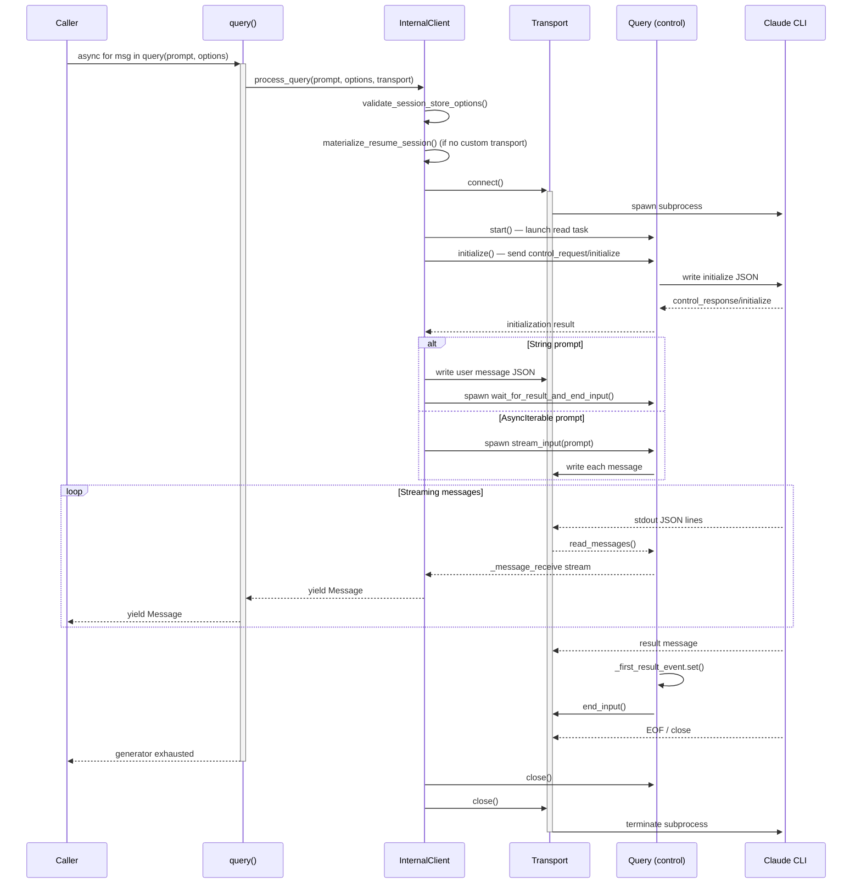
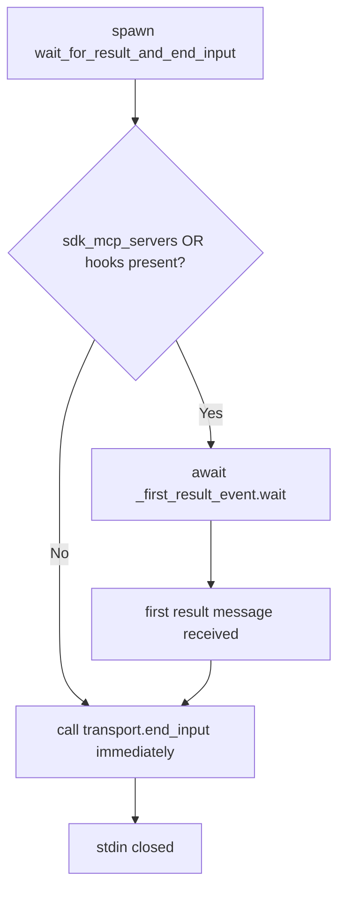
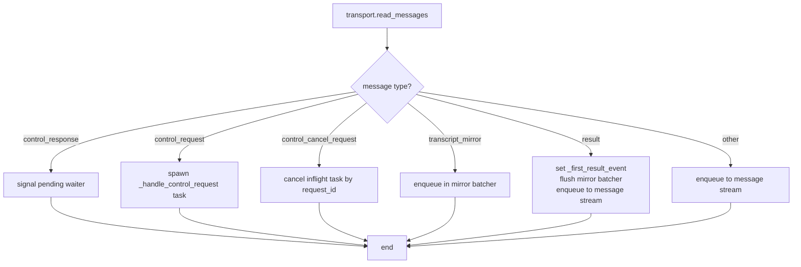

# Query API (One-Shot Requests)

The `query()` function is the primary entry point for stateless, one-shot interactions with Claude Code in the `claude-agent-sdk-python` SDK. It provides a simple async generator interface that accepts a prompt (either a plain string or an async iterable of message dicts), executes the request through the underlying transport and control protocol, and yields typed `Message` objects back to the caller. Unlike the `ClaudeSDKClient`, `query()` is designed for fire-and-forget workloads where all inputs are known upfront and no mid-conversation intervention is required.

Sources: [src/claude_agent_sdk/query.py:1-130](../../../src/claude_agent_sdk/query.py#L1-L130)

---

## Overview and Design Goals

The `query()` function is intentionally minimal. It wraps an `InternalClient` instance and delegates all heavy lifting to `InternalClient.process_query()`. The public surface area is a single async generator function with three parameters.

| Parameter | Type | Required | Description |
|-----------|------|----------|-------------|
| `prompt` | `str \| AsyncIterable[dict]` | Yes | The user prompt. A plain `str` for single-shot queries; an `AsyncIterable[dict]` for streaming/multi-message input. |
| `options` | `ClaudeAgentOptions \| None` | No | Configuration object. Defaults to `ClaudeAgentOptions()` if `None`. |
| `transport` | `Transport \| None` | No | Optional custom transport. If omitted, `SubprocessCLITransport` is used automatically. |

Sources: [src/claude_agent_sdk/query.py:10-18](../../../src/claude_agent_sdk/query.py#L10-L18)

### When to Use `query()` vs `ClaudeSDKClient`

The docstring explicitly describes the intended use cases for each interface:

| Scenario | Use `query()` | Use `ClaudeSDKClient` |
|----------|--------------|----------------------|
| Simple one-off questions | ✅ | — |
| Batch processing independent prompts | ✅ | — |
| Code generation / analysis | ✅ | — |
| Automated scripts / CI-CD pipelines | ✅ | — |
| All inputs known upfront | ✅ | — |
| Interactive chat / REPL-like interfaces | — | ✅ |
| Follow-up messages based on responses | — | ✅ |
| Mid-conversation interrupts | — | ✅ |
| Long-running sessions with state | — | ✅ |

Sources: [src/claude_agent_sdk/query.py:28-60](../../../src/claude_agent_sdk/query.py#L28-L60)

---

## Architecture and Call Flow

The following diagram illustrates the end-to-end call flow when a caller invokes `query()`.



Sources: [src/claude_agent_sdk/query.py:110-130](../../../src/claude_agent_sdk/query.py#L110-L130), [src/claude_agent_sdk/_internal/client.py:60-170](../../../src/claude_agent_sdk/_internal/client.py#L60-L170)

---

## The `query()` Function

### Function Signature

```python
async def query(
    *,
    prompt: str | AsyncIterable[dict[str, Any]],
    options: ClaudeAgentOptions | None = None,
    transport: Transport | None = None,
) -> AsyncIterator[Message]:
```

All parameters are keyword-only (enforced by the bare `*`). The function is an async generator — callers must use `async for` to consume it.

Sources: [src/claude_agent_sdk/query.py:10-18](../../../src/claude_agent_sdk/query.py#L10-L18)

### Default Options Handling

If `options` is `None`, the function substitutes a default `ClaudeAgentOptions()` instance before passing it downstream. This means all `ClaudeAgentOptions` fields take their declared defaults.

```python
if options is None:
    options = ClaudeAgentOptions()
```

Sources: [src/claude_agent_sdk/query.py:109-110](../../../src/claude_agent_sdk/query.py#L109-L110)

### Transport Selection

When no `transport` is provided, `InternalClient._process_query_inner()` automatically creates a `SubprocessCLITransport` configured with the prompt and resolved options. Supplying a custom `Transport` bypasses subprocess creation entirely, which is useful for testing or alternative execution environments.

```python
if transport is not None:
    chosen_transport = transport
else:
    chosen_transport = SubprocessCLITransport(
        prompt=prompt,
        options=configured_options,
    )
```

Sources: [src/claude_agent_sdk/_internal/client.py:100-106](../../../src/claude_agent_sdk/_internal/client.py#L100-L106)

---

## Prompt Modes

### String Prompt (Single-Shot)

When `prompt` is a `str`, the client writes a single JSON user message to stdin after the initialization handshake:

```python
user_message = {
    "type": "user",
    "session_id": "",
    "message": {"role": "user", "content": prompt},
    "parent_tool_use_id": None,
}
await chosen_transport.write(json.dumps(user_message) + "\n")
query.spawn_task(query.wait_for_result_and_end_input())
```

The `wait_for_result_and_end_input()` task is spawned concurrently. It keeps stdin open until the first `result` message arrives (required when SDK MCP servers or hooks are active) and then calls `transport.end_input()`.

Sources: [src/claude_agent_sdk/_internal/client.py:140-152](../../../src/claude_agent_sdk/_internal/client.py#L140-L152)

### AsyncIterable Prompt (Streaming Input)

When `prompt` is an `AsyncIterable[dict]`, each yielded dict is serialized and written to stdin in sequence via `Query.stream_input()`:

```python
elif isinstance(prompt, AsyncIterable):
    query.spawn_task(query.stream_input(prompt))
```

Each dict in the iterable should follow the structure:

```json
{
    "type": "user",
    "message": {"role": "user", "content": "..."},
    "parent_tool_use_id": null,
    "session_id": "..."
}
```

After all messages are exhausted, `stream_input()` calls `wait_for_result_and_end_input()` to properly close stdin.

Sources: [src/claude_agent_sdk/_internal/client.py:153-155](../../../src/claude_agent_sdk/_internal/client.py#L153-L155), [src/claude_agent_sdk/_internal/query.py:295-307](../../../src/claude_agent_sdk/_internal/query.py#L295-L307), [src/claude_agent_sdk/query.py:72-87](../../../src/claude_agent_sdk/query.py#L72-L87)

### `can_use_tool` Constraint

If `options.can_use_tool` is set, the prompt **must** be an `AsyncIterable` — a plain string prompt raises `ValueError` immediately. Additionally, `can_use_tool` and `permission_prompt_tool_name` are mutually exclusive; combining them also raises `ValueError`.

Sources: [src/claude_agent_sdk/_internal/client.py:66-82](../../../src/claude_agent_sdk/_internal/client.py#L66-L82)

---

## Initialization Handshake

Before any user message is sent, `Query.initialize()` performs a control protocol handshake with the CLI. This always runs in streaming mode internally (even for string prompts), ensuring that agents, hooks, SDK MCP servers, and other configuration are properly registered.

### Initialize Request Fields

| Field | Condition | Description |
|-------|-----------|-------------|
| `subtype` | Always `"initialize"` | Identifies the request type |
| `hooks` | When hooks are configured | Hook matcher configs with callback IDs |
| `agents` | When `options.agents` is set | Agent definitions dict |
| `excludeDynamicSections` | When using a `SystemPromptPreset` with the flag set | Preset system prompt flag |
| `skills` | When `options.skills` is a `list` | Skill allowlist (omitted for `None` or `"all"`) |

```python
request: dict[str, Any] = {
    "subtype": "initialize",
    "hooks": hooks_config if hooks_config else None,
}
if self._agents:
    request["agents"] = self._agents
if self._exclude_dynamic_sections is not None:
    request["excludeDynamicSections"] = self._exclude_dynamic_sections
if isinstance(self._skills, list):
    request["skills"] = self._skills
```

Sources: [src/claude_agent_sdk/_internal/query.py:144-165](../../../src/claude_agent_sdk/_internal/query.py#L144-L165)

### Initialize Timeout

The initialize timeout defaults to 60 seconds but is overridden by the `CLAUDE_CODE_STREAM_CLOSE_TIMEOUT` environment variable (in milliseconds), with a floor of 60 seconds:

```python
initialize_timeout_ms = int(
    os.environ.get("CLAUDE_CODE_STREAM_CLOSE_TIMEOUT", "60000")
)
initialize_timeout = max(initialize_timeout_ms / 1000.0, 60.0)
```

Sources: [src/claude_agent_sdk/_internal/client.py:118-121](../../../src/claude_agent_sdk/_internal/client.py#L118-L121)

---

## Stdin Lifecycle and `wait_for_result_and_end_input()`

A critical design concern is when to close stdin (call `transport.end_input()`). Closing too early prevents the control protocol from receiving responses to hook callbacks or SDK MCP server requests.



The `_first_result_event` is an `anyio.Event` set in two places:
1. When a `result`-type message is read from the transport (normal path).
2. In the `_read_messages()` `finally` block (early-exit / error path), ensuring the event always fires and `wait_for_result_and_end_input()` never hangs indefinitely.

Sources: [src/claude_agent_sdk/_internal/query.py:272-290](../../../src/claude_agent_sdk/_internal/query.py#L272-L290), [src/claude_agent_sdk/_internal/query.py:224-232](../../../src/claude_agent_sdk/_internal/query.py#L224-L232), [tests/test_query.py:118-155](../../../tests/test_query.py#L118-L155)

---

## Message Routing and the Read Loop

`Query._read_messages()` runs as a background `asyncio.Task` (started by `Query.start()`). It reads raw JSON dicts from the transport and routes them by `type`:



Only non-control, non-mirror messages reach the `_message_receive` stream that `receive_messages()` exposes to `_process_query_inner()`, which in turn yields them to `query()` and ultimately to the caller.

Sources: [src/claude_agent_sdk/_internal/query.py:183-243](../../../src/claude_agent_sdk/_internal/query.py#L183-L243)

### Control Request Handling

When the CLI sends a `control_request` (e.g., for hook callbacks or SDK MCP server calls), `_spawn_control_request_handler()` creates a tracked `asyncio.Task` stored in `_inflight_requests`. This enables cancellation via `control_cancel_request` messages:

```python
elif msg_type == "control_cancel_request":
    cancel_id = message.get("request_id")
    if cancel_id:
        inflight = self._inflight_requests.pop(cancel_id, None)
        if inflight:
            inflight.cancel()
```

Cancelled tasks do **not** write a response — the `asyncio.CancelledError` is re-raised without sending anything to the CLI.

Sources: [src/claude_agent_sdk/_internal/query.py:204-211](../../../src/claude_agent_sdk/_internal/query.py#L204-L211), [src/claude_agent_sdk/_internal/query.py:330-336](../../../src/claude_agent_sdk/_internal/query.py#L330-L336), [tests/test_query.py:267-320](../../../tests/test_query.py#L267-L320)

---

## Yielded Message Types

`query()` yields `Message` objects parsed by `parse_message()`. The two most commonly observed types in examples and tests are:

| Message Type | Class | Description |
|-------------|-------|-------------|
| `assistant` | `AssistantMessage` | Claude's response, containing a list of content blocks |
| `result` | `ResultMessage` | Final summary including `total_cost_usd`, `num_turns`, `session_id`, etc. |

Content blocks within `AssistantMessage` include `TextBlock` (and potentially others). Callers typically pattern-match on message type and block type:

```python
async for message in query(prompt="What is 2 + 2?"):
    if isinstance(message, AssistantMessage):
        for block in message.content:
            if isinstance(block, TextBlock):
                print(f"Claude: {block.text}")
    elif isinstance(message, ResultMessage) and message.total_cost_usd > 0:
        print(f"Cost: ${message.total_cost_usd:.4f}")
```

Sources: [examples/quick_start.py:16-28](../../../examples/quick_start.py#L16-L28), [examples/quick_start.py:56-60](../../../examples/quick_start.py#L56-L60), [tests/test_query.py:84-96](../../../tests/test_query.py#L84-L96)

---

## ClaudeAgentOptions Reference

The `options` parameter accepts a `ClaudeAgentOptions` instance. Key fields relevant to `query()` usage:

| Field | Type | Description |
|-------|------|-------------|
| `system_prompt` | `str \| dict` | Custom or preset system prompt |
| `max_turns` | `int \| None` | Maximum conversation turns |
| `allowed_tools` | `list[str] \| None` | Whitelist of tool names Claude may use |
| `permission_mode` | `PermissionMode \| None` | Tool execution permission strategy |
| `cwd` | `str \| None` | Working directory for the subprocess |
| `mcp_servers` | `dict \| None` | MCP server configurations (including SDK-type servers) |
| `hooks` | `dict[HookEvent, list[HookMatcher]] \| None` | Pre/post tool-use hook callbacks |
| `can_use_tool` | `Callable \| None` | Per-call tool permission callback (requires `AsyncIterable` prompt) |
| `agents` | `dict \| None` | Agent definitions forwarded via initialize |
| `skills` | `list[str] \| "all" \| None` | Skill allowlist for system prompt filtering |
| `session_store` | `SessionStore \| None` | Persistent session store for transcript mirroring |

Sources: [examples/quick_start.py:30-60](../../../examples/quick_start.py#L30-L60), [src/claude_agent_sdk/_internal/client.py:60-165](../../../src/claude_agent_sdk/_internal/client.py#L60-L165)

### Permission Mode Values

| Value | Behavior |
|-------|----------|
| `'default'` | CLI prompts for dangerous tools |
| `'acceptEdits'` | Auto-accept file edits |
| `'plan'` | Plan-only mode, no tool execution |
| `'bypassPermissions'` | Allow all tools (use with caution) |
| `'dontAsk'` | Deny anything not pre-approved |
| `'auto'` | Model classifier approves/denies each tool call |

Sources: [src/claude_agent_sdk/query.py:38-46](../../../src/claude_agent_sdk/query.py#L38-L46)

---

## Resource Cleanup

`query()` guarantees cleanup on all exit paths — normal completion, `break` from the caller, or exceptions — through explicit `aclose()` calls in `InternalClient.process_query()`:

```python
try:
    async for msg in inner:
        yield msg
finally:
    try:
        await inner.aclose()
    finally:
        if materialized is not None:
            await materialized.cleanup()
```

`inner.aclose()` triggers `Query.close()`, which cancels all child tasks (including in-flight control request handlers), cancels the read task, and calls `transport.close()` to terminate the subprocess. The `materialized` temp directory (used for session resume) is cleaned up only after the subprocess exits.

Sources: [src/claude_agent_sdk/_internal/client.py:43-58](../../../src/claude_agent_sdk/_internal/client.py#L43-L58), [src/claude_agent_sdk/_internal/query.py:358-369](../../../src/claude_agent_sdk/_internal/query.py#L358-L369)

### Cross-Task Close Safety

`Query.close()` is safe to call from a different `asyncio` task than the one that called `start()`. This handles the case where Python finalizes an async generator in a different task context (e.g., when the caller breaks out of the `async for` loop).

Sources: [tests/test_query.py:217-255](../../../tests/test_query.py#L217-L255)

---

## Usage Examples

### Basic One-Shot Query

```python
import anyio
from claude_agent_sdk import query, AssistantMessage, TextBlock

async def main():
    async for message in query(prompt="What is 2 + 2?"):
        if isinstance(message, AssistantMessage):
            for block in message.content:
                if isinstance(block, TextBlock):
                    print(f"Claude: {block.text}")

anyio.run(main)
```

Sources: [examples/quick_start.py:13-27](../../../examples/quick_start.py#L13-L27)

### Query with Options

```python
from claude_agent_sdk import query, ClaudeAgentOptions, AssistantMessage, TextBlock

options = ClaudeAgentOptions(
    system_prompt="You are a helpful assistant that explains things simply.",
    max_turns=1,
)

async for message in query(
    prompt="Explain what Python is in one sentence.",
    options=options,
):
    if isinstance(message, AssistantMessage):
        for block in message.content:
            if isinstance(block, TextBlock):
                print(f"Claude: {block.text}")
```

Sources: [examples/quick_start.py:30-45](../../../examples/quick_start.py#L30-L45)

### Query with Tool Access

```python
from claude_agent_sdk import query, ClaudeAgentOptions, AssistantMessage, ResultMessage, TextBlock

options = ClaudeAgentOptions(
    allowed_tools=["Read", "Write"],
    system_prompt="You are a helpful file assistant.",
)

async for message in query(
    prompt="Create a file called hello.txt with 'Hello, World!' in it",
    options=options,
):
    if isinstance(message, AssistantMessage):
        for block in message.content:
            if isinstance(block, TextBlock):
                print(f"Claude: {block.text}")
    elif isinstance(message, ResultMessage) and message.total_cost_usd > 0:
        print(f"Cost: ${message.total_cost_usd:.4f}")
```

Sources: [examples/quick_start.py:48-64](../../../examples/quick_start.py#L48-L64)

### Streaming (AsyncIterable) Prompt

```python
async def prompts():
    yield {"type": "user", "message": {"role": "user", "content": "Hello"}}
    yield {"type": "user", "message": {"role": "user", "content": "How are you?"}}

async for message in query(prompt=prompts()):
    print(message)
```

Sources: [src/claude_agent_sdk/query.py:80-87](../../../src/claude_agent_sdk/query.py#L80-L87)

---

## Summary

The `query()` function provides a clean, stateless interface for one-shot Claude Code interactions. It delegates to `InternalClient.process_query()`, which handles transport selection, session materialization, the initialization handshake, prompt dispatch (string or async iterable), control protocol routing (hooks, SDK MCP servers, tool permissions), and deterministic cleanup. The stdin lifecycle — particularly the `wait_for_result_and_end_input()` mechanism — ensures that bidirectional control protocol communication remains functional throughout the response without imposing arbitrary timeouts. For interactive or stateful use cases, the `ClaudeSDKClient` should be used instead.

Sources: [src/claude_agent_sdk/query.py](../../../src/claude_agent_sdk/query.py), [src/claude_agent_sdk/_internal/client.py](../../../src/claude_agent_sdk/_internal/client.py), [src/claude_agent_sdk/_internal/query.py](../../../src/claude_agent_sdk/_internal/query.py), [examples/quick_start.py](../../../examples/quick_start.py), [tests/test_query.py](../../../tests/test_query.py)