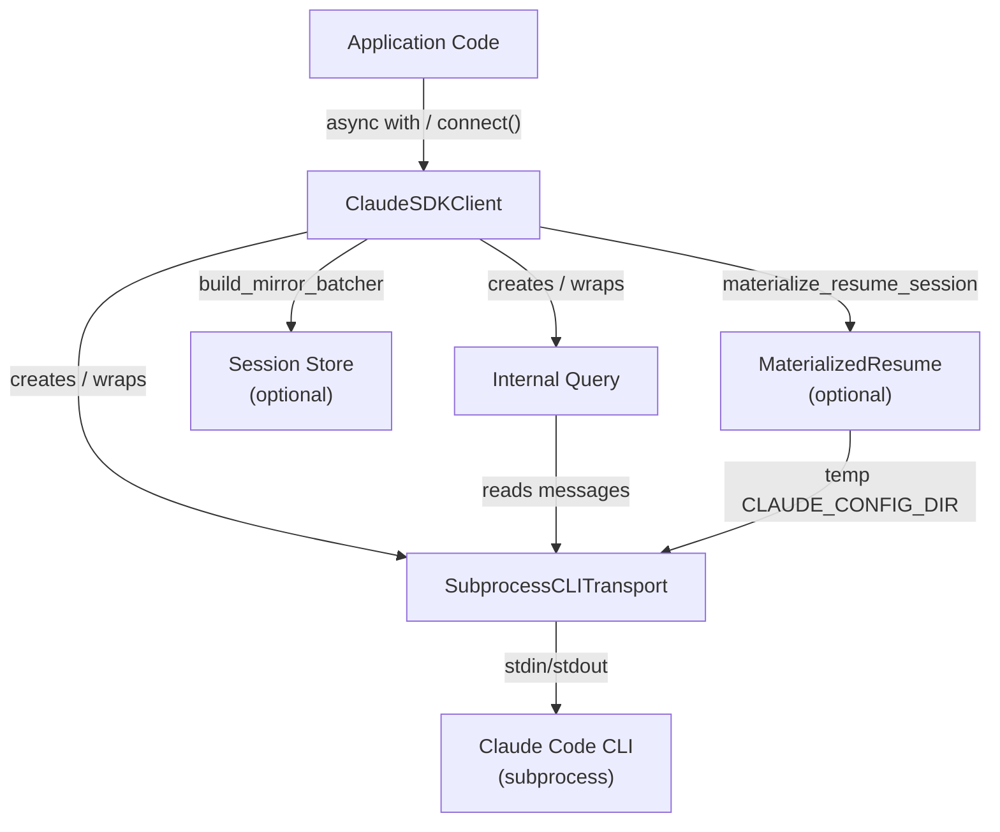
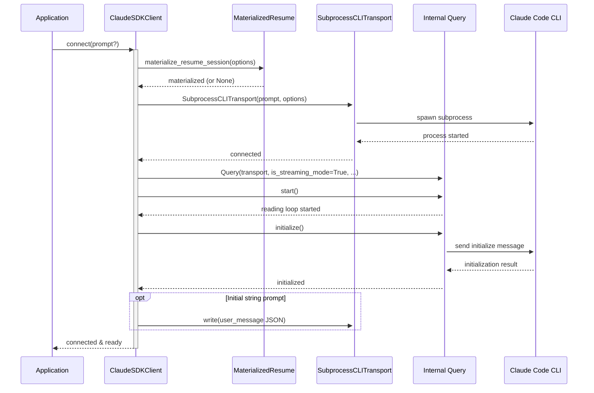
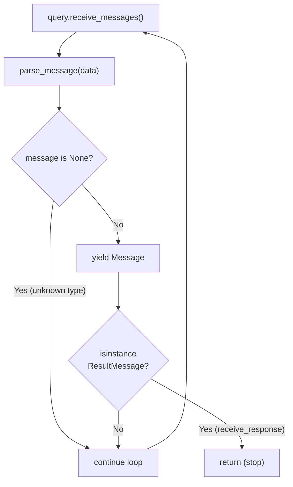

# Streaming Client (Bidirectional Conversations)

The `ClaudeSDKClient` is the primary interface for building stateful, interactive applications on top of the Claude Agent SDK. Unlike the simpler `query()` function — which handles a single prompt end-to-end — `ClaudeSDKClient` keeps a persistent connection open, allowing you to send follow-up messages, react to Claude's responses in real time, and exercise fine-grained control over the conversation lifecycle (interrupts, model switching, permission changes, and more).

The client is built on top of an internal `Query` object and a `Transport` layer (typically `SubprocessCLITransport`), always operating in **streaming mode**. This makes it the right choice for chat interfaces, multi-turn debugging sessions, and any scenario where inputs are not fully known upfront.

---

## Architecture Overview

The following diagram shows how the public `ClaudeSDKClient` relates to the internal components it orchestrates.



Sources: [src/claude_agent_sdk/client.py:1-50](../../../src/claude_agent_sdk/client.py#L1-L50), [src/claude_agent_sdk/_internal/client.py:1-50](../../../src/claude_agent_sdk/_internal/client.py#L1-L50)

---

## Class: `ClaudeSDKClient`

`ClaudeSDKClient` is defined in `src/claude_agent_sdk/client.py`. It is the public-facing streaming client.

### Constructor

```python
ClaudeSDKClient(
    options: ClaudeAgentOptions | None = None,
    transport: Transport | None = None,
)
```

| Parameter   | Type                          | Default | Description                                                                                          |
|-------------|-------------------------------|---------|------------------------------------------------------------------------------------------------------|
| `options`   | `ClaudeAgentOptions \| None`  | `None`  | Configuration for the session (model, tools, system prompt, hooks, session store, etc.). Defaults to `ClaudeAgentOptions()`. |
| `transport` | `Transport \| None`           | `None`  | Optional custom transport. If omitted, a `SubprocessCLITransport` is created automatically.          |

Sources: [src/claude_agent_sdk/client.py:85-100](../../../src/claude_agent_sdk/client.py#L85-L100)

### When to Use `ClaudeSDKClient` vs `query()`

The docstring on `ClaudeSDKClient` provides explicit guidance:

| Scenario                                      | Use `ClaudeSDKClient` | Use `query()` |
|-----------------------------------------------|-----------------------|---------------|
| Building chat / conversational UIs            | ✅                     |               |
| Multi-turn conversations with context         | ✅                     |               |
| Reacting to Claude's responses interactively  | ✅                     |               |
| Interrupt / session control needed            | ✅                     |               |
| Simple one-off questions                      |                       | ✅             |
| Batch processing of prompts                   |                       | ✅             |
| All inputs known upfront                      |                       | ✅             |
| Stateless fire-and-forget automation          |                       | ✅             |

Sources: [src/claude_agent_sdk/client.py:40-82](../../../src/claude_agent_sdk/client.py#L40-L82)

---

## Lifecycle: Connect, Use, Disconnect

### Async Context Manager (Recommended)

The simplest way to use `ClaudeSDKClient` is as an async context manager. `__aenter__` calls `connect()` with no initial prompt (an empty async iterable keeps the connection open), and `__aexit__` always calls `disconnect()`.

```python
async with ClaudeSDKClient(options=ClaudeAgentOptions(model="claude-sonnet-4-5")) as client:
    await client.query("What's 15 + 27?")
    async for msg in client.receive_response():
        ...
```

Sources: [src/claude_agent_sdk/client.py:295-302](../../../src/claude_agent_sdk/client.py#L295-L302), [examples/streaming_mode_trio.py:40-56](../../../examples/streaming_mode_trio.py#L40-L56)

### Manual Connect / Disconnect

For persistent clients (e.g., in IPython sessions), you can manage the lifecycle manually:

```python
client = ClaudeSDKClient()
await client.connect()

await client.query("What's 2+2?")
async for msg in client.receive_response():
    ...

await client.disconnect()
```

Sources: [examples/streaming_mode_ipython.py:42-60](../../../examples/streaming_mode_ipython.py#L42-L60)

### Connection Sequence

The following sequence diagram shows what happens internally during `connect()`:



Sources: [src/claude_agent_sdk/client.py:102-200](../../../src/claude_agent_sdk/client.py#L102-L200)

### `_connect_inner` Details

Inside `_connect_inner`, the client:

1. Validates `can_use_tool` / `permission_prompt_tool_name` mutual exclusivity.
2. Applies materialized session options (for `session_store` resume).
3. Creates or reuses the transport and calls `transport.connect()`.
4. Extracts SDK MCP servers from `options.mcp_servers`.
5. Reads `CLAUDE_CODE_STREAM_CLOSE_TIMEOUT` (milliseconds) from the environment, converts to seconds, and enforces a minimum of 60 seconds as `initialize_timeout`.
6. Creates a `Query` instance always with `is_streaming_mode=True`.
7. Optionally attaches a transcript mirror batcher for `session_store`.
8. Calls `query.start()` then `query.initialize()`.
9. If a string prompt was provided to `connect()`, writes it as a user message to the transport.

Sources: [src/claude_agent_sdk/client.py:138-200](../../../src/claude_agent_sdk/client.py#L138-L200)

---

## Sending Messages: `query()`

```python
await client.query(prompt: str | AsyncIterable[dict[str, Any]], session_id: str = "default")
```

`query()` sends a new user message into the open conversation stream. It does **not** wait for a response — receiving is handled separately via `receive_response()` or `receive_messages()`.

| Parameter    | Type                                        | Default     | Description                                                    |
|--------------|---------------------------------------------|-------------|----------------------------------------------------------------|
| `prompt`     | `str \| AsyncIterable[dict[str, Any]]`      | *(required)*| String message or async iterable of raw message dicts.         |
| `session_id` | `str`                                       | `"default"` | Session identifier attached to each outbound message.          |

**String prompt** — wrapped in a `user` message envelope and written to the transport as a single JSON line:

```python
message = {
    "type": "user",
    "message": {"role": "user", "content": prompt},
    "parent_tool_use_id": None,
    "session_id": session_id,
}
await self._transport.write(json.dumps(message) + "\n")
```

**AsyncIterable prompt** — each dict yielded by the iterable is written directly to the transport (with `session_id` injected if absent).

Sources: [src/claude_agent_sdk/client.py:218-244](../../../src/claude_agent_sdk/client.py#L218-L244)

### Async Iterable Prompt Example

```python
async def message_generator():
    yield {
        "type": "user",
        "message": {"role": "user", "content": "What is 25 * 4?"},
        "parent_tool_use_id": None,
        "session_id": "math-session"
    }

async with ClaudeSDKClient() as client:
    await client.query(message_generator())
    async for msg in client.receive_response():
        ...
```

Sources: [examples/streaming_mode_ipython.py:100-135](../../../examples/streaming_mode_ipython.py#L100-L135)

---

## Receiving Messages

### `receive_response()` — Single-Turn Helper

```python
async for msg in client.receive_response():
    ...
```

Yields messages until (and including) the first `ResultMessage`, then stops. This is the idiomatic method for single-turn request/response cycles.

```python
async def receive_response(self) -> AsyncIterator[Message]:
    async for message in self.receive_messages():
        yield message
        if isinstance(message, ResultMessage):
            return
```

Sources: [src/claude_agent_sdk/client.py:278-293](../../../src/claude_agent_sdk/client.py#L278-L293)

### `receive_messages()` — Continuous Stream

```python
async for msg in client.receive_messages():
    ...
```

Yields all messages without stopping at `ResultMessage`. Use this for concurrent patterns where you want to keep listening across multiple turns, or where you need to handle interrupts.

Sources: [src/claude_agent_sdk/client.py:207-216](../../../src/claude_agent_sdk/client.py#L207-L216)

### Message Types

| Type               | Description                                                                  |
|--------------------|------------------------------------------------------------------------------|
| `UserMessage`      | Echo of the user's input (may contain `TextBlock` or `ToolResultBlock`).     |
| `AssistantMessage` | Claude's reply (may contain `TextBlock` or `ToolUseBlock`).                  |
| `SystemMessage`    | System-level notifications (typically ignored in display logic).             |
| `ResultMessage`    | Signals end of a turn; includes cost, duration, session ID, and turn count.  |

Sources: [examples/streaming_mode.py:28-45](../../../examples/streaming_mode.py#L28-L45), [examples/streaming_mode_trio.py:19-37](../../../examples/streaming_mode_trio.py#L19-L37)

### Receiving Flow



Sources: [src/claude_agent_sdk/client.py:207-293](../../../src/claude_agent_sdk/client.py#L207-L293)

---

## Multi-Turn Conversation Pattern

The most common usage pattern is sequential query/receive pairs within a single `async with` block. The persistent connection maintains conversation context automatically.

```python
async with ClaudeSDKClient(
    options=ClaudeAgentOptions(model="claude-sonnet-4-5")
) as client:
    # Turn 1
    await client.query("What's 15 + 27?")
    async for msg in client.receive_response():
        display_message(msg)

    # Turn 2 — Claude retains context from Turn 1
    await client.query("Now multiply that result by 2")
    async for msg in client.receive_response():
        display_message(msg)

    # Turn 3
    await client.query("Divide that by 7 and round to 2 decimal places")
    async for msg in client.receive_response():
        display_message(msg)
```

Sources: [examples/streaming_mode_trio.py:40-66](../../../examples/streaming_mode_trio.py#L40-L66), [examples/streaming_mode.py:70-88](../../../examples/streaming_mode.py#L70-L88)

---

## Concurrent Sending and Receiving

For real-time applications, you can run a background task consuming `receive_messages()` while sending new queries:

```python
async with ClaudeSDKClient() as client:
    async def receive_messages():
        async for message in client.receive_messages():
            display_message(message)

    receive_task = asyncio.create_task(receive_messages())

    for question in ["What is 2+2?", "What is sqrt(144)?", "What is 10% of 80?"]:
        await client.query(question)
        await asyncio.sleep(3)

    receive_task.cancel()
```

Sources: [examples/streaming_mode.py:92-118](../../../examples/streaming_mode.py#L92-L118)

---

## Interrupt Support

`ClaudeSDKClient` supports sending interrupt signals to a running Claude task via `interrupt()`. **Critically, interrupts require active message consumption** — the message loop must be running for the interrupt to be processed.

```python
async with ClaudeSDKClient() as client:
    await client.query("Count from 1 to 100 slowly")

    async def consume_messages():
        async for message in client.receive_response():
            display_message(message)

    consume_task = asyncio.create_task(consume_messages())

    await asyncio.sleep(2)
    await client.interrupt()   # Signal Claude to stop

    await consume_task

    # Send a new query after the interrupt
    await client.query("Just tell me a quick joke")
    async for msg in client.receive_response():
        display_message(msg)
```

Sources: [examples/streaming_mode.py:122-158](../../../examples/streaming_mode.py#L122-L158), [examples/streaming_mode_ipython.py:64-99](../../../examples/streaming_mode_ipython.py#L64-L99)

### Interrupt Sequence

```mermaid
sequenceDiagram
    participant App as Application
    participant Client as ClaudeSDKClient
    participant Query as Internal Query
    participant CLI as Claude Code CLI

    App->>Client: query("long task")
    Client->>CLI: write user message

    par Background consumption
        App->>+Client: receive_response() loop
        CLI-->>Client: AssistantMessage (partial)
        Client-->>App: yield AssistantMessage
    and Interrupt after delay
        App->>App: asyncio.sleep(2)
        App->>Client: interrupt()
        Client->>Query: interrupt()
        Query->>CLI: send interrupt signal
        CLI-->>Query: ResultMessage (interrupted)
        Query-->>Client: ResultMessage
        Client-->>App: yield ResultMessage
        App->>-Client: loop ends
    end

    App->>Client: query("new message")
    CLI-->>Client: AssistantMessage
    Client-->>App: yield AssistantMessage
```

Sources: [src/claude_agent_sdk/client.py:246-249](../../../src/claude_agent_sdk/client.py#L246-L249), [examples/streaming_mode.py:122-158](../../../examples/streaming_mode.py#L122-L158)

---

## Control Methods

Beyond basic messaging, `ClaudeSDKClient` exposes several control methods that delegate to the internal `Query` object. All of these require an active connection (raise `CLIConnectionError` otherwise) and only work in streaming mode.

| Method                                          | Description                                                                                     |
|-------------------------------------------------|-------------------------------------------------------------------------------------------------|
| `interrupt()`                                   | Sends an interrupt signal to stop the current Claude task.                                      |
| `set_permission_mode(mode: PermissionMode)`     | Dynamically changes the permission mode (e.g., `'acceptEdits'`, `'bypassPermissions'`).        |
| `set_model(model: str \| None)`                 | Switches the AI model mid-conversation.                                                         |
| `rewind_files(user_message_id: str)`            | Reverts tracked files to their state at a specific user message (requires file checkpointing).  |
| `reconnect_mcp_server(server_name: str)`        | Reconnects a failed or disconnected MCP server.                                                 |
| `toggle_mcp_server(server_name, enabled: bool)` | Enables or disables an MCP server by name.                                                      |
| `stop_task(task_id: str)`                       | Stops a running background task; emits a `task_notification` with status `'stopped'`.          |
| `get_mcp_status()`                              | Returns live MCP server connection statuses.                                                    |
| `get_context_usage()`                           | Returns context window usage breakdown by category.                                             |
| `get_server_info()`                             | Returns initialization info (commands, output styles) captured during `connect()`.              |

Sources: [src/claude_agent_sdk/client.py:246-290](../../../src/claude_agent_sdk/client.py#L246-L290)

### Example: Dynamic Permission Mode

```python
async with ClaudeSDKClient() as client:
    await client.query("Help me analyze this codebase")
    async for _ in client.receive_response():
        pass

    # Switch to auto-accept edits for the next turn
    await client.set_permission_mode('acceptEdits')
    await client.query("Now implement the fix we discussed")
    async for msg in client.receive_response():
        display_message(msg)
```

Sources: [src/claude_agent_sdk/client.py:251-274](../../../src/claude_agent_sdk/client.py#L251-L274)

---

## Initialize Timeout

The `initialize_timeout` controls how long the client waits for the CLI to respond to the `initialize` control message. It is derived from the environment variable `CLAUDE_CODE_STREAM_CLOSE_TIMEOUT` (in milliseconds), with a hard minimum of 60 seconds:

```python
initialize_timeout_ms = int(
    os.environ.get("CLAUDE_CODE_STREAM_CLOSE_TIMEOUT", "60000")
)
initialize_timeout = max(initialize_timeout_ms / 1000.0, 60.0)
```

This same logic is applied identically in both `ClaudeSDKClient._connect_inner` and `InternalClient._process_query_inner`.

Sources: [src/claude_agent_sdk/client.py:168-172](../../../src/claude_agent_sdk/client.py#L168-L172), [src/claude_agent_sdk/_internal/client.py:119-123](../../../src/claude_agent_sdk/_internal/client.py#L119-L123), [tests/test_client.py:98-115](../../../tests/test_client.py#L98-L115)

---

## Session Store and Resume

When `options.session_store` is set, `ClaudeSDKClient` integrates with session persistence:

1. **Before connecting**: `materialize_resume_session(options)` loads the stored session into a temporary `CLAUDE_CONFIG_DIR` so the subprocess can resume it.
2. **During the session**: A `TranscriptMirrorBatcher` (built via `build_mirror_batcher`) writes transcript updates back to the store.
3. **On disconnect**: `materialized.cleanup()` removes the temporary directory.

If a custom `transport` is provided, materialization is skipped (the temp dir would never reach the pre-constructed transport).

Sources: [src/claude_agent_sdk/client.py:110-135](../../../src/claude_agent_sdk/client.py#L110-L135), [src/claude_agent_sdk/client.py:182-198](../../../src/claude_agent_sdk/client.py#L182-L198), [src/claude_agent_sdk/client.py:303-309](../../../src/claude_agent_sdk/client.py#L303-L309)

---

## Error Handling

### `CLIConnectionError`

All methods that require an active connection guard against `self._query` being `None` and raise `CLIConnectionError` with a descriptive message if `connect()` has not been called.

### Timeout Handling

Use `asyncio.timeout` (or `trio`'s equivalent) around `receive_response()` to bound wait time:

```python
try:
    async with asyncio.timeout(20.0):
        async for msg in client.receive_response():
            ...
except asyncio.TimeoutError:
    print("Request timed out after 20 seconds")
```

Sources: [examples/streaming_mode_ipython.py:138-155](../../../examples/streaming_mode_ipython.py#L138-L155), [examples/streaming_mode.py:234-264](../../../examples/streaming_mode.py#L234-L264)

### Disconnect Safety

`disconnect()` is always safe to call even if `connect()` failed partway through. The `__aexit__` method always calls `disconnect()` regardless of whether an exception was raised, and `connect()` itself calls `disconnect()` on failure after the subprocess has spawned.

```python
async def disconnect(self) -> None:
    if self._query:
        await self._query.close()
        self._query = None
    self._transport = None
    if self._materialized is not None:
        await self._materialized.cleanup()
        self._materialized = None
```

Sources: [src/claude_agent_sdk/client.py:295-309](../../../src/claude_agent_sdk/client.py#L295-L309)

---

## Trio Compatibility

`ClaudeSDKClient` works with both `asyncio` and `trio` (via `anyio`). The trio usage pattern is identical to asyncio:

```python
import trio
from claude_agent_sdk import ClaudeSDKClient, ClaudeAgentOptions

async def multi_turn_conversation():
    async with ClaudeSDKClient(
        options=ClaudeAgentOptions(model="claude-sonnet-4-5")
    ) as client:
        await client.query("What's 15 + 27?")
        async for message in client.receive_response():
            display_message(message)

trio.run(multi_turn_conversation)
```

**Caveat**: As of v0.0.20, a `ClaudeSDKClient` instance cannot be used across different async runtime contexts (e.g., different trio nurseries or asyncio task groups). All operations must complete within the same async context where `connect()` was called.

Sources: [examples/streaming_mode_trio.py:1-66](../../../examples/streaming_mode_trio.py#L1-L66), [src/claude_agent_sdk/client.py:64-70](../../../src/claude_agent_sdk/client.py#L64-L70)

---

## Relationship to `InternalClient`

`ClaudeSDKClient` is the public streaming client. There is also an `InternalClient` (in `src/claude_agent_sdk/_internal/client.py`) used internally by the `query()` function. Both share the same core logic:

| Aspect                       | `ClaudeSDKClient`                     | `InternalClient`                           |
|------------------------------|---------------------------------------|--------------------------------------------|
| Intended use                 | Interactive, multi-turn conversations | One-shot `query()` function                |
| Connection lifecycle         | Persistent (connect/disconnect)       | Per-query (created and torn down per call) |
| Initial prompt handling      | `connect(prompt?)` or `query()`       | `process_query(prompt, options)`           |
| `is_streaming_mode`          | Always `True`                         | Always `True` internally                  |
| String prompt dispatch       | Written directly via transport        | Written then spawns `wait_for_result_and_end_input` as background task |
| Session store / materialized | Supported                             | Supported                                  |

Sources: [src/claude_agent_sdk/_internal/client.py:1-180](../../../src/claude_agent_sdk/_internal/client.py#L1-L180), [src/claude_agent_sdk/client.py:1-310](../../../src/claude_agent_sdk/client.py#L1-L310), [tests/test_client.py:130-175](../../../tests/test_client.py#L130-L175)

---

## Summary

`ClaudeSDKClient` is the central component for bidirectional, stateful conversations in the Claude Agent SDK. It wraps the internal `Query` and `SubprocessCLITransport` layers behind a clean async API, always operating in streaming mode. Key design points:

- **Persistent connection**: One subprocess per client instance, kept alive across multiple `query()` calls.
- **Separation of send and receive**: `query()` sends without blocking; `receive_response()` / `receive_messages()` consume independently.
- **Interrupt support**: Requires active message consumption to function correctly.
- **Rich control surface**: Permission mode, model switching, MCP server management, file rewinding, and context usage queries are all available mid-session.
- **Safe teardown**: `disconnect()` and `__aexit__` are always safe to call and clean up subprocess, query, and temporary session directories.
- **Async framework agnostic**: Works with both `asyncio` and `trio` via `anyio`.