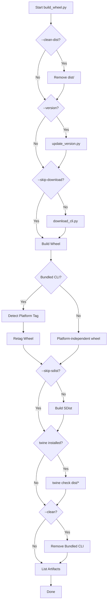
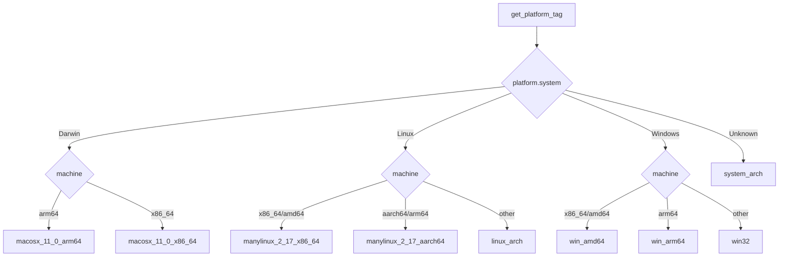
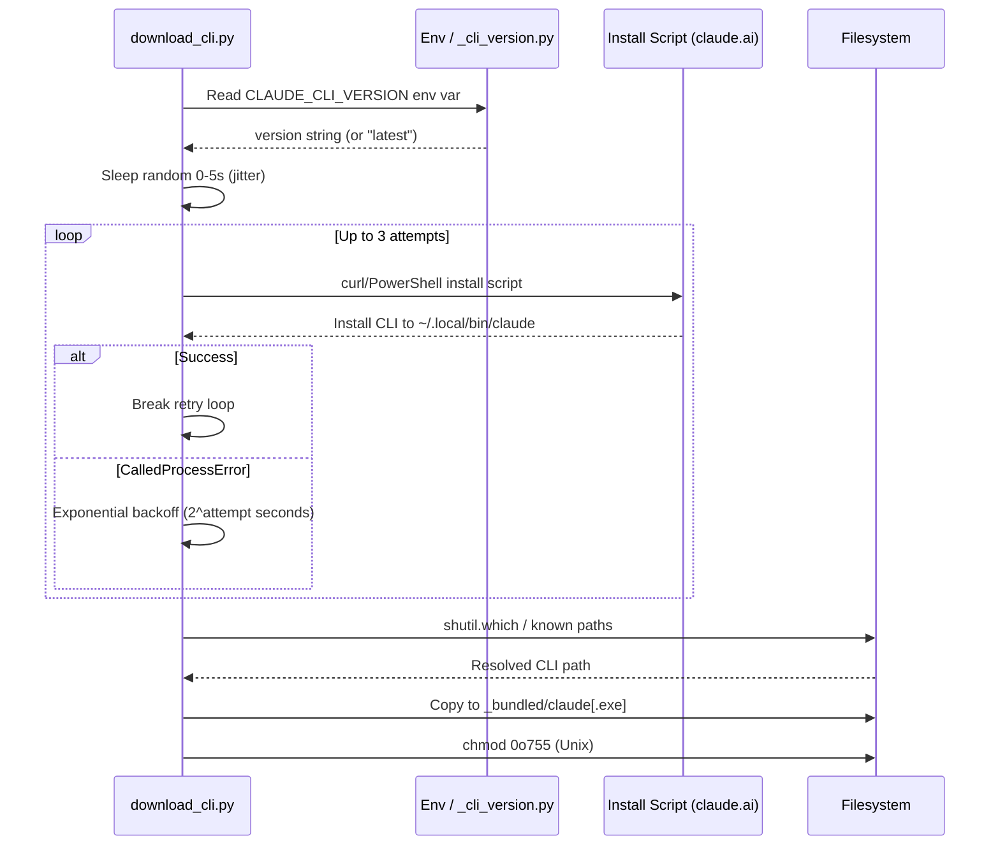
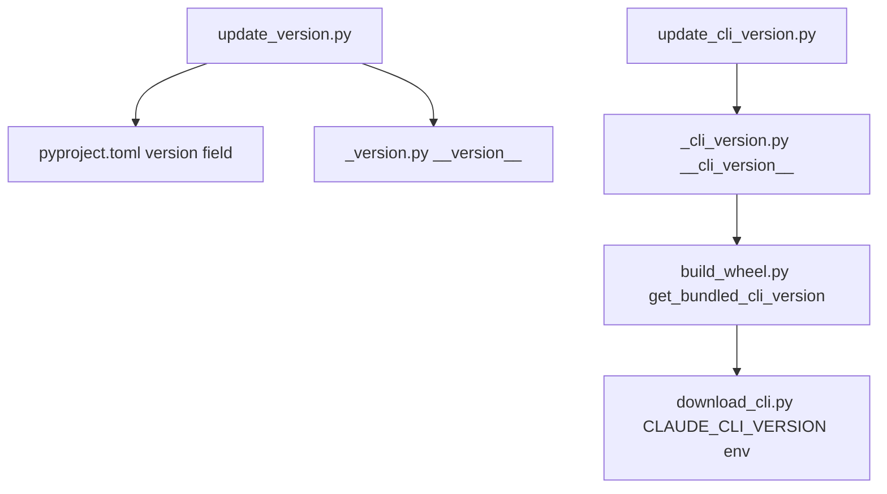
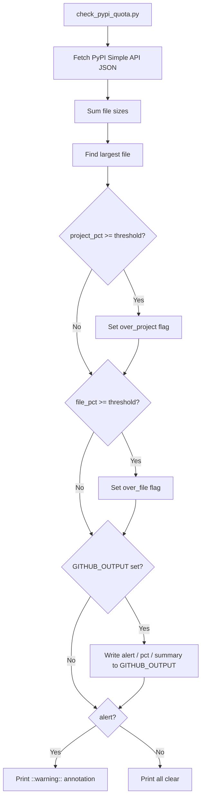

# Build, Release & Scripts

The `claude-agent-sdk-python` project uses a structured set of Python scripts and a `pyproject.toml` configuration to manage the full lifecycle of building, versioning, and releasing the SDK. The build system centers on [Hatchling](https://hatch.pypa.io/) as the PEP 517 backend and coordinates downloading the Claude Code CLI binary, assembling platform-specific wheels, updating version metadata, and monitoring PyPI storage quotas. Understanding these scripts is essential for contributors who need to cut releases, add platform support, or debug CI failures.

---

## Project Configuration (`pyproject.toml`)

The root `pyproject.toml` defines all package metadata, dependency groups, tool configurations, and build targets.

### Build Backend

```toml
[build-system]
requires = ["hatchling"]
build-backend = "hatchling.build"
```

Hatchling is the sole build backend. No `setup.py` or `setup.cfg` is used.

Sources: [pyproject.toml:1-4](../../../pyproject.toml#L1-L4)

### Package Metadata

| Field | Value |
|---|---|
| `name` | `claude-agent-sdk` |
| `version` | `0.1.65` (managed by scripts) |
| `requires-python` | `>=3.10` |
| `license` | MIT |
| `description` | Python SDK for Claude Code |

Sources: [pyproject.toml:6-14](../../../pyproject.toml#L6-L14)

### Dependency Groups

| Group | Key Packages | Purpose |
|---|---|---|
| Core | `anyio>=4.0.0`, `mcp>=0.1.0`, `typing_extensions>=4.0.0` | Runtime dependencies |
| `dev` | `pytest`, `pytest-asyncio`, `mypy`, `ruff`, `pytest-cov` | Development & testing |
| `otel` | `opentelemetry-api>=1.20.0` | Optional OpenTelemetry tracing |
| `examples` | `boto3`, `redis`, `asyncpg`, `moto`, `fakeredis` | Example session store backends |

Sources: [pyproject.toml:27-50](../../../pyproject.toml#L27-L50)

### Wheel and SDist Targets

Hatchling is configured to include only the `src/claude_agent_sdk` package in wheel builds, while source distributions additionally include `tests/`, `examples/`, `README.md`, and `LICENSE`.

```toml
[tool.hatch.build.targets.wheel]
packages = ["src/claude_agent_sdk"]
only-include = ["src/claude_agent_sdk"]

[tool.hatch.build.targets.sdist]
include = ["/src", "/tests", "/examples", "/README.md", "/LICENSE"]
```

Sources: [pyproject.toml:58-68](../../../pyproject.toml#L58-L68)

### Static Analysis & Linting Configuration

| Tool | Key Settings |
|---|---|
| `mypy` | `strict=true`, `python_version="3.10"`, `warn_return_any`, `disallow_untyped_defs` |
| `ruff` | `target-version="py310"`, `line-length=88`, rules: E, W, F, I, N, UP, B, C4, PTH, SIM |
| `ruff.lint.isort` | `known-first-party = ["claude_agent_sdk"]` |

The `opentelemetry` and `opentelemetry.*` modules are excluded from mypy checks because the `otel` extra is optional and its import is guarded by `try/except ImportError` at runtime.

Sources: [pyproject.toml:80-113](../../../pyproject.toml#L80-L113)

---

## Scripts Overview

All automation scripts live in the `scripts/` directory and are standalone Python executables (no package `__init__.py`). They are loaded by path in tests using `importlib.util`.

| Script | Purpose |
|---|---|
| `build_wheel.py` | Orchestrates the full build pipeline |
| `download_cli.py` | Downloads and bundles the Claude Code CLI binary |
| `update_version.py` | Updates SDK version in `pyproject.toml` and `_version.py` |
| `update_cli_version.py` | Updates the pinned CLI version in `_cli_version.py` |
| `check_pypi_quota.py` | Monitors PyPI project storage usage against quota limits |

Sources: [scripts/build_wheel.py](../../../scripts/build_wheel.py), [scripts/download_cli.py](../../../scripts/download_cli.py), [scripts/update_version.py](../../../scripts/update_version.py), [scripts/update_cli_version.py](../../../scripts/update_cli_version.py), [scripts/check_pypi_quota.py](../../../scripts/check_pypi_quota.py)

---

## Build Pipeline (`build_wheel.py`)

`scripts/build_wheel.py` is the primary entry point for producing release artifacts. It coordinates all build steps in a defined sequence.

### Pipeline Flow



Sources: [scripts/build_wheel.py:181-243](../../../scripts/build_wheel.py#L181-L243)

### CLI Arguments

| Argument | Type | Default | Description |
|---|---|---|---|
| `--version` | `str` | None | SDK version to set before building |
| `--cli-version` | `str` | None (reads `_cli_version.py`) | Claude Code CLI version to download |
| `--skip-download` | flag | False | Skip CLI download; use existing binary |
| `--skip-sdist` | flag | False | Skip source distribution build |
| `--clean` | flag | False | Remove bundled CLI after build |
| `--clean-dist` | flag | False | Remove `dist/` before building |

Sources: [scripts/build_wheel.py:188-213](../../../scripts/build_wheel.py#L188-L213)

### Platform Detection and Wheel Retagging

Because the wheel bundles a native CLI binary, it must be tagged as platform-specific rather than `py3-none-any`. After `python -m build --wheel` produces a generic wheel, `build_wheel.py` detects the current platform and calls `retag_wheel()` using the `wheel` package's `tags` subcommand.

#### `get_platform_tag()` Logic



The macOS minimum is pinned to `11.0` (Big Sur) for broad compatibility. Linux uses `manylinux_2_17` for maximum distribution support.

Sources: [scripts/build_wheel.py:78-110](../../../scripts/build_wheel.py#L78-L110)

#### `retag_wheel()` Implementation

```python
result = subprocess.run(
    [sys.executable, "-m", "wheel", "tags",
     "--platform-tag", platform_tag, "--remove", str(wheel_path)],
    capture_output=True, text=True,
)
```

The `--remove` flag deletes the original `*-any.whl` file after creating the platform-tagged copy. If retagging fails, the original wheel path is returned unchanged.

Sources: [scripts/build_wheel.py:113-142](../../../scripts/build_wheel.py#L113-L142)

---

## CLI Download (`download_cli.py`)

`scripts/download_cli.py` fetches the Claude Code CLI binary using the official install script and places it in `src/claude_agent_sdk/_bundled/`.

### Download Flow



Sources: [scripts/download_cli.py:44-96](../../../scripts/download_cli.py#L44-L96), [scripts/download_cli.py:99-126](../../../scripts/download_cli.py#L99-L126)

### Platform-Specific Install Commands

| Platform | Install Command |
|---|---|
| Unix (latest) | `curl -fsSL ... https://claude.ai/install.sh \| bash` |
| Unix (pinned) | `curl ... \| bash -s <version>` |
| Windows (latest) | `powershell -Command "irm https://claude.ai/install.ps1 \| iex"` |
| Windows (pinned) | `powershell -Command "... install.ps1) <version>"` |

The `curl` invocation uses `--retry 5 --retry-delay 2 --retry-all-errors` and `set -o pipefail` to handle transient 429 rate-limit errors that can occur when multiple CI matrix jobs run simultaneously.

Sources: [scripts/download_cli.py:54-82](../../../scripts/download_cli.py#L54-L82)

### CLI Search Locations

`find_installed_cli()` checks the following paths in order, falling back to `shutil.which("claude")`:

| Platform | Locations Checked |
|---|---|
| Unix | `~/.local/bin/claude`, `/usr/local/bin/claude`, `~/node_modules/.bin/claude` |
| Windows | `%USERPROFILE%\.local\bin\claude.exe`, `%LOCALAPPDATA%\Claude\claude.exe` |

Sources: [scripts/download_cli.py:22-43](../../../scripts/download_cli.py#L22-L43)

### Bundle Directory Layout

After a successful download, the bundle directory contains:

```
src/claude_agent_sdk/_bundled/
├── .gitignore
└── claude          # (or claude.exe on Windows)
```

The binary is set to `0o755` on Unix. The `build_wheel.py` checks for `_bundled/claude` or `_bundled/claude.exe` to determine whether to retag the wheel.

Sources: [scripts/download_cli.py:99-126](../../../scripts/download_cli.py#L99-L126), [scripts/build_wheel.py:147-162](../../../scripts/build_wheel.py#L147-L162)

---

## Version Management

Version metadata is maintained in two separate files, each updated by a dedicated script.

### SDK Version (`update_version.py`)

Updates the SDK version string in **two locations** using `re.sub` with `count=1` and `re.MULTILINE` to avoid false matches:

1. `pyproject.toml` — the `version = "..."` field under `[project]`
2. `src/claude_agent_sdk/_version.py` — the `__version__ = "..."` assignment

```bash
python scripts/update_version.py 0.1.66
```

Sources: [scripts/update_version.py:10-31](../../../scripts/update_version.py#L10-L31)

### CLI Version (`update_cli_version.py`)

Updates the pinned Claude Code CLI version in `src/claude_agent_sdk/_cli_version.py`. This version is read by `build_wheel.py` via `get_bundled_cli_version()` when `--cli-version` is not explicitly passed on the command line.

```bash
python scripts/update_cli_version.py 1.2.3
```

```python
# src/claude_agent_sdk/_cli_version.py (after update)
__cli_version__ = "1.2.3"
```

Sources: [scripts/update_cli_version.py:10-24](../../../scripts/update_cli_version.py#L10-L24), [scripts/build_wheel.py:52-63](../../../scripts/build_wheel.py#L52-L63)

### Version Propagation Flow



Sources: [scripts/update_version.py](../../../scripts/update_version.py), [scripts/update_cli_version.py](../../../scripts/update_cli_version.py), [scripts/build_wheel.py:52-63](../../../scripts/build_wheel.py#L52-L63)

---

## PyPI Quota Monitoring (`check_pypi_quota.py`)

Because platform-specific wheels containing a bundled CLI binary can be large, the project includes a quota monitoring script designed to run as a scheduled GitHub Actions job.

### Quota Limits

| Limit | Default Value | Configurable |
|---|---|---|
| Project total (`--project-limit`) | 50 GiB | Yes |
| Per-file (`--file-limit`) | 100 MiB | Yes |
| Warning threshold (`--warn-threshold`) | 80% | Yes |

Sources: [scripts/check_pypi_quota.py:19-21](../../../scripts/check_pypi_quota.py#L19-L21)

### Monitoring Flow



Sources: [scripts/check_pypi_quota.py:43-92](../../../scripts/check_pypi_quota.py#L43-L92)

### GitHub Actions Integration

When `GITHUB_OUTPUT` is set (i.e., running inside a GitHub Actions workflow), the script writes structured outputs:

| Output Key | Type | Description |
|---|---|---|
| `alert` | `true`/`false` | Whether any threshold was crossed |
| `project_pct` | float (3 decimal places) | Project storage fraction used |
| `file_pct` | float (3 decimal places) | Largest file fraction used |
| `summary` | multiline string | Human-readable Slack-ready message |

The summary message uses emoji (`:rotating_light:`) to flag which limits are at risk and advises yanking old releases or requesting a limit increase.

Sources: [scripts/check_pypi_quota.py:65-92](../../../scripts/check_pypi_quota.py#L65-L92)

---

## Testing the Build Scripts

The `tests/test_build_wheel.py` file validates `get_platform_tag()` across all supported platforms using `unittest.mock.patch`. Because `scripts/` is not a Python package, the module is loaded via `importlib.util.spec_from_file_location`.

### Parametrized Platform Tag Tests

```python
@pytest.mark.parametrize(
    "system,machine,expected",
    [
        ("Darwin", "arm64",   "macosx_11_0_arm64"),
        ("Darwin", "x86_64",  "macosx_11_0_x86_64"),
        ("Linux",  "x86_64",  "manylinux_2_17_x86_64"),
        ("Linux",  "amd64",   "manylinux_2_17_x86_64"),
        ("Linux",  "aarch64", "manylinux_2_17_aarch64"),
        ("Linux",  "arm64",   "manylinux_2_17_aarch64"),
        ("Windows","AMD64",   "win_amd64"),
        ("Windows","x86_64",  "win_amd64"),
        ("Windows","ARM64",   "win_arm64"),
    ],
)
def test_platform_tag(self, system, machine, expected):
    with patch("platform.system", return_value=system), \
         patch("platform.machine", return_value=machine):
        assert build_wheel.get_platform_tag() == expected
```

Additional tests verify that unknown Linux architectures produce `linux_<arch>` tags and unknown systems produce `<system>_<arch>` tags, ensuring graceful fallback behavior.

Sources: [tests/test_build_wheel.py:1-62](../../../tests/test_build_wheel.py#L1-L62)

---

## Common Workflows

### Full Release Build

```bash
# Clean, bump version, download latest CLI, build wheel + sdist, verify
python scripts/build_wheel.py \
    --version 0.1.66 \
    --clean-dist \
    --clean
```

### Build with Pinned CLI Version

```bash
python scripts/build_wheel.py --cli-version 1.2.3
```

### Build Using Pre-Downloaded CLI

```bash
python scripts/build_wheel.py --skip-download
```

### Publish to PyPI

```bash
twine upload dist/*
```

Sources: [scripts/build_wheel.py:181-243](../../../scripts/build_wheel.py#L181-L243)

---

## Summary

The build and release system for `claude-agent-sdk-python` is a coordinated set of scripts built around Hatchling as the PEP 517 backend. The central orchestrator (`build_wheel.py`) manages optional version bumping, CLI binary download with retry logic and jitter, platform-specific wheel retagging, sdist generation, and post-build validation via `twine`. Version metadata is kept consistent across `pyproject.toml` and source files through dedicated update scripts, while a quota monitoring script (`check_pypi_quota.py`) provides early warning when PyPI storage limits approach capacity. Platform tagging logic is fully unit-tested against all supported OS and architecture combinations, ensuring reliable cross-platform release artifacts.