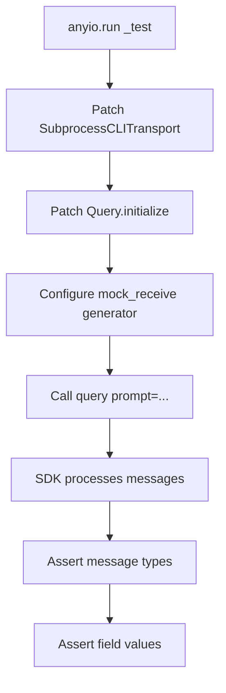
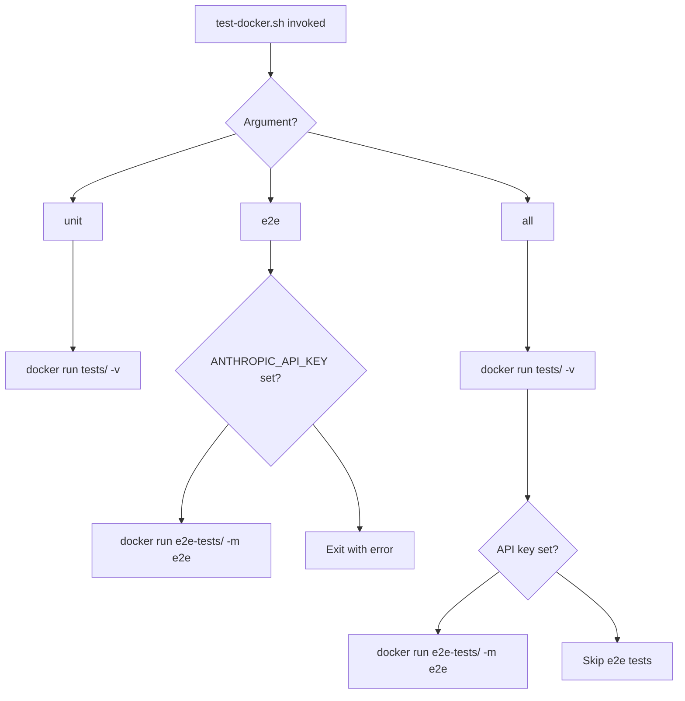
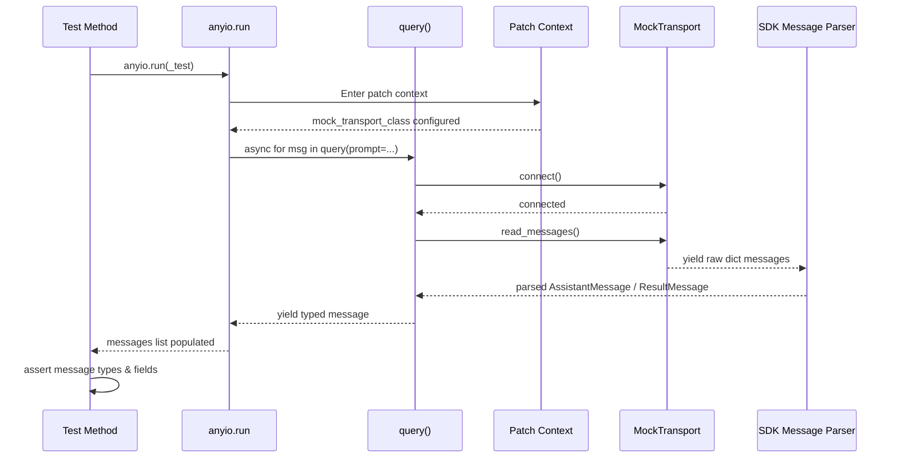

# Testing & CI Infrastructure

The `claude-agent-sdk-python` project employs a two-tier testing strategy: **unit/integration tests** located in `tests/` and **end-to-end (e2e) tests** located in `e2e-tests/`. Unit and integration tests use mocked subprocess transports to verify SDK logic without requiring a live Claude CLI, while e2e tests exercise the full stack against the real Anthropic API. A Docker-based testing workflow is also provided to catch container-specific issues and ensure reproducibility across environments.

---

## Test Suite Structure

The project separates concerns across two distinct test directories, each with its own pytest configuration.

```
claude-agent-sdk-python/
├── tests/                  # Unit & integration tests (mocked)
│   ├── conftest.py
│   └── test_integration.py
├── e2e-tests/              # End-to-end tests (live API)
│   └── conftest.py
├── Dockerfile.test         # Containerized test runner
└── scripts/
    └── test-docker.sh      # Docker test helper script
```

### Unit & Integration Tests (`tests/`)

The `tests/` directory contains integration tests that mock the `SubprocessCLITransport` layer, allowing full message-parsing and SDK logic to be exercised without spawning a real Claude CLI process.

Sources: [tests/conftest.py](../../../tests/conftest.py), [tests/test_integration.py](../../../tests/test_integration.py)

### End-to-End Tests (`e2e-tests/`)

The `e2e-tests/` directory contains tests that require a live `ANTHROPIC_API_KEY` and a functioning Claude CLI installation. These are gated behind a custom `e2e` pytest marker.

Sources: [e2e-tests/conftest.py](../../../e2e-tests/conftest.py)

---

## Pytest Configuration

### `pyproject.toml` Settings

Core pytest behavior is declared in `pyproject.toml` under `[tool.pytest.ini_options]`:

```toml
[tool.pytest.ini_options]
testpaths = ["tests"]
pythonpath = ["src"]
addopts = [
    "--import-mode=importlib",
    "-p", "asyncio",
]

[tool.pytest-asyncio]
asyncio_mode = "auto"
```

| Option | Value | Purpose |
|---|---|---|
| `testpaths` | `["tests"]` | Default test discovery path (unit/integration only) |
| `pythonpath` | `["src"]` | Adds `src/` to `sys.path` so `claude_agent_sdk` is importable |
| `--import-mode=importlib` | importlib | Avoids `__init__.py` conflicts across packages |
| `-p asyncio` | asyncio plugin | Loads the asyncio pytest plugin |
| `asyncio_mode` | `auto` | Automatically treats `async def` test functions as async tests |

Sources: [pyproject.toml:60-70](../../../pyproject.toml#L60-L70)

### Unit Test `conftest.py`

The unit test configuration is intentionally minimal:

```python
"""Pytest configuration for tests."""

# No async plugin needed since we're using sync tests with anyio.run()
```

Integration tests wrap async logic in `anyio.run()` explicitly, so no additional async fixtures are required at the session level.

Sources: [tests/conftest.py](../../../tests/conftest.py)

### E2E Test `conftest.py`

The e2e configuration provides two session-scoped fixtures and registers the `e2e` marker:

```python
@pytest.fixture(scope="session")
def api_key():
    """Ensure ANTHROPIC_API_KEY is set for e2e tests."""
    key = os.environ.get("ANTHROPIC_API_KEY")
    if not key:
        pytest.fail(
            "ANTHROPIC_API_KEY environment variable is required for e2e tests. "
            "Set it before running: export ANTHROPIC_API_KEY=your-key-here"
        )
    return key
```

| Fixture / Hook | Scope | Purpose |
|---|---|---|
| `api_key` | session | Reads `ANTHROPIC_API_KEY`; hard-fails if absent |
| `event_loop_policy` | session | Returns the default asyncio event loop policy |
| `pytest_configure` | — | Registers the `e2e` marker to avoid unknown-marker warnings |

Sources: [e2e-tests/conftest.py](../../../e2e-tests/conftest.py)

---

## Integration Test Patterns

All integration tests in `tests/test_integration.py` follow a consistent pattern: patch `SubprocessCLITransport` and `Query.initialize`, inject a mock async generator for `read_messages`, and drive the SDK through `anyio.run()`.

### Mock Transport Setup

```python
with (
    patch(
        "claude_agent_sdk._internal.client.SubprocessCLITransport"
    ) as mock_transport_class,
    patch(
        "claude_agent_sdk._internal.query.Query.initialize",
        new_callable=AsyncMock,
    ),
):
    mock_transport = AsyncMock()
    mock_transport_class.return_value = mock_transport

    async def mock_receive():
        yield { "type": "assistant", ... }
        yield { "type": "result", ... }

    mock_transport.read_messages = mock_receive
    mock_transport.connect = AsyncMock()
    mock_transport.close = AsyncMock()
    mock_transport.end_input = AsyncMock()
    mock_transport.write = AsyncMock()
    mock_transport.is_ready = Mock(return_value=True)
```

Sources: [tests/test_integration.py:26-60](../../../tests/test_integration.py#L26-L60)

### Test Flow Diagram



### Covered Test Scenarios

| Test Method | Scenario | Key Assertions |
|---|---|---|
| `test_simple_query_response` | Text-only assistant reply | `AssistantMessage` content, `ResultMessage` cost/session |
| `test_query_with_tool_use` | Multi-content with `ToolUseBlock` | Tool name, input dict, content length |
| `test_cli_not_found` | Missing CLI binary | `CLINotFoundError` raised with correct message |
| `test_continuation_option` | `continue_conversation=True` | Transport constructed with flag set |
| `test_max_budget_usd_option` | Budget exceeded result subtype | `subtype == "error_max_budget_usd"`, cost > 0 |

Sources: [tests/test_integration.py:21-240](../../../tests/test_integration.py#L21-L240)

### Async Execution Strategy

Rather than relying on pytest-asyncio session-level fixtures, each test method wraps its async body in `anyio.run()`:

```python
def test_simple_query_response(self):
    async def _test():
        # ... async test body ...
    anyio.run(_test)
```

This keeps each test self-contained and avoids shared event loop state between tests.

Sources: [tests/test_integration.py:24-67](../../../tests/test_integration.py#L24-L67)

---

## Development Dependencies

Test tooling is declared in the `[project.optional-dependencies]` `dev` group:

```toml
[project.optional-dependencies]
dev = [
    "pytest>=7.0.0",
    "pytest-asyncio>=0.20.0",
    "anyio[trio]>=4.0.0",
    "pytest-cov>=4.0.0",
    "mypy>=1.0.0",
    "ruff>=0.1.0",
]
```

| Package | Minimum Version | Role |
|---|---|---|
| `pytest` | 7.0.0 | Test runner and fixture engine |
| `pytest-asyncio` | 0.20.0 | Async test support |
| `anyio[trio]` | 4.0.0 | Cross-backend async runner (includes Trio backend) |
| `pytest-cov` | 4.0.0 | Code coverage reporting |
| `mypy` | 1.0.0 | Static type checking |
| `ruff` | 0.1.0 | Linting and import sorting |

Sources: [pyproject.toml:43-52](../../../pyproject.toml#L43-L52)

### Optional Example Dependencies

A separate `examples` extra provides backends for `SessionStore` reference adapters. These are **not** installed in default CI; tests that require them use `pytest.importorskip`:

```toml
examples = [
    "boto3>=1.28.0",
    "moto[s3]>=5.0.0",
    "redis>=4.2.0",
    "fakeredis>=2.20.0",
    "asyncpg>=0.27.0",
]
```

Sources: [pyproject.toml:53-62](../../../pyproject.toml#L53-L62)

---

## Static Analysis & Linting

### MyPy (Type Checking)

MyPy is configured in strict mode targeting Python 3.10:

```toml
[tool.mypy]
python_version = "3.10"
strict = true
warn_return_any = true
disallow_untyped_defs = true
disallow_incomplete_defs = true
check_untyped_defs = true
```

An override silences missing-import errors for `opentelemetry.*`, which is an optional dependency guarded by `try/except ImportError` in the source:

```toml
[[tool.mypy.overrides]]
module = ["opentelemetry", "opentelemetry.*"]
ignore_missing_imports = true
```

Sources: [pyproject.toml:73-99](../../../pyproject.toml#L73-L99)

### Ruff (Linting & Formatting)

Ruff targets Python 3.10 with an 88-character line length and enforces the following rule sets:

| Code | Ruleset |
|---|---|
| `E`, `W` | pycodestyle errors/warnings |
| `F` | pyflakes |
| `I` | isort (import ordering) |
| `N` | pep8-naming |
| `UP` | pyupgrade |
| `B` | flake8-bugbear |
| `C4` | flake8-comprehensions |
| `PTH` | flake8-use-pathlib |
| `SIM` | flake8-simplify |

`E501` (line-too-long) is ignored as line length is handled by the formatter. First-party imports (`claude_agent_sdk`) are recognized for isort grouping.

Sources: [pyproject.toml:101-122](../../../pyproject.toml#L101-L122)

---

## Docker-Based Testing

A `Dockerfile.test` and companion shell script provide a containerized test environment, primarily to catch issues specific to Docker deployments (e.g., PATH configuration, missing system dependencies).

### `Dockerfile.test`

```dockerfile
FROM python:3.12-slim

RUN apt-get update && apt-get install -y curl git \
    && rm -rf /var/lib/apt/lists/*

RUN curl -fsSL https://claude.ai/install.sh | bash
ENV PATH="/root/.local/bin:$PATH"

WORKDIR /app
COPY . .
RUN pip install -e ".[dev]"
RUN claude -v

CMD ["python", "-m", "pytest", "tests/", "-v"]
```

The image:
1. Starts from `python:3.12-slim`
2. Installs `curl` and `git`
3. Installs the Claude Code CLI via the official install script
4. Adds `~/.local/bin` to `PATH`
5. Installs the SDK in editable mode with dev dependencies
6. Verifies the CLI is reachable with `claude -v`

Sources: [Dockerfile.test](../../../Dockerfile.test)

### `scripts/test-docker.sh`

The script accepts one of three modes:



| Mode | API Key Required | Command Run Inside Container |
|---|---|---|
| `unit` | No | `pytest tests/ -v` |
| `e2e` | Yes (hard fail) | `pytest e2e-tests/ -v -m e2e` |
| `all` | Optional (skips e2e if absent) | Both of the above |

The `ANTHROPIC_API_KEY` is passed via `-e ANTHROPIC_API_KEY` so it is never baked into the image.

Sources: [scripts/test-docker.sh](../../../scripts/test-docker.sh)

---

## Test Execution Flow

The following sequence diagram shows how an integration test exercises the SDK end-to-end with mocked transport:



Sources: [tests/test_integration.py](../../../tests/test_integration.py), [tests/conftest.py](../../../tests/conftest.py)

---

## Summary

The testing infrastructure for `claude-agent-sdk-python` is organized around two complementary layers: mocked integration tests in `tests/` that validate SDK parsing and option-passing logic without external dependencies, and e2e tests in `e2e-tests/` that require a live API key and CLI. Pytest configuration in `pyproject.toml` sets strict import modes and async handling. Static analysis via MyPy (strict mode) and Ruff enforces code quality. A Docker workflow via `Dockerfile.test` and `scripts/test-docker.sh` ensures tests pass in containerized environments, which is critical for catching deployment-specific issues. Together, these layers provide confidence across the full development and deployment lifecycle.