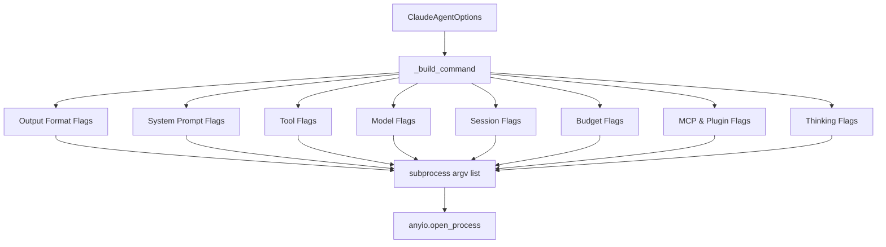
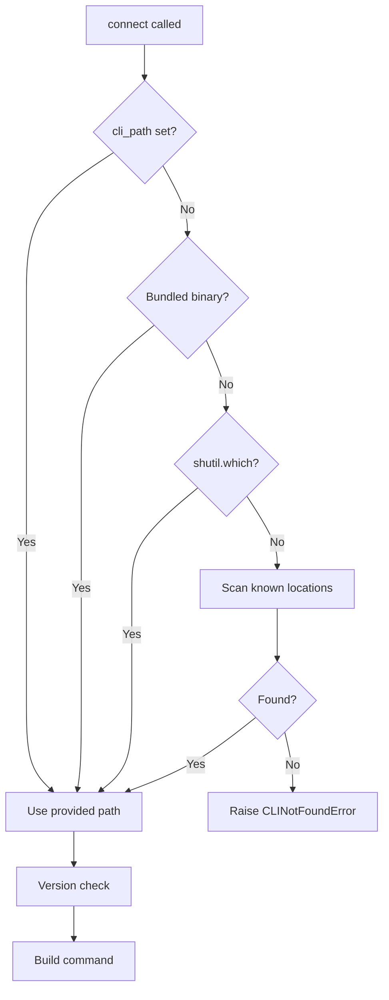
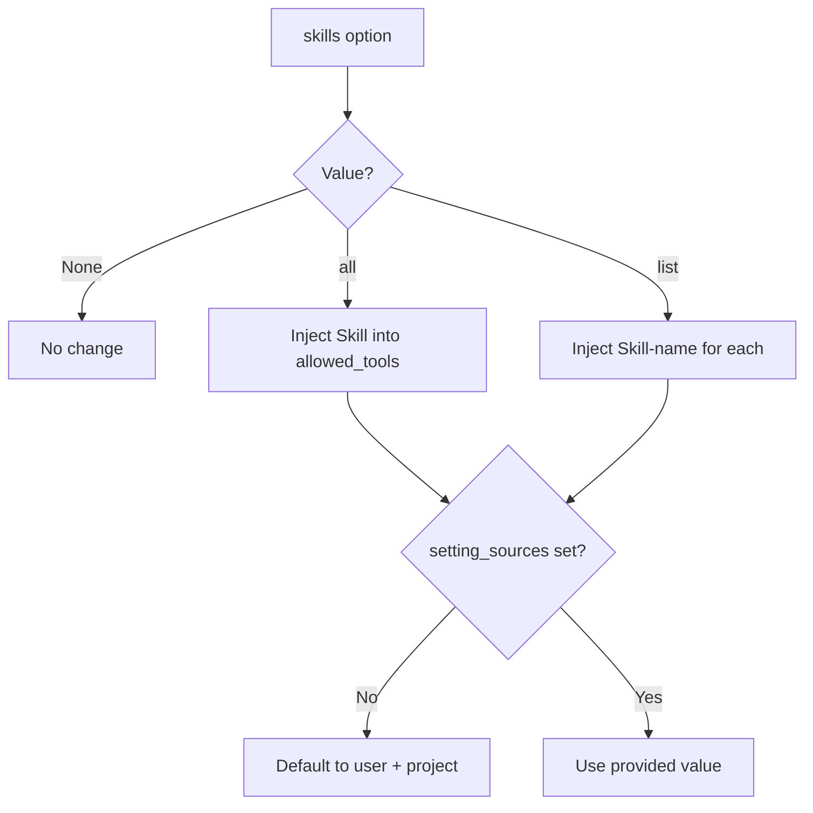
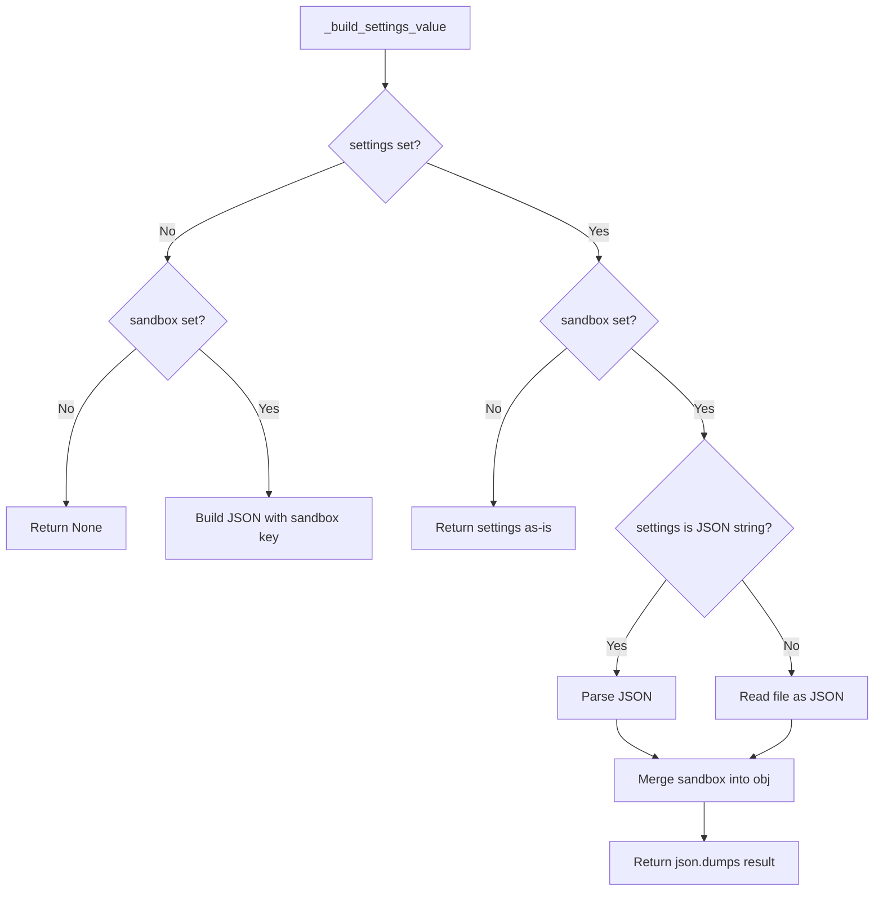

# Configuration & Options

The `claude-agent-sdk-python` SDK exposes a single, unified configuration object — `ClaudeAgentOptions` — that controls every aspect of how the SDK spawns and communicates with the Claude Code CLI subprocess. From selecting the AI model and controlling costs, to managing sessions, tools, system prompts, and environment variables, all tuneable knobs live in one place. Understanding `ClaudeAgentOptions` and how its fields map to CLI flags is the foundation for using the SDK effectively.

This page covers all available configuration fields, their types, defaults, and the internal mechanics by which they are translated into subprocess arguments. For information on session management or MCP tools, see the relevant wiki sections.

---

## `ClaudeAgentOptions` — The Central Configuration Object

All configuration is passed to the `query()` function or `ClaudeSDKClient` via a `ClaudeAgentOptions` instance. When no options are provided, sensible defaults are applied. The transport layer (`SubprocessCLITransport`) reads from this object when building the CLI command and spawning the subprocess.

```python
from claude_agent_sdk import ClaudeAgentOptions, query

options = ClaudeAgentOptions(
    model="claude-opus-4-5",
    max_turns=5,
    max_budget_usd=0.10,
)

async for message in query(prompt="Hello!", options=options):
    ...
```

Sources: [examples/max_budget_usd.py:1-60](../../../examples/max_budget_usd.py#L1-L60), [examples/system_prompt.py:1-70](../../../examples/system_prompt.py#L1-L70)

---

## Configuration Categories

The options can be grouped into the following logical categories:

| Category | Key Fields |
|---|---|
| CLI & Runtime | `cli_path`, `cwd`, `env`, `user` |
| Model Selection | `model`, `fallback_model`, `betas`, `effort` |
| System Prompt | `system_prompt` |
| Tool Control | `tools`, `allowed_tools`, `disallowed_tools`, `skills`, `permission_mode`, `permission_prompt_tool_name` |
| Cost & Turn Limits | `max_budget_usd`, `max_turns`, `task_budget` |
| Session Management | `session_id`, `continue_conversation`, `resume`, `fork_session`, `session_store` |
| Context & Directories | `add_dirs`, `setting_sources`, `settings` |
| MCP & Plugins | `mcp_servers`, `plugins` |
| Thinking & Output | `thinking`, `max_thinking_tokens`, `output_format`, `include_partial_messages` |
| Observability | `stderr`, `max_buffer_size`, `enable_file_checkpointing` |
| Sandbox | `sandbox` |
| Extensibility | `extra_args` |

Sources: [src/claude_agent_sdk/_internal/transport/subprocess_cli.py:1-350](../../../src/claude_agent_sdk/_internal/transport/subprocess_cli.py#L1-L350)

---

## How Options Map to CLI Flags

The `SubprocessCLITransport._build_command()` method is the authoritative translation layer between `ClaudeAgentOptions` and the CLI subprocess arguments. Every option that has a CLI counterpart is appended here.



The command always begins with the resolved CLI binary path and the fixed flags `--output-format stream-json --verbose --input-format stream-json`. All other flags are appended conditionally based on the options provided.

Sources: [src/claude_agent_sdk/_internal/transport/subprocess_cli.py:134-290](../../../src/claude_agent_sdk/_internal/transport/subprocess_cli.py#L134-L290)

---

## CLI Path Resolution

The SDK automatically locates the Claude Code binary. The resolution order is:

1. **Bundled CLI** — checks for a `claude` (or `claude.exe` on Windows) binary inside the SDK's own `_bundled/` directory.
2. **System PATH** — uses `shutil.which("claude")`.
3. **Known locations** — scans a predefined list of common install paths.
4. **Explicit override** — if `cli_path` is set in `ClaudeAgentOptions`, it skips discovery entirely.



Sources: [src/claude_agent_sdk/_internal/transport/subprocess_cli.py:55-100](../../../src/claude_agent_sdk/_internal/transport/subprocess_cli.py#L55-L100)

### Version Check

After resolving the CLI path, the SDK runs `claude -v` and compares the output against `MINIMUM_CLAUDE_CODE_VERSION = "2.0.0"`. If the installed version is below the minimum, a warning is logged (but execution continues). The check can be bypassed by setting the environment variable `CLAUDE_AGENT_SDK_SKIP_VERSION_CHECK`.

Sources: [src/claude_agent_sdk/_internal/transport/subprocess_cli.py:295-330](../../../src/claude_agent_sdk/_internal/transport/subprocess_cli.py#L295-L330)

---

## System Prompt Configuration

The `system_prompt` field accepts three different forms, giving fine-grained control over Claude's base instructions.

### Option Forms

| Form | Type | CLI Flag | Behavior |
|---|---|---|---|
| `None` | `None` | `--system-prompt ""` | Clears the default system prompt (vanilla Claude) |
| String | `str` | `--system-prompt <text>` | Sets a fully custom system prompt |
| File preset | `{"type": "file", "path": "..."}` | `--system-prompt-file <path>` | Loads system prompt from a file |
| Preset | `{"type": "preset", "preset": "claude_code"}` | *(no flag)* | Uses the default Claude Code system prompt |
| Preset + append | `{"type": "preset", ..., "append": "..."}` | `--append-system-prompt <text>` | Appends text to the default prompt |

```python
# No system prompt (vanilla Claude)
options = ClaudeAgentOptions(system_prompt=None)

# Custom string
options = ClaudeAgentOptions(
    system_prompt="You are a pirate assistant. Respond in pirate speak."
)

# Default Claude Code prompt with appended instructions
options = ClaudeAgentOptions(
    system_prompt={
        "type": "preset",
        "preset": "claude_code",
        "append": "Always end your response with a fun fact.",
    }
)
```

Sources: [examples/system_prompt.py:20-80](../../../examples/system_prompt.py#L20-L80), [src/claude_agent_sdk/_internal/transport/subprocess_cli.py:143-157](../../../src/claude_agent_sdk/_internal/transport/subprocess_cli.py#L143-L157)

---

## Cost & Turn Control

### `max_budget_usd`

Sets a soft USD spending cap for a query. Budget checking occurs after each API call completes, so the final cost may slightly exceed the specified limit. When the budget is exceeded, the `ResultMessage` will have `subtype == "error_max_budget_usd"`.

```python
options = ClaudeAgentOptions(max_budget_usd=0.10)  # 10 cents cap
```

This maps to the CLI flag `--max-budget-usd <value>`.

Sources: [examples/max_budget_usd.py:38-72](../../../examples/max_budget_usd.py#L38-L72), [src/claude_agent_sdk/_internal/transport/subprocess_cli.py:180-182](../../../src/claude_agent_sdk/_internal/transport/subprocess_cli.py#L180-L182)

### `max_turns`

Limits the number of agentic turns Claude may take before stopping. Maps to `--max-turns <n>`.

### `task_budget`

A dictionary with a `"total"` key specifying an overall task budget. Maps to `--task-budget <n>`.

| Option | CLI Flag | Type | Description |
|---|---|---|---|
| `max_budget_usd` | `--max-budget-usd` | `float` | Soft USD cost cap |
| `max_turns` | `--max-turns` | `int` | Maximum agentic turns |
| `task_budget` | `--task-budget` | `dict` | Task-level budget with `"total"` key |

Sources: [src/claude_agent_sdk/_internal/transport/subprocess_cli.py:178-188](../../../src/claude_agent_sdk/_internal/transport/subprocess_cli.py#L178-L188)

---

## Tool Configuration

### `allowed_tools` and `disallowed_tools`

Control which tools Claude may use. `allowed_tools` is a list of tool name strings appended via `--allowedTools`. `disallowed_tools` maps to `--disallowedTools`.

### `tools`

Sets the base tool set. Accepts either a list of tool name strings or a preset object (`{"type": "preset", "preset": "claude_code"}`). An empty list (`[]`) maps to `--tools ""`, disabling all base tools.

### `skills`

A convenience option for enabling Claude Code Skills. Accepts `"all"` or a list of skill names. The SDK automatically injects the appropriate `Skill` or `Skill(name)` entries into `allowed_tools` and sets `setting_sources` to `["user", "project"]` if not already specified.



Sources: [src/claude_agent_sdk/_internal/transport/subprocess_cli.py:102-132](../../../src/claude_agent_sdk/_internal/transport/subprocess_cli.py#L102-L132)

### `permission_mode` and `permission_prompt_tool_name`

`permission_mode` maps to `--permission-mode` and controls the permission model. `permission_prompt_tool_name` maps to `--permission-prompt-tool` and names a custom tool to invoke for permission prompts.

| Option | CLI Flag | Description |
|---|---|---|
| `tools` | `--tools` | Base tool set or preset |
| `allowed_tools` | `--allowedTools` | Additional allowed tools |
| `disallowed_tools` | `--disallowedTools` | Explicitly blocked tools |
| `skills` | *(computed)* | Injects Skill entries into `allowed_tools` |
| `permission_mode` | `--permission-mode` | Permission enforcement mode |
| `permission_prompt_tool_name` | `--permission-prompt-tool` | Custom permission tool name |

Sources: [src/claude_agent_sdk/_internal/transport/subprocess_cli.py:158-200](../../../src/claude_agent_sdk/_internal/transport/subprocess_cli.py#L158-L200)

---

## Session Management Options

| Option | CLI Flag | Description |
|---|---|---|
| `session_id` | `--session-id` | Resume or target a specific session by ID |
| `continue_conversation` | `--continue` | Continue the most recent conversation |
| `resume` | `--resume` | Resume a specific conversation by ID |
| `fork_session` | `--fork-session` | Fork the current session |
| `session_store` | `--session-mirror` | Enable session mirroring |

These options are appended conditionally to the CLI command. Only non-`None` / truthy values result in a flag being added.

Sources: [src/claude_agent_sdk/_internal/transport/subprocess_cli.py:205-225](../../../src/claude_agent_sdk/_internal/transport/subprocess_cli.py#L205-L225)

---

## Setting Sources

The `setting_sources` option controls which filesystem configuration locations the CLI loads settings from. This affects custom slash commands, agents, and other project-level configurations.

| Value | Behavior |
|---|---|
| `None` (default) | CLI loads its own defaults: user, project, and local |
| `[]` (empty list) | All filesystem setting sources are disabled |
| `["user"]` | Only global user settings (`~/.claude/`) are loaded |
| `["user", "project"]` | User and project-level settings are loaded |

```python
# Disable all filesystem settings
options = ClaudeAgentOptions(setting_sources=[])

# Load only user-level settings (exclude project-specific commands)
options = ClaudeAgentOptions(setting_sources=["user"])

# Load user + project settings (default for skills)
options = ClaudeAgentOptions(setting_sources=["user", "project"])
```

The `setting_sources` list is serialized as a comma-separated value passed to `--setting-sources=<value>`.

Sources: [examples/setting_sources.py:1-180](../../../examples/setting_sources.py#L1-L180), [src/claude_agent_sdk/_internal/transport/subprocess_cli.py:240-245](../../../src/claude_agent_sdk/_internal/transport/subprocess_cli.py#L240-L245)

---

## Settings & Sandbox

### `settings`

Accepts either a JSON string or a file path pointing to a settings file. Passed via `--settings`.

### `sandbox`

Sandbox configuration object. When provided alongside `settings`, the SDK **merges** the sandbox config into the settings JSON before passing it to `--settings`. This merge logic is handled by `_build_settings_value()`.



Sources: [src/claude_agent_sdk/_internal/transport/subprocess_cli.py:80-115](../../../src/claude_agent_sdk/_internal/transport/subprocess_cli.py#L80-L115)

---

## Model & Thinking Configuration

### Model Options

| Option | CLI Flag | Description |
|---|---|---|
| `model` | `--model` | Primary model identifier |
| `fallback_model` | `--fallback-model` | Fallback model if primary is unavailable |
| `betas` | `--betas` | Comma-separated list of beta feature flags |
| `effort` | `--effort` | Effort level hint |

### Thinking Configuration

The `thinking` option accepts a typed dictionary controlling extended thinking:

| Type | CLI Flag | Description |
|---|---|---|
| `{"type": "adaptive"}` | `--thinking adaptive` | Adaptive thinking budget |
| `{"type": "enabled", "budget_tokens": N}` | `--max-thinking-tokens N` | Fixed thinking token budget |
| `{"type": "disabled"}` | `--thinking disabled` | Disable thinking |

For `adaptive` and `enabled` types, an optional `"display"` key maps to `--thinking-display`.

The legacy `max_thinking_tokens` integer field is also supported and maps directly to `--max-thinking-tokens`, but `thinking` takes precedence when both are set.

Sources: [src/claude_agent_sdk/_internal/transport/subprocess_cli.py:265-295](../../../src/claude_agent_sdk/_internal/transport/subprocess_cli.py#L265-L295)

---

## Environment & Process Options

### `env`

A dictionary of additional environment variables to inject into the subprocess. These are merged on top of the inherited process environment. The SDK always sets:
- `CLAUDE_CODE_ENTRYPOINT=sdk-py`
- `CLAUDE_AGENT_SDK_VERSION=<current version>`
- `CLAUDECODE` is **stripped** from the inherited environment to prevent nested Claude Code detection.

### `cwd`

Sets the working directory for the subprocess. Also sets `PWD` in the process environment. Raises `CLIConnectionError` if the directory does not exist.

### `user`

Passed directly to `anyio.open_process` as the `user` argument to run the subprocess under a specific OS user.

### `stderr`

A callback function invoked for each line written to the subprocess's stderr. When `None` (default), stderr is not piped.

### `max_buffer_size`

Controls the maximum size (in bytes) of the internal JSON parse buffer. Defaults to 1 MB (`1024 * 1024`). Raises `CLIJSONDecodeError` if a single JSON message exceeds this limit.

```python
# Example: custom env and working directory
options = ClaudeAgentOptions(
    cwd="/path/to/project",
    env={"MY_TOKEN": "secret"},
    stderr=lambda line: print(f"[stderr] {line}"),
    max_buffer_size=2 * 1024 * 1024,  # 2MB
)
```

Sources: [src/claude_agent_sdk/_internal/transport/subprocess_cli.py:310-370](../../../src/claude_agent_sdk/_internal/transport/subprocess_cli.py#L310-L370)

---

## MCP Servers & Plugins

### `mcp_servers`

Configures Model Context Protocol servers. Accepts:
- A `dict` mapping server names to config objects — serialized as `--mcp-config '{"mcpServers": {...}}'`
- A string or `Path` — passed directly as a file path or JSON string to `--mcp-config`

For SDK-type servers (config with `"type": "sdk"`), the `"instance"` key is stripped before passing to the CLI.

### `plugins`

A list of plugin configuration dictionaries. Currently supports `{"type": "local", "path": "..."}` entries, each mapped to `--plugin-dir <path>`.

Sources: [src/claude_agent_sdk/_internal/transport/subprocess_cli.py:228-255](../../../src/claude_agent_sdk/_internal/transport/subprocess_cli.py#L228-L255)

---

## Output & Observability Options

| Option | CLI Flag / Behavior | Description |
|---|---|---|
| `include_partial_messages` | `--include-partial-messages` | Stream partial assistant messages |
| `output_format` | `--json-schema <schema>` | Enforce JSON schema on output (when `type == "json_schema"`) |
| `enable_file_checkpointing` | `CLAUDE_CODE_ENABLE_SDK_FILE_CHECKPOINTING=true` | Enable file-level checkpointing via env var |
| `add_dirs` | `--add-dir <path>` (repeated) | Additional directories to expose to Claude |

Sources: [src/claude_agent_sdk/_internal/transport/subprocess_cli.py:256-270](../../../src/claude_agent_sdk/_internal/transport/subprocess_cli.py#L256-L270)

---

## Extensibility: `extra_args`

For CLI flags not yet exposed as first-class options, `extra_args` accepts a dictionary of flag names to values:

```python
options = ClaudeAgentOptions(
    extra_args={
        "some-future-flag": "value",
        "boolean-flag": None,  # Becomes --boolean-flag with no value
    }
)
```

Each entry is appended as `--<flag> <value>` or `--<flag>` (for `None` values).

Sources: [src/claude_agent_sdk/_internal/transport/subprocess_cli.py:258-265](../../../src/claude_agent_sdk/_internal/transport/subprocess_cli.py#L258-L265)

---

## Full Option Reference

| Option | Type | Default | CLI Flag | Description |
|---|---|---|---|---|
| `cli_path` | `str \| Path \| None` | Auto-detected | *(path)* | Explicit path to the `claude` binary |
| `cwd` | `str \| Path \| None` | `None` | *(process cwd)* | Working directory for subprocess |
| `env` | `dict` | `{}` | *(process env)* | Extra environment variables |
| `user` | `str \| None` | `None` | *(process user)* | OS user to run subprocess as |
| `model` | `str \| None` | `None` | `--model` | Model identifier |
| `fallback_model` | `str \| None` | `None` | `--fallback-model` | Fallback model |
| `betas` | `list[str]` | `[]` | `--betas` | Beta feature flags |
| `effort` | `str \| None` | `None` | `--effort` | Effort level |
| `system_prompt` | `str \| dict \| None` | `None` | `--system-prompt` etc. | System prompt config |
| `tools` | `list \| dict \| None` | `None` | `--tools` | Base tool set |
| `allowed_tools` | `list[str]` | `[]` | `--allowedTools` | Extra allowed tools |
| `disallowed_tools` | `list[str]` | `[]` | `--disallowedTools` | Blocked tools |
| `skills` | `"all" \| list \| None` | `None` | *(computed)* | Skills shorthand |
| `permission_mode` | `str \| None` | `None` | `--permission-mode` | Permission mode |
| `permission_prompt_tool_name` | `str \| None` | `None` | `--permission-prompt-tool` | Custom permission tool |
| `max_budget_usd` | `float \| None` | `None` | `--max-budget-usd` | USD cost cap |
| `max_turns` | `int \| None` | `None` | `--max-turns` | Max agentic turns |
| `task_budget` | `dict \| None` | `None` | `--task-budget` | Task budget |
| `session_id` | `str \| None` | `None` | `--session-id` | Target session ID |
| `continue_conversation` | `bool` | `False` | `--continue` | Continue last conversation |
| `resume` | `str \| None` | `None` | `--resume` | Resume conversation by ID |
| `fork_session` | `bool` | `False` | `--fork-session` | Fork current session |
| `session_store` | `Any` | `None` | `--session-mirror` | Session mirroring |
| `setting_sources` | `list[str] \| None` | `None` | `--setting-sources=` | Config source control |
| `settings` | `str \| None` | `None` | `--settings` | Settings file or JSON |
| `sandbox` | `dict \| None` | `None` | *(merged into settings)* | Sandbox configuration |
| `add_dirs` | `list` | `[]` | `--add-dir` | Extra directories |
| `mcp_servers` | `dict \| str \| Path \| None` | `None` | `--mcp-config` | MCP server configs |
| `plugins` | `list` | `[]` | `--plugin-dir` | Local plugin directories |
| `thinking` | `dict \| None` | `None` | `--thinking` / `--max-thinking-tokens` | Thinking config |
| `max_thinking_tokens` | `int \| None` | `None` | `--max-thinking-tokens` | Legacy thinking tokens |
| `output_format` | `dict \| None` | `None` | `--json-schema` | Output format / schema |
| `include_partial_messages` | `bool` | `False` | `--include-partial-messages` | Stream partial messages |
| `stderr` | `callable \| None` | `None` | *(pipe)* | Stderr line callback |
| `max_buffer_size` | `int \| None` | `1048576` | *(internal)* | JSON parse buffer limit |
| `enable_file_checkpointing` | `bool` | `False` | *(env var)* | File checkpointing |
| `extra_args` | `dict` | `{}` | `--<flag>` | Arbitrary CLI flags |

Sources: [src/claude_agent_sdk/_internal/transport/subprocess_cli.py:30-55](../../../src/claude_agent_sdk/_internal/transport/subprocess_cli.py#L30-L55), [examples/setting_sources.py:60-120](../../../examples/setting_sources.py#L60-L120), [examples/max_budget_usd.py:30-60](../../../examples/max_budget_usd.py#L30-L60), [examples/system_prompt.py:30-80](../../../examples/system_prompt.py#L30-L80)

---

## Summary

`ClaudeAgentOptions` is the single source of truth for all SDK behavior. It is consumed by `SubprocessCLITransport`, which translates each option into the appropriate CLI flags, environment variables, or internal transport settings when spawning the Claude Code subprocess. Key design decisions include: automatic CLI discovery with a bundled fallback, a merge strategy for `settings` and `sandbox`, a `skills` shorthand that auto-configures `allowed_tools` and `setting_sources`, and an `extra_args` escape hatch for forward compatibility. Careful use of these options enables precise control over cost, tool access, session continuity, and Claude's behavior.