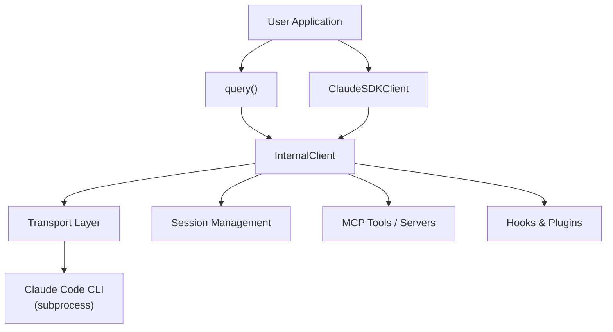
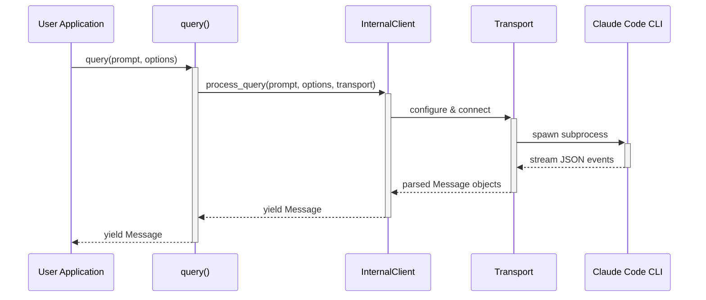

# Overview & Quick Start

The `claude-agent-sdk` is a Python SDK for interacting with Claude Code via a subprocess transport layer. It provides a high-level interface for sending prompts to Claude, streaming responses, managing sessions, integrating MCP (Model Context Protocol) tools, and extending behavior through hooks and plugins. This page covers the essential concepts, installation, and first steps needed to start using the SDK effectively.

Sources: [src/claude_agent_sdk/__init__.py](../../../src/claude_agent_sdk/__init__.py), [pyproject.toml](../../../pyproject.toml)

---

## What Is the Claude Agent SDK?

The SDK wraps Claude Code's CLI process and exposes it as an idiomatic async Python API. At its core it offers:

- **`query()`** — a simple async generator for one-shot or unidirectional streaming interactions.
- **`ClaudeSDKClient`** — a stateful client for interactive, multi-turn conversations.
- **Session management** — list, fork, rename, tag, and delete Claude Code sessions.
- **MCP tool integration** — connect external MCP servers or define in-process SDK MCP servers.
- **Hooks** — intercept tool use, user prompts, agent lifecycle events, and more.
- **Plugin support** — extend SDK behavior via `SdkPluginConfig`.

Sources: [src/claude_agent_sdk/__init__.py:1-50](../../../src/claude_agent_sdk/__init__.py#L1-L50), [src/claude_agent_sdk/query.py:1-20](../../../src/claude_agent_sdk/query.py#L1-L20)

---

## Installation

### Requirements

| Requirement | Minimum Version |
|---|---|
| Python | 3.10 |
| `anyio` | 4.0.0 |
| `mcp` | 0.1.0 |
| `typing_extensions` *(Python < 3.11 only)* | 4.0.0 |

Sources: [pyproject.toml:14-27](../../../pyproject.toml#L14-L27)

### Install from PyPI

```bash
pip install claude-agent-sdk
```

### Install with Optional Extras

```bash
# Development tools (pytest, mypy, ruff, etc.)
pip install "claude-agent-sdk[dev]"

# OpenTelemetry tracing support
pip install "claude-agent-sdk[otel]"

# Example session-store backends (boto3, redis, asyncpg, etc.)
pip install "claude-agent-sdk[examples]"
```

Sources: [pyproject.toml:28-46](../../../pyproject.toml#L28-L46)

---

## SDK Architecture Overview

The diagram below shows the major components of the SDK and their relationships.



The `query()` function and `ClaudeSDKClient` both delegate to an `InternalClient`, which selects and configures a `Transport` to communicate with the Claude Code CLI subprocess. Session management, MCP servers, and hooks are layered on top of this core pipeline.

Sources: [src/claude_agent_sdk/query.py:75-90](../../../src/claude_agent_sdk/query.py#L75-L90), [src/claude_agent_sdk/__init__.py:30-45](../../../src/claude_agent_sdk/__init__.py#L30-L45)

---

## Core Concepts

### `query()` vs `ClaudeSDKClient`

The SDK exposes two primary interaction patterns:

| Feature | `query()` | `ClaudeSDKClient` |
|---|---|---|
| Interaction style | Unidirectional / one-shot | Bidirectional / interactive |
| State | Stateless | Stateful (session) |
| Use case | Scripts, batch, CI/CD | Chat apps, REPL, interactive |
| Interrupt support | No | Yes |
| Connection management | Automatic | Manual |
| Follow-up messages | Not supported | Supported |

Sources: [src/claude_agent_sdk/query.py:20-60](../../../src/claude_agent_sdk/query.py#L20-L60)

### Message Types

All responses from the SDK are typed `Message` objects. Key types include:

| Type | Description |
|---|---|
| `UserMessage` | A message from the user |
| `AssistantMessage` | A message from Claude, containing `ContentBlock` items |
| `SystemMessage` | A system-level message |
| `ResultMessage` | Final result with cost and usage information |
| `TaskStartedMessage` | Signals that a task has begun |
| `TaskProgressMessage` | Intermediate task progress update |
| `TaskNotificationMessage` | Notification during task execution |

Sources: [src/claude_agent_sdk/__init__.py:220-270](../../../src/claude_agent_sdk/__init__.py#L220-L270)

### Content Blocks

`AssistantMessage.content` is a list of `ContentBlock` items:

| Block Type | Description |
|---|---|
| `TextBlock` | Plain text response |
| `ThinkingBlock` | Claude's internal reasoning (when thinking is enabled) |
| `ToolUseBlock` | A tool call made by Claude |
| `ToolResultBlock` | Result of a tool call |
| `ServerToolUseBlock` | A server-side tool invocation |
| `ServerToolResultBlock` | Result of a server-side tool call |

Sources: [src/claude_agent_sdk/__init__.py:227-237](../../../src/claude_agent_sdk/__init__.py#L227-L237)

---

## Quick Start

### 1. Basic Query

The simplest way to interact with Claude is through the `query()` async generator:

```python
import anyio
from claude_agent_sdk import AssistantMessage, TextBlock, query

async def main():
    async for message in query(prompt="What is 2 + 2?"):
        if isinstance(message, AssistantMessage):
            for block in message.content:
                if isinstance(block, TextBlock):
                    print(f"Claude: {block.text}")

anyio.run(main)
```

Sources: [examples/quick_start.py:14-27](../../../examples/quick_start.py#L14-L27)

### 2. Using `ClaudeAgentOptions`

Customize the behavior of a query by passing a `ClaudeAgentOptions` instance:

```python
from claude_agent_sdk import AssistantMessage, ClaudeAgentOptions, TextBlock, query

options = ClaudeAgentOptions(
    system_prompt="You are a helpful assistant that explains things simply.",
    max_turns=1,
)

async for message in query(
    prompt="Explain what Python is in one sentence.",
    options=options
):
    if isinstance(message, AssistantMessage):
        for block in message.content:
            if isinstance(block, TextBlock):
                print(f"Claude: {block.text}")
```

Sources: [examples/quick_start.py:30-47](../../../examples/quick_start.py#L30-L47)

### 3. Enabling Tools

Grant Claude access to specific tools via `allowed_tools`:

```python
from claude_agent_sdk import (
    AssistantMessage, ClaudeAgentOptions,
    ResultMessage, TextBlock, query
)

options = ClaudeAgentOptions(
    allowed_tools=["Read", "Write"],
    system_prompt="You are a helpful file assistant.",
)

async for message in query(
    prompt="Create a file called hello.txt with 'Hello, World!' in it",
    options=options,
):
    if isinstance(message, AssistantMessage):
        for block in message.content:
            if isinstance(block, TextBlock):
                print(f"Claude: {block.text}")
    elif isinstance(message, ResultMessage) and message.total_cost_usd > 0:
        print(f"\nCost: ${message.total_cost_usd:.4f}")
```

Sources: [examples/quick_start.py:50-70](../../../examples/quick_start.py#L50-L70)

---

## `query()` Function Reference

```python
async def query(
    *,
    prompt: str | AsyncIterable[dict[str, Any]],
    options: ClaudeAgentOptions | None = None,
    transport: Transport | None = None,
) -> AsyncIterator[Message]:
```

### Parameters

| Parameter | Type | Required | Description |
|---|---|---|---|
| `prompt` | `str` or `AsyncIterable[dict]` | Yes | The prompt string, or an async iterable of message dicts for streaming mode |
| `options` | `ClaudeAgentOptions \| None` | No | Configuration options; defaults to `ClaudeAgentOptions()` if `None` |
| `transport` | `Transport \| None` | No | Custom transport implementation; uses default if `None` |

### Streaming Mode Dict Structure

When `prompt` is an `AsyncIterable[dict]`, each dict should follow this structure:

```python
{
    "type": "user",
    "message": {"role": "user", "content": "..."},
    "parent_tool_use_id": None,
    "session_id": "..."
}
```

Sources: [src/claude_agent_sdk/query.py:20-90](../../../src/claude_agent_sdk/query.py#L20-L90)

### `ClaudeAgentOptions` Key Fields

| Field | Type | Description |
|---|---|---|
| `system_prompt` | `str \| None` | Custom system prompt for the session |
| `max_turns` | `int \| None` | Maximum number of conversation turns |
| `allowed_tools` | `list[str] \| None` | Whitelist of tool names Claude may use |
| `permission_mode` | `PermissionMode \| None` | Tool permission strategy (see below) |
| `cwd` | `str \| None` | Working directory for the CLI subprocess |
| `mcp_servers` | `dict \| None` | MCP server configurations |

Sources: [src/claude_agent_sdk/__init__.py:100-120](../../../src/claude_agent_sdk/__init__.py#L100-L120)

### Permission Modes

| Mode | Behavior |
|---|---|
| `default` | CLI prompts for dangerous tools |
| `acceptEdits` | Auto-accept all file edits |
| `plan` | Plan-only; no tool execution |
| `bypassPermissions` | Allow all tools (use with caution) |
| `dontAsk` | Deny anything not pre-approved |
| `auto` | Model classifier approves/denies each tool call |

Sources: [src/claude_agent_sdk/query.py:34-42](../../../src/claude_agent_sdk/query.py#L34-L42)

---

## Typical Query Flow

The sequence below illustrates what happens when you call `query()`:



Sources: [src/claude_agent_sdk/query.py:75-90](../../../src/claude_agent_sdk/query.py#L75-L90)

---

## In-Process MCP Tool Servers

The SDK allows you to define MCP tools that run directly inside your Python process — no separate subprocess required.

### Defining a Tool

Use the `@tool` decorator to define an async tool handler:

```python
from claude_agent_sdk import tool

@tool("greet", "Greet a user", {"name": str})
async def greet(args):
    return {"content": [{"type": "text", "text": f"Hello, {args['name']}!"}]}
```

Sources: [src/claude_agent_sdk/__init__.py:108-175](../../../src/claude_agent_sdk/__init__.py#L108-L175)

### Creating a Server

Bundle tools into a named server with `create_sdk_mcp_server()`:

```python
from claude_agent_sdk import ClaudeAgentOptions, create_sdk_mcp_server, tool

@tool("add", "Add numbers", {"a": float, "b": float})
async def add(args):
    return {"content": [{"type": "text", "text": f"Sum: {args['a'] + args['b']}"}]}

calculator = create_sdk_mcp_server(name="calculator", version="1.0.0", tools=[add])

options = ClaudeAgentOptions(
    mcp_servers={"calc": calculator},
    allowed_tools=["add"]
)
```

Sources: [src/claude_agent_sdk/__init__.py:215-280](../../../src/claude_agent_sdk/__init__.py#L215-L280)

### Input Schema Options

| Schema Format | Example |
|---|---|
| Simple dict mapping | `{"name": str, "age": int}` |
| TypedDict class | `class MyInput(TypedDict): name: str` |
| Full JSON Schema dict | `{"type": "object", "properties": {...}}` |
| Annotated types | `{"name": Annotated[str, "The user's name"]}` |

Sources: [src/claude_agent_sdk/__init__.py:177-215](../../../src/claude_agent_sdk/__init__.py#L177-L215)

---

## Error Handling

The SDK defines a hierarchy of typed exceptions:

| Exception | Description |
|---|---|
| `ClaudeSDKError` | Base class for all SDK errors |
| `CLINotFoundError` | Claude Code CLI binary not found |
| `CLIConnectionError` | Failed to connect to the CLI process |
| `ProcessError` | The CLI subprocess exited with an error |
| `CLIJSONDecodeError` | Failed to parse JSON output from the CLI |

```python
from claude_agent_sdk import CLINotFoundError, ClaudeSDKError, query

try:
    async for message in query(prompt="Hello"):
        print(message)
except CLINotFoundError:
    print("Claude Code CLI is not installed or not on PATH.")
except ClaudeSDKError as e:
    print(f"SDK error: {e}")
```

Sources: [src/claude_agent_sdk/__init__.py:20-27](../../../src/claude_agent_sdk/__init__.py#L20-L27)

---

## Version Information

The current SDK version is defined in `_version.py` and re-exported from the package root:

```python
from claude_agent_sdk import __version__
print(__version__)  # e.g., "0.1.65"
```

Sources: [src/claude_agent_sdk/_version.py:1-4](../../../src/claude_agent_sdk/_version.py#L1-L4), [pyproject.toml:7](../../../pyproject.toml#L7)

---

## Summary

The `claude-agent-sdk` provides a clean, async-first Python interface to Claude Code. The `query()` function covers the majority of use cases — from simple one-liners to batch pipelines — while `ClaudeSDKClient` handles stateful, interactive scenarios. MCP tool integration, session management, hooks, and plugins are all available as layered capabilities on top of the core transport mechanism. Start with `query()` and `ClaudeAgentOptions`, then explore the advanced features as your application requirements grow.

Sources: [src/claude_agent_sdk/__init__.py](../../../src/claude_agent_sdk/__init__.py), [src/claude_agent_sdk/query.py](../../../src/claude_agent_sdk/query.py), [examples/quick_start.py](../../../examples/quick_start.py), [pyproject.toml](../../../pyproject.toml), [src/claude_agent_sdk/_version.py](../../../src/claude_agent_sdk/_version.py)