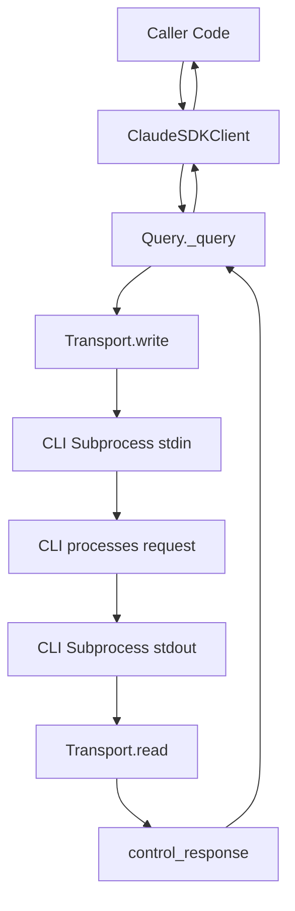
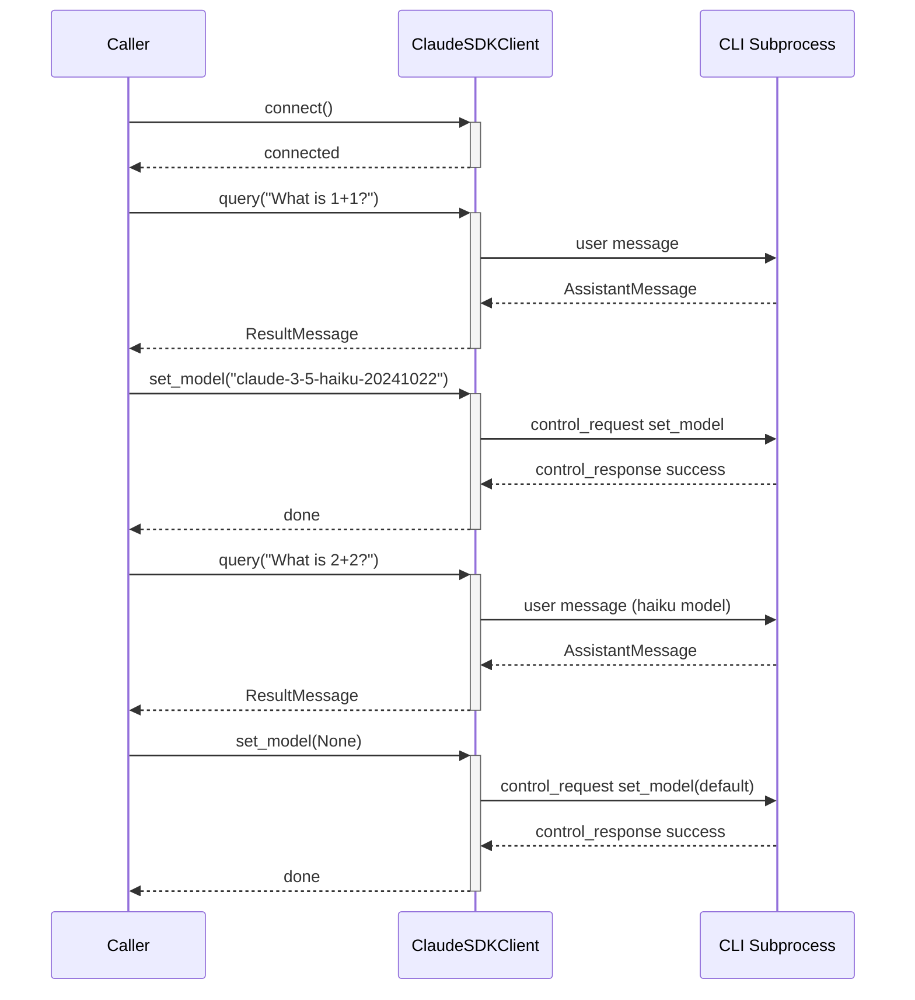
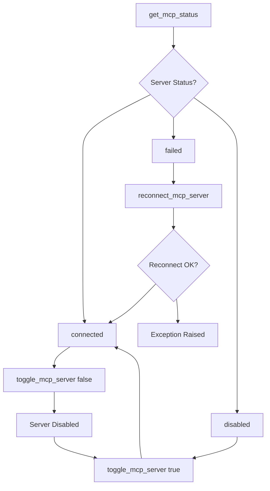
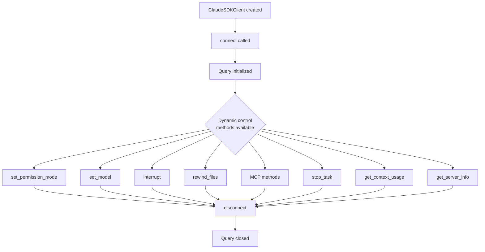

# Dynamic Control (Runtime Changes)

The Claude Agent SDK provides a rich set of runtime control APIs that allow callers to modify session behaviour **after** a connection has been established — without tearing down and rebuilding the subprocess. These capabilities are exposed through `ClaudeSDKClient` and are implemented via the SDK control-protocol: a bidirectional JSON message channel between the Python SDK and the Claude Code CLI subprocess. Dynamic control covers permission-mode switching, model swapping, interrupt signalling, MCP server lifecycle management, file rewinding, and task cancellation.

All dynamic control methods require an active connection (i.e., `connect()` must have been called first) and are only meaningful in **streaming mode**, which is the mode `ClaudeSDKClient` always uses.

---

## Architecture Overview

Dynamic control is built on top of the SDK control protocol. The `ClaudeSDKClient` delegates every runtime-change call to an internal `Query` object, which serialises a `control_request` JSON message and writes it to the transport. The CLI responds asynchronously with a `control_response` message.



Sources: [src/claude_agent_sdk/client.py:1-50](../../../src/claude_agent_sdk/client.py#L1-L50), [src/claude_agent_sdk/types.py:530-600](../../../src/claude_agent_sdk/types.py#L530-L600)

---

## Control Protocol Message Types

Every dynamic control action is represented as a `SDKControlRequest` envelope containing a typed `request` payload. The CLI responds with a `SDKControlResponse`.

### Request Envelope

```python
class SDKControlRequest(TypedDict):
    type: Literal["control_request"]
    request_id: str
    request: (
        SDKControlInterruptRequest
        | SDKControlPermissionRequest
        | SDKControlInitializeRequest
        | SDKControlSetPermissionModeRequest
        | SDKHookCallbackRequest
        | SDKControlMcpMessageRequest
        | SDKControlRewindFilesRequest
        | SDKControlMcpReconnectRequest
        | SDKControlMcpToggleRequest
        | SDKControlStopTaskRequest
    )
```

Sources: [src/claude_agent_sdk/types.py:561-580](../../../src/claude_agent_sdk/types.py#L561-L580)

### Response Envelope

```python
class ControlResponse(TypedDict):
    subtype: Literal["success"]
    request_id: str
    response: dict[str, Any] | None

class ControlErrorResponse(TypedDict):
    subtype: Literal["error"]
    request_id: str
    error: str

class SDKControlResponse(TypedDict):
    type: Literal["control_response"]
    response: ControlResponse | ControlErrorResponse
```

Sources: [src/claude_agent_sdk/types.py:582-596](../../../src/claude_agent_sdk/types.py#L582-L596)

### Summary of Control Request Subtypes

| Subtype | TypedDict | Purpose |
|---|---|---|
| `interrupt` | `SDKControlInterruptRequest` | Interrupt the current running turn |
| `can_use_tool` | `SDKControlPermissionRequest` | Runtime permission callback response |
| `initialize` | `SDKControlInitializeRequest` | Session initialisation (hooks, agents) |
| `set_permission_mode` | `SDKControlSetPermissionModeRequest` | Change permission mode live |
| `hook_callback` | `SDKHookCallbackRequest` | Return result of a hook invocation |
| `mcp_message` | `SDKControlMcpMessageRequest` | Send message to an MCP server |
| `rewind_files` | `SDKControlRewindFilesRequest` | Revert tracked files to a checkpoint |
| `mcp_reconnect` | `SDKControlMcpReconnectRequest` | Reconnect a failed MCP server |
| `mcp_toggle` | `SDKControlMcpToggleRequest` | Enable or disable an MCP server |
| `stop_task` | `SDKControlStopTaskRequest` | Cancel a running background task |

Sources: [src/claude_agent_sdk/types.py:530-580](../../../src/claude_agent_sdk/types.py#L530-L580)

---

## Client-Facing Dynamic Control Methods

All dynamic control methods live on `ClaudeSDKClient`. They raise `CLIConnectionError` if called before `connect()`.

Sources: [src/claude_agent_sdk/client.py:180-370](../../../src/claude_agent_sdk/client.py#L180-L370)

### `set_permission_mode(mode)`

Changes the active permission mode mid-conversation. This is useful when a workflow transitions from a read-only analysis phase to an edit-accepting phase without restarting the session.

```python
async def set_permission_mode(self, mode: PermissionMode) -> None:
    if not self._query:
        raise CLIConnectionError("Not connected. Call connect() first.")
    await self._query.set_permission_mode(mode)
```

**Valid `PermissionMode` values:**

| Mode | Description |
|---|---|
| `default` | CLI prompts for dangerous tools |
| `acceptEdits` | Auto-accept file edit operations |
| `plan` | Plan-only mode; no tool execution |
| `bypassPermissions` | Allow all tools (use with caution) |
| `dontAsk` | Deny anything not pre-approved by allow rules |
| `auto` | A model classifier approves or denies each tool call |

The underlying wire message is:

```python
class SDKControlSetPermissionModeRequest(TypedDict):
    subtype: Literal["set_permission_mode"]
    mode: PermissionMode
```

Sources: [src/claude_agent_sdk/client.py:200-230](../../../src/claude_agent_sdk/client.py#L200-L230), [src/claude_agent_sdk/types.py:125-132](../../../src/claude_agent_sdk/types.py#L125-L132), [src/claude_agent_sdk/types.py:547-549](../../../src/claude_agent_sdk/types.py#L547-L549)

**End-to-end test example:**

```python
async with ClaudeSDKClient(options=options) as client:
    await client.set_permission_mode("acceptEdits")
    await client.query("What is 2+2? Just respond with the number.")
    async for message in client.receive_response():
        pass
    await client.set_permission_mode("default")
```

Sources: [e2e-tests/test_dynamic_control.py:16-45](../../../e2e-tests/test_dynamic_control.py#L16-L45)

---

### `set_model(model)`

Switches the AI model used for subsequent turns within the same session. Pass `None` to revert to the default model.

```python
async def set_model(self, model: str | None = None) -> None:
    if not self._query:
        raise CLIConnectionError("Not connected. Call connect() first.")
    await self._query.set_model(model)
```

This allows workflows that start with a capable model for analysis and then switch to a faster or cheaper model for simpler follow-up tasks, all within a single connected session.

**End-to-end test flow:**



Sources: [src/claude_agent_sdk/client.py:232-262](../../../src/claude_agent_sdk/client.py#L232-L262), [e2e-tests/test_dynamic_control.py:48-83](../../../e2e-tests/test_dynamic_control.py#L48-L83)

---

### `interrupt()`

Sends an interrupt signal to the currently running turn. This is only meaningful in streaming mode.

```python
async def interrupt(self) -> None:
    if not self._query:
        raise CLIConnectionError("Not connected. Call connect() first.")
    await self._query.interrupt()
```

The interrupt maps to:

```python
class SDKControlInterruptRequest(TypedDict):
    subtype: Literal["interrupt"]
```

The timing of when the interrupt takes effect is not guaranteed — the CLI may have already completed the turn by the time the message is processed.

Sources: [src/claude_agent_sdk/client.py:193-198](../../../src/claude_agent_sdk/client.py#L193-L198), [src/claude_agent_sdk/types.py:530-532](../../../src/claude_agent_sdk/types.py#L530-L532), [e2e-tests/test_dynamic_control.py:86-110](../../../e2e-tests/test_dynamic_control.py#L86-L110)

---

### `rewind_files(user_message_id)`

Reverts tracked files to their state at a specific user message checkpoint. This requires the session to have been started with `enable_file_checkpointing=True` and `extra_args={"replay-user-messages": None}` to receive `UserMessage` objects that carry a `uuid`.

```python
async def rewind_files(self, user_message_id: str) -> None:
    if not self._query:
        raise CLIConnectionError("Not connected. Call connect() first.")
    await self._query.rewind_files(user_message_id)
```

The wire request:

```python
class SDKControlRewindFilesRequest(TypedDict):
    subtype: Literal["rewind_files"]
    user_message_id: str
```

**Typical usage pattern:**

```python
options = ClaudeAgentOptions(
    enable_file_checkpointing=True,
    extra_args={"replay-user-messages": None},
)
async with ClaudeSDKClient(options) as client:
    await client.query("Make some changes to my files")
    async for msg in client.receive_response():
        if isinstance(msg, UserMessage) and msg.uuid:
            checkpoint_id = msg.uuid
    # Later:
    await client.rewind_files(checkpoint_id)
```

Sources: [src/claude_agent_sdk/client.py:264-305](../../../src/claude_agent_sdk/client.py#L264-L305), [src/claude_agent_sdk/types.py:553-556](../../../src/claude_agent_sdk/types.py#L553-L556)

---

## MCP Server Dynamic Management

The SDK exposes three methods to manage Model Context Protocol (MCP) servers at runtime, without restarting the session.

### `reconnect_mcp_server(server_name)`

Retries connecting to an MCP server that failed or was disconnected. Raises an exception if the reconnection fails.

```python
async def reconnect_mcp_server(self, server_name: str) -> None:
    await self._query.reconnect_mcp_server(server_name)
```

Wire request:

```python
class SDKControlMcpReconnectRequest(TypedDict):
    subtype: Literal["mcp_reconnect"]
    serverName: str  # camelCase on the wire
```

Sources: [src/claude_agent_sdk/client.py:307-330](../../../src/claude_agent_sdk/client.py#L307-L330), [src/claude_agent_sdk/types.py:558-562](../../../src/claude_agent_sdk/types.py#L558-L562)

### `toggle_mcp_server(server_name, enabled)`

Enables or disables an MCP server. Disabling disconnects it and removes its tools from the available tool set. Re-enabling reconnects it and restores its tools.

```python
async def toggle_mcp_server(self, server_name: str, enabled: bool) -> None:
    await self._query.toggle_mcp_server(server_name, enabled)
```

Wire request:

```python
class SDKControlMcpToggleRequest(TypedDict):
    subtype: Literal["mcp_toggle"]
    serverName: str   # camelCase on the wire
    enabled: bool
```

Sources: [src/claude_agent_sdk/client.py:332-360](../../../src/claude_agent_sdk/client.py#L332-L360), [src/claude_agent_sdk/types.py:564-569](../../../src/claude_agent_sdk/types.py#L564-L569)

### `get_mcp_status()`

Although primarily a query rather than a control action, `get_mcp_status()` is used in conjunction with `reconnect_mcp_server()` to inspect live connection state before deciding to reconnect.

```python
async def get_mcp_status(self) -> McpStatusResponse:
    result: McpStatusResponse = await self._query.get_mcp_status()
    return result
```

The `McpStatusResponse` contains a list of `McpServerStatus` entries. Possible connection status values:

| Status | Meaning |
|---|---|
| `connected` | Server is live and tools are available |
| `failed` | Connection failed; `error` field populated |
| `needs-auth` | Server requires authentication |
| `pending` | Connection is in progress |
| `disabled` | Server was explicitly disabled |

Sources: [src/claude_agent_sdk/client.py:362-400](../../../src/claude_agent_sdk/client.py#L362-L400), [src/claude_agent_sdk/types.py:310-340](../../../src/claude_agent_sdk/types.py#L310-L340)

### MCP Dynamic Lifecycle Flow



Sources: [src/claude_agent_sdk/client.py:307-400](../../../src/claude_agent_sdk/client.py#L307-L400), [src/claude_agent_sdk/types.py:558-569](../../../src/claude_agent_sdk/types.py#L558-L569)

---

## Task Management

### `stop_task(task_id)`

Cancels a running background task identified by its `task_id`. After this call resolves, the CLI emits a `task_notification` system message with `status = 'stopped'` in the message stream.

```python
async def stop_task(self, task_id: str) -> None:
    if not self._query:
        raise CLIConnectionError("Not connected. Call connect() first.")
    await self._query.stop_task(task_id)
```

Wire request:

```python
class SDKControlStopTaskRequest(TypedDict):
    subtype: Literal["stop_task"]
    task_id: str
```

The `task_id` is obtained from `task_notification` events emitted in the message stream (see `TaskNotificationMessage`).

Sources: [src/claude_agent_sdk/client.py:402-425](../../../src/claude_agent_sdk/client.py#L402-L425), [src/claude_agent_sdk/types.py:571-573](../../../src/claude_agent_sdk/types.py#L571-L573)

---

## Context and Server Information Queries

While not strictly "control" actions, these methods provide live introspection of the running session.

### `get_context_usage()`

Returns a breakdown of current context window token usage by category, matching the data shown by the `/context` CLI command.

```python
async def get_context_usage(self) -> ContextUsageResponse:
    result: ContextUsageResponse = await self._query.get_context_usage()
    return result
```

Key fields in `ContextUsageResponse`:

| Field | Type | Description |
|---|---|---|
| `categories` | `list[ContextUsageCategory]` | Token breakdown by category |
| `totalTokens` | `int` | Total tokens in context |
| `maxTokens` | `int` | Effective context limit |
| `percentage` | `float` | Percent of context used (0–100) |
| `model` | `str` | Model the usage is calculated for |
| `mcpTools` | `list[dict]` | Per-tool token breakdown |
| `memoryFiles` | `list[dict]` | Per-file token breakdown |
| `agents` | `list[dict]` | Per-agent token breakdown |

Sources: [src/claude_agent_sdk/client.py:427-460](../../../src/claude_agent_sdk/client.py#L427-L460), [src/claude_agent_sdk/types.py:380-430](../../../src/claude_agent_sdk/types.py#L380-L430)

### `get_server_info()`

Returns the initialization information obtained during `connect()`, including available commands and output styles.

```python
async def get_server_info(self) -> dict[str, Any] | None:
    return getattr(self._query, "_initialization_result", None)
```

Sources: [src/claude_agent_sdk/client.py:462-480](../../../src/claude_agent_sdk/client.py#L462-L480)

---

## Lifecycle and Preconditions

All dynamic control methods share the same lifecycle precondition: `connect()` must have been called and must not have failed. The client raises `CLIConnectionError` from `_errors` if the internal `_query` object is absent.



Sources: [src/claude_agent_sdk/client.py:55-100](../../../src/claude_agent_sdk/client.py#L55-L100), [src/claude_agent_sdk/client.py:193-480](../../../src/claude_agent_sdk/client.py#L193-L480)

### Async Context Manager

`ClaudeSDKClient` supports `async with` syntax, which calls `connect()` (with an empty stream for interactive use) on entry and `disconnect()` on exit — even if an exception is raised.

```python
async def __aenter__(self) -> "ClaudeSDKClient":
    await self.connect()
    return self

async def __aexit__(self, exc_type, exc_val, exc_tb) -> bool:
    await self.disconnect()
    return False
```

Sources: [src/claude_agent_sdk/client.py:490-500](../../../src/claude_agent_sdk/client.py#L490-L500)

---

## Complete Dynamic Control Sequence

The following diagram shows a representative multi-step session using several dynamic control features together.

```mermaid
sequenceDiagram
    participant App as Application
    participant SDK as ClaudeSDKClient
    participant Q as Query (internal)
    participant CLI as CLI Subprocess

    App->>+SDK: async with ClaudeSDKClient()
    SDK->>+Q: start() + initialize()
    Q->>CLI: control_request initialize
    CLI-->>Q: control_response success
    Q-->>-SDK: ready
    SDK-->>App: __aenter__ returns

    App->>SDK: query("Analyse codebase")
    SDK->>CLI: user message
    CLI-->>SDK: AssistantMessage + ResultMessage
    SDK-->>App: receive_response()

    App->>+SDK: set_permission_mode("acceptEdits")
    SDK->>Q: set_permission_mode
    Q->>CLI: control_request set_permission_mode
    CLI-->>Q: control_response success
    Q-->>-SDK: done

    App->>SDK: query("Apply suggested fix")
    SDK->>CLI: user message
    CLI-->>SDK: AssistantMessage + ResultMessage
    SDK-->>App: receive_response()

    App->>+SDK: get_mcp_status()
    SDK->>Q: get_mcp_status
    Q->>CLI: control_request mcp_status
    CLI-->>Q: McpStatusResponse
    Q-->>-SDK: McpStatusResponse

    App->>+SDK: set_model(None)
    SDK->>Q: set_model(None)
    Q->>CLI: control_request set_model default
    CLI-->>Q: control_response success
    Q-->>-SDK: done

    App->>-SDK: __aexit__
    SDK->>Q: close()
```

Sources: [src/claude_agent_sdk/client.py:55-500](../../../src/claude_agent_sdk/client.py#L55-L500), [e2e-tests/test_dynamic_control.py:1-110](../../../e2e-tests/test_dynamic_control.py#L1-L110)

---

## Summary

Dynamic control in the Claude Agent SDK allows a single connected `ClaudeSDKClient` session to adapt its behaviour in real time. Key capabilities include:

- **Permission mode switching** via `set_permission_mode()` — transition between `default`, `acceptEdits`, `bypassPermissions`, and other modes without reconnecting.
- **Live model swapping** via `set_model()` — change the underlying model between turns.
- **Turn interruption** via `interrupt()` — cancel an in-progress response.
- **File rewinding** via `rewind_files()` — roll back tracked file changes to a checkpoint.
- **MCP server lifecycle** via `reconnect_mcp_server()`, `toggle_mcp_server()`, and `get_mcp_status()` — manage external tool servers without session restarts.
- **Task cancellation** via `stop_task()` — stop background tasks by ID.
- **Live introspection** via `get_context_usage()` and `get_server_info()` — inspect session state at any point.

All of these are built on the same SDK control protocol (`SDKControlRequest` / `SDKControlResponse`) and require an active streaming-mode connection established by `connect()`.