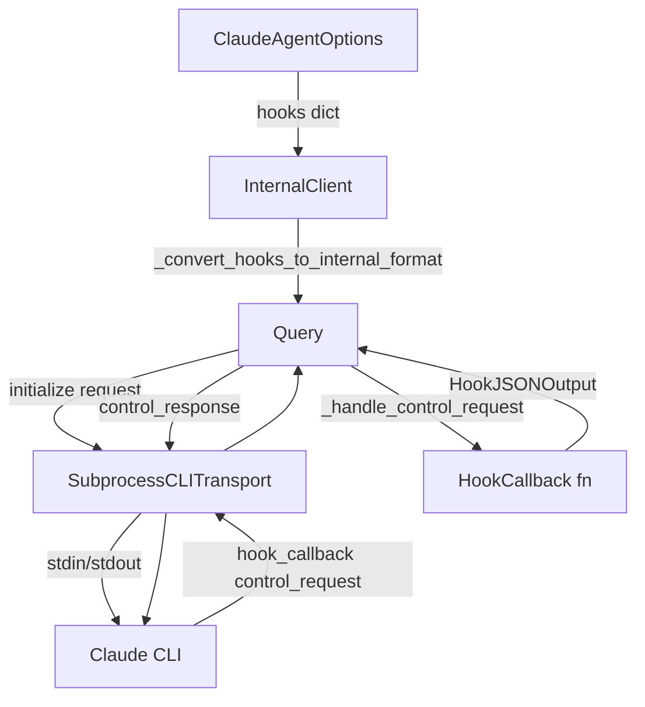
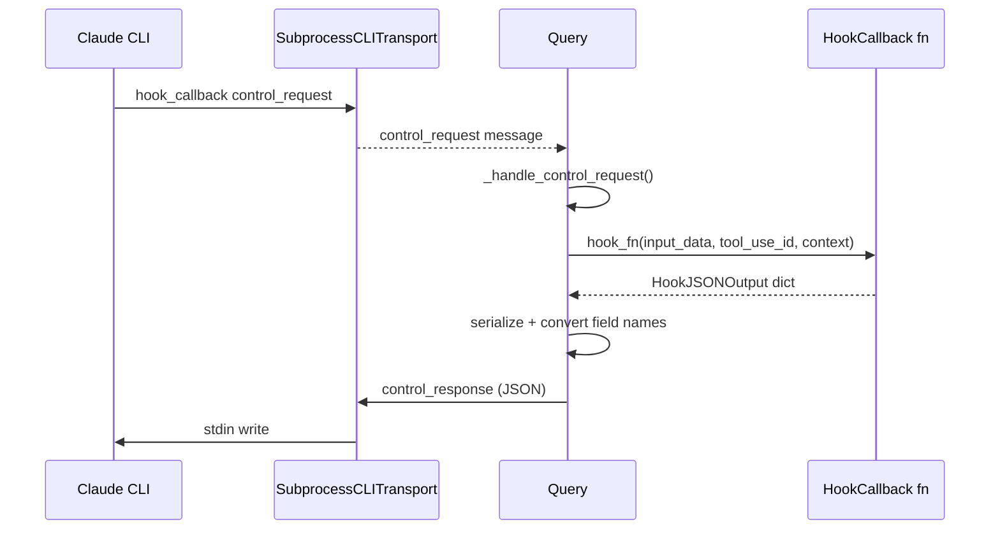
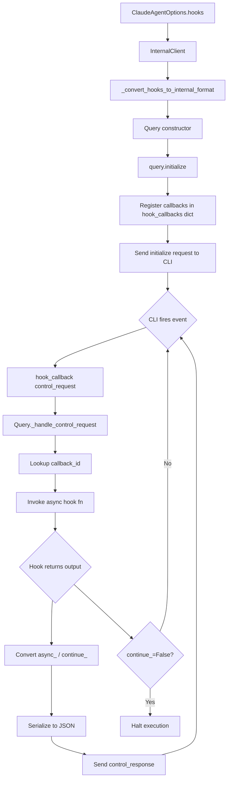

# Hook System

The Hook System in the Claude Agent SDK provides a powerful, event-driven mechanism for intercepting and influencing Claude's tool execution lifecycle. Hooks allow developers to register asynchronous Python callbacks that fire at specific points during a session — before a tool runs, after it completes, on notifications, and more — enabling fine-grained access control, observability, and behavioral customization without modifying the underlying agent logic.

Hooks are configured via `ClaudeAgentOptions` and are transmitted to the Claude CLI subprocess through the control protocol during session initialization. Each hook callback receives structured input about the current event and can return a rich output object that influences Claude's next action.

---

## Architecture Overview

The hook system spans several layers of the SDK: the public types API, the internal client, the `Query` control-protocol handler, and the subprocess transport.



The flow begins when `ClaudeAgentOptions.hooks` is passed to the client. The `InternalClient` converts the typed `HookMatcher` structures into a plain dictionary format understood by `Query`. During session initialization, `Query` registers all hook callbacks and sends their identifiers to the CLI. When the CLI fires a hook event, it sends a `hook_callback` control request back through the transport, `Query` dispatches it to the appropriate Python callback, and the result is serialized and returned to the CLI.

Sources: [src/claude_agent_sdk/_internal/client.py:1-50](../../../src/claude_agent_sdk/_internal/client.py#L1-L50), [tests/test_tool_callbacks.py:1-60](../../../tests/test_tool_callbacks.py#L1-L60)

---

## Core Types

### `HookMatcher`

A `HookMatcher` groups one or more hook callback functions with an optional tool-name matcher and an optional timeout. It is the primary unit of hook configuration.

| Field | Type | Description |
|---|---|---|
| `matcher` | `str \| None` | Tool name pattern to match (e.g., `"Bash"`). `None` matches all events. |
| `hooks` | `list[HookCallable]` | List of async callback functions to invoke. |
| `timeout` | `int \| None` | Optional timeout in milliseconds for the hook execution. |

Sources: [src/claude_agent_sdk/types.py](../../../src/claude_agent_sdk/types.py), [examples/hooks.py:85-100](../../../examples/hooks.py#L85-L100)

### `HookInput`

`HookInput` is a `TypedDict` representing the data passed to every hook callback. Its fields vary by event type but always include session metadata.

| Field | Type | Description |
|---|---|---|
| `session_id` | `str` | The active session identifier. |
| `transcript_path` | `str` | Path to the session transcript file. |
| `cwd` | `str` | Current working directory of the CLI process. |
| `hook_event_name` | `str` | The name of the hook event (e.g., `"PreToolUse"`). |
| `tool_name` | `str \| None` | Name of the tool being used (tool-related events). |
| `tool_input` | `dict \| None` | Input arguments to the tool. |
| `tool_response` | `Any \| None` | Tool output (PostToolUse events). |
| `tool_use_id` | `str \| None` | Unique ID for the tool use invocation. |
| `message` | `str \| None` | Notification message text (Notification events). |
| `notification_type` | `str \| None` | Notification category (Notification events). |
| `agent_id` | `str \| None` | Sub-agent identifier (SubagentStart events). |

Sources: [tests/test_tool_callbacks.py:160-200](../../../tests/test_tool_callbacks.py#L160-L200), [e2e-tests/test_hook_events.py:40-70](../../../e2e-tests/test_hook_events.py#L40-L70)

### `HookContext`

`HookContext` is passed as the third argument to every hook callback. It carries contextual metadata about the invocation environment.

Sources: [src/claude_agent_sdk/types.py](../../../src/claude_agent_sdk/types.py), [e2e-tests/test_hooks.py:20-35](../../../e2e-tests/test_hooks.py#L20-L35)

### `HookJSONOutput`

`HookJSONOutput` is the return type for hook callbacks. It is a `TypedDict` with both universal control fields and a `hookSpecificOutput` nested structure.

#### Universal Control Fields

| Field | Type | Description |
|---|---|---|
| `continue_` | `bool \| None` | If `False`, halts further agent execution. Serialized as `"continue"` in the CLI protocol. |
| `stopReason` | `str \| None` | Human-readable reason for stopping (used with `continue_=False`). |
| `suppressOutput` | `bool \| None` | Whether to suppress tool output from Claude's context. |
| `systemMessage` | `str \| None` | A message injected into the system context. |
| `reason` | `str \| None` | A human-readable explanation for the hook's decision. |
| `decision` | `str \| None` | A decision string (e.g., `"block"`). |
| `async_` | `bool \| None` | If `True`, hook runs asynchronously. Serialized as `"async"` in the CLI protocol. |
| `asyncTimeout` | `int \| None` | Timeout in milliseconds for async hooks. |

> **Field Name Conversion:** Python reserved words `async` and `continue` cannot be used as dictionary keys directly. The SDK accepts `async_` and `continue_` in the output dict and automatically converts them to `"async"` and `"continue"` before sending to the CLI.

Sources: [tests/test_tool_callbacks.py:225-290](../../../tests/test_tool_callbacks.py#L225-L290), [tests/test_tool_callbacks.py:291-340](../../../tests/test_tool_callbacks.py#L291-L340)

#### `hookSpecificOutput` Fields

The `hookSpecificOutput` nested object carries event-specific data. Its `hookEventName` field determines which sub-fields are valid.

| `hookEventName` | Additional Fields | Description |
|---|---|---|
| `PreToolUse` | `permissionDecision`, `permissionDecisionReason`, `additionalContext`, `updatedInput` | Control tool execution permission. |
| `PostToolUse` | `additionalContext`, `updatedMCPToolOutput` | Provide feedback or modify MCP tool output. |
| `Notification` | `additionalContext` | Respond to agent notifications. |
| `PermissionRequest` | `decision` | Programmatically answer permission requests. |
| `SubagentStart` | `additionalContext` | React to sub-agent creation. |
| `SessionStart` | `additionalContext` | Inject context at session initialization. |
| `UserPromptSubmit` | `additionalContext` | Inject context when a user prompt is submitted. |

Sources: [tests/test_tool_callbacks.py:370-500](../../../tests/test_tool_callbacks.py#L370-L500), [examples/hooks.py:50-80](../../../examples/hooks.py#L50-L80)

---

## Supported Hook Events

The SDK supports the following hook event types as keys in the `ClaudeAgentOptions.hooks` dictionary:

| Event Name | Trigger Point | Typical Use Case |
|---|---|---|
| `PreToolUse` | Before a tool is invoked | Access control, input validation, command blocking |
| `PostToolUse` | After a tool completes | Output monitoring, error detection, context injection |
| `Notification` | When the agent emits a notification | Logging, alerting, external integrations |
| `PermissionRequest` | When the CLI requests permission | Programmatic permission granting/denying |
| `SubagentStart` | When a sub-agent is spawned | Sub-agent monitoring and control |
| `SessionStart` | At session initialization | Injecting global context or instructions |
| `UserPromptSubmit` | When a user prompt is submitted | Adding context to every user turn |

Sources: [e2e-tests/test_hook_events.py:1-180](../../../e2e-tests/test_hook_events.py#L1-L180), [tests/test_tool_callbacks.py:500-560](../../../tests/test_tool_callbacks.py#L500-L560), [examples/hooks.py:165-215](../../../examples/hooks.py#L165-L215)

---

## Configuration

Hooks are configured by passing a `hooks` dictionary to `ClaudeAgentOptions`. The dictionary maps event name strings to lists of `HookMatcher` objects.

```python
from claude_agent_sdk import ClaudeAgentOptions, ClaudeSDKClient, HookMatcher
from claude_agent_sdk.types import HookContext, HookInput, HookJSONOutput

async def my_pre_tool_hook(
    input_data: HookInput,
    tool_use_id: str | None,
    context: HookContext,
) -> HookJSONOutput:
    if input_data.get("tool_name") == "Bash":
        command = input_data.get("tool_input", {}).get("command", "")
        if "rm -rf" in command:
            return {
                "hookSpecificOutput": {
                    "hookEventName": "PreToolUse",
                    "permissionDecision": "deny",
                    "permissionDecisionReason": "Destructive commands are not allowed",
                }
            }
    return {}

options = ClaudeAgentOptions(
    allowed_tools=["Bash", "Write"],
    hooks={
        "PreToolUse": [
            HookMatcher(matcher="Bash", hooks=[my_pre_tool_hook]),
        ],
    },
)
```

Sources: [examples/hooks.py:85-115](../../../examples/hooks.py#L85-L115), [e2e-tests/test_hooks.py:30-65](../../../e2e-tests/test_hooks.py#L30-L65)

### Multiple Hooks Per Event

Multiple `HookMatcher` entries can be registered for the same event. Multiple callbacks can also be placed within a single `HookMatcher`. Hooks with `matcher=None` fire for all tool invocations of that event type.

```python
options = ClaudeAgentOptions(
    allowed_tools=["Bash"],
    hooks={
        "Notification": [HookMatcher(hooks=[track_hook])],
        "PreToolUse":   [HookMatcher(matcher="Bash", hooks=[track_hook])],
        "PostToolUse":  [HookMatcher(matcher="Bash", hooks=[track_hook])],
    },
)
```

Sources: [e2e-tests/test_hook_events.py:130-175](../../../e2e-tests/test_hook_events.py#L130-L175)

---

## Internal Processing Pipeline

### Hook Registration (`InternalClient`)

When `process_query` is called, `InternalClient._convert_hooks_to_internal_format` transforms the typed `HookMatcher` list into a plain dictionary structure that `Query` can process.

```python
def _convert_hooks_to_internal_format(
    self, hooks: dict[HookEvent, list[HookMatcher]]
) -> dict[str, list[dict[str, Any]]]:
    internal_hooks: dict[str, list[dict[str, Any]]] = {}
    for event, matchers in hooks.items():
        internal_hooks[event] = []
        for matcher in matchers:
            internal_matcher: dict[str, Any] = {
                "matcher": matcher.matcher if hasattr(matcher, "matcher") else None,
                "hooks": matcher.hooks if hasattr(matcher, "hooks") else [],
            }
            if hasattr(matcher, "timeout") and matcher.timeout is not None:
                internal_matcher["timeout"] = matcher.timeout
            internal_hooks[event].append(internal_matcher)
    return internal_hooks
```

Sources: [src/claude_agent_sdk/_internal/client.py:22-42](../../../src/claude_agent_sdk/_internal/client.py#L22-L42)

### Control Protocol Dispatch (`Query`)

The `Query` class is the central dispatcher for all control protocol messages, including hook callbacks. During `initialize()`, hooks are registered and assigned `callback_id` strings stored in `query.hook_callbacks`. When the CLI fires a `hook_callback` subtype control request, `Query._handle_control_request` looks up the callback by ID and invokes it.



Sources: [tests/test_tool_callbacks.py:155-200](../../../tests/test_tool_callbacks.py#L155-L200), [src/claude_agent_sdk/_internal/client.py:120-165](../../../src/claude_agent_sdk/_internal/client.py#L120-L165)

### Field Name Conversion

Because `async` and `continue` are reserved words in Python, the SDK uses `async_` and `continue_` in `HookJSONOutput`. Before the response is serialized and sent to the CLI, the `Query` layer converts these keys:

| Python Key | CLI Protocol Key |
|---|---|
| `async_` | `async` |
| `continue_` | `continue` |

All other keys are passed through unchanged.

```python
# From test verification:
assert result.get("async") is True       # async_ → async
assert "async_" not in result
assert result.get("continue") is False   # continue_ → continue
assert "continue_" not in result
```

Sources: [tests/test_tool_callbacks.py:341-395](../../../tests/test_tool_callbacks.py#L341-L395)

---

## Hook Event Patterns

### PreToolUse: Access Control

`PreToolUse` hooks fire before any tool invocation and are the primary mechanism for implementing security policies. The `permissionDecision` field in `hookSpecificOutput` controls whether the tool is allowed to proceed.

```python
async def check_bash_command(
    input_data: HookInput, tool_use_id: str | None, context: HookContext
) -> HookJSONOutput:
    command = input_data.get("tool_input", {}).get("command", "")
    if "foo.sh" in command:
        return {
            "hookSpecificOutput": {
                "hookEventName": "PreToolUse",
                "permissionDecision": "deny",
                "permissionDecisionReason": "Command contains invalid pattern: foo.sh",
            }
        }
    return {}
```

`permissionDecision` accepts `"allow"` or `"deny"`. When `"deny"` is returned, the tool is blocked and Claude receives the `permissionDecisionReason` as feedback.

Sources: [examples/hooks.py:42-60](../../../examples/hooks.py#L42-L60), [e2e-tests/test_hooks.py:18-65](../../../e2e-tests/test_hooks.py#L18-L65)

### PostToolUse: Output Monitoring

`PostToolUse` hooks fire after a tool completes. They can inject additional context, modify MCP tool output, or halt execution if a critical condition is detected.

```python
async def review_tool_output(
    input_data: HookInput, tool_use_id: str | None, context: HookContext
) -> HookJSONOutput:
    tool_response = input_data.get("tool_response", "")
    if "error" in str(tool_response).lower():
        return {
            "systemMessage": "⚠️ The command produced an error",
            "hookSpecificOutput": {
                "hookEventName": "PostToolUse",
                "additionalContext": "The command encountered an error.",
            },
        }
    return {}
```

Sources: [examples/hooks.py:62-80](../../../examples/hooks.py#L62-L80), [tests/test_tool_callbacks.py:430-465](../../../tests/test_tool_callbacks.py#L430-L465)

### Halting Execution with `continue_=False`

Any hook can stop the agent's execution loop by returning `continue_=False` along with an optional `stopReason`:

```python
async def stop_on_error_hook(
    input_data: HookInput, tool_use_id: str | None, context: HookContext
) -> HookJSONOutput:
    if "critical" in str(input_data.get("tool_response", "")).lower():
        return {
            "continue_": False,
            "stopReason": "Critical error detected - execution halted for safety",
            "systemMessage": "🛑 Execution stopped due to critical error",
        }
    return {"continue_": True}
```

Sources: [examples/hooks.py:100-120](../../../examples/hooks.py#L100-L120), [e2e-tests/test_hooks.py:68-110](../../../e2e-tests/test_hooks.py#L68-L110)

### Notification Hooks

`Notification` hooks do not require a `matcher` (since notifications are not tool-specific). They receive `message` and `notification_type` fields in `HookInput`:

```python
async def notification_hook(
    input_data: HookInput, tool_use_id: str | None, context: HookContext
) -> HookJSONOutput:
    print(f"Notification: {input_data.get('message')} [{input_data.get('notification_type')}]")
    return {
        "hookSpecificOutput": {
            "hookEventName": "Notification",
            "additionalContext": "Notification received",
        },
    }

options = ClaudeAgentOptions(
    hooks={
        "Notification": [HookMatcher(hooks=[notification_hook])],
    }
)
```

Sources: [e2e-tests/test_hook_events.py:80-120](../../../e2e-tests/test_hook_events.py#L80-L120), [tests/test_tool_callbacks.py:355-400](../../../tests/test_tool_callbacks.py#L355-L400)

---

## Error Handling

If a hook callback raises an exception, `Query` catches the error, logs it, and sends a control response with `subtype: "error"` back to the CLI rather than propagating the exception. This prevents a buggy hook from crashing the entire session.

```python
# From test verification:
async def error_callback(...):
    raise ValueError("Callback error")

# After _handle_control_request:
assert '"subtype": "error"' in response
assert "Callback error" in response
```

Sources: [tests/test_tool_callbacks.py:120-155](../../../tests/test_tool_callbacks.py#L120-L155)

---

## Complete Lifecycle Diagram



Sources: [src/claude_agent_sdk/_internal/client.py:100-175](../../../src/claude_agent_sdk/_internal/client.py#L100-L175), [tests/test_tool_callbacks.py:155-225](../../../tests/test_tool_callbacks.py#L155-L225)

---

## Summary

The Hook System provides a structured, event-driven extension point for the Claude Agent SDK. By configuring `HookMatcher` objects in `ClaudeAgentOptions.hooks`, developers can intercept any supported lifecycle event — from tool permission checks (`PreToolUse`) to post-execution monitoring (`PostToolUse`), notifications, sub-agent creation, and permission requests. Hook callbacks are fully asynchronous Python functions that receive typed `HookInput` data and return `HookJSONOutput` dicts, with the SDK transparently handling Python-to-CLI field name conversions (`async_` → `async`, `continue_` → `continue`). The system is robust against hook failures, converting exceptions into structured error responses rather than crashing the session.