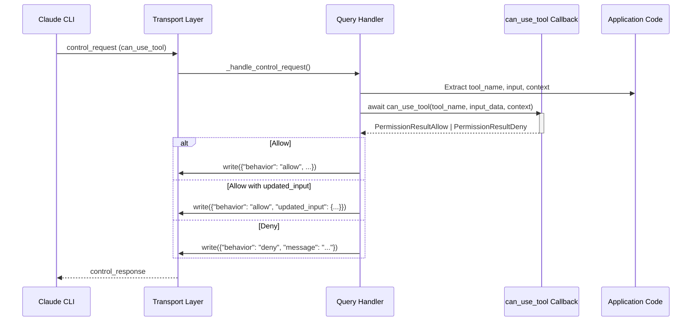
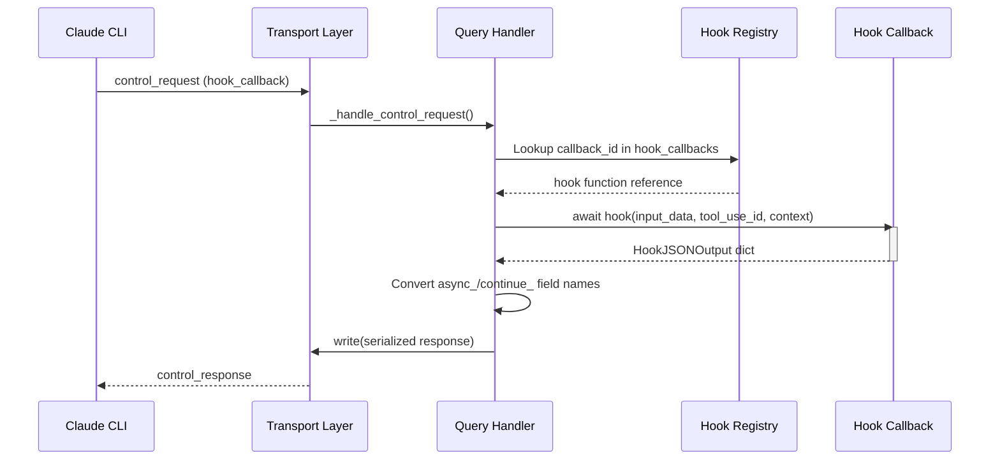
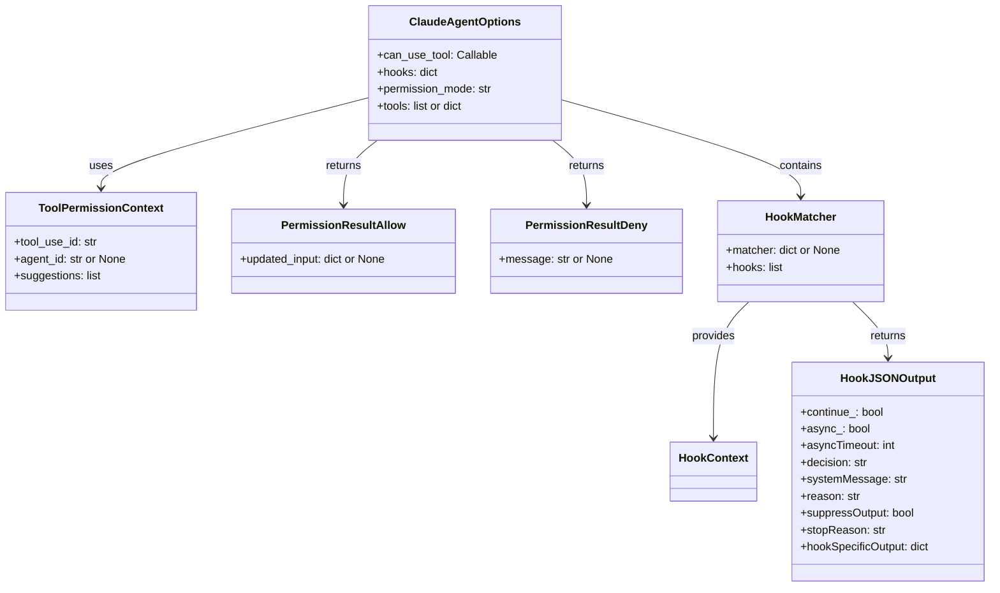

# Tool Permissions & Callbacks

The Tool Permissions & Callbacks system in the Claude Agent SDK provides a programmatic interface for intercepting, inspecting, and controlling Claude's tool usage at runtime. Through two complementary mechanisms — the `can_use_tool` permission callback and the hooks system — developers can implement fine-grained access control, audit logging, input sanitization, and behavioral customization without modifying the underlying agent logic.

This page covers the data types, callback signatures, control flow, and integration patterns for both permission callbacks and hook callbacks. For information on session management and transport configuration, see the relevant sections of the SDK documentation.

---

## Overview of the Two Mechanisms

The SDK exposes two distinct but complementary callback systems:

| Mechanism | Purpose | Trigger | Return Type |
|---|---|---|---|
| `can_use_tool` | Allow, deny, or modify a tool call before execution | Every tool invocation requiring permission | `PermissionResultAllow` or `PermissionResultDeny` |
| Hooks (`hooks`) | Observe or modify tool lifecycle events, notifications, subagent events | Configurable via event type and matcher | `HookJSONOutput` (typed dict) |

Sources: [examples/tool_permission_callback.py:1-50](../../../examples/tool_permission_callback.py#L1-L50), [tests/test_tool_callbacks.py:1-60](../../../tests/test_tool_callbacks.py#L1-L60)

---

## Tool Permission Callbacks (`can_use_tool`)

### Purpose and Behavior

The `can_use_tool` callback is invoked by the SDK whenever Claude attempts to use a tool that requires a permission decision. The callback receives the tool name, its input parameters, and a `ToolPermissionContext` object, then returns either an allow or deny result.

> **Note:** Certain read-only commands may be auto-allowed by the Claude CLI without consulting the SDK callback. Tools such as `touch` (which modify state) reliably trigger the callback.

Sources: [e2e-tests/test_tool_permissions.py:12-25](../../../e2e-tests/test_tool_permissions.py#L12-L25)

### Callback Signature

```python
async def my_permission_callback(
    tool_name: str,
    input_data: dict,
    context: ToolPermissionContext,
) -> PermissionResultAllow | PermissionResultDeny:
    ...
```

| Parameter | Type | Description |
|---|---|---|
| `tool_name` | `str` | Name of the tool Claude wants to use (e.g., `"Bash"`, `"Write"`, `"Read"`) |
| `input_data` | `dict` | The raw input parameters for the tool call |
| `context` | `ToolPermissionContext` | Additional context including `tool_use_id`, `agent_id`, and `suggestions` |

Sources: [tests/test_tool_callbacks.py:47-60](../../../tests/test_tool_callbacks.py#L47-L60), [examples/tool_permission_callback.py:22-37](../../../examples/tool_permission_callback.py#L22-L37)

### `ToolPermissionContext` Fields

| Field | Type | Description |
|---|---|---|
| `tool_use_id` | `str` | Unique identifier for this tool use invocation |
| `agent_id` | `str \| None` | Identifier of the subagent making the request; `None` for the top-level agent |
| `suggestions` | `list` | Permission suggestions provided by the CLI |

Sources: [tests/test_tool_callbacks.py:106-150](../../../tests/test_tool_callbacks.py#L106-L150)

### Return Types

#### `PermissionResultAllow`

Returned to permit the tool to execute. Optionally accepts `updated_input` to override the tool's input parameters before execution.

```python
# Simple allow
return PermissionResultAllow()

# Allow with modified input (e.g., redirect a file path)
modified_input = input_data.copy()
modified_input["file_path"] = "./safe_output/file.txt"
return PermissionResultAllow(updated_input=modified_input)
```

Sources: [examples/tool_permission_callback.py:52-60](../../../examples/tool_permission_callback.py#L52-L60), [tests/test_tool_callbacks.py:78-100](../../../tests/test_tool_callbacks.py#L78-L100)

#### `PermissionResultDeny`

Returned to block the tool from executing. Accepts an optional `message` explaining the denial reason, which is surfaced back to Claude.

```python
return PermissionResultDeny(
    message=f"Dangerous command pattern detected: {dangerous}"
)
```

Sources: [examples/tool_permission_callback.py:44-49](../../../examples/tool_permission_callback.py#L44-L49), [tests/test_tool_callbacks.py:72-76](../../../tests/test_tool_callbacks.py#L72-L76)

### Permission Callback Data Flow

The following sequence diagram shows how a tool permission request flows through the SDK when `can_use_tool` is configured:



Sources: [tests/test_tool_callbacks.py:42-100](../../../tests/test_tool_callbacks.py#L42-L100)

### Control Request Wire Format

The SDK receives a `control_request` message from the Claude CLI with the following structure:

```json
{
  "type": "control_request",
  "request_id": "test-1",
  "request": {
    "subtype": "can_use_tool",
    "tool_name": "Bash",
    "input": { "command": "touch /tmp/file.txt" },
    "permission_suggestions": [],
    "tool_use_id": "toolu_01ABC123",
    "agent_id": "agent-456"
  }
}
```

The `agent_id` field is absent (defaults to `None`) when the request originates from the top-level agent rather than a subagent.

Sources: [tests/test_tool_callbacks.py:108-130](../../../tests/test_tool_callbacks.py#L108-L130), [tests/test_tool_callbacks.py:134-155](../../../tests/test_tool_callbacks.py#L134-L155)

### Exception Handling

If the `can_use_tool` callback raises an unhandled exception, the SDK catches it and sends an error response back to the CLI rather than crashing the session:

```json
{
  "subtype": "error",
  "message": "Callback error"
}
```

Sources: [tests/test_tool_callbacks.py:157-185](../../../tests/test_tool_callbacks.py#L157-L185)

### Practical Example: Multi-Rule Permission Callback

The following example (from the SDK examples) demonstrates a realistic callback implementing multiple policies:

```python
async def my_permission_callback(
    tool_name: str,
    input_data: dict,
    context: ToolPermissionContext
) -> PermissionResultAllow | PermissionResultDeny:
    # Always allow read operations
    if tool_name in ["Read", "Glob", "Grep"]:
        return PermissionResultAllow()

    # Deny writes to system directories
    if tool_name in ["Write", "Edit", "MultiEdit"]:
        file_path = input_data.get("file_path", "")
        if file_path.startswith("/etc/") or file_path.startswith("/usr/"):
            return PermissionResultDeny(
                message=f"Cannot write to system directory: {file_path}"
            )

    # Block dangerous Bash patterns
    if tool_name == "Bash":
        command = input_data.get("command", "")
        for dangerous in ["rm -rf", "sudo", "chmod 777"]:
            if dangerous in command:
                return PermissionResultDeny(
                    message=f"Dangerous command pattern detected: {dangerous}"
                )
        return PermissionResultAllow()

    return PermissionResultDeny(message="User denied permission")
```

Sources: [examples/tool_permission_callback.py:22-80](../../../examples/tool_permission_callback.py#L22-L80)

---

## Hook Callbacks (`hooks`)

### Purpose and Architecture

The hooks system provides a more granular, event-driven mechanism for observing and influencing Claude's behavior at multiple lifecycle points. Unlike `can_use_tool`, hooks are organized by **event type** and filtered by optional **matchers**. Multiple hooks can be registered for the same event.

Hook callbacks are registered via the `hooks` key in `ClaudeAgentOptions` and are invoked by the SDK when the CLI emits a `hook_callback` control request.

Sources: [tests/test_tool_callbacks.py:191-240](../../../tests/test_tool_callbacks.py#L191-L240), [tests/test_tool_callbacks.py:338-360](../../../tests/test_tool_callbacks.py#L338-L360)

### Hook Event Types

| Event Type | Description |
|---|---|
| `PreToolUse` | Fired before a tool is executed; can allow/deny/modify input |
| `PostToolUse` | Fired after a tool completes; can modify MCP tool output |
| `Notification` | Fired for informational notifications from Claude |
| `PermissionRequest` | Fired when a permission decision is needed via the hook system |
| `SubagentStart` | Fired when a subagent is launched |
| `tool_use_start` | Alternative hook event key (SDK-level alias) |

Sources: [tests/test_tool_callbacks.py:338-360](../../../tests/test_tool_callbacks.py#L338-L360), [tests/test_tool_callbacks.py:364-430](../../../tests/test_tool_callbacks.py#L364-L430)

### Hook Callback Signature

```python
async def my_hook(
    input_data: HookInput,
    tool_use_id: str | None,
    context: HookContext,
) -> HookJSONOutput:
    ...
```

| Parameter | Type | Description |
|---|---|---|
| `input_data` | `HookInput` | Event-specific input data (dict-like) containing session info and event fields |
| `tool_use_id` | `str \| None` | The tool use ID associated with the event, if applicable |
| `context` | `HookContext` | Additional context for the hook invocation |

Sources: [tests/test_tool_callbacks.py:200-215](../../../tests/test_tool_callbacks.py#L200-L215)

### `HookInput` Common Fields

All hook inputs include these base fields:

| Field | Description |
|---|---|
| `session_id` | The current session identifier |
| `transcript_path` | Path to the session transcript file |
| `cwd` | Current working directory |
| `hook_event_name` | The name of the hook event being fired |

Event-specific fields are included depending on the hook type (e.g., `tool_name`, `tool_input`, `message`, `agent_id`).

Sources: [tests/test_tool_callbacks.py:380-420](../../../tests/test_tool_callbacks.py#L380-L420)

### `HookJSONOutput` Fields

The return value from a hook callback is a typed dict (`HookJSONOutput`) with the following fields:

#### Control Fields

| Field | CLI Name | Type | Description |
|---|---|---|---|
| `continue_` | `continue` | `bool` | Whether the session should continue |
| `suppressOutput` | `suppressOutput` | `bool` | Suppress output display |
| `stopReason` | `stopReason` | `str` | Reason for stopping |
| `async_` | `async` | `bool` | Whether this is an async hook response |
| `asyncTimeout` | `asyncTimeout` | `int` | Timeout in milliseconds for async hooks |

> **Important:** The Python-safe field names `async_` and `continue_` are automatically converted to `async` and `continue` when serialized to the CLI wire format, since `async` and `continue` are reserved keywords in Python.

Sources: [tests/test_tool_callbacks.py:243-310](../../../tests/test_tool_callbacks.py#L243-L310), [tests/test_tool_callbacks.py:312-340](../../../tests/test_tool_callbacks.py#L312-L340)

#### Decision Fields

| Field | Type | Description |
|---|---|---|
| `decision` | `str` | Decision outcome (e.g., `"block"`) |
| `systemMessage` | `str` | Message to inject into the system context |
| `reason` | `str` | Human-readable reason for the decision |

Sources: [tests/test_tool_callbacks.py:243-290](../../../tests/test_tool_callbacks.py#L243-L290)

#### `hookSpecificOutput` by Event Type

The `hookSpecificOutput` field contains event-specific structured data:

**`PreToolUse`**

| Field | Description |
|---|---|
| `hookEventName` | `"PreToolUse"` |
| `permissionDecision` | `"allow"` or `"deny"` |
| `permissionDecisionReason` | Reason for the permission decision |
| `updatedInput` | Modified tool input to pass to the tool |
| `additionalContext` | Extra context string for Claude |

**`PostToolUse`**

| Field | Description |
|---|---|
| `hookEventName` | `"PostToolUse"` |
| `updatedMCPToolOutput` | Modified output to return from an MCP tool |

**`Notification`**

| Field | Description |
|---|---|
| `hookEventName` | `"Notification"` |
| `additionalContext` | Additional context string |

**`PermissionRequest`**

| Field | Description |
|---|---|
| `hookEventName` | `"PermissionRequest"` |
| `decision` | Decision object (e.g., `{"type": "allow"}`) |

**`SubagentStart`**

| Field | Description |
|---|---|
| `hookEventName` | `"SubagentStart"` |
| `additionalContext` | Additional context string |

Sources: [tests/test_tool_callbacks.py:362-490](../../../tests/test_tool_callbacks.py#L362-L490)

### Hook Data Flow



Sources: [tests/test_tool_callbacks.py:191-240](../../../tests/test_tool_callbacks.py#L191-L240)

### Registering Hooks via `ClaudeAgentOptions`

Hooks are registered using `HookMatcher` objects within the `hooks` dictionary on `ClaudeAgentOptions`:

```python
from claude_agent_sdk import ClaudeAgentOptions, HookMatcher

options = ClaudeAgentOptions(
    hooks={
        "PreToolUse": [
            HookMatcher(matcher={"tool": "Bash"}, hooks=[my_pre_tool_hook])
        ],
        "Notification": [
            HookMatcher(hooks=[my_notification_hook])  # matcher=None matches all
        ],
        "SubagentStart": [
            HookMatcher(hooks=[my_subagent_hook])
        ],
        "PermissionRequest": [
            HookMatcher(hooks=[my_permission_hook])
        ],
    }
)
```

The `matcher` field in `HookMatcher` filters which events the hook receives (e.g., `{"tool": "Bash"}` limits the hook to Bash tool events). A `None` matcher matches all events of that type.

Sources: [tests/test_tool_callbacks.py:338-360](../../../tests/test_tool_callbacks.py#L338-L360), [tests/test_tool_callbacks.py:504-530](../../../tests/test_tool_callbacks.py#L504-L530)

### Hook Wire Format

The CLI sends a `hook_callback` control request:

```json
{
  "type": "control_request",
  "request_id": "test-hook-1",
  "request": {
    "subtype": "hook_callback",
    "callback_id": "test_hook_0",
    "input": {
      "session_id": "sess-1",
      "transcript_path": "/tmp/t",
      "cwd": "/home",
      "hook_event_name": "PreToolUse",
      "tool_name": "Bash",
      "tool_input": { "command": "ls" },
      "tool_use_id": "tu-456"
    },
    "tool_use_id": "tu-456"
  }
}
```

The response is written back as a serialized JSON object containing the hook's output nested under `response.response`.

Sources: [tests/test_tool_callbacks.py:218-240](../../../tests/test_tool_callbacks.py#L218-L240), [tests/test_tool_callbacks.py:432-460](../../../tests/test_tool_callbacks.py#L432-L460)

---

## Configuring `ClaudeAgentOptions`

Both callback mechanisms are configured through `ClaudeAgentOptions`:

```python
from claude_agent_sdk import ClaudeAgentOptions

options = ClaudeAgentOptions(
    can_use_tool=my_permission_callback,   # Permission callback
    hooks={                                 # Hook callbacks
        "PreToolUse": [HookMatcher(matcher={"tool": "Bash"}, hooks=[my_hook])],
    },
    permission_mode="default",             # Ensure callbacks are invoked
    cwd=".",                               # Working directory
)
```

| Option | Type | Description |
|---|---|---|
| `can_use_tool` | `Callable \| None` | Async callback for tool permission decisions |
| `hooks` | `dict[str, list[HookMatcher]] \| None` | Hook event registrations by event type |
| `permission_mode` | `str` | Set to `"default"` to ensure SDK callbacks are consulted |
| `tools` | `list \| dict \| None` | Restrict or configure available tools |

Sources: [examples/tool_permission_callback.py:88-95](../../../examples/tool_permission_callback.py#L88-L95), [tests/test_tool_callbacks.py:325-340](../../../tests/test_tool_callbacks.py#L325-L340)

### Tool Availability Configuration

The `tools` option on `ClaudeAgentOptions` controls which built-in tools are available to Claude, independently of the permission callback:

| Value | Effect |
|---|---|
| `["Read", "Glob", "Grep"]` | Only the listed tools are available |
| `[]` | All built-in tools are disabled |
| `{"type": "preset", "preset": "claude_code"}` | All default Claude Code tools are enabled |

Sources: [examples/tools_option.py:18-90](../../../examples/tools_option.py#L18-L90)

---

## Class and Type Relationships



Sources: [tests/test_tool_callbacks.py:325-360](../../../tests/test_tool_callbacks.py#L325-L360), [e2e-tests/test_tool_permissions.py:14-45](../../../e2e-tests/test_tool_permissions.py#L14-L45)

---

## Field Name Conversion

Because `async` and `continue` are reserved keywords in Python, the SDK uses `async_` and `continue_` in `HookJSONOutput`. When serializing responses to the CLI wire format, the SDK automatically converts these names:

| Python Field | CLI Wire Field |
|---|---|
| `async_` | `async` |
| `continue_` | `continue` |

All other field names are passed through unchanged.

```python
# In your hook callback:
return {
    "async_": True,        # Sent to CLI as "async": true
    "continue_": False,    # Sent to CLI as "continue": false
    "asyncTimeout": 5000,  # Unchanged
}
```

Sources: [tests/test_tool_callbacks.py:312-340](../../../tests/test_tool_callbacks.py#L312-L340), [tests/test_tool_callbacks.py:243-310](../../../tests/test_tool_callbacks.py#L243-L310)

---

## End-to-End Usage Pattern

The following shows the complete pattern for using both mechanisms together with `ClaudeSDKClient`:

```python
async with ClaudeSDKClient(options=options) as client:
    await client.query("Please create a file at /tmp/output.txt")

    async for message in client.receive_response():
        if isinstance(message, AssistantMessage):
            for block in message.content:
                if isinstance(block, TextBlock):
                    print(f"Claude: {block.text}")
        elif isinstance(message, ResultMessage):
            print(f"Done. Cost: ${message.total_cost_usd:.4f}")
```

Sources: [examples/tool_permission_callback.py:96-125](../../../examples/tool_permission_callback.py#L96-L125), [e2e-tests/test_tool_permissions.py:44-55](../../../e2e-tests/test_tool_permissions.py#L44-L55)

---

## Summary

The Tool Permissions & Callbacks system provides two complementary layers of runtime control over Claude's tool usage. The `can_use_tool` callback offers a straightforward allow/deny/modify interface for any tool invocation, while the hooks system offers structured, event-driven interception across the full tool lifecycle (pre-use, post-use, notifications, subagent events, and permission requests). Both mechanisms are registered through `ClaudeAgentOptions` and are invoked via the SDK's internal `control_request` handling infrastructure. Key implementation details include automatic field name conversion for Python reserved keywords (`async_` → `async`, `continue_` → `continue`) and robust exception handling that prevents callback errors from terminating the session.