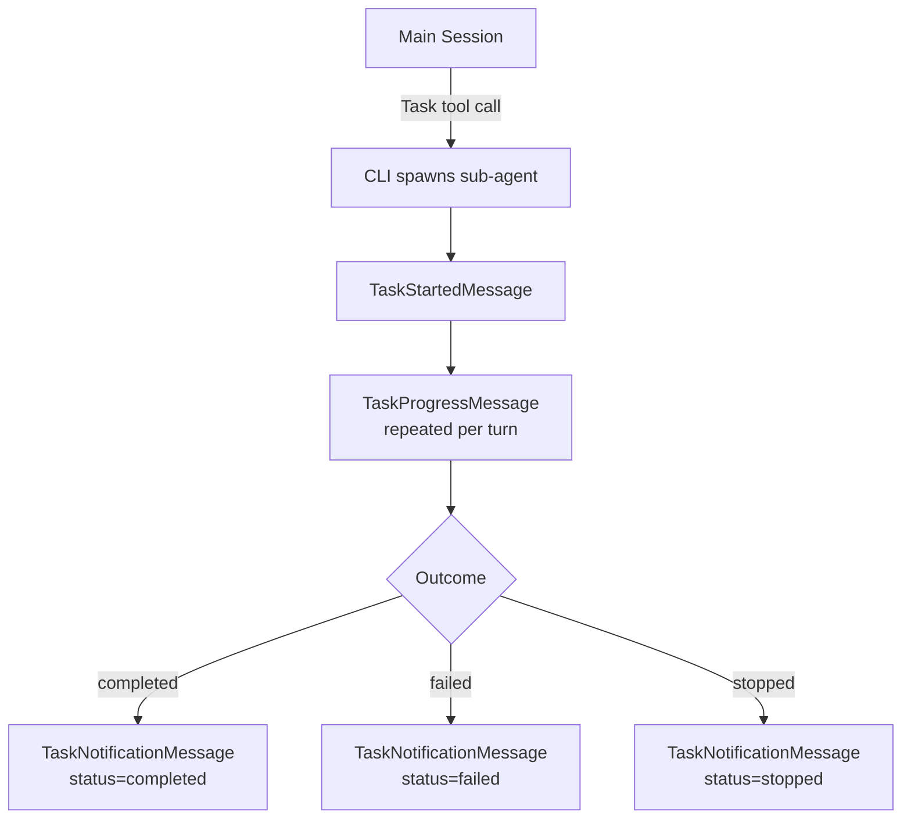
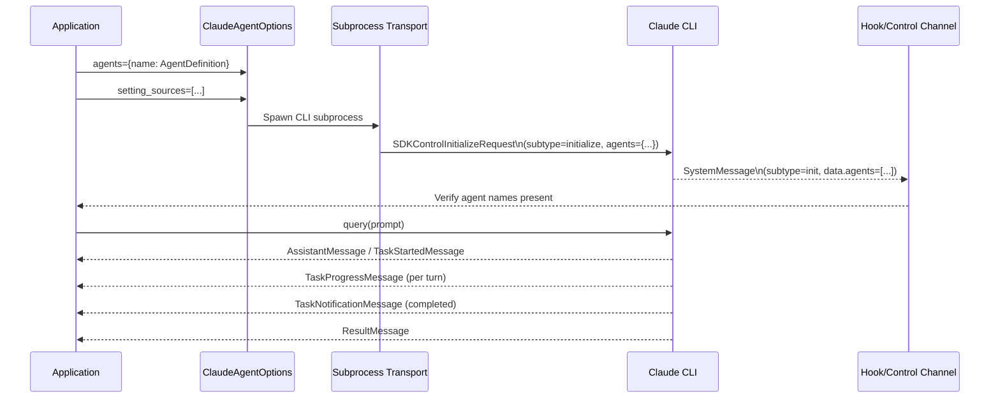
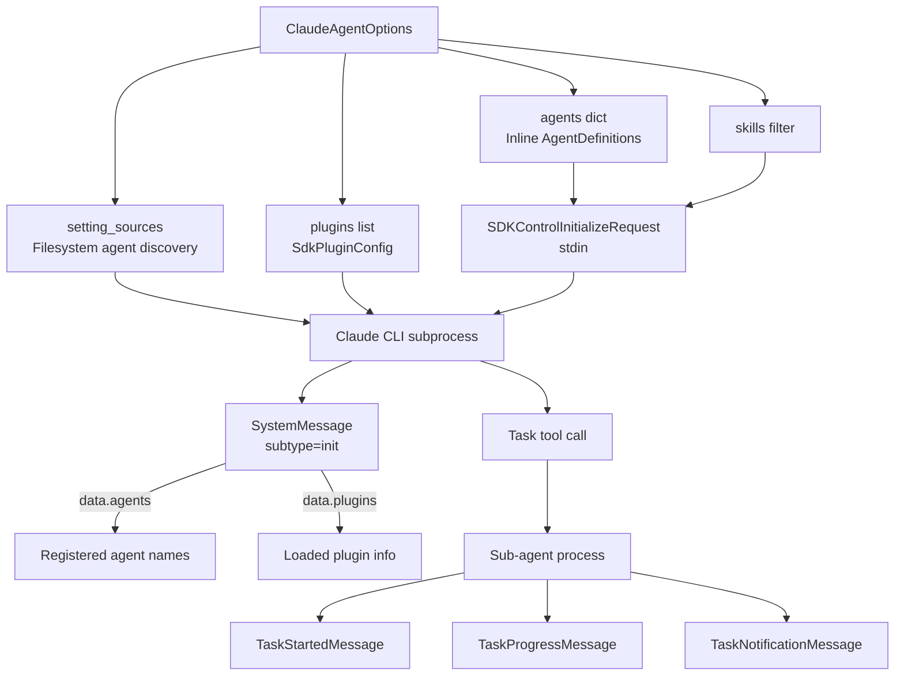

# Agents & Plugins

The Claude Agent SDK provides two complementary extensibility mechanisms: **Agents** and **Plugins**. Agents are custom AI sub-processes with their own prompts, tool sets, and models that can be spawned by the main Claude session to handle specialized tasks. Plugins are local directory-based extensions that augment Claude Code with custom commands, skills, and hooks. Together, these features allow developers to compose sophisticated multi-agent workflows and extend Claude Code's built-in capabilities beyond what a single session configuration can provide.

---

## Agents

### Overview

Agents are defined as named configurations that the Claude CLI can instantiate as sub-processes during a session. Each agent carries its own system prompt, allowed tool set, model selection, and runtime constraints. The main session can delegate tasks to these sub-agents using the `Task` tool, and the SDK propagates lifecycle events (start, progress, stop) back to the caller as typed messages.

Sources: [src/claude_agent_sdk/types.py:55-75](../../../src/claude_agent_sdk/types.py#L55-L75), [examples/agents.py:1-90](../../../examples/agents.py#L1-L90)

---

### `AgentDefinition` Data Structure

Every agent is described by an `AgentDefinition` dataclass. The fields map directly to the CLI's agent configuration schema and are serialized into the `initialize` control request sent over stdin at session start.

```python
@dataclass
class AgentDefinition:
    description: str
    prompt: str
    tools: list[str] | None = None
    disallowedTools: list[str] | None = None
    model: str | None = None
    skills: list[str] | None = None
    memory: Literal["user", "project", "local"] | None = None
    mcpServers: list[str | dict[str, Any]] | None = None
    initialPrompt: str | None = None
    maxTurns: int | None = None
    background: bool | None = None
    effort: Literal["low", "medium", "high", "max"] | int | None = None
    permissionMode: PermissionMode | None = None
```

Sources: [src/claude_agent_sdk/types.py:55-75](../../../src/claude_agent_sdk/types.py#L55-L75)

| Field | Type | Description |
|---|---|---|
| `description` | `str` | **Required.** Human-readable description of the agent's purpose. |
| `prompt` | `str` | **Required.** System prompt injected into the sub-agent's context. |
| `tools` | `list[str] \| None` | Allowlist of tool names available to the agent (e.g., `["Read", "Grep"]`). |
| `disallowedTools` | `list[str] \| None` | Explicit blocklist of tools the agent may not use. |
| `model` | `str \| None` | Model alias (`"sonnet"`, `"opus"`, `"haiku"`, `"inherit"`) or a full model ID. |
| `skills` | `list[str] \| None` | Skills enabled for this agent. |
| `memory` | `Literal["user","project","local"] \| None` | Memory scope for the agent. |
| `mcpServers` | `list[str \| dict] \| None` | MCP servers available to the agent (by name or inline config dict). |
| `initialPrompt` | `str \| None` | Prompt automatically sent when the agent starts. |
| `maxTurns` | `int \| None` | Maximum number of turns the agent may take. |
| `background` | `bool \| None` | Whether the agent runs in the background. |
| `effort` | `Literal \| int \| None` | Thinking effort level (`"low"` … `"max"` or a numeric budget). |
| `permissionMode` | `PermissionMode \| None` | Override permission mode for this agent. |

Sources: [src/claude_agent_sdk/types.py:55-75](../../../src/claude_agent_sdk/types.py#L55-L75)

---

### Registering Agents via `ClaudeAgentOptions`

Agents are registered by passing a `dict[str, AgentDefinition]` to the `agents` field of `ClaudeAgentOptions`. The dictionary key becomes the agent's name that the main session uses to invoke it.

```python
options = ClaudeAgentOptions(
    agents={
        "code-reviewer": AgentDefinition(
            description="Reviews code for best practices",
            prompt="You are a code reviewer. Analyze code for bugs...",
            tools=["Read", "Grep"],
            model="sonnet",
        ),
        "doc-writer": AgentDefinition(
            description="Writes comprehensive documentation",
            prompt="You are a technical documentation expert...",
            tools=["Read", "Write", "Edit"],
            model="sonnet",
        ),
    },
)
```

Sources: [examples/agents.py:30-57](../../../examples/agents.py#L30-L57), [src/claude_agent_sdk/types.py:617-620](../../../src/claude_agent_sdk/types.py#L617-L620)

---

### Agent Delivery via the Initialize Control Request

Agent definitions are transmitted to the CLI through the `SDKControlInitializeRequest`, which is sent over stdin at session startup. This design removes any size constraint that would exist if agents were passed as command-line arguments.

```python
class SDKControlInitializeRequest(TypedDict):
    subtype: Literal["initialize"]
    hooks: dict[HookEvent, Any] | None
    agents: NotRequired[dict[str, dict[str, Any]]]
```

Because agents travel through stdin (not the OS argument list), payloads exceeding 250 KB are fully supported. The end-to-end test `test_large_agent_definitions_via_initialize` validates this with 20 agents × 13 KB prompts ≈ 260 KB total.

Sources: [src/claude_agent_sdk/types.py:719-723](../../../src/claude_agent_sdk/types.py#L719-L723), [e2e-tests/test_agents_and_settings.py:139-175](../../../e2e-tests/test_agents_and_settings.py#L139-L175)

---

### Agent Lifecycle Messages

When the CLI spawns a sub-agent, the SDK surfaces lifecycle events as specialized `SystemMessage` subclasses. All three are subclasses of `SystemMessage`, so existing `isinstance(msg, SystemMessage)` checks remain compatible.



| Message Type | `subtype` | Key Fields |
|---|---|---|
| `TaskStartedMessage` | `"task_started"` | `task_id`, `description`, `uuid`, `session_id`, `tool_use_id`, `task_type` |
| `TaskProgressMessage` | `"task_progress"` | `task_id`, `description`, `usage` (`TaskUsage`), `last_tool_name` |
| `TaskNotificationMessage` | `"task_notification"` | `task_id`, `status` (`completed/failed/stopped`), `output_file`, `summary`, `usage` |

`TaskUsage` carries `total_tokens`, `tool_uses`, and `duration_ms`.

Sources: [src/claude_agent_sdk/types.py:461-510](../../../src/claude_agent_sdk/types.py#L461-L510)

---

### Sub-agent Hook Attribution

When hooks fire inside a sub-agent, the hook input carries `agent_id` and `agent_type` fields so callers can attribute each event to the correct sub-agent, even when multiple sub-agents run in parallel and interleave events on the same control channel.

```python
class _SubagentContextMixin(TypedDict, total=False):
    agent_id: str   # Identifies the sub-agent; absent on the main thread
    agent_type: str # Agent type name (e.g. "general-purpose", "code-reviewer")
```

The mixin is applied to `PreToolUseHookInput`, `PostToolUseHookInput`, `PostToolUseFailureHookInput`, and `PermissionRequestHookInput`.

Sources: [src/claude_agent_sdk/types.py:220-240](../../../src/claude_agent_sdk/types.py#L220-L240)

---

### Filesystem-Based Agents via `setting_sources`

In addition to inline `AgentDefinition` objects, agents can be loaded from Markdown files stored in `.claude/agents/` within the project directory. This is controlled by the `setting_sources` field of `ClaudeAgentOptions`.

```
<project_root>/
└── .claude/
    └── agents/
        └── my-agent.md   ← YAML frontmatter + prompt body
```

A minimal agent file looks like:

```markdown
---
name: fs-test-agent
description: A filesystem test agent for SDK testing
tools: Read
---

You are a simple test agent. When asked a question, provide a brief answer.
```

The `setting_sources` field accepts a list of `SettingSource` values (`"user"`, `"project"`, `"local"`). Omitting the field lets the CLI apply its own defaults (all sources).

| `setting_sources` value | Effect |
|---|---|
| `None` (default) | CLI loads all sources (user + project + local) |
| `["user"]` | Only user-level settings; project agents/commands excluded |
| `["project"]` | Only project-level settings; filesystem agents in `.claude/agents/` loaded |
| `["user", "project", "local"]` | All sources explicitly enabled |

Sources: [examples/filesystem_agents.py:1-90](../../../examples/filesystem_agents.py#L1-L90), [e2e-tests/test_agents_and_settings.py:80-130](../../../e2e-tests/test_agents_and_settings.py#L80-L130), [src/claude_agent_sdk/types.py:621-622](../../../src/claude_agent_sdk/types.py#L621-L622)

---

### Verifying Agent Registration

After session initialization, the CLI emits a `SystemMessage` with `subtype == "init"`. The `data` dict contains an `"agents"` key listing all registered agent names (as strings). Both inline and filesystem agents appear in this list.

```python
async for msg in client.receive_response():
    if isinstance(msg, SystemMessage) and msg.subtype == "init":
        agents = msg.data.get("agents", [])
        assert "my-agent" in agents
```

Sources: [e2e-tests/test_agents_and_settings.py:47-65](../../../e2e-tests/test_agents_and_settings.py#L47-L65), [examples/filesystem_agents.py:38-47](../../../examples/filesystem_agents.py#L38-L47)

---

### Agent Registration Flow

The following sequence diagram illustrates how agents flow from SDK configuration through to CLI initialization and verification.



Sources: [src/claude_agent_sdk/types.py:719-723](../../../src/claude_agent_sdk/types.py#L719-L723), [e2e-tests/test_agents_and_settings.py:47-175](../../../e2e-tests/test_agents_and_settings.py#L47-L175)

---

## Plugins

### Overview

Plugins extend Claude Code with custom commands, agents, skills, and hooks packaged as a local directory. The SDK supports **local plugins** via the `SdkPluginConfig` type. Plugin configuration is passed through `ClaudeAgentOptions.plugins`, and the CLI loads the plugin directory at session start.

Sources: [src/claude_agent_sdk/types.py:389-395](../../../src/claude_agent_sdk/types.py#L389-L395), [examples/plugin_example.py:1-80](../../../examples/plugin_example.py#L1-L80)

---

### `SdkPluginConfig` Data Structure

```python
class SdkPluginConfig(TypedDict):
    """SDK plugin configuration.

    Currently only local plugins are supported via the 'local' type.
    """
    type: Literal["local"]
    path: str
```

| Field | Type | Description |
|---|---|---|
| `type` | `Literal["local"]` | Plugin type. Only `"local"` is currently supported. |
| `path` | `str` | Absolute or relative path to the plugin directory on disk. |

Sources: [src/claude_agent_sdk/types.py:389-395](../../../src/claude_agent_sdk/types.py#L389-L395)

---

### Registering Plugins via `ClaudeAgentOptions`

Plugins are registered by appending `SdkPluginConfig` dictionaries to the `plugins` list in `ClaudeAgentOptions`. Multiple plugins can be loaded simultaneously.

```python
from pathlib import Path
from claude_agent_sdk import ClaudeAgentOptions

plugin_path = Path(__file__).parent / "plugins" / "demo-plugin"

options = ClaudeAgentOptions(
    plugins=[
        {
            "type": "local",
            "path": str(plugin_path),
        }
    ],
    max_turns=1,
)
```

Sources: [examples/plugin_example.py:36-46](../../../examples/plugin_example.py#L36-L46), [src/claude_agent_sdk/types.py:648-649](../../../src/claude_agent_sdk/types.py#L648-L649)

---

### Plugin Directory Structure

A local plugin is a directory that the CLI scans for extension artifacts. Based on the example, a typical layout is:

```
plugins/
└── demo-plugin/
    ├── commands/        ← Custom slash commands (e.g., /greet)
    ├── agents/          ← Plugin-scoped agent definitions
    ├── skills/          ← Plugin-scoped skills
    └── hooks/           ← Plugin-scoped hooks
```

The demo plugin in the examples directory provides a custom `/greet` command.

Sources: [examples/plugin_example.py:13-16](../../../examples/plugin_example.py#L13-L16)

---

### Verifying Plugin Loading

After session initialization, plugin metadata appears in the `SystemMessage` init data under the `"plugins"` key. Each entry contains at minimum the plugin `name` and `path`.

```python
async for message in query(prompt="Hello!", options=options):
    if isinstance(message, SystemMessage) and message.subtype == "init":
        plugins_data = message.data.get("plugins", [])
        for plugin in plugins_data:
            print(f"  - {plugin.get('name')} (path: {plugin.get('path')})")
```

Sources: [examples/plugin_example.py:53-64](../../../examples/plugin_example.py#L53-L64)

---

### Plugin Loading Flow

```mermaid
graph TD
    A[ClaudeAgentOptions\nplugins=[...]] --> B[Subprocess spawn]
    B --> C[CLI reads plugin path]
    C --> D{Scan plugin dir}
    D --> E[Load commands/]
    D --> F[Load agents/]
    D --> G[Load skills/]
    D --> H[Load hooks/]
    E & F & G & H --> I[SystemMessage\nsubtype=init\ndata.plugins=[...]]
    I --> J[Application\nverifies plugin]
```

Sources: [examples/plugin_example.py:36-70](../../../examples/plugin_example.py#L36-L70), [src/claude_agent_sdk/types.py:389-395](../../../src/claude_agent_sdk/types.py#L389-L395)

---

## `ClaudeAgentOptions` Reference for Agents & Plugins

The following table summarizes all `ClaudeAgentOptions` fields relevant to agents and plugins:

| Field | Type | Default | Description |
|---|---|---|---|
| `agents` | `dict[str, AgentDefinition] \| None` | `None` | Named inline agent definitions sent via the initialize request. |
| `setting_sources` | `list[SettingSource] \| None` | `None` | Which config layers to load (`"user"`, `"project"`, `"local"`). Controls filesystem agent discovery. |
| `plugins` | `list[SdkPluginConfig]` | `[]` | Local plugin directories to load at session start. |
| `skills` | `list[str] \| Literal["all"] \| None` | `None` | Skills filter for the main session (also sent via initialize). |
| `cwd` | `str \| Path \| None` | `None` | Working directory; determines which `.claude/agents/` is scanned. |

Sources: [src/claude_agent_sdk/types.py:597-650](../../../src/claude_agent_sdk/types.py#L597-L650)

---

## Combined Architecture

The diagram below shows how inline agents, filesystem agents, and plugins all converge through `ClaudeAgentOptions` into the CLI subprocess.



Sources: [src/claude_agent_sdk/types.py:55-75, 389-395, 597-650, 719-723](../../../src/claude_agent_sdk/types.py#L55-L75), [examples/agents.py](../../../examples/agents.py), [examples/plugin_example.py](../../../examples/plugin_example.py)

---

## Summary

Agents and Plugins are the primary extensibility pillars of the Claude Agent SDK. **Agents** — defined via `AgentDefinition` and registered through `ClaudeAgentOptions.agents` or discovered from `.claude/agents/` Markdown files via `setting_sources` — allow the main Claude session to delegate specialized tasks to purpose-built sub-processes with their own prompts, tools, and models. The SDK delivers agent definitions through the `SDKControlInitializeRequest` over stdin, removing any size constraints and enabling payloads exceeding 250 KB. **Plugins** package custom commands, agents, skills, and hooks into a local directory and are loaded at session start via `ClaudeAgentOptions.plugins`. Both mechanisms surface their registration status in the `SystemMessage` init data, giving callers a reliable way to verify that all extensions loaded successfully before issuing queries.