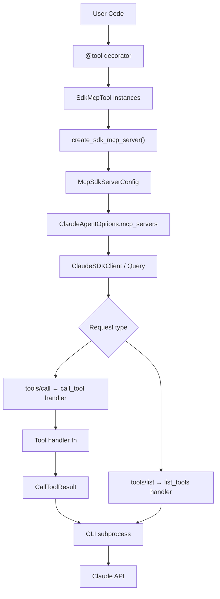
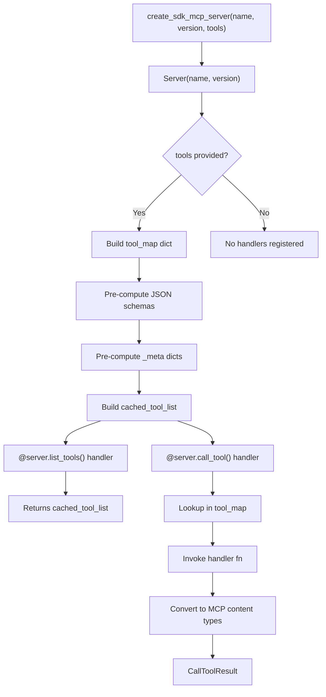
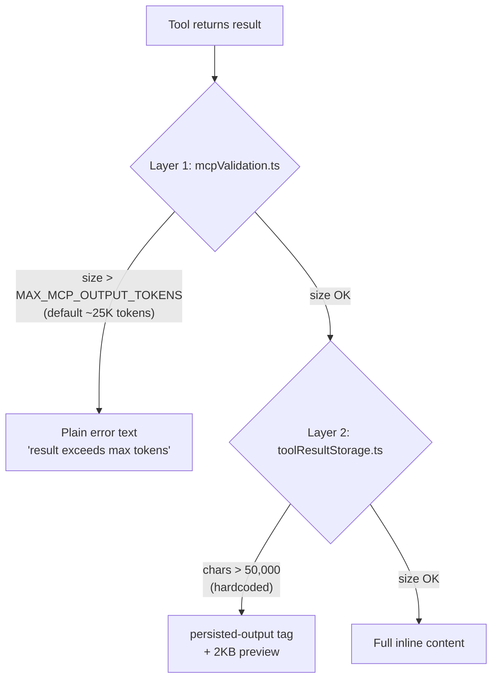

# MCP Server Integration & SDK Tools

The `claude-agent-sdk-python` SDK provides a first-class mechanism for defining and registering **Model Context Protocol (MCP) tools** that run in-process within your Python application. Rather than spawning a separate subprocess for each MCP server, SDK MCP servers execute tool handlers directly inside the host process, eliminating IPC overhead and simplifying deployment. These in-process servers are registered alongside external MCP servers in `ClaudeAgentOptions.mcp_servers` and are routed transparently through the same subprocess CLI transport layer.

This page covers the full lifecycle of SDK MCP tools: defining tool functions with the `@tool` decorator, building in-process servers with `create_sdk_mcp_server`, schema generation from Python types and TypedDicts, tool annotations (including large-output hints), permission enforcement, and the known large-output spill behavior caused by the CLI's two-layer result persistence system.

---

## Architecture Overview

The following diagram shows how an SDK MCP server integrates with the rest of the SDK stack.



The `McpSdkServerConfig` is a typed dictionary with `type="sdk"`, a `name`, and an `instance` pointing to the MCP `Server` object. The SDK's internal `Query` layer intercepts JSONRPC requests destined for SDK servers and dispatches them locally rather than forwarding them over stdio.

Sources: [src/claude_agent_sdk/__init__.py:265-310](../../../src/claude_agent_sdk/__init__.py#L265-L310), [tests/test_sdk_mcp_integration.py:1-50](../../../tests/test_sdk_mcp_integration.py#L1-L50)

---

## Core Primitives

### `SdkMcpTool` Dataclass

`SdkMcpTool` is a generic dataclass that bundles all metadata for a single tool.

| Field | Type | Description |
|---|---|---|
| `name` | `str` | Unique tool identifier used by Claude (e.g., `mcp__server__tool`) |
| `description` | `str` | Human-readable description; helps Claude decide when to invoke the tool |
| `input_schema` | `type[T] \| dict[str, Any]` | Parameter schema — either a `dict[name → type]`, a `TypedDict` class, or a raw JSON Schema dict |
| `handler` | `Callable[[T], Awaitable[dict]]` | Async function that receives parsed arguments and returns a result dict |
| `annotations` | `ToolAnnotations \| None` | Optional MCP `ToolAnnotations` (e.g., `readOnlyHint`, `destructiveHint`, `maxResultSizeChars`) |

Sources: [src/claude_agent_sdk/__init__.py:96-109](../../../src/claude_agent_sdk/__init__.py#L96-L109)

### The `@tool` Decorator

The `tool()` function is a decorator factory that wraps an async handler into an `SdkMcpTool` instance.

```python
@tool("add", "Add two numbers", {"a": float, "b": float})
async def add_numbers(args: dict[str, Any]) -> dict[str, Any]:
    result = args["a"] + args["b"]
    return {
        "content": [{"type": "text", "text": f"{args['a']} + {args['b']} = {result}"}]
    }
```

**Signature:**
```python
def tool(
    name: str,
    description: str,
    input_schema: type | dict[str, Any],
    annotations: ToolAnnotations | None = None,
) -> Callable[[Callable], SdkMcpTool]
```

Key constraints:
- The handler **must** be `async`.
- The handler receives a single `dict` argument containing the parsed input parameters.
- The return value must be a `dict` with a `"content"` key (list of content blocks) and an optional `"is_error": True` flag.

Sources: [src/claude_agent_sdk/__init__.py:112-182](../../../src/claude_agent_sdk/__init__.py#L112-L182), [examples/mcp_calculator.py:25-60](../../../examples/mcp_calculator.py#L25-L60)

---

## Schema Generation

The SDK automatically converts Python type annotations into JSON Schema objects used in the MCP `tools/list` response. This conversion is handled by `_python_type_to_json_schema` and `_typeddict_to_json_schema`.

### Supported Type Mappings

| Python Type | JSON Schema |
|---|---|
| `str` | `{"type": "string"}` |
| `int` | `{"type": "integer"}` |
| `float` | `{"type": "number"}` |
| `bool` | `{"type": "boolean"}` |
| `list` | `{"type": "array"}` |
| `list[T]` | `{"type": "array", "items": <schema for T>}` |
| `dict` / `dict[K, V]` | `{"type": "object"}` |
| `T \| None` | schema for `T` (None is unwrapped) |
| `T1 \| T2` | `{"anyOf": [<T1>, <T2>]}` |
| `Annotated[T, "desc"]` | schema for `T` with `"description": "desc"` added |
| `TypedDict` subclass | `{"type": "object", "properties": {...}, "required": [...]}` |
| Unknown types | `{"type": "string"}` (fallback) |

Sources: [src/claude_agent_sdk/__init__.py:185-255](../../../src/claude_agent_sdk/__init__.py#L185-L255), [tests/test_sdk_mcp_integration.py:320-430](../../../tests/test_sdk_mcp_integration.py#L320-L430)

### Dict-Style Schema

The simplest schema form maps parameter names to Python types:

```python
@tool("greet", "Greet a user", {"name": str, "age": int})
async def greet(args): ...
```

The SDK iterates over the dict, converts each value with `_python_type_to_json_schema`, and marks all keys as `required`.

### TypedDict Schema

For richer schemas with optional fields and inline descriptions, pass a `TypedDict` class:

```python
from typing import Annotated, NotRequired, TypedDict

class SearchParams(TypedDict):
    query: Annotated[str, "The search query"]
    limit: NotRequired[Annotated[int, "Max results"]]
```

`_typeddict_to_json_schema` uses `get_type_hints(include_extras=True)` to preserve `Annotated` metadata and reads `__required_keys__` to correctly populate the `required` array. `NotRequired[...]` fields are excluded from `required`.

Sources: [src/claude_agent_sdk/__init__.py:220-255](../../../src/claude_agent_sdk/__init__.py#L220-L255), [tests/test_sdk_mcp_integration.py:440-540](../../../tests/test_sdk_mcp_integration.py#L440-L540)

### Raw JSON Schema Passthrough

If the dict passed to `@tool` already has `"type"` and `"properties"` keys (i.e., it looks like a JSON Schema object), it is used verbatim without transformation:

```python
json_schema = {
    "type": "object",
    "properties": {"name": {"type": "string", "minLength": 1}},
    "required": ["name"],
}

@tool("validate", "Validate input", json_schema)
async def validate(args): ...
```

Sources: [src/claude_agent_sdk/__init__.py:279-295](../../../src/claude_agent_sdk/__init__.py#L279-L295), [tests/test_sdk_mcp_integration.py:528-545](../../../tests/test_sdk_mcp_integration.py#L528-L545)

---

## `create_sdk_mcp_server()`

This function instantiates an MCP `Server`, registers `list_tools` and `call_tool` handlers, and returns a `McpSdkServerConfig`.

```python
def create_sdk_mcp_server(
    name: str,
    version: str = "1.0.0",
    tools: list[SdkMcpTool] | None = None,
) -> McpSdkServerConfig
```

### Internal Registration Flow



Tool schemas are computed **once at server creation time** and cached in `cached_tool_list`, avoiding repeated schema derivation on every `tools/list` call.

Sources: [src/claude_agent_sdk/__init__.py:258-420](../../../src/claude_agent_sdk/__init__.py#L258-L420)

### Content Type Conversion

The `call_tool` handler converts the tool's raw result dict into MCP-typed content objects:

| Tool result `type` | MCP output type | Notes |
|---|---|---|
| `"text"` | `TextContent` | `text` field passed through directly |
| `"image"` | `ImageContent` | Requires `data` (base64) and `mimeType` |
| `"resource_link"` | `TextContent` | `name`, `uri`, and `description` joined as text |
| `"resource"` (text) | `TextContent` | `resource.text` extracted |
| `"resource"` (binary) | *(skipped)* | Warning logged; binary blobs cannot be converted |
| Unknown | *(skipped)* | Warning logged with the unknown type name |

The `is_error` field from the tool result dict maps directly to `CallToolResult.isError`.

Sources: [src/claude_agent_sdk/__init__.py:355-415](../../../src/claude_agent_sdk/__init__.py#L355-L415), [tests/test_sdk_mcp_integration.py:185-290](../../../tests/test_sdk_mcp_integration.py#L185-L290)

---

## Tool Annotations

`ToolAnnotations` (re-exported from `mcp.types`) can be attached to any tool to communicate behavioral hints to the CLI and to Claude.

### Standard Annotation Hints

| Annotation field | Type | Meaning |
|---|---|---|
| `readOnlyHint` | `bool` | Tool does not modify state |
| `destructiveHint` | `bool` | Tool may irreversibly destroy data |
| `idempotentHint` | `bool` | Repeated calls with same args are safe |
| `openWorldHint` | `bool` | Tool may contact external systems |

```python
from claude_agent_sdk import ToolAnnotations, tool

@tool(
    "read_data",
    "Read data from source",
    {"source": str},
    annotations=ToolAnnotations(readOnlyHint=True),
)
async def read_data(args): ...
```

Annotations flow through `list_tools` and appear in the JSONRPC `tools/list` response consumed by the CLI.

Sources: [tests/test_sdk_mcp_integration.py:150-200](../../../tests/test_sdk_mcp_integration.py#L150-L200), [src/claude_agent_sdk/__init__.py:316-330](../../../src/claude_agent_sdk/__init__.py#L316-L330)

### `maxResultSizeChars` — Large Output Annotation

The CLI's layer-2 result persistence (see [Large Output Spill Behavior](#large-output-spill-behavior)) clamps tool results to **50,000 characters** by default. Setting `maxResultSizeChars` in `ToolAnnotations` signals the CLI to use a higher per-tool threshold:

```python
@tool(
    "get_large_schema",
    "Returns a large DB schema",
    {},
    annotations=ToolAnnotations(maxResultSizeChars=500_000),
)
async def get_large_schema(args): ...
```

Because the MCP SDK's Zod schema strips unknown annotation fields, this value is forwarded via the `_meta` field using a namespaced key:

```json
{
  "name": "get_large_schema",
  "annotations": { ... },
  "_meta": { "anthropic/maxResultSizeChars": 500000 }
}
```

The CLI reads `_meta["anthropic/maxResultSizeChars"]` and bypasses the 50K clamp for that specific tool.

Sources: [tests/test_sdk_mcp_integration.py:220-270](../../../tests/test_sdk_mcp_integration.py#L220-L270), [src/claude_agent_sdk/__init__.py:332-350](../../../src/claude_agent_sdk/__init__.py#L332-L350)

---

## Permission Enforcement

Tool execution is gated by two `ClaudeAgentOptions` fields:

| Option | Type | Behavior |
|---|---|---|
| `allowed_tools` | `list[str]` | Whitelist of tool names Claude may call without prompting |
| `disallowed_tools` | `list[str]` | Blacklist of tool names Claude is prevented from calling |

Tool names follow the pattern `mcp__<server_name>__<tool_name>`. For example, a tool named `echo` on a server registered as `"test"` has the full name `mcp__test__echo`.

```python
options = ClaudeAgentOptions(
    mcp_servers={"test": server},
    allowed_tools=["mcp__test__greet"],
    disallowed_tools=["mcp__test__echo"],
)
```

If neither `allowed_tools` nor `disallowed_tools` is specified, SDK MCP tools will **not** be automatically executed — Claude will be aware of the tools but cannot invoke them without explicit permission grants.

Sources: [e2e-tests/test_sdk_mcp_tools.py:30-55](../../../e2e-tests/test_sdk_mcp_tools.py#L30-L55), [e2e-tests/test_sdk_mcp_tools.py:57-100](../../../e2e-tests/test_sdk_mcp_tools.py#L57-L100), [e2e-tests/test_sdk_mcp_tools.py:145-165](../../../e2e-tests/test_sdk_mcp_tools.py#L145-L165)

---

## Large Output Spill Behavior

The CLI subprocess enforces two independent result size limits. Understanding both is critical when tools return large payloads.



### Layer 1 — `mcpValidation.ts`

- **Threshold:** `MAX_MCP_OUTPUT_TOKENS` environment variable (default ~25,000 tokens).
- **Override:** Set `MAX_MCP_OUTPUT_TOKENS=500000` in `ClaudeAgentOptions.env`.
- **On spill:** Plain error text is returned instead of the tool result.
- The SDK passes `options.env` values through to the CLI subprocess, and `options.env` takes precedence over `os.environ`.

### Layer 2 — `toolResultStorage.ts`

- **Threshold:** `DEFAULT_MAX_RESULT_SIZE_CHARS = 50,000` characters — **hardcoded**, no environment variable override exists.
- **On spill:** The CLI wraps the result in a `<persisted-output>` tag containing a 2KB preview.
- **Detection:** Callers can check if `block.content.startswith("<persisted-output>")`.
- **Fix:** Use `ToolAnnotations(maxResultSizeChars=500_000)` on the tool definition; the CLI reads `_meta["anthropic/maxResultSizeChars"]` and raises the per-tool threshold.

### Environment Variable Behavior

| Variable | Layer | Default | SDK behavior |
|---|---|---|---|
| `MAX_MCP_OUTPUT_TOKENS` | 1 | ~25,000 tokens | Passed through from `options.env`; inherits `os.environ` if not overridden |
| *(none)* | 2 | 50,000 chars | No env var; use `maxResultSizeChars` annotation instead |
| `CLAUDECODE` | — | — | Stripped by the SDK before spawning subprocess |
| `CLAUDE_CODE_ENTRYPOINT` | — | — | Always set to `"sdk-py"` by the SDK |
| `CLAUDE_AGENT_SDK_VERSION` | — | — | Always set to the current SDK version; cannot be overridden |

Sources: [tests/test_mcp_large_output.py:1-80](../../../tests/test_mcp_large_output.py#L1-L80), [tests/test_mcp_large_output.py:85-155](../../../tests/test_mcp_large_output.py#L85-L155), [tests/test_mcp_large_output.py:160-230](../../../tests/test_mcp_large_output.py#L160-L230)

### Detecting Spilled Output

```python
from claude_agent_sdk import ToolResultBlock

def is_persisted_output(block: ToolResultBlock) -> bool:
    """Return True if the CLI spilled this tool result to a temp file (layer 2)."""
    return isinstance(block.content, str) and block.content.startswith(
        "<persisted-output>"
    )
```

Sources: [tests/test_mcp_large_output.py:235-250](../../../tests/test_mcp_large_output.py#L235-L250)

---

## Mixing SDK and External MCP Servers

SDK servers and external (stdio/SSE) servers can coexist in the same `mcp_servers` dict. The SDK routes requests to the correct backend based on the server's `type` field.

```python
sdk_server = create_sdk_mcp_server(name="sdk-server", tools=[sdk_tool])
external_server = {"type": "stdio", "command": "npx", "args": ["-y", "some-mcp-server"]}

options = ClaudeAgentOptions(
    mcp_servers={
        "sdk": sdk_server,        # type="sdk" → in-process
        "external": external_server,  # type="stdio" → subprocess
    }
)
```

Sources: [tests/test_sdk_mcp_integration.py:100-125](../../../tests/test_sdk_mcp_integration.py#L100-L125)

---

## Complete Usage Example

The following example, drawn from `examples/mcp_calculator.py`, demonstrates the full pattern for creating and using an SDK MCP server:

```python
import asyncio
from typing import Any
from claude_agent_sdk import ClaudeAgentOptions, ClaudeSDKClient, create_sdk_mcp_server, tool

@tool("add", "Add two numbers", {"a": float, "b": float})
async def add_numbers(args: dict[str, Any]) -> dict[str, Any]:
    result = args["a"] + args["b"]
    return {"content": [{"type": "text", "text": f"{args['a']} + {args['b']} = {result}"}]}

@tool("divide", "Divide one number by another", {"a": float, "b": float})
async def divide_numbers(args: dict[str, Any]) -> dict[str, Any]:
    if args["b"] == 0:
        return {"content": [{"type": "text", "text": "Error: Division by zero"}], "is_error": True}
    result = args["a"] / args["b"]
    return {"content": [{"type": "text", "text": f"{args['a']} ÷ {args['b']} = {result}"}]}

calculator = create_sdk_mcp_server(
    name="calculator",
    version="2.0.0",
    tools=[add_numbers, divide_numbers],
)

options = ClaudeAgentOptions(
    mcp_servers={"calc": calculator},
    allowed_tools=["mcp__calc__add", "mcp__calc__divide"],
)

async def main():
    async with ClaudeSDKClient(options=options) as client:
        await client.query("What is 15 + 27?")
        async for message in client.receive_response():
            print(message)

asyncio.run(main())
```

Sources: [examples/mcp_calculator.py:1-120](../../../examples/mcp_calculator.py#L1-L120)

---

## Public API Summary

| Symbol | Kind | Description |
|---|---|---|
| `tool` | Decorator factory | Wraps an async function into an `SdkMcpTool` |
| `SdkMcpTool` | Dataclass | Holds name, description, schema, handler, and annotations |
| `create_sdk_mcp_server` | Function | Creates an in-process MCP server and returns `McpSdkServerConfig` |
| `McpSdkServerConfig` | TypedDict | `{type: "sdk", name: str, instance: Server}` |
| `ToolAnnotations` | Class (re-export) | MCP tool behavioral hints from `mcp.types` |
| `ClaudeAgentOptions.mcp_servers` | Dict field | Maps server aliases to server configs (SDK or external) |
| `ClaudeAgentOptions.allowed_tools` | List field | Tools Claude may call without prompting |
| `ClaudeAgentOptions.disallowed_tools` | List field | Tools Claude is blocked from calling |

Sources: [src/claude_agent_sdk/__init__.py:430-510](../../../src/claude_agent_sdk/__init__.py#L430-L510)

---

## Summary

SDK MCP servers provide a zero-subprocess mechanism for exposing Python functions as tools to Claude. The `@tool` decorator and `create_sdk_mcp_server()` function handle schema generation, JSONRPC handler registration, and content type conversion automatically. Tool annotations enable fine-grained behavioral hints, including the `maxResultSizeChars` annotation that addresses the CLI's hardcoded 50,000-character layer-2 spill limit. Permission control is achieved through `allowed_tools` and `disallowed_tools` in `ClaudeAgentOptions`, with tool names following the `mcp__<server>__<tool>` naming convention. SDK and external MCP servers can be freely mixed within the same agent session.