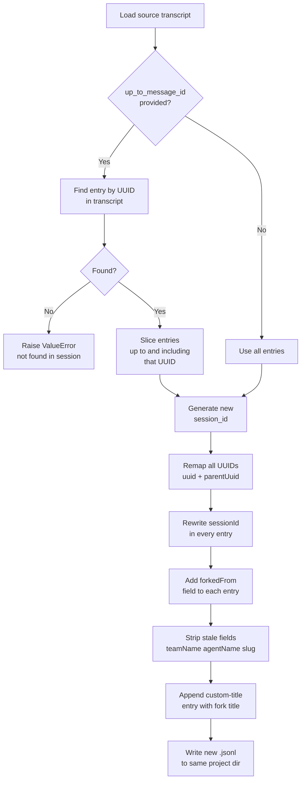
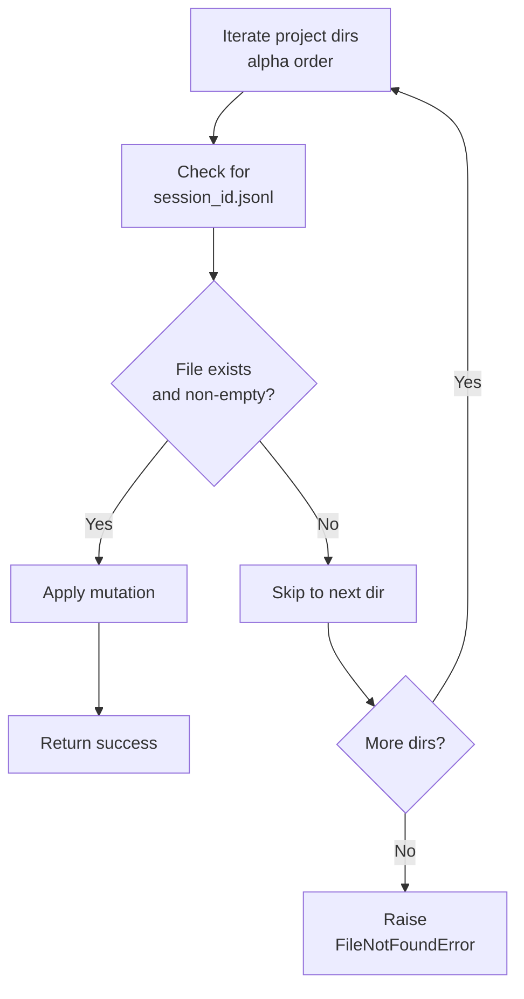
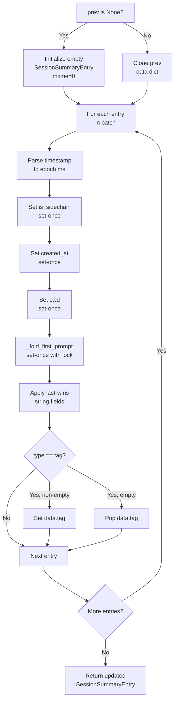
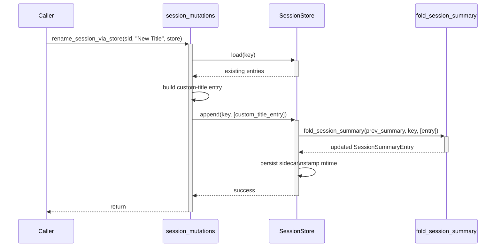

# Session Mutations & Summaries

Session mutations and summaries are two complementary subsystems within the Claude Agent SDK that enable stateful session management. **Mutations** (rename, tag, delete, fork) modify session transcripts by appending structured JSONL entries, while **summaries** provide an incremental, append-only mechanism for deriving per-session metadata without re-reading full transcripts. Together they form the backbone of the SDK's session lifecycle management, supporting both local filesystem and pluggable `SessionStore` backends.

Both subsystems are exposed at the top-level `claude_agent_sdk` package and can operate either against the local Claude CLI filesystem layout or through an abstract `SessionStore` interface.

Sources: [src/claude_agent_sdk/__init__.py:1-100](../../../src/claude_agent_sdk/__init__.py#L1-L100)

---

## Session Mutations

### Overview

Session mutations are append-only operations on JSONL transcript files. Rather than rewriting a session file, each mutation appends a new structured JSON entry that encodes the change. This design preserves the full audit trail and matches the Claude CLI's own transcript format.

The four supported mutation operations are:

| Operation | Function (filesystem) | Function (store-backed) | Description |
|---|---|---|---|
| Rename | `rename_session()` | `rename_session_via_store()` | Sets a human-readable custom title |
| Tag | `tag_session()` | `tag_session_via_store()` | Attaches or clears a short label |
| Delete | `delete_session()` | `delete_session_via_store()` | Permanently removes the session file |
| Fork | `fork_session()` | `fork_session_via_store()` | Creates a new session from a transcript slice |

Sources: [src/claude_agent_sdk/__init__.py:30-43](../../../src/claude_agent_sdk/__init__.py#L30-L43), [tests/test_session_mutations.py:1-30](../../../tests/test_session_mutations.py#L1-L30)

---

### Low-Level Append Helper: `_try_append`

All mutation operations that write to existing files share a common helper, `_try_append`, which implements safe atomic-style appending:

```python
# Behavior contract:
# - Returns True  → entry was written to an existing, non-empty file
# - Returns False → file missing, parent missing, or file is a 0-byte stub
```

Key behaviors enforced by `_try_append`:

- **ENOENT → False**: Missing files are silently skipped, allowing callers to search across multiple project directories.
- **Zero-byte stub → False**: A 0-byte file is treated as a placeholder and is not written to, preserving the search-across-dirs semantics.
- **O_APPEND semantics**: Multiple successive appends land in order at EOF.

This design allows the mutation functions to iterate over all project directories and stop at the first real (non-empty) match.

Sources: [tests/test_session_mutations.py:68-100](../../../tests/test_session_mutations.py#L68-L100)

---

### `rename_session` — Custom Title

`rename_session(session_id, title, *, directory=None)` appends a `custom-title` entry to the session's JSONL file.

**Entry format appended:**
```json
{"type":"custom-title","customTitle":"My New Title","sessionId":"<uuid>"}
```

**Validation rules:**
- `session_id` must be a valid UUID string.
- `title` must be non-empty after stripping whitespace.
- Leading/trailing whitespace is stripped before storing.
- If `directory` is omitted, all project directories are searched; the first non-empty file match wins.
- A `FileNotFoundError` is raised if no matching session file exists.

**Last-wins semantics:** Multiple `rename_session` calls on the same session each append a new entry. The summary derivation layer reads the last `customTitle` value encountered, so the final call always wins when listing sessions.

```python
rename_session(sid, "First Title", directory=project_path)
rename_session(sid, "Final Title", directory=project_path)
# list_sessions() will show custom_title == "Final Title"
```

Sources: [tests/test_session_mutations.py:109-200](../../../tests/test_session_mutations.py#L109-L200)

---

### `tag_session` — Session Labels

`tag_session(session_id, tag, *, directory=None)` appends a `tag` entry. Passing `None` as the tag value appends an empty-string tag, which clears the tag in the summary.

**Entry format appended:**
```json
{"type":"tag","tag":"experiment","sessionId":"<uuid>"}
```

**Clear/reset format:**
```json
{"type":"tag","tag":"","sessionId":"<uuid>"}
```

**Validation and sanitization:**
- `tag` must be non-empty (after Unicode sanitization; see below).
- Whitespace is stripped.
- Passing `None` explicitly writes an empty-string tag to clear any previously set tag.

#### Unicode Sanitization: `_sanitize_unicode`

Tag values (and other user-supplied strings) are passed through `_sanitize_unicode` before storage. This helper:

1. Applies **NFKC normalization** (e.g., fullwidth `Ａ` → ASCII `A`).
2. Strips **zero-width characters**: U+200B, U+200C, U+200D, etc.
3. Strips **directional marks and isolates**: U+202A–U+202C, U+2066–U+2069.
4. Strips **private-use area** characters: U+E000–U+F8FF.
5. Strips the **BOM** (U+FEFF).
6. Iterates up to 10 passes until the string stabilizes (handles multi-pass cases).

A tag that reduces to an empty string after sanitization raises `ValueError("tag must be non-empty")`.

```python
tag_session(sid, "clean\u200btag\ufeff")  # stored as "cleantag"
tag_session(sid, "\u200b\u200c\ufeff")    # raises ValueError
```

Sources: [tests/test_session_mutations.py:203-320](../../../tests/test_session_mutations.py#L203-L320), [tests/test_session_mutations.py:322-375](../../../tests/test_session_mutations.py#L322-L375)

---

### `delete_session` — Permanent Removal

`delete_session(session_id, *, directory=None)` permanently removes the session's `.jsonl` file. It also cascades to the sibling `{session_id}/` subdirectory (used for subagent transcripts), removing it recursively if present.

**Cascade behavior:**
```
projects/
  <project-hash>/
    <session_id>.jsonl       ← deleted
    <session_id>/            ← also deleted (subagent transcripts)
      <subagent_id>.jsonl
```

After deletion the session no longer appears in `list_sessions()`.

Sources: [tests/test_session_mutations.py:378-430](../../../tests/test_session_mutations.py#L378-L430)

---

### `fork_session` — Transcript Branching

`fork_session(session_id, *, directory=None, up_to_message_id=None, title=None)` creates a new independent session by copying (a slice of) an existing transcript.

**Return value:** A `ForkSessionResult` containing the new `session_id`.

#### Fork Algorithm



Sources: [tests/test_session_mutations.py:432-620](../../../tests/test_session_mutations.py#L432-L620)

#### UUID Remapping

Every `uuid` and `parentUuid` field in the copied entries is replaced with a fresh UUID. Original UUIDs from the source session never appear in the fork's `uuid` or `parentUuid` fields — they only appear inside the `forkedFrom` object.

```json
{
  "type": "user",
  "uuid": "<new-uuid>",
  "parentUuid": "<new-parent-uuid>",
  "sessionId": "<new-session-id>",
  "forkedFrom": {
    "sessionId": "<original-session-id>"
  }
}
```

#### Stale Field Cleanup

Fields that are specific to a team/agent deployment context and should not carry over to a fork are removed: `teamName`, `agentName`, `slug`.

#### Fork Title

- If `title` is provided, it is stored as the fork's `customTitle`.
- If omitted, the SDK derives a default title from the source session's summary with a `" (fork)"` suffix.

Sources: [tests/test_session_mutations.py:530-620](../../../tests/test_session_mutations.py#L530-L620)

---

### Mutation Entry JSON Format

All mutation entries use compact JSON (no spaces after `:` or `,`), matching the Claude CLI's own JSONL output format.

| Entry type | Required fields | Optional fields |
|---|---|---|
| `custom-title` | `type`, `customTitle`, `sessionId` | — |
| `tag` | `type`, `tag`, `sessionId` | — |
| *(delete)* | *(file removed — no entry)* | — |
| *(fork)* | *(new file written)* | — |

Sources: [tests/test_session_mutations.py:185-200](../../../tests/test_session_mutations.py#L185-L200), [tests/test_session_mutations.py:264-275](../../../tests/test_session_mutations.py#L264-L275)

---

### Session Discovery: Multi-Directory Search

When `directory` is not supplied to any mutation function, the SDK searches all project directories under `~/.claude/projects/` (or the directory pointed to by `CLAUDE_CONFIG_DIR`). The search uses `_try_append`'s False-on-miss contract to skip non-matching and stub files:



Sources: [tests/test_session_mutations.py:209-230](../../../tests/test_session_mutations.py#L209-L230), [tests/test_session_mutations.py:68-100](../../../tests/test_session_mutations.py#L68-L100)

---

## Session Summaries

### Overview

The summary subsystem provides an **incremental, append-only** mechanism for maintaining per-session metadata without re-reading full transcripts. A `SessionSummaryEntry` sidecar is maintained alongside each session's JSONL file and updated in-place as new entries are appended.

The key motivation: `list_sessions_from_store()` can fetch all session metadata via a single `list_session_summaries()` call instead of N per-session `load()` calls.

Sources: [src/claude_agent_sdk/_internal/session_summary.py:1-20](../../../src/claude_agent_sdk/_internal/session_summary.py#L1-L20)

---

### `SessionSummaryEntry` Data Model

A `SessionSummaryEntry` is a TypedDict with three top-level fields:

| Field | Type | Description |
|---|---|---|
| `session_id` | `str` | The session's UUID |
| `mtime` | `int` | Storage write timestamp (set by adapter, not by fold) |
| `data` | `dict` | Opaque derived state; persisted verbatim by adapters |

The `data` dict contains all derived fields:

| `data` key | Type | Derivation strategy | Description |
|---|---|---|---|
| `is_sidechain` | `bool` | Set-once (first entry) | True if this is a subagent transcript |
| `created_at` | `int` (epoch ms) | Set-once (first parseable timestamp) | Session creation time |
| `cwd` | `str` | Set-once (first non-empty value) | Working directory at session start |
| `first_prompt` | `str` | Set-once on real match | First non-command, non-skip user message |
| `first_prompt_locked` | `bool` | Latches on first real match | Guards `first_prompt` from being overwritten |
| `command_fallback` | `str` | Set-once | Slash-command name if no real prompt found |
| `custom_title` | `str` | Last-wins | From `customTitle` JSONL field |
| `ai_title` | `str` | Last-wins | From `aiTitle` JSONL field |
| `last_prompt` | `str` | Last-wins | From `lastPrompt` JSONL field |
| `summary_hint` | `str` | Last-wins | From `summary` JSONL field |
| `git_branch` | `str` | Last-wins | From `gitBranch` JSONL field |
| `tag` | `str` | Last-wins (empty string clears) | From `tag`-type entries |

Sources: [src/claude_agent_sdk/_internal/session_summary.py:30-60](../../../src/claude_agent_sdk/_internal/session_summary.py#L30-L60), [src/claude_agent_sdk/_internal/session_summary.py:60-160](../../../src/claude_agent_sdk/_internal/session_summary.py#L60-L160)

---

### `fold_session_summary` — Incremental Folding

`fold_session_summary(prev, key, entries)` is the core function that folds a batch of newly appended `SessionStoreEntry` objects into a running `SessionSummaryEntry`.

**Signature:**
```python
def fold_session_summary(
    prev: SessionSummaryEntry | None,
    key: SessionKey,
    entries: list[SessionStoreEntry],
) -> SessionSummaryEntry:
```

**How it works:**



**Critical contract on `mtime`:** The fold does **not** set `mtime`. This field is stamped by the adapter after persisting the sidecar, so it shares a clock with the adapter's native timestamp (file mtime, S3 `LastModified`, Postgres `updated_at`, etc.). For a new session (`prev is None`) the fold returns `mtime=0` as a placeholder.

**Subpath guard:** Callers must not invoke `fold_session_summary` for keys with a `subpath` (subagent transcripts). The guard pattern is:
```python
if key.get("subpath") is None:
    summary = fold_session_summary(prev, key, entries)
```

Sources: [src/claude_agent_sdk/_internal/session_summary.py:80-165](../../../src/claude_agent_sdk/_internal/session_summary.py#L80-L165)

---

### `_fold_first_prompt` — First Prompt Extraction

The first prompt is the most complex derived field. `_fold_first_prompt` replicates the CLI's `_extract_first_prompt_from_head` logic incrementally:

**Skip conditions (entry is ignored for first-prompt purposes):**
1. `first_prompt_locked` is already set in `data`.
2. Entry type is not `"user"`.
3. `isMeta` or `isCompactSummary` is `True`.
4. Entry content contains any `tool_result` block (user messages carrying tool results).

**For each text block in the entry:**
- If the text matches `_COMMAND_NAME_RE` (a slash-command pattern), it is stored as `command_fallback` (set-once) and iteration continues.
- If the text matches `_SKIP_FIRST_PROMPT_PATTERN`, it is skipped.
- Otherwise, the text is truncated to 200 characters (with `…` suffix if truncated), stored as `first_prompt`, and `first_prompt_locked` is set to `True`.

Sources: [src/claude_agent_sdk/_internal/session_summary.py:65-110](../../../src/claude_agent_sdk/_internal/session_summary.py#L65-L110)

---

### Last-Wins String Fields

Five JSONL entry keys are mapped directly to `data` fields using last-wins semantics. Each new appended entry overwrites the previous value when the key is present:

```python
_LAST_WINS_FIELDS: dict[str, str] = {
    "customTitle": "custom_title",
    "aiTitle":     "ai_title",
    "lastPrompt":  "last_prompt",
    "summary":     "summary_hint",
    "gitBranch":   "git_branch",
}
```

This means `rename_session` (which appends `customTitle`) is automatically reflected in the summary after the next fold.

Sources: [src/claude_agent_sdk/_internal/session_summary.py:30-38](../../../src/claude_agent_sdk/_internal/session_summary.py#L30-L38)

---

### `summary_entry_to_sdk_info` — Conversion to `SDKSessionInfo`

`summary_entry_to_sdk_info(entry, project_path)` converts a `SessionSummaryEntry` into the public-facing `SDKSessionInfo` type returned by `list_sessions_from_store()`.

**Filtering:**
- Returns `None` for sidechain sessions (`is_sidechain == True`).
- Returns `None` if no `summary` string can be derived.

**Summary derivation priority:**
```
custom_title (or ai_title)
  → last_prompt
    → summary_hint
      → first_prompt (or command_fallback)
```

**`SDKSessionInfo` fields populated:**

| Field | Source |
|---|---|
| `session_id` | `entry["session_id"]` |
| `summary` | Derived (see priority above) |
| `last_modified` | `entry["mtime"]` |
| `file_size` | Always `None` (no equivalent in stores) |
| `custom_title` | `data["custom_title"]` or `data["ai_title"]` |
| `first_prompt` | `data["first_prompt"]` (if locked) or `data["command_fallback"]` |
| `git_branch` | `data["git_branch"]` |
| `cwd` | `data["cwd"]` or `project_path` fallback |
| `tag` | `data["tag"]` |
| `created_at` | `data["created_at"]` |

Sources: [src/claude_agent_sdk/_internal/session_summary.py:168-210](../../../src/claude_agent_sdk/_internal/session_summary.py#L168-L210)

---

### Timestamp Handling: `_iso_to_epoch_ms`

ISO-8601 timestamps in JSONL entries are converted to Unix epoch milliseconds via `_iso_to_epoch_ms`. This helper normalizes trailing `Z` to `+00:00` before calling `datetime.fromisoformat()` (required for Python 3.10 compatibility).

```python
def _iso_to_epoch_ms(ts: Any) -> int | None:
    norm = ts.replace("Z", "+00:00") if ts.endswith("Z") else ts
    return int(datetime.fromisoformat(norm).timestamp() * 1000)
```

Sources: [src/claude_agent_sdk/_internal/session_summary.py:40-50](../../../src/claude_agent_sdk/_internal/session_summary.py#L40-L50)

---

## Public API Surface

Both subsystems are exported at the top-level `claude_agent_sdk` package:

```python
from claude_agent_sdk import (
    # Mutations (filesystem)
    rename_session, tag_session, delete_session, fork_session,
    ForkSessionResult,
    # Mutations (store-backed)
    rename_session_via_store, tag_session_via_store,
    delete_session_via_store, fork_session_via_store,
    # Summary
    fold_session_summary,
    # Types
    SessionSummaryEntry, SDKSessionInfo,
)
```

Sources: [src/claude_agent_sdk/__init__.py:30-43](../../../src/claude_agent_sdk/__init__.py#L30-L43), [src/claude_agent_sdk/__init__.py:270-310](../../../src/claude_agent_sdk/__init__.py#L270-L310)

---

## Interaction Between Mutations and Summaries

The two subsystems are designed to compose naturally. When a mutation appends a new JSONL entry, the store's `append()` method calls `fold_session_summary` with the new entries to keep the sidecar up to date. The sequence for a `rename_session_via_store` call looks like:



For the filesystem path (`rename_session`), the summary is re-derived lazily on the next `list_sessions()` call by lite-parsing the JSONL file, so no explicit fold call is needed.

Sources: [src/claude_agent_sdk/_internal/session_summary.py:80-100](../../../src/claude_agent_sdk/_internal/session_summary.py#L80-L100), [src/claude_agent_sdk/__init__.py:30-43](../../../src/claude_agent_sdk/__init__.py#L30-L43), [tests/test_session_mutations.py:170-195](../../../tests/test_session_mutations.py#L170-L195)

---

## Summary

Session mutations and summaries form a coherent, append-only system for managing session lifecycle in the Claude Agent SDK. Mutations (rename, tag, delete, fork) write structured JSONL entries rather than rewriting files, preserving full audit trails and enabling safe concurrent access. The summary subsystem maintains a `SessionSummaryEntry` sidecar incrementally via `fold_session_summary`, enabling O(1) metadata retrieval for `list_sessions_from_store()` regardless of transcript length. Unicode sanitization, UUID remapping, and careful `mtime` ownership rules ensure correctness across both the local filesystem and pluggable `SessionStore` backends.