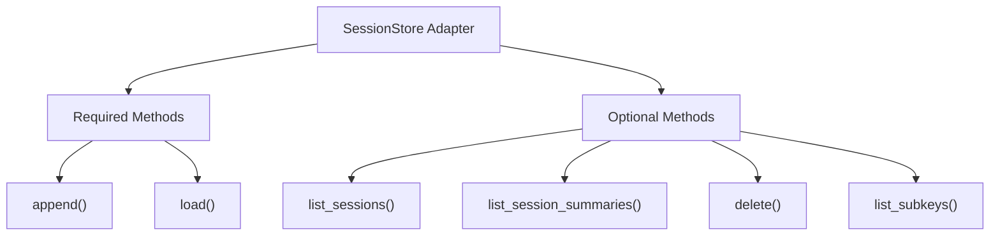
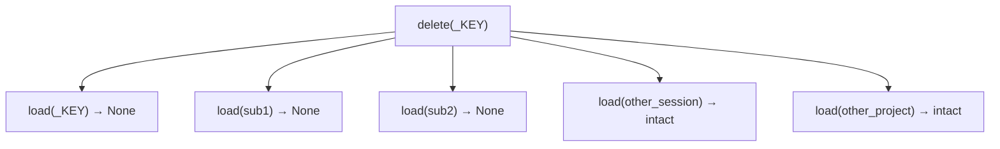
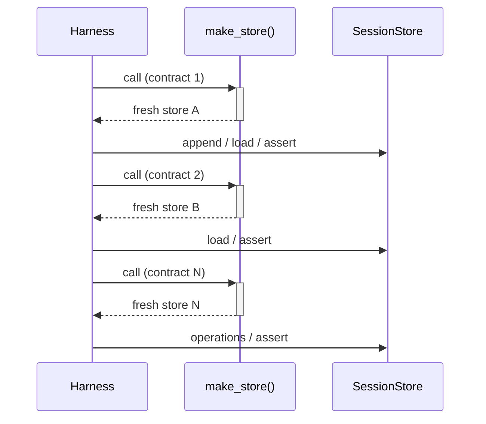
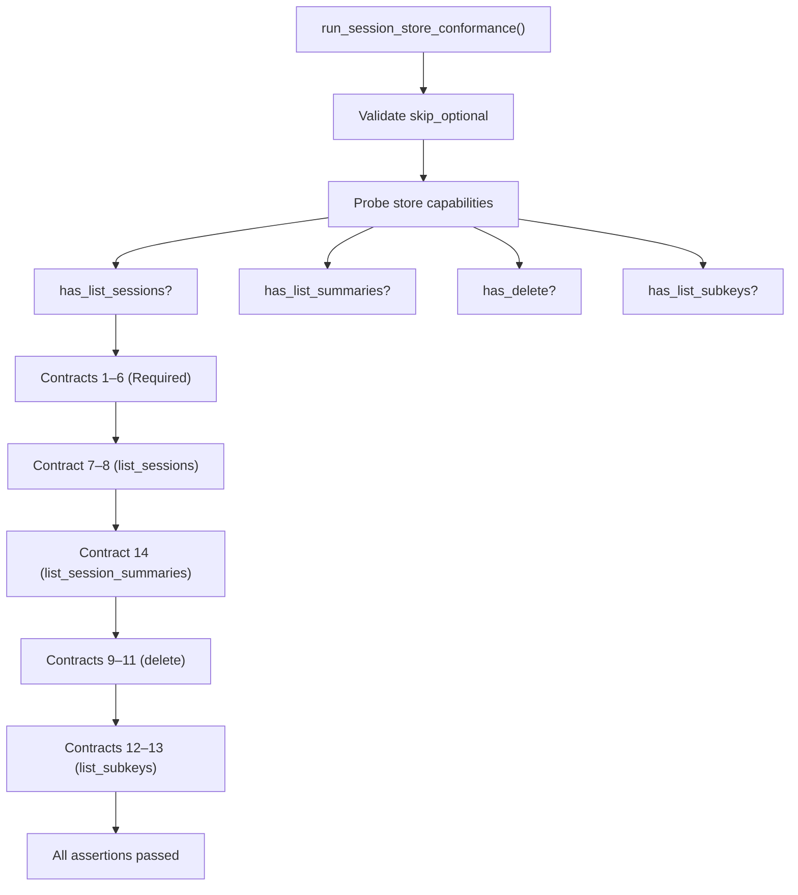

# Session Store Conformance Testing

The `claude-agent-sdk-python` project ships a reusable, backend-agnostic conformance harness that verifies every `SessionStore` adapter satisfies a defined set of behavioral contracts. Because the SDK supports pluggable storage backends (in-memory, Redis, S3, Postgres, and custom adapters), a single shared test suite ensures that any adapter integrating with the SDK behaves identically from the perspective of session management logic. The harness is importable by third-party adapter authors and runs under any async test runner that supports `pytest.mark.asyncio`.

The harness lives in `claude_agent_sdk.testing` and is invoked via `run_session_store_conformance`. It covers 14 contracts across required and optional `SessionStore` methods, automatically skipping optional contracts when the adapter does not override them.

---

## Overview of the Harness

### Public Entry Point

The single public function exposed by the testing subpackage is `run_session_store_conformance`:

```python
from claude_agent_sdk.testing import run_session_store_conformance

@pytest.mark.asyncio
async def test_my_store_conformance():
    await run_session_store_conformance(MyRedisStore)
```

The `make_store` argument may be a **sync callable**, an **async callable**, or a **class** (called with no arguments). The harness calls `make_store()` once per contract to provide full isolation between tests.

Sources: [src/claude_agent_sdk/testing/session_store_conformance.py:1-30](../../../src/claude_agent_sdk/testing/session_store_conformance.py#L1-L30), [src/claude_agent_sdk/testing/__init__.py:1-10](../../../src/claude_agent_sdk/testing/__init__.py#L1-L10)

### Function Signature

```python
async def run_session_store_conformance(
    make_store: Callable[[], SessionStore | Awaitable[SessionStore]],
    *,
    skip_optional: frozenset[str] = frozenset(),
) -> None:
```

| Parameter | Type | Description |
|---|---|---|
| `make_store` | `Callable[[], SessionStore \| Awaitable[SessionStore]]` | Factory invoked once per contract; may be sync or async. |
| `skip_optional` | `frozenset[str]` | Set of optional method names to skip unconditionally. Must be a subset of `{"list_sessions", "list_session_summaries", "delete", "list_subkeys"}`. |

Sources: [src/claude_agent_sdk/testing/session_store_conformance.py:46-62](../../../src/claude_agent_sdk/testing/session_store_conformance.py#L46-L62)

---

## Contract Classification

Contracts are divided into **required** (all adapters must pass) and **optional** (skipped when the adapter does not override the method or when the method name appears in `skip_optional`).

### Required vs. Optional Methods



Sources: [src/claude_agent_sdk/testing/session_store_conformance.py:16-22](../../../src/claude_agent_sdk/testing/session_store_conformance.py#L16-L22)

### Optional Method Detection

The harness uses `_has_optional()` to determine whether an adapter genuinely overrides an optional method rather than relying on the `SessionStore` Protocol's default (which raises `NotImplementedError`). The detection compares the method on the instance's class against the method on `SessionStore` itself:

```python
def _has_optional(
    store: SessionStore, method: OptionalMethod, skip_optional: frozenset[str]
) -> bool:
    if method in skip_optional:
        return False
    impl = getattr(store, method, None)
    if impl is None:
        return False
    default = getattr(SessionStore, method, None)
    return getattr(type(store), method, None) is not default
```

This means adapters that subclass `SessionStore` but do not override optional methods will automatically have those contracts skipped — no `skip_optional` argument is needed.

Sources: [src/claude_agent_sdk/testing/session_store_conformance.py:28-40](../../../src/claude_agent_sdk/testing/session_store_conformance.py#L28-L40)

---

## The 14 Behavioral Contracts

The following table summarizes all 14 contracts, their category, and the method(s) under test.

| # | Category | Contract Description | Methods Tested |
|---|---|---|---|
| 1 | Required | `append` then `load` returns same entries in same order | `append`, `load` |
| 2 | Required | `load` on unknown key returns `None` | `load` |
| 3 | Required | Multiple `append` calls preserve call order | `append`, `load` |
| 4 | Required | `append([])` is a no-op | `append`, `load` |
| 5 | Required | Subpath keys are stored independently of the main key | `append`, `load` |
| 6 | Required | `project_key` isolation: different projects don't bleed | `append`, `load`, `list_sessions` |
| 7 | `list_sessions` | Returns only session IDs for the given project; `mtime` is epoch-ms | `list_sessions` |
| 8 | `list_sessions` | Excludes subagent subpaths from session listings | `list_sessions` |
| 9 | `delete` | Deleting main key makes `load` return `None`; idempotent on missing key | `delete`, `load` |
| 10 | `delete` | Deleting main key cascades to all subkeys | `delete`, `load`, `list_subkeys`, `list_sessions` |
| 11 | `delete` | Deleting with a subpath removes only that subkey | `delete`, `load`, `list_subkeys` |
| 12 | `list_subkeys` | Returns subpaths scoped to a single session | `list_subkeys` |
| 13 | `list_subkeys` | Excludes the main transcript (no subpath) | `list_subkeys` |
| 14 | `list_session_summaries` | Persisted fold output round-trips; subagent appends don't affect main summary | `list_session_summaries`, `delete` |

Sources: [src/claude_agent_sdk/testing/session_store_conformance.py:64-250](../../../src/claude_agent_sdk/testing/session_store_conformance.py#L64-L250)

---

## Contract Details

### Required Contracts (1–6)

#### Contract 1: Append-Load Round-Trip

The harness appends two entries with distinct UUIDs and asserts the loaded list is **deep-equal** (not byte-equal) and in the same order. This explicitly accommodates backends like Postgres JSONB that may reorder JSON object keys internally.

```python
await store.append(_KEY, [_e({"uuid": "b", "n": 1}), _e({"uuid": "a", "n": 2})])
loaded = await store.load(_KEY)
assert loaded == [_e({"uuid": "b", "n": 1}), _e({"uuid": "a", "n": 2})]
```

Sources: [src/claude_agent_sdk/testing/session_store_conformance.py:72-77](../../../src/claude_agent_sdk/testing/session_store_conformance.py#L72-L77)

#### Contract 2: Unknown Key Returns None

Both an entirely unknown `session_id` and a known session with an unknown `subpath` must return `None` from `load`.

Sources: [src/claude_agent_sdk/testing/session_store_conformance.py:79-83](../../../src/claude_agent_sdk/testing/session_store_conformance.py#L79-L83)

#### Contract 3: Multi-Append Order Preservation

Three sequential `append` calls with different entries must produce a single flat list in call order when loaded.

Sources: [src/claude_agent_sdk/testing/session_store_conformance.py:85-96](../../../src/claude_agent_sdk/testing/session_store_conformance.py#L85-L96)

#### Contract 4: Empty Append is a No-Op

Calling `append` with an empty list must not change the stored state.

Sources: [src/claude_agent_sdk/testing/session_store_conformance.py:98-102](../../../src/claude_agent_sdk/testing/session_store_conformance.py#L98-L102)

#### Contract 5: Subpath Independence

A key with `subpath` is stored completely independently from the same `project_key`/`session_id` without a `subpath`. Loading either must return only its own entries.

Sources: [src/claude_agent_sdk/testing/session_store_conformance.py:104-111](../../../src/claude_agent_sdk/testing/session_store_conformance.py#L104-L111)

#### Contract 6: Project Key Isolation

Two sessions with the same `session_id` but different `project_key` values must never bleed into each other, including in `list_sessions` results.

Sources: [src/claude_agent_sdk/testing/session_store_conformance.py:113-126](../../../src/claude_agent_sdk/testing/session_store_conformance.py#L113-L126)

---

### Optional Contracts: `list_sessions` (7–8)

#### Contract 7: Session Listing with mtime

`list_sessions(project_key)` must return only sessions belonging to that project. Each entry must include an `mtime` that is a finite number greater than `1e12` (epoch-milliseconds, ruling out epoch-seconds which would be approximately year 2001 in milliseconds).

```python
assert all(math.isfinite(s["mtime"]) and s["mtime"] > 1e12 for s in sessions)
assert await store.list_sessions("never-appended-project") == []
```

Sources: [src/claude_agent_sdk/testing/session_store_conformance.py:133-143](../../../src/claude_agent_sdk/testing/session_store_conformance.py#L133-L143)

#### Contract 8: Subagent Subpaths Excluded

A session that has both a main transcript and a subagent subpath must appear only once in `list_sessions` results — the subpath must not create a phantom session entry.

Sources: [src/claude_agent_sdk/testing/session_store_conformance.py:145-156](../../../src/claude_agent_sdk/testing/session_store_conformance.py#L145-L156)

---

### Optional Contracts: `list_session_summaries` (14)

Contract 14 is the most complex. It verifies that:

1. Summary data is persisted verbatim (opaque pass-through blob).
2. `mtime` is epoch-ms and shares a clock with `list_sessions().mtime` for the same session.
3. Summary data round-trips correctly through `fold_session_summary`.
4. Subagent appends do **not** affect the main session's summary.
5. After `delete`, the session no longer appears in summaries.

The clock alignment assertion is critical: adapters that derive `mtime` from entry ISO timestamps would report a strictly older value than `list_sessions`'s storage-time `mtime`, breaking the fast-path freshness check.

```python
if has_list_sessions:
    ls_by_id = {
        e["session_id"]: e["mtime"] for e in await store.list_sessions("proj")
    }
    assert summ["mtime"] >= ls_by_id["summ-sess"]
```

Sources: [src/claude_agent_sdk/testing/session_store_conformance.py:158-213](../../../src/claude_agent_sdk/testing/session_store_conformance.py#L158-L213)

---

### Optional Contracts: `delete` (9–11)

#### Contract 9: Delete Main Key

Deleting a non-existent key must be idempotent (no error). Deleting an existing main key must make `load` return `None`.

Sources: [src/claude_agent_sdk/testing/session_store_conformance.py:217-225](../../../src/claude_agent_sdk/testing/session_store_conformance.py#L217-L225)

#### Contract 10: Cascade Delete

Deleting a main key (no `subpath`) must cascade to **all** subkeys under that session. Other sessions in the same project and sessions in other projects must remain unaffected.



Sources: [src/claude_agent_sdk/testing/session_store_conformance.py:227-258](../../../src/claude_agent_sdk/testing/session_store_conformance.py#L227-L258)

#### Contract 11: Targeted Subpath Delete

Deleting with a `subpath` removes only that specific subkey. The main transcript and other subkeys must remain intact.

Sources: [src/claude_agent_sdk/testing/session_store_conformance.py:260-275](../../../src/claude_agent_sdk/testing/session_store_conformance.py#L260-L275)

---

### Optional Contracts: `list_subkeys` (12–13)

#### Contract 12: Subpath Listing

`list_subkeys(key)` must return only the subpaths belonging to the given `project_key`/`session_id`. Subpaths from other sessions must not appear.

#### Contract 13: Main Transcript Excluded

When only a main transcript exists (no subpath), `list_subkeys` must return an empty list. An unknown session must also return an empty list.

Sources: [src/claude_agent_sdk/testing/session_store_conformance.py:279-307](../../../src/claude_agent_sdk/testing/session_store_conformance.py#L279-L307)

---

## Test Entry Helper: `_e()`

All contracts use a shared helper `_e(d)` to construct test entries. Adapters must treat entries as opaque pass-through blobs; the `type` field is required by the `SessionStoreEntry` type but its value is irrelevant to the contracts.

```python
def _e(d: dict[str, Any]) -> Any:
    return {"type": "x", **d}
```

Sources: [src/claude_agent_sdk/testing/session_store_conformance.py:311-317](../../../src/claude_agent_sdk/testing/session_store_conformance.py#L311-L317)

---

## Isolation Strategy

The harness calls `make_store()` once per contract. This guarantees each contract starts from a clean state. The factory may be:

- A **class** (e.g., `InMemorySessionStore`) — instantiated with no arguments.
- A **sync callable** — e.g., a lambda returning a new store instance.
- An **async callable** — e.g., an `async def` that creates a connection pool.



Sources: [src/claude_agent_sdk/testing/session_store_conformance.py:62-70](../../../src/claude_agent_sdk/testing/session_store_conformance.py#L62-L70)

---

## Usage Patterns

### Basic Usage Against a Custom Adapter

```python
import pytest
from claude_agent_sdk.testing import run_session_store_conformance

@pytest.mark.asyncio
async def test_my_store_conformance():
    await run_session_store_conformance(MyStore)
```

### Async Factory (e.g., connection pool setup)

```python
@pytest.mark.asyncio
async def test_conformance_with_async_factory():
    async def make() -> SessionStore:
        return InMemorySessionStore()

    await run_session_store_conformance(make)
```

Sources: [tests/test_session_store_conformance.py:37-44](../../../tests/test_session_store_conformance.py#L37-L44)

### Skipping Optional Contracts Explicitly

When an adapter intentionally omits optional methods, pass them in `skip_optional`:

```python
await run_session_store_conformance(
    MinimalStore,
    skip_optional=frozenset({"list_sessions", "delete", "list_subkeys"}),
)
```

Sources: [tests/test_session_store_conformance.py:46-68](../../../tests/test_session_store_conformance.py#L46-L68)

### Auto-Skip via Protocol Inheritance

If an adapter subclasses `SessionStore` but does not override optional methods, the harness auto-detects this and skips those contracts without requiring `skip_optional`:

```python
class MinimalStore(SessionStore):
    async def append(self, key, entries): ...
    async def load(self, key): ...
    # list_sessions, delete, etc. NOT overridden

await run_session_store_conformance(MinimalStore)  # optional contracts auto-skipped
```

Sources: [tests/test_session_store_conformance.py:70-85](../../../tests/test_session_store_conformance.py#L70-L85)

---

## Validation of `skip_optional` Argument

The harness validates the `skip_optional` set at the start of execution. Passing an unrecognized method name raises `AssertionError` immediately:

```python
invalid = skip_optional - _OPTIONAL_METHODS
assert not invalid, f"unknown optional methods in skip_optional: {invalid}"
```

The recognized optional method names are: `list_sessions`, `list_session_summaries`, `delete`, `list_subkeys`.

Sources: [src/claude_agent_sdk/testing/session_store_conformance.py:57-59](../../../src/claude_agent_sdk/testing/session_store_conformance.py#L57-L59)

---

## Applying the Harness to Bundled Example Adapters

The SDK ships three reference adapters tested against the conformance harness.

### InMemorySessionStore

The in-memory adapter passes all 14 contracts including all optional ones. It is the reference implementation and is tested directly in the SDK's own test suite:

```python
class TestInMemorySessionStore:
    @pytest.mark.asyncio
    async def test_conformance(self) -> None:
        await run_session_store_conformance(InMemorySessionStore)
```

Sources: [tests/test_session_store_conformance.py:30-35](../../../tests/test_session_store_conformance.py#L30-L35)

### Redis Adapter

The Redis example adapter is tested with `fakeredis` (no live Redis required). Each call to `make_store()` creates a fresh `FakeAsyncRedis` instance for full isolation:

```python
await run_session_store_conformance(
    lambda: RedisSessionStore(
        client=fakeredis.FakeAsyncRedis(decode_responses=True),
        prefix="conformance",
    )
)
```

Sources: [tests/test_example_redis_session_store.py:64-72](../../../tests/test_example_redis_session_store.py#L64-L72)

### S3 Adapter

The S3 adapter is tested with `moto`. Each `make_store()` call uses a distinct prefix to achieve isolation within a single mocked S3 bucket:

```python
def factory() -> S3SessionStore:
    nonlocal counter
    counter += 1
    return S3SessionStore(bucket=BUCKET, prefix=f"iso{counter}", client=s3_client)

await run_session_store_conformance(factory)
```

Sources: [tests/test_example_s3_session_store.py:100-112](../../../tests/test_example_s3_session_store.py#L100-L112)

### Postgres Adapter

The Postgres adapter is tested against a live Postgres instance (skipped unless `SESSION_STORE_POSTGRES_URL` is set). Each `make_store()` call creates a uniquely-named table:

```python
async def make_store() -> SessionStore:
    table = f"cas_conf_{uuid.uuid4().hex[:6]}_{next(counter)}"
    tables.append(table)
    s = PostgresSessionStore(pool=pool, table=table)
    await s.create_schema()
    return s

await run_session_store_conformance(make_store)
```

Sources: [tests/test_example_postgres_session_store.py:68-82](../../../tests/test_example_postgres_session_store.py#L68-L82)

---

## Relationship to `SessionStore` Options Validation

The SDK also provides `validate_session_store_options` which enforces that certain `ClaudeAgentOptions` combinations are compatible with the capabilities of the provided store. For example, `continue_conversation=True` requires that the store implements `list_sessions` (unless `resume` is explicitly set, in which case `list_sessions` is provably never called):

```python
def test_continue_conversation_requires_list_sessions(self) -> None:
    with pytest.raises(ValueError, match="list_sessions"):
        validate_session_store_options(
            ClaudeAgentOptions(
                session_store=MinimalStore(), continue_conversation=True
            )
        )
```

This validation is complementary to conformance testing: conformance checks behavioral correctness of an adapter, while options validation checks that the SDK's runtime requirements are met by the configured adapter.

Sources: [tests/test_session_store_conformance.py:118-135](../../../tests/test_session_store_conformance.py#L118-L135)

---

## Contract Execution Flow

The following diagram shows the full execution flow of the harness for a store that implements all optional methods:



Sources: [src/claude_agent_sdk/testing/session_store_conformance.py:46-307](../../../src/claude_agent_sdk/testing/session_store_conformance.py#L46-L307)

---

## Summary

The session store conformance harness is the primary mechanism ensuring that any `SessionStore` adapter — whether built-in or third-party — behaves identically with respect to the SDK's session management logic. The 14 contracts cover append ordering, key isolation, subpath independence, cascade deletion, and session listing semantics including `mtime` clock alignment. The harness is designed for maximum portability: it requires no specific test runner, accepts both sync and async factories, auto-skips optional contracts for minimal adapters, and is exported from `claude_agent_sdk.testing` so external adapter authors can import and run it directly. The bundled Redis, S3, and Postgres adapters all demonstrate how to wire the harness with backend-specific isolation strategies.