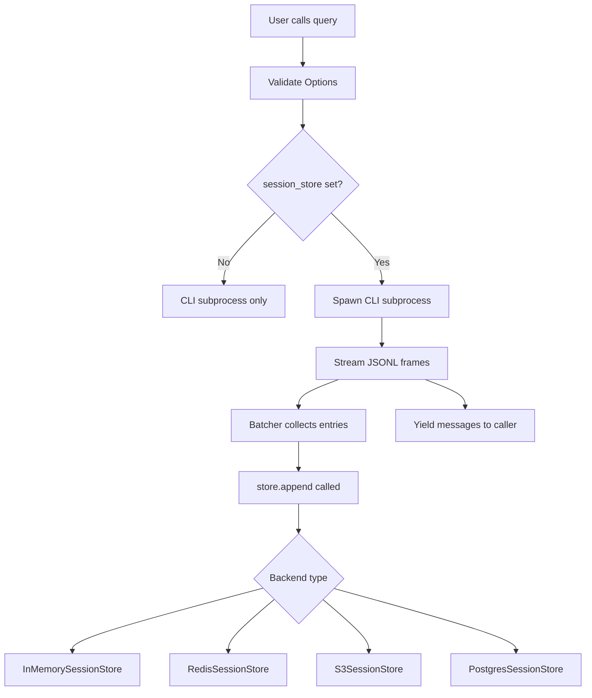
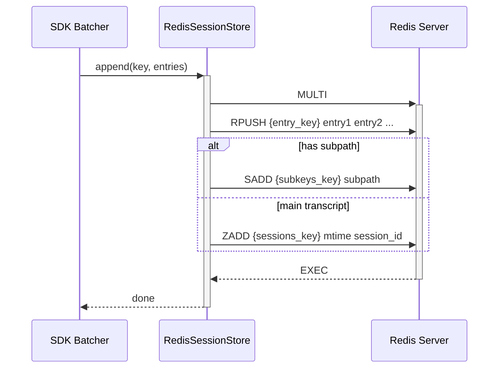
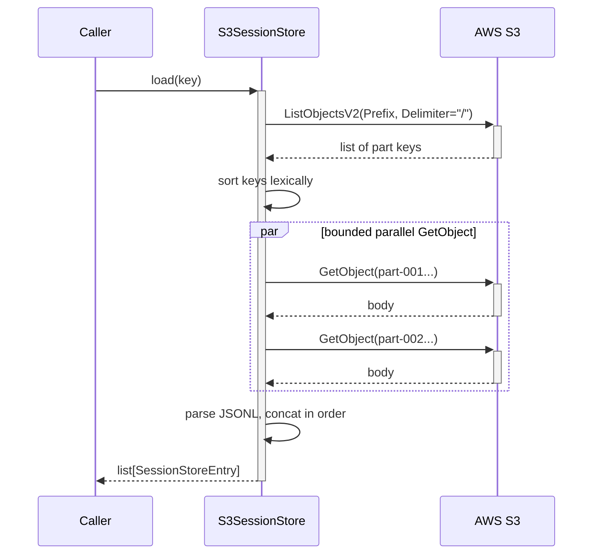

# Session Stores

Session stores provide a pluggable persistence layer for Claude Agent SDK conversation transcripts. Rather than relying solely on local disk files written by the Claude CLI, a `SessionStore` implementation intercepts every streamed message and mirrors it to a backend of your choice — in-memory, Redis, S3, or Postgres — enabling multi-process sharing, cloud durability, and custom retention policies. The store is attached via `ClaudeAgentOptions.session_store` and is validated at startup before the subprocess is spawned.

The SDK ships one built-in implementation (`InMemorySessionStore`) and provides three reference adapters (Redis, S3, Postgres) in the `examples/session_stores/` directory that you can copy and adapt. All implementations conform to the `SessionStore` protocol defined in `types.py`.

---

## The `SessionStore` Protocol

Every store must implement a small set of async methods. The protocol is defined in `src/claude_agent_sdk/types.py` and is satisfied by any class that provides `append` and `load`. The remaining methods (`list_sessions`, `delete`, `list_subkeys`) are optional — the SDK checks at runtime whether they are implemented and degrades gracefully or raises a descriptive `ValueError` when a missing method is required by the requested operation.

### Core Methods

| Method | Required | Description |
|---|---|---|
| `append(key, entries)` | ✅ Yes | Persist a batch of transcript entries for the given key. |
| `load(key)` | ✅ Yes | Return all stored entries for a key, or `None` if absent. |
| `list_sessions(project_key)` | ⚠️ Conditional | List all session IDs and their last-modified timestamps for a project. Required when `continue_conversation=True` and `resume` is not set. |
| `delete(key)` | ❌ Optional | Remove entries for a key. No-op if not implemented. |
| `list_subkeys(key)` | ❌ Optional | Return all subpaths (subagent transcripts) under a session. Required by `list_subagents_from_store`. |
| `list_session_summaries(project_key)` | ❌ Optional | Return cached summary sidecars for faster listing. Used as a fast path in `list_sessions_from_store`. |

Sources: [src/claude_agent_sdk/_internal/session_store.py:1-50](../../../src/claude_agent_sdk/_internal/session_store.py#L1-L50), [src/claude_agent_sdk/_internal/session_store_validation.py:1-40](../../../src/claude_agent_sdk/_internal/session_store_validation.py#L1-L40)

### Session Keys

All store methods are addressed by a `SessionKey` dictionary:

```python
# Main transcript
key = {"project_key": "project-abc", "session_id": "uuid-..."}

# Subagent transcript
key = {"project_key": "project-abc", "session_id": "uuid-...", "subpath": "subagents/agent-xyz"}
```

`project_key` is derived from the working directory via `project_key_for_directory()`. `session_id` is the UUID assigned by the Claude CLI. `subpath` is present only for subagent transcripts and uses `/` as separator regardless of OS.

Sources: [src/claude_agent_sdk/_internal/session_store.py:22-32](../../../src/claude_agent_sdk/_internal/session_store.py#L22-L32), [src/claude_agent_sdk/_internal/session_store.py:183-220](../../../src/claude_agent_sdk/_internal/session_store.py#L183-L220)

---

## Architecture Overview

The diagram below shows how a `SessionStore` fits into the SDK's data flow during a streaming query.



Sources: [src/claude_agent_sdk/_internal/session_store_validation.py:1-40](../../../src/claude_agent_sdk/_internal/session_store_validation.py#L1-L40), [src/claude_agent_sdk/_internal/session_store.py:1-100](../../../src/claude_agent_sdk/_internal/session_store.py#L1-L100)

---

## Pre-flight Validation

Before the subprocess is spawned, `validate_session_store_options()` checks for invalid option combinations and fails fast with a descriptive `ValueError`.

```python
# src/claude_agent_sdk/_internal/session_store_validation.py

def validate_session_store_options(options: ClaudeAgentOptions) -> None:
    store = options.session_store
    if store is None:
        return

    if (
        options.continue_conversation
        and options.resume is None
        and not _store_implements(store, "list_sessions")
    ):
        raise ValueError(
            "continue_conversation with session_store requires the store to "
            "implement list_sessions()"
        )

    if options.enable_file_checkpointing:
        raise ValueError(
            "session_store cannot be combined with enable_file_checkpointing ..."
        )
```

### Validation Rules

| Condition | Error |
|---|---|
| `continue_conversation=True`, `resume=None`, store lacks `list_sessions` | `ValueError` — store must implement `list_sessions()` |
| `enable_file_checkpointing=True` with any `session_store` | `ValueError` — checkpoints are local-disk only and would diverge from the mirrored transcript |

The helper `_store_implements(store, method)` distinguishes a real override from the Protocol default that raises `NotImplementedError`, so a store that inherits the stub is treated as "not implemented".

Sources: [src/claude_agent_sdk/_internal/session_store_validation.py:1-40](../../../src/claude_agent_sdk/_internal/session_store_validation.py#L1-L40)

---

## Built-in: `InMemorySessionStore`

`InMemorySessionStore` is the SDK's reference implementation, intended for testing and development. Data is stored in a plain Python `dict` and is lost when the process exits.

Sources: [src/claude_agent_sdk/_internal/session_store.py:35-165](../../../src/claude_agent_sdk/_internal/session_store.py#L35-L165)

### Internal Data Structures

| Attribute | Type | Description |
|---|---|---|
| `_store` | `dict[str, list[SessionStoreEntry]]` | Maps composite key string to list of entries. |
| `_mtimes` | `dict[str, int]` | Maps composite key string to last-write timestamp (Unix epoch ms). |
| `_summaries` | `dict[tuple[str, str], SessionSummaryEntry]` | Incrementally maintained session summary sidecars, keyed by `(project_key, session_id)`. |
| `_last_mtime` | `int` | Monotonic counter ensuring strictly increasing mtimes within the process. |

### Key Encoding

The composite key string is `project_key/session_id` for main transcripts and `project_key/session_id/subpath` for subagent transcripts.

```python
def _key_to_string(key: SessionKey) -> str:
    parts = [key["project_key"], key["session_id"]]
    subpath = key.get("subpath")
    if subpath:
        parts.append(subpath)
    return "/".join(parts)
```

Sources: [src/claude_agent_sdk/_internal/session_store.py:22-32](../../../src/claude_agent_sdk/_internal/session_store.py#L22-L32)

### Monotonic Mtime

Back-to-back `append()` calls within the same millisecond are guaranteed to produce strictly increasing mtimes, matching the ordering guarantees of real storage backends (file mtime, S3 `LastModified`, Postgres `updated_at`).

```python
def _next_mtime(self) -> int:
    now_ms = int(time.time() * 1000)
    if now_ms <= self._last_mtime:
        now_ms = self._last_mtime + 1
    self._last_mtime = now_ms
    return now_ms
```

Sources: [src/claude_agent_sdk/_internal/session_store.py:52-64](../../../src/claude_agent_sdk/_internal/session_store.py#L52-L64)

### Cascading Delete

Deleting a main transcript (no `subpath`) cascades to all subagent transcripts under the same `(project_key, session_id)` prefix:

```python
async def delete(self, key: SessionKey) -> None:
    k = _key_to_string(key)
    self._store.pop(k, None)
    self._mtimes.pop(k, None)
    if key.get("subpath") is None:
        self._summaries.pop((key["project_key"], key["session_id"]), None)
        prefix = f"{key['project_key']}/{key['session_id']}/"
        for store_key in [sk for sk in self._store if sk.startswith(prefix)]:
            self._store.pop(store_key, None)
            self._mtimes.pop(store_key, None)
```

Sources: [src/claude_agent_sdk/_internal/session_store.py:105-120](../../../src/claude_agent_sdk/_internal/session_store.py#L105-L120)

### Test Helpers

`InMemorySessionStore` exposes three convenience members used in tests:

| Member | Type | Description |
|---|---|---|
| `get_entries(key)` | method | Returns all entries for a key as a list (empty if absent). |
| `size` | property | Count of main transcripts (no subpath) currently stored. |
| `clear()` | method | Wipes all stored data, mtimes, and summaries. |

Sources: [src/claude_agent_sdk/_internal/session_store.py:130-155](../../../src/claude_agent_sdk/_internal/session_store.py#L130-L155)

---

## Reference Adapters

Three production-grade reference adapters are provided in `examples/session_stores/`. They are **not** part of the SDK package — copy them into your project and adapt as needed.

### Adapter Comparison

| Adapter | Backend | `append` operation | `load` operation | Concurrency model |
|---|---|---|---|---|
| `InMemorySessionStore` | Python dict | In-process extend | Dict lookup | Single-process only |
| `RedisSessionStore` | Redis (asyncio) | `RPUSH` + index update in `MULTI` | `LRANGE 0 -1` | Async, Redis-native |
| `S3SessionStore` | AWS S3 | `PutObject` (new part file) | `ListObjectsV2` + parallel `GetObject` | `asyncio.to_thread` wrapping boto3 |
| `PostgresSessionStore` | Postgres (asyncpg) | Multi-row `INSERT` via `unnest()` | `SELECT ... ORDER BY seq` | asyncpg connection pool |

---

### Redis Adapter (`RedisSessionStore`)

Sources: [examples/session_stores/redis_session_store.py](../../../examples/session_stores/redis_session_store.py)

The Redis adapter stores each transcript entry as a JSON string in a Redis list (`RPUSH`). A per-project sorted set tracks session IDs with their last-modified time as the score.

#### Key Scheme

```
{prefix}:{project_key}:{session_id}              list   main transcript (JSON each element)
{prefix}:{project_key}:{session_id}:{subpath}    list   subagent transcript
{prefix}:{project_key}:{session_id}:__subkeys    set    subpaths under this session
{prefix}:{project_key}:__sessions                zset   session_id → mtime (ms)
```

The `__sessions` and `__subkeys` sentinels are reserved; the SDK never emits a `session_id` of `__sessions` or a `subpath` of `__subkeys`.

#### Append Sequence



Sources: [examples/session_stores/redis_session_store.py:88-107](../../../examples/session_stores/redis_session_store.py#L88-L107)

#### Configuration

```python
store = RedisSessionStore(
    client=redis.Redis(host="localhost", port=6379, decode_responses=True),
    prefix="transcripts",
)
```

The `client` **must** be created with `decode_responses=True`. The `prefix` trailing `:` is normalized automatically.

Sources: [examples/session_stores/redis_session_store.py:60-70](../../../examples/session_stores/redis_session_store.py#L60-L70)

---

### S3 Adapter (`S3SessionStore`)

Sources: [examples/session_stores/s3_session_store.py](../../../examples/session_stores/s3_session_store.py)

The S3 adapter stores each `append()` call as a separate JSONL part file. This avoids read-modify-write and allows concurrent writers without coordination.

#### Object Key Structure

```
s3://{bucket}/{prefix}{project_key}/{session_id}/part-{epochMs13}-{rand6}.jsonl
```

The 13-digit zero-padded epoch-ms prefix ensures lexical sort order equals chronological order. The 6-character random hex suffix (`secrets.token_hex(3)`) disambiguates concurrent instances.

#### Load Sequence



The `Delimiter="/"` parameter is critical — without it, S3 would recurse into subagent subdirectories and mix their entries into the main transcript load.

Sources: [examples/session_stores/s3_session_store.py:115-160](../../../examples/session_stores/s3_session_store.py#L115-L160)

#### Concurrency Limit

Parallel `GetObject` calls are bounded by `_LOAD_CONCURRENCY = 16` to avoid exhausting connection pools on large sessions.

Sources: [examples/session_stores/s3_session_store.py:56-57](../../../examples/session_stores/s3_session_store.py#L56-L57)

#### Configuration

```python
store = S3SessionStore(
    bucket="my-claude-sessions",
    prefix="transcripts",
    client=boto3.client("s3", region_name="us-east-1"),
)
```

All `boto3` calls are wrapped in `asyncio.to_thread` — `boto3` clients are thread-safe but blocking.

Sources: [examples/session_stores/s3_session_store.py:85-100](../../../examples/session_stores/s3_session_store.py#L85-L100)

---

### Postgres Adapter (`PostgresSessionStore`)

Sources: [examples/session_stores/postgres_session_store.py](../../../examples/session_stores/postgres_session_store.py)

The Postgres adapter stores one row per transcript entry in a single table. `append()` uses a multi-row `INSERT` via `unnest()` for a single round-trip per batch.

#### Schema

```sql
CREATE TABLE IF NOT EXISTS claude_session_store (
  project_key text   NOT NULL,
  session_id  text   NOT NULL,
  subpath     text   NOT NULL DEFAULT '',
  seq         bigserial,
  entry       jsonb  NOT NULL,
  mtime       bigint NOT NULL,
  PRIMARY KEY (project_key, session_id, subpath, seq)
);
CREATE INDEX IF NOT EXISTS claude_session_store_list_idx
  ON claude_session_store (project_key, session_id) WHERE subpath = '';
```

The empty string `''` is the sentinel for the main transcript's `subpath` column so the composite primary key is total (Postgres treats `NULL` as distinct in PKs). The partial index on `subpath = ''` keeps `list_sessions` cheap without indexing every subagent row.

Sources: [examples/session_stores/postgres_session_store.py:86-108](../../../examples/session_stores/postgres_session_store.py#L86-L108)

#### JSONB Key Ordering

Postgres `jsonb` reorders object keys on read-back. The `SessionStore.load` contract explicitly permits this — `load` must return deep-equal values, not byte-equal. The SDK's lite-parse tag scan hoists `"type"` to the first key when re-serializing so type detection is not affected.

Sources: [examples/session_stores/postgres_session_store.py:44-60](../../../examples/session_stores/postgres_session_store.py#L44-L60)

#### Append Implementation

```python
await self._pool.execute(
    f"""
    INSERT INTO {self._table} (project_key, session_id, subpath, entry, mtime)
    SELECT $1, $2, $3, e,
           (EXTRACT(EPOCH FROM clock_timestamp()) * 1000)::bigint
    FROM unnest($4::jsonb[]) WITH ORDINALITY AS t(e, ord)
    ORDER BY ord
    """,
    key["project_key"], key["session_id"], subpath,
    [json.dumps(e) for e in entries],
)
```

`WITH ORDINALITY` preserves the original array order within the single atomic `INSERT`.

Sources: [examples/session_stores/postgres_session_store.py:115-130](../../../examples/session_stores/postgres_session_store.py#L115-L130)

#### Table Name Injection Guard

The table name is validated against `[A-Za-z_][A-Za-z0-9_]*` at construction time because it cannot be parameterized in SQL identifiers:

```python
_IDENT_RE = re.compile(r"^[A-Za-z_][A-Za-z0-9_]*$")
if not _IDENT_RE.match(table):
    raise ValueError(f"table {table!r} must match [A-Za-z_][A-Za-z0-9_]* ...")
```

Sources: [examples/session_stores/postgres_session_store.py:70-80](../../../examples/session_stores/postgres_session_store.py#L70-L80)

---

## Session Key Derivation from File Paths

The helper `file_path_to_session_key()` converts an absolute local transcript file path back into a `SessionKey`. This is used by the batcher to route file-system events to the correct store key.

```
Main transcript:   <projects_dir>/<project_key>/<session_id>.jsonl
Subagent:          <projects_dir>/<project_key>/<session_id>/subagents/agent-<id>.jsonl
```

Subpaths are always `/`-joined regardless of `os.sep` to ensure portability across platforms.

Returns `None` if the path is not under `projects_dir`, is on a different drive (Windows), or has an unrecognized shape.

Sources: [src/claude_agent_sdk/_internal/session_store.py:162-220](../../../src/claude_agent_sdk/_internal/session_store.py#L162-L220)

---

## Session Store–Backed Helper Functions

The SDK exposes a set of async helper functions that operate against any `SessionStore`:

| Function | Required store methods | Description |
|---|---|---|
| `list_sessions_from_store(store, directory)` | `list_sessions` | List all sessions with summaries, sorted by mtime descending. |
| `get_session_info_from_store(store, session_id, directory)` | `load` | Fetch metadata for a single session. |
| `get_session_messages_from_store(store, session_id, directory)` | `load` | Fetch transcript messages for a session. |
| `list_subagents_from_store(store, session_id, directory)` | `list_subkeys` | List subagent IDs under a session. |
| `get_subagent_messages_from_store(store, session_id, agent_id, directory)` | `load` | Fetch messages for a specific subagent. |
| `rename_session_via_store(store, session_id, title, directory)` | `append` | Append a `custom-title` entry. |
| `tag_session_via_store(store, session_id, tag, directory)` | `append` | Append a `tag` entry. |
| `delete_session_via_store(store, session_id, directory)` | `delete` (optional) | Delete a session; no-op if `delete` not implemented. |
| `fork_session_via_store(store, session_id, directory)` | `load`, `append` | Fork a session with remapped UUIDs and a new session ID. |

Sources: [tests/test_session_helpers_store.py:1-50](../../../tests/test_session_helpers_store.py#L1-L50)

### `list_sessions_from_store` Fast Path

When the store implements `list_session_summaries()`, the helper uses the pre-computed sidecar data instead of loading every session's full transcript. If `list_session_summaries` raises `NotImplementedError` or is absent, the helper falls back to calling `load()` per session, bounded by `_STORE_LIST_LOAD_CONCURRENCY` concurrent requests to avoid exhausting adapter connection pools.

Sources: [tests/test_session_helpers_store.py:113-155](../../../tests/test_session_helpers_store.py#L113-L155)

### Sidechain Filtering

Sessions where the first entry carries `isSidechain: true` are excluded from `list_sessions_from_store` results, matching the behavior of the filesystem-based listing path. Filtering is applied before pagination so `limit=N` always returns N non-sidechain rows.

Sources: [tests/test_session_helpers_store.py:93-112](../../../tests/test_session_helpers_store.py#L93-L112)

---

## Retention and Lifecycle

None of the reference adapters automatically expire data:

- **Redis**: Configure key expiration on your prefix or call `RedisSessionStore.delete()` according to your compliance requirements.
- **S3**: Configure an S3 lifecycle policy on the bucket/prefix.
- **Postgres**: Add a scheduled `DELETE ... WHERE mtime < $cutoff` or table partitioning by `mtime`.
- **Local disk**: Swept independently by the Claude CLI's `cleanupPeriodDays` setting.

Sources: [examples/session_stores/redis_session_store.py:30-35](../../../examples/session_stores/redis_session_store.py#L30-L35), [examples/session_stores/s3_session_store.py:42-46](../../../examples/session_stores/s3_session_store.py#L42-L46), [examples/session_stores/postgres_session_store.py:60-66](../../../examples/session_stores/postgres_session_store.py#L60-L66)

---

## Implementing a Custom Store

To implement a minimal custom store, subclass `SessionStore` and override `append` and `load`. The SDK will detect which optional methods are present using `_store_implements()` and raise descriptive errors if a required-but-absent method is called.

```python
from claude_agent_sdk import SessionStore, SessionKey, SessionStoreEntry

class MyStore(SessionStore):
    async def append(self, key: SessionKey, entries: list[SessionStoreEntry]) -> None:
        ...  # write to your backend

    async def load(self, key: SessionKey) -> list[SessionStoreEntry] | None:
        ...  # read from your backend; return None if not found
```

For operations that require `list_sessions` (e.g., `continue_conversation` without an explicit `resume`), also implement:

```python
    async def list_sessions(self, project_key: str) -> list[SessionStoreListEntry]:
        ...  # return [{"session_id": ..., "mtime": epoch_ms}, ...]
```

Sources: [src/claude_agent_sdk/_internal/session_store_validation.py:10-20](../../../src/claude_agent_sdk/_internal/session_store_validation.py#L10-L20), [tests/test_session_helpers_store.py:55-70](../../../tests/test_session_helpers_store.py#L55-L70)

---

## Summary

Session stores decouple transcript persistence from the local filesystem, enabling durable, shareable, and cloud-hosted conversation histories. The `SessionStore` protocol requires only `append` and `load`; additional methods unlock richer SDK features. The built-in `InMemorySessionStore` is the reference implementation for tests and local development. Three production-grade adapters (Redis, S3, Postgres) are provided as copy-and-adapt examples. Pre-flight validation in `validate_session_store_options` catches incompatible option combinations — such as pairing a store with `enable_file_checkpointing` or using `continue_conversation` with a store that lacks `list_sessions` — before the subprocess is spawned, ensuring fast and clear failure modes.