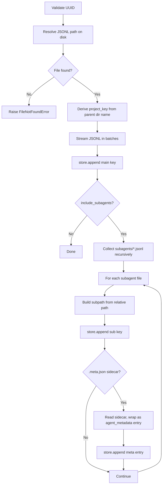
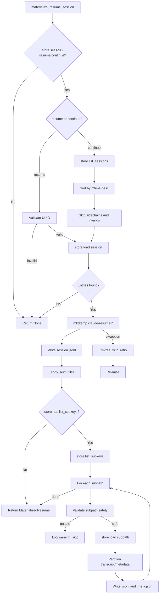
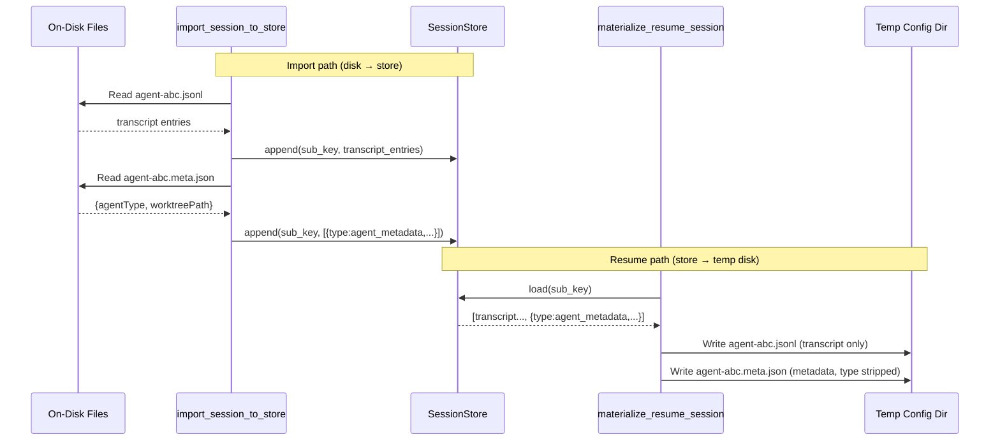
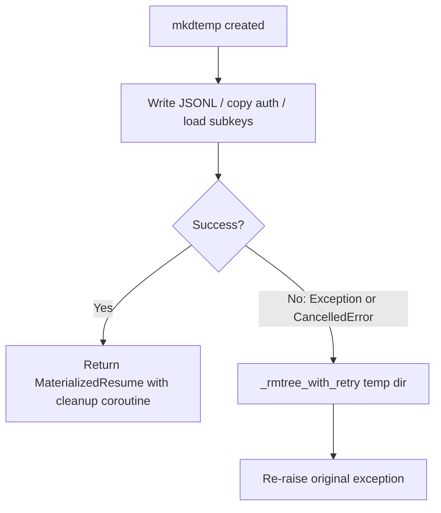
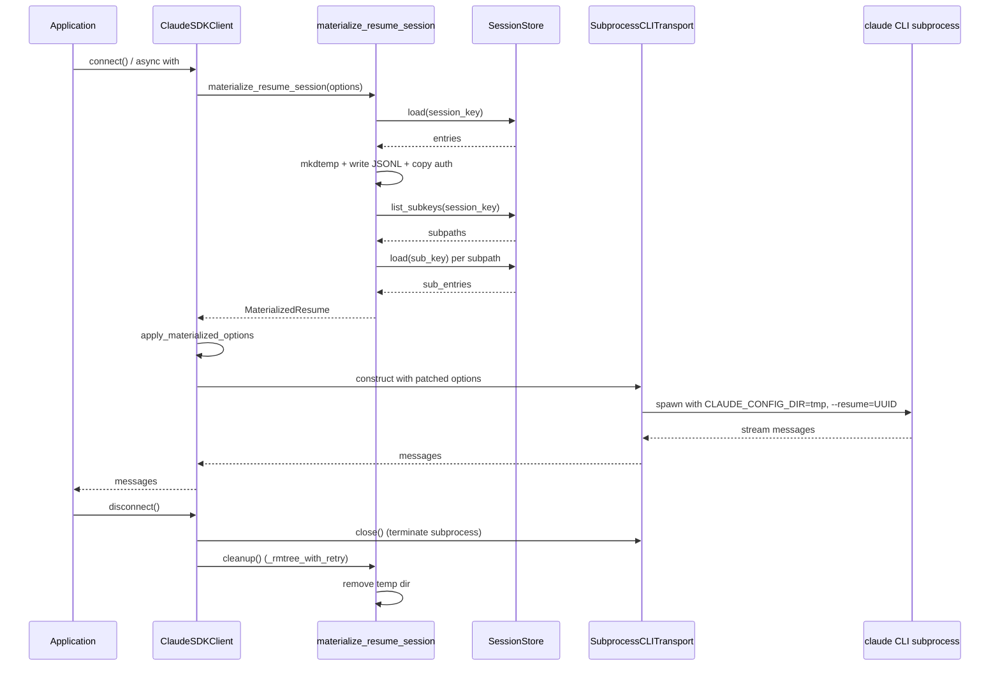

# Sessions & Conversation History

The `claude-agent-sdk-python` SDK provides a rich session management subsystem that persists, resumes, and migrates Claude conversation histories. Sessions are identified by UUIDs and stored as JSONL transcripts — either on local disk under `~/.claude/projects/<project_key>/` or in an external `SessionStore` implementation. The two primary modules that power this subsystem are `session_import` (local disk → store) and `session_resume` (store → local disk), which together form a symmetric bridge enabling portable, resumable conversations across environments.

This page covers the session data model, the `SessionStore` protocol, the import and resume workflows, subagent transcript handling, security guards, and the lifecycle of materialized temporary directories. For information on the transport layer that executes queries, see the subprocess transport documentation.

---

## Core Data Model

### Session Keys

Every piece of session data is addressed by a `SessionKey` dictionary that uniquely identifies a conversation or sub-conversation within a project.

| Field | Type | Required | Description |
|---|---|---|---|
| `project_key` | `str` | ✅ | Hashed/encoded name of the project directory (derived from `cwd`). |
| `session_id` | `str` | ✅ | UUID v4 string identifying the conversation. |
| `subpath` | `str` | ❌ | Relative path within the session directory for subagent transcripts (e.g., `subagents/agent-abc`). |

Sources: [src/claude_agent_sdk/_internal/session_resume.py:45-55](../../../src/claude_agent_sdk/_internal/session_resume.py#L45-L55), [tests/test_session_import.py:16-18](../../../tests/test_session_import.py#L16-L18)

### Session Store Entries

Each line in a JSONL transcript is a `SessionStoreEntry` — a typed dictionary. The `type` field distinguishes the entry's role:

| `type` value | Description |
|---|---|
| `user` | A user turn in the conversation. |
| `assistant` | An assistant (Claude) turn. |
| `agent_metadata` | Metadata about a subagent (e.g., `agentType`, `worktreePath`). Stored in `.meta.json` sidecars on disk. |
| *(others)* | Additional turn/event types emitted by the CLI subprocess. |

The `agent_metadata` type is synthetic — it is never written into JSONL transcript files on disk. Instead it is stored in `.meta.json` sidecar files and translated to/from `SessionStoreEntry` objects during import and materialization.

Sources: [src/claude_agent_sdk/_internal/session_import.py:77-84](../../../src/claude_agent_sdk/_internal/session_import.py#L77-L84), [src/claude_agent_sdk/_internal/session_resume.py:188-200](../../../src/claude_agent_sdk/_internal/session_resume.py#L188-L200)

### On-Disk Layout

```
~/.claude/
├── .credentials.json         # OAuth tokens
├── .claude.json              # User preferences
└── projects/
    └── <project_key>/
        ├── <session_id>.jsonl          # Main transcript
        └── <session_id>/
            └── subagents/
                ├── agent-abc.jsonl     # Subagent transcript
                ├── agent-abc.meta.json # Subagent metadata sidecar
                └── workflows/
                    └── run-1/
                        └── agent-def.jsonl
```

Sources: [src/claude_agent_sdk/_internal/session_import.py:47-60](../../../src/claude_agent_sdk/_internal/session_import.py#L47-L60), [tests/test_session_import.py:45-60](../../../tests/test_session_import.py#L45-L60)

---

## The `SessionStore` Protocol

`SessionStore` is the abstract interface that all session backends must implement. The SDK ships with `InMemorySessionStore` for testing and development.

### Required Methods

| Method | Signature | Description |
|---|---|---|
| `append` | `(key: SessionKey, entries: list[SessionStoreEntry]) -> None` | Append a batch of entries to the store. Implementations should treat `entry["uuid"]` as an idempotency key. |
| `load` | `(key: SessionKey) -> list[Any]` | Load all entries for a key. Returns an empty list or `None` if the session does not exist. |
| `list_sessions` | `(project_key: str) -> list[SessionInfo]` | List sessions for a project, with `mtime` for recency sorting. Used by `continue_conversation`. |

### Optional Methods

| Method | Description |
|---|---|
| `list_subkeys` | `(key: SessionKey) -> list[str]` — Enumerate subagent subpaths under a session. When absent, subagent materialization is skipped entirely. |

The SDK detects `list_subkeys` availability at runtime using `_store_implements()`, so minimal store implementations (implementing only `append` and `load`) are fully supported.

Sources: [src/claude_agent_sdk/_internal/session_resume.py:170-175](../../../src/claude_agent_sdk/_internal/session_resume.py#L170-L175), [tests/test_session_resume.py:316-327](../../../tests/test_session_resume.py#L316-L327)

---

## Session Import: Local Disk → Store

`import_session_to_store` reads an on-disk JSONL transcript and replays it into a `SessionStore`. This is the inverse of `materialize_resume_session`.

### Use Cases

- Migrating existing local sessions to a remote/shared store.
- Catching a store up after a live-mirror gap (indicated by a `MirrorErrorMessage`).
- Seeding a store for testing or offline scenarios.

### How It Works



Sources: [src/claude_agent_sdk/_internal/session_import.py:37-84](../../../src/claude_agent_sdk/_internal/session_import.py#L37-L84)

### Batching

To avoid memory pressure on large transcripts, `_append_jsonl_file_in_batches` flushes to the store whenever either of two thresholds is reached:

| Threshold | Value | Description |
|---|---|---|
| `batch_size` entries | Default: `MAX_PENDING_ENTRIES` (500) | Maximum number of entries per `store.append()` call. |
| `MAX_PENDING_BYTES` bytes | 1 MiB | Maximum cumulative byte size of lines in a pending batch. |

Blank lines in the JSONL file are silently skipped. A non-positive `batch_size` argument is normalized to `MAX_PENDING_ENTRIES`.

```python
async def _append_jsonl_file_in_batches(
    file_path: Path,
    key: SessionKey,
    store: SessionStore,
    batch_size: int,
) -> None:
    batch: list[SessionStoreEntry] = []
    nbytes = 0
    with file_path.open(encoding="utf-8") as f:
        for line in f:
            line = line.rstrip("\n")
            if not line:
                continue
            batch.append(json.loads(line))
            nbytes += len(line)
            if len(batch) >= batch_size or nbytes >= MAX_PENDING_BYTES:
                await store.append(key, batch)
                batch = []
                nbytes = 0
    if batch:
        await store.append(key, batch)
```

Sources: [src/claude_agent_sdk/_internal/session_import.py:88-113](../../../src/claude_agent_sdk/_internal/session_import.py#L88-L113), [tests/test_session_import.py:65-88](../../../tests/test_session_import.py#L65-L88)

### Subpath Key Parity

A critical invariant: the `SessionKey` produced by `import_session_to_store` for a given file must be identical to what `file_path_to_session_key()` (used by `TranscriptMirrorBatcher` during live streaming) would produce for the same file. This ensures an imported session is indistinguishable from a live-mirrored one and can be resumed transparently.

The `project_key` is always derived from `resolved.parent.name` — the on-disk project directory name — regardless of whether `directory=None` caused the resolver to search all project directories.

Sources: [src/claude_agent_sdk/_internal/session_import.py:43-47](../../../src/claude_agent_sdk/_internal/session_import.py#L43-L47), [tests/test_session_import.py:133-163](../../../tests/test_session_import.py#L133-L163)

### Validation and Error Handling

| Condition | Exception |
|---|---|
| `session_id` is not a valid UUID | `ValueError: Invalid session_id` |
| Session JSONL not found on disk | `FileNotFoundError: Session {id} not found` |

Sources: [src/claude_agent_sdk/_internal/session_import.py:62-68](../../../src/claude_agent_sdk/_internal/session_import.py#L62-L68), [tests/test_session_import.py:116-124](../../../tests/test_session_import.py#L116-L124)

---

## Session Resume: Store → Local Disk

`materialize_resume_session` is the counterpart to import: it loads a session from a `SessionStore` and writes it to a temporary directory structured like `~/.claude/`, then returns a `MaterializedResume` that the subprocess transport can consume.

### Why Materialization Is Needed

The Claude CLI subprocess only knows how to resume sessions from local disk. When a `SessionStore` is in use, the transcript likely does not exist locally. Materialization bridges this gap by constructing a temporary `CLAUDE_CONFIG_DIR` that the subprocess treats as its home directory.

### `MaterializedResume` Dataclass

| Field | Type | Description |
|---|---|---|
| `config_dir` | `Path` | Temporary directory laid out like `~/.claude/`. Set as `CLAUDE_CONFIG_DIR` for the subprocess. |
| `resume_session_id` | `str` | The concrete UUID to pass as `--resume` to the CLI. |
| `cleanup` | `Callable[[], Awaitable[None]]` | Coroutine that removes `config_dir` (best-effort, with retries). Must be called after the subprocess exits. |

Sources: [src/claude_agent_sdk/_internal/session_resume.py:41-57](../../../src/claude_agent_sdk/_internal/session_resume.py#L41-L57)

### Materialization Flow



Sources: [src/claude_agent_sdk/_internal/session_resume.py:82-148](../../../src/claude_agent_sdk/_internal/session_resume.py#L82-L148)

### `continue_conversation` Resolution

When `options.continue_conversation=True`, the SDK resolves the most recent session automatically:

1. Call `store.list_sessions(project_key)` to get all sessions with their `mtime`.
2. Sort newest-first.
3. Skip any session whose first entry has `isSidechain: True` — these are subagent sidechain transcripts that are mirrored as top-level keys and often have the highest mtime.
4. Load the first non-sidechain candidate; if its entries are empty, continue to the next.
5. If no valid candidate exists, return `None` (a fresh session starts).

This mirrors the CLI's own `--continue` filter behavior.

Sources: [src/claude_agent_sdk/_internal/session_resume.py:207-231](../../../src/claude_agent_sdk/_internal/session_resume.py#L207-L231), [tests/test_session_resume.py:148-202](../../../tests/test_session_resume.py#L148-L202)

### Auth File Copying

The materialized `config_dir` must contain auth credentials so the subprocess can authenticate. The SDK copies:

| File | Source | Notes |
|---|---|---|
| `.credentials.json` | `$CLAUDE_CONFIG_DIR/.credentials.json` or `~/.claude/.credentials.json` | `refreshToken` is **redacted** before copying (see below). |
| `.claude.json` | `$CLAUDE_CONFIG_DIR/.claude.json` or `~/.claude.json` | Copied verbatim. Note: NOT `~/.claude/.claude.json`. |

On macOS, when no file-based credentials or `ANTHROPIC_API_KEY`/`CLAUDE_CODE_OAUTH_TOKEN` env vars are present, the SDK falls back to reading credentials from the macOS Keychain (service name: `Claude Code-credentials`) via the `security` CLI tool.

#### Refresh Token Redaction

The `refreshToken` inside `claudeAiOauth` is removed before writing to the temp directory. This prevents the subprocess (running under a redirected `CLAUDE_CONFIG_DIR`) from consuming the single-use refresh token and leaving the parent process's stored credentials revoked.

```python
def _write_redacted_credentials(creds_json: str | None, dst: Path) -> None:
    if creds_json is None:
        return
    out = creds_json
    try:
        data = json.loads(creds_json)
        oauth = data.get("claudeAiOauth") if isinstance(data, dict) else None
        if isinstance(oauth, dict) and "refreshToken" in oauth:
            del oauth["refreshToken"]
            out = json.dumps(data)
    except (json.JSONDecodeError, ValueError):
        pass
    dst.write_text(out, encoding="utf-8")
    with suppress(OSError):
        dst.chmod(0o600)
```

Sources: [src/claude_agent_sdk/_internal/session_resume.py:257-310](../../../src/claude_agent_sdk/_internal/session_resume.py#L257-L310), [tests/test_session_resume.py:104-130](../../../tests/test_session_resume.py#L104-L130)

---

## Subagent Transcript Handling

Both import and resume support multi-level agent hierarchies. Subagent transcripts are stored under `<sessionId>/subagents/` with arbitrary nesting depth.

### Subpath Format

A `subpath` is a `/`-joined relative path from the session directory to the transcript file, without the `.jsonl` extension. Examples:

- `subagents/agent-abc` → `<session_dir>/subagents/agent-abc.jsonl`
- `subagents/workflows/run-1/agent-def` → `<session_dir>/subagents/workflows/run-1/agent-def.jsonl`

### Metadata Sidecar Round-Trip



Sources: [src/claude_agent_sdk/_internal/session_import.py:72-84](../../../src/claude_agent_sdk/_internal/session_import.py#L72-L84), [src/claude_agent_sdk/_internal/session_resume.py:188-208](../../../src/claude_agent_sdk/_internal/session_resume.py#L188-L208), [tests/test_session_import.py:95-115](../../../tests/test_session_import.py#L95-L115)

---

## Security: Subpath Traversal Guards

Because `list_subkeys` returns data from an external store, `_is_safe_subpath` validates every subpath before it is used as a filesystem path component during materialization.

### Rejection Criteria

| Check | Reason |
|---|---|
| Empty string | `'' + '.jsonl'` → `.jsonl`, a hidden dotfile. |
| Absolute path (`/`, `\`) | Would escape the session directory. |
| Drive-prefixed (`C:foo`) or UNC | Rejected via `ntpath.splitdrive` regardless of host OS. |
| Any component is `.` or `..` | Path traversal. |
| Contains null byte (`\x00`) | Filesystem injection. |
| Resolves outside `session_dir` | Final `.resolve()` + `.relative_to()` check catches symlink chains. |

Any subpath failing validation is skipped with a `logger.warning` and never loaded from the store.

```python
def _is_safe_subpath(subpath: str, session_dir: Path) -> bool:
    if not subpath:
        return False
    if Path(subpath).is_absolute() or subpath.startswith(("/", "\\")):
        return False
    if ntpath.splitdrive(subpath)[0]:
        return False
    if any(p in (".", "..") for p in re.split(r"[\\/]", subpath)):
        return False
    if "\x00" in subpath:
        return False
    target = session_dir / subpath
    try:
        sub_file = target.with_name(target.name + ".jsonl").resolve()
        sub_file.relative_to(session_dir.resolve())
    except (ValueError, OSError):
        return False
    return True
```

Sources: [src/claude_agent_sdk/_internal/session_resume.py:326-360](../../../src/claude_agent_sdk/_internal/session_resume.py#L326-L360), [tests/test_session_resume.py:263-310](../../../tests/test_session_resume.py#L263-L310)

---

## Timeout and Error Handling

All `SessionStore` calls during materialization are wrapped in `_with_timeout`, which applies `options.load_timeout_ms` (converted to seconds) to every async operation.

| Store Call | Timeout Applied | Error Behavior |
|---|---|---|
| `store.load()` | ✅ `load_timeout_ms` | Raises `RuntimeError: ... timed out` |
| `store.list_sessions()` | ✅ `load_timeout_ms` | Raises `RuntimeError: ... timed out` |
| `store.list_subkeys()` | ✅ `load_timeout_ms` | Raises `RuntimeError: ... timed out` |
| Any store exception | N/A | Wrapped as `RuntimeError: {what} failed ... {e}` |

### Temp Directory Cleanup on Failure

The `try/except BaseException` block in `materialize_resume_session` ensures the temp directory is always removed if any error occurs after `mkdtemp()` — including `asyncio.CancelledError` (a `BaseException` since Python 3.8).



### Retry Logic for `rmtree`

On Windows, antivirus or indexer processes can briefly hold handles on `.credentials.json`. `_rmtree_with_retry` retries `shutil.rmtree` up to 4 times with 100ms backoff on retryable `OSError` codes (`EBUSY`, `EPERM`, `EACCES`, etc.), then falls back to `ignore_errors=True`.

Sources: [src/claude_agent_sdk/_internal/session_resume.py:152-165](../../../src/claude_agent_sdk/_internal/session_resume.py#L152-L165), [src/claude_agent_sdk/_internal/session_resume.py:233-256](../../../src/claude_agent_sdk/_internal/session_resume.py#L233-L256), [tests/test_session_resume.py:368-430](../../../tests/test_session_resume.py#L368-L430)

---

## Integration with `ClaudeSDKClient`

### `apply_materialized_options`

After materialization, `apply_materialized_options` returns a modified copy of `ClaudeAgentOptions` with:

- `env["CLAUDE_CONFIG_DIR"]` set to the temp directory path.
- `resume` set to the resolved `resume_session_id`.
- `continue_conversation` cleared to `False` (already resolved).

The original `options` object is **never mutated**.

Sources: [src/claude_agent_sdk/_internal/session_resume.py:59-74](../../../src/claude_agent_sdk/_internal/session_resume.py#L59-L74), [tests/test_session_resume.py:196-230](../../../tests/test_session_resume.py#L196-L230)

### `build_mirror_batcher`

The `TranscriptMirrorBatcher` (which live-mirrors new transcript lines to the store during a query) must use the same `projects_dir` that the subprocess writes to. `build_mirror_batcher` resolves this:

- When a `MaterializedResume` exists: `projects_dir = materialized.config_dir / "projects"` (the temp dir).
- Otherwise: the standard projects directory under the effective `CLAUDE_CONFIG_DIR`.

This ensures `file_path_to_session_key()` resolution inside the batcher produces keys that match the imported/materialized session's keys.

Sources: [src/claude_agent_sdk/_internal/session_resume.py:76-93](../../../src/claude_agent_sdk/_internal/session_resume.py#L76-L93), [tests/test_session_resume.py:196-230](../../../tests/test_session_resume.py#L196-L230)

### Custom Transport Skip Gate

When a pre-constructed custom transport is passed to `ClaudeSDKClient` or `query()`, materialization is **skipped entirely**. Loading the store and writing `.credentials.json` to a temp directory would be wasted work and would leave the access token on disk for the entire session lifetime without a guaranteed cleanup path.

Sources: [tests/test_session_resume.py:232-270](../../../tests/test_session_resume.py#L232-L270)

### End-to-End Lifecycle



Sources: [src/claude_agent_sdk/_internal/session_resume.py:59-93](../../../src/claude_agent_sdk/_internal/session_resume.py#L59-L93), [tests/test_session_resume.py:196-230](../../../tests/test_session_resume.py#L196-L230), [tests/test_session_resume.py:431-480](../../../tests/test_session_resume.py#L431-L480)

---

## Summary

The session management subsystem provides a symmetric, portable conversation history layer. `import_session_to_store` migrates on-disk JSONL transcripts into any `SessionStore` implementation using batched streaming, while `materialize_resume_session` reconstructs a temporary local `~/.claude/` tree from a store so the CLI subprocess can resume seamlessly. Both operations preserve subagent transcript hierarchies and `.meta.json` sidecar metadata, and both produce `SessionKey` values that are interchangeable with those emitted by the live `TranscriptMirrorBatcher`. Security is enforced via UUID validation, subpath traversal guards, and `refreshToken` redaction. Robust cleanup — including retry logic for transient OS locks and `BaseException` handling for `asyncio.CancelledError` — ensures that temporary directories containing auth credentials are never leaked regardless of how a session ends.