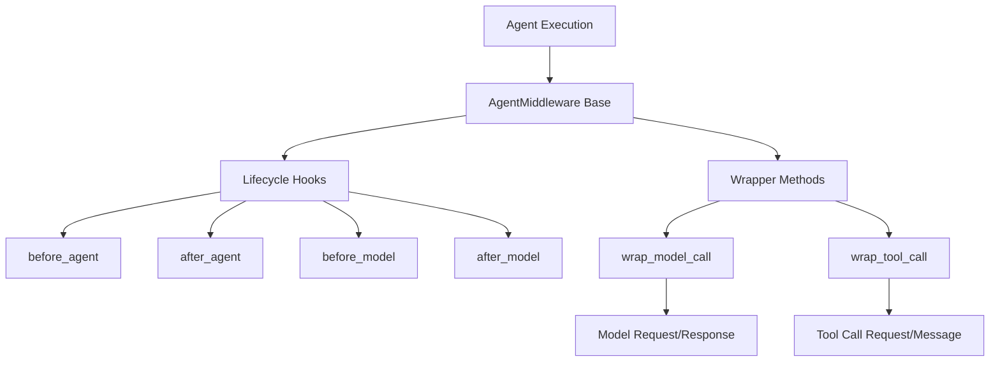
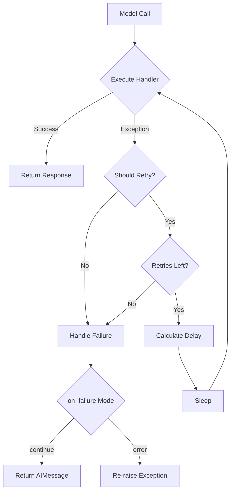
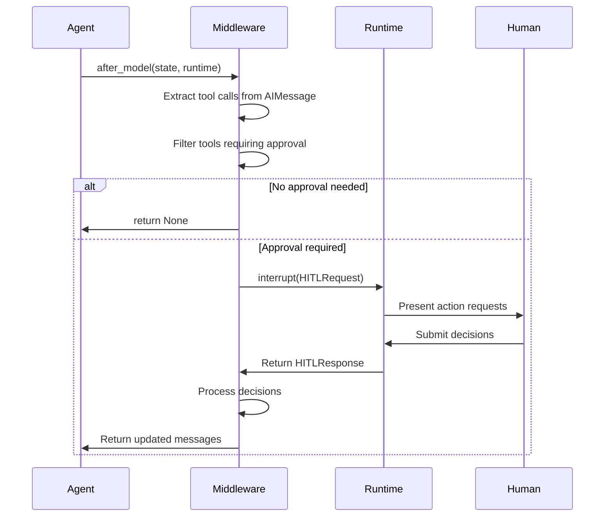
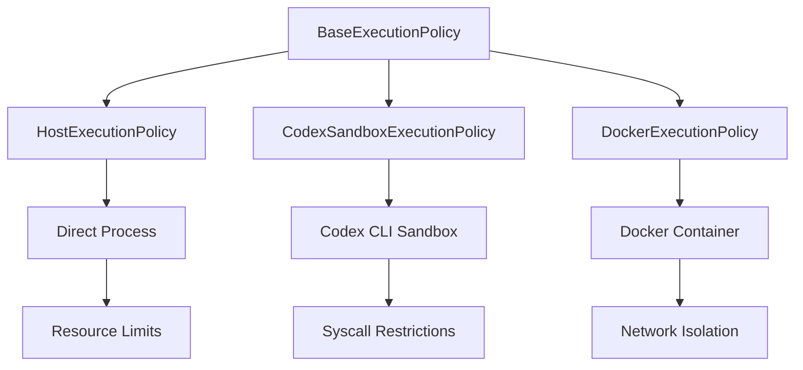
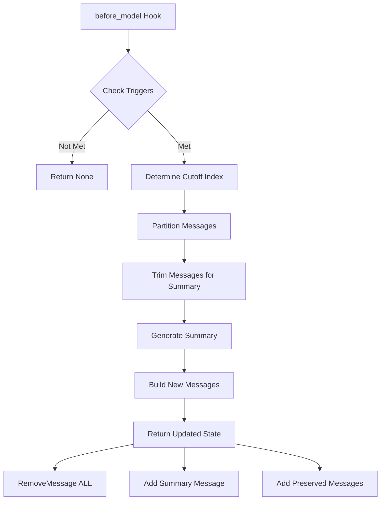

# Agent Middleware System (langchain v1)

The Agent Middleware System provides a powerful interception and control layer for LangChain agents, enabling developers to inject custom logic at critical points in the agent execution lifecycle. Middleware components can intercept model calls, tool executions, and agent state transitions, allowing for cross-cutting concerns such as retry logic, human-in-the-loop approvals, summarization, rate limiting, and security policies. The system is built on a composable architecture where multiple middleware instances can be chained together to create sophisticated agent behaviors without modifying core agent logic.

The middleware system integrates with LangGraph's runtime and supports both synchronous and asynchronous execution patterns. It provides a consistent API through the `AgentMiddleware` base class and includes a rich set of pre-built middleware implementations for common use cases, from automatic retry mechanisms to Docker-based sandboxed execution environments.

Sources: [__init__.py:1-77](../../../libs/langchain_v1/langchain/agents/middleware/__init__.py#L1-L77)

## Architecture Overview

The middleware system is structured around several core concepts:



The system operates through two primary mechanisms:

1. **Lifecycle Hooks**: Methods that execute before or after specific agent phases (model invocation, tool execution)
2. **Wrapper Methods**: Functions that intercept and control the actual execution of models and tools

Sources: [__init__.py:29-46](../../../libs/langchain_v1/langchain/agents/middleware/__init__.py#L29-L46)

## Core Components

### AgentMiddleware Base Class

The `AgentMiddleware` abstract base class defines the contract for all middleware implementations. It is generic over three type parameters:

| Type Parameter | Description |
|---------------|-------------|
| `StateT` | The agent state type, typically `AgentState[ResponseT]` |
| `ContextT` | Runtime context type for the execution environment |
| `ResponseT` | The response type from model invocations |

Key methods include:

- `before_agent()` / `after_agent()`: Execute before/after the entire agent turn
- `before_model()` / `after_model()`: Execute before/after model invocations
- `wrap_model_call()` / `awrap_model_call()`: Intercept and control model execution
- `wrap_tool_call()` / `awrap_tool_call()`: Intercept and control tool execution

Sources: [__init__.py:29-46](../../../libs/langchain_v1/langchain/agents/middleware/__init__.py#L29-L46)

### State and Request Types

The middleware system defines several key data structures for passing information between components:

| Type | Purpose |
|------|---------|
| `AgentState` | Contains the conversation history (`messages`) and any additional state |
| `ModelRequest` | Encapsulates model, messages, state, and runtime for model calls |
| `ModelResponse` | Contains the result messages from model invocation |
| `ToolCallRequest` | Contains tool call dict, BaseTool instance, state, and runtime |
| `ExtendedModelResponse` | Extended response with additional metadata |

Sources: [__init__.py:29-46](../../../libs/langchain_v1/langchain/agents/middleware/__init__.py#L29-L46)

## Retry Middleware

### Model Retry Middleware

The `ModelRetryMiddleware` automatically retries failed model calls with configurable exponential backoff. It intercepts model execution and applies retry logic when exceptions occur.



**Configuration Parameters:**

| Parameter | Type | Default | Description |
|-----------|------|---------|-------------|
| `max_retries` | int | 2 | Maximum retry attempts after initial call |
| `retry_on` | `RetryOn` | `(Exception,)` | Exception types or callable to determine retry eligibility |
| `on_failure` | `OnFailure` | `'continue'` | Behavior when retries exhausted: `'continue'`, `'error'`, or custom callable |
| `backoff_factor` | float | 2.0 | Exponential backoff multiplier |
| `initial_delay` | float | 1.0 | Initial delay in seconds before first retry |
| `max_delay` | float | 60.0 | Maximum delay cap for exponential backoff |
| `jitter` | bool | True | Add random ±25% jitter to prevent thundering herd |

The retry delay is calculated as: `initial_delay * (backoff_factor ** retry_number)`, capped at `max_delay`.

Sources: [model_retry.py:1-182](../../../libs/langchain_v1/langchain/agents/middleware/model_retry.py#L1-L182)

### Tool Retry Middleware

The `ToolRetryMiddleware` provides similar retry functionality for tool executions, with additional support for selective tool filtering:

```python
retry = ToolRetryMiddleware(
    max_retries=4,
    tools=["search_database"],  # Apply only to specific tools
    on_failure=format_error,
)
```

The middleware can accept either `BaseTool` instances or tool name strings in the `tools` parameter. When `tools=None`, retry logic applies to all tool calls.

**Key Differences from Model Retry:**

- Supports tool-specific filtering via `tools` parameter
- Returns `ToolMessage` instead of `AIMessage` on failure
- Includes tool name and call ID in error messages
- Supports deprecated `on_failure` values (`'raise'`, `'return_message'`) for backwards compatibility

Sources: [tool_retry.py:1-291](../../../libs/langchain_v1/langchain/agents/middleware/tool_retry.py#L1-L291)

## Human-in-the-Loop Middleware

The `HumanInTheLoopMiddleware` enables human review and approval of tool calls before execution. It intercepts tool calls from AI messages and triggers interrupts for configured tools.

### Workflow Sequence



### Configuration Structure

The middleware is initialized with an `interrupt_on` mapping that specifies which tools require human approval:

| Tool Config Value | Behavior |
|------------------|----------|
| `True` | Allow all decisions: approve, edit, reject |
| `False` | Auto-approve (no interrupt) |
| `InterruptOnConfig` | Custom configuration with specific allowed decisions |

**InterruptOnConfig Fields:**

| Field | Type | Required | Description |
|-------|------|----------|-------------|
| `allowed_decisions` | `list[DecisionType]` | Yes | Decisions allowed: `"approve"`, `"edit"`, `"reject"` |
| `description` | `str \| Callable` | No | Static string or callable to generate approval request description |
| `args_schema` | `dict[str, Any]` | No | JSON schema for arguments if edits allowed |

### Decision Processing

The middleware supports three decision types:

1. **Approve**: Keep the tool call unchanged
2. **Edit**: Replace tool name and/or arguments with human-provided values
3. **Reject**: Remove tool call and insert `ToolMessage` with rejection reason

The middleware ensures AI/Tool message pairs remain intact and validates that human decisions match the allowed decision types for each tool.

Sources: [human_in_the_loop.py:1-262](../../../libs/langchain_v1/langchain/agents/middleware/human_in_the_loop.py#L1-L262)

## Execution Policies

The middleware system includes sophisticated execution policies for running shell commands with varying levels of isolation and security.

### Policy Architecture



### Host Execution Policy

Runs shell commands directly on the host with optional resource limits:

| Parameter | Type | Default | Description |
|-----------|------|---------|-------------|
| `cpu_time_seconds` | `int \| None` | None | CPU time limit via `RLIMIT_CPU` |
| `memory_bytes` | `int \| None` | None | Memory limit via `RLIMIT_AS` or `RLIMIT_DATA` |
| `create_process_group` | bool | True | Run in separate process group for timeout handling |
| `command_timeout` | float | 30.0 | Maximum execution time in seconds |
| `max_output_lines` | int | 100 | Maximum output lines to capture |

Resource limits are applied differently based on platform:
- **Linux**: Uses `resource.prlimit()` after process spawn
- **macOS**: Uses `preexec_fn` with `resource.setrlimit()` before exec
- **Windows**: Resource limits unavailable (raises `RuntimeError`)

Sources: [_execution.py:78-152](../../../libs/langchain_v1/langchain/agents/middleware/_execution.py#L78-L152)

### Codex Sandbox Execution Policy

Launches commands through the Codex CLI sandbox with syscall restrictions:

```python
policy = CodexSandboxExecutionPolicy(
    binary="codex",
    platform="auto",  # "auto", "macos", or "linux"
    config_overrides={"allow_network": False}
)
```

The policy automatically detects the platform and applies appropriate sandboxing:
- **macOS**: Uses Seatbelt profiles
- **Linux**: Uses Landlock and seccomp-bpf

Configuration overrides are passed to the Codex CLI as `-c key=value` arguments. The policy requires the Codex binary to be available on PATH.

Sources: [_execution.py:154-208](../../../libs/langchain_v1/langchain/agents/middleware/_execution.py#L154-L208)

### Docker Execution Policy

Provides container-level isolation with comprehensive security controls:

| Parameter | Type | Default | Description |
|-----------|------|---------|-------------|
| `image` | str | `"python:3.12-alpine3.19"` | Docker image to use |
| `network_enabled` | bool | False | Enable container networking (`--network none` by default) |
| `remove_container_on_exit` | bool | True | Auto-remove container with `--rm` |
| `read_only_rootfs` | bool | False | Mount root filesystem as read-only |
| `user` | str \| None | None | Run as specific user (e.g., `"1000:1000"`) |
| `memory_bytes` | int \| None | None | Memory limit via `--memory` |
| `cpus` | str \| None | None | CPU quota via `--cpus` |

**Workspace Mounting:**

The policy only mounts the workspace directory if it's not a temporary directory (i.e., doesn't start with `SHELL_TEMP_PREFIX = "langchain-shell-"`). Ephemeral sessions run without host mounts for minimal exposure.

Sources: [_execution.py:210-320](../../../libs/langchain_v1/langchain/agents/middleware/_execution.py#L210-L320)

## Summarization Middleware

The `SummarizationMiddleware` automatically condenses conversation history when token or message limits are approached, preserving recent context while freeing up space for continued interaction.

### Trigger and Retention Configuration

The middleware uses two key configuration concepts:

**Trigger Conditions** (`trigger` parameter):
Specifies when summarization should occur. Supports multiple conditions:

| Type | Format | Example | Description |
|------|--------|---------|-------------|
| Fraction | `("fraction", float)` | `("fraction", 0.8)` | Percentage of model's max input tokens |
| Tokens | `("tokens", int)` | `("tokens", 3000)` | Absolute token count |
| Messages | `("messages", int)` | `("messages", 50)` | Absolute message count |

**Retention Policy** (`keep` parameter):
Specifies how much history to preserve after summarization:

```python
middleware = SummarizationMiddleware(
    model="anthropic/claude-3-5-sonnet-20241022",
    trigger=[("fraction", 0.8), ("messages", 100)],  # Multiple triggers
    keep=("messages", 20),  # Single retention policy
)
```

### Summarization Algorithm



**Cutoff Index Calculation:**

The middleware uses different strategies based on the `keep` configuration:

1. **Token-based**: Binary search to find the earliest message index that keeps the suffix within the token budget
2. **Message-based**: Simple count from the end

The algorithm ensures AI/Tool message pairs are never split by advancing the cutoff point past any `ToolMessage` objects and their corresponding `AIMessage` with `tool_calls`.

### Token Counting

The middleware supports custom token counters via the `token_counter` parameter. For models without explicit token counting APIs, it uses `count_tokens_approximately` with model-specific tuning:

- **Anthropic models**: Uses `chars_per_token=3.3` based on offline experiments with Claude's token-counting API
- **Other models**: Uses default scaling from `usage_metadata`

The middleware also checks the last `AIMessage.usage_metadata["total_tokens"]` for more accurate triggering when available.

Sources: [summarization.py:1-520](../../../libs/langchain_v1/langchain/agents/middleware/summarization.py#L1-L520)

### Summary Generation

The default summary prompt structures the output into four sections:

1. **SESSION INTENT**: User's primary goal
2. **SUMMARY**: Important context, decisions, and reasoning
3. **ARTIFACTS**: Files and resources created or modified
4. **NEXT STEPS**: Remaining tasks

Messages are trimmed before summarization using `trim_messages()` with a default limit of 4000 tokens (`trim_tokens_to_summarize`). If trimming fails, the middleware falls back to the last 15 messages.

Sources: [summarization.py:45-77](../../../libs/langchain_v1/langchain/agents/middleware/summarization.py#L45-L77)

## Available Middleware Components

The following table summarizes all middleware implementations available in the system:

| Middleware | Purpose | Key Features |
|------------|---------|--------------|
| `ModelRetryMiddleware` | Retry failed model calls | Exponential backoff, exception filtering, custom error handling |
| `ToolRetryMiddleware` | Retry failed tool executions | Tool-specific filtering, exponential backoff |
| `HumanInTheLoopMiddleware` | Human approval for tool calls | Approve/edit/reject decisions, custom descriptions |
| `SummarizationMiddleware` | Condense conversation history | Token/message triggers, AI/Tool pair preservation |
| `ModelCallLimitMiddleware` | Limit model invocations | Prevent runaway loops |
| `ToolCallLimitMiddleware` | Limit tool executions | Per-tool or global limits |
| `ModelFallbackMiddleware` | Fallback to alternative models | Model switching on failure |
| `PIIMiddleware` | Detect and handle PII | Privacy protection |
| `ShellToolMiddleware` | Execute shell commands safely | Multiple execution policies (Host/Codex/Docker) |
| `ContextEditingMiddleware` | Modify conversation context | Clear tool uses, custom edits |
| `FilesystemFileSearchMiddleware` | File search capabilities | Filesystem integration |
| `TodoListMiddleware` | Task tracking | Maintain todo list state |
| `LLMToolEmulator` | Emulate tools with LLM | Fallback for unavailable tools |
| `LLMToolSelectorMiddleware` | Filter tool selection | Intelligent tool routing |

Sources: [__init__.py:5-77](../../../libs/langchain_v1/langchain/agents/middleware/__init__.py#L5-L77)

## Integration with LangGraph Runtime

The middleware system integrates deeply with LangGraph's `Runtime` class, which provides the execution context for agents. The `Runtime` instance is passed to all middleware hooks and wrapper methods, enabling:

- Access to runtime configuration
- State persistence and retrieval
- Interrupt handling for human-in-the-loop workflows
- Metadata tracking and logging

The middleware system is designed to be composable—multiple middleware instances can be chained together, with each middleware's hooks executing in sequence and wrapper methods forming a nested call chain.

Sources: [__init__.py:4](../../../libs/langchain_v1/langchain/agents/middleware/__init__.py#L4), [human_in_the_loop.py:9](../../../libs/langchain_v1/langchain/agents/middleware/human_in_the_loop.py#L9)

## Summary

The Agent Middleware System provides a comprehensive framework for extending agent behavior through composable, reusable components. It supports critical production requirements including retry logic, human oversight, conversation management, and security isolation. The system's hook-based architecture enables clean separation of concerns while maintaining type safety through generic type parameters. With pre-built middleware for common patterns and clear extension points for custom implementations, the system balances ease of use with the flexibility needed for sophisticated agent applications.