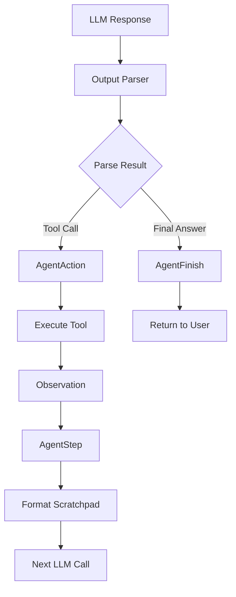
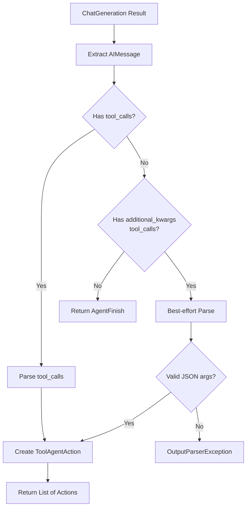
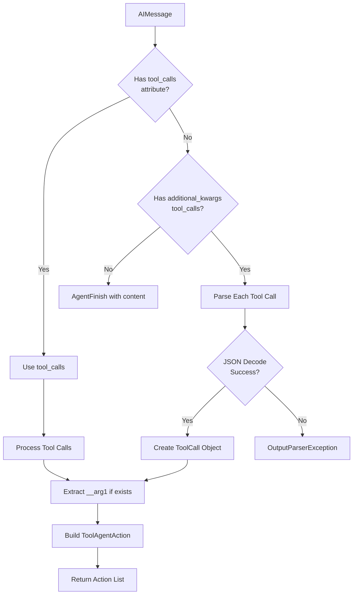
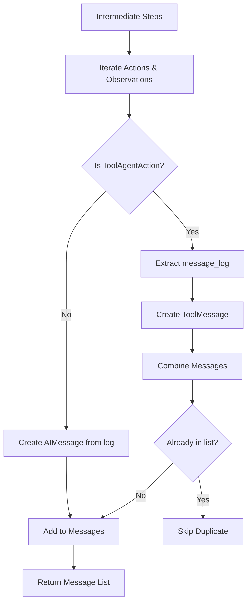
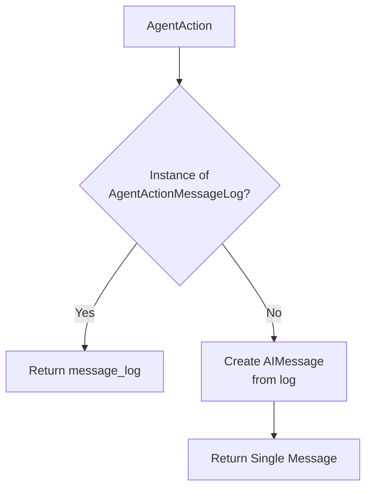
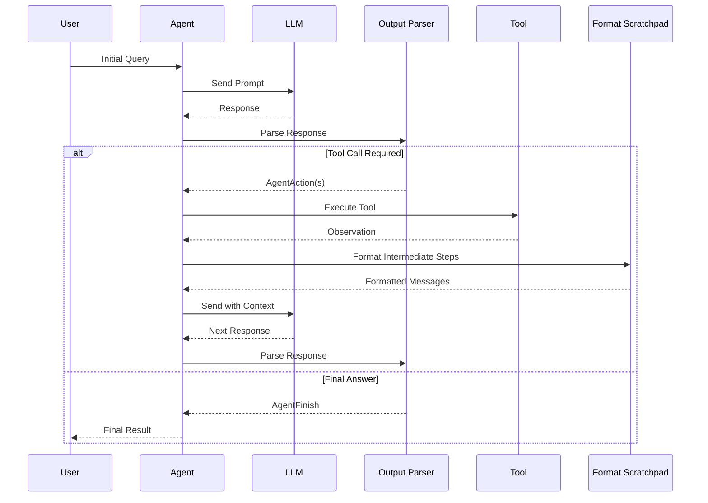

# Agent Output Parsers & Format Scratchpad

## Introduction

Agent Output Parsers and Format Scratchpad are critical components in LangChain's agent system that handle the bidirectional transformation of data between Language Models (LLMs) and agent execution logic. Output parsers convert LLM responses into structured `AgentAction` or `AgentFinish` objects, determining whether the agent should execute a tool or return a final result. Conversely, the format scratchpad functionality transforms intermediate execution steps (agent actions and their observations) back into formats suitable for the LLM's next iteration, maintaining conversation context and execution history.

These components enable different prompting strategies and agent architectures by providing flexible parsing and formatting mechanisms for various LLM response formats including JSON, XML, ReAct patterns, and function/tool calling conventions from providers like OpenAI.

Sources: [output_parsers/__init__.py:1-12](../../../libs/langchain/langchain_classic/agents/output_parsers/__init__.py#L1-L12), [format_scratchpad/__init__.py:1-9](../../../libs/langchain/langchain_classic/agents/format_scratchpad/__init__.py#L1-L9)

## Core Agent Schema

The foundation of the agent system consists of three primary schema objects that represent different states in the agent execution lifecycle:

| Schema Class | Purpose | Key Attributes |
|--------------|---------|----------------|
| `AgentAction` | Represents a tool execution request | `tool` (str), `tool_input` (str\|dict), `log` (str) |
| `AgentActionMessageLog` | Extended action with chat message history | Inherits from `AgentAction`, adds `message_log` (Sequence[BaseMessage]) |
| `AgentFinish` | Represents final agent output | `return_values` (dict), `log` (str) |
| `AgentStep` | Combines action with its observation result | `action` (AgentAction), `observation` (Any) |

The `AgentAction` class represents a request to execute a tool, containing the tool name, input parameters, and a log of the agent's reasoning. The `log` attribute serves dual purposes: auditing the LLM's prediction process and providing context for future iterations when the tool/tool_input alone doesn't capture the complete reasoning chain.

Sources: [agents.py:48-89](../../../libs/core/langchain_core/agents.py#L48-L89), [agents.py:92-119](../../../libs/core/langchain_core/agents.py#L92-L119), [agents.py:122-131](../../../libs/core/langchain_core/agents.py#L122-L131), [agents.py:134-170](../../../libs/core/langchain_core/agents.py#L134-L170)

### Agent Action Flow



Sources: [agents.py:23-33](../../../libs/core/langchain_core/agents.py#L23-L33)

## Output Parsers

Output parsers transform raw LLM responses into structured agent actions or final results. LangChain provides multiple parser implementations to support different agent architectures and LLM response formats.

### Available Output Parsers

| Parser Class | Use Case | Input Format |
|--------------|----------|--------------|
| `JSONAgentOutputParser` | JSON-structured responses | JSON with action/action_input fields |
| `ReActSingleInputOutputParser` | ReAct pattern with single inputs | Text with Thought/Action/Action Input |
| `ReActJsonSingleInputOutputParser` | ReAct pattern with JSON | JSON variant of ReAct |
| `SelfAskOutputParser` | Self-ask prompting strategy | Follow-up questions pattern |
| `XMLAgentOutputParser` | XML-formatted responses | XML with tool tags |
| `OpenAIFunctionsAgentOutputParser` | OpenAI function calling | Function call format |
| `ToolsAgentOutputParser` | Generic tool calling | Tool calls in message metadata |

Sources: [output_parsers/__init__.py:14-28](../../../libs/langchain/langchain_classic/agents/output_parsers/__init__.py#L14-L28)

### Tools Agent Output Parser

The `ToolsAgentOutputParser` is designed for modern tool-calling LLMs that include structured tool invocation metadata in their responses. It extends `MultiActionAgentOutputParser` to support multiple simultaneous tool calls.



The parser handles two scenarios:
1. **Structured tool calls**: When the message contains properly parsed `tool_calls`, it directly extracts tool names, arguments, and call IDs.
2. **Best-effort parsing**: When tool calls are only in `additional_kwargs`, it attempts JSON parsing of the arguments string.

A special handling exists for the `__arg1` parameter, which unpacks single-argument tools that don't expose a schema and expect a string input. This maintains backward compatibility with older tool definitions.

Sources: [tools.py:1-87](../../../libs/langchain/langchain_classic/agents/output_parsers/tools.py#L1-L87)

#### ToolAgentAction Class

```python
class ToolAgentAction(AgentActionMessageLog):
    """Tool agent action."""

    tool_call_id: str | None
    """Tool call that this message is responding to."""
```

The `ToolAgentAction` extends `AgentActionMessageLog` with a `tool_call_id` field, enabling proper correlation between tool invocations and their responses in conversational contexts.

Sources: [tools.py:17-21](../../../libs/langchain/langchain_classic/agents/output_parsers/tools.py#L17-L21)

### Parsing AI Messages to Tool Actions

The `parse_ai_message_to_tool_action` function implements the core parsing logic:



For each tool call, the function:
1. Extracts the function name and arguments
2. Handles the special `__arg1` parameter for single-argument tools
3. Constructs a log message showing the invocation details
4. Creates a `ToolAgentAction` with the tool call ID for response correlation

Sources: [tools.py:24-71](../../../libs/langchain/langchain_classic/agents/output_parsers/tools.py#L24-L71)

### OpenAI Tools Output Parser

The `OpenAIToolsAgentOutputParser` is a specialized variant that delegates to the generic tools parser but wraps results in `OpenAIToolAgentAction` objects. This maintains compatibility with OpenAI-specific agent implementations while leveraging the shared parsing logic.

```python
class OpenAIToolsAgentOutputParser(MultiActionAgentOutputParser):
    """Parses a message into agent actions/finish.

    Is meant to be used with OpenAI models, as it relies on the specific
    tool_calls parameter from OpenAI to convey what tools to use.
    """
```

Sources: [openai_tools.py:1-54](../../../libs/langchain/langchain_classic/agents/output_parsers/openai_tools.py#L1-L54)

## Format Scratchpad

Format scratchpad functions convert intermediate agent steps (action-observation pairs) into formats suitable for the next LLM iteration. This maintains execution context and allows the LLM to reason about previous actions when deciding the next step.

### Available Formatters

| Formatter Function | Output Format | Use Case |
|-------------------|---------------|----------|
| `format_log_to_str` | Plain string | Simple text-based agents |
| `format_log_to_messages` | Message list | Chat-based agents |
| `format_to_openai_functions` | OpenAI function format | OpenAI function calling (legacy) |
| `format_to_openai_function_messages` | OpenAI function messages | OpenAI function calling with messages |
| `format_to_tool_messages` | Tool messages | Generic tool calling agents |
| `format_xml` | XML format | XML-based agents |

Sources: [format_scratchpad/__init__.py:11-23](../../../libs/langchain/langchain_classic/agents/format_scratchpad/__init__.py#L11-L23)

### Format to Tool Messages

The `format_to_tool_messages` function converts intermediate steps into a message sequence suitable for tool-calling LLMs. It handles both `ToolAgentAction` objects (with message logs) and generic `AgentAction` objects.



The function performs deduplication to ensure each message appears only once in the output, which is important when multiple tool calls reference the same AI message.

Sources: [tools.py:46-75](../../../libs/langchain/langchain_classic/agents/format_scratchpad/tools.py#L46-L75)

#### Creating Tool Messages

The `_create_tool_message` helper function converts agent actions and observations into `ToolMessage` objects:

```python
def _create_tool_message(
    agent_action: ToolAgentAction,
    observation: Any,
) -> ToolMessage:
    """Convert agent action and observation into a tool message."""
```

The function handles non-string observations through a fallback chain:
1. Attempts JSON serialization with `ensure_ascii=False` for proper Unicode handling
2. Falls back to `str()` conversion if JSON serialization fails
3. Logs unexpected errors but continues with string conversion
4. Associates the message with the original tool call via `tool_call_id`

Sources: [tools.py:16-43](../../../libs/langchain/langchain_classic/agents/format_scratchpad/tools.py#L16-L43)

## Message Conversion Utilities

The core agents module provides utility functions for converting agent actions and observations into message sequences, supporting the reconstruction of conversation history from the agent's perspective.

### Agent Action to Messages



The `_convert_agent_action_to_messages` function returns the stored message log for `AgentActionMessageLog` instances or creates a new `AIMessage` from the log string for basic `AgentAction` objects.

Sources: [agents.py:174-191](../../../libs/core/langchain_core/agents.py#L174-L191)

### Agent Observation to Messages

The `_convert_agent_observation_to_messages` function transforms observations into appropriate message types based on the action type:

- For `AgentActionMessageLog`: Creates a `FunctionMessage` with the observation content
- For basic `AgentAction`: Creates a `HumanMessage` with the observation content

Non-string observations are converted using JSON serialization when possible, falling back to string conversion.

Sources: [agents.py:194-217](../../../libs/core/langchain_core/agents.py#L194-L217)

### Function Message Creation

```python
def _create_function_message(
    agent_action: AgentAction, observation: Any
) -> FunctionMessage:
    """Convert agent action and observation into a function message."""
```

This utility creates `FunctionMessage` objects that represent tool execution results in the OpenAI function calling format. The message includes:
- `name`: The tool name from the agent action
- `content`: The observation, serialized to JSON or converted to string

Sources: [agents.py:220-238](../../../libs/core/langchain_core/agents.py#L220-L238)

## Agent Execution Sequence

The following sequence diagram illustrates how output parsers and format scratchpad work together in a complete agent execution cycle:



Sources: [agents.py:23-33](../../../libs/core/langchain_core/agents.py#L23-L33)

## Error Handling

Output parsers implement robust error handling for malformed LLM responses:

### JSON Parsing Errors

When parsing tool call arguments fails, the parser raises an `OutputParserException` with a descriptive message:

```python
except JSONDecodeError as e:
    msg = (
        f"Could not parse tool input: {function} because "
        f"the `arguments` is not valid JSON."
    )
    raise OutputParserException(msg) from e
```

Sources: [tools.py:54-60](../../../libs/langchain/langchain_classic/agents/output_parsers/tools.py#L54-L60)

### Type Validation

Parsers validate input types and raise appropriate errors:

```python
if not isinstance(result[0], ChatGeneration):
    msg = "This output parser only works on ChatGeneration output"
    raise ValueError(msg)
```

Sources: [tools.py:77-82](../../../libs/langchain/langchain_classic/agents/output_parsers/tools.py#L77-L82)

### Observation Conversion Errors

The format scratchpad handles observation conversion failures gracefully with logging and fallback mechanisms:

```python
except Exception:
    _logger.exception("Unexpected error converting observation to string.")
    content = str(observation)
```

Sources: [tools.py:35-37](../../../libs/langchain/langchain_classic/agents/format_scratchpad/tools.py#L35-L37)

## Summary

Agent Output Parsers and Format Scratchpad components form the critical interface layer between LLMs and agent execution logic in LangChain. Output parsers provide flexible mechanisms to interpret various LLM response formats (JSON, XML, tool calls) into structured `AgentAction` or `AgentFinish` objects. Format scratchpad functions perform the inverse transformation, converting execution history into contextual prompts for subsequent LLM iterations.

The system supports multiple agent architectures through specialized parsers (ReAct, OpenAI Functions, generic tools) while maintaining a consistent internal representation. The `ToolAgentAction` class and associated parsers enable modern tool-calling patterns with proper message correlation via `tool_call_id` attributes. Robust error handling and fallback mechanisms ensure graceful degradation when dealing with malformed or unexpected LLM responses.

Together, these components enable the iterative reasoning loop that powers LangChain agents: parse LLM output → execute tools → format results → continue reasoning until reaching a final answer.

Sources: [output_parsers/__init__.py](../../../libs/langchain/langchain_classic/agents/output_parsers/__init__.py), [format_scratchpad/__init__.py](../../../libs/langchain/langchain_classic/agents/format_scratchpad/__init__.py), [tools.py](../../../libs/langchain/langchain_classic/agents/output_parsers/tools.py), [agents.py](../../../libs/core/langchain_core/agents.py), [format_scratchpad/tools.py](../../../libs/langchain/langchain_classic/agents/format_scratchpad/tools.py)