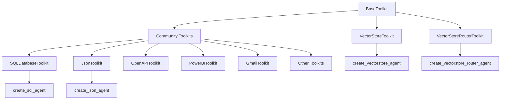
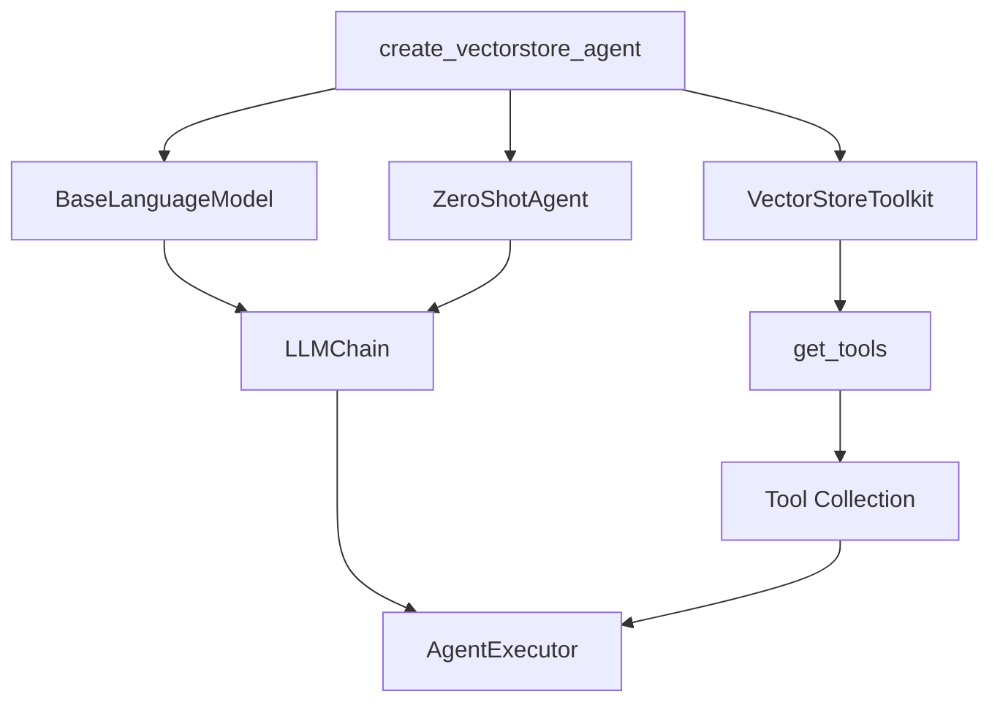
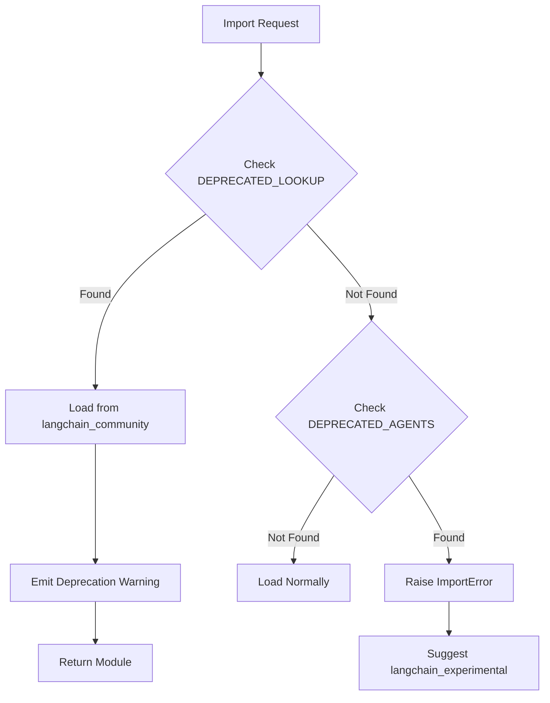

# Agent Toolkits

## Introduction

Agent Toolkits in LangChain provide integrations with various external resources and services, enabling developers to create versatile applications that combine the power of Large Language Models (LLMs) with the ability to access, interact with, and manipulate external resources. These toolkits serve as composable bundles of tools that agents can use to perform specialized tasks such as querying databases, interacting with APIs, managing files, and accessing various third-party services. The toolkit architecture allows for modular integration of capabilities, where each toolkit encapsulates a specific set of tools designed for a particular domain or service.

When developing applications with agent toolkits, developers should carefully inspect the capabilities and permissions of the underlying tools to ensure they are appropriate for their use case. The LangChain ecosystem includes a large collection of toolkits for both local resources (file systems, databases) and remote services (APIs, cloud platforms), providing flexibility in building agent-based applications.

Sources: [__init__.py:1-9](../../../libs/langchain/langchain_classic/agents/agent_toolkits/__init__.py#L1-L9)

## Architecture Overview

The agent toolkits module follows a hierarchical organization with a base toolkit class and specialized implementations for different integrations. The architecture separates core functionality in `langchain_classic` from community-contributed integrations in `langchain_community`.



The base toolkit class `BaseToolkit` is defined in `langchain_core.tools` and serves as the foundation for all toolkit implementations. Each toolkit provides a `get_tools()` method that returns a collection of tools specific to its domain.

Sources: [base.py:1-4](../../../libs/langchain/langchain_classic/agents/agent_toolkits/base.py#L1-L4), [__init__.py:22-24](../../../libs/langchain/langchain_classic/agents/agent_toolkits/__init__.py#L22-L24)

## Core Components

### BaseToolkit

The `BaseToolkit` class serves as the abstract base class for all agent toolkits. It is imported from `langchain_core.tools` and provides the interface that all toolkit implementations must follow.

```python
from langchain_core.tools import BaseToolkit
```

This base class ensures consistency across all toolkit implementations and defines the contract for creating new toolkits.

Sources: [base.py:1-4](../../../libs/langchain/langchain_classic/agents/agent_toolkits/base.py#L1-L4)

### VectorStore Toolkits

The framework provides specialized toolkits for working with vector stores, including single and multi-store routing capabilities.

| Component | Description | Purpose |
|-----------|-------------|---------|
| `VectorStoreToolkit` | Single vector store toolkit | Provides tools for querying a single vector store |
| `VectorStoreRouterToolkit` | Multi-store routing toolkit | Routes queries to appropriate vector stores from multiple options |
| `VectorStoreInfo` | Vector store metadata | Contains information about vector store configuration |

Sources: [__init__.py:26-31](../../../libs/langchain/langchain_classic/agents/agent_toolkits/__init__.py#L26-L31)

## Available Toolkits

LangChain provides a comprehensive collection of pre-built toolkits for various integrations. Most toolkits are now located in the `langchain_community` package, with the core framework providing import paths and deprecation handling.

### Database and Query Toolkits

| Toolkit | Module Path | Purpose |
|---------|-------------|---------|
| `SQLDatabaseToolkit` | `langchain_community.agent_toolkits.sql.toolkit` | SQL database operations and queries |
| `SparkSQLToolkit` | `langchain_community.agent_toolkits.spark_sql.toolkit` | Apache Spark SQL operations |
| `PowerBIToolkit` | `langchain_community.agent_toolkits.powerbi.toolkit` | Microsoft Power BI integration |

Sources: [__init__.py:49-51](../../../libs/langchain/langchain_classic/agents/agent_toolkits/__init__.py#L49-L51), [__init__.py:94-96](../../../libs/langchain/langchain_classic/agents/agent_toolkits/__init__.py#L94-L96)

### API and Service Integration Toolkits

| Toolkit | Module Path | Purpose |
|---------|-------------|---------|
| `OpenAPIToolkit` | `langchain_community.agent_toolkits.openapi.toolkit` | OpenAPI specification-based API interactions |
| `JsonToolkit` | `langchain_community.agent_toolkits.json.toolkit` | JSON data manipulation and querying |
| `NLAToolkit` | `langchain_community.agent_toolkits.nla.toolkit` | Natural Language API interactions |
| `ZapierToolkit` | `langchain_community.agent_toolkits.zapier.toolkit` | Zapier automation platform integration |

Sources: [__init__.py:44-46](../../../libs/langchain/langchain_classic/agents/agent_toolkits/__init__.py#L44-L46), [__init__.py:90-93](../../../libs/langchain/langchain_classic/agents/agent_toolkits/__init__.py#L90-L93)

### Communication and Collaboration Toolkits

| Toolkit | Module Path | Purpose |
|---------|-------------|---------|
| `GmailToolkit` | `langchain_community.agent_toolkits.gmail.toolkit` | Gmail email operations |
| `SlackToolkit` | `langchain_community.agent_toolkits.slack.toolkit` | Slack messaging platform integration |
| `O365Toolkit` | `langchain_community.agent_toolkits.office365.toolkit` | Microsoft Office 365 services |
| `JiraToolkit` | `langchain_community.agent_toolkits.jira.toolkit` | Atlassian Jira project management |

Sources: [__init__.py:37-40](../../../libs/langchain/langchain_classic/agents/agent_toolkits/__init__.py#L37-L40), [__init__.py:87-89](../../../libs/langchain/langchain_classic/agents/agent_toolkits/__init__.py#L87-L89)

### Specialized Service Toolkits

| Toolkit | Module Path | Purpose |
|---------|-------------|---------|
| `AzureCognitiveServicesToolkit` | `langchain_community.agent_toolkits.azure_cognitive_services` | Azure AI services integration |
| `FileManagementToolkit` | `langchain_community.agent_toolkits.file_management.toolkit` | File system operations |
| `PlayWrightBrowserToolkit` | `langchain_community.agent_toolkits.playwright.toolkit` | Browser automation with Playwright |
| `MultionToolkit` | `langchain_community.agent_toolkits.multion.toolkit` | Multion browser automation |
| `NasaToolkit` | `langchain_community.agent_toolkits.nasa.toolkit` | NASA API data access |
| `SteamToolkit` | `langchain_community.agent_toolkits.steam.toolkit` | Steam gaming platform integration |
| `AmadeusToolkit` | `langchain_community.agent_toolkits.amadeus.toolkit` | Amadeus travel services |
| `AINetworkToolkit` | `langchain_community.agent_toolkits.ainetwork.toolkit` | AI Network blockchain integration |

Sources: [__init__.py:33-36](../../../libs/langchain/langchain_classic/agents/agent_toolkits/__init__.py#L33-L36), [__init__.py:41-43](../../../libs/langchain/langchain_classic/agents/agent_toolkits/__init__.py#L41-L43), [__init__.py:47-48](../../../libs/langchain/langchain_classic/agents/agent_toolkits/__init__.py#L47-L48), [__init__.py:52](../../../libs/langchain/langchain_classic/agents/agent_toolkits/__init__.py#L52)

## Agent Creation Functions

The toolkit module provides factory functions for creating specialized agents that work with specific toolkits. These functions construct complete agent executors configured for particular use cases.

### VectorStore Agent Creation



The `create_vectorstore_agent` function constructs an agent from an LLM and VectorStoreToolkit. It uses a ZeroShotAgent with a custom prompt prefix and returns an AgentExecutor for query execution.

**Function Signature:**
```python
def create_vectorstore_agent(
    llm: BaseLanguageModel,
    toolkit: VectorStoreToolkit,
    callback_manager: BaseCallbackManager | None = None,
    prefix: str = PREFIX,
    verbose: bool = False,
    agent_executor_kwargs: dict[str, Any] | None = None,
    **kwargs: Any,
) -> AgentExecutor
```

**Parameters:**

| Parameter | Type | Description |
|-----------|------|-------------|
| `llm` | `BaseLanguageModel` | LLM that will be used by the agent |
| `toolkit` | `VectorStoreToolkit` | Set of tools for the agent |
| `callback_manager` | `BaseCallbackManager \| None` | Object to handle callbacks |
| `prefix` | `str` | The prefix prompt for the agent |
| `verbose` | `bool` | Whether to show scratchpad content |
| `agent_executor_kwargs` | `dict[str, Any] \| None` | Additional parameters for the agent |

Sources: [base.py:18-71](../../../libs/langchain/langchain_classic/agents/agent_toolkits/vectorstore/base.py#L18-L71)

### VectorStore Router Agent Creation

The `create_vectorstore_router_agent` function creates an agent capable of routing queries to multiple vector stores based on their descriptions and capabilities.

```python
def create_vectorstore_router_agent(
    llm: BaseLanguageModel,
    toolkit: VectorStoreRouterToolkit,
    callback_manager: BaseCallbackManager | None = None,
    prefix: str = ROUTER_PREFIX,
    verbose: bool = False,
    agent_executor_kwargs: dict[str, Any] | None = None,
    **kwargs: Any,
) -> AgentExecutor
```

This function follows a similar pattern to `create_vectorstore_agent` but uses `VectorStoreRouterToolkit` and a specialized `ROUTER_PREFIX` for handling multiple vector stores.

Sources: [base.py:74-127](../../../libs/langchain/langchain_classic/agents/agent_toolkits/vectorstore/base.py#L74-L127)

### Database Agent Creation Functions

The module provides factory functions for creating agents that interact with various database systems:

| Function | Module | Purpose |
|----------|--------|---------|
| `create_sql_agent` | `langchain_community.agent_toolkits.sql.base` | Creates agents for SQL database queries |
| `create_spark_sql_agent` | `langchain_community.agent_toolkits.spark_sql.base` | Creates agents for Spark SQL operations |
| `create_json_agent` | `langchain_community.agent_toolkits.json.base` | Creates agents for JSON data manipulation |
| `create_openapi_agent` | `langchain_community.agent_toolkits.openapi.base` | Creates agents for OpenAPI interactions |
| `create_pbi_agent` | `langchain_community.agent_toolkits.powerbi.base` | Creates agents for Power BI queries |
| `create_pbi_chat_agent` | `langchain_community.agent_toolkits.powerbi.chat_base` | Creates chat-based Power BI agents |

Sources: [__init__.py:23-31](../../../libs/langchain/langchain_classic/agents/agent_toolkits/__init__.py#L23-L31), [sql/base.py:1-21](../../../libs/langchain/langchain_classic/agents/agent_toolkits/sql/base.py#L1-L21), [json/base.py:1-21](../../../libs/langchain/langchain_classic/agents/agent_toolkits/json/base.py#L1-L21), [openapi/base.py:1-21](../../../libs/langchain/langchain_classic/agents/agent_toolkits/openapi/base.py#L1-L21)

### Conversational Retrieval Agent

The module also includes a specialized agent for conversational retrieval workflows:

```python
from langchain_classic.agents.agent_toolkits.conversational_retrieval.openai_functions import (
    create_conversational_retrieval_agent,
)
```

This function creates agents optimized for conversational retrieval tasks using OpenAI function calling capabilities.

Sources: [__init__.py:22-24](../../../libs/langchain/langchain_classic/agents/agent_toolkits/__init__.py#L22-L24)

## Import System and Deprecation Handling

The agent toolkits module implements a sophisticated dynamic import system to handle deprecated imports and maintain backward compatibility while migrating functionality to the `langchain_community` package.



### Deprecated Agent Lookup

The module maintains a dictionary mapping deprecated toolkit names to their new locations in `langchain_community`:

```python
DEPRECATED_LOOKUP = {
    "AINetworkToolkit": "langchain_community.agent_toolkits.ainetwork.toolkit",
    "AmadeusToolkit": "langchain_community.agent_toolkits.amadeus.toolkit",
    "AzureCognitiveServicesToolkit": (
        "langchain_community.agent_toolkits.azure_cognitive_services"
    ),
    # ... additional mappings
}
```

The `_import_attribute` function uses this lookup to dynamically import from the correct location and emit appropriate deprecation warnings.

Sources: [__init__.py:62-98](../../../libs/langchain/langchain_classic/agents/agent_toolkits/__init__.py#L62-L98), [__init__.py:100](../../../libs/langchain/langchain_classic/agents/agent_toolkits/__init__.py#L100)

### Moved to Experimental

Certain agents have been moved to the `langchain_experimental` package and will raise an `ImportError` when accessed:

```python
DEPRECATED_AGENTS = [
    "create_csv_agent",
    "create_pandas_dataframe_agent",
    "create_xorbits_agent",
    "create_python_agent",
    "create_spark_dataframe_agent",
]
```

When these agents are imported, the system raises an error with guidance on updating import statements:

```python
def __getattr__(name: str) -> Any:
    """Get attr name."""
    if name in DEPRECATED_AGENTS:
        relative_path = as_import_path(Path(__file__).parent, suffix=name)
        old_path = "langchain_classic." + relative_path
        new_path = "langchain_experimental." + relative_path
        msg = (
            f"{name} has been moved to langchain_experimental. "
            "See https://github.com/langchain-ai/langchain/discussions/11680"
            "for more information.\n"
            f"Please update your import statement from: `{old_path}` to `{new_path}`."
        )
        raise ImportError(msg)
    return _import_attribute(name)
```

Sources: [__init__.py:54-60](../../../libs/langchain/langchain_classic/agents/agent_toolkits/__init__.py#L54-L60), [__init__.py:103-118](../../../libs/langchain/langchain_classic/agents/agent_toolkits/__init__.py#L103-L118)

## Deprecation and Migration to LangGraph

The VectorStore agent creation functions are deprecated as of version 0.2.13 and will be removed in version 1.0. The framework recommends migrating to LangGraph for new use cases.

### Migration Path for VectorStore Agents

The deprecated `create_vectorstore_agent` function should be replaced with LangGraph's `create_react_agent`:

```python
from langchain_core.tools import create_retriever_tool
from langchain_core.vectorstores import InMemoryVectorStore
from langchain_openai import ChatOpenAI, OpenAIEmbeddings
from langgraph.prebuilt import create_react_agent

model = ChatOpenAI(model="gpt-4o-mini", temperature=0)

vector_store = InMemoryVectorStore.from_texts(
    [
        "Dogs are great companions, known for their loyalty and friendliness.",
        "Cats are independent pets that often enjoy their own space.",
    ],
    OpenAIEmbeddings(),
)

tool = create_retriever_tool(
    vector_store.as_retriever(),
    "pet_information_retriever",
    "Fetches information about pets.",
)

agent = create_react_agent(model, [tool])
```

### Migration Path for Router Agents

Similarly, the `create_vectorstore_router_agent` should be replaced with LangGraph using multiple retriever tools:

```python
tools = [
    create_retriever_tool(
        pet_vector_store.as_retriever(),
        "pet_information_retriever",
        "Fetches information about pets.",
    ),
    create_retriever_tool(
        food_vector_store.as_retriever(),
        "food_information_retriever",
        "Fetches information about food.",
    ),
]

agent = create_react_agent(model, tools)
```

LangGraph provides enhanced capabilities including tool-calling, state persistence, and human-in-the-loop workflows that are not available in the legacy agent framework.

Sources: [base.py:18-71](../../../libs/langchain/langchain_classic/agents/agent_toolkits/vectorstore/base.py#L18-L71), [base.py:74-127](../../../libs/langchain/langchain_classic/agents/agent_toolkits/vectorstore/base.py#L74-L127)

## Security Considerations

The agent toolkits documentation emphasizes the importance of security when working with external integrations:

> "When developing an application, developers should inspect the capabilities and permissions of the tools that underlie the given agent toolkit, and determine whether permissions of the given toolkit are appropriate for the application."

Developers are directed to review the LangChain security policy for comprehensive guidance on secure usage of agent toolkits. This is particularly important when toolkits have access to sensitive resources such as databases, file systems, email accounts, or external APIs.

Sources: [__init__.py:7-11](../../../libs/langchain/langchain_classic/agents/agent_toolkits/__init__.py#L7-L11)

## Summary

Agent Toolkits form a critical component of LangChain's architecture, providing modular and composable integrations with external resources and services. The framework includes over 20 pre-built toolkits covering databases, APIs, communication platforms, cloud services, and specialized integrations. The module implements a sophisticated import system to manage deprecations and migrations, with most toolkit implementations now residing in `langchain_community`. Core functionality includes factory functions for creating specialized agents, with newer implementations being encouraged to migrate to LangGraph for enhanced capabilities. Security considerations are paramount when using agent toolkits, as they often have access to sensitive resources and require careful permission management.