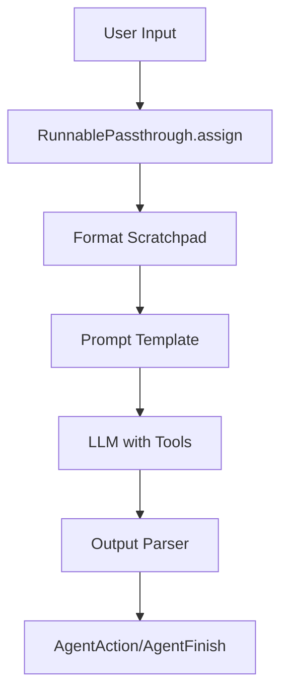
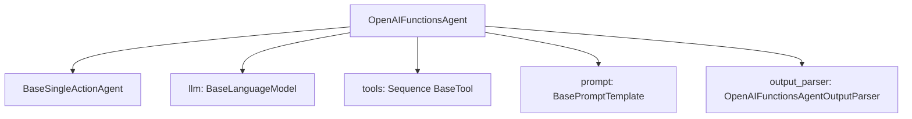
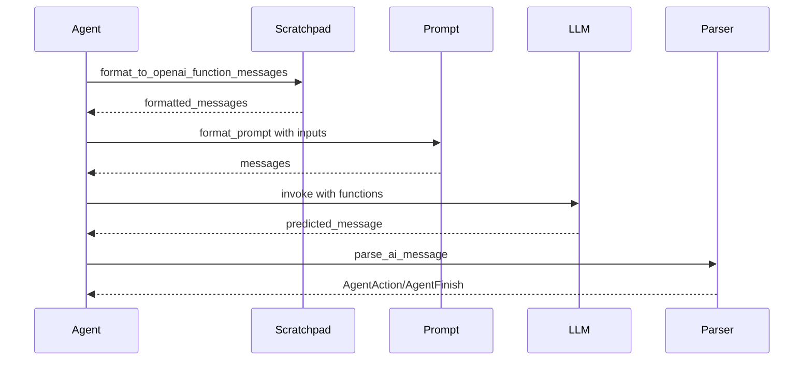
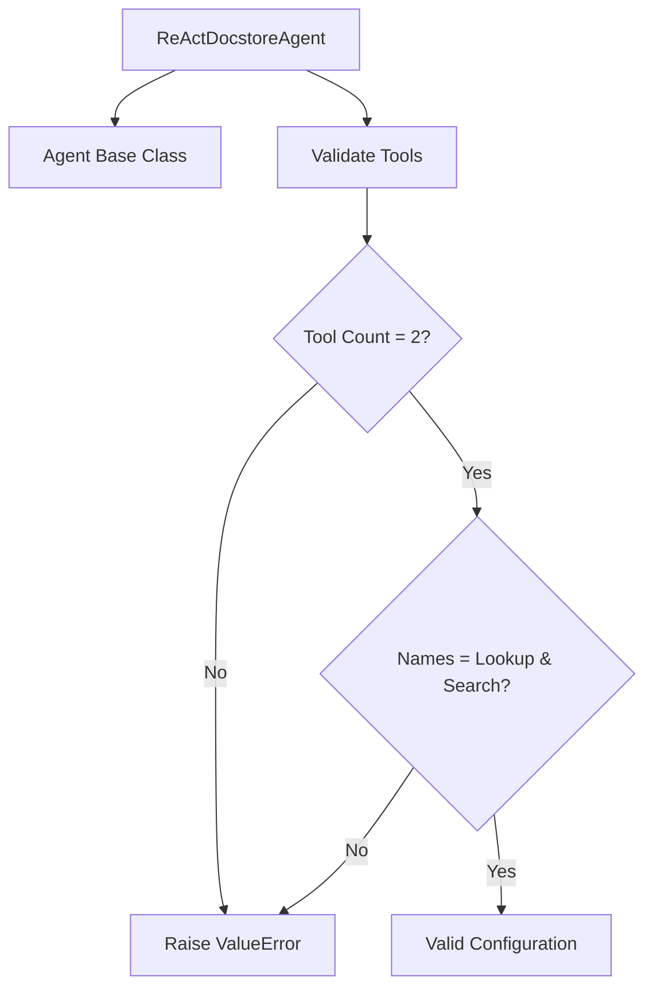
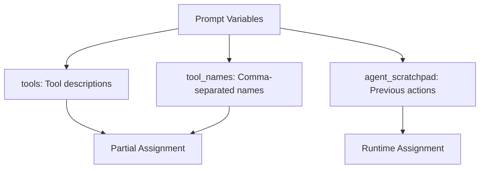
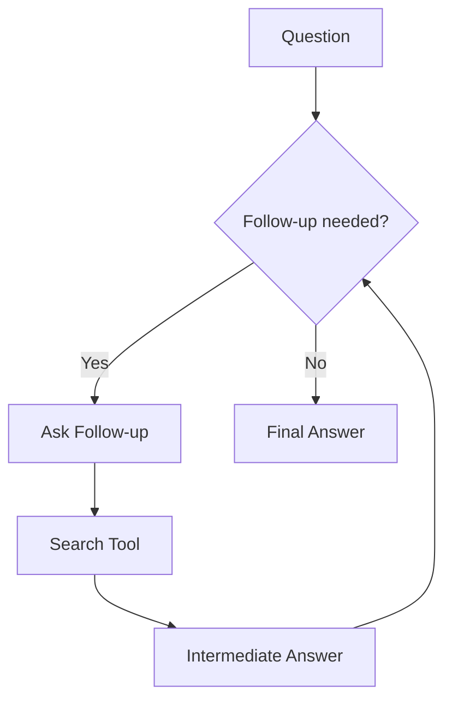
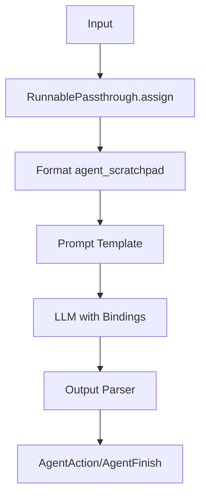
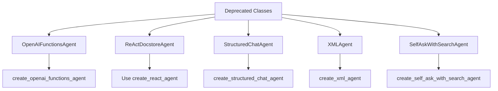

# Agent Types & Specialized Agents

LangChain provides a comprehensive framework for building agents that can interact with language models and execute tools to accomplish complex tasks. The agent system supports multiple specialized agent types, each designed for specific use cases and interaction patterns. These agents leverage different prompting strategies and output parsing mechanisms to enable various workflows, from function calling with OpenAI models to self-asking search patterns and XML-based reasoning.

This page covers the core agent types available in LangChain, including OpenAI Tools Agent, OpenAI Functions Agent, ReAct Agent, Structured Chat Agent, XML Agent, and Self-Ask with Search Agent. Each agent type implements a specific reasoning pattern and tool interaction model, providing developers with flexible options for building LLM-powered applications.

Sources: [openai_tools/base.py:1-108](../../../libs/langchain/langchain_classic/agents/openai_tools/base.py#L1-L108), [openai_functions_agent/base.py:1-251](../../../libs/langchain/langchain_classic/agents/openai_functions_agent/base.py#L1-L251), [react/base.py:1-179](../../../libs/langchain/langchain_classic/agents/react/base.py#L1-L179)

## OpenAI Tools Agent

The OpenAI Tools Agent leverages OpenAI's function calling capabilities through the newer "tools" API format. This agent type converts LangChain tools into OpenAI tool specifications and uses them to guide the model's behavior.

### Architecture

The OpenAI Tools Agent is implemented as a Runnable sequence that processes user input through several stages:



The agent pipeline assigns the `agent_scratchpad` variable by formatting intermediate steps, passes the input through the prompt template, invokes the LLM with bound tools, and finally parses the output to determine the next action.

Sources: [openai_tools/base.py:17-108](../../../libs/langchain/langchain_classic/agents/openai_tools/base.py#L17-L108)

### Key Components

| Component | Description | Purpose |
|-----------|-------------|---------|
| `format_to_openai_tool_messages` | Formats intermediate steps into message format | Maintains conversation history with tool calls |
| `convert_to_openai_tool` | Converts BaseTool to OpenAI tool schema | Enables tool binding to LLM |
| `OpenAIToolsAgentOutputParser` | Parses LLM output into agent actions | Determines next step or completion |
| `strict` parameter | Controls strict mode for OpenAI tools | Enforces schema validation |

Sources: [openai_tools/base.py:8-14](../../../libs/langchain/langchain_classic/agents/openai_tools/base.py#L8-L14)

### Creation and Usage

The `create_openai_tools_agent` function creates an agent with the following signature:

```python
def create_openai_tools_agent(
    llm: BaseLanguageModel,
    tools: Sequence[BaseTool],
    prompt: ChatPromptTemplate,
    strict: bool | None = None,
) -> Runnable:
```

The prompt must include an `agent_scratchpad` variable as a `MessagesPlaceholder` to store intermediate agent actions and tool outputs. The function validates this requirement and raises a `ValueError` if the variable is missing.

Sources: [openai_tools/base.py:17-47](../../../libs/langchain/langchain_classic/agents/openai_tools/base.py#L17-L47)

### Prompt Requirements

The agent requires specific prompt structure:

```python
from langchain_core.prompts import ChatPromptTemplate, MessagesPlaceholder

prompt = ChatPromptTemplate.from_messages(
    [
        ("system", "You are a helpful assistant"),
        MessagesPlaceholder("chat_history", optional=True),
        ("human", "{input}"),
        MessagesPlaceholder("agent_scratchpad"),
    ]
)
```

This structure ensures proper integration of chat history and intermediate reasoning steps.

Sources: [openai_tools/base.py:79-94](../../../libs/langchain/langchain_classic/agents/openai_tools/base.py#L79-L94)

## OpenAI Functions Agent

The OpenAI Functions Agent is the predecessor to the OpenAI Tools Agent and uses OpenAI's function calling API. This agent type is now deprecated in favor of the Tools Agent but remains available for backward compatibility.

### Class Structure



The agent maintains references to the LLM, tools, prompt template, and output parser, providing a cohesive interface for function-based interactions.

Sources: [openai_functions_agent/base.py:44-76](../../../libs/langchain/langchain_classic/agents/openai_functions_agent/base.py#L44-L76)

### Planning Mechanism

The agent implements both synchronous and asynchronous planning methods:



The planning process formats intermediate steps, constructs the prompt, invokes the LLM with function specifications, and parses the response.

Sources: [openai_functions_agent/base.py:94-139](../../../libs/langchain/langchain_classic/agents/openai_functions_agent/base.py#L94-L139)

### Early Stopping Behavior

The agent supports two early stopping methods when iteration limits are reached:

| Method | Behavior | Return Value |
|--------|----------|--------------|
| `force` | Returns constant string | "Agent stopped due to iteration limit or time limit." |
| `generate` | Performs final forward pass without functions | AgentFinish from final generation |

Sources: [openai_functions_agent/base.py:159-189](../../../libs/langchain/langchain_classic/agents/openai_functions_agent/base.py#L159-L189)

### Modern Creation Function

The `create_openai_functions_agent` function provides a Runnable-based alternative to the deprecated class:

```python
def create_openai_functions_agent(
    llm: BaseLanguageModel,
    tools: Sequence[BaseTool],
    prompt: ChatPromptTemplate,
) -> Runnable:
```

This function follows the same pattern as the Tools Agent, creating a pipeline that formats scratchpad, applies prompt, invokes LLM with functions, and parses output.

Sources: [openai_functions_agent/base.py:230-251](../../../libs/langchain/langchain_classic/agents/openai_functions_agent/base.py#L230-L251)

## ReAct Agent

The ReAct (Reasoning and Acting) Agent implements the pattern described in the ReAct paper, combining reasoning traces with action execution. This agent is specifically designed to work with docstore environments.

### ReAct Docstore Agent

The `ReActDocstoreAgent` requires exactly two tools named "Lookup" and "Search" to interact with a document store:



The agent enforces strict tool requirements to ensure proper docstore interaction capabilities.

Sources: [react/base.py:38-69](../../../libs/langchain/langchain_classic/agents/react/base.py#L38-L69)

### Docstore Explorer

The `DocstoreExplorer` class provides search and lookup capabilities:

```python
class DocstoreExplorer:
    def __init__(self, docstore: Docstore):
        self.docstore = docstore
        self.document: Document | None = None
        self.lookup_str = ""
        self.lookup_index = 0
```

The explorer maintains state about the current document and lookup position, enabling iterative exploration of document content.

Sources: [react/base.py:81-119](../../../libs/langchain/langchain_classic/agents/react/base.py#L81-L119)

### Search and Lookup Operations

The explorer implements two key operations:

| Operation | Purpose | Return Behavior |
|-----------|---------|-----------------|
| `search(term)` | Find and load document | Returns summary or error message |
| `lookup(term)` | Find term in current document | Returns matching paragraphs with position tracking |

The lookup operation maintains an index to support repeated lookups of the same term, returning subsequent occurrences with each call.

Sources: [react/base.py:96-119](../../../libs/langchain/langchain_classic/agents/react/base.py#L96-L119)

### TextWorld Variant

The `ReActTextWorldAgent` extends the base ReAct agent for text-based game environments:

```python
class ReActTextWorldAgent(ReActDocstoreAgent):
    @classmethod
    def create_prompt(cls, tools: Sequence[BaseTool]) -> BasePromptTemplate:
        return TEXTWORLD_PROMPT
```

This variant requires exactly one tool named "Play" for game interaction.

Sources: [react/base.py:131-152](../../../libs/langchain/langchain_classic/agents/react/base.py#L131-L152)

## Structured Chat Agent

The Structured Chat Agent is designed to support tools with multiple input parameters, using JSON formatting to specify tool invocations with complex arguments.

### Output Format

The agent uses a structured JSON format for tool calls:

```json
{
    "action": "$TOOL_NAME",
    "action_input": $INPUT
}
```

This format allows for structured arguments to be passed to tools, supporting more complex tool interfaces than simple string inputs.

Sources: [structured_chat/base.py:1-235](../../../libs/langchain/langchain_classic/agents/structured_chat/base.py#L1-L235)

### Scratchpad Construction

The agent implements custom scratchpad formatting:

```python
def _construct_scratchpad(
    self,
    intermediate_steps: list[tuple[AgentAction, str]],
) -> str:
    agent_scratchpad = super()._construct_scratchpad(intermediate_steps)
    if agent_scratchpad:
        return (
            f"This was your previous work "
            f"(but I haven't seen any of it! I only see what "
            f"you return as final answer):\n{agent_scratchpad}"
        )
    return agent_scratchpad
```

This formatting provides context to the model about previous actions while emphasizing the importance of the final answer.

Sources: [structured_chat/base.py:48-60](../../../libs/langchain/langchain_classic/agents/structured_chat/base.py#L48-L60)

### Creation Function Parameters

The `create_structured_chat_agent` function accepts several key parameters:

| Parameter | Type | Purpose |
|-----------|------|---------|
| `llm` | BaseLanguageModel | The language model to use |
| `tools` | Sequence[BaseTool] | Available tools |
| `prompt` | ChatPromptTemplate | Prompt template with required variables |
| `tools_renderer` | ToolsRenderer | Controls tool string conversion |
| `stop_sequence` | bool \| list[str] | Stop tokens to prevent hallucination |

The `stop_sequence` parameter can be `True` (adds "Observation:"), `False` (no stop tokens), or a custom list of stop strings.

Sources: [structured_chat/base.py:154-235](../../../libs/langchain/langchain_classic/agents/structured_chat/base.py#L154-L235)

### Prompt Requirements

The structured chat prompt must include three specific variables:



The `tools` and `tool_names` are partially assigned during agent creation, while `agent_scratchpad` is assigned at runtime.

Sources: [structured_chat/base.py:198-207](../../../libs/langchain/langchain_classic/agents/structured_chat/base.py#L198-L207)

## XML Agent

The XML Agent uses XML tags to structure its reasoning and tool calls, making it particularly suitable for models that work well with structured markup formats.

### XML Format Structure

The agent uses specific XML tags for tool invocation:

```xml
<tool>tool_name</tool>
<tool_input>input_data</tool_input>
<observation>result</observation>
<final_answer>answer_text</final_answer>
```

This structured format provides clear delimiters for parsing agent actions and observations.

Sources: [xml/base.py:1-177](../../../libs/langchain/langchain_classic/agents/xml/base.py#L1-L177)

### Planning Implementation

The XML agent constructs logs using XML formatting:

```python
def plan(
    self,
    intermediate_steps: list[tuple[AgentAction, str]],
    callbacks: Callbacks = None,
    **kwargs: Any,
) -> AgentAction | AgentFinish:
    log = ""
    for action, observation in intermediate_steps:
        log += (
            f"<tool>{action.tool}</tool><tool_input>{action.tool_input}"
            f"</tool_input><observation>{observation}</observation>"
        )
```

The formatted log provides the model with structured context about previous actions and their results.

Sources: [xml/base.py:62-87](../../../libs/langchain/langchain_classic/agents/xml/base.py#L62-L87)

### Creation and Configuration

The `create_xml_agent` function supports configurable stop sequences:

```python
def create_xml_agent(
    llm: BaseLanguageModel,
    tools: Sequence[BaseTool],
    prompt: BasePromptTemplate,
    tools_renderer: ToolsRenderer = render_text_description,
    *,
    stop_sequence: bool | list[str] = True,
) -> Runnable:
```

When `stop_sequence` is `True`, the agent adds `"</tool_input>"` as a stop token to prevent the model from hallucinating beyond tool input specification.

Sources: [xml/base.py:103-177](../../../libs/langchain/langchain_classic/agents/xml/base.py#L103-L177)

## Self-Ask with Search Agent

The Self-Ask with Search Agent implements a prompting strategy where the agent asks itself follow-up questions and uses a search tool to find intermediate answers.

### Agent Pattern



The agent iteratively breaks down complex questions into simpler sub-questions that can be answered through search.

Sources: [self_ask_with_search/base.py:1-179](../../../libs/langchain/langchain_classic/agents/self_ask_with_search/base.py#L1-L179)

### Tool Requirements

The Self-Ask agent requires exactly one tool named "Intermediate Answer":

```python
@classmethod
def _validate_tools(cls, tools: Sequence[BaseTool]) -> None:
    validate_tools_single_input(cls.__name__, tools)
    super()._validate_tools(tools)
    if len(tools) != 1:
        msg = f"Exactly one tool must be specified, but got {tools}"
        raise ValueError(msg)
    tool_names = {tool.name for tool in tools}
    if tool_names != {"Intermediate Answer"}:
        msg = f"Tool name should be Intermediate Answer, got {tool_names}"
        raise ValueError(msg)
```

This strict validation ensures the agent can properly identify and use the search capability.

Sources: [self_ask_with_search/base.py:41-52](../../../libs/langchain/langchain_classic/agents/self_ask_with_search/base.py#L41-L52)

### Creation Function

The `create_self_ask_with_search_agent` function creates a Runnable pipeline:

```python
def create_self_ask_with_search_agent(
    llm: BaseLanguageModel,
    tools: Sequence[BaseTool],
    prompt: BasePromptTemplate,
) -> Runnable:
```

The function binds a stop sequence `"\nIntermediate answer:"` to the LLM to prevent generation beyond the expected format, and formats the scratchpad with custom observation prefix.

Sources: [self_ask_with_search/base.py:83-179](../../../libs/langchain/langchain_classic/agents/self_ask_with_search/base.py#L83-L179)

### Scratchpad Formatting

The agent uses custom formatting for observations:

```python
RunnablePassthrough.assign(
    agent_scratchpad=lambda x: format_log_to_str(
        x["intermediate_steps"],
        observation_prefix="\nIntermediate answer: ",
        llm_prefix="",
    ),
    chat_history=lambda x: x.get("chat_history", ""),
)
```

This formatting ensures proper structure for the self-ask pattern with clear intermediate answer markers.

Sources: [self_ask_with_search/base.py:169-177](../../../libs/langchain/langchain_classic/agents/self_ask_with_search/base.py#L169-L177)

## Common Patterns Across Agent Types

### Runnable Architecture

All modern agent creation functions return a `Runnable` sequence following this pattern:



This consistent architecture enables composition with other LangChain components and standardizes the agent execution flow.

Sources: [openai_tools/base.py:96-108](../../../libs/langchain/langchain_classic/agents/openai_tools/base.py#L96-L108), [openai_functions_agent/base.py:246-251](../../../libs/langchain/langchain_classic/agents/openai_functions_agent/base.py#L246-L251), [structured_chat/base.py:227-235](../../../libs/langchain/langchain_classic/agents/structured_chat/base.py#L227-L235)

### Prompt Variable Requirements

Each agent type requires specific prompt variables:

| Agent Type | Required Variables | Optional Variables |
|------------|-------------------|-------------------|
| OpenAI Tools | `agent_scratchpad` | `chat_history`, `input` |
| OpenAI Functions | `agent_scratchpad` | `chat_history`, `input` |
| Structured Chat | `tools`, `tool_names`, `agent_scratchpad` | `chat_history`, `input` |
| XML | `tools`, `agent_scratchpad` | `chat_history` |
| Self-Ask | `agent_scratchpad` | `input` |

All agents validate the presence of required variables and raise `ValueError` if they are missing.

Sources: [openai_tools/base.py:95-99](../../../libs/langchain/langchain_classic/agents/openai_tools/base.py#L95-L99), [openai_functions_agent/base.py:237-242](../../../libs/langchain/langchain_classic/agents/openai_functions_agent/base.py#L237-L242), [structured_chat/base.py:198-202](../../../libs/langchain/langchain_classic/agents/structured_chat/base.py#L198-L202)

### Deprecation Status

Several agent classes are deprecated in favor of their functional creation counterparts:



The functional approach using Runnable sequences is now the recommended pattern for all agent types.

Sources: [openai_functions_agent/base.py:44](../../../libs/langchain/langchain_classic/agents/openai_functions_agent/base.py#L44), [react/base.py:38](../../../libs/langchain/langchain_classic/agents/react/base.py#L38), [structured_chat/base.py:36](../../../libs/langchain/langchain_classic/agents/structured_chat/base.py#L36)

## Summary

LangChain's agent framework provides diverse specialized agent types, each optimized for specific use cases and interaction patterns. The OpenAI Tools and Functions agents leverage function calling capabilities for structured tool invocation. The ReAct agent implements reasoning and acting patterns for docstore exploration. The Structured Chat agent supports complex multi-parameter tool inputs through JSON formatting. The XML agent provides markup-based structuring for models that excel with XML formats. Finally, the Self-Ask with Search agent implements iterative question decomposition with search capabilities.

All modern agents follow a consistent Runnable architecture, enabling composition and integration with the broader LangChain ecosystem. The framework's evolution from class-based to functional agent creation reflects a move toward more flexible and composable designs while maintaining backward compatibility through deprecated classes.

Sources: [openai_tools/base.py](../../../libs/langchain/langchain_classic/agents/openai_tools/base.py), [openai_functions_agent/base.py](../../../libs/langchain/langchain_classic/agents/openai_functions_agent/base.py), [react/base.py](../../../libs/langchain/langchain_classic/agents/react/base.py), [structured_chat/base.py](../../../libs/langchain/langchain_classic/agents/structured_chat/base.py), [xml/base.py](../../../libs/langchain/langchain_classic/agents/xml/base.py), [self_ask_with_search/base.py](../../../libs/langchain/langchain_classic/agents/self_ask_with_search/base.py)