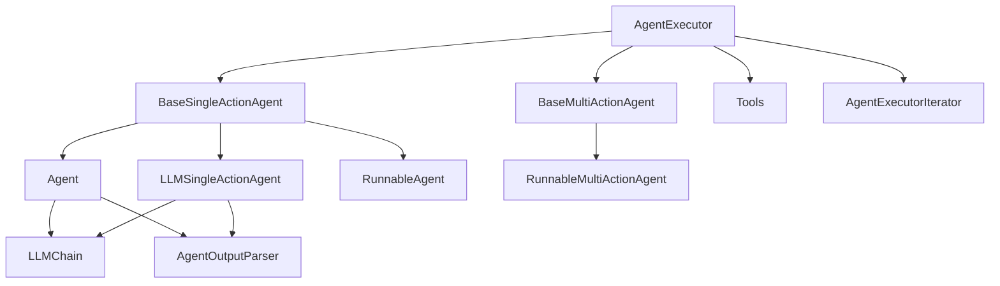
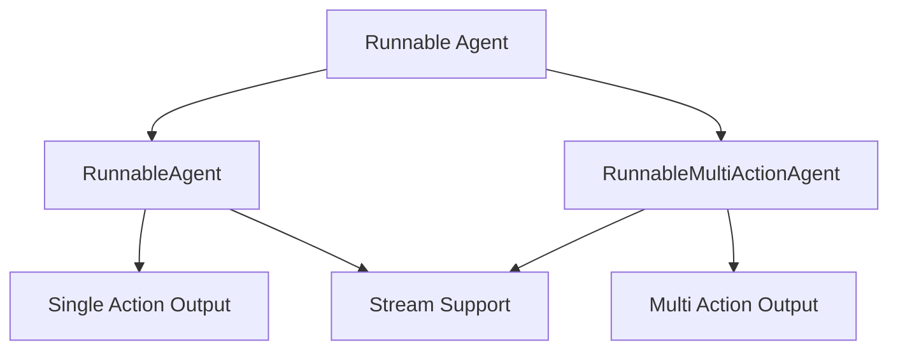
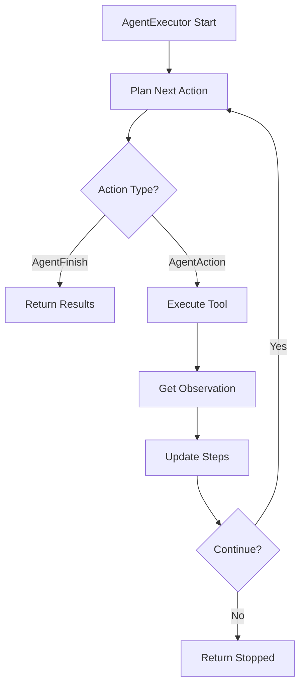
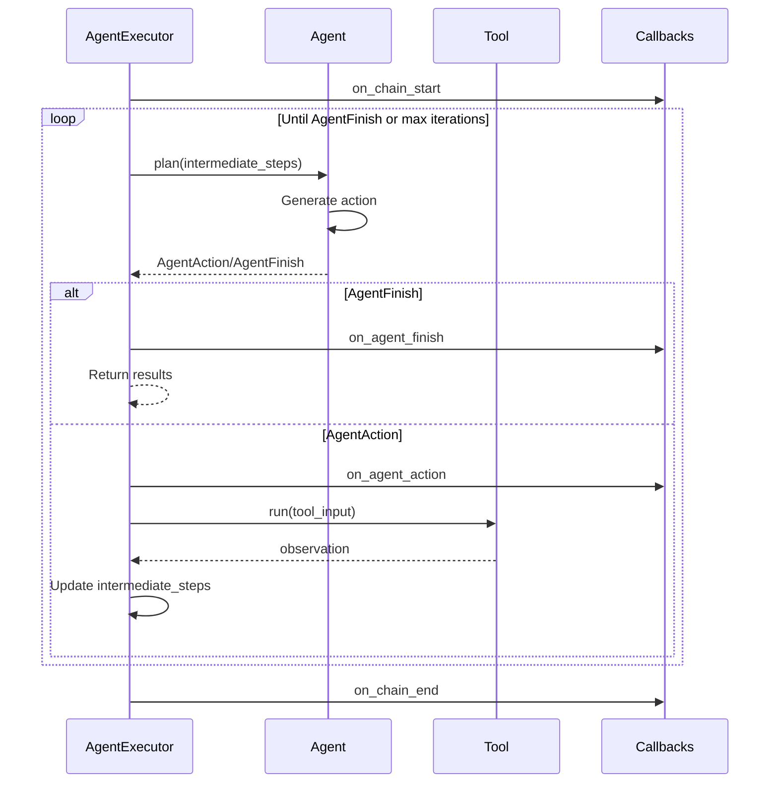
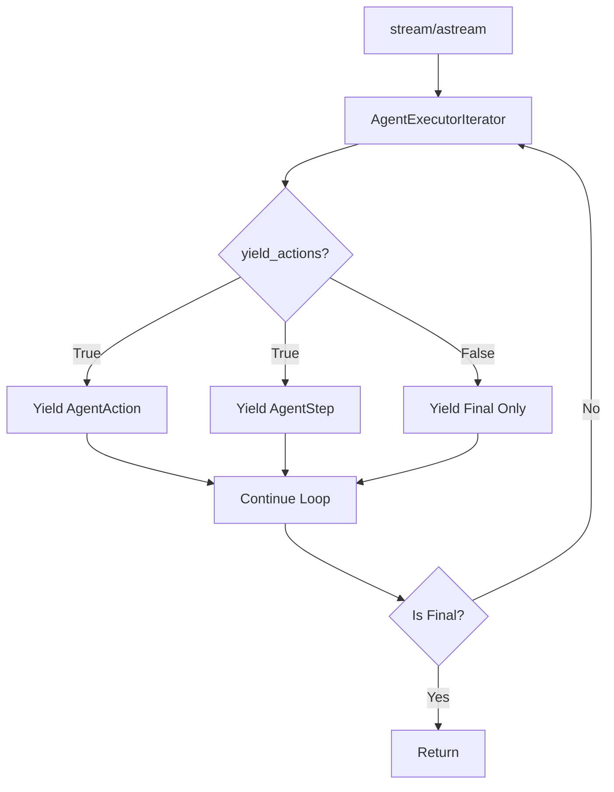
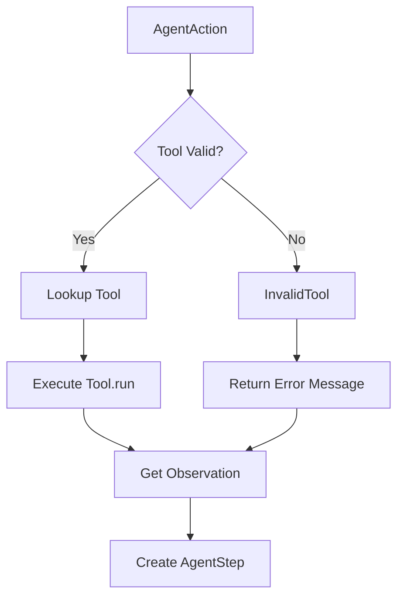

# Classic Agent Framework (langchain_classic)

The Classic Agent Framework in `langchain_classic` provides a comprehensive system for building LLM-powered agents that can dynamically select and execute tools to accomplish tasks. Unlike Chains where action sequences are hardcoded, Agents use a language model as a reasoning engine to determine which actions to take and in which order. This framework includes base agent classes, execution infrastructure, output parsers, and multiple pre-built agent types optimized for different use cases.

**Note:** This framework is deprecated as of version 0.1.0 and scheduled for removal in version 1.0. Users are encouraged to migrate to the newer agent implementations using LangGraph and the `create_agent` factory pattern.

Sources: [langchain_classic/agents/__init__.py:1-10](../../../libs/langchain/langchain_classic/agents/__init__.py#L1-L10), [langchain_classic/agents/agent.py:61-66](../../../libs/langchain/langchain_classic/agents/agent.py#L61-L66)

## Architecture Overview

The Classic Agent Framework is built around several core abstractions that work together to enable flexible, LLM-driven decision making:



The framework separates concerns between:
- **Agent classes** that handle planning and decision-making
- **AgentExecutor** that manages the execution loop
- **Tools** that perform actual actions
- **Output parsers** that interpret LLM responses

Sources: [langchain_classic/agents/agent.py:1-100](../../../libs/langchain/langchain_classic/agents/agent.py#L1-L100)

## Core Components

### Base Agent Classes

The framework provides three primary base classes for implementing agents:

| Class | Purpose | Action Type |
|-------|---------|-------------|
| `BaseSingleActionAgent` | Base for agents that return one action at a time | Single |
| `BaseMultiActionAgent` | Base for agents that can return multiple actions | Multiple |
| `Agent` | Legacy implementation using LLMChain | Single |

Sources: [langchain_classic/agents/agent.py:71-98](../../../libs/langchain/langchain_classic/agents/agent.py#L71-L98), [langchain_classic/agents/agent.py:193-273](../../../libs/langchain/langchain_classic/agents/agent.py#L193-L273)

#### BaseSingleActionAgent

The `BaseSingleActionAgent` class defines the interface for agents that decide on one action at a time:

```python
@abstractmethod
def plan(
    self,
    intermediate_steps: list[tuple[AgentAction, str]],
    callbacks: Callbacks = None,
    **kwargs: Any,
) -> AgentAction | AgentFinish:
    """Given input, decided what to do."""
```

Key methods:
- `plan()`: Synchronous planning method that returns the next action or finish signal
- `aplan()`: Async version of planning
- `get_allowed_tools()`: Returns list of allowed tool names or None for all tools
- `return_stopped_response()`: Handles early stopping scenarios

Sources: [langchain_classic/agents/agent.py:71-155](../../../libs/langchain/langchain_classic/agents/agent.py#L71-L155)

#### BaseMultiActionAgent

Similar to `BaseSingleActionAgent`, but returns multiple actions that can be executed in parallel:

```python
@abstractmethod
def plan(
    self,
    intermediate_steps: list[tuple[AgentAction, str]],
    callbacks: Callbacks = None,
    **kwargs: Any,
) -> list[AgentAction] | AgentFinish:
    """Given input, decided what to do."""
```

Sources: [langchain_classic/agents/agent.py:193-273](../../../libs/langchain/langchain_classic/agents/agent.py#L193-L273)

### Runnable-Based Agents

Modern agent implementations use the Runnable protocol for better composability:



Both `RunnableAgent` and `RunnableMultiActionAgent` wrap a `Runnable` that takes intermediate steps and returns agent actions. They support streaming to enable token-level access when using `stream_log`:

```python
runnable: Runnable[dict, AgentAction | AgentFinish]
stream_runnable: bool = True
```

Sources: [langchain_classic/agents/agent.py:305-424](../../../libs/langchain/langchain_classic/agents/agent.py#L305-L424), [langchain_classic/agents/agent.py:427-564](../../../libs/langchain/langchain_classic/agents/agent.py#L427-L564)

### AgentExecutor

The `AgentExecutor` is the runtime that manages the agent execution loop, tool invocation, and result handling:



Key configuration options:

| Parameter | Type | Default | Description |
|-----------|------|---------|-------------|
| `agent` | Agent/Runnable | Required | The agent to execute |
| `tools` | Sequence[BaseTool] | Required | Available tools |
| `max_iterations` | int | 15 | Maximum execution steps |
| `max_execution_time` | float | None | Time limit in seconds |
| `early_stopping_method` | str | "force" | How to stop: "force" or "generate" |
| `handle_parsing_errors` | bool/str/Callable | False | Error handling strategy |
| `return_intermediate_steps` | bool | False | Include step history in output |

Sources: [langchain_classic/agents/agent.py:693-751](../../../libs/langchain/langchain_classic/agents/agent.py#L693-L751)

#### Execution Flow

The execution loop follows this sequence:



Sources: [langchain_classic/agents/agent.py:1086-1184](../../../libs/langchain/langchain_classic/agents/agent.py#L1086-L1184)

### Agent Types

The framework includes several pre-built agent types, each optimized for specific scenarios:

| Agent Type | Enum Value | Description |
|------------|------------|-------------|
| Zero-Shot ReAct | `ZERO_SHOT_REACT_DESCRIPTION` | Reasoning + Acting with tool descriptions |
| ReAct Docstore | `REACT_DOCSTORE` | ReAct with document store access |
| Self-Ask with Search | `SELF_ASK_WITH_SEARCH` | Breaks complex questions into sub-questions |
| Conversational | `CONVERSATIONAL_REACT_DESCRIPTION` | Maintains conversation history |
| Structured Chat | `STRUCTURED_CHAT_ZERO_SHOT_REACT_DESCRIPTION` | Handles multi-input tools |
| OpenAI Functions | `OPENAI_FUNCTIONS` | Uses OpenAI function calling |
| OpenAI Multi-Functions | `OPENAI_MULTI_FUNCTIONS` | Multiple function calls per step |

Sources: [langchain_classic/agents/agent_types.py:15-58](../../../libs/langchain/langchain_classic/agents/agent_types.py#L15-L58)

## Agent Creation Patterns

### Using initialize_agent (Deprecated)

The legacy `initialize_agent` function provides a simple way to create agents:

```python
def initialize_agent(
    tools: Sequence[BaseTool],
    llm: BaseLanguageModel,
    agent: AgentType | None = None,
    callback_manager: BaseCallbackManager | None = None,
    agent_path: str | None = None,
    agent_kwargs: dict | None = None,
    *,
    tags: Sequence[str] | None = None,
    **kwargs: Any,
) -> AgentExecutor:
```

This function:
1. Selects the appropriate agent class based on `AgentType`
2. Creates the agent using `from_llm_and_tools()`
3. Wraps it in an `AgentExecutor`

Sources: [langchain_classic/agents/initialize.py:22-116](../../../libs/langchain/langchain_classic/agents/initialize.py#L22-L116)

### Using create_* Functions

Modern agent creation uses specialized factory functions:

```python
def create_tool_calling_agent(
    llm: BaseLanguageModel,
    tools: Sequence[BaseTool],
    prompt: ChatPromptTemplate,
    *,
    message_formatter: MessageFormatter = format_to_tool_messages,
) -> Runnable:
```

These functions return a `Runnable` that can be used directly with `AgentExecutor`. The prompt must include an `agent_scratchpad` placeholder for intermediate steps.

Sources: [langchain_classic/agents/tool_calling_agent/base.py:16-114](../../../libs/langchain/langchain_classic/agents/tool_calling_agent/base.py#L16-L114)

## Execution and Iteration

### AgentExecutorIterator

The `AgentExecutorIterator` enables step-by-step iteration over agent execution:

```python
iterator = agent_executor.iter(
    inputs={"input": "What is 2+2?"},
    include_run_info=True,
)

for step in iterator:
    # Process each step
    if "intermediate_step" in step:
        # Handle intermediate action/observation
        pass
    else:
        # Final output
        pass
```

The iterator provides:
- Access to intermediate steps as they occur
- Control over execution timing
- Ability to yield actions before observations
- Run metadata when `include_run_info=True`

Sources: [langchain_classic/agents/agent_iterator.py:27-119](../../../libs/langchain/langchain_classic/agents/agent_iterator.py#L27-L119)

#### Iterator State Management

The iterator maintains execution state:

```python
def reset(self) -> None:
    """Reset the iterator to its initial state."""
    self.intermediate_steps: list[tuple[AgentAction, str]] = []
    self.iterations = 0
    self.time_elapsed = 0.0
    self.start_time = time.time()
```

Sources: [langchain_classic/agents/agent_iterator.py:96-107](../../../libs/langchain/langchain_classic/agents/agent_iterator.py#L96-L107)

### Streaming Support

Both synchronous and asynchronous streaming are supported:



Sources: [langchain_classic/agents/agent.py:1273-1324](../../../libs/langchain/langchain_classic/agents/agent.py#L1273-L1324)

## Error Handling

The framework provides sophisticated error handling for parsing errors:

```python
handle_parsing_errors: bool | str | Callable[[OutputParserException], str] = False
```

Options:
- `False`: Raise the error (default)
- `True`: Send error back to LLM as observation
- `str`: Send custom string as observation
- `Callable`: Process error and return observation

When an `OutputParserException` occurs, the executor creates a special `_Exception` tool action:

```python
output = AgentAction("_Exception", observation, text)
observation = ExceptionTool().run(
    output.tool_input,
    verbose=self.verbose,
    color=None,
    callbacks=run_manager.get_child() if run_manager else None,
    **tool_run_kwargs,
)
```

Sources: [langchain_classic/agents/agent.py:966-1005](../../../libs/langchain/langchain_classic/agents/agent.py#L966-L1005)

## Output Parsing

### AgentOutputParser

The `AgentOutputParser` class defines the interface for parsing LLM outputs:

```python
class AgentOutputParser(BaseOutputParser[AgentAction | AgentFinish]):
    """Base class for parsing agent output into agent action/finish."""

    @abstractmethod
    def parse(self, text: str) -> AgentAction | AgentFinish:
        """Parse text into agent action/finish."""
```

For multi-action agents, use `MultiActionAgentOutputParser`:

```python
class MultiActionAgentOutputParser(
    BaseOutputParser[list[AgentAction] | AgentFinish],
):
    @abstractmethod
    def parse(self, text: str) -> list[AgentAction] | AgentFinish:
        """Parse text into agent actions/finish."""
```

Sources: [langchain_classic/agents/agent.py:275-302](../../../libs/langchain/langchain_classic/agents/agent.py#L275-L302)

## Tool Integration

### Tool Execution

Tools are executed based on agent actions:



The executor maintains a name-to-tool mapping for efficient lookup:

```python
name_to_tool_map = {tool.name: tool for tool in self.tools}
```

Sources: [langchain_classic/agents/agent.py:1007-1052](../../../libs/langchain/langchain_classic/agents/agent.py#L1007-L1052)

### Direct Tool Returns

Tools can be configured to return directly without further agent processing:

```python
if (
    agent_action.tool in name_to_tool_map
    and name_to_tool_map[agent_action.tool].return_direct
):
    return AgentFinish(
        {return_value_key: observation},
        "",
    )
```

Sources: [langchain_classic/agents/agent.py:1229-1242](../../../libs/langchain/langchain_classic/agents/agent.py#L1229-L1242)

## Async Execution

The framework provides full async support with parallel tool execution:

```python
# Use asyncio.gather to run multiple tool.arun() calls concurrently
result = await asyncio.gather(
    *[
        self._aperform_agent_action(
            name_to_tool_map,
            color_mapping,
            agent_action,
            run_manager,
        )
        for agent_action in actions
    ],
)
```

This enables multi-action agents to execute multiple tools simultaneously.

Sources: [langchain_classic/agents/agent.py:1106-1121](../../../libs/langchain/langchain_classic/agents/agent.py#L1106-L1121)

## Legacy Agent Class

The deprecated `Agent` class provides additional functionality for traditional LLMChain-based agents:

Key features:
- **Scratchpad construction**: Builds context from intermediate steps
- **Prompt validation**: Ensures `agent_scratchpad` variable exists
- **Stop sequences**: Automatic generation of observation prefixes
- **Early stopping**: "generate" mode for final answer generation

```python
def _construct_scratchpad(
    self,
    intermediate_steps: list[tuple[AgentAction, str]],
) -> str | list[BaseMessage]:
    """Construct the scratchpad that lets the agent continue its thought process."""
    thoughts = ""
    for action, observation in intermediate_steps:
        thoughts += action.log
        thoughts += f"\n{self.observation_prefix}{observation}\n{self.llm_prefix}"
    return thoughts
```

Sources: [langchain_classic/agents/agent.py:567-690](../../../libs/langchain/langchain_classic/agents/agent.py#L567-L690)

## Serialization

Agents support saving to JSON or YAML:

```python
def save(self, file_path: Path | str) -> None:
    """Save the agent."""
    save_path = Path(file_path) if isinstance(file_path, str) else file_path
    directory_path = save_path.parent
    directory_path.mkdir(parents=True, exist_ok=True)
    
    agent_dict = self.dict()
    if "_type" not in agent_dict:
        raise NotImplementedError(f"Agent {self} does not support saving")
    
    if save_path.suffix == ".json":
        with save_path.open("w") as f:
            json.dump(agent_dict, f, indent=4)
    elif save_path.suffix.endswith((".yaml", ".yml")):
        with save_path.open("w") as f:
            yaml.dump(agent_dict, f, default_flow_style=False)
```

Loading is handled by the `load_agent` function which deserializes and reconstructs agents.

Sources: [langchain_classic/agents/agent.py:131-154](../../../libs/langchain/langchain_classic/agents/agent.py#L131-L154)

## Summary

The Classic Agent Framework provides a comprehensive foundation for building LLM-powered agents with dynamic tool selection and execution. While deprecated in favor of newer LangGraph-based approaches, it established many patterns still used today: separation of planning and execution, support for both single and multi-action agents, sophisticated error handling, and flexible tool integration. The framework's modular design allows for custom agent implementations while providing robust execution infrastructure through `AgentExecutor` and streaming capabilities through `AgentExecutorIterator`.

Sources: [langchain_classic/agents/__init__.py:1-10](../../../libs/langchain/langchain_classic/agents/__init__.py#L1-L10), [langchain_classic/agents/agent.py:1-50](../../../libs/langchain/langchain_classic/agents/agent.py#L1-L50)