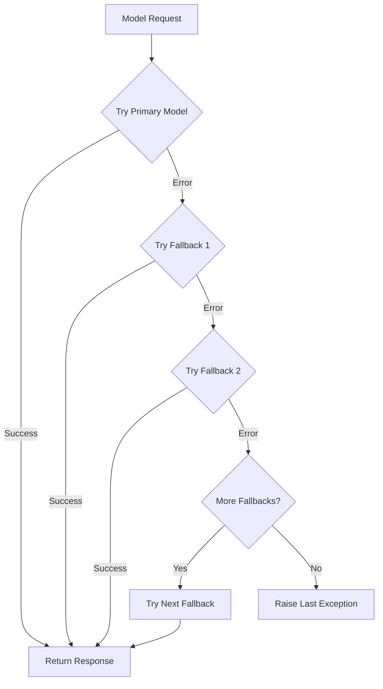
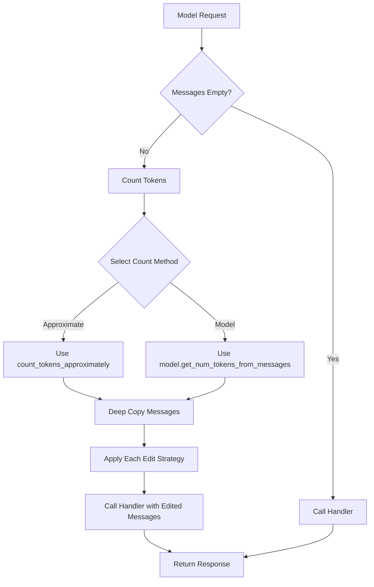
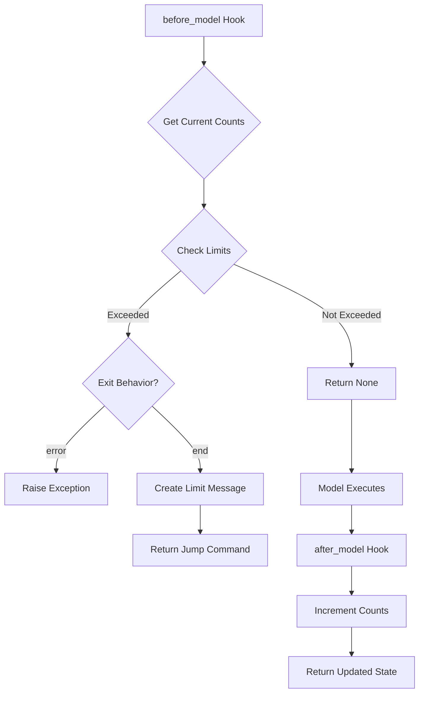
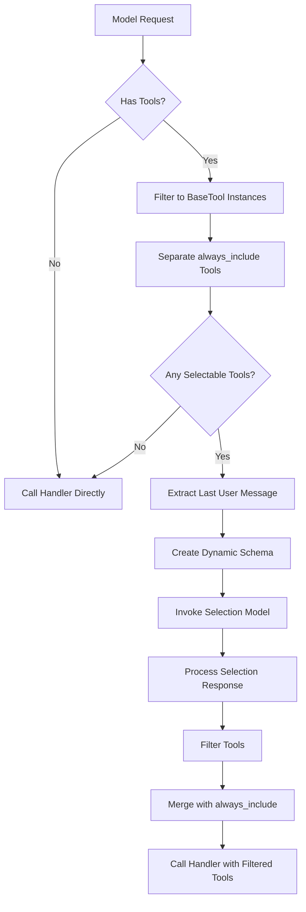
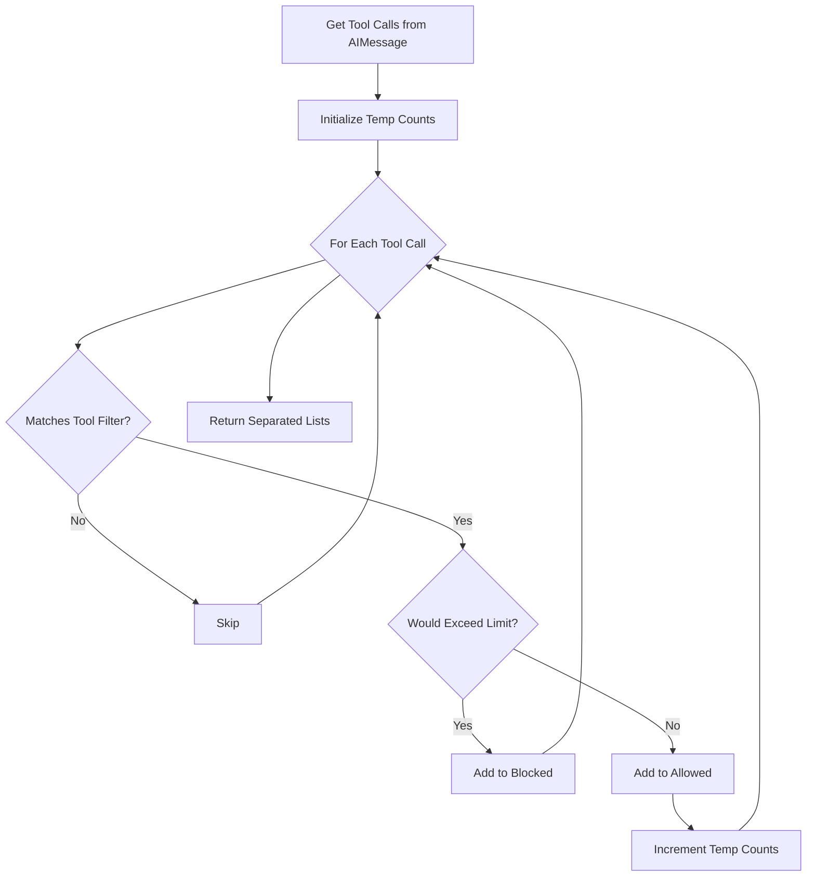
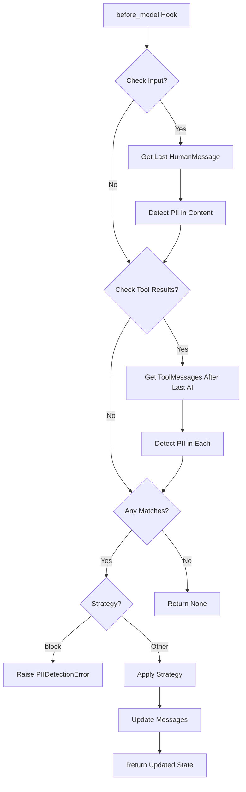

# Middleware Implementations

## Introduction

Middleware implementations in LangChain provide a powerful mechanism for intercepting and modifying agent execution at key lifecycle points. These middleware components enable cross-cutting concerns such as PII detection, tool call limiting, context management, model fallback handling, and resource tracking to be applied transparently to agent workflows without modifying core agent logic. Each middleware can hook into specific execution phases—before model calls, after model calls, around model calls, or during tool execution—allowing developers to compose sophisticated agent behaviors through a clean, modular architecture.

The middleware system is built on the `AgentMiddleware` base class and integrates seamlessly with LangGraph's runtime and state management. Middleware instances can modify agent state, intercept model requests, inject artificial messages, and even control execution flow by jumping to different graph nodes. This document explores the concrete middleware implementations available in LangChain, their configuration options, execution semantics, and integration patterns.

Sources: [langchain/agents/middleware/types.py](../../../langchain/agents/middleware/types.py), [langchain/agents/middleware/model_fallback.py:1-10](../../../langchain/agents/middleware/model_fallback.py#L1-L10)

## Model Fallback Middleware

### Overview

The `ModelFallbackMiddleware` provides automatic fallback to alternative language models when the primary model encounters errors during execution. This middleware implements a sequential retry strategy, attempting each configured fallback model in order until either a successful response is obtained or all models are exhausted.

Sources: [langchain/agents/middleware/model_fallback.py:24-56](../../../langchain/agents/middleware/model_fallback.py#L24-L56)

### Architecture



The middleware wraps model invocations using the `wrap_model_call` and `awrap_model_call` hooks, catching exceptions and retrying with alternative models. The primary model is specified during agent creation, while fallback models are configured in the middleware constructor.

Sources: [langchain/agents/middleware/model_fallback.py:70-111](../../../langchain/agents/middleware/model_fallback.py#L70-L111)

### Configuration

| Parameter | Type | Description |
|-----------|------|-------------|
| `first_model` | `str \| BaseChatModel` | First fallback model (string name or instance) |
| `*additional_models` | `str \| BaseChatModel` | Additional fallback models in order |

The middleware accepts model identifiers as strings (e.g., `"openai:gpt-4o-mini"`) or pre-initialized `BaseChatModel` instances. String identifiers are automatically converted to model instances using `init_chat_model`.

Sources: [langchain/agents/middleware/model_fallback.py:58-69](../../../langchain/agents/middleware/model_fallback.py#L58-L69)

### Implementation Details

The synchronous implementation attempts the primary model first, capturing any exception. If an error occurs, it iterates through the fallback models in sequence, using `request.override(model=fallback_model)` to substitute the model while preserving other request parameters:

```python
def wrap_model_call(
    self,
    request: ModelRequest[ContextT],
    handler: Callable[[ModelRequest[ContextT]], ModelResponse[ResponseT]],
) -> ModelResponse[ResponseT] | AIMessage:
    # Try primary model first
    last_exception: Exception
    try:
        return handler(request)
    except Exception as e:
        last_exception = e

    # Try fallback models
    for fallback_model in self.models:
        try:
            return handler(request.override(model=fallback_model))
        except Exception as e:
            last_exception = e
            continue

    raise last_exception
```

The async version (`awrap_model_call`) follows identical logic with async/await syntax. If all models fail, the middleware re-raises the last encountered exception.

Sources: [langchain/agents/middleware/model_fallback.py:70-93](../../../langchain/agents/middleware/model_fallback.py#L70-L93), [langchain/agents/middleware/model_fallback.py:95-119](../../../langchain/agents/middleware/model_fallback.py#L95-L119)

## Context Editing Middleware

### Overview

The `ContextEditingMiddleware` automatically prunes tool results to manage context size when token counts exceed configured thresholds. This implementation mirrors Anthropic's context editing capabilities while remaining model-agnostic, supporting any LangChain chat model.

Sources: [langchain/agents/middleware/context_editing.py:1-11](../../../langchain/agents/middleware/context_editing.py#L1-L11)

### Edit Strategies

#### ClearToolUsesEdit

The `ClearToolUsesEdit` strategy clears older tool outputs when conversation token counts exceed a trigger threshold. This aligns with Anthropic's `clear_tool_uses_20250919` behavior.

| Configuration | Type | Default | Description |
|--------------|------|---------|-------------|
| `trigger` | `int` | `100000` | Token count that triggers the edit |
| `clear_at_least` | `int` | `0` | Minimum tokens to reclaim when edit runs |
| `keep` | `int` | `3` | Number of most recent tool results to preserve |
| `clear_tool_inputs` | `bool` | `False` | Whether to clear tool call parameters on AI message |
| `exclude_tools` | `Sequence[str]` | `()` | Tool names to exclude from clearing |
| `placeholder` | `str` | `"[cleared]"` | Placeholder text for cleared tool outputs |

Sources: [langchain/agents/middleware/context_editing.py:37-56](../../../langchain/agents/middleware/context_editing.py#L37-L56)

The edit strategy applies the following algorithm:

1. Count tokens in the message list
2. If count ≤ trigger threshold, return without changes
3. Identify `ToolMessage` candidates (excluding most recent `keep` messages)
4. For each candidate, find the originating `AIMessage` and corresponding tool call
5. Skip if tool is in `exclude_tools` list
6. Replace tool message content with placeholder and mark as cleared
7. Optionally clear tool input arguments on the AI message
8. Stop if `clear_at_least` tokens have been reclaimed

Sources: [langchain/agents/middleware/context_editing.py:58-117](../../../langchain/agents/middleware/context_editing.py#L58-L117)

### Token Counting Methods

The middleware supports two token counting approaches:

| Method | Description | Trade-offs |
|--------|-------------|-----------|
| `approximate` | Uses `count_tokens_approximately` utility | Faster, less accurate |
| `model` | Uses model's `get_num_tokens_from_messages` | Potentially slower, more accurate |

Sources: [langchain/agents/middleware/context_editing.py:141-142](../../../langchain/agents/middleware/context_editing.py#L141-L142)

### Execution Flow



The middleware deep copies the message list before applying edits to avoid mutating the original state. Each configured edit strategy is applied in sequence.

Sources: [langchain/agents/middleware/context_editing.py:144-177](../../../langchain/agents/middleware/context_editing.py#L144-L177)

## Model Call Limit Middleware

### Overview

The `ModelCallLimitMiddleware` tracks model invocation counts and enforces limits at both thread-level (persistent across runs) and run-level (per invocation) granularities. This middleware helps control costs and prevent runaway agent execution.

Sources: [langchain/agents/middleware/model_call_limit.py:1-10](../../../langchain/agents/middleware/model_call_limit.py#L1-L10)

### State Schema

The middleware extends `AgentState` with tracking fields:

```python
class ModelCallLimitState(AgentState[ResponseT]):
    thread_model_call_count: NotRequired[Annotated[int, PrivateStateAttr]]
    run_model_call_count: NotRequired[Annotated[int, UntrackedValue, PrivateStateAttr]]
```

- `thread_model_call_count`: Persisted across runs, tracks total calls in thread
- `run_model_call_count`: Untracked (not persisted), counts calls in current run only

Sources: [langchain/agents/middleware/model_call_limit.py:27-37](../../../langchain/agents/middleware/model_call_limit.py#L27-L37)

### Exit Behaviors

| Behavior | Description | Use Case |
|----------|-------------|----------|
| `end` | Jump to end node with limit exceeded message | Graceful termination |
| `error` | Raise `ModelCallLimitExceededError` | Strict enforcement |

Sources: [langchain/agents/middleware/model_call_limit.py:90-108](../../../langchain/agents/middleware/model_call_limit.py#L90-L108)

### Execution Lifecycle



The middleware uses `before_model` to check limits before execution and `after_model` to increment counters after successful calls. The `@hook_config(can_jump_to=["end"])` decorator enables jumping to the end node when limits are exceeded.

Sources: [langchain/agents/middleware/model_call_limit.py:110-142](../../../langchain/agents/middleware/model_call_limit.py#L110-L142), [langchain/agents/middleware/model_call_limit.py:162-177](../../../langchain/agents/middleware/model_call_limit.py#L162-L177)

### Error Handling

The `ModelCallLimitExceededError` exception captures detailed context about which limits were exceeded:

```python
class ModelCallLimitExceededError(Exception):
    def __init__(
        self,
        thread_count: int,
        run_count: int,
        thread_limit: int | None,
        run_limit: int | None,
    ) -> None:
        self.thread_count = thread_count
        self.run_count = run_count
        self.thread_limit = thread_limit
        self.run_limit = run_limit

        msg = _build_limit_exceeded_message(thread_count, run_count, thread_limit, run_limit)
        super().__init__(msg)
```

Sources: [langchain/agents/middleware/model_call_limit.py:63-86](../../../langchain/agents/middleware/model_call_limit.py#L63-L86)

## Tool Selection Middleware

### Overview

The `LLMToolSelectorMiddleware` uses a language model to intelligently filter available tools before invoking the main agent model. When agents have many tools, this reduces token usage and helps the primary model focus on relevant capabilities.

Sources: [langchain/agents/middleware/tool_selection.py:1-10](../../../langchain/agents/middleware/tool_selection.py#L1-L10)

### Selection Process



The middleware dynamically generates a structured output schema where each tool name is a `Literal` type annotated with the tool's description. This enables the selection model to understand available options and their purposes.

Sources: [langchain/agents/middleware/tool_selection.py:134-186](../../../langchain/agents/middleware/tool_selection.py#L134-L186), [langchain/agents/middleware/tool_selection.py:40-60](../../../langchain/agents/middleware/tool_selection.py#L40-L60)

### Configuration

| Parameter | Type | Default | Description |
|-----------|------|---------|-------------|
| `model` | `str \| BaseChatModel \| None` | `None` | Model for selection (uses agent model if not specified) |
| `system_prompt` | `str` | `DEFAULT_SYSTEM_PROMPT` | Instructions for selection model |
| `max_tools` | `int \| None` | `None` | Maximum tools to select |
| `always_include` | `list[str] \| None` | `None` | Tool names to always include |

When `max_tools` is specified, the middleware appends instructions to the system prompt emphasizing the importance of ordering tools by relevance, as only the first N will be used.

Sources: [langchain/agents/middleware/tool_selection.py:78-109](../../../langchain/agents/middleware/tool_selection.py#L78-L109)

### Dynamic Schema Generation

The middleware creates a `TypeAdapter` for a schema where tool names are union of annotated literals:

```python
def _create_tool_selection_response(tools: list[BaseTool]) -> TypeAdapter[Any]:
    literals = [
        Annotated[Literal[tool.name], Field(description=tool.description)] for tool in tools
    ]
    selected_tool_type = Union[tuple(literals)]

    class ToolSelectionResponse(TypedDict):
        tools: Annotated[list[selected_tool_type], Field(description=description)]

    return TypeAdapter(ToolSelectionResponse)
```

This ensures the selection model receives tool descriptions as part of the schema definition, improving selection accuracy.

Sources: [langchain/agents/middleware/tool_selection.py:40-60](../../../langchain/agents/middleware/tool_selection.py#L40-L60)

## Tool Call Limit Middleware

### Overview

The `ToolCallLimitMiddleware` tracks and enforces limits on tool invocations, supporting both global limits (all tools) and per-tool limits. Unlike model call limits, this middleware operates in the `after_model` phase, examining tool calls requested by the model and blocking those that exceed configured thresholds.

Sources: [langchain/agents/middleware/tool_call_limit.py:1-10](../../../langchain/agents/middleware/tool_call_limit.py#L1-L10)

### State Schema

The middleware uses dictionary-based counting to support multiple independent limit configurations:

```python
class ToolCallLimitState(AgentState[ResponseT]):
    thread_tool_call_count: NotRequired[Annotated[dict[str, int], PrivateStateAttr]]
    run_tool_call_count: NotRequired[Annotated[dict[str, int], UntrackedValue, PrivateStateAttr]]
```

Count dictionaries map tool names to execution counts. The special key `'__all__'` tracks global tool call counts across all tools.

Sources: [langchain/agents/middleware/tool_call_limit.py:35-52](../../../langchain/agents/middleware/tool_call_limit.py#L35-L52)

### Exit Behaviors

| Behavior | Description | Model Impact |
|----------|-------------|--------------|
| `continue` | Inject error `ToolMessage`, let execution continue | Model sees errors, decides next action |
| `error` | Raise `ToolCallLimitExceededError` | Execution terminates immediately |
| `end` | Jump to end with `ToolMessage` + AI message | Only for single tool call scenarios |

The `end` behavior raises `NotImplementedError` if there are multiple pending tool calls, as it cannot selectively terminate one tool while allowing others to proceed.

Sources: [langchain/agents/middleware/tool_call_limit.py:17-28](../../../langchain/agents/middleware/tool_call_limit.py#L17-L28), [langchain/agents/middleware/tool_call_limit.py:182-198](../../../langchain/agents/middleware/tool_call_limit.py#L182-L198)

### Tool Call Separation Logic

The middleware separates tool calls into allowed and blocked categories:



Blocked tool calls do not increment the thread-level count (they were never executed), but they do increment the run-level count (they were attempted in this run).

Sources: [langchain/agents/middleware/tool_call_limit.py:159-180](../../../langchain/agents/middleware/tool_call_limit.py#L159-L180)

### Message Injection

For the `continue` behavior, the middleware injects artificial error `ToolMessage` objects:

```python
artificial_messages: list[ToolMessage | AIMessage] = [
    ToolMessage(
        content=tool_msg_content,
        tool_call_id=tool_call["id"],
        name=tool_call.get("name"),
        status="error",
    )
    for tool_call in blocked_calls
]
```

These messages inform the model that specific tool calls were blocked, allowing it to adapt its strategy (e.g., try different tools, provide a final answer).

Sources: [langchain/agents/middleware/tool_call_limit.py:260-268](../../../langchain/agents/middleware/tool_call_limit.py#L260-L268)

## PII Detection Middleware

### Overview

The `PIIMiddleware` detects and handles Personally Identifiable Information (PII) in agent conversations. It supports built-in detectors for common PII types (email, credit card, IP address, MAC address, URL) and custom detectors via regex or callable functions.

Sources: [langchain/agents/middleware/pii.py:1-10](../../../langchain/agents/middleware/pii.py#L1-L10)

### Built-in PII Types

| PII Type | Description | Validation |
|----------|-------------|------------|
| `email` | Email addresses | Standard email format |
| `credit_card` | Credit card numbers | Luhn algorithm validation |
| `ip` | IP addresses | Standard library validation |
| `mac_address` | MAC addresses | Hardware address format |
| `url` | URLs | Both `http`/`https` and bare URLs |

Sources: [langchain/agents/middleware/pii.py:25-33](../../../langchain/agents/middleware/pii.py#L25-L33)

### Redaction Strategies

| Strategy | Behavior | Example |
|----------|----------|---------|
| `block` | Raise `PIIDetectionError` | N/A (execution stops) |
| `redact` | Replace with `[REDACTED_TYPE]` | `[REDACTED_EMAIL]` |
| `mask` | Partially mask PII | `****-****-****-1234` |
| `hash` | Replace with deterministic hash | `<email_hash:a1b2c3d4>` |

The `hash` strategy preserves identity pseudonymously, making it suitable for analytics and debugging while maintaining privacy.

Sources: [langchain/agents/middleware/pii.py:35-47](../../../langchain/agents/middleware/pii.py#L35-L47)

### Application Scopes

The middleware can be configured to check different message types:

| Configuration | Description | Default |
|--------------|-------------|---------|
| `apply_to_input` | Check user messages before model call | `True` |
| `apply_to_output` | Check AI messages after model call | `False` |
| `apply_to_tool_results` | Check tool result messages | `False` |

Sources: [langchain/agents/middleware/pii.py:68-85](../../../langchain/agents/middleware/pii.py#L68-L85)

### Detection and Redaction Flow



The middleware processes content through the `_process_content` method, which applies the configured detector and strategy:

```python
def _process_content(self, content: str) -> tuple[str, list[PIIMatch]]:
    matches = self.detector(content)
    if not matches:
        return content, []
    sanitized = apply_strategy(content, matches, self.strategy)
    return sanitized, matches
```

Sources: [langchain/agents/middleware/pii.py:97-101](../../../langchain/agents/middleware/pii.py#L97-L101), [langchain/agents/middleware/pii.py:103-177](../../../langchain/agents/middleware/pii.py#L103-L177)

### Custom Detectors

Developers can provide custom PII detectors in two forms:

1. **Regex pattern (string)**: Automatically compiled and applied to content
2. **Callable function**: Receives content string, returns list of `PIIMatch` objects

```python
# Regex detector
PIIMiddleware("api_key", detector=r"sk-[a-zA-Z0-9]{32}", strategy="block")

# Callable detector
def detect_ssn(content: str) -> list[PIIMatch]:
    # Custom detection logic
    return matches

PIIMiddleware("ssn", detector=detect_ssn, strategy="redact")
```

Sources: [langchain/agents/middleware/pii.py:68-85](../../../langchain/agents/middleware/pii.py#L68-L85)

## Summary

LangChain's middleware implementations provide a comprehensive toolkit for managing agent execution concerns. The `ModelFallbackMiddleware` ensures reliability through automatic model failover, while `ContextEditingMiddleware` manages token budgets by intelligently pruning conversation history. Resource control is achieved through `ModelCallLimitMiddleware` and `ToolCallLimitMiddleware`, which enforce invocation limits at various granularities. The `LLMToolSelectorMiddleware` optimizes token usage by pre-filtering tools, and `PIIMiddleware` ensures privacy compliance through configurable detection and redaction strategies.

These middleware components demonstrate the power of LangChain's composable architecture, allowing developers to build sophisticated agent systems by combining orthogonal concerns. Each middleware operates independently while integrating seamlessly through the shared `AgentMiddleware` interface and LangGraph's runtime hooks, enabling complex behaviors to emerge from simple, focused components.

Sources: [langchain/agents/middleware/model_fallback.py](../../../langchain/agents/middleware/model_fallback.py), [langchain/agents/middleware/context_editing.py](../../../langchain/agents/middleware/context_editing.py), [langchain/agents/middleware/model_call_limit.py](../../../langchain/agents/middleware/model_call_limit.py), [langchain/agents/middleware/tool_selection.py](../../../langchain/agents/middleware/tool_selection.py), [langchain/agents/middleware/tool_call_limit.py](../../../langchain/agents/middleware/tool_call_limit.py), [langchain/agents/middleware/pii.py](../../../langchain/agents/middleware/pii.py)