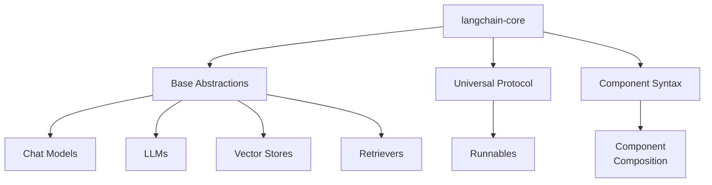
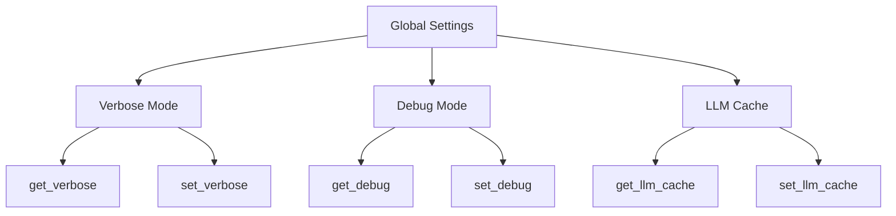
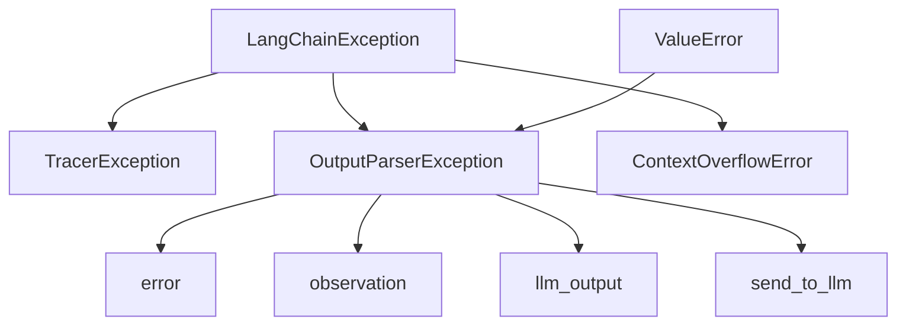
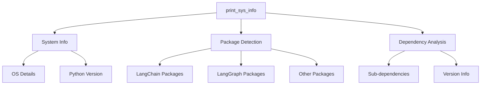

# Core Library (langchain-core) Overview

The `langchain-core` library serves as the foundational layer of the LangChain ecosystem, defining base abstractions and interfaces for all core components. This library establishes the universal invocation protocol (Runnables) and provides a composable syntax for combining components. Critically, `langchain-core` maintains purposefully lightweight dependencies and contains **no third-party integrations**, ensuring a stable and minimal foundation for the broader LangChain framework. The core library defines interfaces for chat models, LLMs, vector stores, retrievers, and other essential components that form the building blocks of LLM-powered applications.

Sources: [langchain_core/__init__.py:1-16](../../../libs/core/langchain_core/__init__.py#L1-L16)

## Architecture Philosophy

The `langchain-core` library follows a deliberate architectural approach centered on abstraction and minimal dependencies. The library's design philosophy emphasizes:

- **Base Abstractions**: Defining interfaces without implementation details
- **Universal Protocols**: Establishing common invocation patterns (Runnables)
- **Composability**: Providing syntax for combining components
- **Lightweight Dependencies**: Avoiding third-party integrations to maintain stability
- **Ecosystem Foundation**: Serving as the base layer for all LangChain packages

This architectural approach ensures that `langchain-core` remains stable and can be depended upon by all other packages in the LangChain ecosystem without introducing dependency conflicts.

Sources: [langchain_core/__init__.py:1-10](../../../libs/core/langchain_core/__init__.py#L1-L10)



## Version Management

The core library implements a centralized version management system with the current version defined as `1.3.0`. Version information is maintained in a dedicated module and exposed through the package's `__version__` attribute.

Sources: [langchain_core/version.py:1-3](../../../libs/core/langchain_core/version.py#L1-L3), [langchain_core/__init__.py:5-7](../../../libs/core/langchain_core/__init__.py#L5-L7)

### Version Information Structure

| Component | Value | Purpose |
|-----------|-------|---------|
| VERSION constant | "1.3.0" | Defines the current library version |
| __version__ attribute | VERSION | Exposes version at package level |
| Module | version.py | Centralizes version information |

Sources: [langchain_core/version.py:3](../../../libs/core/langchain_core/version.py#L3), [langchain_core/__init__.py:7](../../../libs/core/langchain_core/__init__.py#L7)

## Runtime Environment Detection

The core library provides utilities for detecting and reporting runtime environment information through a cached function that gathers system and library metadata.

```python
@lru_cache(maxsize=1)
def get_runtime_environment() -> dict:
    """Get information about the LangChain runtime environment.

    Returns:
        A dictionary with information about the runtime environment.
    """
    return {
        "library_version": __version__,
        "library": "langchain-core",
        "platform": platform.platform(),
        "runtime": "python",
        "runtime_version": platform.python_version(),
    }
```

The function uses `lru_cache` with `maxsize=1` to ensure the environment information is computed only once, improving performance for repeated calls. This is particularly useful for telemetry, debugging, and compatibility checks.

Sources: [langchain_core/env.py:1-20](../../../libs/core/langchain_core/env.py#L1-L20)

### Runtime Environment Data Model

| Field | Type | Description |
|-------|------|-------------|
| library_version | str | Current version of langchain-core |
| library | str | Fixed value "langchain-core" |
| platform | str | Operating system and platform details |
| runtime | str | Fixed value "python" |
| runtime_version | str | Python version string |

Sources: [langchain_core/env.py:13-19](../../../libs/core/langchain_core/env.py#L13-L19)

## Global Configuration System

The core library implements a global configuration system for managing runtime settings that affect all of LangChain. The system provides controlled access to global state through getter and setter functions, avoiding direct access to internal variables.

Sources: [langchain_core/globals.py:1-7](../../../libs/core/langchain_core/globals.py#L1-L7)



### Global Configuration Variables

| Variable | Default Value | Type | Purpose |
|----------|---------------|------|---------|
| _verbose | False | bool | Controls verbose output across LangChain |
| _debug | False | bool | Enables debug mode for detailed logging |
| _llm_cache | None | Optional[BaseCache] | Global LLM response cache instance |

Sources: [langchain_core/globals.py:9-12](../../../libs/core/langchain_core/globals.py#L9-L12)

### Configuration Access Pattern

The global configuration system enforces an access pattern that prevents direct variable manipulation. Users must interact with the configuration through dedicated getter and setter functions:

```python
def set_verbose(value: bool) -> None:
    """Set a new value for the `verbose` global setting."""
    global _verbose
    _verbose = value

def get_verbose() -> bool:
    """Get the value of the `verbose` global setting."""
    return _verbose
```

This pattern is replicated for `debug` and `llm_cache` settings, ensuring consistent access control and preventing unexpected behavior when multiple parts of the codebase interact with global settings.

Sources: [langchain_core/globals.py:15-30](../../../libs/core/langchain_core/globals.py#L15-L30), [langchain_core/globals.py:33-48](../../../libs/core/langchain_core/globals.py#L33-L48), [langchain_core/globals.py:51-66](../../../libs/core/langchain_core/globals.py#L51-L66)

## Exception Hierarchy

The core library defines a comprehensive exception hierarchy rooted in `LangChainException`, providing specialized exception types for different error scenarios encountered in LLM applications.



Sources: [langchain_core/exceptions.py:1-9](../../../libs/core/langchain_core/exceptions.py#L1-L9)

### Exception Types

| Exception Class | Base Classes | Purpose |
|----------------|--------------|---------|
| LangChainException | Exception | General base exception for all LangChain errors |
| TracerException | LangChainException | Base class for tracer module exceptions |
| OutputParserException | ValueError, LangChainException | Signifies parsing errors in output parsers |
| ContextOverflowError | LangChainException | Raised when input exceeds model context limits |

Sources: [langchain_core/exceptions.py:6-18](../../../libs/core/langchain_core/exceptions.py#L6-L18), [langchain_core/exceptions.py:21-55](../../../libs/core/langchain_core/exceptions.py#L21-L55), [langchain_core/exceptions.py:58-64](../../../libs/core/langchain_core/exceptions.py#L58-L64)

### OutputParserException Design

The `OutputParserException` is particularly sophisticated, designed to handle parsing failures in a way that enables automatic recovery through LLM re-prompting:

```python
def __init__(
    self,
    error: Any,
    observation: str | None = None,
    llm_output: str | None = None,
    send_to_llm: bool = False,
):
    """Create an `OutputParserException`.

    Args:
        error: The error that's being re-raised or an error message.
        observation: String explanation of error which can be passed to a model to
            try and remediate the issue.
        llm_output: String model output which is error-ing.
        send_to_llm: Whether to send the observation and llm_output back to an Agent
            after an `OutputParserException` has been raised.
    """
```

When `send_to_llm` is `True`, both `observation` and `llm_output` must be provided, enabling the system to provide context to the model about what went wrong and attempt to generate corrected output.

Sources: [langchain_core/exceptions.py:24-55](../../../libs/core/langchain_core/exceptions.py#L24-L55)

### Error Code System

The library defines standardized error codes through an `ErrorCode` enumeration, supporting consistent error reporting and troubleshooting:

| Error Code | Value | Usage Context |
|-----------|-------|---------------|
| INVALID_PROMPT_INPUT | "INVALID_PROMPT_INPUT" | Invalid prompt input provided |
| INVALID_TOOL_RESULTS | "INVALID_TOOL_RESULTS" | Invalid tool results (JavaScript) |
| MESSAGE_COERCION_FAILURE | "MESSAGE_COERCION_FAILURE" | Failed to coerce message format |
| MODEL_AUTHENTICATION | "MODEL_AUTHENTICATION" | Model authentication failed (JavaScript) |
| MODEL_NOT_FOUND | "MODEL_NOT_FOUND" | Model not found (JavaScript) |
| MODEL_RATE_LIMIT | "MODEL_RATE_LIMIT" | Model rate limit exceeded (JavaScript) |
| OUTPUT_PARSING_FAILURE | "OUTPUT_PARSING_FAILURE" | Output parsing failed |

Sources: [langchain_core/exceptions.py:67-76](../../../libs/core/langchain_core/exceptions.py#L67-L76)

### Error Message Generation

The library provides a standardized function for creating error messages with troubleshooting links:

```python
def create_message(*, message: str, error_code: ErrorCode) -> str:
    """Create a message with a link to the LangChain troubleshooting guide."""
    return (
        f"{message}\n"
        "For troubleshooting, visit: https://docs.langchain.com/oss/python/langchain"
        f"/errors/{error_code.value} "
    )
```

This ensures users receive consistent, actionable error messages with direct links to relevant documentation.

Sources: [langchain_core/exceptions.py:79-99](../../../libs/core/langchain_core/exceptions.py#L79-L99)

## System Information and Debugging

The core library includes comprehensive system information utilities for debugging and troubleshooting, capable of detecting and reporting on the entire LangChain ecosystem installation.



Sources: [langchain_core/sys_info.py:1-8](../../../libs/core/langchain_core/sys_info.py#L1-L8)

### Package Detection Strategy

The system information module employs a multi-layered package detection strategy:

1. **LangChain Packages**: Detects all packages with "langchain" prefix
2. **LangGraph Packages**: Detects all packages with "langgraph" prefix
3. **Related Packages**: Includes known related packages (langsmith, deepagents, deepagents-cli)
4. **Additional Packages**: Accepts user-specified additional packages
5. **Priority Ordering**: Surfaces core packages to the top of the list

```python
langchain_pkgs = [
    name for _, name, _ in pkgutil.iter_modules() if name.startswith("langchain")
]

langgraph_pkgs = [
    name for _, name, _ in pkgutil.iter_modules() if name.startswith("langgraph")
]
```

Sources: [langchain_core/sys_info.py:31-51](../../../libs/core/langchain_core/sys_info.py#L31-L51)

### Sub-Dependency Analysis

The `_get_sub_deps` function analyzes package dependencies to identify relevant sub-dependencies:

```python
def _get_sub_deps(packages: Sequence[str]) -> list[str]:
    """Get any specified sub-dependencies."""
    sub_deps = set()
    underscored_packages = {pkg.replace("-", "_") for pkg in packages}

    for pkg in packages:
        try:
            required = metadata.requires(pkg)
        except metadata.PackageNotFoundError:
            continue

        if not required:
            continue

        for req in required:
            # Extract package name (e.g., "httpx<1,>=0.23.0" -> "httpx")
            match = re.match(r"^([a-zA-Z0-9_.-]+)", req)
            if match:
                pkg_name = match.group(1)
                if pkg_name.replace("-", "_") not in underscored_packages:
                    sub_deps.add(pkg_name)

    return sorted(sub_deps, key=lambda x: x.lower())
```

This function uses regex pattern matching to extract package names from requirement specifications and filters out packages already in the main package list.

Sources: [langchain_core/sys_info.py:11-28](../../../libs/core/langchain_core/sys_info.py#L11-L28)

### System Information Output Structure

The `print_sys_info` function generates a structured report with three main sections:

1. **System Information**: OS, OS Version, Python Version
2. **Package Information**: Installed LangChain ecosystem packages with versions
3. **Optional Packages**: Packages that are not installed
4. **Other Dependencies**: Sub-dependencies of installed packages

Sources: [langchain_core/sys_info.py:58-88](../../../libs/core/langchain_core/sys_info.py#L58-L88), [langchain_core/sys_info.py:90-97](../../../libs/core/langchain_core/sys_info.py#L90-L97), [langchain_core/sys_info.py:99-111](../../../libs/core/langchain_core/sys_info.py#L99-L111)

## Initialization and Warnings

The core library initialization process includes automatic surfacing of deprecation and beta warnings to ensure developers are aware of API changes and experimental features:

```python
from langchain_core._api import (
    surface_langchain_beta_warnings,
    surface_langchain_deprecation_warnings,
)

surface_langchain_deprecation_warnings()
surface_langchain_beta_warnings()
```

This initialization occurs automatically when the package is imported, ensuring that warnings are consistently displayed across all usage contexts. The warning system helps maintain API stability while allowing for evolution and experimentation.

Sources: [langchain_core/__init__.py:8-14](../../../libs/core/langchain_core/__init__.py#L8-L14)

## Summary

The `langchain-core` library provides the essential foundation for the LangChain ecosystem through carefully designed abstractions, minimal dependencies, and robust utility systems. Key aspects include a centralized version management system, runtime environment detection with caching, a global configuration system with controlled access patterns, a comprehensive exception hierarchy with error recovery capabilities, and extensive debugging utilities for system information reporting. The library's architecture emphasizes stability, composability, and developer experience, making it the reliable base upon which all other LangChain packages are built. By maintaining no third-party integrations and focusing solely on base abstractions and protocols, `langchain-core` ensures a stable foundation that can evolve independently while supporting the broader ecosystem.

Sources: [langchain_core/__init__.py:1-16](../../../libs/core/langchain_core/__init__.py#L1-L16), [langchain_core/version.py:1-3](../../../libs/core/langchain_core/version.py#L1-L3), [langchain_core/env.py:1-20](../../../libs/core/langchain_core/env.py#L1-L20), [langchain_core/globals.py:1-66](../../../libs/core/langchain_core/globals.py#L1-L66), [langchain_core/exceptions.py:1-99](../../../libs/core/langchain_core/exceptions.py#L1-L99), [langchain_core/sys_info.py:1-111](../../../libs/core/langchain_core/sys_info.py#L1-L111)