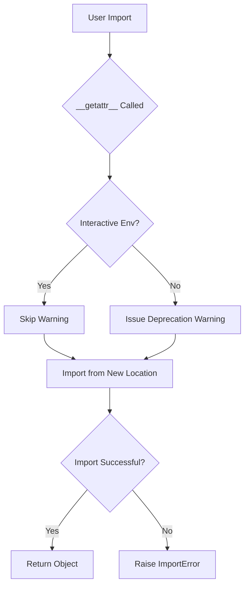
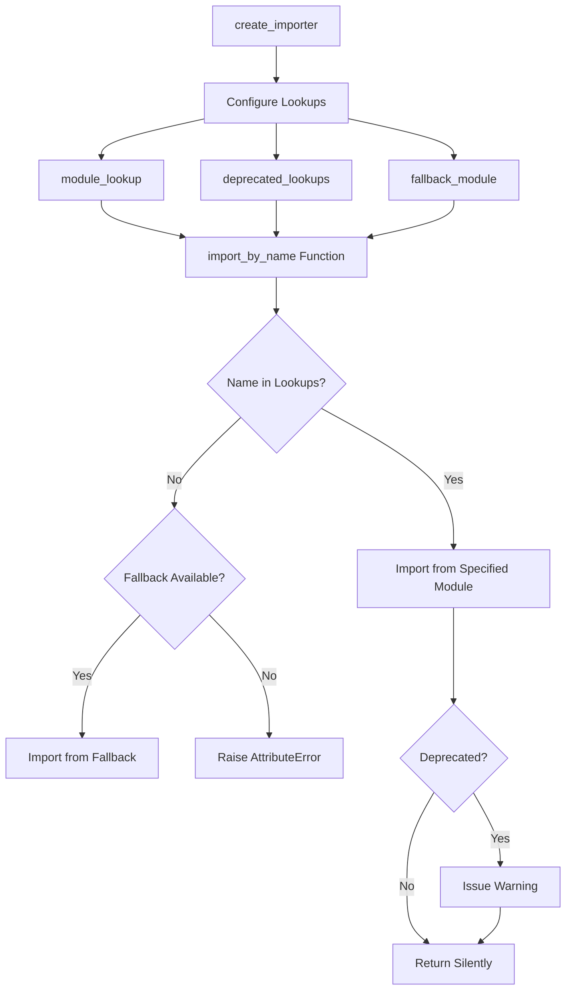
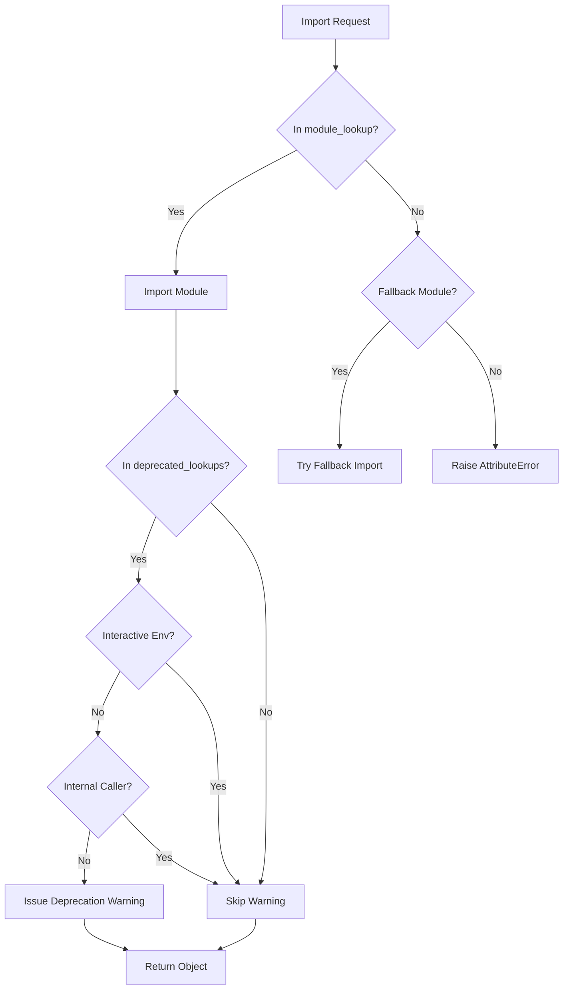
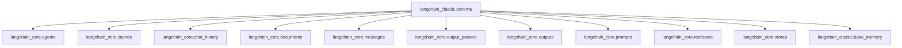
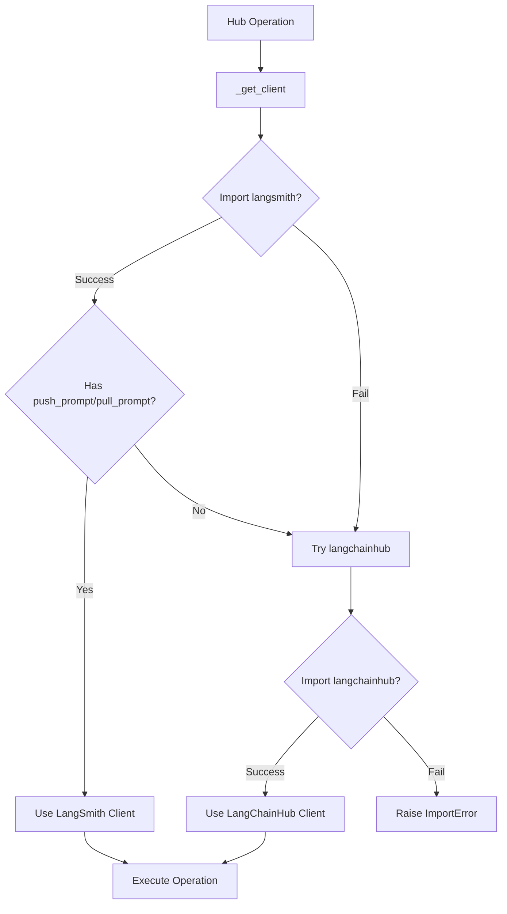
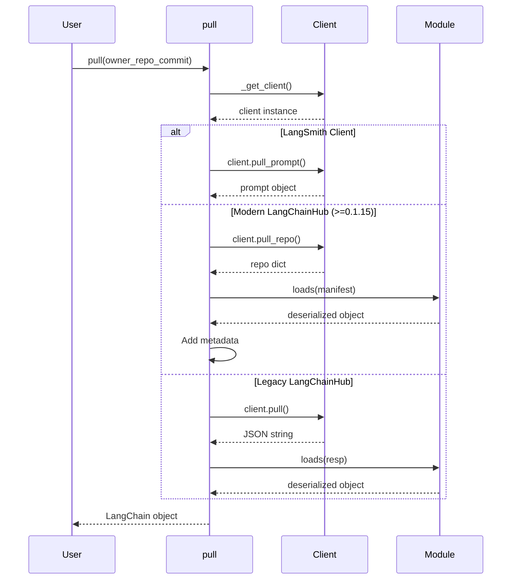

# LangChain Classic (langchain) Package - Architecture Overview

## Introduction

The **LangChain Classic** package (`langchain_classic`) serves as a compatibility and migration layer within the LangChain ecosystem. This package is designed to facilitate the transition from legacy import patterns to the modern, modular architecture where functionality is distributed across specialized packages such as `langchain_core`, `langchain_community`, and provider-specific integration packages. The primary architectural goal is to maintain backward compatibility while guiding users toward updated import paths through a sophisticated deprecation warning system and dynamic import mechanism.

The package acts as a facade that redirects imports to their new locations, ensuring existing codebases continue to function while developers gradually migrate to the recommended import patterns. This architecture enables the LangChain project to evolve its structure without breaking existing implementations.

Sources: [langchain_classic/__init__.py:1-10](../../../libs/langchain/langchain_classic/__init__.py#L1-L10), [pyproject.toml:1-30](../../../libs/langchain/pyproject.toml#L1-L30)

## Package Structure and Dependencies

### Core Dependencies

The `langchain_classic` package maintains a minimal set of core dependencies while providing optional integrations with various LLM providers. The package requires Python 3.10 or higher and depends on several foundational libraries:

| Dependency | Version Constraint | Purpose |
|------------|-------------------|---------|
| `langchain-core` | >=1.2.31,<2.0.0 | Core abstractions and interfaces |
| `langchain-text-splitters` | >=1.1.2,<2.0.0 | Text processing utilities |
| `langsmith` | >=0.1.17,<1.0.0 | Hub integration and tracing |
| `pydantic` | >=2.7.4,<3.0.0 | Data validation and serialization |
| `SQLAlchemy` | >=1.4.0,<3.0.0 | Database abstractions |
| `requests` | >=2.0.0,<3.0.0 | HTTP client functionality |
| `PyYAML` | >=5.3.0,<7.0.0 | Configuration parsing |

Sources: [pyproject.toml:20-28](../../../libs/langchain/pyproject.toml#L20-L28)

### Optional Provider Integrations

The package offers optional dependencies for various LLM providers through an extras system:

```toml
[project.optional-dependencies]
anthropic = ["langchain-anthropic"]
openai = ["langchain-openai"]
google-vertexai = ["langchain-google-vertexai"]
google-genai = ["langchain-google-genai"]
fireworks = ["langchain-fireworks"]
ollama = ["langchain-ollama"]
together = ["langchain-together"]
mistralai = ["langchain-mistralai"]
huggingface = ["langchain-huggingface"]
groq = ["langchain-groq"]
aws = ["langchain-aws"]
```

Sources: [pyproject.toml:31-46](../../../libs/langchain/pyproject.toml#L31-L46)

## Dynamic Import Architecture

### Import Redirection Mechanism

The core architectural pattern of `langchain_classic` is its dynamic import system, implemented through Python's `__getattr__` magic method at the module level. This allows the package to intercept attribute access and redirect imports to their new locations while issuing appropriate deprecation warnings.



The import redirection handles multiple categories of components:

1. **Agent Chains**: MRKLChain, ReActChain, SelfAskWithSearchChain
2. **Standard Chains**: ConversationChain, LLMChain, LLMCheckerChain, LLMMathChain
3. **QA Chains**: QAWithSourcesChain, VectorDBQA, VectorDBQAWithSourcesChain
4. **LLM Providers**: OpenAI, Anthropic, Cohere, HuggingFaceHub, and others
5. **Utilities**: Various API wrappers and database connectors
6. **Vector Stores**: FAISS, ElasticVectorSearch
7. **Prompt Templates**: PromptTemplate, FewShotPromptTemplate, BasePromptTemplate

Sources: [langchain_classic/__init__.py:36-358](../../../libs/langchain/langchain_classic/__init__.py#L36-L358)

### Interactive Environment Detection

The package implements special handling for interactive environments (such as Jupyter notebooks or IPython shells) to avoid polluting auto-complete suggestions with deprecation warnings:

```python
def _warn_on_import(name: str, replacement: str | None = None) -> None:
    """Warn on import of deprecated module."""
    from langchain_classic._api.interactive_env import is_interactive_env

    if is_interactive_env():
        # No warnings for interactive environments.
        return
```

This design decision prioritizes developer experience in exploratory contexts while still providing guidance in production code.

Sources: [langchain_classic/__init__.py:18-31](../../../libs/langchain/langchain_classic/__init__.py#L18-L31)

## Module Import System

### Import Factory Pattern

The `module_import.py` file implements a factory pattern for creating custom import functions that handle deprecation and redirection logic. The `create_importer` function generates specialized import handlers based on configuration:



The system enforces security constraints by only allowing imports from approved top-level packages:

```python
ALLOWED_TOP_LEVEL_PKGS = {
    "langchain_community",
    "langchain_core",
    "langchain_classic",
}
```

Sources: [langchain_classic/_api/module_import.py:1-15](../../../libs/langchain/langchain_classic/_api/module_import.py#L1-L15), [langchain_classic/_api/module_import.py:18-56](../../../libs/langchain/langchain_classic/_api/module_import.py#L18-L56)

### Deprecation Warning Flow

The import system implements a sophisticated deprecation warning mechanism that considers caller context:



The warning includes detailed migration guidance:

```python
warn_deprecated(
    since="0.1",
    pending=False,
    removal="1.0",
    message=(
        f"Importing {name} from {package} is deprecated. "
        f"Please replace deprecated imports:\n\n"
        f">> from {package} import {name}\n\n"
        "with new imports of:\n\n"
        f">> from {new_module} import {name}\n"
        "You can use the langchain cli to **automatically** "
        "upgrade many imports. Please see documentation here "
        "<https://python.langchain.com/docs/versions/v0_2/>"
    ),
)
```

Sources: [langchain_classic/_api/module_import.py:57-95](../../../libs/langchain/langchain_classic/_api/module_import.py#L57-L95), [langchain_classic/_api/module_import.py:96-132](../../../libs/langchain/langchain_classic/_api/module_import.py#L96-L132)

## Deprecation Management System

### Deprecation API

The package provides a comprehensive deprecation API through the `deprecation.py` module, which re-exports functionality from `langchain_core` while adding LangChain-specific deprecation messages:

| Component | Purpose |
|-----------|---------|
| `LangChainDeprecationWarning` | Warning class for deprecated features |
| `LangChainPendingDeprecationWarning` | Warning class for features planned for deprecation |
| `deprecated` | Decorator for marking deprecated functions/classes |
| `warn_deprecated` | Function to issue deprecation warnings |
| `suppress_langchain_deprecation_warning` | Context manager to suppress warnings |
| `surface_langchain_deprecation_warnings` | Enable deprecation warnings |

Sources: [langchain_classic/_api/deprecation.py:1-11](../../../libs/langchain/langchain_classic/_api/deprecation.py#L1-L11)

### Agent Deprecation Strategy

The package includes a specific deprecation message for agent-related functionality, guiding users toward the newer LangGraph framework:

```python
AGENT_DEPRECATION_WARNING = (
    "LangChain agents will continue to be supported, but it is recommended for new "
    "use cases to be built with LangGraph. LangGraph offers a more flexible and "
    "full-featured framework for building agents, including support for "
    "tool-calling, persistence of state, and human-in-the-loop workflows. For "
    "details, refer to the "
    "[LangGraph documentation](https://langchain-ai.github.io/langgraph/)"
    " as well as guides for "
    "[Migrating from AgentExecutor](https://python.langchain.com/docs/how_to/migrate_agent/)"
    " and LangGraph's "
    "[Pre-built ReAct agent](https://langchain-ai.github.io/langgraph/how-tos/create-react-agent/)."
)
```

This demonstrates a strategic approach to deprecation that not only warns about deprecated features but also provides clear migration paths and alternative solutions.

Sources: [langchain_classic/_api/deprecation.py:13-26](../../../libs/langchain/langchain_classic/_api/deprecation.py#L13-L26)

## Schema Compatibility Layer

### Schema Re-exports

The `schema/__init__.py` module serves as a compatibility layer that re-exports core abstractions from `langchain_core` while maintaining the legacy import paths. This architecture ensures that existing code using `from langchain_classic.schema import X` continues to function:



Key schema components exposed include:

| Component Category | Exported Classes |
|-------------------|------------------|
| Agents | `AgentAction`, `AgentFinish` |
| Messages | `AIMessage`, `HumanMessage`, `SystemMessage`, `ChatMessage`, `FunctionMessage` |
| Documents | `Document`, `BaseDocumentTransformer` |
| Output Parsers | `BaseOutputParser`, `BaseLLMOutputParser`, `StrOutputParser` |
| Outputs | `Generation`, `ChatGeneration`, `LLMResult`, `ChatResult`, `RunInfo` |
| Prompts | `BasePromptTemplate`, `PromptValue` |
| Retrievers | `BaseRetriever` |
| Memory | `BaseMemory` (aliased as `Memory`) |

Sources: [langchain_classic/schema/__init__.py:1-80](../../../libs/langchain/langchain_classic/schema/__init__.py#L1-L80)

### Backward Compatibility Aliases

The schema module maintains backward compatibility through aliasing:

```python
# Backwards compatibility.
Memory = BaseMemory
_message_to_dict = message_to_dict
```

This pattern allows legacy code to continue functioning while new code can use the updated naming conventions.

Sources: [langchain_classic/schema/__init__.py:33-36](../../../libs/langchain/langchain_classic/schema/__init__.py#L33-L36)

## Hub Integration Architecture

### LangChain Hub Client System

The `hub.py` module provides integration with the LangChain Hub (now part of LangSmith) for sharing and retrieving prompts and other LangChain objects. The architecture implements a fallback mechanism to support both modern (`langsmith`) and legacy (`langchainhub`) clients:



Sources: [langchain_classic/hub.py:1-50](../../../libs/langchain/langchain_classic/hub.py#L1-L50)

### Push Operation

The `push` function uploads LangChain objects to the hub with support for metadata and versioning:

```python
def push(
    repo_full_name: str,
    object: Any,
    *,
    api_url: str | None = None,
    api_key: str | None = None,
    parent_commit_hash: str | None = None,
    new_repo_is_public: bool = False,
    new_repo_description: str | None = None,
    readme: str | None = None,
    tags: Sequence[str] | None = None,
) -> str:
```

The function adapts to the available client implementation:

- **LangSmith client**: Uses `client.push_prompt()` with full parameter support
- **Legacy client**: Uses `client.push()` with JSON serialization via `dumps(object)`

Sources: [langchain_classic/hub.py:52-105](../../../libs/langchain/langchain_classic/hub.py#L52-L105)

### Pull Operation

The `pull` function retrieves objects from the hub with support for model inclusion control:



The pull operation enriches prompt templates with metadata when using the modern LangChainHub client:

```python
if isinstance(obj, BasePromptTemplate):
    if obj.metadata is None:
        obj.metadata = {}
    obj.metadata["lc_hub_owner"] = res_dict["owner"]
    obj.metadata["lc_hub_repo"] = res_dict["repo"]
    obj.metadata["lc_hub_commit_hash"] = res_dict["commit_hash"]
```

Sources: [langchain_classic/hub.py:108-157](../../../libs/langchain/langchain_classic/hub.py#L108-L157)

## Version Management and Metadata

### Package Version Handling

The package implements robust version detection with fallback handling for cases where package metadata is unavailable:

```python
try:
    __version__ = metadata.version(__package__)
except metadata.PackageNotFoundError:
    # Case where package metadata is not available.
    __version__ = ""
del metadata  # optional, avoids polluting the results of dir(__package__)
```

This pattern ensures the package remains functional even in development environments or unusual deployment scenarios where standard package metadata might not be accessible.

Sources: [langchain_classic/__init__.py:5-13](../../../libs/langchain/langchain_classic/__init__.py#L5-L13)

### Deprecation Warning Surface Control

The package explicitly enables deprecation warnings at import time to ensure users receive migration guidance:

```python
# Surfaces Deprecation and Pending Deprecation warnings from langchain_classic.
surface_langchain_deprecation_warnings()
```

This architectural decision prioritizes developer awareness of deprecated patterns over silent backward compatibility.

Sources: [langchain_classic/__init__.py:33-34](../../../libs/langchain/langchain_classic/__init__.py#L33-L34)

## Testing and Development Infrastructure

### Test Configuration

The package maintains comprehensive test configuration through pytest with specific markers and filters:

```python
[tool.pytest.ini_options]
addopts = "--strict-markers --strict-config --durations=5 --snapshot-warn-unused -vv"
markers = [
    "requires: mark tests as requiring a specific library",
    "scheduled: mark tests to run in scheduled testing",
    "compile: mark placeholder test used to compile integration tests without running them",
]
asyncio_mode = "auto"
filterwarnings = [
    "ignore::langchain_core._api.beta_decorator.LangChainBetaWarning",
    "ignore::langchain_core._api.deprecation.LangChainDeprecationWarning:tests",
    "ignore::langchain_core._api.deprecation.LangChainPendingDeprecationWarning:tests",
]
```

The configuration explicitly suppresses deprecation warnings in tests to avoid noise while testing deprecated functionality.

Sources: [pyproject.toml:194-208](../../../libs/langchain/pyproject.toml#L194-L208)

### Development Dependencies

The package defines multiple dependency groups for different development scenarios:

| Group | Purpose | Key Dependencies |
|-------|---------|------------------|
| `test` | Unit testing | pytest, pytest-asyncio, pytest-mock, numpy |
| `test_integration` | Integration testing | vcrpy, python-dotenv, langchainhub |
| `lint` | Code quality | ruff |
| `typing` | Type checking | mypy, types-* packages |
| `dev` | Development tools | jupyter, playwright |

Sources: [pyproject.toml:49-104](../../../libs/langchain/pyproject.toml#L49-L104)

## Code Quality and Style Enforcement

### Ruff Configuration

The package uses Ruff for linting with extensive rule selection and specific ignores:

```toml
[tool.ruff.lint]
select = [ "ALL",]
ignore = [
    "C90",     # McCabe complexity
    "COM812",  # Messes with the formatter
    "FIX002",  # Line contains TODO
    "PERF203", # Rarely useful
    "PLR09",   # Too many something (arg, statements, etc)
    "RUF012",  # Doesn't play well with Pydantic
    "TC001",   # Doesn't play well with Pydantic
    "TD002",   # Missing author in TODO
    "TD003",   # Missing issue link in TODO
]
```

Special per-file ignores accommodate test code and examples:

```toml
[tool.ruff.lint.extend-per-file-ignores]
"tests/**/*.py" = [
    "D1",      # Docstrings not mandatory in tests
    "S101",    # Tests need assertions
    "S311",    # Standard pseudo-random generators
    "SLF001",  # Private member access in tests
    "PLR2004", # Magic value comparisons
]
```

Sources: [pyproject.toml:135-181](../../../libs/langchain/pyproject.toml#L135-L181)

### Type Checking Configuration

MyPy is configured for strict type checking with pragmatic exceptions:

```toml
[tool.mypy]
plugins = ["pydantic.mypy"]
strict = true
ignore_missing_imports = true
enable_error_code = "deprecated"
warn_unreachable = true

# TODO: activate for 'strict' checking
disallow_any_generics = false
warn_return_any = false
```

This configuration balances type safety with practical considerations for a package that interfaces with many external dependencies.

Sources: [pyproject.toml:122-132](../../../libs/langchain/pyproject.toml#L122-L132)

## Summary

The LangChain Classic package represents a sophisticated architectural approach to managing the evolution of a large Python framework. Through dynamic imports, selective deprecation warnings, and comprehensive compatibility layers, it enables seamless migration from legacy patterns to modern, modular architecture. The package's design prioritizes developer experience by suppressing warnings in interactive environments, providing detailed migration guidance, and maintaining full backward compatibility while encouraging adoption of best practices. This architecture serves as an effective bridge between LangChain's past and future, allowing the ecosystem to evolve without disrupting existing implementations.