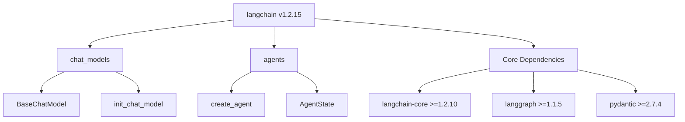
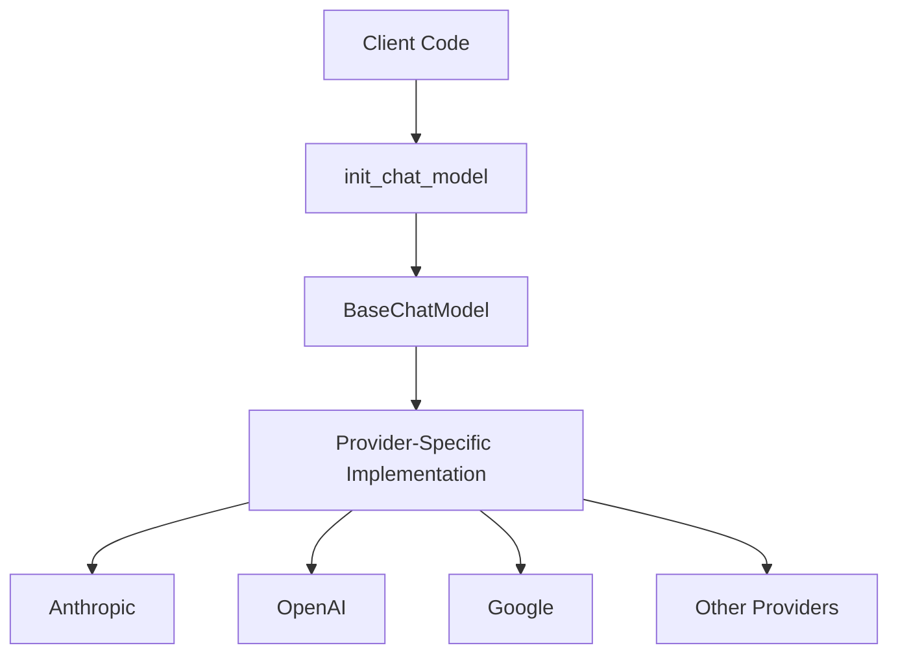
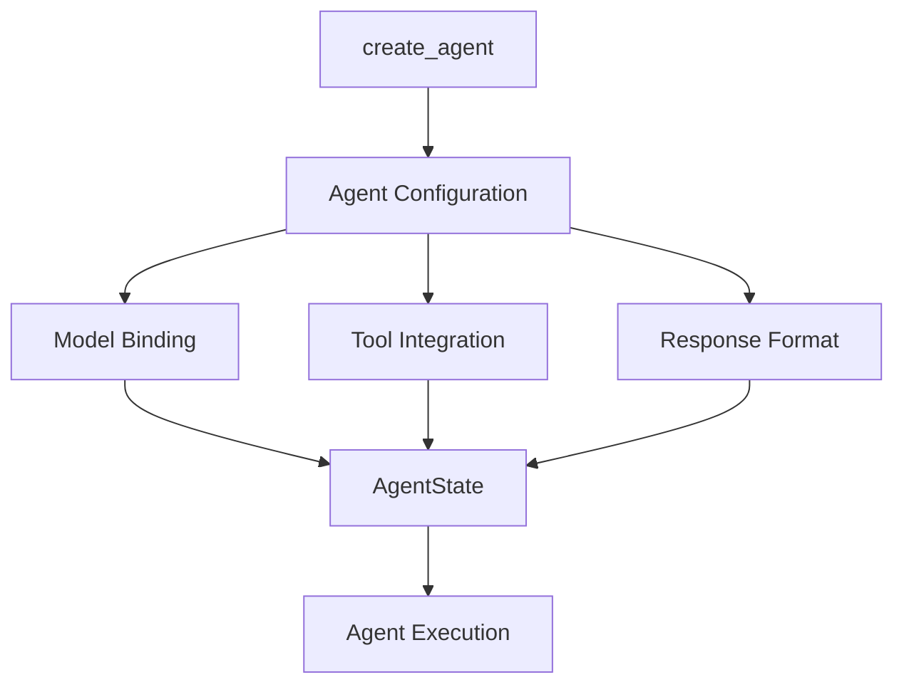
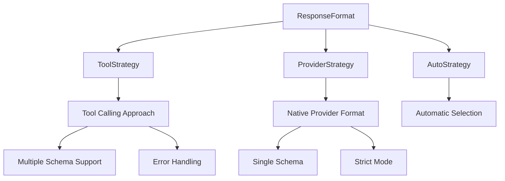
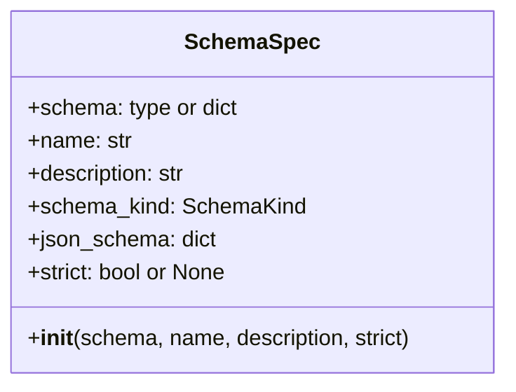
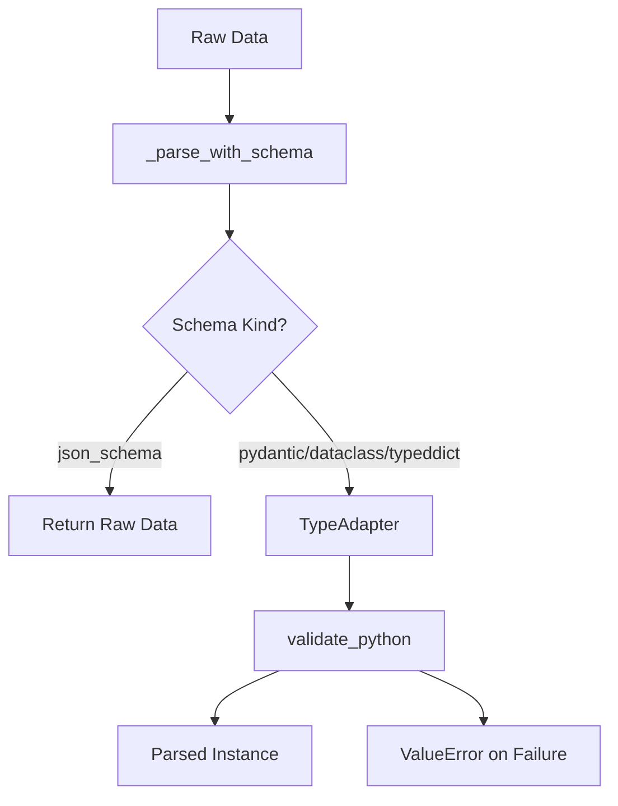
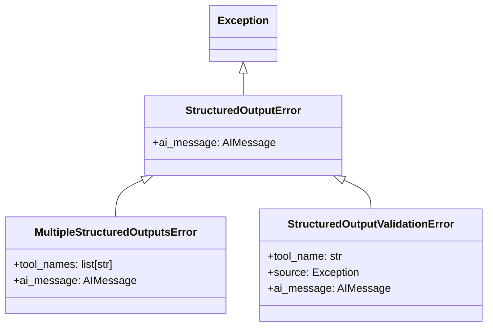
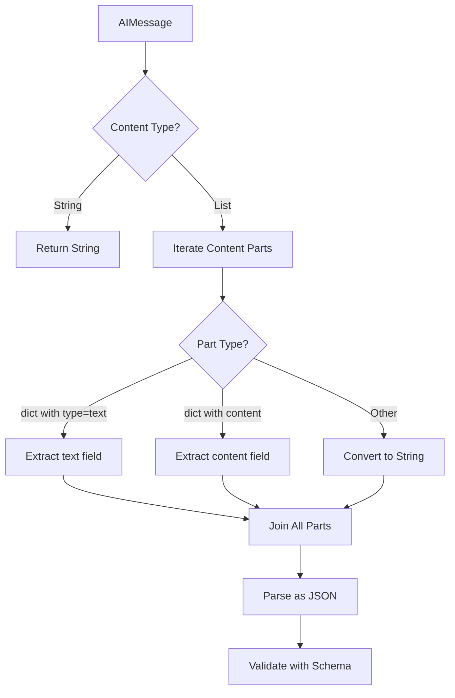

# LangChain v1 Package & Agent Framework - Architecture Overview

The LangChain v1 package serves as the main entrypoint for building LLM-powered applications with composable components, agents, and integrations. Version 1.2.15 provides a production-stable framework that orchestrates chat models, agent creation, and structured output handling through a modular architecture. The package leverages core dependencies including `langchain-core` (>=1.2.10), `langgraph` (>=1.1.5), and `pydantic` (>=2.7.4) to deliver a comprehensive agent framework with flexible model provider integrations and robust error handling capabilities.

Sources: [langchain/__init__.py:3](../../../libs/langchain_v1/langchain/__init__.py#L3), [pyproject.toml:21-27](../../../libs/langchain_v1/pyproject.toml#L21-L27)

## Package Structure and Dependencies

### Core Package Organization

The LangChain v1 package is organized into specialized modules that expose specific functionality through well-defined entrypoints:



Sources: [langchain/__init__.py:1-4](../../../libs/langchain_v1/langchain/__init__.py#L1-L4), [langchain/chat_models/__init__.py:1-7](../../../libs/langchain_v1/langchain/chat_models/__init__.py#L1-L7), [langchain/agents/__init__.py:1-9](../../../libs/langchain_v1/langchain/agents/__init__.py#L1-L9)

### Optional Provider Integrations

The package supports a wide range of optional LLM provider integrations through modular dependencies:

| Provider | Package | Purpose |
|----------|---------|---------|
| Anthropic | langchain-anthropic | Claude model integration |
| OpenAI | langchain-openai | GPT model integration |
| Google Vertex AI | langchain-google-vertexai | Google Cloud AI integration |
| Google GenAI | langchain-google-genai | Google Generative AI integration |
| AWS | langchain-aws | Amazon Bedrock integration |
| Mistral AI | langchain-mistralai | Mistral model integration |
| Groq | langchain-groq | Groq inference integration |
| Ollama | langchain-ollama | Local model integration |
| HuggingFace | langchain-huggingface | HuggingFace model integration |
| Fireworks | langchain-fireworks | Fireworks AI integration |
| Together | langchain-together | Together AI integration |
| Baseten | langchain-baseten | Baseten deployment integration |
| DeepSeek | langchain-deepseek | DeepSeek model integration |
| xAI | langchain-xai | xAI (Grok) integration |
| Perplexity | langchain-perplexity | Perplexity AI integration |

Sources: [pyproject.toml:30-47](../../../libs/langchain_v1/pyproject.toml#L30-L47)

### Development and Testing Infrastructure

The package includes comprehensive development dependencies organized into dependency groups:

- **test**: pytest suite with async support, mocking, benchmarking, and snapshot testing
- **lint**: ruff for code linting and formatting
- **typing**: mypy for static type checking with strict mode enabled
- **test_integration**: VCR for HTTP interaction recording and langchainhub integration

Sources: [pyproject.toml:58-85](../../../libs/langchain_v1/pyproject.toml#L58-L85)

## Chat Models Architecture

The chat models module provides a unified interface for interacting with various LLM providers through the `BaseChatModel` abstraction and the `init_chat_model` factory function.



The `BaseChatModel` class from `langchain-core` serves as the base abstraction for all chat model implementations, ensuring a consistent interface across different providers. The `init_chat_model` factory function handles the instantiation and configuration of specific chat model instances based on provider selection.

Sources: [langchain/chat_models/__init__.py:3-7](../../../libs/langchain_v1/langchain/chat_models/__init__.py#L3-L7)

## Agent Framework

### Agent Creation and State Management

The agent framework centers around two primary exports: `create_agent` for constructing agent instances and `AgentState` for managing agent execution state.



Sources: [langchain/agents/__init__.py:3-9](../../../libs/langchain_v1/langchain/agents/__init__.py#L3-L9)

### Structured Output Framework

The structured output system provides multiple strategies for enforcing response schemas from LLM interactions. This framework supports Pydantic models, dataclasses, TypedDicts, and JSON schema dictionaries.

#### Schema Type Support

| Schema Type | SchemaKind | Description |
|-------------|-----------|-------------|
| Pydantic BaseModel | `"pydantic"` | Pydantic v2 models with full validation |
| Dataclass | `"dataclass"` | Python dataclasses with type hints |
| TypedDict | `"typeddict"` | Typed dictionary structures |
| JSON Schema Dict | `"json_schema"` | Raw JSON schema dictionaries |

Sources: [langchain/agents/structured_output.py:29-31](../../../libs/langchain_v1/langchain/agents/structured_output.py#L29-L31), [langchain/agents/structured_output.py:127-141](../../../libs/langchain_v1/langchain/agents/structured_output.py#L127-L141)

#### Response Format Strategies

The framework implements three distinct strategies for structured output:



Sources: [langchain/agents/structured_output.py:373](../../../libs/langchain_v1/langchain/agents/structured_output.py#L373)

##### ToolStrategy

The `ToolStrategy` uses artificial tool calls to enforce structured output. This approach converts schemas into LangChain tools that the model can invoke:

**Key Features:**
- Supports Union types and multiple schema variants
- Configurable error handling with retry logic
- Custom tool message content
- Automatic schema expansion from Union types and JSON Schema `oneOf`

**Error Handling Options:**

| Configuration | Behavior |
|--------------|----------|
| `True` | Catch all errors with default template |
| `str` | Catch all errors with custom message |
| `type[Exception]` | Only catch specific exception type |
| `tuple[type[Exception], ...]` | Catch multiple exception types |
| `Callable[[Exception], str]` | Custom error message function |
| `False` | No retry, propagate exceptions |

Sources: [langchain/agents/structured_output.py:183-244](../../../libs/langchain_v1/langchain/agents/structured_output.py#L183-L244)

##### ProviderStrategy

The `ProviderStrategy` leverages native provider-side structured output enforcement, primarily designed for OpenAI's structured output API:

```python
# Model kwargs format for OpenAI structured outputs
{
    "response_format": {
        "type": "json_schema",
        "json_schema": {
            "name": schema_name,
            "schema": json_schema_dict,
            "strict": True  # Optional strict mode
        }
    }
}
```

This strategy supports strict schema enforcement when the provider offers it, ensuring the model's output conforms exactly to the specified schema.

Sources: [langchain/agents/structured_output.py:246-283](../../../libs/langchain_v1/langchain/agents/structured_output.py#L246-L283)

##### AutoStrategy

The `AutoStrategy` automatically selects the optimal structured output approach based on model capabilities and schema requirements.

Sources: [langchain/agents/structured_output.py:363-371](../../../libs/langchain_v1/langchain/agents/structured_output.py#L363-L371)

### Schema Specification and Parsing

#### SchemaSpec Class

The internal `_SchemaSpec` class encapsulates all metadata about a structured output schema:



The class automatically:
- Detects schema type (Pydantic, dataclass, TypedDict, JSON schema)
- Generates appropriate names from class names or JSON schema titles
- Extracts descriptions from docstrings or schema metadata
- Converts all schema types to JSON schema format

Sources: [langchain/agents/structured_output.py:89-141](../../../libs/langchain_v1/langchain/agents/structured_output.py#L89-L141)

#### Schema Parsing Flow



The `_parse_with_schema` function provides unified parsing logic across all schema types using Pydantic's `TypeAdapter` for validation.

Sources: [langchain/agents/structured_output.py:33-58](../../../libs/langchain_v1/langchain/agents/structured_output.py#L33-L58)

### Error Handling Architecture

The framework defines a hierarchy of specialized exceptions for structured output failures:



**Exception Types:**

- **StructuredOutputError**: Base class containing the problematic `AIMessage`
- **MultipleStructuredOutputsError**: Raised when model returns multiple tool calls for single-schema expectations
- **StructuredOutputValidationError**: Raised when tool call arguments fail schema validation

Sources: [langchain/agents/structured_output.py:34-67](../../../libs/langchain_v1/langchain/agents/structured_output.py#L34-L67)

### Output Binding Metadata

#### OutputToolBinding

The `OutputToolBinding` class tracks metadata for tool-based structured output:

```python
@dataclass
class OutputToolBinding(Generic[SchemaT]):
    schema: type[SchemaT] | dict[str, Any]
    schema_kind: SchemaKind
    tool: BaseTool
```

This binding:
- Preserves the original schema for type safety
- Classifies the schema type for proper response construction
- Creates a `StructuredTool` instance for model binding
- Provides a `parse()` method for converting tool arguments to schema instances

Sources: [langchain/agents/structured_output.py:286-337](../../../libs/langchain_v1/langchain/agents/structured_output.py#L286-L337)

#### ProviderStrategyBinding

The `ProviderStrategyBinding` class tracks metadata for native provider output:

```python
@dataclass
class ProviderStrategyBinding(Generic[SchemaT]):
    schema: type[SchemaT] | dict[str, Any]
    schema_kind: SchemaKind
```

This binding:
- Stores schema and classification information
- Implements `parse()` to extract and validate JSON from `AIMessage` content
- Handles both string and structured content formats
- Performs JSON parsing followed by schema validation

Sources: [langchain/agents/structured_output.py:340-413](../../../libs/langchain_v1/langchain/agents/structured_output.py#L340-L413)

### Native Provider Response Parsing

The `ProviderStrategyBinding` implements sophisticated message content extraction:



This multi-format content extraction ensures compatibility with various provider response formats, including simple strings and complex structured content arrays.

Sources: [langchain/agents/structured_output.py:391-413](../../../libs/langchain_v1/langchain/agents/structured_output.py#L391-L413)

## Code Quality and Type Safety

### Static Type Checking Configuration

The package enforces strict type checking with mypy:

```toml
[tool.mypy]
strict = true
enable_error_code = "deprecated"
warn_unreachable = true
```

Specific exclusions are made for agent test files while maintaining strict checking for production code. The configuration disables `warn_return_any` for practical development while maintaining other strict checks.

Sources: [pyproject.toml:105-117](../../../libs/langchain_v1/pyproject.toml#L105-L117)

### Linting and Formatting Standards

The project uses ruff with comprehensive rule selection:

- **Line length**: 100 characters
- **Enabled rules**: ALL (with specific exclusions)
- **Docstring convention**: Google style
- **Import management**: Banned relative imports
- **Code formatting**: Includes docstring code formatting

Key disabled rules include McCabe complexity checks, copyright requirements, and TODO authorship requirements, focusing on practical code quality over bureaucratic requirements.

Sources: [pyproject.toml:95-103](../../../libs/langchain_v1/pyproject.toml#L95-L103), [pyproject.toml:119-161](../../../libs/langchain_v1/pyproject.toml#L119-L161)

## Testing Infrastructure

### Test Configuration

The pytest configuration includes:

```toml
[tool.pytest.ini_options]
addopts = "--strict-markers --strict-config --durations=5 --snapshot-warn-unused -vv"
asyncio_mode = "auto"
```

**Custom Test Markers:**
- `requires`: Mark tests requiring specific libraries
- `scheduled`: Mark tests for scheduled CI runs
- `compile`: Placeholder tests for integration test compilation
- `benchmark`: Mark performance benchmark tests

The configuration filters warnings from LangChain's beta and deprecation decorators in test code.

Sources: [pyproject.toml:163-176](../../../libs/langchain_v1/pyproject.toml#L163-L176)

### Coverage Configuration

Code coverage excludes test files from analysis, focusing metrics on production code quality.

Sources: [pyproject.toml:161](../../../libs/langchain_v1/pyproject.toml#L161)

## Build System and Distribution

The package uses hatchling as the build backend and targets Python 3.10 through 3.14. The project is distributed under the MIT license with a Production/Stable development status classification.

**Python Version Support:**
- Minimum: Python 3.10.0
- Maximum: Python 3.14 (exclusive of 4.0.0)

**Project URLs:**
- Homepage: https://docs.langchain.com/
- Documentation: https://reference.langchain.com/python/langchain/langchain/
- Repository: https://github.com/langchain-ai/langchain
- Issues: https://github.com/langchain-ai/langchain/issues
- Changelog: GitHub releases tagged with "langchain==1"

Sources: [pyproject.toml:1-56](../../../libs/langchain_v1/pyproject.toml#L1-L56)

## Summary

The LangChain v1 package provides a production-ready framework for building LLM-powered applications with a focus on modularity, type safety, and flexible provider integration. The agent framework's structured output system offers three distinct strategies (tool-based, provider-native, and automatic) for enforcing response schemas, supporting multiple schema types including Pydantic models, dataclasses, TypedDicts, and JSON schemas. The package maintains strict code quality standards through comprehensive type checking, linting, and testing infrastructure while providing extensive optional integrations with major LLM providers. This architecture enables developers to build robust agent-based applications with strong guarantees around response formatting and error handling.

Sources: [langchain/__init__.py](../../../libs/langchain_v1/langchain/__init__.py), [langchain/agents/__init__.py](../../../libs/langchain_v1/langchain/agents/__init__.py), [langchain/agents/structured_output.py](../../../libs/langchain_v1/langchain/agents/structured_output.py), [langchain/chat_models/__init__.py](../../../libs/langchain_v1/langchain/chat_models/__init__.py), [pyproject.toml](../../../libs/langchain_v1/pyproject.toml)