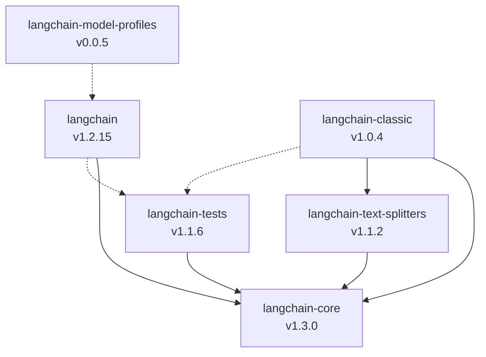
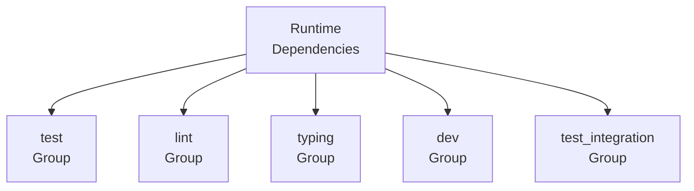

# Repository Structure & Package Organization

The LangChain repository is organized as a monorepo containing multiple Python packages under the `libs/` directory. This modular architecture separates core functionality, text processing utilities, integration packages, and testing infrastructure into distinct, independently versioned packages. Each package is designed to be composable, allowing users to install only the components they need while maintaining clear dependency relationships between packages.

The repository uses modern Python packaging standards with `pyproject.toml` configuration files and `uv` for dependency management. A centralized Makefile coordinates operations across all packages, enabling consistent lockfile management and verification workflows. This structure supports the framework's goal of building LLM-powered applications through composable components while maintaining production-grade stability and clear separation of concerns.

Sources: [libs/Makefile](../../../libs/Makefile)

## Core Package Structure

The LangChain repository is organized into six primary packages within the `libs/` directory, each serving a distinct purpose in the framework's architecture:

| Package | PyPI Name | Version | Description |
|---------|-----------|---------|-------------|
| `core` | `langchain-core` | 1.3.0 | Core abstractions and base classes for building LLM applications |
| `text-splitters` | `langchain-text-splitters` | 1.1.2 | Text splitting utilities for document processing |
| `langchain` | `langchain-classic` | 1.0.4 | Legacy classic LangChain package |
| `langchain_v1` | `langchain` | 1.2.15 | Modern LangChain v1 package with agent support |
| `standard-tests` | `langchain-tests` | 1.1.6 | Standard test suite for LangChain implementations |
| `model-profiles` | `langchain-model-profiles` | 0.0.5 | CLI tool for managing model profile data |

Sources: [libs/core/pyproject.toml:7-8](../../../libs/core/pyproject.toml#L7-L8), [libs/text-splitters/pyproject.toml:7-8](../../../libs/text-splitters/pyproject.toml#L7-L8), [libs/langchain/pyproject.toml:7-8](../../../libs/langchain/pyproject.toml#L7-L8), [libs/langchain_v1/pyproject.toml:7-8](../../../libs/langchain_v1/pyproject.toml#L7-L8), [libs/standard-tests/pyproject.toml:7-8](../../../libs/standard-tests/pyproject.toml#L7-L8), [libs/model-profiles/pyproject.toml:7-8](../../../libs/model-profiles/pyproject.toml#L7-L8)



The diagram above illustrates the dependency relationships between packages, where solid lines represent runtime dependencies and dotted lines represent development/test dependencies.

Sources: [libs/core/pyproject.toml:18-28](../../../libs/core/pyproject.toml#L18-L28), [libs/text-splitters/pyproject.toml:24-26](../../../libs/text-splitters/pyproject.toml#L24-L26), [libs/langchain_v1/pyproject.toml:21-25](../../../libs/langchain_v1/pyproject.toml#L21-L25)

## Package Dependency Management

### UV Lockfile Management

The repository uses `uv` as the package manager for dependency resolution and lockfile management. A centralized Makefile in the `libs/` directory provides targets for coordinating lockfile operations across all core packages:

```makefile
LANGCHAIN_DIRS = core text-splitters langchain langchain_v1 model-profiles

# Regenerate lockfiles for all core packages
lock:
	@for dir in $(LANGCHAIN_DIRS); do \
		echo "=== Locking $$dir ==="; \
		(cd $$dir && uv lock); \
	done

# Verify all lockfiles are up-to-date
check-lock:
	@for dir in $(LANGCHAIN_DIRS); do \
		echo "=== Checking $$dir ==="; \
		(cd $$dir && uv lock --check) || exit 1; \
	done
```

The `lock` target regenerates lockfiles for all packages, while `check-lock` verifies that existing lockfiles are synchronized with their respective `pyproject.toml` files. This ensures consistent dependency resolution across the monorepo.

Sources: [libs/Makefile:1-18](../../../libs/Makefile#L1-L18)

### Inter-Package Path Dependencies

Packages within the monorepo reference each other using editable path dependencies defined in the `[tool.uv.sources]` section. This allows local development without requiring package installation from PyPI:

```toml
[tool.uv.sources]
langchain-core = { path = "../core", editable = true }
langchain-tests = { path = "../standard-tests", editable = true }
langchain-text-splitters = { path = "../text-splitters", editable = true }
langchain-openai = { path = "../partners/openai", editable = true }
```

This configuration enables developers to work on multiple packages simultaneously with changes immediately reflected across dependencies.

Sources: [libs/langchain_v1/pyproject.toml:78-82](../../../libs/langchain_v1/pyproject.toml#L78-L82), [libs/langchain/pyproject.toml:112-116](../../../libs/langchain/pyproject.toml#L112-L116), [libs/text-splitters/pyproject.toml:82-83](../../../libs/text-splitters/pyproject.toml#L82-L83)

### Security Constraint Dependencies

All packages enforce security constraints through the `[tool.uv]` configuration to address known vulnerabilities:

| Constraint | Version | Reason |
|------------|---------|--------|
| `urllib3` | `>=2.6.3` | Security vulnerability fix |
| `pygments` | `>=2.20.0` | CVE-2026-4539 mitigation |

Sources: [libs/langchain_v1/pyproject.toml:84-85](../../../libs/langchain_v1/pyproject.toml#L84-L85), [libs/core/pyproject.toml:68](../../../libs/core/pyproject.toml#L68), [libs/text-splitters/pyproject.toml:80](../../../libs/text-splitters/pyproject.toml#L80)

## Core Package Architecture

### langchain-core

The `langchain-core` package serves as the foundation for the entire LangChain ecosystem, providing core abstractions and base classes. It maintains production-stable status (Development Status 5) and supports Python 3.10 through 3.14.

**Key Dependencies:**

```toml
dependencies = [
    "langsmith>=0.3.45,<1.0.0",
    "tenacity!=8.4.0,>=8.1.0,<10.0.0",
    "jsonpatch>=1.33.0,<2.0.0",
    "PyYAML>=5.3.0,<7.0.0",
    "typing-extensions>=4.7.0,<5.0.0",
    "packaging>=23.2.0",
    "pydantic>=2.7.4,<3.0.0",
    "uuid-utils>=0.12.0,<1.0",
]
```

The package requires Pydantic v2 for data validation and uses LangSmith for observability. It explicitly excludes tenacity version 8.4.0 due to known issues.

Sources: [libs/core/pyproject.toml:18-28](../../../libs/core/pyproject.toml#L18-L28), [libs/core/pyproject.toml:6-17](../../../libs/core/pyproject.toml#L6-L17)

### langchain-text-splitters

This package provides specialized utilities for splitting text and documents, essential for processing large documents that exceed LLM context windows. It has minimal dependencies, relying only on `langchain-core`:

```toml
dependencies = [
    "langchain-core>=1.2.31,<2.0.0",
]
```

The package supports optional integrations with NLP libraries through test dependencies, including spaCy, NLTK, transformers, and sentence-transformers for advanced text processing capabilities.

Sources: [libs/text-splitters/pyproject.toml:24-26](../../../libs/text-splitters/pyproject.toml#L24-L26), [libs/text-splitters/pyproject.toml:59-65](../../../libs/text-splitters/pyproject.toml#L59-L65)

### langchain-tests

The `langchain-tests` package provides a standardized test suite for validating LangChain implementations across different integration packages. It includes comprehensive testing utilities:

```toml
dependencies = [
    "langchain-core>=1.2.27,<2.0.0",
    "pytest>=9.0.3,<10.0.0",
    "pytest-asyncio>=1.3.0,<2.0.0",
    "httpx>=0.28.1,<1.0.0",
    "syrupy>=5.0.0,<6.0.0",
    "pytest-socket>=0.7.0,<1.0.0",
    "pytest-benchmark",
    "pytest-codspeed",
    "pytest-recording",
    "vcrpy>=8.0.0,<9.0.0",
    "numpy>=1.26.2; python_version<'3.13'",
    "numpy>=2.1.0; python_version>='3.13'",
]
```

This package enables consistent testing patterns across the entire LangChain ecosystem, including snapshot testing with syrupy, HTTP mocking with vcrpy, and performance benchmarking.

Sources: [libs/standard-tests/pyproject.toml:22-35](../../../libs/standard-tests/pyproject.toml#L22-L35)

## LangChain Package Variants

### langchain-classic vs langchain

The repository maintains two distinct LangChain packages representing different architectural approaches:

| Aspect | langchain-classic | langchain (v1) |
|--------|-------------------|----------------|
| PyPI Name | `langchain-classic` | `langchain` |
| Version | 1.0.4 | 1.2.15 |
| Status | Legacy | Modern |
| Agent Support | Traditional | LangGraph-based |
| Key Dependency | langchain-core, langchain-text-splitters | langchain-core, langgraph |

**langchain (v1)** represents the modern architecture:

```toml
dependencies = [
    "langchain-core>=1.2.10,<2.0.0",
    "langgraph>=1.1.5,<1.2.0",
    "pydantic>=2.7.4,<3.0.0",
]
```

The v1 package integrates LangGraph for advanced agent orchestration, representing the framework's evolution toward more sophisticated agent-based architectures.

Sources: [libs/langchain_v1/pyproject.toml:21-25](../../../libs/langchain_v1/pyproject.toml#L21-L25), [libs/langchain/pyproject.toml:20-28](../../../libs/langchain/pyproject.toml#L20-L28)

### Optional Integration Dependencies

Both LangChain variants provide extensive optional dependencies for various LLM providers:

```toml
[project.optional-dependencies]
anthropic = ["langchain-anthropic"]
openai = ["langchain-openai"]
google-vertexai = ["langchain-google-vertexai"]
google-genai = ["langchain-google-genai"]
fireworks = ["langchain-fireworks"]
ollama = ["langchain-ollama"]
together = ["langchain-together"]
mistralai = ["langchain-mistralai"]
huggingface = ["langchain-huggingface"]
groq = ["langchain-groq"]
aws = ["langchain-aws"]
deepseek = ["langchain-deepseek"]
xai = ["langchain-xai"]
perplexity = ["langchain-perplexity"]
```

This architecture allows users to install only the integrations they need, reducing dependency bloat and installation time.

Sources: [libs/langchain_v1/pyproject.toml:27-43](../../../libs/langchain_v1/pyproject.toml#L27-L43), [libs/langchain/pyproject.toml:31-48](../../../libs/langchain/pyproject.toml#L31-L48)

## Development Tooling Configuration

### Dependency Groups

All packages use PEP 735 dependency groups to organize development, testing, and linting dependencies separately from runtime requirements:



Each group serves a specific purpose in the development workflow:

- **test**: Unit testing frameworks and utilities
- **lint**: Code formatting and linting tools (ruff)
- **typing**: Type checking tools (mypy) and type stubs
- **dev**: Development utilities (Jupyter, setuptools)
- **test_integration**: Integration testing dependencies

Sources: [libs/core/pyproject.toml:40-66](../../../libs/core/pyproject.toml#L40-L66), [libs/langchain_v1/pyproject.toml:60-76](../../../libs/langchain_v1/pyproject.toml#L60-L76)

### Code Quality Standards

All packages enforce strict code quality standards through Ruff and MyPy configurations:

**Ruff Configuration:**

```toml
[tool.ruff.lint]
select = [ "ALL",]
ignore = [
    "C90",     # McCabe complexity
    "COM812",  # Messes with the formatter
    "CPY",     # No copyright
    "FIX002",  # Line contains TODO
    "PERF203", # Rarely useful
    "PLR09",   # Too many something (arg, statements, etc)
    "TD002",   # Missing author in TODO
    "TD003",   # Missing issue link in TODO
]
```

**MyPy Configuration:**

```toml
[tool.mypy]
plugins = ["pydantic.mypy"]
strict = true
enable_error_code = "deprecated"
```

All packages enable strict type checking with Pydantic plugin support, ensuring type safety across the codebase.

Sources: [libs/core/pyproject.toml:73-89](../../../libs/core/pyproject.toml#L73-L89), [libs/core/pyproject.toml:71](../../../libs/core/pyproject.toml#L71)

### Testing Configuration

Pytest is configured consistently across all packages with strict markers and configuration validation:

```toml
[tool.pytest.ini_options]
addopts = "--snapshot-warn-unused --strict-markers --strict-config --durations=5"
markers = [
    "requires: mark tests as requiring a specific library",
    "compile: mark placeholder test used to compile integration tests without running them",
]
asyncio_mode = "auto"
asyncio_default_fixture_loop_scope = "function"
```

The configuration enables automatic async test handling and provides custom markers for conditional test execution based on available dependencies.

Sources: [libs/core/pyproject.toml:109-117](../../../libs/core/pyproject.toml#L109-L117), [libs/standard-tests/pyproject.toml:118-127](../../../libs/standard-tests/pyproject.toml#L118-L127)

## Model Profiles Package

The `langchain-model-profiles` package provides CLI tooling for managing model profile data across LangChain integration packages. As a Beta-status package (Development Status 4), it serves as infrastructure tooling rather than a runtime dependency:

```toml
[project.scripts]
langchain-profiles = "langchain_model_profiles.cli:main"
```

The package provides a command-line interface for updating model profiles, with minimal dependencies focused on HTTP communication and configuration parsing:

```toml
dependencies = [
    "httpx>=0.23.0,<1",
    "tomli>=2.0.0,<3.0.0; python_version < '3.11'",
    "typing-extensions>=4.7.0,<5.0.0",
]
```

The conditional dependency on `tomli` for Python versions before 3.11 reflects the introduction of native TOML support in Python 3.11's standard library.

Sources: [libs/model-profiles/pyproject.toml:18-22](../../../libs/model-profiles/pyproject.toml#L18-L22), [libs/model-profiles/pyproject.toml:6-17](../../../libs/model-profiles/pyproject.toml#L6-L17)

## Package Metadata and Documentation

All packages maintain consistent metadata linking to LangChain's ecosystem resources:

| Resource | URL Pattern |
|----------|-------------|
| Homepage | https://docs.langchain.com/ |
| Documentation | https://reference.langchain.com/python/{package}/ |
| Repository | https://github.com/langchain-ai/langchain |
| Issues | https://github.com/langchain-ai/langchain/issues |
| Changelog | Package-specific GitHub releases |
| Community | Twitter, Slack, Reddit |

Each package provides package-specific changelog URLs that filter releases by package name, enabling users to track version history for individual components:

```toml
[project.urls]
Changelog = "https://github.com/langchain-ai/langchain/releases?q=%22langchain-core%3D%3D1%22"
```

Sources: [libs/core/pyproject.toml:30-38](../../../libs/core/pyproject.toml#L30-L38), [libs/langchain_v1/pyproject.toml:45-53](../../../libs/langchain_v1/pyproject.toml#L45-L53)

## Summary

The LangChain repository's modular package structure provides clear separation of concerns while maintaining strong cohesion through well-defined dependency relationships. The architecture supports independent versioning and deployment of components, enabling users to adopt only the functionality they need. Centralized tooling for dependency management, code quality enforcement, and testing ensures consistency across all packages while allowing each to evolve independently. This design reflects modern Python packaging best practices and supports the framework's goal of building composable LLM applications at production scale.