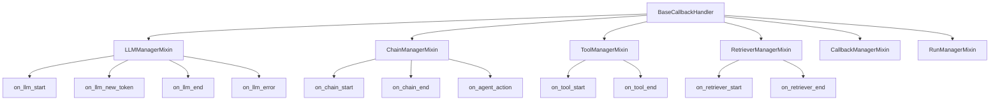
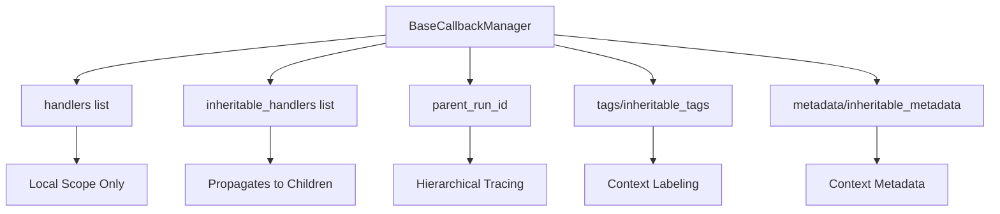
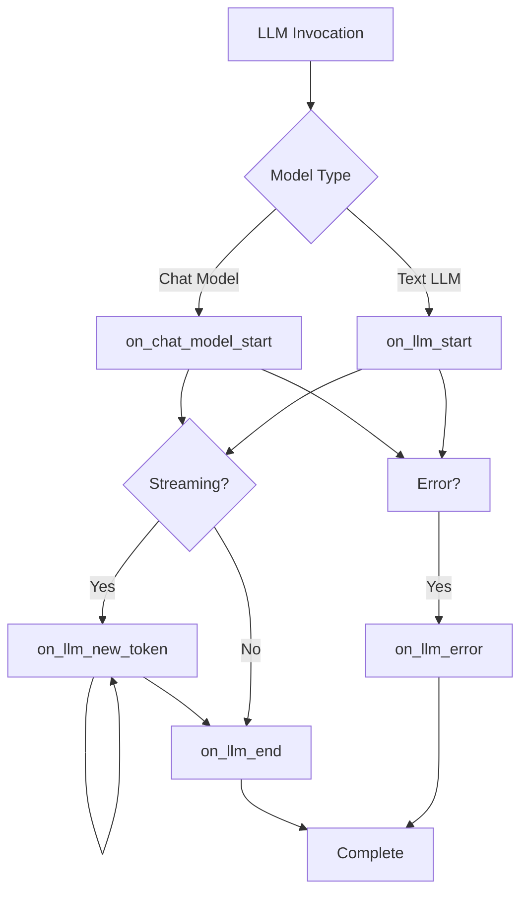
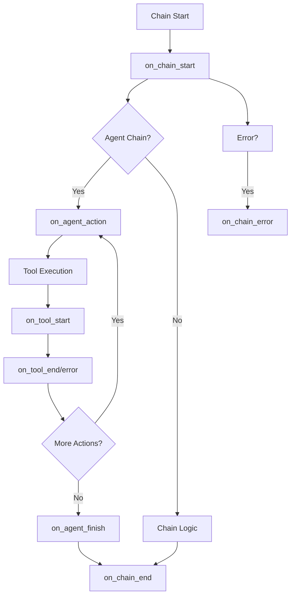
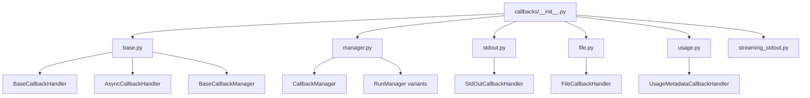

# Callback System Architecture

The LangChain callback system provides a comprehensive mechanism for observing, tracing, and monitoring the execution of LLM-powered applications. This architecture enables developers to listen to events throughout the lifecycle of chains, agents, tools, retrievers, and language models, facilitating debugging, logging, streaming output, and integration with external observability platforms. The callback system is built on a flexible handler-based pattern that supports both synchronous and asynchronous execution modes, with sophisticated run management capabilities for tracking hierarchical execution contexts.

The architecture consists of three primary layers: base callback handlers that define the event interface, callback managers that coordinate handler execution and manage run contexts, and specialized handler implementations for specific use cases such as file logging, console output, and usage tracking.

Sources: [libs/core/langchain_core/callbacks/__init__.py](../../../libs/core/langchain_core/callbacks/__init__.py), [libs/core/langchain_core/callbacks/base.py](../../../libs/core/langchain_core/callbacks/base.py)

## Core Components

### Base Callback Handler

The `BaseCallbackHandler` serves as the foundation of the callback system, defining the complete interface for handling events across all LangChain components. It is composed of multiple mixin classes that organize callbacks by component type:

- **LLMManagerMixin**: Handles LLM-specific events including token streaming, completion, and errors
- **ChainManagerMixin**: Manages chain execution lifecycle events and agent actions
- **ToolManagerMixin**: Tracks tool invocation and completion
- **RetrieverManagerMixin**: Monitors document retrieval operations
- **CallbackManagerMixin**: Provides start events for all component types
- **RunManagerMixin**: Handles cross-cutting concerns like arbitrary text output and retry events

Sources: [libs/core/langchain_core/callbacks/base.py:310-357](../../../libs/core/langchain_core/callbacks/base.py#L310-L357)



The base handler includes configuration properties that control its behavior:

| Property | Type | Description |
|----------|------|-------------|
| `raise_error` | `bool` | Whether to raise exceptions that occur during callback execution |
| `run_inline` | `bool` | Whether to execute the callback synchronously in the main thread |
| `ignore_llm` | `bool` | Skip LLM-related callbacks |
| `ignore_chain` | `bool` | Skip chain-related callbacks |
| `ignore_agent` | `bool` | Skip agent-related callbacks |
| `ignore_retriever` | `bool` | Skip retriever-related callbacks |
| `ignore_chat_model` | `bool` | Skip chat model-specific callbacks |
| `ignore_retry` | `bool` | Skip retry event callbacks |
| `ignore_custom_event` | `bool` | Skip custom event callbacks |

Sources: [libs/core/langchain_core/callbacks/base.py:358-389](../../../libs/core/langchain_core/callbacks/base.py#L358-L389)

### Async Callback Handler

The `AsyncCallbackHandler` extends `BaseCallbackHandler` to provide asynchronous versions of all callback methods. This enables non-blocking event handling for async-native applications and high-throughput scenarios where callback processing should not block the main execution flow.

All callback methods in `AsyncCallbackHandler` are defined as `async def` and return `None` or `Any`, allowing for awaitable operations within handlers such as writing to async I/O streams, making network requests, or updating async databases.

Sources: [libs/core/langchain_core/callbacks/base.py:392-651](../../../libs/core/langchain_core/callbacks/base.py#L392-L651)

### Callback Manager

The `BaseCallbackManager` coordinates multiple callback handlers and manages execution context including run IDs, tags, and metadata. It maintains two distinct handler lists:

- **handlers**: Non-inheritable handlers that apply only to the current execution context
- **inheritable_handlers**: Handlers that propagate to child runs and nested executions

The manager supports hierarchical execution tracking through `parent_run_id` relationships, enabling trace reconstruction and nested context visualization.

Sources: [libs/core/langchain_core/callbacks/base.py:654-701](../../../libs/core/langchain_core/callbacks/base.py#L654-L701)



Key operations supported by the callback manager:

| Method | Description |
|--------|-------------|
| `add_handler(handler, inherit)` | Adds a handler with optional inheritance |
| `remove_handler(handler)` | Removes a handler from both lists |
| `set_handlers(handlers, inherit)` | Replaces all handlers |
| `add_tags(tags, inherit)` | Adds context tags |
| `add_metadata(metadata, inherit)` | Adds context metadata |
| `copy()` | Creates a shallow copy of the manager |
| `merge(other)` | Combines two managers, deduplicating handlers |

Sources: [libs/core/langchain_core/callbacks/base.py:749-831](../../../libs/core/langchain_core/callbacks/base.py#L749-L831)

## Event Lifecycle

### LLM Events

LLM callbacks track the complete lifecycle of language model invocations, with distinct paths for chat models versus legacy text completion models:



The `on_chat_model_start` method includes special fallback logic: if a handler raises `NotImplementedError`, the system automatically falls back to calling `on_llm_start` with converted prompt strings. This ensures backward compatibility while supporting chat-specific functionality.

Sources: [libs/core/langchain_core/callbacks/base.py:251-290](../../../libs/core/langchain_core/callbacks/base.py#L251-L290), [libs/core/langchain_core/callbacks/base.py:453-493](../../../libs/core/langchain_core/callbacks/base.py#L453-L493)

**Important**: When overriding `on_chat_model_start`, the signature must explicitly include `serialized` and `messages` as positional arguments. Using `*args` causes an `IndexError` in the fallback conversion path.

Sources: [libs/core/langchain_core/callbacks/base.py:251-290](../../../libs/core/langchain_core/callbacks/base.py#L251-L290)

### Chain Events

Chain callbacks monitor the execution of sequential operations and agent workflows:



Agent-specific callbacks (`on_agent_action` and `on_agent_finish`) are invoked within chain execution to track agent decision-making and final outputs.

Sources: [libs/core/langchain_core/callbacks/base.py:109-151](../../../libs/core/langchain_core/callbacks/base.py#L109-L151)

### Retriever Events

Retriever callbacks follow a simple start-end-error pattern for document retrieval operations:

| Event | Trigger | Parameters |
|-------|---------|------------|
| `on_retriever_start` | Before document retrieval | `serialized`, `query`, `run_id`, `parent_run_id`, `tags`, `metadata` |
| `on_retriever_end` | After successful retrieval | `documents`, `run_id`, `parent_run_id` |
| `on_retriever_error` | On retrieval failure | `error`, `run_id`, `parent_run_id` |

Sources: [libs/core/langchain_core/callbacks/base.py:28-50](../../../libs/core/langchain_core/callbacks/base.py#L28-L50), [libs/core/langchain_core/callbacks/base.py:618-651](../../../libs/core/langchain_core/callbacks/base.py#L618-L651)

### Custom Events

The callback system supports user-defined custom events through `on_custom_event`, enabling application-specific instrumentation:

```python
def on_custom_event(
    self,
    name: str,
    data: Any,
    *,
    run_id: UUID,
    tags: list[str] | None = None,
    metadata: dict[str, Any] | None = None,
    **kwargs: Any,
) -> Any:
    """Override to define a handler for a custom event."""
```

Custom events inherit tags and metadata from their execution context, providing automatic context propagation for user-defined instrumentation points.

Sources: [libs/core/langchain_core/callbacks/base.py:232-248](../../../libs/core/langchain_core/callbacks/base.py#L232-L248)

## Built-in Handler Implementations

### StdOutCallbackHandler

The `StdOutCallbackHandler` provides console output for debugging and development, printing formatted messages for chain and agent execution:

```python
class StdOutCallbackHandler(BaseCallbackHandler):
    """Callback handler that prints to std out."""

    def __init__(self, color: str | None = None) -> None:
        """Initialize callback handler.

        Args:
            color: The color to use for the text.
        """
        self.color = color
```

Key methods:

- `on_chain_start`: Prints "Entering new {name} chain..." with bold formatting
- `on_chain_end`: Prints "Finished chain." with bold formatting
- `on_agent_action`: Prints the agent's reasoning log
- `on_tool_end`: Prints tool output with optional observation and LLM prefixes
- `on_text`: Prints arbitrary text with optional color
- `on_agent_finish`: Prints the agent's final output

Sources: [libs/core/langchain_core/callbacks/stdout.py:1-94](../../../libs/core/langchain_core/callbacks/stdout.py#L1-L94)

### FileCallbackHandler

The `FileCallbackHandler` writes callback events to a file, supporting both context manager usage (recommended) and direct instantiation (deprecated). It mirrors the functionality of `StdOutCallbackHandler` but directs output to a file:

```python
class FileCallbackHandler(BaseCallbackHandler):
    """Callback handler that writes to a file."""

    def __init__(
        self, filename: str, mode: str = "a", color: str | None = None
    ) -> None:
        """Initialize the file callback handler."""
        self.filename = filename
        self.mode = mode
        self.color = color
        self.file: TextIO = Path(self.filename).open(self.mode, encoding="utf-8")
```

**Recommended usage pattern**:

```python
with FileCallbackHandler("output.txt") as handler:
    # Use handler with your chain/agent
    chain.invoke(inputs, config={"callbacks": [handler]})
```

The handler automatically manages file lifecycle when used as a context manager, closing the file on exit. Direct instantiation (without context manager) triggers a deprecation warning and requires manual cleanup via the `close()` method.

Sources: [libs/core/langchain_core/callbacks/file.py:1-197](../../../libs/core/langchain_core/callbacks/file.py#L1-L197)

### UsageMetadataCallbackHandler

The `UsageMetadataCallbackHandler` tracks token usage across multiple LLM calls by aggregating `AIMessage.usage_metadata`:

```python
class UsageMetadataCallbackHandler(BaseCallbackHandler):
    """Callback Handler that tracks `AIMessage.usage_metadata`."""

    def __init__(self) -> None:
        """Initialize the `UsageMetadataCallbackHandler`."""
        super().__init__()
        self._lock = threading.Lock()
        self.usage_metadata: dict[str, UsageMetadata] = {}
```

The handler extracts usage metadata from chat generation responses and aggregates it by model name, using thread-safe locking for concurrent access. Usage data includes:

- `input_tokens`: Number of tokens in the input
- `output_tokens`: Number of tokens generated
- `total_tokens`: Sum of input and output tokens
- `input_token_details`: Breakdown of input token types (audio, cache reads)
- `output_token_details`: Breakdown of output token types (audio, reasoning)

Sources: [libs/core/langchain_core/callbacks/usage.py:1-102](../../../libs/core/langchain_core/callbacks/usage.py#L1-L102)

The `get_usage_metadata_callback` context manager provides a convenient way to track usage across multiple model calls:

```python
@contextmanager
def get_usage_metadata_callback(
    name: str = "usage_metadata_callback",
) -> Generator[UsageMetadataCallbackHandler, None, None]:
    """Get usage metadata callback."""
    usage_metadata_callback_var: ContextVar[UsageMetadataCallbackHandler | None] = (
        ContextVar(name, default=None)
    )
    register_configure_hook(usage_metadata_callback_var, inheritable=True)
    cb = UsageMetadataCallbackHandler()
    usage_metadata_callback_var.set(cb)
    yield cb
    usage_metadata_callback_var.set(None)
```

This context manager registers the callback handler using context variables, making it automatically available to all LLM calls within the context without explicit passing.

Sources: [libs/core/langchain_core/callbacks/usage.py:105-154](../../../libs/core/langchain_core/callbacks/usage.py#L105-L154)

## Module Organization

The callback system is organized into a modular structure with lazy loading for performance:



The `__init__.py` module uses dynamic imports to defer loading of specific implementations until they are accessed, improving startup performance:

```python
_dynamic_imports = {
    "AsyncCallbackHandler": "base",
    "BaseCallbackHandler": "base",
    "BaseCallbackManager": "base",
    # ... more mappings
    "StdOutCallbackHandler": "stdout",
    "FileCallbackHandler": "file",
    "UsageMetadataCallbackHandler": "usage",
}

def __getattr__(attr_name: str) -> object:
    module_name = _dynamic_imports.get(attr_name)
    result = import_attr(attr_name, module_name, __spec__.parent)
    globals()[attr_name] = result
    return result
```

This pattern allows for a clean public API while maintaining lazy loading semantics.

Sources: [libs/core/langchain_core/callbacks/__init__.py:1-82](../../../libs/core/langchain_core/callbacks/__init__.py#L1-L82)

## Type Definitions

The callback system defines a `Callbacks` type alias that represents the various ways callbacks can be specified:

```python
Callbacks = list[BaseCallbackHandler] | BaseCallbackManager | None
```

This flexible type allows users to pass:
- A list of handler instances
- A configured callback manager
- `None` to use default or inherited handlers

Sources: [libs/core/langchain_core/callbacks/base.py:833](../../../libs/core/langchain_core/callbacks/base.py#L833)

## Summary

The LangChain callback system provides a robust, extensible architecture for observability and tracing across all components of LLM applications. Through its layered design—base handlers defining event interfaces, managers coordinating execution contexts, and specialized implementations for common use cases—developers can instrument applications at any level of granularity. The system's support for both synchronous and asynchronous execution, hierarchical run tracking, and flexible handler inheritance makes it suitable for applications ranging from simple debugging scenarios to complex production observability pipelines. The built-in handlers (stdout, file, usage tracking) provide immediate utility, while the base handler interface enables integration with external monitoring and tracing platforms.