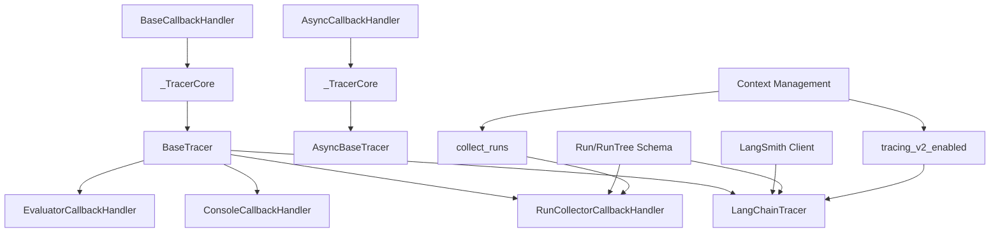
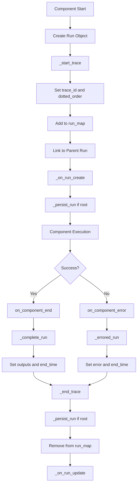
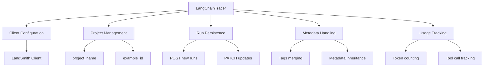
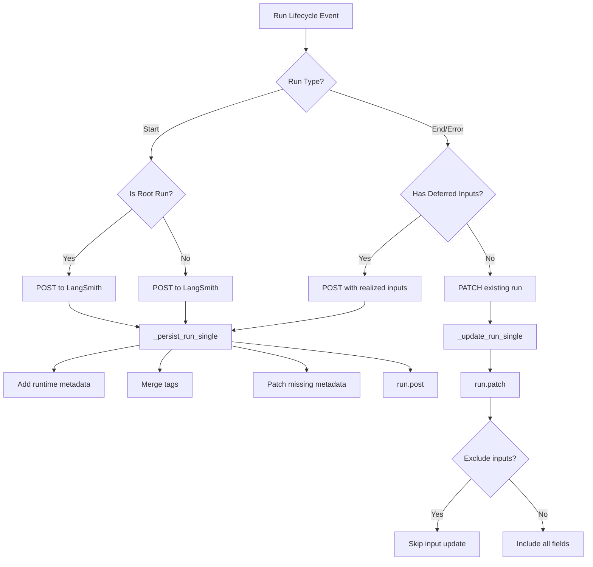
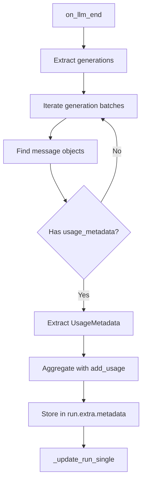
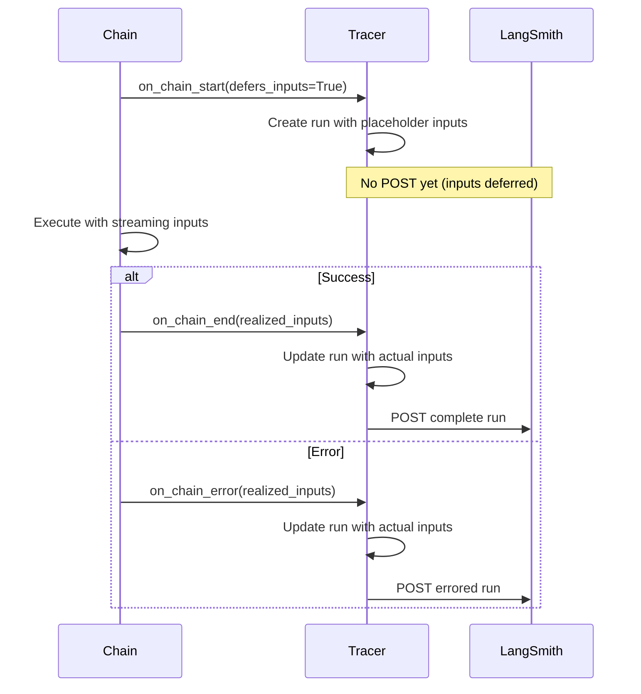
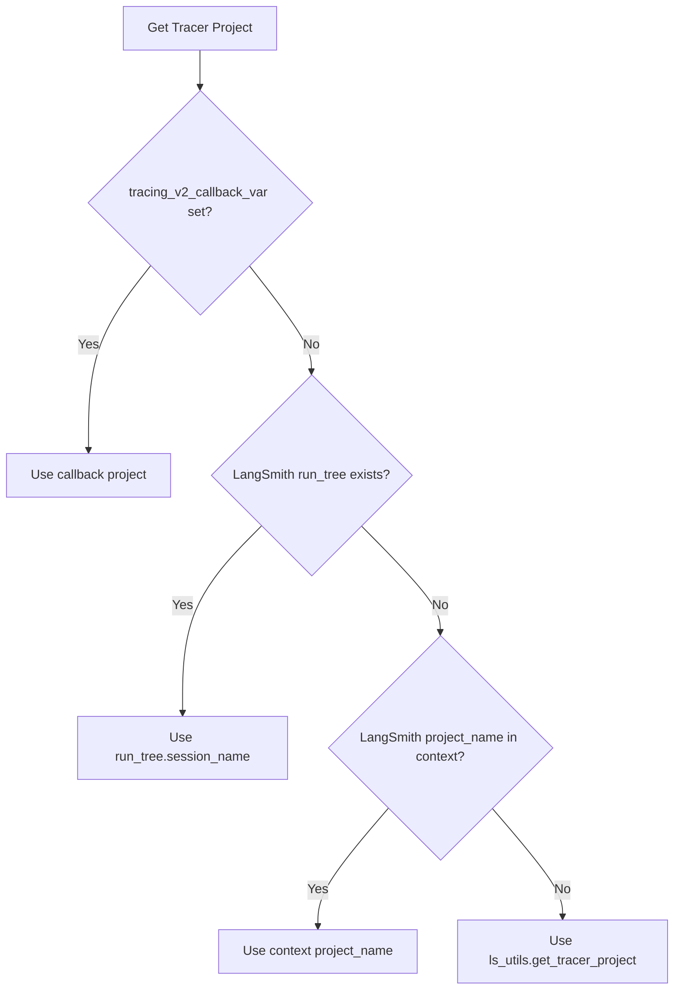
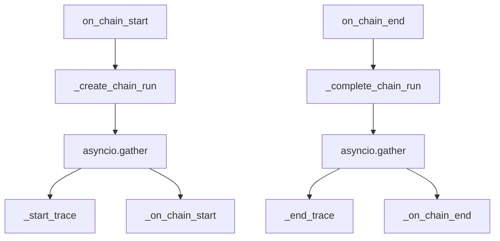
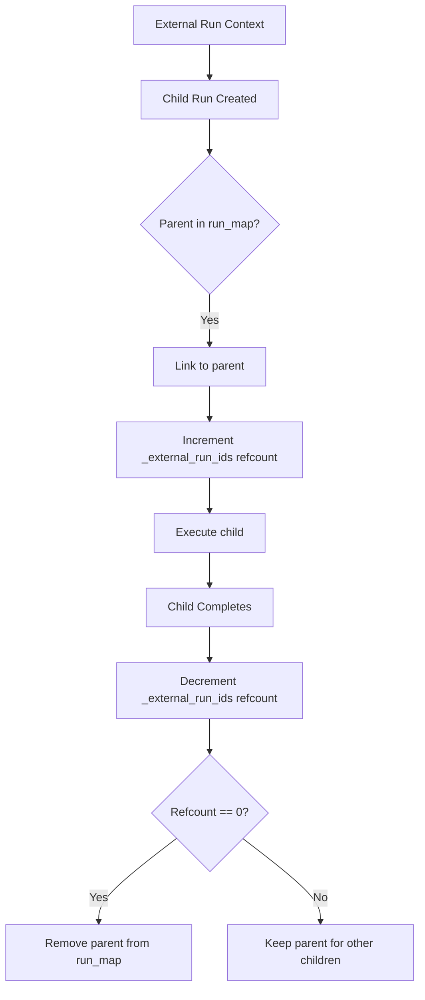

# Tracing & LangSmith Integration

Tracing is a critical observability feature in LangChain that enables developers to monitor, debug, and analyze the execution of LLM-powered applications. The tracing system captures detailed information about runs—including LLM calls, chain executions, tool invocations, and retrieval operations—and integrates seamlessly with LangSmith, a platform for tracing and evaluating LLM applications. This integration provides comprehensive visibility into application behavior, performance metrics, and execution flows through a hierarchical run tree structure.

The tracing architecture is built on a callback-based system where tracers implement the `BaseTracer` interface and respond to lifecycle events from various LangChain components. The `LangChainTracer` serves as the primary implementation for LangSmith integration, automatically persisting run data to the LangSmith platform for visualization and analysis.

Sources: [libs/core/langchain_core/tracers/__init__.py](../../../libs/core/langchain_core/tracers/__init__.py), [libs/core/langchain_core/tracers/langchain.py:1-50](../../../libs/core/langchain_core/tracers/langchain.py#L1-L50)

## Architecture Overview

The tracing system consists of several key components organized in a layered architecture:



The architecture separates concerns across three layers:

1. **Core Layer** (`_TracerCore`): Provides shared functionality for creating, updating, and managing run objects across different run types (LLM, chain, tool, retriever)
2. **Base Layer** (`BaseTracer`/`AsyncBaseTracer`): Implements the callback handler interface and defines the abstract `_persist_run` method for subclasses
3. **Implementation Layer**: Concrete tracers like `LangChainTracer` that handle persistence to specific backends

Sources: [libs/core/langchain_core/tracers/base.py:1-50](../../../libs/core/langchain_core/tracers/base.py#L1-L50), [libs/core/langchain_core/tracers/core.py:1-80](../../../libs/core/langchain_core/tracers/core.py#L1-L80)

## Run Schema and Lifecycle

### Run Data Structure

The `Run` type is an alias for LangSmith's `RunTree` class, representing a single execution unit in the trace hierarchy. Each run captures comprehensive execution metadata:

| Field | Type | Description |
|-------|------|-------------|
| `id` | UUID | Unique identifier for the run |
| `parent_run_id` | UUID \| None | Parent run identifier for hierarchical tracing |
| `trace_id` | UUID | Root trace identifier |
| `dotted_order` | str | Hierarchical ordering string for trace visualization |
| `run_type` | str | Type of run: "llm", "chat_model", "chain", "tool", "retriever" |
| `name` | str | Human-readable name for the run |
| `start_time` | datetime | Run start timestamp |
| `end_time` | datetime \| None | Run completion timestamp |
| `inputs` | dict | Input data for the run |
| `outputs` | dict \| None | Output data from the run |
| `error` | str \| None | Error stacktrace if run failed |
| `serialized` | dict | Serialized component information |
| `events` | list | Timeline of events (start, end, error, new_token, retry) |
| `tags` | list[str] | Tags for categorization and filtering |
| `metadata` | dict | Additional metadata including usage information |
| `child_runs` | list[Run] | Nested child runs |

Sources: [libs/core/langchain_core/tracers/schemas.py:1-13](../../../libs/core/langchain_core/tracers/schemas.py#L1-L13), [libs/core/langchain_core/tracers/core.py:85-135](../../../libs/core/langchain_core/tracers/core.py#L85-L135)

### Run Lifecycle Flow



The lifecycle follows a consistent pattern across all run types:

1. **Start Phase**: Component invocation triggers `on_[type]_start`, creating a run object with inputs and metadata
2. **Trace Initialization**: `_start_trace` establishes trace hierarchy and ordering
3. **Execution Phase**: Component executes while tracer may capture intermediate events (tokens, retries)
4. **Completion Phase**: `on_[type]_end` or `on_[type]_error` finalizes the run with outputs or error information
5. **Persistence Phase**: `_end_trace` triggers persistence for root runs and cleanup

Sources: [libs/core/langchain_core/tracers/core.py:137-175](../../../libs/core/langchain_core/tracers/core.py#L137-L175), [libs/core/langchain_core/tracers/base.py:52-80](../../../libs/core/langchain_core/tracers/base.py#L52-L80)

## LangChainTracer Implementation

### Core Features

The `LangChainTracer` class provides the primary integration with LangSmith's tracing platform:



Key initialization parameters:

| Parameter | Type | Default | Description |
|-----------|------|---------|-------------|
| `example_id` | UUID \| str \| None | None | Example ID for dataset evaluation |
| `project_name` | str \| None | None | LangSmith project name (defaults to tracer project) |
| `client` | Client \| None | None | LangSmith client instance (defaults to global client) |
| `tags` | list[str] \| None | None | Tags applied to all runs |
| `metadata` | Mapping[str, str] \| None | None | Metadata applied to all runs |

Sources: [libs/core/langchain_core/tracers/langchain.py:80-140](../../../libs/core/langchain_core/tracers/langchain.py#L80-L140)

### Persistence Strategy

The `LangChainTracer` uses a dual-persistence strategy optimized for LangSmith:



The tracer distinguishes between:
- **POST operations** (`_persist_run_single`): Creating new runs at start or when inputs were deferred
- **PATCH operations** (`_update_run_single`): Updating existing runs with outputs/errors at completion

Sources: [libs/core/langchain_core/tracers/langchain.py:254-290](../../../libs/core/langchain_core/tracers/langchain.py#L254-L290), [libs/core/langchain_core/tracers/langchain.py:360-385](../../../libs/core/langchain_core/tracers/langchain.py#L360-L385)

### Metadata Inheritance and Overrides

The tracer implements sophisticated metadata merging logic with allowlisted override keys:

```python
OVERRIDABLE_LANGSMITH_INHERITABLE_METADATA_KEYS: frozenset[str] = frozenset(
    {"ls_agent_type"}
)
```

The `copy_with_metadata_defaults` method creates derived tracers with merged metadata:

1. **Default "First Wins" Behavior**: Parent metadata takes precedence for most keys
2. **Override Behavior**: Keys in `OVERRIDABLE_LANGSMITH_INHERITABLE_METADATA_KEYS` allow nested callers to override parent values
3. **Tag Merging**: Tags from parent and child tracers are combined and deduplicated

This allows subagents to override specific LangSmith-only metadata like `ls_agent_type` while preserving user-defined metadata from parent contexts.

Sources: [libs/core/langchain_core/tracers/langchain.py:34-51](../../../libs/core/langchain_core/tracers/langchain.py#L34-L51), [libs/core/langchain_core/tracers/langchain.py:142-175](../../../libs/core/langchain_core/tracers/langchain.py#L142-L175)

### Usage Metadata Extraction

The tracer automatically extracts and aggregates usage metadata from LLM responses:



The extraction process:
1. Searches for `usage_metadata` in serialized message payloads within generations
2. Aggregates usage across multiple generation batches using `add_usage`
3. Stores aggregated metadata in `run.extra["metadata"]["usage_metadata"]`
4. Tracks tool call counts separately in `run.extra["tool_call_count"]`

Sources: [libs/core/langchain_core/tracers/langchain.py:60-100](../../../libs/core/langchain_core/tracers/langchain.py#L60-L100), [libs/core/langchain_core/tracers/langchain.py:330-342](../../../libs/core/langchain_core/tracers/langchain.py#L330-L342), [libs/core/langchain_core/tracers/core.py:300-330](../../../libs/core/langchain_core/tracers/core.py#L300-L330)

## Run Type Handlers

### LLM and Chat Model Runs

The tracer handles both text LLM and chat model runs with slight variations:

**Chat Model Start**:
```python
def on_chat_model_start(
    self,
    serialized: dict[str, Any],
    messages: list[list[BaseMessage]],
    *,
    run_id: UUID,
    # ... other parameters
) -> Run:
```

- Accepts `messages` as lists of `BaseMessage` objects
- Serializes messages using `dumpd()` for persistence
- Creates run with `run_type="llm"` for compatibility

**LLM Start**:
```python
def on_llm_start(
    self,
    serialized: dict[str, Any],
    prompts: list[str],
    *,
    run_id: UUID,
    # ... other parameters
) -> Run:
```

- Accepts string prompts directly
- Creates run with `run_type="llm"`

Both run types share the same completion handler (`on_llm_end`) and error handler (`on_llm_error`), maintaining API compatibility.

Sources: [libs/core/langchain_core/tracers/langchain.py:198-236](../../../libs/core/langchain_core/tracers/langchain.py#L198-L236), [libs/core/langchain_core/tracers/base.py:82-155](../../../libs/core/langchain_core/tracers/base.py#L82-L155)

### Token Streaming Events

The tracer optimizes token event handling to avoid excessive event logging:

```python
def _llm_run_with_token_event(
    self,
    token: str,
    run_id: UUID,
    chunk: GenerationChunk | ChatGenerationChunk | None = None,
    parent_run_id: UUID | None = None,
) -> Run:
    run_id_str = str(run_id)
    if run_id_str not in self.run_has_token_event_map:
        self.run_has_token_event_map[run_id_str] = True
    else:
        return self._get_run(run_id, run_type={"llm", "chat_model"})
    return super()._llm_run_with_token_event(
        token, run_id, chunk=None, parent_run_id=parent_run_id,
    )
```

The implementation:
1. Tracks whether a run has already logged a token event using `run_has_token_event_map`
2. Only logs the first token event per run to avoid bloating the event timeline
3. Drops the chunk data to reduce payload size

Sources: [libs/core/langchain_core/tracers/langchain.py:310-328](../../../libs/core/langchain_core/tracers/langchain.py#L310-L328)

### Chain Runs

Chain runs support deferred input handling for streaming scenarios:



The `defers_inputs` flag in `run.extra` controls persistence timing:
- When `True`: Skip POST at start, wait until end/error to POST with realized inputs
- When `False`: Standard POST at start, PATCH at end/error

Sources: [libs/core/langchain_core/tracers/langchain.py:350-385](../../../libs/core/langchain_core/tracers/langchain.py#L350-L385)

### Tool Runs

Tool runs capture both string-based and structured inputs:

```python
def _create_tool_run(
    self,
    serialized: dict[str, Any],
    input_str: str,
    run_id: UUID,
    # ...
    inputs: dict[str, Any] | None = None,
    **kwargs: Any,
) -> Run:
```

The schema format determines input structure:
- **Original format**: `{"input": input_str}`
- **Streaming events format**: `{"input": inputs}` (structured dict)

Sources: [libs/core/langchain_core/tracers/core.py:470-515](../../../libs/core/langchain_core/tracers/core.py#L470-L515), [libs/core/langchain_core/tracers/langchain.py:387-400](../../../libs/core/langchain_core/tracers/langchain.py#L387-L400)

### Retriever Runs

Retriever runs track document retrieval operations:

```python
def _create_retrieval_run(
    self,
    serialized: dict[str, Any],
    query: str,
    run_id: UUID,
    # ...
) -> Run:
```

Key characteristics:
- Default name: "Retriever" if not specified
- Inputs: `{"query": query}`
- Outputs: `{"documents": documents}` (list of Document objects)
- Run type: `"retriever"`

Sources: [libs/core/langchain_core/tracers/core.py:540-565](../../../libs/core/langchain_core/tracers/core.py#L540-L565), [libs/core/langchain_core/tracers/langchain.py:402-415](../../../libs/core/langchain_core/tracers/langchain.py#L402-L415)

## Context Management

### Tracing Context Variables

The tracing system uses context variables for implicit tracer propagation:

| Context Variable | Type | Purpose |
|-----------------|------|---------|
| `tracing_v2_callback_var` | ContextVar[LangChainTracer \| None] | Active LangChain tracer instance |
| `run_collector_var` | ContextVar[RunCollectorCallbackHandler \| None] | Active run collector for inspection |

Sources: [libs/core/langchain_core/tracers/context.py:1-35](../../../libs/core/langchain_core/tracers/context.py#L1-L35)

### Context Managers

#### tracing_v2_enabled

Enables LangSmith tracing for a code block:

```python
@contextmanager
def tracing_v2_enabled(
    project_name: str | None = None,
    *,
    example_id: str | UUID | None = None,
    tags: list[str] | None = None,
    client: LangSmithClient | None = None,
) -> Generator[LangChainTracer, None, None]:
```

Usage pattern:
```python
with tracing_v2_enabled(project_name="my-project") as cb:
    chain.invoke("input")
    run_url = cb.get_run_url()
```

The context manager:
1. Creates a `LangChainTracer` with specified configuration
2. Sets it in `tracing_v2_callback_var` for the context duration
3. Automatically cleans up on exit
4. Returns the tracer for direct access (e.g., getting run URLs)

Sources: [libs/core/langchain_core/tracers/context.py:37-72](../../../libs/core/langchain_core/tracers/context.py#L37-L72)

#### collect_runs

Collects all traced runs for inspection:

```python
@contextmanager
def collect_runs() -> Generator[RunCollectorCallbackHandler, None, None]:
```

Usage pattern:
```python
with collect_runs() as runs_cb:
    chain.invoke("input")
    run_id = runs_cb.traced_runs[0].id
```

The collector stores complete run trees in `traced_runs` list for post-execution analysis and evaluation.

Sources: [libs/core/langchain_core/tracers/context.py:75-92](../../../libs/core/langchain_core/tracers/context.py#L75-L92), [libs/core/langchain_core/tracers/run_collector.py:1-35](../../../libs/core/langchain_core/tracers/run_collector.py#L1-L35)

### Tracer Project Resolution

The system resolves the active project name through a priority chain:



Resolution order:
1. Active `LangChainTracer` instance's `project_name`
2. Current LangSmith `RunTree` session name
3. LangSmith tracing context `project_name`
4. Default from LangSmith utilities

Sources: [libs/core/langchain_core/tracers/context.py:115-135](../../../libs/core/langchain_core/tracers/context.py#L115-L135)

## Async Tracing Support

### AsyncBaseTracer

The async tracer implementation mirrors the synchronous API with concurrent execution optimizations:



Key differences from synchronous tracer:

1. **Concurrent Execution**: Start/end operations run concurrently using `asyncio.gather`
2. **Non-blocking Persistence**: `_persist_run` is async and doesn't block callback execution
3. **Async Hooks**: All `_on_*` methods are async coroutines

Example from chain start:
```python
async def on_chain_start(
    self,
    serialized: dict[str, Any],
    inputs: dict[str, Any],
    *,
    run_id: UUID,
    # ... other parameters
) -> None:
    chain_run = self._create_chain_run(...)
    tasks = [self._start_trace(chain_run), self._on_chain_start(chain_run)]
    await asyncio.gather(*tasks)
```

Sources: [libs/core/langchain_core/tracers/base.py:380-450](../../../libs/core/langchain_core/tracers/base.py#L380-L450), [libs/core/langchain_core/tracers/base.py:500-550](../../../libs/core/langchain_core/tracers/base.py#L500-L550)

## External Run Integration

The tracing system supports integration with externally-managed runs (e.g., from LangSmith's `@traceable` decorator):



The `_external_run_ids` dictionary tracks reference counts for externally-injected parent runs:

1. When a child run links to an external parent, increment the refcount
2. External parents are added to `run_map` so children can find them
3. When the last child completes, decrement and remove if refcount reaches zero
4. This prevents memory leaks from long-lived external trace contexts

Sources: [libs/core/langchain_core/tracers/base.py:60-80](../../../libs/core/langchain_core/tracers/base.py#L60-L80), [libs/core/langchain_core/tracers/core.py:140-165](../../../libs/core/langchain_core/tracers/core.py#L140-L165)

## Schema Format Variants

The tracer supports multiple schema formats for different use cases:

| Format | Description | Input/Output Handling |
|--------|-------------|----------------------|
| `"original"` | Default format for all tracers | Slightly inconsistent, preserves backward compatibility |
| `"streaming_events"` | Internal format for streaming events API | Consistent structure: `{"input": ..., "output": ...}` |
| `"original+chat"` | Original format with chat model support | Same as original but enables `on_chat_model_start` |

The format affects:
- Input/output serialization in chains and tools
- Whether `on_chat_model_start` is implemented or raises `NotImplementedError`
- Event structure for streaming scenarios

Sources: [libs/core/langchain_core/tracers/core.py:85-115](../../../libs/core/langchain_core/tracers/core.py#L85-L115), [libs/core/langchain_core/tracers/core.py:200-230](../../../libs/core/langchain_core/tracers/core.py#L200-L230)

## Error Handling and Resilience

### Stacktrace Capture

The tracer captures comprehensive error information:

```python
@staticmethod
def _get_stacktrace(error: BaseException) -> str:
    """Get the stacktrace of the parent error."""
    msg = repr(error)
    try:
        tb = traceback.format_exception(error)
        return (msg + "\n\n".join(tb)).strip()
    except Exception:
        return msg
```

The method safely handles exceptions during stacktrace formatting, falling back to just the error representation.

Sources: [libs/core/langchain_core/tracers/core.py:125-135](../../../libs/core/langchain_core/tracers/core.py#L125-L135)

### Persistence Error Handling

The `LangChainTracer` implements defensive error handling with logging:

```python
def log_error_once(method: str, exception: Exception) -> None:
    """Log an error once."""
    if (method, type(exception)) in _LOGGED:
        return
    _LOGGED.add((method, type(exception)))
    logger.error(exception)
```

This prevents log spam from repeated errors of the same type while ensuring visibility of issues. Errors during POST/PATCH operations are logged but don't crash the application.

Sources: [libs/core/langchain_core/tracers/langchain.py:52-65](../../../libs/core/langchain_core/tracers/langchain.py#L52-L65), [libs/core/langchain_core/tracers/langchain.py:280-290](../../../libs/core/langchain_core/tracers/langchain.py#L280-L290)

### Retry Logic for Run URLs

The `get_run_url` method implements exponential backoff for project creation latency:

```python
def get_run_url(self) -> str:
    for attempt in Retrying(
        stop=stop_after_attempt(5),
        wait=wait_exponential_jitter(),
        retry=retry_if_exception_type(ls_utils.LangSmithError),
    ):
        with attempt:
            return self.client.get_run_url(
                run=self.latest_run, project_name=self.project_name
            )
```

This handles the case where a project hasn't been created yet when fetching the first run URL.

Sources: [libs/core/langchain_core/tracers/langchain.py:245-262](../../../libs/core/langchain_core/tracers/langchain.py#L245-L262)

## Summary

The LangChain tracing and LangSmith integration system provides comprehensive observability for LLM applications through a hierarchical run tree structure. The architecture separates concerns across core functionality, base interfaces, and concrete implementations, with the `LangChainTracer` serving as the primary bridge to LangSmith's platform. Key features include automatic metadata extraction, sophisticated inheritance rules, support for both synchronous and asynchronous execution, deferred input handling for streaming, and resilient error handling. The context management system enables implicit tracer propagation while supporting explicit configuration, making tracing both powerful and developer-friendly. This infrastructure enables developers to monitor, debug, and optimize their LLM applications with detailed execution traces, performance metrics, and hierarchical visualization of complex application flows.