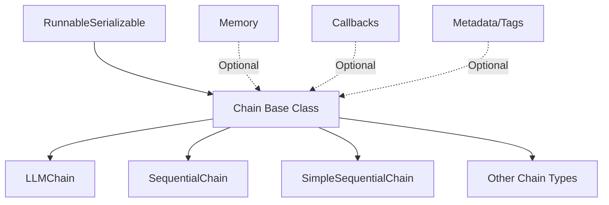
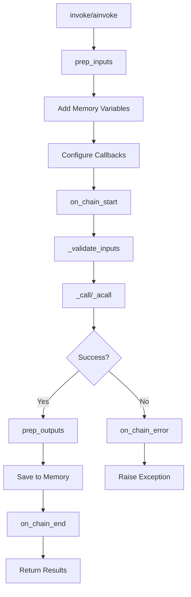
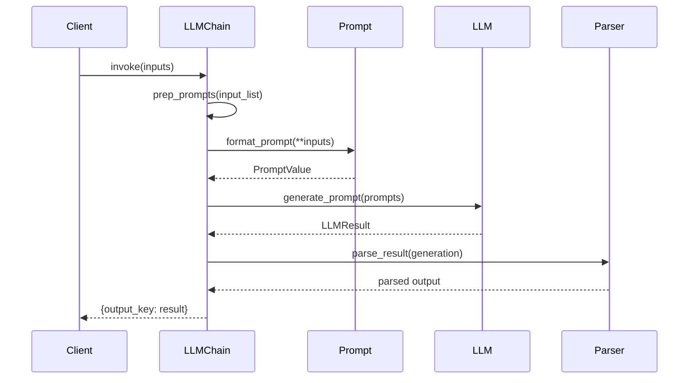
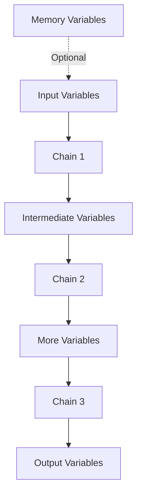
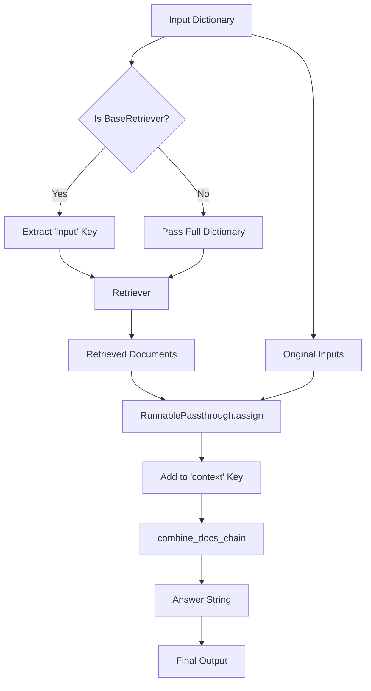
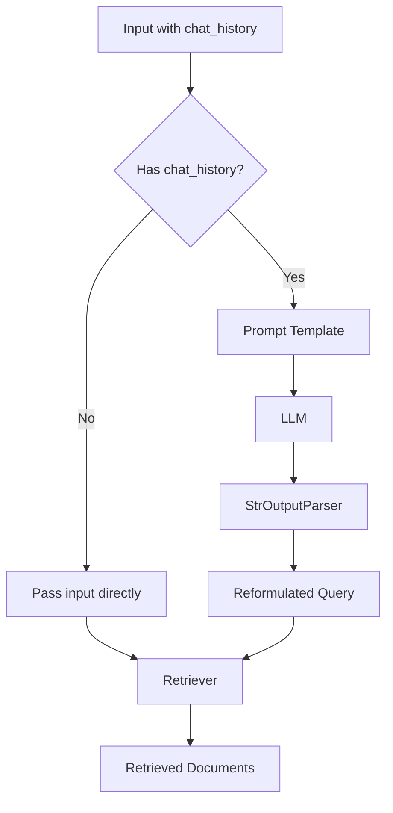
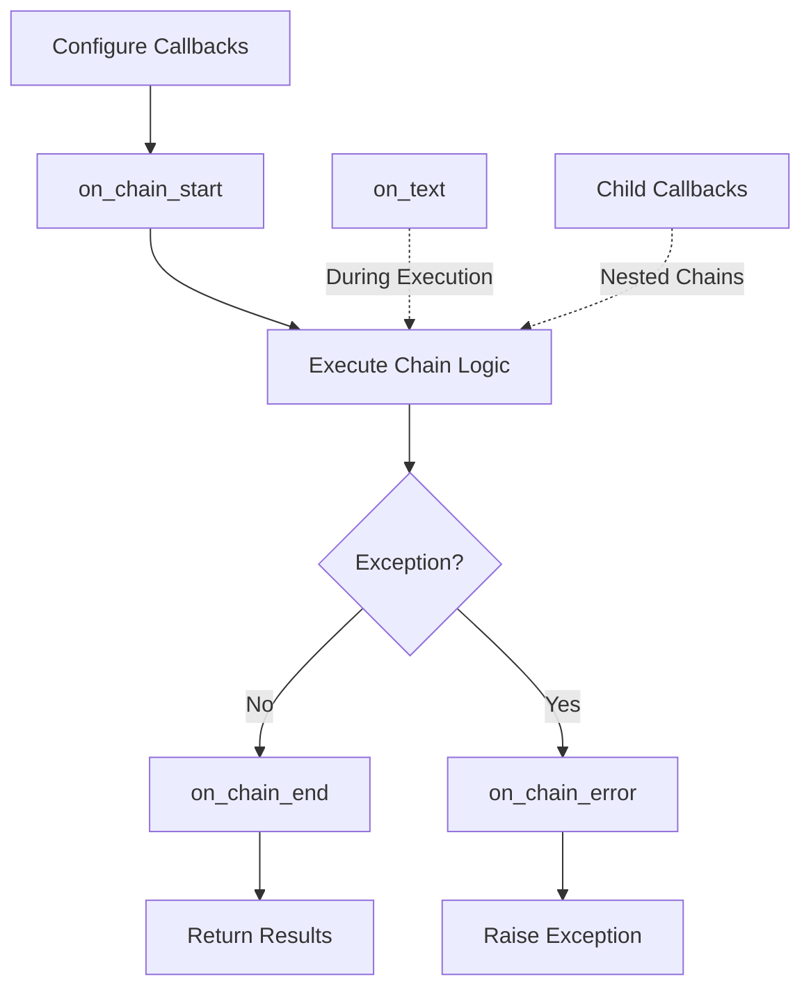

# Chain Base Classes & Core Chains

## Introduction

Chains are the fundamental building blocks in LangChain for creating reusable, composable sequences of calls to components like models, document retrievers, and other chains. The Chain interface provides a structured way to encode sequences of operations with a simple, consistent API that makes applications **stateful** (through Memory integration), **observable** (via Callbacks), and **composable** (by combining chains with other components). This wiki page covers the base `Chain` class that all chains inherit from, as well as core chain implementations including `LLMChain`, `SequentialChain`, and specialized retrieval chains.

Sources: [chains/__init__.py:1-13](../../../libs/langchain/langchain_classic/chains/__init__.py#L1-L13), [chains/base.py:1-10](../../../libs/langchain/langchain_classic/chains/base.py#L1-L10)

## Chain Base Class Architecture

### Core Design Principles

The `Chain` abstract base class extends `RunnableSerializable[dict[str, Any], dict[str, Any]]`, providing a standardized interface for all chain implementations. Chains are designed to be callable, accepting dictionary inputs and returning dictionary outputs, which enables flexible composition and data flow between components.

The base class enforces that all chain implementations must define:
- `input_keys`: Expected input keys to the chain
- `output_keys`: Keys that will be present in the chain output
- `_call()`: The private method containing the core execution logic

Sources: [chains/base.py:40-67](../../../libs/langchain/langchain_classic/chains/base.py#L40-L67)



### Key Properties and Configuration

The `Chain` base class includes several configurable properties that control behavior and enable observability:

| Property | Type | Default | Description |
|----------|------|---------|-------------|
| `memory` | `BaseMemory \| None` | `None` | Optional memory object for state management |
| `callbacks` | `Callbacks` | `None` | Callback handlers for lifecycle events |
| `verbose` | `bool` | Global setting | Controls intermediate logging output |
| `tags` | `list[str] \| None` | `None` | Tags associated with chain calls |
| `metadata` | `dict[str, Any] \| None` | `None` | Metadata passed to handlers |

Sources: [chains/base.py:68-97](../../../libs/langchain/langchain_classic/chains/base.py#L68-L97)

### Execution Flow

The chain execution follows a well-defined lifecycle with callback hooks at each stage:



The `invoke()` method orchestrates this flow, handling configuration, callback management, input preparation, execution, and output processing. Both synchronous (`invoke`) and asynchronous (`ainvoke`) execution patterns are supported.

Sources: [chains/base.py:108-176](../../../libs/langchain/langchain_classic/chains/base.py#L108-L176)

### Input and Output Processing

Chains implement sophisticated input/output processing to support both dictionary and single-value inputs:

**Input Preparation (`prep_inputs`):**
- Accepts either a dictionary or a single value
- For single values, automatically maps to the appropriate input key
- Integrates memory variables into the input dictionary
- Handles cases where memory provides some of multiple required inputs

**Output Preparation (`prep_outputs`):**
- Validates all required output keys are present
- Saves context to memory if configured
- Supports `return_only_outputs` flag to exclude input keys from results

Sources: [chains/base.py:473-519](../../../libs/langchain/langchain_classic/chains/base.py#L473-L519)

## LLMChain: Core Language Model Chain

### Overview and Purpose

`LLMChain` is a foundational chain that formats a prompt template and calls a language model. While deprecated in favor of LCEL (LangChain Expression Language) syntax like `prompt | llm`, it remains a key component for understanding chain patterns. The class demonstrates the basic pattern of combining prompts with language models.

Sources: [chains/llm.py:37-80](../../../libs/langchain/langchain_classic/chains/llm.py#L37-L80)

### Key Components

| Component | Type | Description |
|-----------|------|-------------|
| `prompt` | `BasePromptTemplate` | Prompt template to format with inputs |
| `llm` | `Runnable[LanguageModelInput, str]` | Language model to invoke |
| `output_parser` | `BaseLLMOutputParser` | Parser for LLM outputs (default: `StrOutputParser`) |
| `output_key` | `str` | Key for output in result dictionary (default: "text") |
| `return_final_only` | `bool` | Whether to return only parsed output or include full generation |

Sources: [chains/llm.py:82-95](../../../libs/langchain/langchain_classic/chains/llm.py#L82-L95)

### Execution Sequence



### Prompt Preparation

The `prep_prompts()` method handles batch processing and stop sequence management:

1. Extracts selected inputs matching prompt variables
2. Formats prompt with inputs
3. Logs formatted prompt if verbose mode enabled
4. Validates consistent stop sequences across batch
5. Returns list of `PromptValue` objects and stop sequences

Sources: [chains/llm.py:174-202](../../../libs/langchain/langchain_classic/chains/llm.py#L174-L202)

### Generation Methods

LLMChain provides specialized methods for different use cases:

- **`generate()`**: Batch generation from multiple inputs, returns full `LLMResult`
- **`predict()`**: Single prediction with keyword arguments, returns string output
- **`apply()`**: Apply chain to list of inputs with optimized batch processing

Sources: [chains/llm.py:119-158](../../../libs/langchain/langchain_classic/chains/llm.py#L119-L158), [chains/llm.py:297-311](../../../libs/langchain/langchain_classic/chains/llm.py#L297-L311)

## Sequential Chain Patterns

### SequentialChain

`SequentialChain` enables complex multi-step workflows where outputs from one chain feed into subsequent chains. It validates that all required inputs are available at each step and tracks variable flow through the pipeline.

**Architecture:**



**Key Features:**
- Validates input/output key compatibility across chains
- Prevents key collisions between chain outputs
- Supports memory integration with automatic key conflict detection
- Can return all intermediate variables or only final outputs via `return_all` flag

Sources: [chains/sequential.py:12-42](../../../libs/langchain/langchain_classic/chains/sequential.py#L12-L42)

### Chain Validation Logic

The `validate_chains()` method performs comprehensive validation at initialization:

1. Checks that all chain input keys are available from either initial inputs or previous chain outputs
2. Accounts for memory variables that may provide additional inputs
3. Ensures no chain output keys conflict with existing variables
4. Automatically determines output variables if not specified

Sources: [chains/sequential.py:44-87](../../../libs/langchain/langchain_classic/chains/sequential.py#L44-L87)

### SimpleSequentialChain

`SimpleSequentialChain` provides a streamlined interface for linear pipelines where each chain has exactly one input and one output:

| Property | Type | Default | Description |
|----------|------|---------|-------------|
| `chains` | `list[Chain]` | Required | List of single-input/output chains |
| `strip_outputs` | `bool` | `False` | Whether to strip whitespace between steps |
| `input_key` | `str` | `"input"` | Key for initial input |
| `output_key` | `str` | `"output"` | Key for final output |

The validation ensures all chains have exactly one input and one output key, making the pipeline behavior predictable and easy to reason about.

Sources: [chains/sequential.py:103-147](../../../libs/langchain/langchain_classic/chains/sequential.py#L103-L147)

## Retrieval Chain Patterns

### create_retrieval_chain Function

The `create_retrieval_chain()` function creates an LCEL Runnable that retrieves documents and passes them to a document processing chain. This pattern is fundamental for question-answering and RAG (Retrieval-Augmented Generation) applications.

**Function Signature:**
```python
def create_retrieval_chain(
    retriever: BaseRetriever | Runnable[dict, RetrieverOutput],
    combine_docs_chain: Runnable[dict[str, Any], str],
) -> Runnable
```

**Parameters:**
- `retriever`: Retriever object or Runnable that returns documents
- `combine_docs_chain`: Runnable that processes inputs and documents to produce string output

Sources: [chains/retrieval.py:10-52](../../../libs/langchain/langchain_classic/chains/retrieval.py#L10-L52)

### Retrieval Flow



The implementation uses `RunnablePassthrough.assign()` to add retrieved documents under the `context` key while preserving original inputs, then passes everything to the combine documents chain.

Sources: [chains/retrieval.py:54-67](../../../libs/langchain/langchain_classic/chains/retrieval.py#L54-L67)

### create_history_aware_retriever Function

This function creates a chain that handles conversational retrieval by reformulating queries based on chat history when present:

**Conditional Logic:**


The function uses `RunnableBranch` to conditionally apply query reformulation only when chat history exists, optimizing performance for initial queries.

Sources: [chains/history_aware_retriever.py:9-63](../../../libs/langchain/langchain_classic/chains/history_aware_retriever.py#L9-L63)

## Memory Integration

Chains seamlessly integrate with memory systems to maintain state across invocations. The memory integration happens at two key points:

1. **Input Preparation**: Memory variables are loaded and merged with user inputs
2. **Output Processing**: Inputs and outputs are saved to memory for future reference

Memory variables are automatically excluded from input validation, allowing chains to work with partial inputs when memory provides the remaining required keys.

Sources: [chains/base.py:473-519](../../../libs/langchain/langchain_classic/chains/base.py#L473-L519)

## Callback System

The Chain base class implements a comprehensive callback system for observability:

**Callback Lifecycle:**



Callbacks can be specified at multiple levels:
- Chain construction time (instance-level)
- Runtime via `invoke()` parameters
- Global defaults via `langchain.globals`

The callback manager merges these sources and propagates them to nested chain calls.

Sources: [chains/base.py:137-151](../../../libs/langchain/langchain_classic/chains/base.py#L137-L151)

## Deprecated Methods

Several convenience methods are deprecated in favor of the LCEL `invoke`/`ainvoke` pattern:

| Deprecated Method | Replacement | Removal Version |
|-------------------|-------------|-----------------|
| `__call__()` | `invoke()` | 1.0 |
| `acall()` | `ainvoke()` | 1.0 |
| `run()` | `invoke()` | 1.0 |
| `arun()` | `ainvoke()` | 1.0 |
| `apply()` | `batch()` | 1.0 |

These methods remain functional but issue deprecation warnings, encouraging migration to the standardized Runnable interface.

Sources: [chains/base.py:226-243](../../../libs/langchain/langchain_classic/chains/base.py#L226-L243), [chains/base.py:543-591](../../../libs/langchain/langchain_classic/chains/base.py#L543-L591)

## Chain Serialization

Chains support serialization to JSON and YAML formats for persistence and sharing:

**Requirements:**
- Chain must implement `_chain_type` property
- Memory must be `None` (memory serialization not yet supported)

The `save()` method automatically detects file format from extension and serializes the chain's configuration dictionary.

Sources: [chains/base.py:661-689](../../../libs/langchain/langchain_classic/chains/base.py#L661-L689)

## Summary

The Chain base class and core chain implementations provide a robust foundation for building LLM-powered applications in LangChain. The base class establishes patterns for input/output handling, memory integration, callback management, and composability that all specialized chains inherit. While newer patterns like LCEL are preferred for new development, understanding these chain patterns remains valuable for working with existing codebases and understanding LangChain's architectural evolution. The sequential and retrieval chain patterns demonstrate how simple abstractions can be composed to handle complex workflows like multi-step reasoning and conversational retrieval.