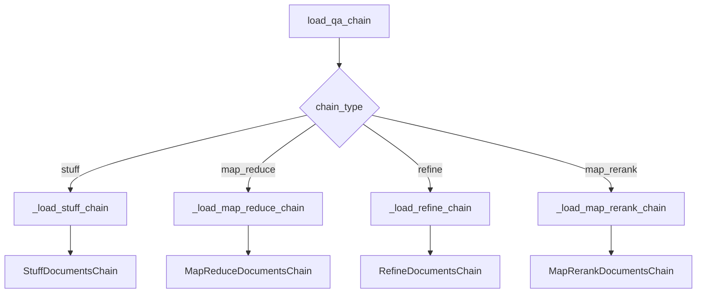
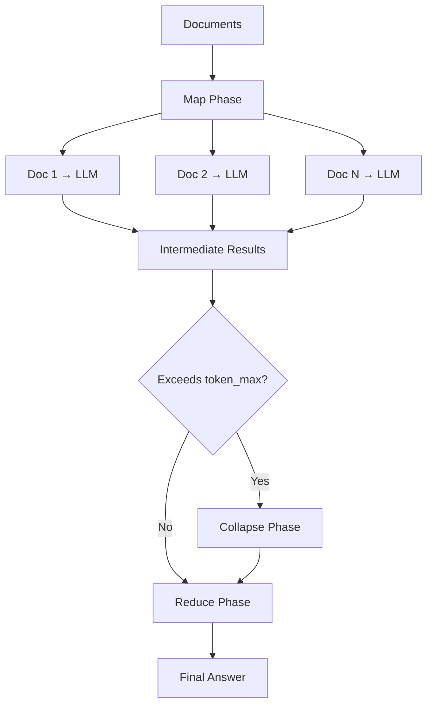
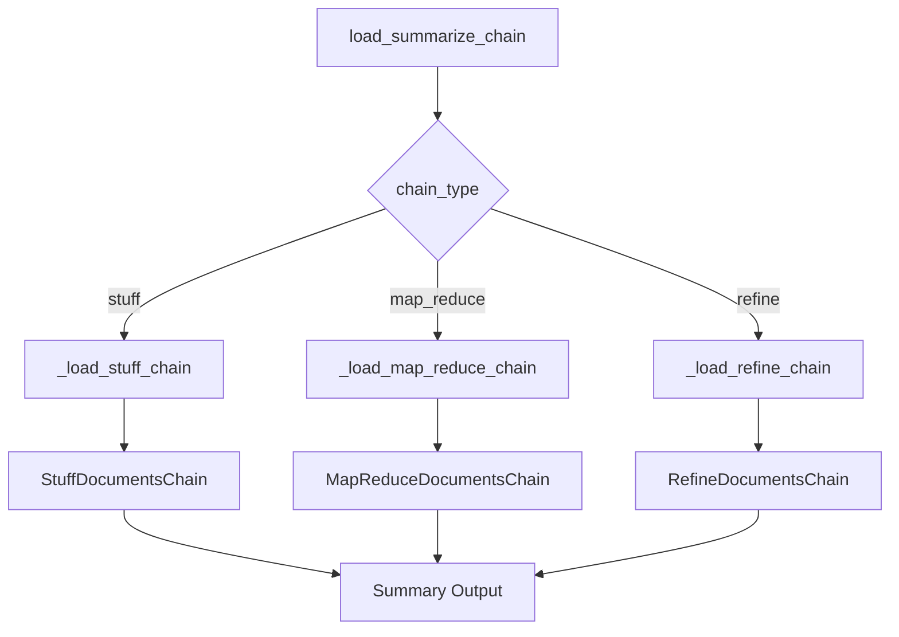
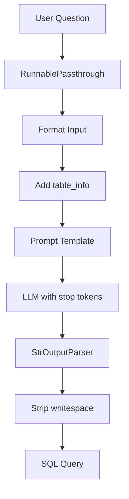
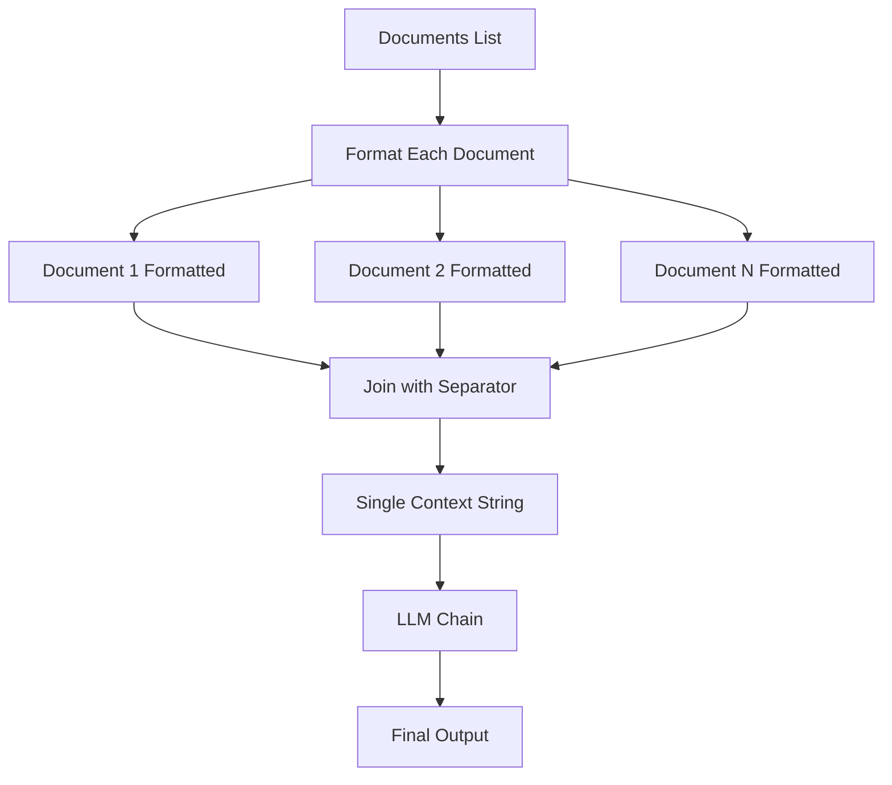
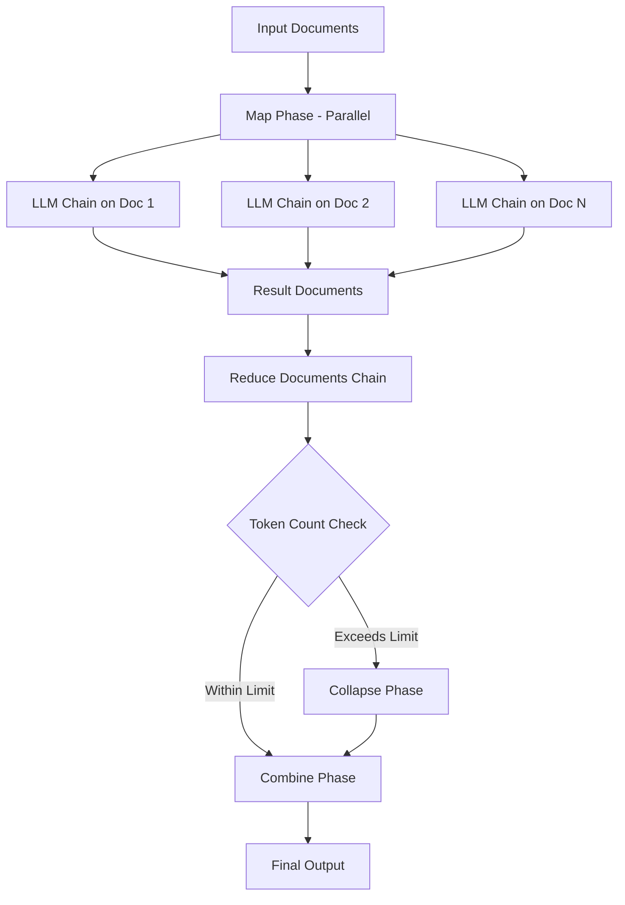

# Specialized Chains (QA, Summarization, SQL, Graph)

LangChain provides specialized chain implementations designed for common document processing and data querying tasks. These chains offer pre-built patterns for question answering over documents, text summarization, SQL database querying, and graph database interactions. Each specialized chain type implements different strategies for handling documents and generating responses, including "stuff" (combining all documents), "map_reduce" (parallel processing then combining), "refine" (iterative improvement), and "map_rerank" (scoring and selecting best answers). These chains abstract complex multi-step workflows into composable components that can be easily configured and integrated into LLM-powered applications.

Sources: [chains/question_answering/chain.py:1-10](../../../libs/langchain/langchain_classic/chains/question_answering/chain.py#L1-L10), [chains/summarize/chain.py:1-10](../../../libs/langchain/langchain_classic/chains/summarize/chain.py#L1-L10)

## Question Answering Chains

Question answering chains enable LLMs to answer questions based on provided documents. The `load_qa_chain` function serves as the main entry point for creating QA chains with different document combination strategies.

### Chain Types and Loading

The QA chain loader supports four distinct chain types, each implementing a different strategy for processing documents:

| Chain Type | Description | Use Case |
|------------|-------------|----------|
| `stuff` | Combines all documents into a single prompt | Small document sets that fit in context |
| `map_reduce` | Processes each document separately, then combines results | Large document sets requiring parallel processing |
| `refine` | Iteratively refines answer by processing documents sequentially | When answer quality improves with multiple passes |
| `map_rerank` | Scores answers from each document and selects the best | When documents may contain conflicting information |

Sources: [chains/question_answering/chain.py:233-244](../../../libs/langchain/langchain_classic/chains/question_answering/chain.py#L233-L244)



The loader function validates the chain type and delegates to the appropriate internal loading function. The function signature includes parameters for LLM configuration, verbosity, and callback management.

Sources: [chains/question_answering/chain.py:198-244](../../../libs/langchain/langchain_classic/chains/question_answering/chain.py#L198-L244)

### Stuff Chain Implementation

The stuff chain is the simplest approach, concatenating all documents into a single context string that's passed to the LLM along with the question. This strategy works well when the total document size fits within the model's context window.

```python
def _load_stuff_chain(
    llm: BaseLanguageModel,
    *,
    prompt: BasePromptTemplate | None = None,
    document_variable_name: str = "context",
    verbose: bool | None = None,
    callback_manager: BaseCallbackManager | None = None,
    callbacks: Callbacks = None,
    **kwargs: Any,
) -> StuffDocumentsChain:
    _prompt = prompt or stuff_prompt.PROMPT_SELECTOR.get_prompt(llm)
    llm_chain = LLMChain(
        llm=llm,
        prompt=_prompt,
        verbose=verbose,
        callback_manager=callback_manager,
        callbacks=callbacks,
    )
    return StuffDocumentsChain(
        llm_chain=llm_chain,
        document_variable_name=document_variable_name,
        verbose=verbose,
        callback_manager=callback_manager,
        callbacks=callbacks,
        **kwargs,
    )
```

Sources: [chains/question_answering/chain.py:50-77](../../../libs/langchain/langchain_classic/chains/question_answering/chain.py#L50-L77)

### Map Reduce Chain Implementation

The map reduce chain processes documents in parallel during the "map" phase, generating intermediate results for each document. These results are then combined in the "reduce" phase to produce a final answer. An optional "collapse" phase handles cases where intermediate results are too large.

Key configuration parameters include:

| Parameter | Type | Description |
|-----------|------|-------------|
| `question_prompt` | BasePromptTemplate | Prompt used for the map phase on each document |
| `combine_prompt` | BasePromptTemplate | Prompt used to combine mapped results |
| `collapse_prompt` | BasePromptTemplate | Optional prompt for collapsing intermediate results |
| `reduce_llm` | BaseLanguageModel | Optional separate LLM for reduce phase |
| `collapse_llm` | BaseLanguageModel | Optional separate LLM for collapse phase |
| `token_max` | int | Token threshold triggering collapse (default: 3000) |

Sources: [chains/question_answering/chain.py:80-148](../../../libs/langchain/langchain_classic/chains/question_answering/chain.py#L80-L148)



The map reduce implementation creates separate LLM chains for each phase and wraps them in a `ReduceDocumentsChain` that handles the recursive reduction logic.

Sources: [chains/question_answering/chain.py:80-148](../../../libs/langchain/langchain_classic/chains/question_answering/chain.py#L80-L148)

### Refine Chain Implementation

The refine chain iteratively improves the answer by processing documents sequentially. It generates an initial answer from the first document, then refines that answer by considering each subsequent document in turn.

```python
def _load_refine_chain(
    llm: BaseLanguageModel,
    *,
    question_prompt: BasePromptTemplate | None = None,
    refine_prompt: BasePromptTemplate | None = None,
    document_variable_name: str = "context_str",
    initial_response_name: str = "existing_answer",
    refine_llm: BaseLanguageModel | None = None,
    verbose: bool | None = None,
    callback_manager: BaseCallbackManager | None = None,
    callbacks: Callbacks = None,
    **kwargs: Any,
) -> RefineDocumentsChain:
```

The refine chain uses two prompts: `question_prompt` for generating the initial answer and `refine_prompt` for iteratively improving it with additional context.

Sources: [chains/question_answering/chain.py:151-195](../../../libs/langchain/langchain_classic/chains/question_answering/chain.py#L151-L195)

### Map Rerank Chain Implementation

The map rerank chain generates an answer and confidence score for each document independently, then selects the answer with the highest score. This approach is useful when documents may contain conflicting information.

Configuration parameters:

| Parameter | Default | Description |
|-----------|---------|-------------|
| `document_variable_name` | "context" | Variable name for document content in prompt |
| `rank_key` | "score" | Key for extracting confidence score from LLM output |
| `answer_key` | "answer" | Key for extracting answer text from LLM output |

Sources: [chains/question_answering/chain.py:28-47](../../../libs/langchain/langchain_classic/chains/question_answering/chain.py#L28-L47)

### Deprecation Notice

The `load_qa_chain` function is deprecated as of version 0.2.13 and will be removed in version 1.0. Migration guides are available for each chain type, directing users to newer LCEL-based implementations.

Sources: [chains/question_answering/chain.py:198-212](../../../libs/langchain/langchain_classic/chains/question_answering/chain.py#L198-L212)

## Summarization Chains

Summarization chains provide specialized implementations for generating summaries of documents. Like QA chains, they support multiple strategies for handling documents of varying sizes.

### Loading Summarization Chains

The `load_summarize_chain` function creates summarization chains with three supported chain types:

```python
def load_summarize_chain(
    llm: BaseLanguageModel,
    chain_type: str = "stuff",
    verbose: bool | None = None,
    **kwargs: Any,
) -> BaseCombineDocumentsChain:
    """Load summarizing chain.

    Args:
        llm: Language Model to use in the chain.
        chain_type: Type of document combining chain to use. Should be one of "stuff",
            "map_reduce", and "refine".
        verbose: Whether chains should be run in verbose mode or not.
        **kwargs: Additional keyword arguments.

    Returns:
        A chain to use for summarizing.
    """
```

Sources: [chains/summarize/chain.py:119-151](../../../libs/langchain/langchain_classic/chains/summarize/chain.py#L119-L151)



### Stuff Summarization Chain

The stuff approach for summarization concatenates all documents and generates a single summary. The implementation is similar to the QA stuff chain but uses summarization-specific prompts.

```python
def _load_stuff_chain(
    llm: BaseLanguageModel,
    *,
    prompt: BasePromptTemplate = stuff_prompt.PROMPT,
    document_variable_name: str = "text",
    verbose: bool | None = None,
    **kwargs: Any,
) -> StuffDocumentsChain:
    llm_chain = LLMChain(llm=llm, prompt=prompt, verbose=verbose)
    return StuffDocumentsChain(
        llm_chain=llm_chain,
        document_variable_name=document_variable_name,
        verbose=verbose,
        **kwargs,
    )
```

Sources: [chains/summarize/chain.py:26-56](../../../libs/langchain/langchain_classic/chains/summarize/chain.py#L26-L56)

### Map Reduce Summarization Chain

The map reduce summarization chain first summarizes each document individually (map step), then combines these summaries into a final cohesive summary (reduce step). This approach scales to large document collections.

Key features:

- **Map Phase**: Each document is summarized independently using `map_prompt`
- **Reduce Phase**: Summaries are combined using `combine_prompt`
- **Collapse Phase**: Optional intermediate step when summaries exceed `token_max`
- **Separate LLMs**: Can use different models for map, reduce, and collapse phases

Configuration parameters:

| Parameter | Type | Default | Description |
|-----------|------|---------|-------------|
| `map_prompt` | BasePromptTemplate | map_reduce_prompt.PROMPT | Prompt for summarizing individual documents |
| `combine_prompt` | BasePromptTemplate | map_reduce_prompt.PROMPT | Prompt for combining summaries |
| `combine_document_variable_name` | str | "text" | Variable name in combine_prompt for summaries |
| `map_reduce_document_variable_name` | str | "text" | Variable name in map_prompt for document text |
| `collapse_prompt` | BasePromptTemplate | None | Optional prompt for collapsing intermediate summaries |
| `token_max` | int | 3000 | Token threshold triggering collapse step |
| `collapse_max_retries` | int | None | Maximum retries for collapse step failures |

Sources: [chains/summarize/chain.py:59-116](../../../libs/langchain/langchain_classic/chains/summarize/chain.py#L59-L116)

### Refine Summarization Chain

The refine approach generates an initial summary from the first document, then iteratively refines it by incorporating information from subsequent documents.

```python
def _load_refine_chain(
    llm: BaseLanguageModel,
    *,
    question_prompt: BasePromptTemplate = refine_prompts.PROMPT,
    refine_prompt: BasePromptTemplate = refine_prompts.REFINE_PROMPT,
    document_variable_name: str = "text",
    initial_response_name: str = "existing_answer",
    refine_llm: BaseLanguageModel | None = None,
    verbose: bool | None = None,
    **kwargs: Any,
) -> RefineDocumentsChain:
```

The refine chain uses two distinct prompts: one for initial summary generation and another for refinement iterations.

Sources: [chains/summarize/chain.py:119-151](../../../libs/langchain/langchain_classic/chains/summarize/chain.py#L119-L151)

## SQL Database Chains

SQL chains enable natural language querying of SQL databases by translating questions into SQL queries and executing them.

### SQL Query Chain Creation

The `create_sql_query_chain` function creates a chain that generates SQL queries from natural language questions. This is a modern LCEL-based implementation that returns a `Runnable`.

```python
def create_sql_query_chain(
    llm: BaseLanguageModel,
    db: SQLDatabase,
    prompt: BasePromptTemplate | None = None,
    k: int = 5,
    *,
    get_col_comments: bool | None = None,
) -> Runnable[SQLInput | SQLInputWithTables | dict[str, Any], str]:
```

Sources: [chains/sql_database/query.py:33-42](../../../libs/langchain/langchain_classic/chains/sql_database/query.py#L33-L42)

### Input Types

The SQL chain supports two input type definitions:

```python
class SQLInput(TypedDict):
    """Input for a SQL Chain."""
    question: str

class SQLInputWithTables(TypedDict):
    """Input for a SQL Chain."""
    question: str
    table_names_to_use: list[str]
```

The `SQLInputWithTables` variant allows restricting which tables the chain can access, providing an additional security layer.

Sources: [chains/sql_database/query.py:23-31](../../../libs/langchain/langchain_classic/chains/sql_database/query.py#L23-L31)

### SQL Chain Architecture



The chain constructs a pipeline that:

1. Formats the input question with "SQLQuery: " suffix
2. Retrieves table schema information from the database
3. Applies the prompt template with table info and top_k parameter
4. Invokes the LLM with stop tokens to prevent generating results
5. Parses and strips the output to extract the SQL query

Sources: [chains/sql_database/query.py:127-143](../../../libs/langchain/langchain_classic/chains/sql_database/query.py#L127-L143)

### Prompt Requirements

Custom prompts for SQL chains must include specific input variables:

| Variable | Required | Description |
|----------|----------|-------------|
| `input` | Yes | User question with "SQLQuery: " suffix |
| `top_k` | Yes | Number of results to return per SELECT |
| `table_info` | Yes | Table schemas and sample data |
| `dialect` | Optional | SQL dialect (e.g., PostgreSQL, MySQL) |

The chain automatically selects dialect-specific prompts when available, falling back to a generic prompt otherwise.

Sources: [chains/sql_database/query.py:101-113](../../../libs/langchain/langchain_classic/chains/sql_database/query.py#L101-L113)

### Security Considerations

The SQL chain includes important security warnings:

- **Data Leakage Risk**: The chain retrieves table schemas and sample data, which could expose sensitive information
- **Mitigation Strategies**:
  - Limit database user permissions to read-only
  - Scope access to only necessary tables
  - Use `SQLInputWithTables` to restrict accessible tables
  - Control who can submit requests to the chain

Sources: [chains/sql_database/query.py:44-54](../../../libs/langchain/langchain_classic/chains/sql_database/query.py#L44-L54)

### Column Comments Support

The chain supports retrieving column comments for enhanced context:

```python
table_info_kwargs = {}
if get_col_comments:
    if db.dialect not in ("postgresql", "mysql", "oracle"):
        msg = (
            f"get_col_comments=True is only supported for dialects "
            f"'postgresql', 'mysql', and 'oracle'. Received dialect: "
            f"{db.dialect}"
        )
        raise ValueError(msg)
    table_info_kwargs["get_col_comments"] = True
```

Column comments are only supported for PostgreSQL, MySQL, and Oracle databases.

Sources: [chains/sql_database/query.py:117-126](../../../libs/langchain/langchain_classic/chains/sql_database/query.py#L117-L126)

## Graph Database Chains

Graph database chains enable querying graph databases using natural language by generating and executing graph query languages like Cypher.

### Graph Cypher QA Chain

The `GraphCypherQAChain` provides question-answering capabilities over Neo4j graph databases using the Cypher query language. This implementation has been moved to `langchain_community` for better organization.

```python
DEPRECATED_LOOKUP = {
    "GraphCypherQAChain": "langchain_community.chains.graph_qa.cypher",
    "INTERMEDIATE_STEPS_KEY": "langchain_community.chains.graph_qa.cypher",
    "construct_schema": "langchain_community.chains.graph_qa.cypher",
    "extract_cypher": "langchain_community.chains.graph_qa.cypher",
    "CYPHER_GENERATION_PROMPT": "langchain_community.chains.graph_qa.cypher",
}
```

Sources: [chains/graph_qa/cypher.py:15-21](../../../libs/langchain/langchain_classic/chains/graph_qa/cypher.py#L15-L21)

### Available Components

The graph QA module exports several key components:

| Component | Description |
|-----------|-------------|
| `GraphCypherQAChain` | Main chain class for Cypher-based QA |
| `CYPHER_GENERATION_PROMPT` | Default prompt for generating Cypher queries |
| `INTERMEDIATE_STEPS_KEY` | Key for accessing intermediate execution steps |
| `construct_schema` | Utility for building graph schema representations |
| `extract_cypher` | Parser for extracting Cypher queries from LLM output |

Sources: [chains/graph_qa/cypher.py:31-37](../../../libs/langchain/langchain_classic/chains/graph_qa/cypher.py#L31-L37)

### Dynamic Import Pattern

The graph QA module uses a dynamic import pattern with deprecation warnings, allowing gradual migration to the community package:

```python
_import_attribute = create_importer(__package__, deprecated_lookups=DEPRECATED_LOOKUP)

def __getattr__(name: str) -> Any:
    """Look up attributes dynamically."""
    return _import_attribute(name)
```

This pattern maintains backward compatibility while encouraging users to import directly from `langchain_community`.

Sources: [chains/graph_qa/cypher.py:23-29](../../../libs/langchain/langchain_classic/chains/graph_qa/cypher.py#L23-L29)

## Document Combination Base Classes

All specialized chains build upon common base classes for combining documents.

### StuffDocumentsChain

The `StuffDocumentsChain` implements the "stuff" strategy by concatenating all documents into a single context string. This is the foundation for both QA and summarization stuff chains.

Key configuration:

| Attribute | Type | Description |
|-----------|------|-------------|
| `llm_chain` | LLMChain | Chain called with formatted document string |
| `document_prompt` | BasePromptTemplate | Template for formatting each document |
| `document_variable_name` | str | Variable name for documents in llm_chain prompt |
| `document_separator` | str | String joining formatted documents (default: "\n\n") |

Sources: [chains/combine_documents/stuff.py:136-154](../../../libs/langchain/langchain_classic/chains/combine_documents/stuff.py#L136-L154)



The chain provides methods for calculating prompt length and both synchronous and asynchronous document combination.

Sources: [chains/combine_documents/stuff.py:189-250](../../../libs/langchain/langchain_classic/chains/combine_documents/stuff.py#L189-L250)

### Modern LCEL Alternative

The `create_stuff_documents_chain` function provides a modern LCEL-based alternative to the deprecated `StuffDocumentsChain` class:

```python
def create_stuff_documents_chain(
    llm: LanguageModelLike,
    prompt: BasePromptTemplate,
    *,
    output_parser: BaseOutputParser | None = None,
    document_prompt: BasePromptTemplate | None = None,
    document_separator: str = DEFAULT_DOCUMENT_SEPARATOR,
    document_variable_name: str = DOCUMENTS_KEY,
) -> Runnable[dict[str, Any], Any]:
```

This function returns a composable `Runnable` that can be easily integrated into LCEL chains.

Sources: [chains/combine_documents/stuff.py:20-43](../../../libs/langchain/langchain_classic/chains/combine_documents/stuff.py#L20-L43)

### MapReduceDocumentsChain

The `MapReduceDocumentsChain` implements parallel document processing with reduction. It applies an LLM chain to each document independently, then reduces the results.

```python
class MapReduceDocumentsChain(BaseCombineDocumentsChain):
    llm_chain: LLMChain
    """Chain to apply to each document individually."""
    reduce_documents_chain: BaseCombineDocumentsChain
    """Chain to use to reduce the results of applying `llm_chain` to each doc."""
    document_variable_name: str
    """The variable name in the llm_chain to put the documents in."""
    return_intermediate_steps: bool = False
    """Return the results of the map steps in the output."""
```

Sources: [chains/combine_documents/map_reduce.py:29-49](../../../libs/langchain/langchain_classic/chains/combine_documents/map_reduce.py#L29-L49)

### Map Reduce Execution Flow



The map phase executes in parallel for efficiency, while the reduce phase may involve multiple iterations if intermediate results exceed token limits.

Sources: [chains/combine_documents/map_reduce.py:153-187](../../../libs/langchain/langchain_classic/chains/combine_documents/map_reduce.py#L153-L187)

## Summary

LangChain's specialized chains provide powerful abstractions for common LLM application patterns. Question answering chains offer four strategies (stuff, map_reduce, refine, map_rerank) for processing documents and generating answers. Summarization chains use similar strategies optimized for creating concise summaries. SQL chains enable natural language database querying with built-in security considerations and dialect-specific prompt selection. Graph chains facilitate querying graph databases using languages like Cypher. All specialized chains build on common base classes that handle document combination logic, with modern LCEL-based alternatives available for new implementations. These chains significantly reduce the complexity of building document-based LLM applications while providing flexibility for customization through prompts, callbacks, and chain composition.

Sources: [chains/question_answering/chain.py](../../../libs/langchain/langchain_classic/chains/question_answering/chain.py), [chains/summarize/chain.py](../../../libs/langchain/langchain_classic/chains/summarize/chain.py), [chains/sql_database/query.py](../../../libs/langchain/langchain_classic/chains/sql_database/query.py), [chains/graph_qa/cypher.py](../../../libs/langchain/langchain_classic/chains/graph_qa/cypher.py), [chains/combine_documents/stuff.py](../../../libs/langchain/langchain_classic/chains/combine_documents/stuff.py), [chains/combine_documents/map_reduce.py](../../../libs/langchain/langchain_classic/chains/combine_documents/map_reduce.py)