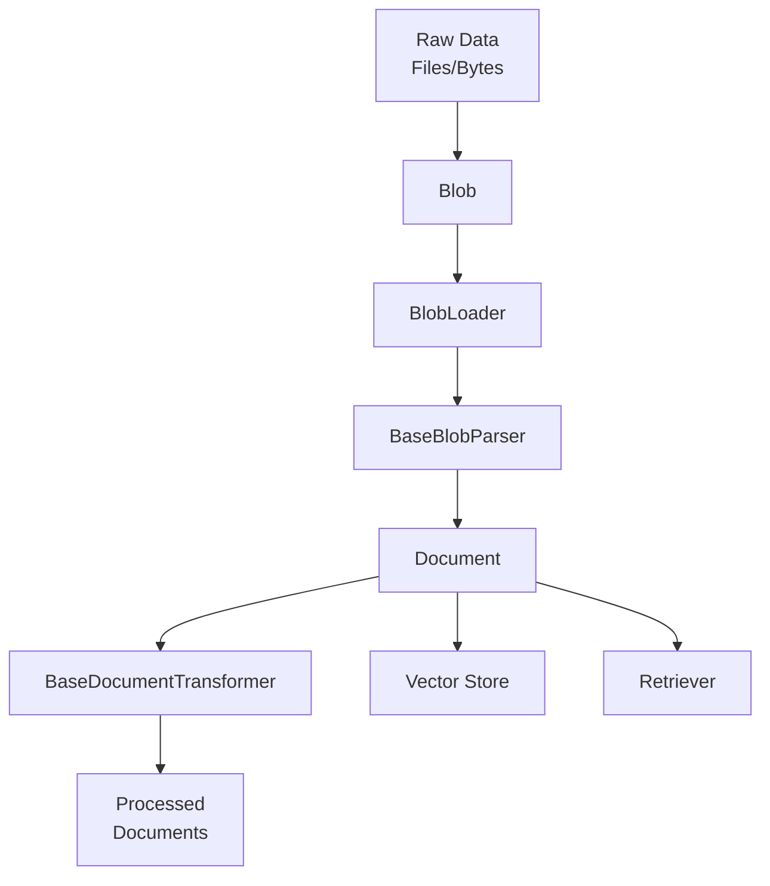
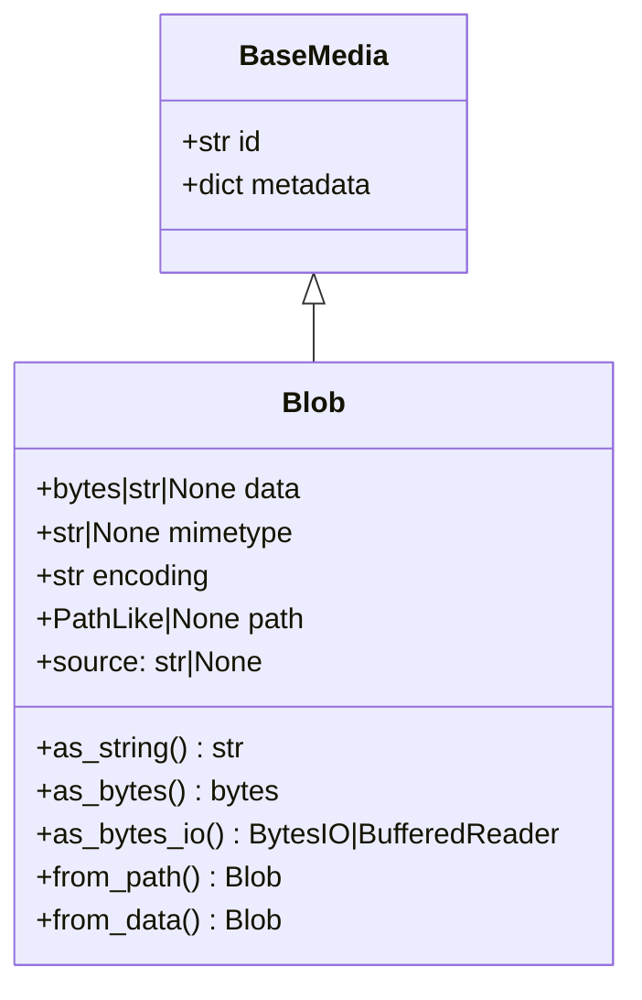
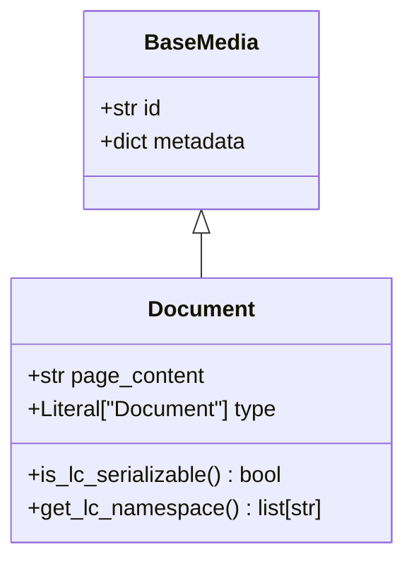
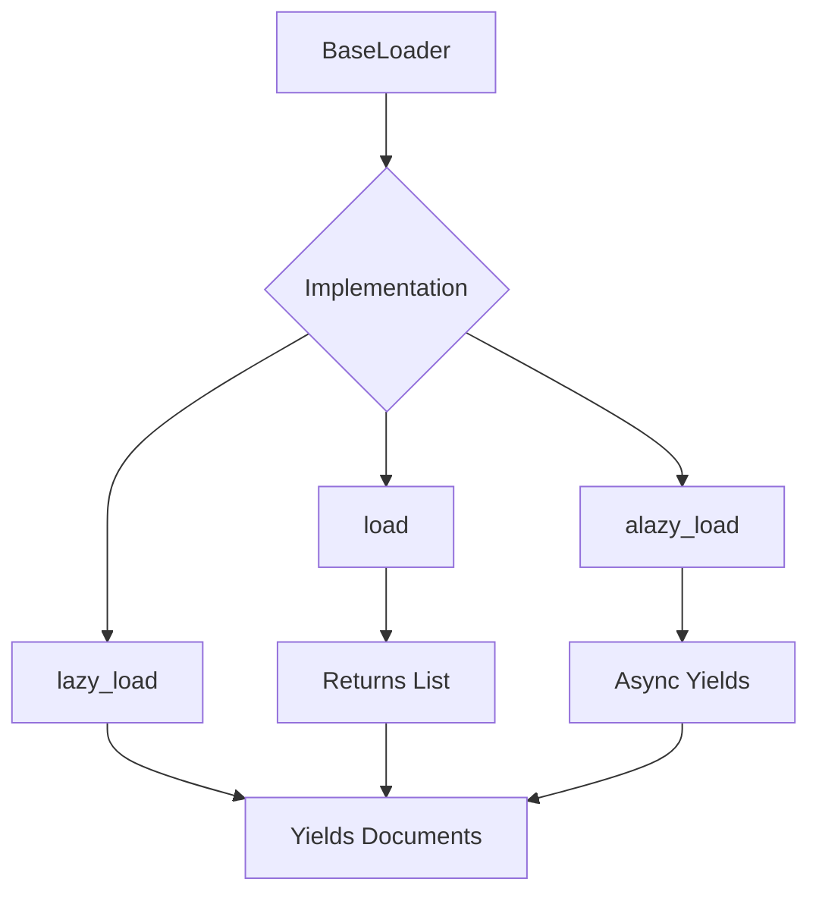
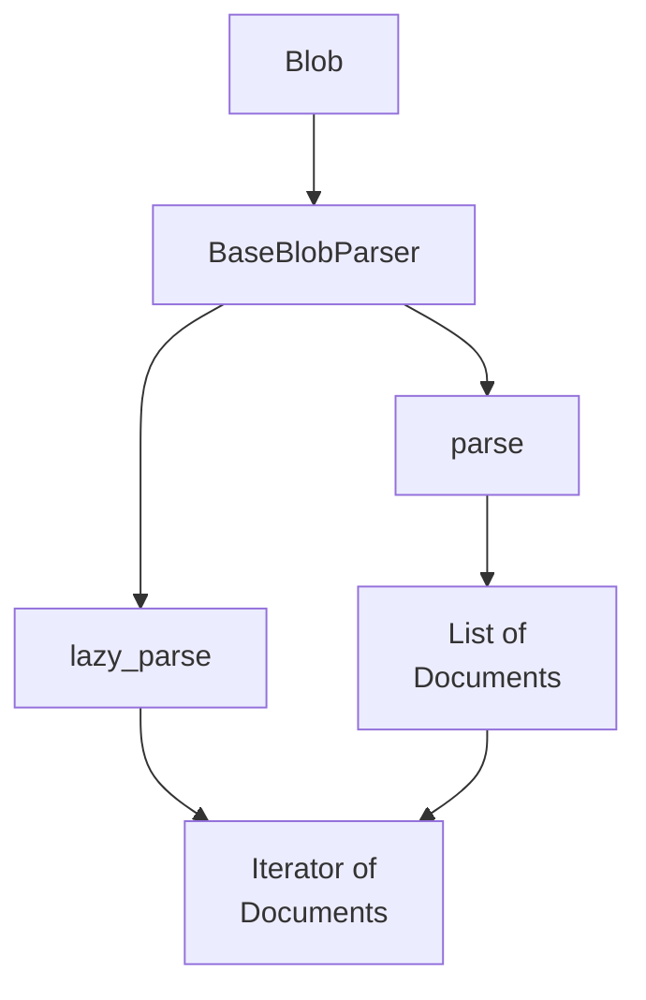
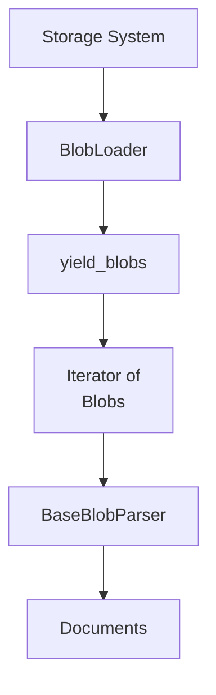
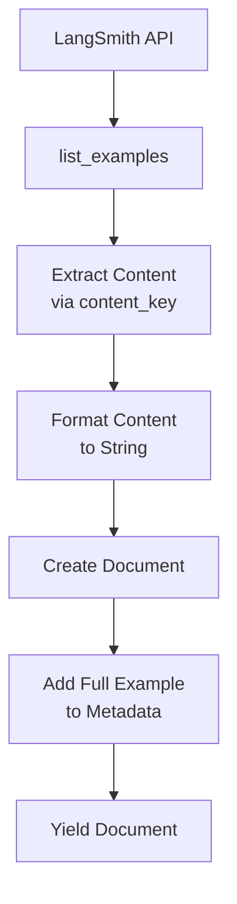
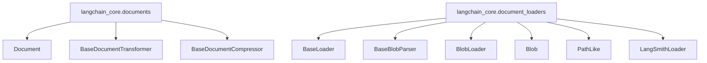

# Document Model & Loaders

The Document Model & Loaders system in LangChain provides core abstractions for handling data in retrieval-augmented generation (RAG) pipelines, vector stores, and document processing workflows. This module is distinct from LangChain's message content system used for LLM chat I/O, focusing specifically on data retrieval and processing rather than conversational interfaces. The architecture separates raw data loading (via Blobs and BlobLoaders) from document parsing and transformation, enabling flexible and composable document processing pipelines.

Sources: [libs/core/langchain_core/documents/__init__.py:1-15](../../../libs/core/langchain_core/documents/__init__.py#L1-L15), [libs/core/langchain_core/documents/base.py:1-13](../../../libs/core/langchain_core/documents/base.py#L1-L13)

## Core Architecture

The document loading and processing system is built on three foundational abstractions that work together to provide a flexible data pipeline:



The architecture follows a clear separation of concerns where raw data is first represented as Blobs, loaded through BlobLoaders, parsed into Documents, and then optionally transformed or stored for retrieval operations.

Sources: [libs/core/langchain_core/documents/base.py:1-13](../../../libs/core/langchain_core/documents/base.py#L1-L13), [libs/core/langchain_core/document_loaders/base.py:1-5](../../../libs/core/langchain_core/document_loaders/base.py#L1-L5)

## Base Media Class

The `BaseMedia` class provides common functionality for all content types used in retrieval and data processing workflows. It serves as the foundation for both `Blob` and `Document` classes.

### Fields and Properties

| Field | Type | Required | Description |
|-------|------|----------|-------------|
| `id` | `str \| None` | No | Optional identifier, ideally unique (UUID format recommended) |
| `metadata` | `dict` | No | Arbitrary metadata associated with the content (defaults to empty dict) |

The `id` field uses `coerce_numbers_to_str=True` to ensure numeric IDs are converted to strings. While currently optional, this field is expected to become required in future major releases after adoption by VectorStore implementations.

Sources: [libs/core/langchain_core/documents/base.py:29-49](../../../libs/core/langchain_core/documents/base.py#L29-L49)

## Blob: Raw Data Abstraction

The `Blob` class represents raw data (bytes or text) either in-memory or by file reference. Inspired by Mozilla's Blob API, it provides a unified interface for handling raw content before parsing.

### Class Diagram



Sources: [libs/core/langchain_core/documents/base.py:52-100](../../../libs/core/langchain_core/documents/base.py#L52-L100)

### Blob Fields

| Field | Type | Default | Description |
|-------|------|---------|-------------|
| `data` | `bytes \| str \| None` | `None` | Raw data associated with the Blob |
| `mimetype` | `str \| None` | `None` | MIME type (not file extension) |
| `encoding` | `str` | `"utf-8"` | Encoding for decoding bytes to string |
| `path` | `PathLike \| None` | `None` | Location where original content was found |

The Blob class is immutable (frozen) and requires either `data` or `path` to be provided during initialization.

Sources: [libs/core/langchain_core/documents/base.py:102-117](../../../libs/core/langchain_core/documents/base.py#L102-L117)

### Blob Data Access Methods

The Blob provides three primary methods for accessing its content:

**`as_string()`**: Reads data as a string, using the specified encoding. If data is not in memory, it reads from the file path.

**`as_bytes()`**: Returns data as bytes. Handles conversion from string if necessary, or reads from file path.

**`as_bytes_io()`**: Context manager that yields a byte stream (BytesIO or BufferedReader), useful for streaming large files without loading entirely into memory.

```python
# Example: Reading blob data
with blob.as_bytes_io() as f:
    chunk = f.read(1024)  # Read in chunks
```

Sources: [libs/core/langchain_core/documents/base.py:132-179](../../../libs/core/langchain_core/documents/base.py#L132-L179)

### Blob Factory Methods

The Blob class provides two factory methods for construction:

**`from_path(path, encoding="utf-8", mime_type=None, guess_type=True, metadata=None)`**

Loads a blob from a file path. The data is not immediately loaded into memory; instead, the blob acts as a lazy reference. The MIME type can be explicitly provided or automatically guessed from the file extension.

**`from_data(data, encoding="utf-8", mime_type=None, path=None, metadata=None)`**

Creates a blob from in-memory data (string or bytes). Optionally associates a path to indicate the data's origin.

Sources: [libs/core/langchain_core/documents/base.py:181-230](../../../libs/core/langchain_core/documents/base.py#L181-L230)

### Source Property

The `source` property provides a convenient way to retrieve the origin of the blob's data. It first checks for a `'source'` key in metadata; if not found, it returns the string representation of the path, or `None` if neither is available.

Sources: [libs/core/langchain_core/documents/base.py:119-130](../../../libs/core/langchain_core/documents/base.py#L119-L130)

## Document: Text Content for Retrieval

The `Document` class represents text content intended for retrieval workflows such as RAG pipelines, vector stores, and semantic search operations. It extends `BaseMedia` with a `page_content` field for storing textual data.



Sources: [libs/core/langchain_core/documents/base.py:237-279](../../../libs/core/langchain_core/documents/base.py#L237-L279)

### Document Fields

| Field | Type | Description |
|-------|------|-------------|
| `page_content` | `str` | The text content of the document |
| `type` | `Literal["Document"]` | Type identifier for serialization |
| `id` | `str \| None` | Inherited from BaseMedia |
| `metadata` | `dict` | Inherited from BaseMedia |

The `page_content` can be passed as either a positional or named argument during initialization.

Sources: [libs/core/langchain_core/documents/base.py:237-254](../../../libs/core/langchain_core/documents/base.py#L237-L254)

### Serialization Support

Documents are LangChain-serializable objects with a defined namespace:

- **Namespace**: `["langchain", "schema", "document"]`
- **Serializable**: Returns `True` from `is_lc_serializable()`

The `__str__` method is overridden to display only `page_content` and `metadata`, excluding the `id` field. This ensures backward compatibility with existing code that feeds Document objects directly into prompts.

Sources: [libs/core/langchain_core/documents/base.py:256-279](../../../libs/core/langchain_core/documents/base.py#L256-L279)

## Document Loaders

Document loaders provide interfaces for loading data from various sources into Document objects. The system distinguishes between loading raw data (BlobLoader) and parsing it into documents (BaseLoader, BaseBlobParser).

### BaseLoader Interface

The `BaseLoader` abstract class defines the standard interface for document loaders. Implementations should prioritize lazy-loading to avoid loading all documents into memory simultaneously.



Sources: [libs/core/langchain_core/document_loaders/base.py:24-35](../../../libs/core/langchain_core/document_loaders/base.py#L24-L35)

### BaseLoader Methods

| Method | Return Type | Description |
|--------|-------------|-------------|
| `lazy_load()` | `Iterator[Document]` | Lazy loading method (should be implemented by subclasses) |
| `load()` | `list[Document]` | Convenience method that calls `lazy_load()` and converts to list |
| `alazy_load()` | `AsyncIterator[Document]` | Async lazy loading using executor |
| `aload()` | `list[Document]` | Async version that collects all documents from `alazy_load()` |
| `load_and_split()` | `list[Document]` | Loads and splits documents using a TextSplitter |

The `load()` method is provided for user convenience and should not be overridden. Subclasses should implement `lazy_load()` instead.

Sources: [libs/core/langchain_core/document_loaders/base.py:37-95](../../../libs/core/langchain_core/document_loaders/base.py#L37-L95)

### Load and Split

The `load_and_split()` method integrates with the `langchain-text-splitters` package to chunk documents. It accepts an optional `TextSplitter` parameter and defaults to `RecursiveCharacterTextSplitter` if none is provided.

This method is marked as deprecated and should not be overridden by subclasses. It raises an `ImportError` if `langchain-text-splitters` is not installed and no custom splitter is provided.

Sources: [libs/core/langchain_core/document_loaders/base.py:58-79](../../../libs/core/langchain_core/document_loaders/base.py#L58-L79)

### Async Loading Implementation

The async methods (`alazy_load()` and `aload()`) use `run_in_executor()` to run synchronous iterator operations in a thread pool, enabling async iteration over documents without blocking the event loop.

```python
async def alazy_load(self) -> AsyncIterator[Document]:
    iterator = await run_in_executor(None, self.lazy_load)
    done = object()
    while True:
        doc = await run_in_executor(None, next, iterator, done)
        if doc is done:
            break
        yield doc
```

Sources: [libs/core/langchain_core/document_loaders/base.py:81-95](../../../libs/core/langchain_core/document_loaders/base.py#L81-L95)

## Blob Parsers

The `BaseBlobParser` abstract class provides an interface for parsing raw data from Blobs into Document objects. This separation allows parsers to be reused independently of how the blob was originally loaded.

### BaseBlobParser Interface



Sources: [libs/core/langchain_core/document_loaders/base.py:98-131](../../../libs/core/langchain_core/document_loaders/base.py#L98-L131)

### Parser Methods

| Method | Return Type | Description |
|--------|-------------|-------------|
| `lazy_parse(blob)` | `Iterator[Document]` | Abstract method for lazy parsing (must be implemented) |
| `parse(blob)` | `list[Document]` | Convenience method that converts lazy_parse to list |

The `lazy_parse()` method is abstract and must be implemented by subclasses. The `parse()` method is provided for convenience in interactive environments but production applications should favor `lazy_parse()`.

Sources: [libs/core/langchain_core/document_loaders/base.py:98-131](../../../libs/core/langchain_core/document_loaders/base.py#L98-L131)

## BlobLoader Interface

The `BlobLoader` abstract class defines the interface for loading raw content from storage systems. Implementers should return content lazily as a stream of Blob objects.



The single abstract method `yield_blobs()` returns an iterator of Blob objects, enabling lazy loading of large datasets.

Sources: [libs/core/langchain_core/document_loaders/blob_loaders.py:1-36](../../../libs/core/langchain_core/document_loaders/blob_loaders.py#L1-L36)

## LangSmith Loader

The `LangSmithLoader` is a specialized document loader that loads examples from LangSmith datasets as Document objects. It's designed for creating few-shot example retrievers by placing example inputs as page content and the full example data in metadata.

### LangSmithLoader Initialization Parameters

| Parameter | Type | Description |
|-----------|------|-------------|
| `dataset_id` | `uuid.UUID \| str \| None` | ID of the dataset to filter by |
| `dataset_name` | `str \| None` | Name of the dataset to filter by |
| `content_key` | `str` | Inputs key to use as Document page content (supports nested keys with '.') |
| `format_content` | `Callable \| None` | Function to convert content to string (defaults to JSON encoding) |
| `example_ids` | `Sequence[uuid.UUID \| str] \| None` | Specific example IDs to filter |
| `as_of` | `datetime \| str \| None` | Dataset version tag or timestamp |
| `splits` | `Sequence[str] \| None` | Dataset splits to include (train, test, validation) |
| `inline_s3_urls` | `bool` | Whether to inline S3 URLs (default: True) |
| `offset` | `int` | Starting offset (default: 0) |
| `limit` | `int \| None` | Maximum number of examples to return |
| `metadata` | `dict \| None` | Metadata to filter by |
| `filter` | `str \| None` | Structured filter string |
| `client` | `LangSmithClient \| None` | LangSmith client instance |

Sources: [libs/core/langchain_core/document_loaders/langsmith.py:21-95](../../../libs/core/langchain_core/document_loaders/langsmith.py#L21-L95)

### LangSmith Loading Process

The loader's `lazy_load()` method iterates through examples from the LangSmith client, extracting content based on the `content_key` path and formatting it using the `format_content` function:



The metadata includes all example fields with datetime and UUID types converted to strings for serialization compatibility. The default `_stringify()` function attempts JSON encoding with 2-space indentation, falling back to `str()` if JSON encoding fails.

Sources: [libs/core/langchain_core/document_loaders/langsmith.py:97-125](../../../libs/core/langchain_core/document_loaders/langsmith.py#L97-L125)

## Document Transformers and Compressors

The documents module exports two additional abstract interfaces for post-processing documents:

### BaseDocumentTransformer

Provides an interface for transforming documents (e.g., splitting, filtering, enrichment). This is referenced in the module's `__init__.py` but the implementation details are not included in the provided source files.

### BaseDocumentCompressor

Provides an interface for compressing or filtering documents, typically used in retrieval contexts to reduce the number of documents or their size before passing to an LLM.

Sources: [libs/core/langchain_core/documents/__init__.py:26-32](../../../libs/core/langchain_core/documents/__init__.py#L26-L32)

## Module Organization and Exports

The document loading system uses dynamic imports to optimize loading times and manage dependencies:



Both modules use `__getattr__` and dynamic import utilities to defer imports until attributes are accessed, reducing initial import overhead. The `__all__` tuple defines the public API, and `__dir__` returns the list of exported names.

Sources: [libs/core/langchain_core/documents/__init__.py:34-47](../../../libs/core/langchain_core/documents/__init__.py#L34-L47), [libs/core/langchain_core/document_loaders/__init__.py:21-35](../../../libs/core/langchain_core/document_loaders/__init__.py#L21-L35)

## Key Design Patterns

### Lazy Loading Pattern

The entire document loading system emphasizes lazy loading to handle large datasets efficiently. All loader and parser interfaces provide iterator-based methods (`lazy_load()`, `yield_blobs()`, `lazy_parse()`) as the primary implementation target, with convenience methods (`load()`, `parse()`) built on top.

### Separation of Concerns

The architecture cleanly separates:
- **Data representation** (Blob, Document)
- **Data loading** (BlobLoader, BaseLoader)
- **Data parsing** (BaseBlobParser)
- **Data transformation** (BaseDocumentTransformer, BaseDocumentCompressor)

This allows components to be mixed and matched, enabling blob loaders to work with any parser, and parsers to work with any loader.

### Immutability

The Blob class uses Pydantic's `frozen=True` configuration to ensure immutability, preventing accidental modification of loaded data and enabling safe sharing across threads.

Sources: [libs/core/langchain_core/documents/base.py:117](../../../libs/core/langchain_core/documents/base.py#L117), [libs/core/langchain_core/document_loaders/blob_loaders.py:8-12](../../../libs/core/langchain_core/document_loaders/blob_loaders.py#L8-L12)

## Summary

The Document Model & Loaders system provides a comprehensive framework for loading, parsing, and processing documents in LangChain applications. Built on three core abstractions (Blob, Document, and various loader interfaces), it enables flexible and efficient data pipelines for retrieval-augmented generation. The emphasis on lazy loading, separation of concerns, and composability makes it suitable for handling large-scale document processing while maintaining clean architectural boundaries between data loading, parsing, and transformation operations.