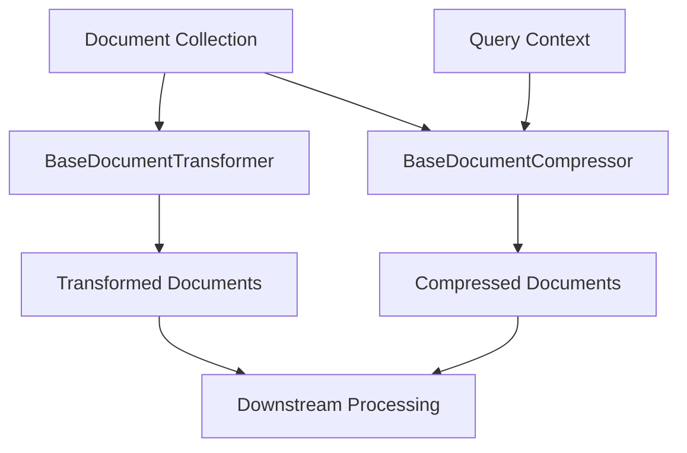
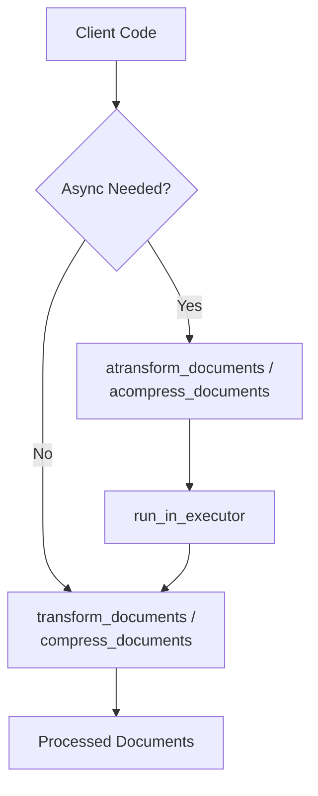
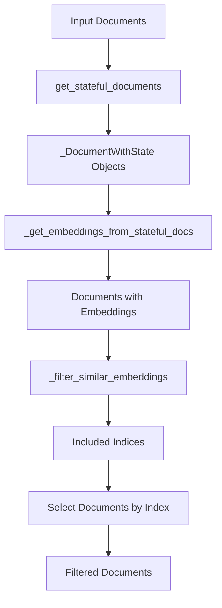
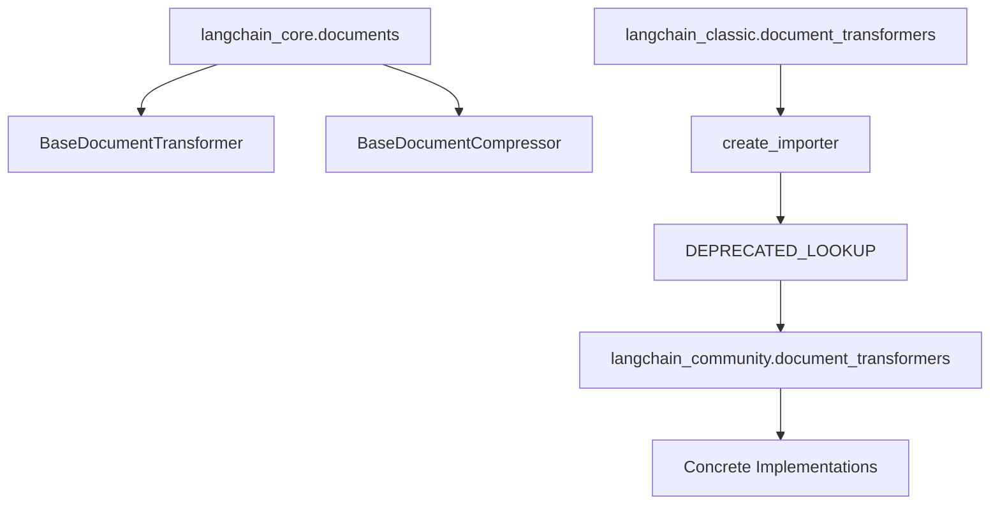

# Document Transformers & Compressors

Document Transformers and Compressors are core abstractions in LangChain for post-processing document collections. These components enable transformation, filtering, and compression of `Document` objects to optimize them for downstream tasks such as retrieval-augmented generation (RAG) and context management. Document Transformers operate on sequences of documents independently of queries, while Document Compressors perform query-aware compression and filtering of retrieved documents. Together, these abstractions provide a flexible framework for manipulating document collections at various stages of the document processing pipeline.

The framework provides base classes (`BaseDocumentTransformer` and `BaseDocumentCompressor`) that define standard interfaces, along with concrete implementations for common operations like redundancy filtering, clustering, reordering, and metadata enrichment. These components are designed to be composable and can be chained together to create sophisticated document processing pipelines.

Sources: [transformers.py:1-67](../../../libs/core/langchain_core/documents/transformers.py#L1-L67), [compressor.py:1-64](../../../libs/core/langchain_core/documents/compressor.py#L1-L64)

## Architecture Overview

The document processing architecture is built around two primary base classes that define distinct processing paradigms:



**BaseDocumentTransformer** operates on document sequences without query context, performing stateless or stateful transformations such as filtering, enrichment, or reformatting. **BaseDocumentCompressor** takes both documents and a query string, enabling query-aware operations like relevance-based filtering and re-ranking.

Sources: [transformers.py:18-67](../../../libs/core/langchain_core/documents/transformers.py#L18-L67), [compressor.py:16-64](../../../libs/core/langchain_core/documents/compressor.py#L16-L64)

## BaseDocumentTransformer

### Class Definition and Interface

The `BaseDocumentTransformer` abstract base class defines the core interface for document transformation operations:

```python
class BaseDocumentTransformer(ABC):
    """Abstract base class for document transformation.

    A document transformation takes a sequence of `Document` objects and returns a
    sequence of transformed `Document` objects.
    """

    @abstractmethod
    def transform_documents(
        self, documents: Sequence[Document], **kwargs: Any
    ) -> Sequence[Document]:
        """Transform a list of documents."""

    async def atransform_documents(
        self, documents: Sequence[Document], **kwargs: Any
    ) -> Sequence[Document]:
        """Asynchronously transform a list of documents."""
        return await run_in_executor(
            None, self.transform_documents, documents, **kwargs
        )
```

The interface provides both synchronous (`transform_documents`) and asynchronous (`atransform_documents`) methods. The asynchronous implementation uses `run_in_executor` to execute the synchronous method in a thread pool by default, allowing subclasses to override only the synchronous method unless they have truly async implementations.

Sources: [transformers.py:18-67](../../../libs/core/langchain_core/documents/transformers.py#L18-L67)

### Key Methods

| Method | Parameters | Returns | Description |
|--------|-----------|---------|-------------|
| `transform_documents` | `documents: Sequence[Document]`, `**kwargs: Any` | `Sequence[Document]` | Abstract method that transforms a sequence of documents. Must be implemented by subclasses. |
| `atransform_documents` | `documents: Sequence[Document]`, `**kwargs: Any` | `Sequence[Document]` | Async transformation method with default thread-pool execution of the sync method. |

Sources: [transformers.py:47-67](../../../libs/core/langchain_core/documents/transformers.py#L47-L67)

### Implementation Example

The source code provides a detailed example of implementing a redundancy filter using embeddings:

```python
class EmbeddingsRedundantFilter(BaseDocumentTransformer, BaseModel):
    embeddings: Embeddings
    similarity_fn: Callable = cosine_similarity
    similarity_threshold: float = 0.95

    class Config:
        arbitrary_types_allowed = True

    def transform_documents(
        self, documents: Sequence[Document], **kwargs: Any
    ) -> Sequence[Document]:
        stateful_documents = get_stateful_documents(documents)
        embedded_documents = _get_embeddings_from_stateful_docs(
            self.embeddings, stateful_documents
        )
        included_idxs = _filter_similar_embeddings(
            embedded_documents,
            self.similarity_fn,
            self.similarity_threshold,
        )
        return [stateful_documents[i] for i in sorted(included_idxs)]
```

This example demonstrates how to combine `BaseDocumentTransformer` with Pydantic's `BaseModel` for configuration management, use embeddings for similarity comparison, and filter out redundant documents based on a similarity threshold.

Sources: [transformers.py:20-46](../../../libs/core/langchain_core/documents/transformers.py#L20-L46)

## BaseDocumentCompressor

### Class Definition and Interface

The `BaseDocumentCompressor` class provides query-aware document compression capabilities:

```python
class BaseDocumentCompressor(BaseModel, ABC):
    """Base class for document compressors.

    This abstraction is primarily used for post-processing of retrieved documents.

    `Document` objects matching a given query are first retrieved.

    Then the list of documents can be further processed.

    For example, one could re-rank the retrieved documents using an LLM.
    """

    @abstractmethod
    def compress_documents(
        self,
        documents: Sequence[Document],
        query: str,
        callbacks: Callbacks | None = None,
    ) -> Sequence[Document]:
        """Compress retrieved documents given the query context."""

    async def acompress_documents(
        self,
        documents: Sequence[Document],
        query: str,
        callbacks: Callbacks | None = None,
    ) -> Sequence[Document]:
        """Async compress retrieved documents given the query context."""
        return await run_in_executor(
            None, self.compress_documents, documents, query, callbacks
        )
```

Unlike `BaseDocumentTransformer`, this class inherits from `BaseModel` (Pydantic) and requires a `query` parameter, enabling implementations to perform query-specific operations like relevance scoring and re-ranking.

Sources: [compressor.py:16-64](../../../libs/core/langchain_core/documents/compressor.py#L16-L64)

### Key Methods

| Method | Parameters | Returns | Description |
|--------|-----------|---------|-------------|
| `compress_documents` | `documents: Sequence[Document]`, `query: str`, `callbacks: Callbacks \| None` | `Sequence[Document]` | Abstract method that compresses documents given query context. Must be implemented by subclasses. |
| `acompress_documents` | `documents: Sequence[Document]`, `query: str`, `callbacks: Callbacks \| None` | `Sequence[Document]` | Async compression with default thread-pool execution and callback support. |

Sources: [compressor.py:30-64](../../../libs/core/langchain_core/documents/compressor.py#L30-L64)

### Design Considerations

The documentation explicitly notes that users should favor using `RunnableLambda` instead of subclassing from this interface, indicating a shift toward more functional composition patterns in the LangChain framework. The compressor abstraction is primarily designed for post-processing retrieved documents in retrieval pipelines.

Sources: [compressor.py:18-28](../../../libs/core/langchain_core/documents/compressor.py#L18-L28)

## Available Document Transformers

LangChain provides several concrete implementations of document transformers through the `langchain_community` package:

| Transformer | Purpose | Key Features |
|-------------|---------|--------------|
| `EmbeddingsRedundantFilter` | Remove duplicate or highly similar documents | Uses embeddings and similarity thresholds to filter redundant content |
| `EmbeddingsClusteringFilter` | Group similar documents into clusters | Clusters documents based on embedding similarity |
| `LongContextReorder` | Reorder documents for optimal context utilization | Addresses "lost in the middle" problem by strategic reordering |
| `BeautifulSoupTransformer` | Parse and transform HTML content | Extracts structured data from HTML documents |
| `Html2TextTransformer` | Convert HTML to plain text | Strips HTML tags and formatting |
| `GoogleTranslateTransformer` | Translate document content | Integrates with Google Translate API |
| `DoctranTextTranslator` | Translate using Doctran service | Alternative translation implementation |
| `DoctranQATransformer` | Generate Q&A pairs from documents | Creates question-answer pairs for training or evaluation |
| `DoctranPropertyExtractor` | Extract properties from documents | Structured data extraction from unstructured text |
| `NucliaTextTransformer` | Transform text using Nuclia service | Third-party text transformation service |
| `OpenAIMetadataTagger` | Add metadata tags using OpenAI | LLM-based metadata enrichment |

Sources: [__init__.py:1-56](../../../libs/langchain/langchain_classic/document_transformers/__init__.py#L1-L56)

## Processing Patterns

### Synchronous vs Asynchronous Processing

Both base classes follow a consistent pattern for async support:



The default async implementations use `run_in_executor` to run synchronous methods in thread pools, providing async compatibility without requiring subclasses to implement truly asynchronous logic unless needed.

Sources: [transformers.py:57-67](../../../libs/core/langchain_core/documents/transformers.py#L57-L67), [compressor.py:52-64](../../../libs/core/langchain_core/documents/compressor.py#L52-L64)

### Stateful Document Processing

The embeddings-based transformers use a stateful document pattern to track processing state:



The `get_stateful_documents` helper function wraps documents in a state-tracking structure, enabling transformers to maintain processing metadata without modifying the original document objects.

Sources: [embeddings_redundant_filter.py:1-43](../../../libs/langchain/langchain_classic/document_transformers/embeddings_redundant_filter.py#L1-L43)

## Module Organization

The document transformers are organized across multiple packages with a deprecation and import forwarding system:



The `langchain_classic` package uses dynamic import mechanisms to forward requests to `langchain_community`, allowing for package reorganization while maintaining backward compatibility. The `create_importer` function with `DEPRECATED_LOOKUP` dictionaries handles this forwarding.

Sources: [__init__.py:1-56](../../../libs/langchain/langchain_classic/document_transformers/__init__.py#L1-L56), [embeddings_redundant_filter.py:1-43](../../../libs/langchain/langchain_classic/document_transformers/embeddings_redundant_filter.py#L1-L43), [long_context_reorder.py:1-23](../../../libs/langchain/langchain_classic/document_transformers/long_context_reorder.py#L1-L23)

### Import Structure

| Package | Purpose | Components |
|---------|---------|------------|
| `langchain_core.documents` | Core abstractions | `BaseDocumentTransformer`, `BaseDocumentCompressor` |
| `langchain_classic.document_transformers` | Compatibility layer | Import forwarding, deprecation warnings |
| `langchain_community.document_transformers` | Concrete implementations | All specific transformer and compressor classes |

Sources: [transformers.py:1-10](../../../libs/core/langchain_core/documents/transformers.py#L1-L10), [compressor.py:1-15](../../../libs/core/langchain_core/documents/compressor.py#L1-L15), [__init__.py:17-42](../../../libs/langchain/langchain_classic/document_transformers/__init__.py#L17-L42)

## Callback Support

The `BaseDocumentCompressor` interface includes explicit support for LangChain's callback system through optional `Callbacks` parameters. This enables monitoring, logging, and debugging of compression operations:

```python
def compress_documents(
    self,
    documents: Sequence[Document],
    query: str,
    callbacks: Callbacks | None = None,
) -> Sequence[Document]:
```

Callbacks can be used to track document processing metrics, log intermediate results, or integrate with observability systems. The async method signature maintains the same callback parameter for consistency.

Sources: [compressor.py:30-50](../../../libs/core/langchain_core/documents/compressor.py#L30-L50)

## Summary

Document Transformers and Compressors provide a foundational abstraction layer for document manipulation in LangChain applications. The `BaseDocumentTransformer` enables query-agnostic transformations like filtering, enrichment, and reformatting, while `BaseDocumentCompressor` supports query-aware operations essential for retrieval pipelines. Both abstractions provide async support through thread-pool execution by default, integrate with LangChain's callback system, and are designed to be composable for building sophisticated document processing workflows. The framework includes numerous concrete implementations for common operations, organized across multiple packages with backward compatibility support through dynamic import forwarding.

Sources: [transformers.py:1-67](../../../libs/core/langchain_core/documents/transformers.py#L1-L67), [compressor.py:1-64](../../../libs/core/langchain_core/documents/compressor.py#L1-L64), [__init__.py:1-56](../../../libs/langchain/langchain_classic/document_transformers/__init__.py#L1-L56)