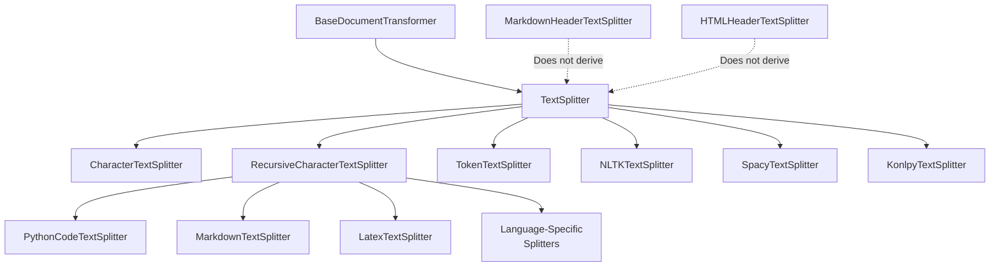
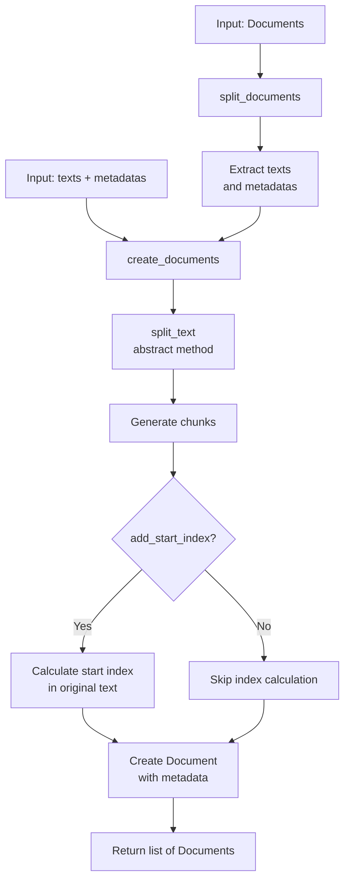
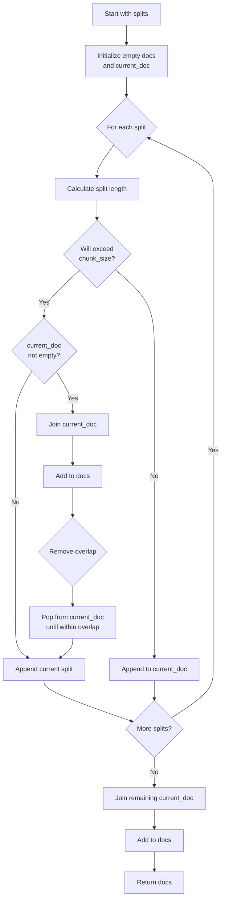
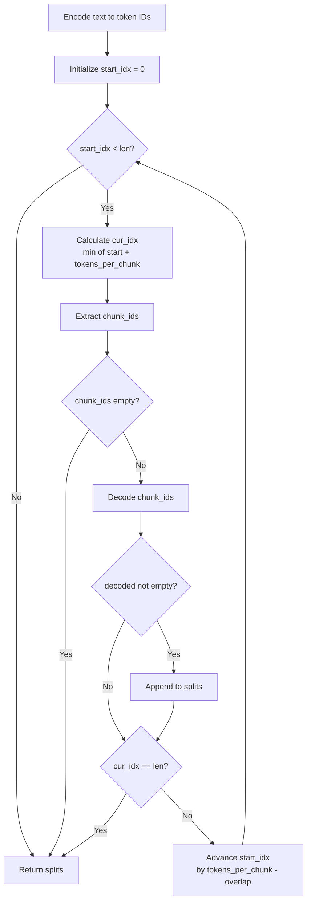
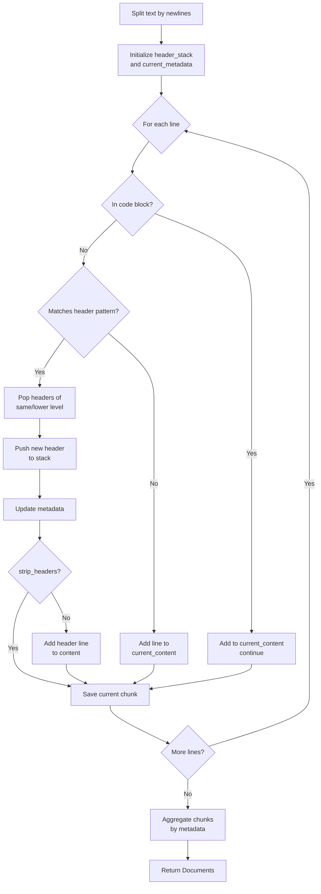

# Text Splitters

## Introduction

Text Splitters are a core component of LangChain's document loading and processing pipeline, designed to break down large text documents into smaller, manageable chunks. This is essential for working with Large Language Models (LLMs) that have token limitations and for improving the relevance of information retrieval in vector databases. The text splitter system provides a flexible, extensible architecture with multiple implementations optimized for different content types, including plain text, code in various programming languages, Markdown, HTML, LaTeX, and JSON.

The base `TextSplitter` class implements the `BaseDocumentTransformer` interface and provides common functionality for chunking text with configurable chunk sizes, overlaps, and length measurement functions. Specialized splitters extend this base to handle syntax-aware splitting for specific formats, preserving semantic structure and context across chunks.

Sources: [base.py:1-550](../../../libs/text-splitters/langchain_text_splitters/base.py#L1-L550), [__init__.py:1-50](../../../libs/text-splitters/langchain_text_splitters/__init__.py#L1-L50)

## Architecture Overview

The text splitter architecture follows an object-oriented design with a base abstract class and multiple specialized implementations:



Sources: [__init__.py:1-50](../../../libs/text-splitters/langchain_text_splitters/__init__.py#L1-L50), [base.py:60-90](../../../libs/text-splitters/langchain_text_splitters/base.py#L60-L90)

## Base TextSplitter Class

### Core Configuration

The `TextSplitter` abstract base class provides the foundation for all text splitting implementations with the following configurable parameters:

| Parameter | Type | Default | Description |
|-----------|------|---------|-------------|
| `chunk_size` | `int` | `4000` | Maximum size of chunks to return |
| `chunk_overlap` | `int` | `200` | Overlap in characters between chunks |
| `length_function` | `Callable[[str], int]` | `len` | Function that measures the length of given chunks |
| `keep_separator` | `bool \| Literal["start", "end"]` | `False` | Whether to keep the separator and where to place it |
| `add_start_index` | `bool` | `False` | If `True`, includes chunk's start index in metadata |
| `strip_whitespace` | `bool` | `True` | If `True`, strips whitespace from the start and end of every document |

The constructor validates these parameters to ensure `chunk_size > 0`, `chunk_overlap >= 0`, and `chunk_overlap <= chunk_size`.

Sources: [base.py:64-119](../../../libs/text-splitters/langchain_text_splitters/base.py#L64-L119)

### Document Creation and Splitting

The base class provides methods for creating and splitting documents:



The `create_documents` method converts raw text strings into `Document` objects with metadata, while `split_documents` processes existing documents by splitting their content and preserving their metadata.

Sources: [base.py:124-166](../../../libs/text-splitters/langchain_text_splitters/base.py#L124-L166)

### Chunk Merging Algorithm

The `_merge_splits` method implements a sophisticated algorithm to combine smaller text pieces into appropriately sized chunks:



This algorithm ensures chunks respect the configured `chunk_size` while maintaining the specified `chunk_overlap` between adjacent chunks.

Sources: [base.py:172-209](../../../libs/text-splitters/langchain_text_splitters/base.py#L172-L209)

## Character-Based Splitters

### CharacterTextSplitter

The `CharacterTextSplitter` splits text based on a configurable separator string or regex pattern:

```python
def __init__(
    self,
    separator: str = "\n\n",
    is_separator_regex: bool = False,
    **kwargs: Any,
) -> None:
```

Key features:
- Supports literal string separators or regex patterns
- Handles zero-width lookaround assertions in regex patterns
- Configurable separator retention (keep at start, end, or discard)

The splitting logic detects lookaround prefixes (`(?=`, `(?<!`, `(?<=`, `(?!`) to prevent re-insertion of zero-width patterns during the merge phase.

Sources: [character.py:13-60](../../../libs/text-splitters/langchain_text_splitters/character.py#L13-L60)

### RecursiveCharacterTextSplitter

The `RecursiveCharacterTextSplitter` attempts to split text using a hierarchy of separators, recursively trying each until it finds one that produces appropriately sized chunks:

```python
def __init__(
    self,
    separators: list[str] | None = None,
    keep_separator: bool | Literal["start", "end"] = True,
    is_separator_regex: bool = False,
    **kwargs: Any,
) -> None:
```

Default separators: `["\n\n", "\n", " ", ""]`

The recursive algorithm:
1. Tries each separator in order to find one that exists in the text
2. Splits the text using the found separator
3. For chunks exceeding `chunk_size`, recursively applies the remaining separators
4. Merges appropriately sized chunks with configured overlap

Sources: [character.py:63-132](../../../libs/text-splitters/langchain_text_splitters/character.py#L63-L132)

## Language-Specific Code Splitters

### Supported Languages

The `Language` enum defines all supported programming and markup languages:

```python
class Language(str, Enum):
    """Enum of the programming languages."""
    CPP = "cpp"
    GO = "go"
    JAVA = "java"
    KOTLIN = "kotlin"
    JS = "js"
    TS = "ts"
    PHP = "php"
    PROTO = "proto"
    PYTHON = "python"
    # ... and many more
```

Sources: [base.py:268-297](../../../libs/text-splitters/langchain_text_splitters/base.py#L268-L297)

### Language-Specific Separators

The `get_separators_for_language` method provides syntax-aware separator hierarchies for each language. For example, Python uses:

```python
if language == Language.PYTHON:
    return [
        # First, try to split along class definitions
        "\nclass ",
        "\ndef ",
        "\n\tdef ",
        # Now split by the normal type of lines
        "\n\n",
        "\n",
        " ",
        "",
    ]
```

This ensures code is split at logical boundaries like class and function definitions before falling back to generic line breaks.

Sources: [character.py:154-180](../../../libs/text-splitters/langchain_text_splitters/character.py#L154-L180)

### PythonCodeTextSplitter

A specialized splitter for Python code that automatically applies Python-specific separators:

```python
class PythonCodeTextSplitter(RecursiveCharacterTextSplitter):
    """Attempts to split the text along Python syntax."""

    def __init__(self, **kwargs: Any) -> None:
        """Initialize a `PythonCodeTextSplitter`."""
        separators = self.get_separators_for_language(Language.PYTHON)
        super().__init__(separators=separators, **kwargs)
```

Sources: [python.py:1-16](../../../libs/text-splitters/langchain_text_splitters/python.py#L1-L16)

### Language Separator Examples

| Language | Primary Separators | Purpose |
|----------|-------------------|---------|
| Java | `\nclass `, `\npublic `, `\nprivate `, `\nif `, `\nfor ` | Split along class definitions, access modifiers, control flow |
| JavaScript | `\nfunction `, `\nconst `, `\nlet `, `\nvar `, `\nclass ` | Split along function and variable declarations |
| Go | `\nfunc `, `\nvar `, `\nconst `, `\ntype ` | Split along function and type definitions |
| Rust | `\nfn `, `\nconst `, `\nlet `, `\nif `, `\nwhile ` | Split along function definitions and control flow |

Sources: [character.py:192-395](../../../libs/text-splitters/langchain_text_splitters/character.py#L192-L395)

## Token-Based Splitting

### TokenTextSplitter

The `TokenTextSplitter` uses tokenizer-based length measurement instead of character counts, essential for LLM applications:

```python
class TokenTextSplitter(TextSplitter):
    """Splitting text to tokens using model tokenizer."""

    def __init__(
        self,
        encoding_name: str = "gpt2",
        model_name: str | None = None,
        allowed_special: Literal["all"] | AbstractSet[str] | None = None,
        disallowed_special: Literal["all"] | Collection[str] = "all",
        **kwargs: Any,
    ) -> None:
```

This splitter requires the `tiktoken` library and uses a `Tokenizer` dataclass to encapsulate encoding/decoding logic:

```python
@dataclass(frozen=True)
class Tokenizer:
    """Tokenizer data class."""
    chunk_overlap: int
    tokens_per_chunk: int
    decode: Callable[[list[int]], str]
    encode: Callable[[str], list[int]]
```

Sources: [base.py:234-265](../../../libs/text-splitters/langchain_text_splitters/base.py#L234-L265), [base.py:300-318](../../../libs/text-splitters/langchain_text_splitters/base.py#L300-L318)

### Token Splitting Algorithm

The `split_text_on_tokens` function implements the token-based splitting logic:



Sources: [base.py:321-355](../../../libs/text-splitters/langchain_text_splitters/base.py#L321-L355)

### Integration with Tokenizers

The base `TextSplitter` class provides factory methods for creating splitters with specific tokenizers:

**Hugging Face Tokenizers:**
```python
@classmethod
def from_huggingface_tokenizer(
    cls, tokenizer: PreTrainedTokenizerBase, **kwargs: Any
) -> TextSplitter:
```

**Tiktoken (OpenAI) Tokenizers:**
```python
@classmethod
def from_tiktoken_encoder(
    cls,
    encoding_name: str = "gpt2",
    model_name: str | None = None,
    allowed_special: Literal["all"] | AbstractSet[str] | None = None,
    disallowed_special: Literal["all"] | Collection[str] = "all",
    **kwargs: Any,
) -> Self:
```

Sources: [base.py:211-232](../../../libs/text-splitters/langchain_text_splitters/base.py#L211-L232), [base.py:234-265](../../../libs/text-splitters/langchain_text_splitters/base.py#L234-L265)

## Markdown Splitters

### MarkdownTextSplitter

The `MarkdownTextSplitter` extends `RecursiveCharacterTextSplitter` with Markdown-specific separators:

```python
class MarkdownTextSplitter(RecursiveCharacterTextSplitter):
    """Attempts to split the text along Markdown-formatted headings."""

    def __init__(self, **kwargs: Any) -> None:
        """Initialize a `MarkdownTextSplitter`."""
        separators = self.get_separators_for_language(Language.MARKDOWN)
        super().__init__(separators=separators, **kwargs)
```

Markdown separators include:
- Heading markers: `\n#{1,6} `
- Code block endings: ``` ```\n ```
- Horizontal rules: `\n\\*\\*\\*+\n`, `\n---+\n`, `\n___+\n`

Sources: [markdown.py:12-22](../../../libs/text-splitters/langchain_text_splitters/markdown.py#L12-L22)

### MarkdownHeaderTextSplitter

The `MarkdownHeaderTextSplitter` provides header-aware splitting that preserves document hierarchy in metadata:

```python
def __init__(
    self,
    headers_to_split_on: list[tuple[str, str]],
    return_each_line: bool = False,
    strip_headers: bool = True,
    custom_header_patterns: dict[str, int] | None = None,
) -> None:
```

**Key Features:**
- Tracks header hierarchy as metadata
- Supports custom header patterns (e.g., `**Header**` format)
- Can return individual lines or aggregate chunks with common headers
- Handles code blocks to prevent false header detection

**TypedDict Structures:**
```python
class LineType(TypedDict):
    """Line type as `TypedDict`."""
    metadata: dict[str, str]
    content: str

class HeaderType(TypedDict):
    """Header type as `TypedDict`."""
    level: int
    name: str
    data: str
```

Sources: [markdown.py:25-78](../../../libs/text-splitters/langchain_text_splitters/markdown.py#L25-L78), [markdown.py:257-273](../../../libs/text-splitters/langchain_text_splitters/markdown.py#L257-L273)

### Markdown Header Splitting Algorithm



Sources: [markdown.py:117-232](../../../libs/text-splitters/langchain_text_splitters/markdown.py#L117-L232)

### ExperimentalMarkdownSyntaxTextSplitter

An experimental implementation that retains exact whitespace while extracting structured metadata:

**Key Differences from MarkdownHeaderTextSplitter:**
- Preserves original whitespace and formatting
- Extracts code blocks with language metadata
- Splits on horizontal rules
- Uses sensible defaults for header splitting

```python
def __init__(
    self,
    headers_to_split_on: list[tuple[str, str]] | None = None,
    return_each_line: bool = False,
    strip_headers: bool = True,
) -> None:
```

Default headers: `{"#": "Header 1", "##": "Header 2", ..., "######": "Header 6"}`

Sources: [markdown.py:275-340](../../../libs/text-splitters/langchain_text_splitters/markdown.py#L275-L340)

## Specialized Splitters

### Available Implementations

The LangChain text splitter ecosystem includes several specialized implementations for specific use cases:

| Splitter | Purpose | Base Class |
|----------|---------|------------|
| `NLTKTextSplitter` | Natural language sentence splitting using NLTK | `TextSplitter` |
| `SpacyTextSplitter` | Sentence splitting using spaCy | `TextSplitter` |
| `KonlpyTextSplitter` | Korean language text splitting | `TextSplitter` |
| `SentenceTransformersTokenTextSplitter` | Token splitting for sentence transformers | `TextSplitter` |
| `RecursiveJsonSplitter` | JSON structure-aware splitting | N/A |
| `JSFrameworkTextSplitter` | JavaScript framework code splitting | N/A |
| `HTMLHeaderTextSplitter` | HTML header-based splitting | N/A |
| `HTMLSectionSplitter` | HTML section-based splitting | N/A |
| `HTMLSemanticPreservingSplitter` | Semantic HTML structure preservation | N/A |
| `LatexTextSplitter` | LaTeX document splitting | `RecursiveCharacterTextSplitter` |

Sources: [__init__.py:8-47](../../../libs/text-splitters/langchain_text_splitters/__init__.py#L8-L47)

### Note on HTML and Markdown Splitters

The documentation explicitly notes that `MarkdownHeaderTextSplitter` and `HTMLHeaderTextSplitter` do not derive from the `TextSplitter` base class, indicating they implement specialized splitting logic independently.

Sources: [__init__.py:3-7](../../../libs/text-splitters/langchain_text_splitters/__init__.py#L3-L7)

## Usage Patterns

### Basic Text Splitting

```python
# Character-based splitting
splitter = CharacterTextSplitter(
    separator="\n\n",
    chunk_size=1000,
    chunk_overlap=200
)
chunks = splitter.split_text(text)

# Recursive character splitting
splitter = RecursiveCharacterTextSplitter(
    chunk_size=1000,
    chunk_overlap=200
)
documents = splitter.create_documents([text])
```

### Language-Specific Code Splitting

```python
# Using factory method
splitter = RecursiveCharacterTextSplitter.from_language(
    language=Language.PYTHON,
    chunk_size=1000,
    chunk_overlap=100
)

# Direct instantiation
splitter = PythonCodeTextSplitter(
    chunk_size=1000,
    chunk_overlap=100
)
```

### Token-Based Splitting

```python
# Using tiktoken
splitter = TokenTextSplitter.from_tiktoken_encoder(
    encoding_name="cl100k_base",
    chunk_size=500,
    chunk_overlap=50
)

# Using Hugging Face tokenizer
from transformers import AutoTokenizer
tokenizer = AutoTokenizer.from_pretrained("bert-base-uncased")
splitter = CharacterTextSplitter.from_huggingface_tokenizer(
    tokenizer=tokenizer,
    chunk_size=512,
    chunk_overlap=50
)
```

### Markdown Header Splitting

```python
headers_to_split_on = [
    ("#", "Header 1"),
    ("##", "Header 2"),
    ("###", "Header 3"),
]
splitter = MarkdownHeaderTextSplitter(
    headers_to_split_on=headers_to_split_on,
    strip_headers=False
)
documents = splitter.split_text(markdown_text)
```

Sources: [base.py:211-265](../../../libs/text-splitters/langchain_text_splitters/base.py#L211-L265), [character.py:134-153](../../../libs/text-splitters/langchain_text_splitters/character.py#L134-L153), [markdown.py:25-50](../../../libs/text-splitters/langchain_text_splitters/markdown.py#L25-L50)

## Summary

The LangChain text splitter system provides a comprehensive, extensible framework for breaking down documents into manageable chunks suitable for LLM processing and vector database storage. The architecture balances flexibility through the abstract base class with specialized implementations for various content types and languages. Key capabilities include configurable chunk sizes and overlaps, syntax-aware splitting for programming languages, structure-preserving splitting for markup languages, and token-based splitting for LLM compatibility. The system's recursive splitting algorithm and merge logic ensure chunks respect size constraints while maintaining semantic coherence through intelligent separator selection and overlap management.

Sources: [base.py:1-355](../../../libs/text-splitters/langchain_text_splitters/base.py#L1-L355), [character.py:1-850](../../../libs/text-splitters/langchain_text_splitters/character.py#L1-L850), [markdown.py:1-450](../../../libs/text-splitters/langchain_text_splitters/markdown.py#L1-L450), [python.py:1-16](../../../libs/text-splitters/langchain_text_splitters/python.py#L1-L16), [__init__.py:1-50](../../../libs/text-splitters/langchain_text_splitters/__init__.py#L1-L50)