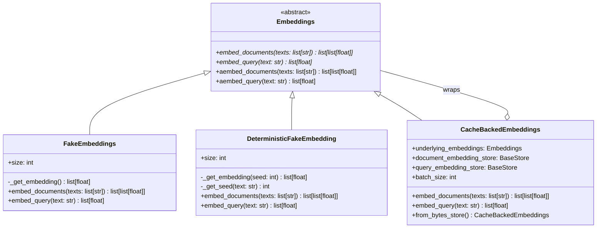
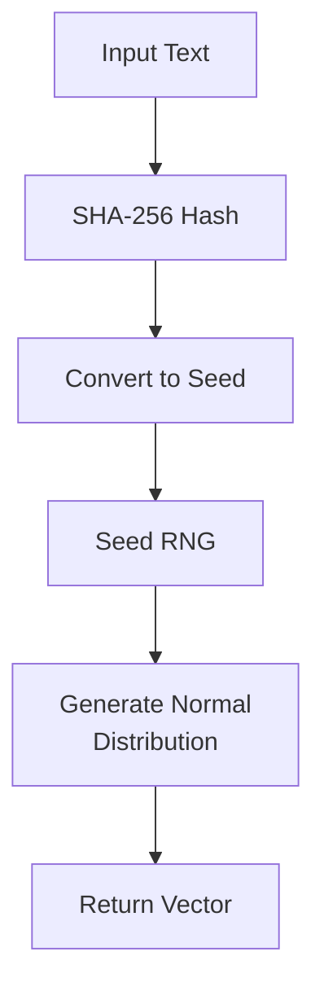
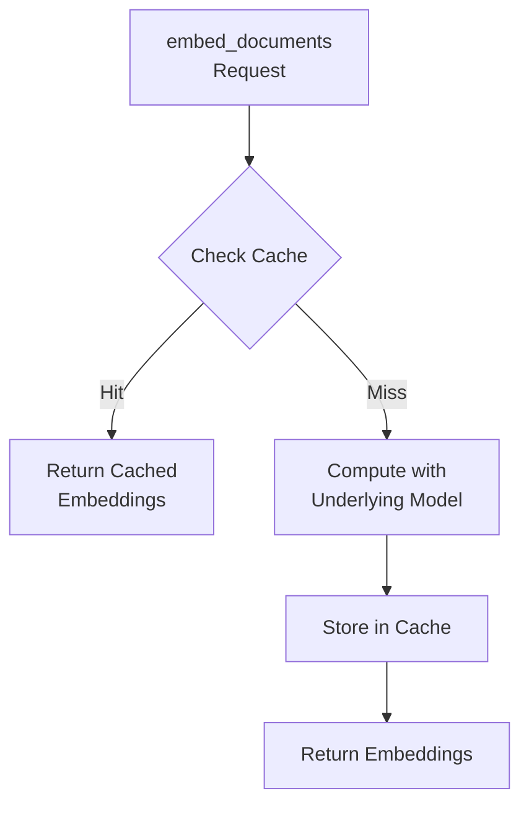
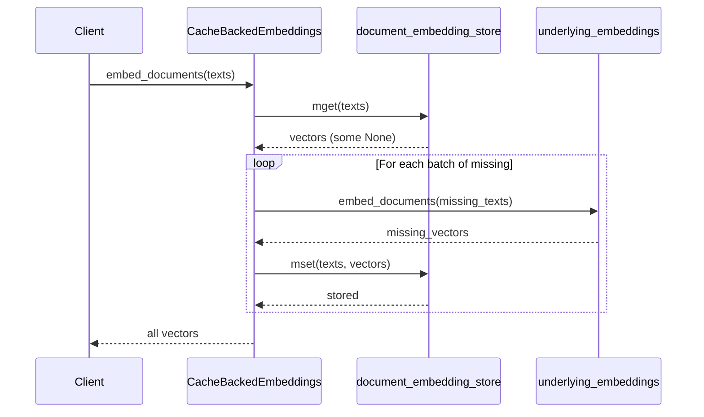

# Embeddings Interface

The Embeddings Interface is a core abstraction in LangChain that defines the standard contract for text embedding models. Text embedding models map text to vectors (points in n-dimensional space), where similar texts are typically mapped to nearby points. This interface provides a consistent API for integrating various embedding model implementations into LangChain applications, enabling seamless switching between different embedding providers while maintaining the same application code.

The interface defines both synchronous and asynchronous methods for embedding documents and queries, with default async implementations that delegate to synchronous methods. This design allows implementers to provide optimized async implementations when available while maintaining backward compatibility. The framework also includes testing utilities and a caching layer to optimize performance in production scenarios.

Sources: [embeddings.py:1-67](../../../libs/core/langchain_core/embeddings/embeddings.py#L1-L67)

## Core Interface

### Base Embeddings Class

The `Embeddings` class is an abstract base class (ABC) that defines the contract all embedding implementations must follow. It distinguishes between two types of embeddings:

- **Document Embeddings**: Used for embedding multiple documents that will be stored in a vector database
- **Query Embeddings**: Used for embedding search queries to find relevant documents

While these are often identical, the abstraction allows treating them independently for models that may optimize differently for documents versus queries.

Sources: [embeddings.py:8-67](../../../libs/core/langchain_core/embeddings/embeddings.py#L8-L67)



Sources: [embeddings.py:8-67](../../../libs/core/langchain_core/embeddings/embeddings.py#L8-L67), [fake.py:1-120](../../../libs/core/langchain_core/embeddings/fake.py#L1-L120), [cache.py:1-370](../../../libs/langchain/langchain_classic/embeddings/cache.py#L1-L370)

### Required Methods

The interface defines two abstract methods that all implementations must provide:

| Method | Parameters | Return Type | Description |
|--------|-----------|-------------|-------------|
| `embed_documents` | `texts: list[str]` | `list[list[float]]` | Embeds a list of documents, returning a vector for each |
| `embed_query` | `text: str` | `list[float]` | Embeds a single query text, returning one vector |

Sources: [embeddings.py:32-50](../../../libs/core/langchain_core/embeddings/embeddings.py#L32-L50)

### Asynchronous Support

The interface provides async versions of both embedding methods. By default, these delegate to the synchronous implementations using `run_in_executor`, but implementations can override them with native async code for better performance:

```python
async def aembed_documents(self, texts: list[str]) -> list[list[float]]:
    """Asynchronous Embed search docs."""
    return await run_in_executor(None, self.embed_documents, texts)

async def aembed_query(self, text: str) -> list[float]:
    """Asynchronous Embed query text."""
    return await run_in_executor(None, self.embed_query, text)
```

Sources: [embeddings.py:52-67](../../../libs/core/langchain_core/embeddings/embeddings.py#L52-L67)

## Testing Utilities

### FakeEmbeddings

`FakeEmbeddings` is a toy embedding model designed exclusively for unit testing. It generates embeddings by sampling from a normal distribution with random values, making it unsuitable for production use but useful for testing application logic without requiring actual embedding model API calls.

**Key Features:**
- Configurable embedding vector size
- Random embeddings from normal distribution
- Lightweight with no external dependencies

```python
from langchain_core.embeddings import FakeEmbeddings

embed = FakeEmbeddings(size=100)
vector = embed.embed_query("The meaning of life is 42")
# Returns random vector: [-0.700234640213188, -0.581266257710429, ...]
```

Sources: [fake.py:16-68](../../../libs/core/langchain_core/embeddings/fake.py#L16-L68)

### DeterministicFakeEmbedding

`DeterministicFakeEmbedding` extends the testing utilities with deterministic behavior. It generates embeddings by hashing the input text to create a seed, then using that seed to generate consistent vectors from a normal distribution. This ensures the same text always produces the same embedding, which is valuable for reproducible testing.

**Implementation Details:**



The seed generation process uses SHA-256 hashing:

```python
@staticmethod
def _get_seed(text: str) -> int:
    """Get a seed for the random generator, using the hash of the text."""
    return int(hashlib.sha256(text.encode("utf-8")).hexdigest(), 16) % 10**8
```

Sources: [fake.py:71-120](../../../libs/core/langchain_core/embeddings/fake.py#L71-L120)

## Caching Layer

### CacheBackedEmbeddings

`CacheBackedEmbeddings` is a wrapper that adds caching capabilities to any embedding model implementation. Since computing embeddings can be expensive (both in terms of API costs and latency), caching previously computed embeddings can significantly improve performance and reduce costs.

**Architecture:**



Sources: [cache.py:103-370](../../../libs/langchain/langchain_classic/embeddings/cache.py#L103-L370)

### Key Features

| Feature | Description |
|---------|-------------|
| Document Caching | Always caches document embeddings by default |
| Query Caching | Optional query embedding caching (disabled by default) |
| Batch Processing | Supports configurable batch sizes for efficient cache updates |
| Async Support | Provides async versions of all embedding methods |
| Custom Key Encoding | Supports multiple hashing algorithms (SHA-1, SHA-256, SHA-512, BLAKE2b) |

Sources: [cache.py:103-142](../../../libs/langchain/langchain_classic/embeddings/cache.py#L103-L142)

### Cache Initialization

The `from_bytes_store` class method provides a convenient way to create a cache-backed embedder with proper serialization:

```python
from langchain_classic.embeddings import CacheBackedEmbeddings
from langchain_classic.storage import LocalFileStore
from langchain_openai import OpenAIEmbeddings

store = LocalFileStore("./my_cache")
underlying_embedder = OpenAIEmbeddings()
embedder = CacheBackedEmbeddings.from_bytes_store(
    underlying_embedder, 
    store, 
    namespace=underlying_embedder.model
)
```

Sources: [cache.py:289-370](../../../libs/langchain/langchain_classic/embeddings/cache.py#L289-L370)

### Key Encoding Strategies

The caching layer supports multiple hashing algorithms for generating cache keys from text. Each algorithm offers different trade-offs:

| Algorithm | Speed | Collision Resistance | Use Case |
|-----------|-------|---------------------|----------|
| `sha1` | Fast | ⚠️ Not collision-resistant | Legacy, testing (default with warning) |
| `blake2b` | Very Fast | ✅ Cryptographically strong | Recommended for new applications |
| `sha256` | Moderate | ✅ Cryptographically strong | Standard secure option |
| `sha512` | Slower | ✅ Cryptographically strong | Maximum security |

The default SHA-1 encoder emits a warning about collision resistance:

```python
def _warn_about_sha1_encoder() -> None:
    """Emit a one-time warning about SHA-1 collision weaknesses."""
    warnings.warn(
        "Using default key encoder: SHA-1 is *not* collision-resistant. "
        "While acceptable for most cache scenarios, a motivated attacker "
        "can craft two different payloads that map to the same cache key...",
        category=UserWarning,
        stacklevel=2,
    )
```

Sources: [cache.py:62-103](../../../libs/langchain/langchain_classic/embeddings/cache.py#L62-L103), [cache.py:116-138](../../../libs/langchain/langchain_classic/embeddings/cache.py#L116-L138)

### Cache Operation Flow

The embedding process with caching follows this sequence:



The implementation uses batch processing to efficiently handle cache misses:

```python
def embed_documents(self, texts: list[str]) -> list[list[float]]:
    vectors: list[list[float] | None] = self.document_embedding_store.mget(texts)
    all_missing_indices: list[int] = [
        i for i, vector in enumerate(vectors) if vector is None
    ]

    for missing_indices in batch_iterate(self.batch_size, all_missing_indices):
        missing_texts = [texts[i] for i in missing_indices]
        missing_vectors = self.underlying_embeddings.embed_documents(missing_texts)
        self.document_embedding_store.mset(
            list(zip(missing_texts, missing_vectors, strict=False))
        )
```

Sources: [cache.py:144-181](../../../libs/langchain/langchain_classic/embeddings/cache.py#L144-L181)

## Module Organization

The embeddings module uses dynamic imports for lazy loading of components:

```python
_dynamic_imports = {
    "Embeddings": "embeddings",
    "DeterministicFakeEmbedding": "fake",
    "FakeEmbeddings": "fake",
}

def __getattr__(attr_name: str) -> object:
    module_name = _dynamic_imports.get(attr_name)
    result = import_attr(attr_name, module_name, __spec__.parent)
    globals()[attr_name] = result
    return result
```

This approach allows the module to defer imports until components are actually used, reducing initial load time and memory usage.

Sources: [__init__.py:1-27](../../../libs/core/langchain_core/embeddings/__init__.py#L1-L27)

## Related Interfaces

### Cross Encoders

While not part of the embeddings interface directly, LangChain also provides a `BaseCrossEncoder` interface for models that score text pair similarity directly rather than through embeddings:

```python
class BaseCrossEncoder(ABC):
    """Interface for cross encoder models."""

    @abstractmethod
    def score(self, text_pairs: list[tuple[str, str]]) -> list[float]:
        """Score pairs' similarity."""
```

Cross encoders are typically more accurate than bi-encoders (standard embeddings) for pairwise similarity tasks but cannot be used with vector databases since they don't produce independent embeddings.

Sources: [cross_encoders.py:1-15](../../../libs/core/langchain_core/cross_encoders.py#L1-L15)

## Summary

The Embeddings Interface provides a foundational abstraction for text embedding models in LangChain, enabling consistent integration of various embedding providers. The interface separates document and query embeddings, supports both synchronous and asynchronous operations, and includes comprehensive testing utilities. The caching layer adds production-ready performance optimizations with configurable storage backends and multiple hashing strategies. This design allows developers to write embedding-agnostic code while maintaining flexibility to optimize for specific use cases and embedding models.

Sources: [embeddings.py:1-67](../../../libs/core/langchain_core/embeddings/embeddings.py#L1-L67), [fake.py:1-120](../../../libs/core/langchain_core/embeddings/fake.py#L1-L120), [cache.py:1-370](../../../libs/langchain/langchain_classic/embeddings/cache.py#L1-L370)