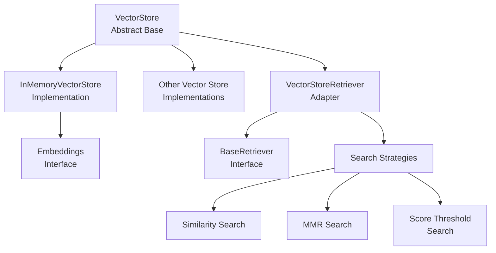
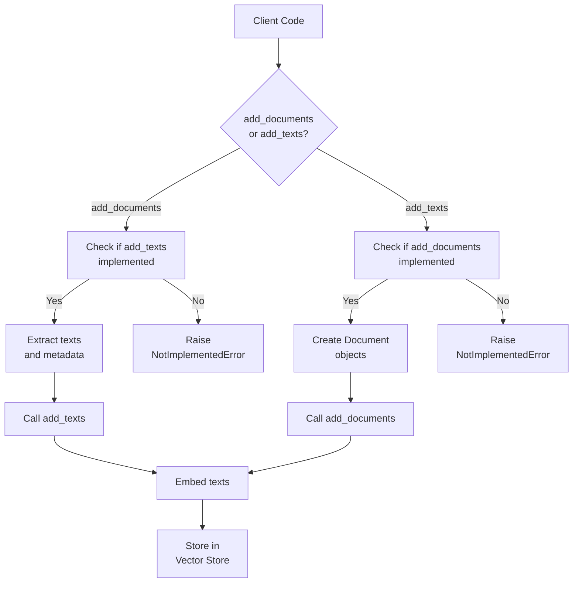
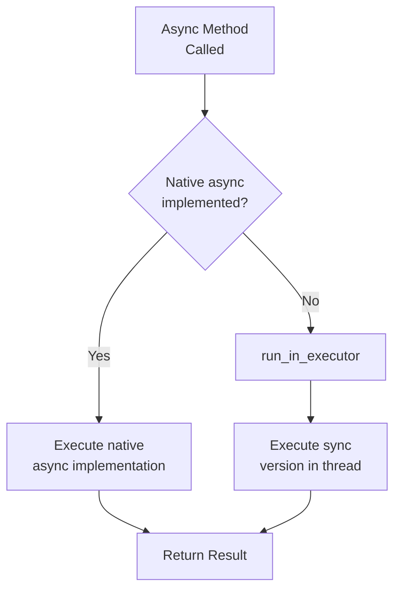
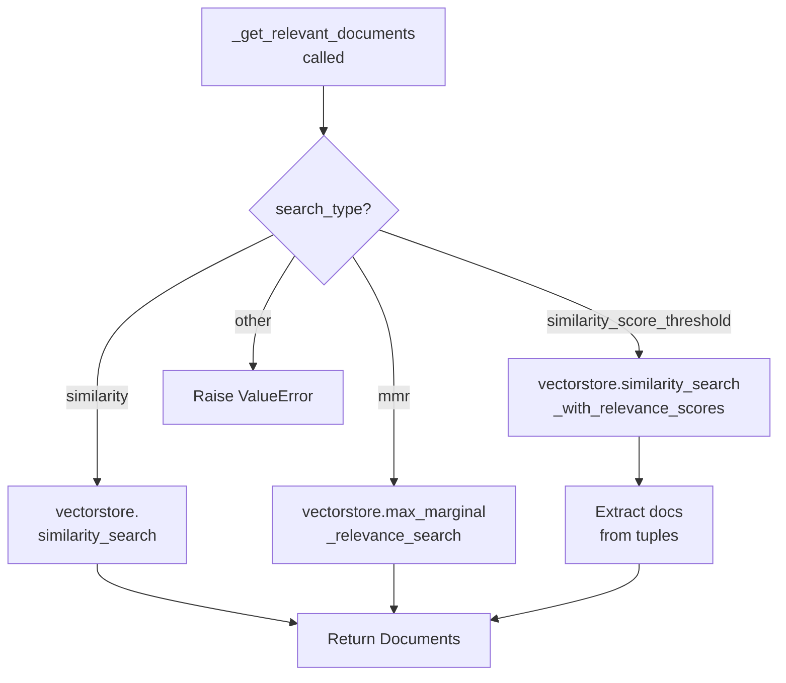
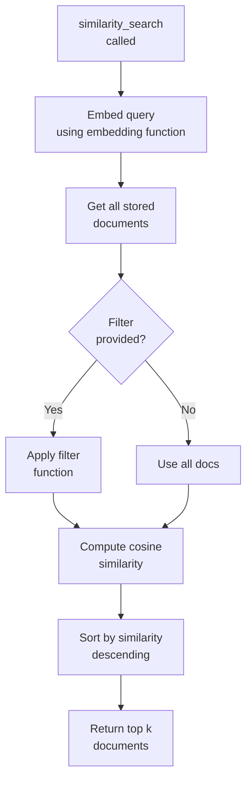
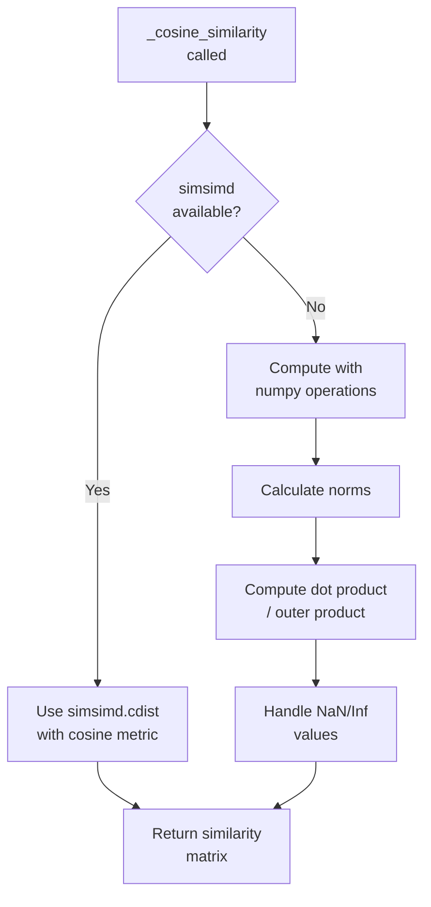
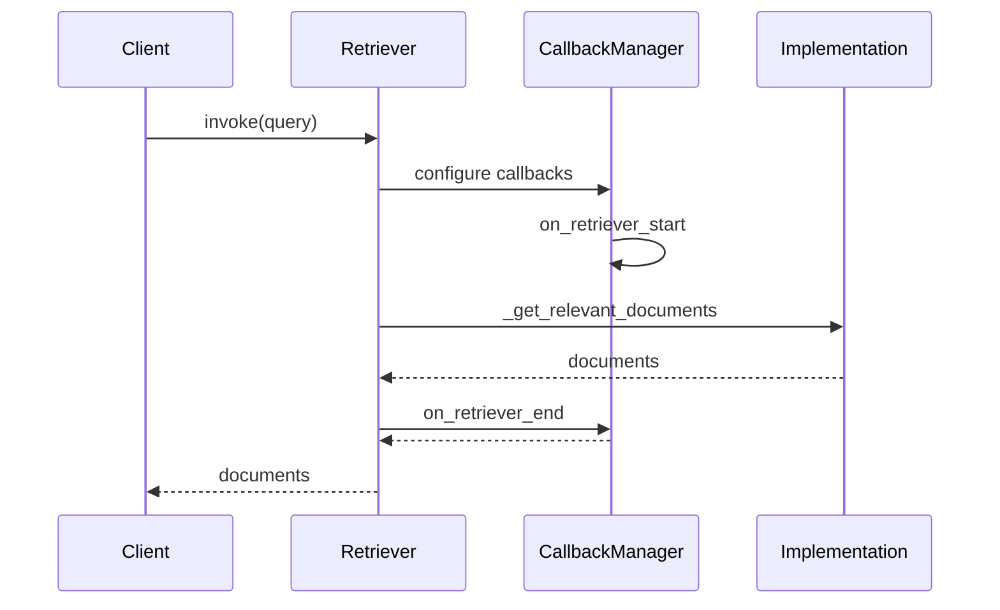

# Vector Store Interface & Retriever

The Vector Store Interface & Retriever system provides a foundational abstraction layer for storing, searching, and retrieving embedded documents in LangChain. Vector stores enable one of the most common patterns in LLM applications: embedding unstructured data and performing similarity searches to retrieve the most relevant documents for a given query. The system is built around two core abstractions: the `VectorStore` base class, which defines the interface for vector storage and search operations, and the `VectorStoreRetriever`, which wraps vector stores to provide a standardized retrieval interface compatible with LangChain's composable architecture.

This module supports both synchronous and asynchronous operations, multiple search strategies (similarity, MMR, score threshold), and provides a reference implementation through `InMemoryVectorStore` for testing and lightweight use cases.

Sources: [base.py:1-15](../../../libs/core/langchain_core/vectorstores/base.py#L1-L15), [__init__.py:1-10](../../../libs/core/langchain_core/vectorstores/__init__.py#L1-L10)

## Architecture Overview

The vector store system is organized into three primary layers: the abstract interface layer (`VectorStore`), the retriever adapter layer (`VectorStoreRetriever`), and concrete implementations (e.g., `InMemoryVectorStore`). The architecture supports dynamic imports to reduce initial load time and avoid circular dependencies.



Sources: [base.py:37-46](../../../libs/core/langchain_core/vectorstores/base.py#L37-L46), [retrievers.py:40-46](../../../libs/core/langchain_core/retrievers.py#L40-L46)

## VectorStore Base Class

The `VectorStore` abstract base class defines the core interface that all vector store implementations must follow. It provides methods for adding documents, performing various types of searches, and managing stored vectors.

### Core Methods

| Method | Purpose | Required Implementation |
|--------|---------|------------------------|
| `add_texts` | Add text strings with metadata to the store | Optional (delegates to `add_documents`) |
| `add_documents` | Add Document objects to the store | Optional (delegates to `add_texts`) |
| `similarity_search` | Find most similar documents to a query | **Required** (abstract) |
| `similarity_search_with_score` | Return documents with similarity scores | Optional |
| `max_marginal_relevance_search` | Search with diversity optimization | Optional |
| `delete` | Remove documents by ID | Optional |
| `get_by_ids` | Retrieve documents by their IDs | Optional |

Sources: [base.py:48-53](../../../libs/core/langchain_core/vectorstores/base.py#L48-L53), [base.py:393-407](../../../libs/core/langchain_core/vectorstores/base.py#L393-L407)

### Document Addition Flow

The system provides flexible document addition through two complementary methods that delegate to each other based on implementation:



Sources: [base.py:55-100](../../../libs/core/langchain_core/vectorstores/base.py#L55-L100), [base.py:175-201](../../../libs/core/langchain_core/vectorstores/base.py#L175-L201)

### Search Types and Strategies

The `VectorStore` interface supports three primary search strategies, each optimized for different retrieval scenarios:

#### Similarity Search

Basic vector similarity search returns the k most similar documents to a query based on embedding distance:

```python
def similarity_search(
    self, query: str, k: int = 4, **kwargs: Any
) -> list[Document]:
    """Return docs most similar to query.
    
    Args:
        query: Input text.
        k: Number of Document objects to return.
        **kwargs: Arguments to pass to the search method.
    """
```

Sources: [base.py:393-407](../../../libs/core/langchain_core/vectorstores/base.py#L393-L407)

#### Maximal Marginal Relevance (MMR)

MMR search optimizes for both similarity to the query AND diversity among results, reducing redundancy in retrieved documents:

```python
def max_marginal_relevance_search(
    self,
    query: str,
    k: int = 4,
    fetch_k: int = 20,
    lambda_mult: float = 0.5,
    **kwargs: Any,
) -> list[Document]:
    """Return docs selected using the maximal marginal relevance.
    
    Args:
        query: Text to look up documents similar to.
        k: Number of Document objects to return.
        fetch_k: Number of Document objects to fetch to pass to MMR algorithm.
        lambda_mult: Number between 0 and 1 that determines the degree of
            diversity among the results with 0 corresponding to maximum diversity
            and 1 to minimum diversity.
    """
```

Sources: [base.py:662-687](../../../libs/core/langchain_core/vectorstores/base.py#L662-L687)

#### Similarity Score Threshold

This strategy filters results to only return documents meeting a minimum relevance threshold:

```python
def similarity_search_with_relevance_scores(
    self,
    query: str,
    k: int = 4,
    **kwargs: Any,
) -> list[tuple[Document, float]]:
    """Return docs and relevance scores in the range [0, 1].
    
    0 is dissimilar, 1 is most similar.
    
    Args:
        query: Input text.
        k: Number of Document objects to return.
        **kwargs: Should include score_threshold, an optional floating point value
            between 0 to 1 to filter the resulting set of retrieved docs.
    """
```

Sources: [base.py:548-576](../../../libs/core/langchain_core/vectorstores/base.py#L548-L576)

### Relevance Score Functions

The vector store provides static methods to normalize different distance metrics into relevance scores on a 0-1 scale:

| Distance Metric | Score Function | Normalization Strategy |
|----------------|----------------|------------------------|
| Euclidean | `_euclidean_relevance_score_fn` | `1.0 - distance / sqrt(2)` |
| Cosine | `_cosine_relevance_score_fn` | `1.0 - distance` |
| Max Inner Product | `_max_inner_product_relevance_score_fn` | `1.0 - distance` (if positive), else `-1.0 * distance` |

Sources: [base.py:409-434](../../../libs/core/langchain_core/vectorstores/base.py#L409-L434)

### Asynchronous Operations

All core methods have async counterparts (prefixed with 'a') that default to running the synchronous version in an executor but can be overridden for native async implementations:



Sources: [base.py:139-157](../../../libs/core/langchain_core/vectorstores/base.py#L139-L157), [base.py:633-660](../../../libs/core/langchain_core/vectorstores/base.py#L633-L660)

## VectorStoreRetriever

The `VectorStoreRetriever` class adapts any `VectorStore` implementation to conform to the `BaseRetriever` interface, enabling vector stores to be used seamlessly within LangChain's retrieval and chain compositions.

### Configuration Parameters

```python
class VectorStoreRetriever(BaseRetriever):
    """Base Retriever class for VectorStore."""

    vectorstore: VectorStore
    """VectorStore to use for retrieval."""

    search_type: str = "similarity"
    """Type of search to perform."""

    search_kwargs: dict = Field(default_factory=dict)
    """Keyword arguments to pass to the search function."""

    allowed_search_types: ClassVar[Collection[str]] = (
        "similarity",
        "similarity_score_threshold",
        "mmr",
    )
```

Sources: [base.py:861-881](../../../libs/core/langchain_core/vectorstores/base.py#L861-L881)

### Search Type Validation

The retriever validates search configuration at initialization to ensure compatibility:

```python
@model_validator(mode="before")
@classmethod
def validate_search_type(cls, values: dict) -> Any:
    """Validate search type.
    
    Raises:
        ValueError: If search_type is not one of the allowed search types.
        ValueError: If score_threshold is not specified with a float value(0~1)
    """
    search_type = values.get("search_type", "similarity")
    if search_type not in cls.allowed_search_types:
        msg = (
            f"search_type of {search_type} not allowed. Valid values are: "
            f"{cls.allowed_search_types}"
        )
        raise ValueError(msg)
    if search_type == "similarity_score_threshold":
        score_threshold = values.get("search_kwargs", {}).get("score_threshold")
        if (score_threshold is None) or (not isinstance(score_threshold, float)):
            msg = (
                "`score_threshold` is not specified with a float value(0~1) "
                "in `search_kwargs`."
            )
            raise ValueError(msg)
    return values
```

Sources: [base.py:883-909](../../../libs/core/langchain_core/vectorstores/base.py#L883-L909)

### Retrieval Flow

The retriever implements the `_get_relevant_documents` method to delegate to the appropriate vector store search method:



Sources: [base.py:930-948](../../../libs/core/langchain_core/vectorstores/base.py#L930-L948)

### LangSmith Tracing Integration

The retriever provides enhanced tracing parameters for LangSmith observability:

```python
def _get_ls_params(self, **kwargs: Any) -> LangSmithRetrieverParams:
    """Get standard params for tracing."""
    kwargs_ = self.search_kwargs | kwargs

    ls_params = super()._get_ls_params(**kwargs_)

    ls_params["ls_vector_store_provider"] = self.vectorstore.__class__.__name__

    if self.vectorstore.embeddings:
        ls_params["ls_embedding_provider"] = (
            self.vectorstore.embeddings.__class__.__name__
        )
    elif hasattr(self.vectorstore, "embedding") and isinstance(
        self.vectorstore.embedding, Embeddings
    ):
        ls_params["ls_embedding_provider"] = (
            self.vectorstore.embedding.__class__.__name__
        )

    return ls_params
```

Sources: [base.py:911-928](../../../libs/core/langchain_core/vectorstores/base.py#L911-L928)

## InMemoryVectorStore Implementation

The `InMemoryVectorStore` provides a lightweight, reference implementation of the `VectorStore` interface using an in-memory dictionary and numpy-based cosine similarity calculations.

### Data Structure

Documents are stored in a dictionary with the following schema:

```python
self.store: dict[str, dict[str, Any]] = {}
# Each entry contains:
# {
#     "id": str,
#     "vector": list[float],
#     "text": str,
#     "metadata": dict
# }
```

Sources: [in_memory.py:130-134](../../../libs/core/langchain_core/vectorstores/in_memory.py#L130-L134)

### Similarity Search Implementation

The in-memory implementation uses cosine similarity for search operations:



Sources: [in_memory.py:233-269](../../../libs/core/langchain_core/vectorstores/in_memory.py#L233-L269)

### MMR Search with Diversity

The MMR implementation fetches more candidates than needed and applies diversity optimization:

```python
def max_marginal_relevance_search_by_vector(
    self,
    embedding: list[float],
    k: int = 4,
    fetch_k: int = 20,
    lambda_mult: float = 0.5,
    *,
    filter: Callable[[Document], bool] | None = None,
    **kwargs: Any,
) -> list[Document]:
    prefetch_hits = self._similarity_search_with_score_by_vector(
        embedding=embedding,
        k=fetch_k,
        filter=filter,
    )

    if not _HAS_NUMPY:
        msg = (
            "numpy must be installed to use max_marginal_relevance_search "
            "pip install numpy"
        )
        raise ImportError(msg)

    mmr_chosen_indices = maximal_marginal_relevance(
        np.array(embedding, dtype=np.float32),
        [vector for _, _, vector in prefetch_hits],
        k=k,
        lambda_mult=lambda_mult,
    )
    return [prefetch_hits[idx][0] for idx in mmr_chosen_indices]
```

Sources: [in_memory.py:316-344](../../../libs/core/langchain_core/vectorstores/in_memory.py#L316-L344)

### Persistence Operations

The in-memory store supports serialization for persistence:

| Method | Purpose | Implementation |
|--------|---------|----------------|
| `dump(path)` | Save store to JSON file | Uses `dumpd()` to serialize store dictionary |
| `load(path, embedding)` | Load store from JSON file | Uses `load()` with allowed Document objects |

Sources: [in_memory.py:402-426](../../../libs/core/langchain_core/vectorstores/in_memory.py#L402-L426)

## Utility Functions

The `utils.py` module provides core mathematical operations for vector similarity calculations.

### Cosine Similarity Calculation

The cosine similarity function supports both numpy and simsimd implementations for performance optimization:

```python
def _cosine_similarity(x: Matrix, y: Matrix) -> np.ndarray:
    """Row-wise cosine similarity between two equal-width matrices.
    
    Args:
        x: A matrix of shape (n, m).
        y: A matrix of shape (k, m).
    
    Returns:
        A matrix of shape (n, k) where each element (i, j) is the cosine similarity
            between the ith row of x and the jth row of y.
    """
```

The implementation prefers simsimd for performance when available, falling back to numpy:



Sources: [utils.py:36-100](../../../libs/core/langchain_core/vectorstores/utils.py#L36-L100)

### Maximal Marginal Relevance Algorithm

The MMR algorithm implementation iteratively selects documents that balance query similarity with diversity:

```python
def maximal_marginal_relevance(
    query_embedding: np.ndarray,
    embedding_list: list,
    lambda_mult: float = 0.5,
    k: int = 4,
) -> list[int]:
    """Calculate maximal marginal relevance.
    
    Args:
        query_embedding: The query embedding.
        embedding_list: A list of embeddings.
        lambda_mult: The lambda parameter for MMR.
        k: The number of embeddings to return.
    
    Returns:
        A list of indices of the embeddings to return.
    """
```

The algorithm:
1. Selects the most similar document to the query
2. Iteratively adds documents maximizing: `λ * query_similarity - (1-λ) * max_selected_similarity`
3. Continues until k documents are selected

Sources: [utils.py:103-144](../../../libs/core/langchain_core/vectorstores/utils.py#L103-L144)

## BaseRetriever Integration

The `BaseRetriever` abstract class provides the foundation for all retriever implementations in LangChain, including vector store retrievers.

### Runnable Interface

Retrievers implement the `Runnable` interface, supporting standard invocation patterns:

```python
def invoke(
    self, input: str, config: RunnableConfig | None = None, **kwargs: Any
) -> list[Document]:
    """Invoke the retriever to get relevant documents.
    
    Main entry point for synchronous retriever invocations.
    """
```

Sources: [retrievers.py:162-208](../../../libs/core/langchain_core/retrievers.py#L162-L208)

### Callback Management

The retriever system integrates with LangChain's callback system for observability:



Sources: [retrievers.py:162-208](../../../libs/core/langchain_core/retrievers.py#L162-L208)

### Abstract Methods

Subclasses must implement the core retrieval logic:

```python
@abstractmethod
def _get_relevant_documents(
    self, query: str, *, run_manager: CallbackManagerForRetrieverRun
) -> list[Document]:
    """Get documents relevant to a query.
    
    Args:
        query: String to find relevant documents for.
        run_manager: The callback handler to use.
    
    Returns:
        List of relevant documents.
    """
```

Sources: [retrievers.py:267-280](../../../libs/core/langchain_core/retrievers.py#L267-L280)

## Factory Methods and Initialization

The `VectorStore` class provides convenient factory methods for initialization from various data sources.

### From Texts

```python
@classmethod
@abstractmethod
def from_texts(
    cls: type[VST],
    texts: list[str],
    embedding: Embeddings,
    metadatas: list[dict] | None = None,
    *,
    ids: list[str] | None = None,
    **kwargs: Any,
) -> VST:
    """Return VectorStore initialized from texts and embeddings.
    
    Args:
        texts: Texts to add to the VectorStore.
        embedding: Embedding function to use.
        metadatas: Optional list of metadatas associated with the texts.
        ids: Optional list of IDs associated with the texts.
    """
```

Sources: [base.py:759-780](../../../libs/core/langchain_core/vectorstores/base.py#L759-L780)

### From Documents

The `from_documents` method extracts text and metadata from Document objects:

```python
@classmethod
def from_documents(
    cls,
    documents: list[Document],
    embedding: Embeddings,
    **kwargs: Any,
) -> Self:
    """Return VectorStore initialized from documents and embeddings.
    
    Args:
        documents: List of Document objects to add to the VectorStore.
        embedding: Embedding function to use.
    """
    texts = [d.page_content for d in documents]
    metadatas = [d.metadata for d in documents]

    if "ids" not in kwargs:
        ids = [doc.id for doc in documents]

        # If there's at least one valid ID, we'll assume that IDs
        # should be used.
        if any(ids):
            kwargs["ids"] = ids

    return cls.from_texts(texts, embedding, metadatas=metadatas, **kwargs)
```

Sources: [base.py:719-743](../../../libs/core/langchain_core/vectorstores/base.py#L719-L743)

### As Retriever

The `as_retriever` method provides a convenient way to convert a vector store into a retriever with specific search configuration:

```python
def as_retriever(self, **kwargs: Any) -> VectorStoreRetriever:
    """Return VectorStoreRetriever initialized from this VectorStore.
    
    Args:
        **kwargs: Keyword arguments to pass to the search function.
            Can include:
            * search_type: Defines the type of search ('similarity', 'mmr', 
                'similarity_score_threshold')
            * search_kwargs: Keyword arguments like k, score_threshold, 
                fetch_k, lambda_mult, filter
    
    Examples:
        # Retrieve with MMR for diversity
        docsearch.as_retriever(
            search_type="mmr", search_kwargs={"k": 6, "lambda_mult": 0.25}
        )
        
        # Use score threshold
        docsearch.as_retriever(
            search_type="similarity_score_threshold",
            search_kwargs={"score_threshold": 0.8},
        )
    """
```

Sources: [base.py:809-859](../../../libs/core/langchain_core/vectorstores/base.py#L809-L859)

## Summary

The Vector Store Interface & Retriever system provides a comprehensive and flexible abstraction for embedding-based document retrieval in LangChain. The architecture separates concerns between storage (`VectorStore`), retrieval adaptation (`VectorStoreRetriever`), and search strategies (similarity, MMR, score threshold). The system supports both synchronous and asynchronous operations throughout, with default implementations that delegate to sync versions when native async is unavailable. The `InMemoryVectorStore` serves as both a reference implementation and a practical solution for lightweight applications, while the abstract interfaces enable integration with production vector databases. Through its integration with the `BaseRetriever` interface and LangChain's callback system, vector stores become composable components that can be seamlessly integrated into complex retrieval chains and agent workflows.

Sources: [base.py:1-859](../../../libs/core/langchain_core/vectorstores/base.py#L1-L859), [in_memory.py:1-426](../../../libs/core/langchain_core/vectorstores/in_memory.py#L1-L426), [retrievers.py:1-280](../../../libs/core/langchain_core/retrievers.py#L1-L280), [utils.py:1-144](../../../libs/core/langchain_core/vectorstores/utils.py#L1-L144), [__init__.py:1-48](../../../libs/core/langchain_core/vectorstores/__init__.py#L1-L48)