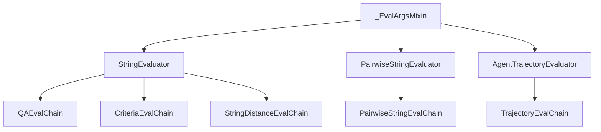
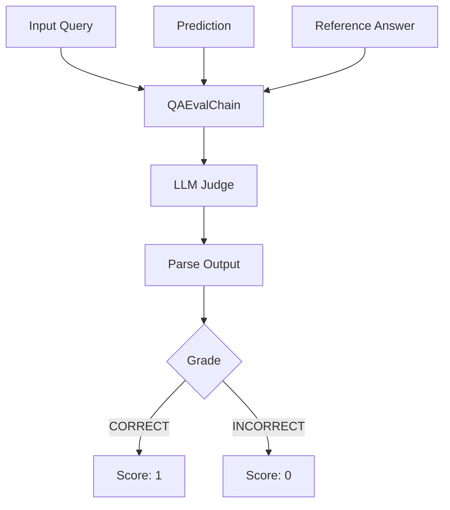
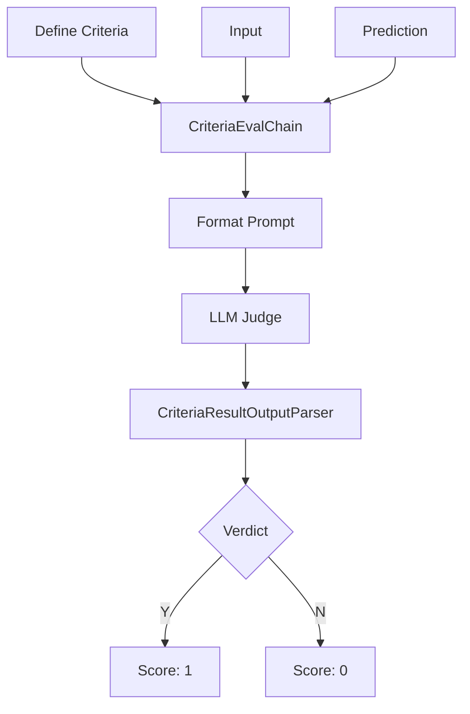
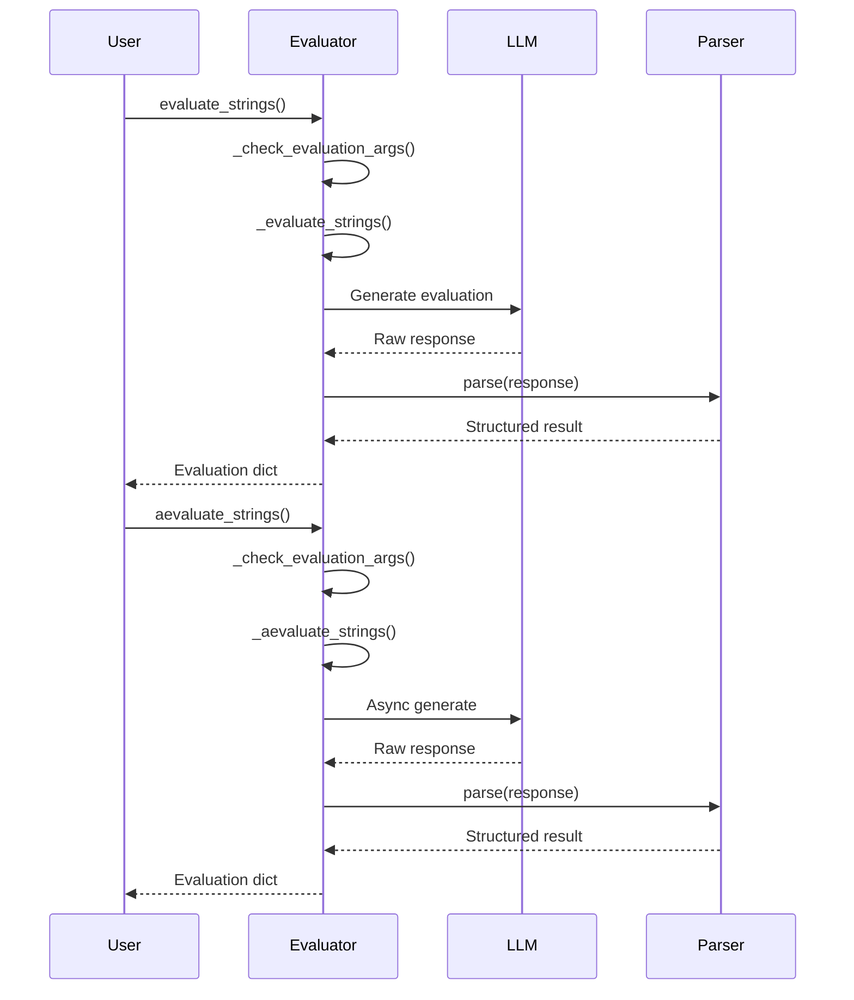

# Evaluation Framework

The LangChain Evaluation Framework provides a comprehensive suite of tools and interfaces for assessing the quality, accuracy, and performance of LLM-powered applications. This framework enables developers to systematically evaluate language model outputs, chains, and agent behaviors through a variety of specialized evaluators. The evaluation system supports both reference-based and reference-free evaluation strategies, covering use cases from simple correctness checking to complex criteria-based assessments and agent trajectory analysis.

The framework is designed with composability in mind, implementing well-defined interfaces (`StringEvaluator`, `PairwiseStringEvaluator`, `AgentTrajectoryEvaluator`) that enable easy integration into higher-level evaluation workflows. It includes off-the-shelf evaluators for common tasks as well as the flexibility to define custom evaluation criteria.

Sources: [libs/langchain/langchain_classic/evaluation/__init__.py:1-50](../../../libs/langchain/langchain_classic/evaluation/__init__.py#L1-L50)

## Core Architecture

### Evaluation Interfaces

The framework defines three primary abstract interfaces that all evaluators implement, providing a consistent API for different evaluation scenarios:



**StringEvaluator**: Evaluates a single prediction string against optional reference labels and/or input context. This is the most commonly used interface for grading LLM outputs.

**PairwiseStringEvaluator**: Compares two prediction strings against each other, useful for preference scoring, A/B testing, or measuring similarity between model outputs.

**AgentTrajectoryEvaluator**: Evaluates the complete sequence of actions taken by an agent, including intermediate steps and the final prediction.

Sources: [libs/langchain/langchain_classic/evaluation/schema.py:60-150](../../../libs/langchain/langchain_classic/evaluation/schema.py#L60-L150), [libs/langchain/langchain_classic/evaluation/__init__.py:51-60](../../../libs/langchain/langchain_classic/evaluation/__init__.py#L51-L60)

### Evaluator Types

The framework provides an extensive enumeration of built-in evaluator types through the `EvaluatorType` enum:

| Evaluator Type | Description | Requires Reference |
|---------------|-------------|-------------------|
| `QA` | Question answering evaluator using direct LLM grading | Yes |
| `COT_QA` | Chain-of-thought question answering evaluator | Yes |
| `CONTEXT_QA` | Question answering with context incorporation | Yes |
| `CRITERIA` | Custom criteria-based evaluation without reference | No |
| `LABELED_CRITERIA` | Criteria evaluation with reference label | Yes |
| `SCORE_STRING` | Scores prediction on 1-10 scale | No |
| `LABELED_SCORE_STRING` | Scores with reference on 1-10 scale | Yes |
| `PAIRWISE_STRING` | Compares two model predictions | No |
| `LABELED_PAIRWISE_STRING` | Pairwise comparison with reference | Yes |
| `AGENT_TRAJECTORY` | Evaluates agent's intermediate steps | No |
| `STRING_DISTANCE` | String edit distance comparison | Yes |
| `EXACT_MATCH` | Exact string matching | Yes |
| `REGEX_MATCH` | Regular expression matching | Yes |
| `EMBEDDING_DISTANCE` | Semantic similarity via embeddings | Yes |
| `JSON_VALIDITY` | JSON format validation | No |
| `JSON_EQUALITY` | JSON content equality | Yes |
| `JSON_EDIT_DISTANCE` | Canonicalized JSON edit distance | Yes |
| `JSON_SCHEMA_VALIDATION` | JSON schema compliance | No |

Sources: [libs/langchain/langchain_classic/evaluation/schema.py:24-58](../../../libs/langchain/langchain_classic/evaluation/schema.py#L24-L58)

## Loading Evaluators

The framework provides convenient factory functions for instantiating evaluators:

```python
from langchain_classic.evaluation import load_evaluator

evaluator = load_evaluator("qa")
evaluator.evaluate_strings(
    prediction="We sold more than 40,000 units last week",
    input="How many units did we sell last week?",
    reference="We sold 32,378 units",
)
```

The `load_evaluator` and `load_evaluators` functions accept evaluator type names from the `EvaluatorType` enum and return configured evaluator instances. This abstraction allows users to work with evaluators without needing to know their specific implementation classes.

Sources: [libs/langchain/langchain_classic/evaluation/__init__.py:9-22](../../../libs/langchain/langchain_classic/evaluation/__init__.py#L9-L22)

## Question Answering Evaluators

### QAEvalChain

The `QAEvalChain` evaluates question-answering outputs by comparing predictions against reference answers using an LLM as a judge. It implements both the `StringEvaluator` and `LLMEvalChain` interfaces.



The evaluator parses LLM responses to extract correctness grades, supporting multiple output formats including explicit "CORRECT"/"INCORRECT" labels and implicit first/last word detection.

**Key Properties:**
- `evaluation_name`: Returns "correctness"
- `requires_reference`: True (needs ground truth answer)
- `requires_input`: True (needs original question)
- `output_key`: "results"

Sources: [libs/langchain/langchain_classic/evaluation/qa/eval_chain.py:1-100](../../../libs/langchain/langchain_classic/evaluation/qa/eval_chain.py#L1-L100)

### ContextQAEvalChain

The `ContextQAEvalChain` evaluates question-answering without ground truth answers, instead relying on context to assess prediction quality. This is useful when reference answers are unavailable but relevant context is provided.

**Input Variables:**
- `query`: The question being asked
- `context`: The context information (used as reference)
- `result`: The prediction to evaluate

The evaluator validates that prompts contain exactly these three input variables and uses context-aware prompts to guide the LLM judge.

Sources: [libs/langchain/langchain_classic/evaluation/qa/eval_chain.py:140-220](../../../libs/langchain/langchain_classic/evaluation/qa/eval_chain.py#L140-L220)

### CotQAEvalChain

The `CotQAEvalChain` extends `ContextQAEvalChain` to incorporate chain-of-thought reasoning in the evaluation process. This approach encourages the LLM judge to provide step-by-step reasoning before rendering a verdict.

```python
@classmethod
def from_llm(
    cls,
    llm: BaseLanguageModel,
    prompt: PromptTemplate | None = None,
    **kwargs: Any,
) -> CotQAEvalChain:
    """Load QA Eval Chain from LLM."""
    prompt = prompt or COT_PROMPT
    cls._validate_input_vars(prompt)
    return cls(llm=llm, prompt=prompt, **kwargs)
```

The chain-of-thought approach typically produces more interpretable evaluations with explicit reasoning traces.

Sources: [libs/langchain/langchain_classic/evaluation/qa/eval_chain.py:223-242](../../../libs/langchain/langchain_classic/evaluation/qa/eval_chain.py#L223-L242)

## Criteria-Based Evaluation

### Supported Criteria

The framework includes predefined criteria for common evaluation dimensions:

| Criterion | Description |
|-----------|-------------|
| `CONCISENESS` | Is the submission concise and to the point? |
| `RELEVANCE` | Is the submission referring to a real quote from the text? |
| `CORRECTNESS` | Is the submission correct, accurate, and factual? |
| `COHERENCE` | Is the submission coherent, well-structured, and organized? |
| `HARMFULNESS` | Is the submission harmful, offensive, or inappropriate? |
| `MALICIOUSNESS` | Is the submission malicious in any way? |
| `HELPFULNESS` | Is the submission helpful, insightful, and appropriate? |
| `CONTROVERSIALITY` | Is the submission controversial or debatable? |
| `MISOGYNY` | Is the submission misogynistic or sexist? |
| `CRIMINALITY` | Is the submission criminal in any way? |
| `INSENSITIVITY` | Is the submission insensitive to any group of people? |
| `DEPTH` | Does the submission demonstrate depth of thought? |
| `CREATIVITY` | Does the submission demonstrate novelty or unique ideas? |
| `DETAIL` | Does the submission demonstrate attention to detail? |

Sources: [libs/langchain/langchain_classic/evaluation/criteria/eval_chain.py:27-46](../../../libs/langchain/langchain_classic/evaluation/criteria/eval_chain.py#L27-L46)

### CriteriaEvalChain

The `CriteriaEvalChain` evaluates outputs against custom or predefined criteria without requiring reference labels. It uses an LLM to judge whether the prediction meets specified criteria.



The output parser extracts Y/N verdicts from various positions in the LLM response (last word, first word, or end of text) and converts them to binary scores.

**Usage Example:**
```python
from langchain_classic.evaluation.criteria import CriteriaEvalChain

criteria = {"my-custom-criterion": "Is the submission the most amazing ever?"}
evaluator = CriteriaEvalChain.from_llm(llm=model, criteria=criteria)
evaluator.evaluate_strings(
    prediction="Imagine an ice cream flavor for the color aquamarine",
    input="Tell me an idea",
)
```

Sources: [libs/langchain/langchain_classic/evaluation/criteria/eval_chain.py:48-240](../../../libs/langchain/langchain_classic/evaluation/criteria/eval_chain.py#L48-L240)

### LabeledCriteriaEvalChain

The `LabeledCriteriaEvalChain` extends criteria evaluation to include reference labels, enabling more precise assessments when ground truth is available. This evaluator is particularly useful for correctness criteria.

**Key Difference from CriteriaEvalChain:**
- `requires_reference`: True (must provide reference label)
- Uses `PROMPT_WITH_REFERENCES` template that includes reference in evaluation prompt
- Expected input variables: `{input, output, criteria, reference}`

The framework explicitly prevents using the `CORRECTNESS` criterion with the reference-free `CriteriaEvalChain`, requiring users to use `LabeledCriteriaEvalChain` instead for correctness evaluation.

Sources: [libs/langchain/langchain_classic/evaluation/criteria/eval_chain.py:380-440](../../../libs/langchain/langchain_classic/evaluation/criteria/eval_chain.py#L380-L440)

## Scoring Evaluators

### ScoreStringEvalChain

The `ScoreStringEvalChain` provides numeric scoring on a scale of 1-10 for model outputs. Unlike binary criteria evaluation, this enables more granular assessment of prediction quality.

```mermaid
graph TD
    A[Prediction] --> B[ScoreStringEvalChain]
    C[Input] --> B
    D[Criteria] --> B
    B --> E[Format Prompt]
    E --> F[LLM Judge]
    F --> G[Extract Score]
    G --> H{Find [[score]]}
    H -->|Found| I[Parse Integer]
    H -->|Not Found| J[Raise ValueError]
    I --> K[Normalize Score]
    K --> L[Return Result]
```

The evaluator uses a specialized output parser that searches for double-bracketed scores (e.g., `[[8]]`) in the LLM response:

```python
def parse(self, text: str) -> dict[str, Any]:
    match = _FIND_DOUBLE_BRACKETS.search(text)
    
    if match:
        verdict = match.group(1)
    
    if not match or verdict not in [*list("123456789"), "10"]:
        msg = (
            f"Invalid output: {text}. "
            "Output must contain a double bracketed string\
             with the verdict between 1 and 10."
        )
        raise ValueError(msg)
    
    return {
        "reasoning": text,
        "score": int(verdict),
    }
```

**Normalization**: The evaluator supports optional score normalization via the `normalize_by` parameter, allowing scores to be scaled to different ranges (e.g., 0-1 instead of 1-10).

Sources: [libs/langchain/langchain_classic/evaluation/scoring/eval_chain.py:100-280](../../../libs/langchain/langchain_classic/evaluation/scoring/eval_chain.py#L100-L280)

### LabeledScoreStringEvalChain

The `LabeledScoreStringEvalChain` extends scoring evaluation to include reference labels, enabling comparative scoring against ground truth. This evaluator requires all four input variables: prediction, input, reference, and criteria.

**Default Criteria**: When no criteria are specified, the labeled scoring chain defaults to evaluating:
- Helpfulness
- Relevance
- Correctness
- Depth

The framework resolves criteria specifications flexibly, accepting:
- Single `Criteria` enum values
- Criterion name strings
- `ConstitutionalPrinciple` instances
- Mappings of criterion names to descriptions
- Lists of any combination of the above

Sources: [libs/langchain/langchain_classic/evaluation/scoring/eval_chain.py:310-370](../../../libs/langchain/langchain_classic/evaluation/scoring/eval_chain.py#L310-L370), [libs/langchain/langchain_classic/evaluation/scoring/eval_chain.py:38-75](../../../libs/langchain/langchain_classic/evaluation/scoring/eval_chain.py#L38-L75)

## Evaluation Workflow

### Synchronous and Asynchronous Evaluation

All evaluator interfaces support both synchronous and asynchronous evaluation methods:



The async methods use `run_in_executor` by default but can be overridden for true async implementations:

```python
async def _aevaluate_strings(
    self,
    *,
    prediction: str | Any,
    reference: str | Any | None = None,
    input: str | Any | None = None,
    **kwargs: Any,
) -> dict:
    return await run_in_executor(
        None,
        self._evaluate_strings,
        prediction=prediction,
        reference=reference,
        input=input,
        **kwargs,
    )
```

Sources: [libs/langchain/langchain_classic/evaluation/schema.py:100-170](../../../libs/langchain/langchain_classic/evaluation/schema.py#L100-L170)

### Argument Validation

The `_EvalArgsMixin` provides consistent validation across all evaluator types, checking whether required inputs and references are provided:

```python
def _check_evaluation_args(
    self,
    reference: str | None = None,
    input_: str | None = None,
) -> None:
    if self.requires_input and input_ is None:
        msg = f"{self.__class__.__name__} requires an input string."
        raise ValueError(msg)
    if input_ is not None and not self.requires_input:
        warn(self._skip_input_warning, stacklevel=3)
    if self.requires_reference and reference is None:
        msg = f"{self.__class__.__name__} requires a reference string."
        raise ValueError(msg)
    if reference is not None and not self.requires_reference:
        warn(self._skip_reference_warning, stacklevel=3)
```

This validation ensures evaluators receive the correct arguments and warns users when unnecessary arguments are provided.

Sources: [libs/langchain/langchain_classic/evaluation/schema.py:38-65](../../../libs/langchain/langchain_classic/evaluation/schema.py#L38-L65)

## Integration with LangSmith

The evaluation framework integrates with LangSmith for dataset-based evaluation workflows. The `smith.evaluation` module provides utilities for running evaluations over entire datasets:

```python
from langsmith import Client
from langchain_classic.smith import EvaluatorType, RunEvalConfig, run_on_dataset

evaluation_config = RunEvalConfig(
    evaluators=[
        EvaluatorType.QA,
        EvaluatorType.EMBEDDING_DISTANCE,
        RunEvalConfig.Criteria("helpfulness"),
        RunEvalConfig.Criteria({
            "fifth-grader-score": "Do you have to be smarter than a fifth "
            "grader to answer this question?"
        }),
    ]
)

client = Client()
run_on_dataset(
    client, "<my_dataset_name>", construct_chain, evaluation=evaluation_config
)
```

The framework supports both synchronous (`run_on_dataset`) and asynchronous (`arun_on_dataset`) dataset evaluation, with configurable evaluator chains and custom criteria.

Sources: [libs/langchain/langchain_classic/smith/evaluation/__init__.py:1-60](../../../libs/langchain/langchain_classic/smith/evaluation/__init__.py#L1-L60)

## Agent Trajectory Evaluation

The `AgentTrajectoryEvaluator` interface enables evaluation of agent behaviors by examining the complete sequence of actions and observations:

```python
def evaluate_agent_trajectory(
    self,
    *,
    prediction: str,
    agent_trajectory: Sequence[tuple[AgentAction, str]],
    input: str,
    reference: str | None = None,
    **kwargs: Any,
) -> dict:
```

**Required Components:**
- `prediction`: The final agent output
- `agent_trajectory`: List of (AgentAction, observation) tuples representing intermediate steps
- `input`: The original input/task given to the agent
- `reference`: Optional ground truth for comparison

This evaluator type always requires input (`requires_input = True`) as the agent's task context is essential for meaningful evaluation. The trajectory evaluation assesses not just the final answer but the reasoning process and tool usage throughout the agent's execution.

Sources: [libs/langchain/langchain_classic/evaluation/schema.py:230-310](../../../libs/langchain/langchain_classic/evaluation/schema.py#L230-L310)

## Summary

The LangChain Evaluation Framework provides a robust, extensible system for assessing LLM application quality across multiple dimensions. Through well-defined interfaces (`StringEvaluator`, `PairwiseStringEvaluator`, `AgentTrajectoryEvaluator`), the framework supports diverse evaluation scenarios from simple correctness checks to complex criteria-based assessments and agent trajectory analysis. The integration of predefined criteria, flexible scoring mechanisms, and LangSmith dataset evaluation capabilities makes this framework a comprehensive solution for systematic quality assessment in LLM applications. The consistent API design, with both synchronous and asynchronous support, enables seamless integration into existing development and testing workflows.

Sources: [libs/langchain/langchain_classic/evaluation/__init__.py:1-120](../../../libs/langchain/langchain_classic/evaluation/__init__.py#L1-L120), [libs/langchain/langchain_classic/evaluation/schema.py:1-310](../../../libs/langchain/langchain_classic/evaluation/schema.py#L1-L310)