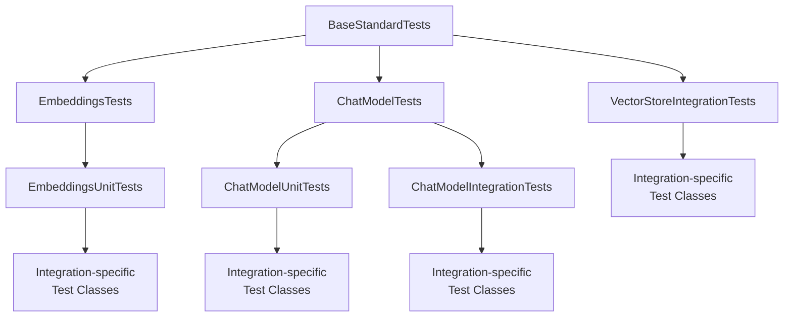
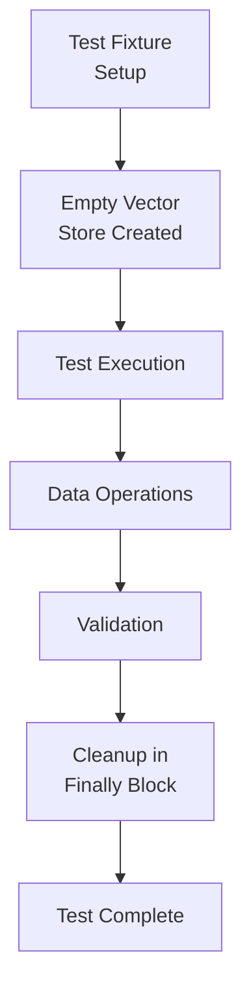
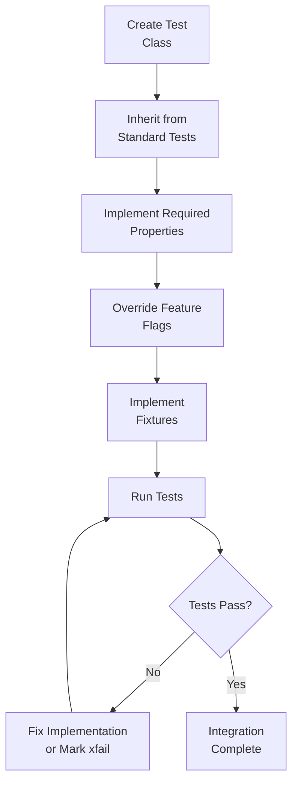

# Standard Tests for Integrations

The LangChain framework provides a comprehensive suite of standard tests designed to ensure consistent quality and behavior across all integration implementations. These tests are located in the `libs/standard-tests` package and provide base test classes that integration developers can inherit from to validate their implementations against established standards. The testing framework covers multiple integration types including chat models, embeddings, and vector stores, with support for both unit and integration testing scenarios.

The standard tests enforce consistent behavior across integrations, validate API contracts, and help catch common implementation issues early in the development process. By inheriting from these base test classes, integration developers automatically gain access to dozens of pre-written test cases that verify core functionality, edge cases, and compliance with LangChain's interface requirements.

Sources: [langchain_tests/__init__.py:1-7](../../../libs/standard-tests/langchain_tests/__init__.py#L1-L7)

## Architecture Overview

The standard tests framework is built on a hierarchical class structure with `BaseStandardTests` as the root class. This base class provides fundamental validation mechanisms, including a critical test that prevents standard tests from being overridden without proper justification.



The framework separates concerns between unit tests (which mock external dependencies) and integration tests (which interact with real services). Each integration type has its own specialized base class with appropriate fixtures, properties, and test methods.

Sources: [langchain_tests/base.py:1-54](../../../libs/standard-tests/langchain_tests/base.py#L1-L54)

## Base Test Infrastructure

### BaseStandardTests Class

The `BaseStandardTests` class serves as the foundation for all standard tests in the framework. It implements a critical validation mechanism to ensure test integrity.

```python
class BaseStandardTests:
    """Base class for standard tests."""

    def test_no_overrides_DO_NOT_OVERRIDE(self) -> None:
        """Test that no standard tests are overridden."""
```

This special test method performs several critical validations:

1. **Locates the comparison class**: Traverses the inheritance hierarchy to find the appropriate standard test base class
2. **Detects deleted tests**: Ensures no standard tests have been removed from the implementation
3. **Identifies overrides**: Flags any standard test methods that have been overridden
4. **Validates xfail markers**: Allows overrides only when marked with `@pytest.mark.xfail(reason="...")` to document expected failures

The validation logic explores the class hierarchy recursively to find the appropriate standard test base class from the `langchain_tests` module:

```python
def explore_bases(cls: type) -> None:
    nonlocal comparison_class
    for base in cls.__bases__:
        if base.__module__.startswith("langchain_tests."):
            if comparison_class is None:
                comparison_class = base
            else:
                msg = (
                    "Multiple standard test base classes found: "
                    f"{comparison_class}, {base}"
                )
                raise ValueError(msg)
        else:
            explore_bases(base)
```

Sources: [langchain_tests/base.py:6-54](../../../libs/standard-tests/langchain_tests/base.py#L6-L54)

## Embeddings Tests

### EmbeddingsTests Base Class

The embeddings testing framework provides a foundation for testing embedding model integrations. It defines abstract properties and fixtures that must be implemented by concrete test classes.

| Property/Fixture | Type | Description |
|-----------------|------|-------------|
| `embeddings_class` | `type[Embeddings]` | Abstract property specifying the embeddings class to test |
| `embedding_model_params` | `dict[str, Any]` | Initialization parameters for the model (defaults to empty) |
| `model` | `Embeddings` | Pytest fixture that instantiates the model with specified parameters |

Sources: [langchain_tests/unit_tests/embeddings.py:1-35](../../../libs/standard-tests/langchain_tests/unit_tests/embeddings.py#L1-L35)

### EmbeddingsUnitTests

The `EmbeddingsUnitTests` class extends `EmbeddingsTests` to provide concrete unit test implementations. Integration developers inherit from this class and implement required properties:

```python
class TestMyEmbeddingsModelUnit(EmbeddingsUnitTests):
    @property
    def embeddings_class(self) -> Type[MyEmbeddingsModel]:
        return MyEmbeddingsModel

    @property
    def embedding_model_params(self) -> dict:
        return {"model": "model-001"}
```

#### Core Test Methods

**test_init**: Validates basic model initialization with specified parameters. This ensures the embeddings class can be instantiated successfully.

**test_init_from_env**: Tests initialization from environment variables. This test is skipped by default unless `init_from_env_params` is overridden. The property returns a tuple of three dictionaries:
- Environment variables to mock
- Additional initialization arguments
- Expected instance attributes to validate

```python
@property
def init_from_env_params(self) -> tuple[dict[str, str], dict[str, Any], dict[str, Any]]:
    return (
        {"MY_API_KEY": "api_key"},
        {"model": "model-001"},
        {"my_api_key": "api_key"},
    )
```

The test uses `mock.patch.dict` to temporarily set environment variables and validates that the model correctly reads them during initialization, including proper handling of `SecretStr` types.

Sources: [langchain_tests/unit_tests/embeddings.py:38-131](../../../libs/standard-tests/langchain_tests/unit_tests/embeddings.py#L38-L131)

## Vector Store Tests

### VectorStoreIntegrationTests Overview

The `VectorStoreIntegrationTests` class provides comprehensive integration testing for vector store implementations. Unlike unit tests, these tests interact with actual vector store instances and validate real data persistence and retrieval operations.



Integration developers must implement a `vectorstore` fixture that yields an empty vector store instance:

```python
@pytest.fixture()
def vectorstore(self) -> Generator[VectorStore, None, None]:
    """Get an empty vectorstore."""
    store = ParrotVectorStore(self.get_embeddings())
    try:
        yield store
    finally:
        # cleanup operations
        pass
```

Sources: [langchain_tests/integration_tests/vectorstores.py:1-50](../../../libs/standard-tests/langchain_tests/integration_tests/vectorstores.py#L1-L50)

### Configuration Properties

Vector store tests support several configuration properties to control which tests are executed:

| Property | Type | Default | Description |
|----------|------|---------|-------------|
| `has_sync` | `bool` | `True` | Enable/disable synchronous tests |
| `has_async` | `bool` | `True` | Enable/disable asynchronous tests |
| `has_get_by_ids` | `bool` | `True` | Whether the store supports `get_by_ids` method |

```python
@property
def has_async(self) -> bool:
    return False  # Disable async tests
```

Sources: [langchain_tests/integration_tests/vectorstores.py:90-105](../../../libs/standard-tests/vectorstores.py#L90-L105)

### Embeddings Configuration

The test suite uses a deterministic fake embeddings model for consistency:

```python
@staticmethod
def get_embeddings() -> Embeddings:
    """Get embeddings.
    
    A pre-defined embeddings model that should be used for this test.
    
    This currently uses `DeterministicFakeEmbedding` from `langchain-core`,
    which uses numpy to generate random numbers based on a hash of the input text.
    
    The resulting embeddings are not meaningful, but they are deterministic.
    """
    return DeterministicFakeEmbedding(
        size=EMBEDDING_SIZE,
    )
```

The embedding size is set to 6 dimensions to keep tests fast and easier to debug.

Sources: [langchain_tests/integration_tests/vectorstores.py:16-18](../../../libs/standard-tests/langchain_tests/integration_tests/vectorstores.py#L16-L18), [langchain_tests/integration_tests/vectorstores.py:107-120](../../../libs/standard-tests/langchain_tests/integration_tests/vectorstores.py#L107-L120)

### Core Vector Store Test Cases

#### Synchronous Tests

The framework includes comprehensive synchronous test coverage:

**test_vectorstore_is_empty**: Validates that the fixture provides an empty vector store at the start of each test.

**test_add_documents**: Tests document addition and retrieval, ensuring:
- Documents are correctly stored and retrievable
- Similarity search returns documents in order of relevance
- Original document objects are not mutated during the add operation

**test_deleting_documents**: Validates single document deletion by ID, ensuring deleted documents are no longer retrievable.

**test_deleting_bulk_documents**: Tests deletion of multiple documents simultaneously.

**test_delete_missing_content**: Ensures that deleting non-existent IDs does not raise exceptions.

**test_add_documents_with_ids_is_idempotent**: Verifies that adding documents with the same IDs multiple times does not create duplicates.

**test_add_documents_by_id_with_mutation**: Tests that re-adding a document with an existing ID updates the content rather than creating a duplicate.

**test_get_by_ids**: Validates retrieval of documents by their IDs, with results sorted for consistent comparison:

```python
def _sort_by_id(documents: list[Document]) -> list[Document]:
    return sorted(documents, key=lambda doc: doc.id or "")
```

**test_get_by_ids_missing**: Ensures that requesting non-existent IDs returns an empty list without raising exceptions.

**test_add_documents_documents**: Tests automatic ID generation when documents are added without explicit IDs.

**test_add_documents_with_existing_ids**: Validates handling of documents where some have pre-assigned IDs in the `Document.id` field and others require auto-generation.

Sources: [langchain_tests/integration_tests/vectorstores.py:12-15](../../../libs/standard-tests/langchain_tests/integration_tests/vectorstores.py#L12-L15), [langchain_tests/integration_tests/vectorstores.py:122-316](../../../libs/standard-tests/langchain_tests/integration_tests/vectorstores.py#L122-L316)

#### Asynchronous Tests

The framework provides parallel asynchronous test coverage with methods prefixed with `test_*_async`:

- `test_vectorstore_is_empty_async`
- `test_add_documents_async`
- `test_vectorstore_still_empty_async`
- `test_deleting_documents_async`
- `test_deleting_bulk_documents_async`
- `test_delete_missing_content_async`
- `test_add_documents_with_ids_is_idempotent_async`
- `test_add_documents_by_id_with_mutation_async`
- `test_get_by_ids_async`
- `test_get_by_ids_missing_async`
- `test_add_documents_documents_async`
- `test_add_documents_with_existing_ids_async`

Each async test mirrors its synchronous counterpart but uses async/await syntax and calls async methods (e.g., `aadd_documents`, `asimilarity_search`, `adelete`, `aget_by_ids`). All async tests check the `has_async` property and skip if async support is disabled.

Sources: [langchain_tests/integration_tests/vectorstores.py:318-507](../../../libs/standard-tests/langchain_tests/integration_tests/vectorstores.py#L318-L507)

## Chat Model Tests

### ChatModelTests Base Class

The `ChatModelTests` class provides the foundation for testing chat model integrations. It defines abstract properties and configuration options for comprehensive testing.

#### Required Properties

| Property | Type | Description |
|----------|------|-------------|
| `chat_model_class` | `type[BaseChatModel]` | The chat model class to test (abstract) |
| `chat_model_params` | `dict[str, Any]` | Initialization parameters specific to the model |
| `standard_chat_model_params` | `dict[str, Any]` | Standard parameters like temperature, max_tokens, timeout, stop, max_retries |

#### Feature Detection Properties

The framework automatically detects supported features through introspection:

```python
@property
def has_tool_calling(self) -> bool:
    """Whether the model supports tool calling."""
    return self.chat_model_class.bind_tools is not BaseChatModel.bind_tools

@property
def has_tool_choice(self) -> bool:
    """Whether the model supports tool calling."""
    bind_tools_params = inspect.signature(
        self.chat_model_class.bind_tools
    ).parameters
    return "tool_choice" in bind_tools_params

@property
def has_structured_output(self) -> bool:
    """Whether the chat model supports structured output."""
    return (
        self.chat_model_class.with_structured_output
        is not BaseChatModel.with_structured_output
    ) or self.has_tool_calling
```

Sources: [langchain_tests/unit_tests/chat_models.py:40-103](../../../libs/standard-tests/langchain_tests/unit_tests/chat_models.py#L40-L103)

#### Multimodal Support Properties

The framework includes properties for various multimodal capabilities:

| Property | Type | Default | Description |
|----------|------|---------|-------------|
| `supports_image_inputs` | `bool` | `False` | Whether the model accepts image content blocks |
| `supports_image_urls` | `bool` | `False` | Whether the model accepts image URLs |
| `supports_pdf_inputs` | `bool` | `False` | Whether the model accepts PDF content |
| `supports_audio_inputs` | `bool` | `False` | Whether the model accepts audio content |
| `supports_video_inputs` | `bool` | `False` | Whether the model accepts video content |
| `supports_anthropic_inputs` | `bool` | `False` | Whether the model supports Anthropic-style content blocks |
| `supports_image_tool_message` | `bool` | `False` | Whether ToolMessage can include image content |
| `supports_pdf_tool_message` | `bool` | `False` | Whether ToolMessage can include PDF content |

Sources: [langchain_tests/unit_tests/chat_models.py:120-171](../../../libs/standard-tests/langchain_tests/unit_tests/chat_models.py#L120-L171)

#### Additional Configuration Properties

```python
@property
def structured_output_kwargs(self) -> dict[str, Any]:
    """Additional kwargs to pass to `with_structured_output()` in tests."""
    return {}

@property
def supports_json_mode(self) -> bool:
    """Whether the chat model supports JSON mode."""
    return False

@property
def returns_usage_metadata(self) -> bool:
    """Whether the chat model returns usage metadata on invoke and streaming responses."""
    return True

@property
def enable_vcr_tests(self) -> bool:
    """Whether to enable VCR tests for the chat model."""
    return False

@property
def supports_model_override(self) -> bool:
    """Whether the model supports overriding the model name at runtime."""
    return True

@property
def model_override_value(self) -> str | None:
    """Alternative model name to use when testing model override."""
    return None
```

Sources: [langchain_tests/unit_tests/chat_models.py:104-202](../../../libs/standard-tests/langchain_tests/unit_tests/chat_models.py#L104-L202)

### ChatModelUnitTests

The `ChatModelUnitTests` class extends `ChatModelTests` to provide concrete unit test implementations. It includes enhanced standard parameters with a test API key:

```python
@property
def standard_chat_model_params(self) -> dict[str, Any]:
    """Standard chat model parameters."""
    params = super().standard_chat_model_params
    params["api_key"] = "test"
    return params
```

#### Model Fixture

The framework provides a flexible model fixture that accepts additional parameters:

```python
@pytest.fixture
def model(self, request: Any) -> BaseChatModel:
    """Model fixture."""
    extra_init_params = getattr(request, "param", None) or {}
    return self.chat_model_class(
        **{
            **self.standard_chat_model_params,
            **self.chat_model_params,
            **extra_init_params,
        },
    )
```

Sources: [langchain_tests/unit_tests/chat_models.py:204-214](../../../libs/standard-tests/langchain_tests/unit_tests/chat_models.py#L204-L214), [langchain_tests/unit_tests/chat_models.py:80-93](../../../libs/standard-tests/langchain_tests/unit_tests/chat_models.py#L80-L93)

#### Core Unit Tests

**test_init**: Validates basic model initialization with standard and custom parameters.

**test_init_from_env**: Tests initialization from environment variables using the `init_from_env_params` property. The test is skipped if the property returns empty dictionaries.

**test_init_streaming**: Verifies backward compatibility by ensuring the model can be initialized with a `streaming=True` parameter.

**test_bind_tool_pydantic**: Tests the `bind_tools` method with various input formats including:
- BaseTool instances
- Plain Python functions
- Pydantic models
- JSON schemas from Pydantic models

The test iterates through Pydantic model schemas to ensure compatibility:

```python
for pydantic_model in TEST_PYDANTIC_MODELS:
    model_schema = (
        pydantic_model.model_json_schema()
        if hasattr(pydantic_model, "model_json_schema")
        else pydantic_model.schema()
    )
    tools.extend([pydantic_model, model_schema])
```

**test_with_structured_output**: Validates the `with_structured_output` method with different methods (`json_schema`, `function_calling`, `json_mode`) and strict mode variations.

**test_standard_params**: Ensures the model generates standard parameters for tracing purposes, validating against an expected schema:

```python
class ExpectedParams(BaseModel):
    ls_provider: str
    ls_model_name: str
    ls_model_type: Literal["chat"]
    ls_temperature: float | None = None
    ls_max_tokens: int | None = None
    ls_stop: list[str] | None = None
```

**test_serdes**: Tests serialization and deserialization of the model using `dumpd` and `load` from `langchain_core.load`. This test is skipped if `is_lc_serializable()` returns `False`.

**test_init_time**: A benchmark test that measures initialization time by creating 10 model instances in a loop. This helps detect performance regressions.

Sources: [langchain_tests/unit_tests/chat_models.py:216-373](../../../libs/standard-tests/langchain_tests/unit_tests/chat_models.py#L216-L373), [langchain_tests/unit_tests/chat_models.py:28-37](../../../libs/standard-tests/langchain_tests/unit_tests/chat_models.py#L28-L37)

### Test Fixtures and Utilities

The framework provides utility fixtures for common testing scenarios:

```python
@pytest.fixture
def my_adder_tool(self) -> BaseTool:
    """Adder tool fixture."""

    @tool
    def my_adder_tool(a: int, b: int) -> int:
        """Tool that adds two integers.

        Takes two integers, a and b, and returns their sum.
        """
        return a + b

    return my_adder_tool
```

This fixture provides a simple tool for testing tool calling functionality across different chat model implementations.

Sources: [langchain_tests/unit_tests/chat_models.py:95-106](../../../libs/standard-tests/langchain_tests/unit_tests/chat_models.py#L95-L106)

## Implementation Workflow

The typical workflow for integrating standard tests into a new integration follows this sequence:



### Example Implementation

For embeddings:

```python
from typing import Type
from langchain_tests.unit_tests import EmbeddingsUnitTests
from my_package.embeddings import MyEmbeddingsModel

class TestMyEmbeddingsModelUnit(EmbeddingsUnitTests):
    @property
    def embeddings_class(self) -> Type[MyEmbeddingsModel]:
        return MyEmbeddingsModel

    @property
    def embedding_model_params(self) -> dict:
        return {"model": "model-001"}
```

For vector stores:

```python
from typing import Generator
import pytest
from langchain_core.vectorstores import VectorStore
from langchain_tests.integration_tests.vectorstores import VectorStoreIntegrationTests
from langchain_chroma import Chroma

class TestChromaStandard(VectorStoreIntegrationTests):
    @pytest.fixture()
    def vectorstore(self) -> Generator[VectorStore, None, None]:
        store = Chroma(embedding_function=self.get_embeddings())
        try:
            yield store
        finally:
            store.delete_collection()
```

Sources: [langchain_tests/unit_tests/embeddings.py:45-59](../../../libs/standard-tests/langchain_tests/unit_tests/embeddings.py#L45-L59), [langchain_tests/integration_tests/vectorstores.py:51-88](../../../libs/standard-tests/langchain_tests/integration_tests/vectorstores.py#L51-L88)

## Test Override Mechanism

The standard tests framework includes a sophisticated mechanism for handling expected failures. When a standard test cannot pass due to limitations in the underlying service or implementation, developers can mark it with `@pytest.mark.xfail`:

```python
@pytest.mark.xfail(reason="Service does not support batch deletion")
def test_deleting_bulk_documents(self, vectorstore: VectorStore) -> None:
    super().test_deleting_bulk_documents(vectorstore)
```

The `test_no_overrides_DO_NOT_OVERRIDE` method validates these markers:

```python
def is_xfail(method: str) -> bool:
    m = getattr(self.__class__, method)
    if not hasattr(m, "pytestmark"):
        return False
    marks = m.pytestmark
    return any(
        mark.name == "xfail" and mark.kwargs.get("reason") for mark in marks
    )

overridden_not_xfail = [
    method for method in overridden_tests if not is_xfail(method)
]
assert not overridden_not_xfail, (
    "Standard tests overridden without "
    f'@pytest.mark.xfail(reason="..."): {overridden_not_xfail}\n'
    "Note: reason is required to explain why the standard test has an expected "
    "failure."
)
```

This ensures that any deviation from standard behavior is explicitly documented with a reason, maintaining transparency about integration limitations.

Sources: [langchain_tests/base.py:32-54](../../../libs/standard-tests/langchain_tests/base.py#L32-L54)

## Summary

The LangChain standard tests framework provides a robust, comprehensive testing infrastructure for integration developers. By inheriting from base test classes like `EmbeddingsUnitTests`, `VectorStoreIntegrationTests`, and `ChatModelUnitTests`, developers gain access to dozens of pre-written test cases that validate core functionality, edge cases, and API compliance.

The framework's design emphasizes:
- **Consistency**: All integrations are tested against the same standards
- **Flexibility**: Feature flags and configuration properties allow customization
- **Transparency**: The override mechanism requires explicit documentation of limitations
- **Maintainability**: Centralized test logic reduces duplication across integrations

This standardized approach ensures high quality across the LangChain ecosystem while minimizing the testing burden on integration developers.

Sources: [langchain_tests/__init__.py:1-7](../../../libs/standard-tests/langchain_tests/__init__.py#L1-L7), [langchain_tests/base.py:1-54](../../../libs/standard-tests/langchain_tests/base.py#L1-L54)