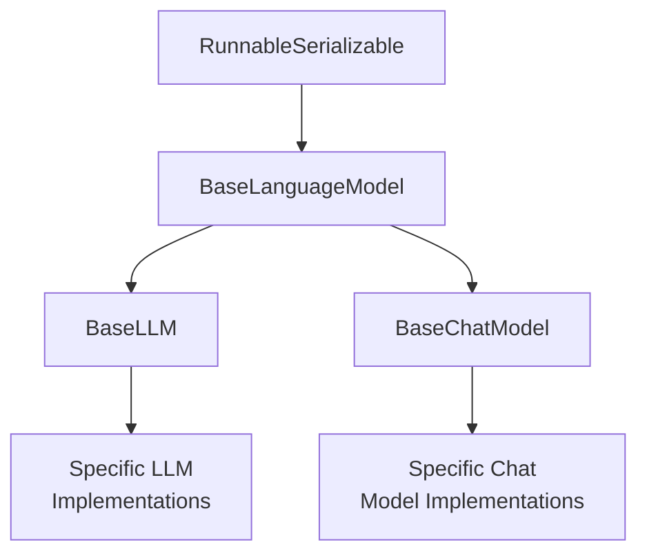
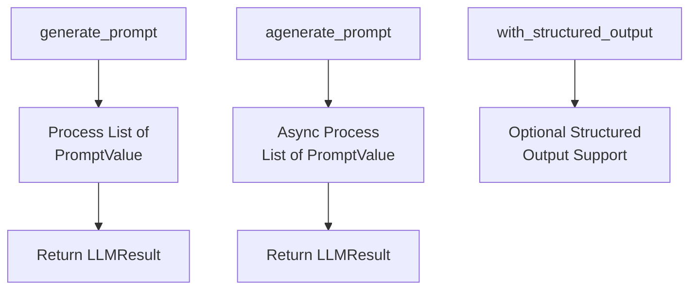
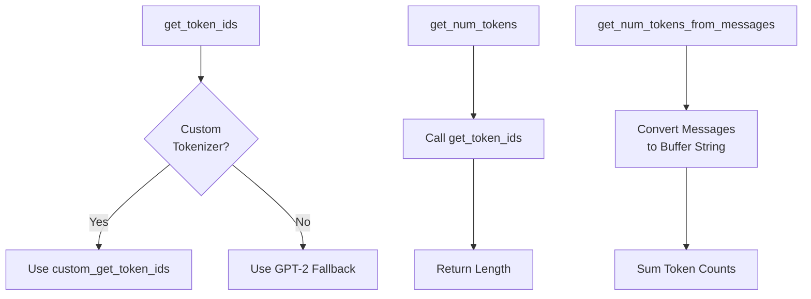
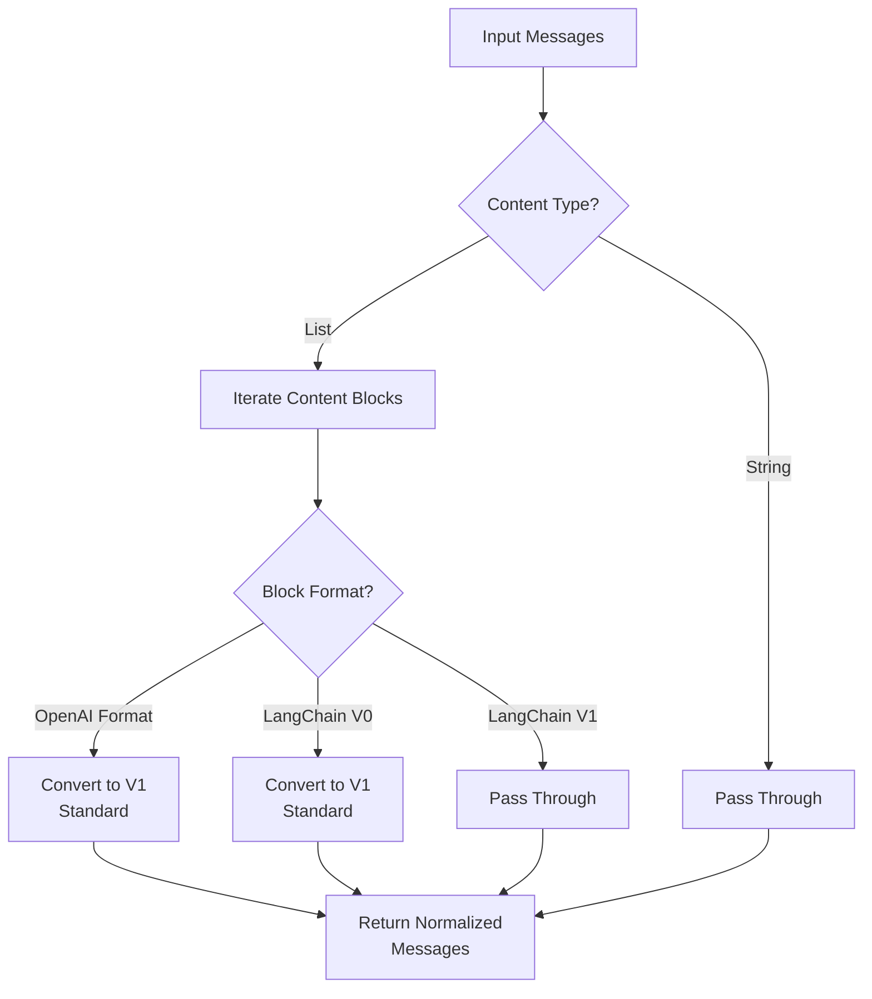
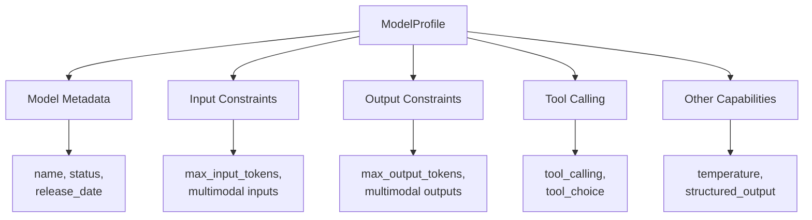
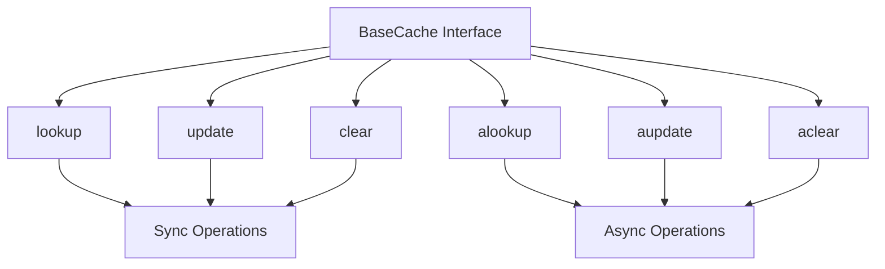
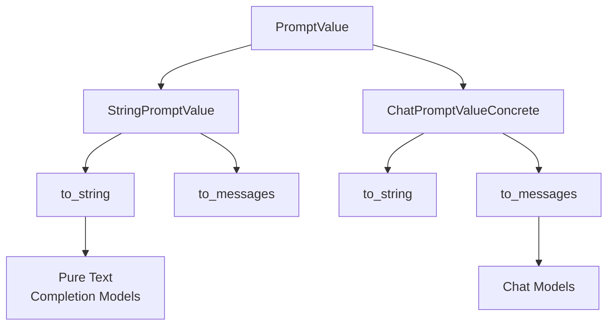

# Base Language Model Abstractions

The Base Language Model Abstractions module provides the foundational interfaces and utilities for working with language models in LangChain. This module defines the core `BaseLanguageModel` abstract class and associated types that serve as the contract for all language model implementations, whether they are traditional completion-based LLMs or modern chat models. These abstractions enable a unified interface for prompt handling, token counting, caching, tracing, and execution callbacks across diverse language model providers.

The module also includes utilities for tokenization, message normalization, model profiling, and caching strategies that are shared across all language model implementations in the framework.

Sources: [base.py:1-425](../../../libs/core/langchain_core/language_models/base.py#L1-L425), [__init__.py:1-82](../../../libs/core/langchain_core/language_models/__init__.py#L1-L82)

## Core Type Definitions

The module establishes several key type aliases that define the input/output contracts for language models:

| Type Alias | Definition | Description |
|------------|------------|-------------|
| `LanguageModelInput` | `PromptValue \| str \| Sequence[MessageLikeRepresentation]` | Acceptable input types for language models |
| `LanguageModelOutput` | `BaseMessage \| str` | Output types from language models |
| `LanguageModelLike` | `Runnable[LanguageModelInput, LanguageModelOutput]` | Interface definition for language model runnables |
| `LanguageModelOutputVar` | `TypeVar("LanguageModelOutputVar", AIMessage, str)` | Type variable for model output generics |

These type definitions provide flexibility in how prompts are passed to models (as strings, structured prompt values, or message sequences) while maintaining type safety throughout the framework.

Sources: [base.py:89-99](../../../libs/core/langchain_core/language_models/base.py#L89-L99)

## BaseLanguageModel Abstract Class

### Class Overview

`BaseLanguageModel` is the abstract base class that all language model wrappers inherit from. It extends `RunnableSerializable` to provide integration with LangChain's execution framework while defining the core interface for language model operations.



Sources: [base.py:106-425](../../../libs/core/langchain_core/language_models/base.py#L106-L425), [__init__.py:15-38](../../../libs/core/langchain_core/language_models/__init__.py#L15-L38)

### Core Configuration Fields

The `BaseLanguageModel` class defines several configuration fields that control execution behavior:

| Field | Type | Default | Description |
|-------|------|---------|-------------|
| `cache` | `BaseCache \| bool \| None` | `None` | Caching strategy for responses |
| `verbose` | `bool` | `_get_verbosity()` | Whether to print response text |
| `callbacks` | `Callbacks` | `None` | Callbacks to add to run trace |
| `tags` | `list[str] \| None` | `None` | Tags to add to run trace |
| `metadata` | `dict[str, Any] \| None` | `None` | Metadata to add to run trace |
| `custom_get_token_ids` | `Callable[[str], list[int]] \| None` | `None` | Optional custom tokenizer |

The `cache` field supports multiple modes:
- `True`: Use the global cache
- `False`: Disable caching
- `None`: Use global cache if set, otherwise no cache
- `BaseCache` instance: Use the provided cache implementation

Sources: [base.py:111-136](../../../libs/core/langchain_core/language_models/base.py#L111-L136)

### Abstract Methods

Implementations must provide both synchronous and asynchronous generation methods:



Both `generate_prompt` and `agenerate_prompt` methods accept:
- `prompts`: List of `PromptValue` objects
- `stop`: Optional list of stop words
- `callbacks`: Optional callbacks for tracing
- `**kwargs`: Additional provider-specific parameters

These methods should leverage batched API calls when available for efficiency.

Sources: [base.py:157-227](../../../libs/core/langchain_core/language_models/base.py#L157-L227)

## Tokenization System

### Default Tokenization

The module provides a fallback tokenization mechanism using GPT-2 tokenizer when model-specific tokenizers are unavailable:

```python
@cache  # Cache the tokenizer
def get_tokenizer() -> Any:
    """Get a GPT-2 tokenizer instance."""
    if not _HAS_TRANSFORMERS:
        msg = (
            "Could not import transformers python package. "
            "This is needed in order to calculate get_token_ids. "
            "Please install it with `pip install transformers`."
        )
        raise ImportError(msg)
    return GPT2TokenizerFast.from_pretrained("gpt2")
```

The tokenizer is cached to avoid reloading on every invocation. A warning is issued on first use to alert users that counts may be inaccurate for non-GPT-2 models.

Sources: [base.py:59-84](../../../libs/core/langchain_core/language_models/base.py#L59-L84)

### Token Counting Methods

The `BaseLanguageModel` class provides two primary methods for token counting:



1. **`get_token_ids(text: str) -> list[int]`**: Returns ordered token IDs for a text string
2. **`get_num_tokens(text: str) -> int`**: Returns the count of tokens in text
3. **`get_num_tokens_from_messages(messages: list[BaseMessage], tools: Sequence | None = None) -> int`**: Returns token count for message sequences

The base implementation of `get_num_tokens_from_messages` ignores tool schemas and adds prefixes for user roles, which may differ from model-specific implementations.

Sources: [base.py:262-312](../../../libs/core/langchain_core/language_models/base.py#L262-L312)

## LangSmith Tracing Integration

### LangSmithParams TypedDict

The module defines a `LangSmithParams` TypedDict for structured tracing metadata:

| Parameter | Type | Description |
|-----------|------|-------------|
| `ls_provider` | `str` | Provider of the model |
| `ls_model_name` | `str` | Name of the model |
| `ls_model_type` | `Literal["chat", "llm"]` | Type of model (chat or llm) |
| `ls_temperature` | `float \| None` | Temperature for generation |
| `ls_max_tokens` | `int \| None` | Max tokens for generation |
| `ls_stop` | `list[str] \| None` | Stop words for generation |
| `ls_integration` | `str` | Integration that created the trace |

These parameters are used to enrich LangSmith traces with model-specific metadata for debugging and monitoring.

Sources: [base.py:38-56](../../../libs/core/langchain_core/language_models/base.py#L38-L56)

### Tracing Methods

```python
def _get_ls_params(
    self,
    stop: list[str] | None = None,
    **kwargs: Any,
) -> LangSmithParams:
    """Get standard params for tracing."""
    return LangSmithParams()

def _get_ls_params_with_defaults(
    self,
    stop: list[str] | None = None,
    **kwargs: Any,
) -> LangSmithParams:
    """Wrap _get_ls_params to include any additional default parameters."""
    return self._get_ls_params(stop=stop, **kwargs)
```

Implementations can override `_get_ls_params` to provide model-specific tracing parameters.

Sources: [base.py:237-247](../../../libs/core/langchain_core/language_models/base.py#L237-L247)

## Message Normalization Utilities

### Multi-Format Message Support

The `_normalize_messages` function provides backward compatibility and extended format support for message content:



The function handles three types of content block formats:
1. **OpenAI Chat Completions format**: `image_url`, `input_audio`, and `file` blocks
2. **LangChain v0 format**: Legacy content blocks with `source_type` field
3. **LangChain v1 format**: Modern standard content blocks

Sources: [_utils.py:131-321](../../../libs/core/langchain_core/language_models/_utils.py#L131-L321)

### OpenAI Format Detection

The `is_openai_data_block` function validates whether a content block matches OpenAI Chat Completions format:

```python
def is_openai_data_block(
    block: dict, filter_: Literal["image", "audio", "file"] | None = None
) -> bool:
    """Check whether a block contains multimodal data in OpenAI format.
    
    Supports both data and ID-style blocks (e.g. 'file_data' and 'file_id')
    """
```

The function validates:
- **Image blocks**: `type: "image_url"` with `url` field (data URI or URL)
- **Audio blocks**: `type: "input_audio"` with `data` and `format` fields
- **File blocks**: `type: "file"` with either `file_data` or `file_id`

Sources: [_utils.py:23-91](../../../libs/core/langchain_core/language_models/_utils.py#L23-L91)

### Data URI Parsing

The `_parse_data_uri` function extracts components from data URIs:

```python
def _parse_data_uri(uri: str) -> ParsedDataUri | None:
    """Parse a data URI into its components.
    
    Returns:
        {
            "source_type": "base64",
            "mime_type": "image/jpeg",
            "data": "/9j/4AAQSkZJRg...",
        }
    """
```

This utility supports base64-encoded data URIs following the format: `data:{mime_type};base64,{data}`

Sources: [_utils.py:94-128](../../../libs/core/langchain_core/language_models/_utils.py#L94-L128)

## Model Profile System

### ModelProfile TypedDict

The module provides a beta feature for model capability metadata through the `ModelProfile` TypedDict:



Key profile fields include:

**Model Metadata:**
- `name`: Human-readable model name
- `status`: Model status (e.g., 'active', 'deprecated')
- `release_date`: ISO 8601 release date
- `open_weights`: Whether weights are openly available

**Input Constraints:**
- `max_input_tokens`: Maximum context window
- `text_inputs`, `image_inputs`, `image_url_inputs`, `pdf_inputs`, `audio_inputs`, `video_inputs`: Supported input types
- `image_tool_message`, `pdf_tool_message`: Tool message capabilities

**Output Constraints:**
- `max_output_tokens`: Maximum output length
- `text_outputs`, `image_outputs`, `audio_outputs`, `video_outputs`: Supported output types
- `reasoning_output`: Chain-of-thought support

**Capabilities:**
- `tool_calling`, `tool_choice`: Tool calling support
- `structured_output`: Native structured output feature
- `temperature`: Temperature parameter support

Sources: [model_profile.py:11-115](../../../libs/core/langchain_core/language_models/model_profile.py#L11-L115)

### ModelProfileRegistry

```python
ModelProfileRegistry = dict[str, ModelProfile]
"""Registry mapping model identifiers or names to their ModelProfile."""
```

This type alias defines a registry structure for storing model profiles, enabling runtime lookup of model capabilities.

Sources: [model_profile.py:118-119](../../../libs/core/langchain_core/language_models/model_profile.py#L118-L119)

### Profile Validation

The `_warn_unknown_profile_keys` function validates profile dictionaries:

```python
def _warn_unknown_profile_keys(profile: ModelProfile) -> None:
    """Warn if profile contains keys not declared on ModelProfile."""
```

This function compares profile keys against declared type hints and warns about unrecognized keys, which may indicate version mismatches between langchain-core and provider packages.

Sources: [model_profile.py:122-149](../../../libs/core/langchain_core/language_models/model_profile.py#L122-L149)

## Caching System

### BaseCache Interface

The caching layer provides an optional optimization for reducing API calls and improving response times:



The `BaseCache` abstract class defines the caching contract:

| Method | Parameters | Returns | Description |
|--------|------------|---------|-------------|
| `lookup` | `prompt: str, llm_string: str` | `Sequence[Generation] \| None` | Look up cached value |
| `update` | `prompt: str, llm_string: str, return_val` | `None` | Update cache |
| `clear` | `**kwargs` | `None` | Clear cache |
| `alookup` | `prompt: str, llm_string: str` | `Sequence[Generation] \| None` | Async lookup |
| `aupdate` | `prompt: str, llm_string: str, return_val` | `None` | Async update |
| `aclear` | `**kwargs` | `None` | Async clear |

The cache key is generated from a 2-tuple of `(prompt, llm_string)` where `llm_string` represents the serialized LLM configuration including model name, temperature, stop tokens, and other invocation parameters.

Sources: [caches.py:31-140](../../../libs/core/langchain_core/caches.py#L31-L140)

### InMemoryCache Implementation

The framework provides a concrete `InMemoryCache` implementation:

```python
class InMemoryCache(BaseCache):
    """Cache that stores things in memory."""
    
    def __init__(self, *, maxsize: int | None = None) -> None:
        """Initialize with empty cache.
        
        Args:
            maxsize: Maximum number of items to store.
                If None, cache has no maximum size.
                If exceeded, oldest items are removed.
        """
```

The implementation uses a dictionary with tuple keys and supports:
- Optional maximum size with LRU eviction
- Synchronous and asynchronous operations
- Thread-safe operations (within Python's GIL constraints)

Example usage:
```python
cache = InMemoryCache(maxsize=100)
cache.update(
    prompt="What is the capital of France?",
    llm_string="model='gpt-4'",
    return_val=[Generation(text="Paris")],
)
result = cache.lookup(
    prompt="What is the capital of France?",
    llm_string="model='gpt-4'",
)
```

Sources: [caches.py:143-229](../../../libs/core/langchain_core/caches.py#L143-L229)

## Input Type Handling

### InputType Property

The `BaseLanguageModel` class overrides the `InputType` property to provide precise type information:

```python
@property
@override
def InputType(self) -> TypeAlias:
    """Get the input type for this Runnable."""
    return str | StringPromptValue | ChatPromptValueConcrete | list[AnyMessage]
```

This property replaces the abstract `BaseMessage` class with a union of concrete message subclasses, enabling better schema generation and type validation.

Sources: [base.py:145-155](../../../libs/core/langchain_core/language_models/base.py#L145-L155)

### Prompt Value Conversion

The system supports multiple prompt representations through the `PromptValue` abstraction:



This abstraction allows chains to be agnostic to the underlying language model type, as `PromptValue` objects can convert to either string format (for completion models) or message format (for chat models).

Sources: [base.py:24-30](../../../libs/core/langchain_core/language_models/base.py#L24-L30)

## Invocation Parameter Filtering

### Tracing Parameter Filtering

The `_filter_invocation_params_for_tracing` function removes large fields from tracing metadata:

```python
def _filter_invocation_params_for_tracing(params: dict[str, Any]) -> dict[str, Any]:
    """Filter out large/inappropriate fields from invocation params for tracing.
    
    Removes fields like tools, functions, messages, response_format that can be large.
    """
    excluded_keys = {"tools", "functions", "messages", "response_format"}
    return {k: v for k, v in params.items() if k not in excluded_keys}
```

This prevents trace payloads from becoming excessively large due to tool schemas, message histories, or complex response format specifications.

Sources: [_utils.py:12-20](../../../libs/core/langchain_core/language_models/_utils.py#L12-L20)

## Module Exports

The language models module exports a comprehensive set of abstractions through its `__init__.py`:

```python
__all__ = (
    "LLM",
    "BaseChatModel",
    "BaseLLM",
    "BaseLanguageModel",
    "FakeListChatModel",
    "FakeListLLM",
    "FakeMessagesListChatModel",
    "FakeStreamingListLLM",
    "GenericFakeChatModel",
    "LangSmithParams",
    "LanguageModelInput",
    "LanguageModelLike",
    "LanguageModelOutput",
    "ModelProfile",
    "ModelProfileRegistry",
    "ParrotFakeChatModel",
    "SimpleChatModel",
    "get_tokenizer",
    "is_openai_data_block",
)
```

The module uses lazy imports through `__getattr__` for performance optimization, loading submodules only when accessed.

Sources: [__init__.py:40-82](../../../libs/core/langchain_core/language_models/__init__.py#L40-L82)

## Summary

The Base Language Model Abstractions module provides the foundational architecture for all language model integrations in LangChain. Through the `BaseLanguageModel` abstract class, it establishes a unified interface for prompt processing, token counting, caching, and tracing that works across diverse model types and providers. The module's design prioritizes flexibility through its support for multiple input formats (strings, prompt values, message sequences), extensibility through abstract methods and customizable tokenizers, and observability through LangSmith tracing integration. Supporting utilities for message normalization, model profiling, and caching enable robust production deployments while maintaining backward compatibility with legacy formats.