# Chat Model Interface (BaseChatModel)

The `BaseChatModel` class serves as the foundational abstract base class for all chat models in LangChain. It provides a standardized interface for conversational AI interactions, enabling developers to build applications that can seamlessly switch between different chat model providers while maintaining consistent behavior. This interface extends `BaseLanguageModel` and implements the Runnable protocol, allowing chat models to be composed into chains and used with LangChain's execution framework. The class handles message-based conversations, streaming responses, caching, rate limiting, tool calling, and structured output generation.

Sources: [chat_models.py:108-115](../../../libs/core/langchain_core/language_models/chat_models.py#L108-L115)

## Architecture Overview

The chat model architecture in LangChain follows a layered design pattern with clear separation of concerns:

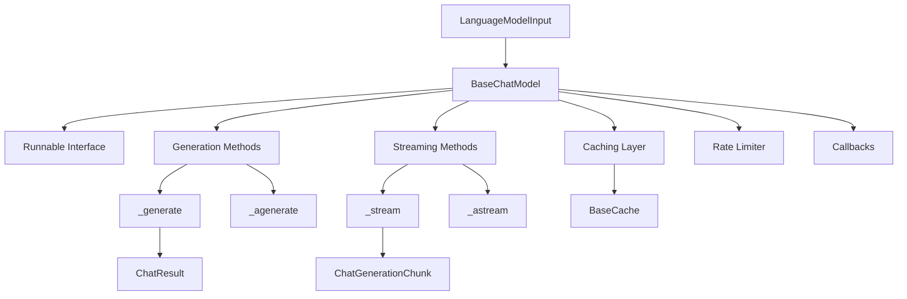

The architecture supports both synchronous and asynchronous operations, with automatic fallback mechanisms when async implementations are not available. The class hierarchy includes `BaseChatModel` as the primary interface and `SimpleChatModel` as a simplified implementation for backwards compatibility.

Sources: [chat_models.py:108-2055](../../../libs/core/langchain_core/language_models/chat_models.py#L108-L2055), [fake_chat_models.py:1-450](../../../libs/core/langchain_core/language_models/fake_chat_models.py#L1-L450)

## Core Components

### Key Properties and Fields

| Property | Type | Description | Required |
|----------|------|-------------|----------|
| `rate_limiter` | `BaseRateLimiter \| None` | Optional rate limiter for controlling request frequency | Optional |
| `disable_streaming` | `bool \| Literal["tool_calling"]` | Controls streaming behavior; can disable entirely or only for tool calls | Optional |
| `output_version` | `str \| None` | Version of AIMessage output format (`'v0'` or `'v1'`) | Optional |
| `profile` | `ModelProfile \| None` | Profile detailing model capabilities (context window, modalities, features) | Optional |
| `_llm_type` | `str` | Unique identifier for the model type | Required |

Sources: [chat_models.py:179-227](../../../libs/core/langchain_core/language_models/chat_models.py#L179-L227)

### Input Processing

The chat model accepts flexible input types through the `LanguageModelInput` type, which can be:

- String prompts (converted to `StringPromptValue`)
- Lists of messages (converted to `ChatPromptValue`)
- `PromptValue` objects directly

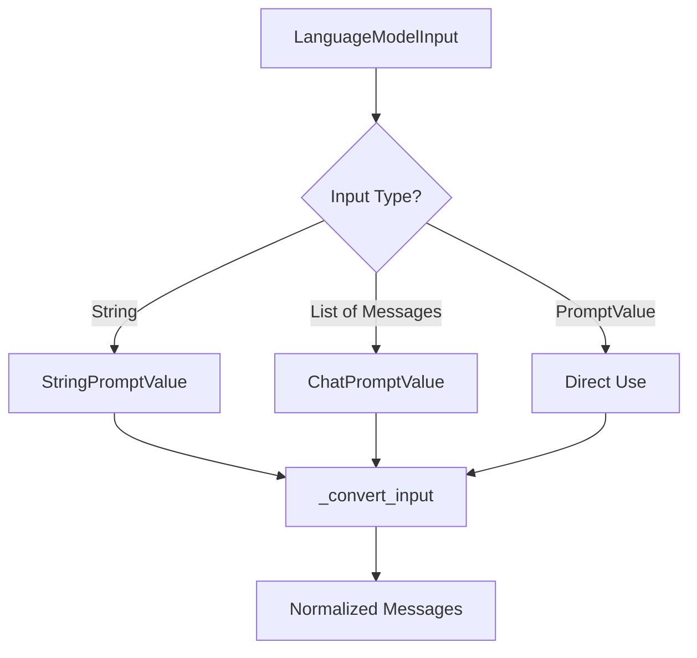

Sources: [chat_models.py:262-274](../../../libs/core/langchain_core/language_models/chat_models.py#L262-L274)

## Imperative Methods

The `BaseChatModel` provides a comprehensive set of methods for invoking chat models, organized into synchronous and asynchronous variants:

### Synchronous Methods

| Method | Input | Output | Description |
|--------|-------|--------|-------------|
| `invoke` | `LanguageModelInput` | `AIMessage` | Single chat model call |
| `stream` | `LanguageModelInput` | `Iterator[AIMessageChunk]` | Streaming chat generation |
| `batch` | `list[LanguageModelInput]` | `list[AIMessage]` | Batch processing in concurrent threads |
| `batch_as_completed` | `list[LanguageModelInput]` | `Iterator[tuple[int, Union[AIMessage, Exception]]]` | Batch with completion ordering |

### Asynchronous Methods

| Method | Input | Output | Description |
|--------|-------|--------|-------------|
| `ainvoke` | `LanguageModelInput` | `AIMessage` | Async single call (defaults to invoke in executor) |
| `astream` | `LanguageModelInput` | `AsyncIterator[AIMessageChunk]` | Async streaming generation |
| `abatch` | `list[LanguageModelInput]` | `list[AIMessage]` | Async batch processing |
| `abatch_as_completed` | `list[LanguageModelInput]` | `AsyncIterator[tuple[int, Union[AIMessage, Exception]]]` | Async batch with completion ordering |

Sources: [chat_models.py:117-176](../../../libs/core/langchain_core/language_models/chat_models.py#L117-L176)

## Generation Flow

### Synchronous Generation

The synchronous generation flow involves multiple layers of processing:

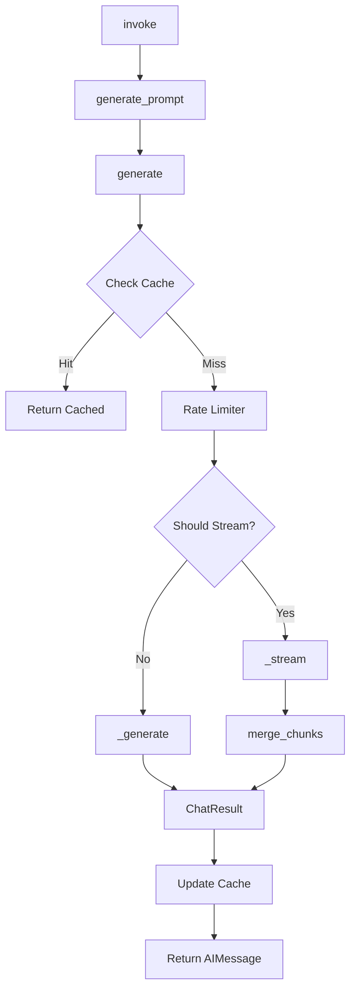

The `_generate_with_cache` method orchestrates the entire generation process, including cache lookups, rate limiting, streaming decisions, and callback management.

Sources: [chat_models.py:1281-1416](../../../libs/core/langchain_core/language_models/chat_models.py#L1281-L1416)

### Asynchronous Generation

The asynchronous generation flow mirrors the synchronous flow but uses async/await patterns:

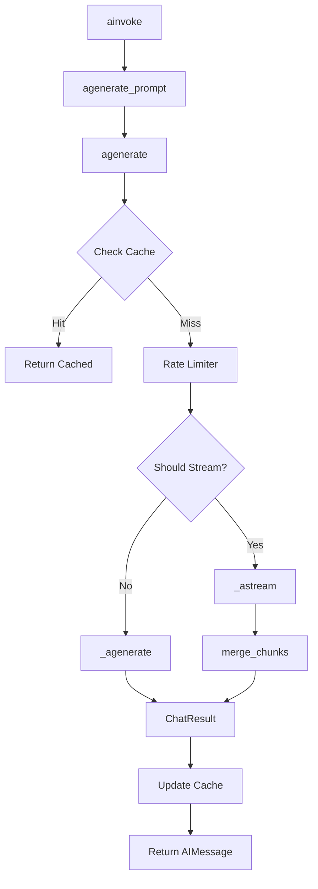

Sources: [chat_models.py:1418-1558](../../../libs/core/langchain_core/language_models/chat_models.py#L1418-L1558)

## Streaming Implementation

### Streaming Decision Logic

The `_should_stream` method determines whether to use streaming based on multiple factors:

1. Implementation availability (checks if `_stream` or `_astream` is implemented)
2. `disable_streaming` configuration
3. Runtime `stream` parameter
4. Presence of streaming callback handlers

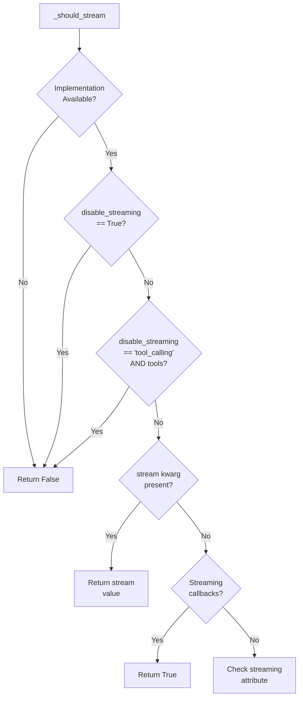

Sources: [chat_models.py:318-350](../../../libs/core/langchain_core/language_models/chat_models.py#L318-L350)

### Stream Processing

The streaming methods (`stream` and `astream`) handle chunk aggregation, callback notifications, and special handling for output versions:

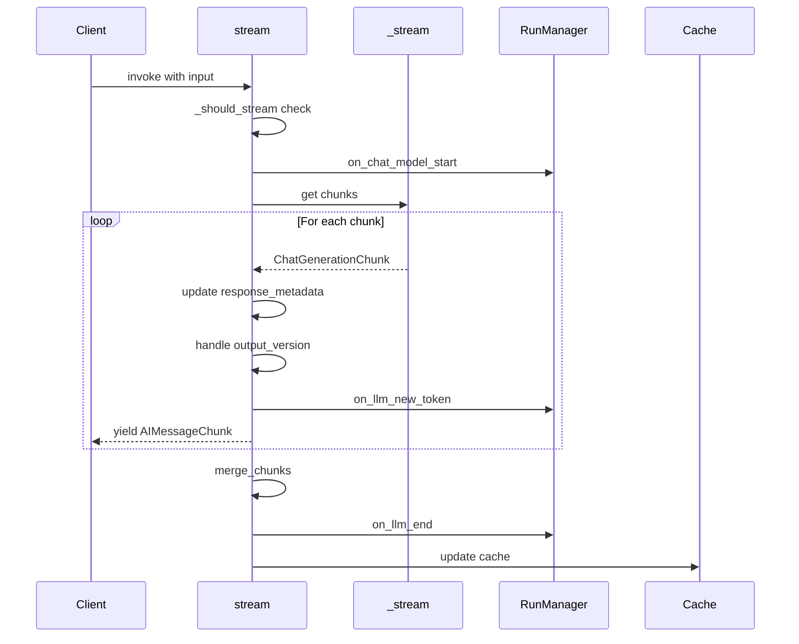

Sources: [chat_models.py:352-480](../../../libs/core/langchain_core/language_models/chat_models.py#L352-L480)

## Caching Mechanism

The caching layer provides transparent result caching to reduce redundant API calls:

### Cache Lookup and Storage

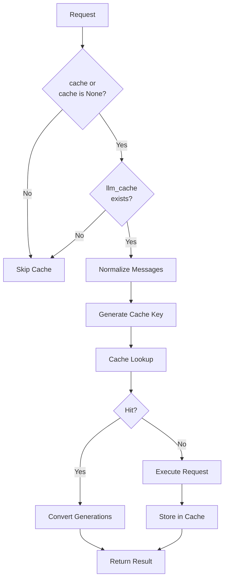

The caching system uses a combination of the serialized messages and LLM configuration string as the cache key. It also handles conversion of cached `Generation` objects to `ChatGeneration` objects for compatibility.

Sources: [chat_models.py:1281-1326](../../../libs/core/langchain_core/language_models/chat_models.py#L1281-L1326), [chat_models.py:932-968](../../../libs/core/langchain_core/language_models/chat_models.py#L932-L968)

## Callback System

The callback system provides hooks for monitoring and extending chat model behavior:

### Callback Events

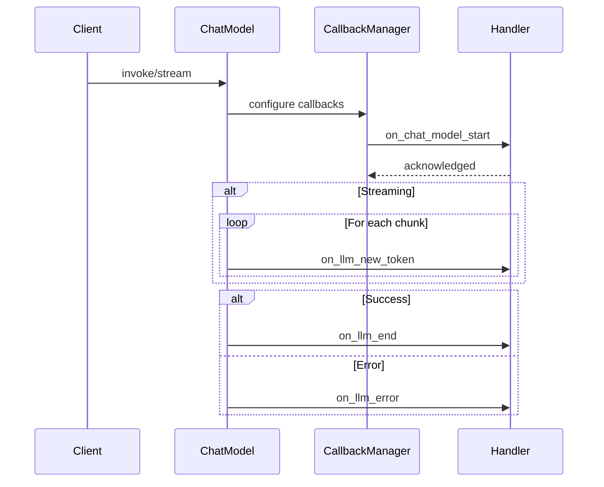

The callback system supports three main events:
- `on_chat_model_start`: Triggered before generation begins
- `on_llm_new_token`: Triggered for each token during streaming
- `on_llm_end`: Triggered on successful completion
- `on_llm_error`: Triggered on errors

Sources: [chat_models.py:352-480](../../../libs/core/langchain_core/language_models/chat_models.py#L352-L480), [chat_models.py:1034-1073](../../../libs/core/langchain_core/language_models/chat_models.py#L1034-L1073)

## Declarative Methods

### Tool Binding

The `bind_tools` method enables chat models to call external tools:

```python
def bind_tools(
    self,
    tools: Sequence[dict[str, Any] | type | Callable | BaseTool],
    *,
    tool_choice: str | None = None,
    **kwargs: Any,
) -> Runnable[LanguageModelInput, AIMessage]:
```

This method must be implemented by concrete chat model classes to support tool calling functionality.

Sources: [chat_models.py:1706-1727](../../../libs/core/langchain_core/language_models/chat_models.py#L1706-L1727)

### Structured Output

The `with_structured_output` method creates a wrapper that structures model output using a schema:

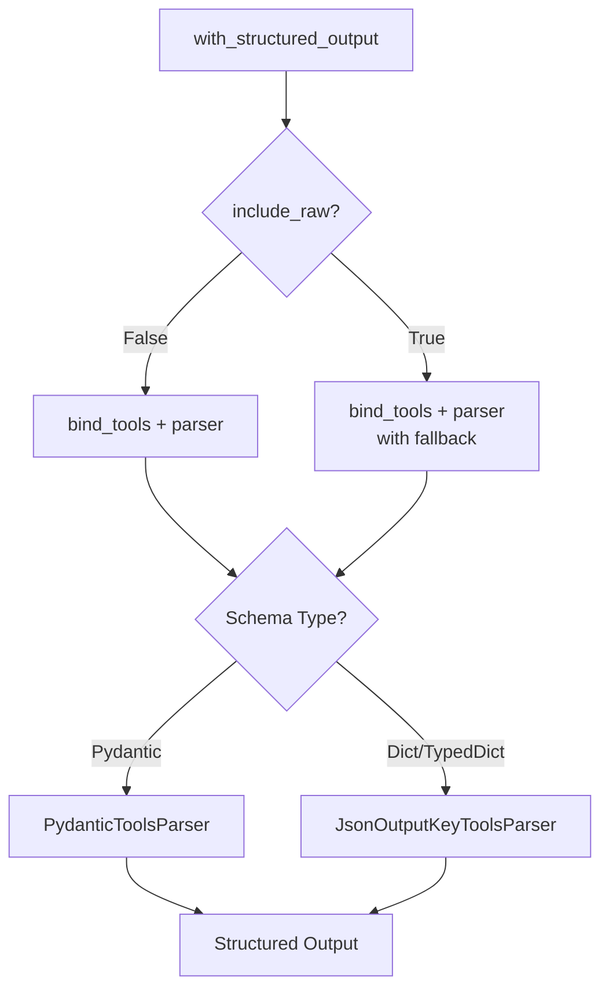

The method supports multiple schema types:
- OpenAI function/tool schemas
- JSON Schemas
- TypedDict classes
- Pydantic classes

When `include_raw=True`, the output includes both the raw model response and the parsed structured output, along with any parsing errors.

Sources: [chat_models.py:1729-1912](../../../libs/core/langchain_core/language_models/chat_models.py#L1729-L1912)

## Output Data Models

### ChatGeneration

The `ChatGeneration` class represents a single chat generation output:

| Field | Type | Description |
|-------|------|-------------|
| `text` | `str` | Text contents of the output message (auto-populated) |
| `message` | `BaseMessage` | The message output by the chat model |
| `generation_info` | `dict \| None` | Additional generation metadata |
| `type` | `Literal["ChatGeneration"]` | Type identifier for serialization |

Sources: [chat_generation.py:15-71](../../../libs/core/langchain_core/outputs/chat_generation.py#L15-L71)

### ChatGenerationChunk

The `ChatGenerationChunk` class extends `ChatGeneration` for streaming:

```python
class ChatGenerationChunk(ChatGeneration):
    message: BaseMessageChunk
    type: Literal["ChatGenerationChunk"] = "ChatGenerationChunk"
    
    def __add__(
        self, other: ChatGenerationChunk | list[ChatGenerationChunk]
    ) -> ChatGenerationChunk:
        # Merges chunks together
```

Chunks can be concatenated using the `+` operator, automatically merging messages and generation info.

Sources: [chat_generation.py:74-124](../../../libs/core/langchain_core/outputs/chat_generation.py#L74-L124)

### ChatResult

The `ChatResult` class contains the result of a chat model call:

| Field | Type | Description |
|-------|------|-------------|
| `generations` | `list[ChatGeneration]` | List of chat generations (supports multiple candidates) |
| `llm_output` | `dict \| None` | Provider-specific output metadata |

Sources: [chat_result.py:8-28](../../../libs/core/langchain_core/outputs/chat_result.py#L8-L28)

## Model Profile System

The model profile system provides metadata about model capabilities:

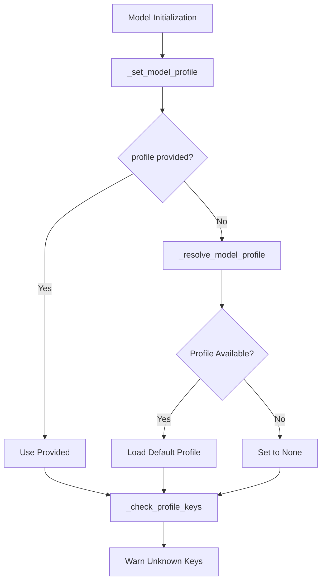

The profile system uses a two-validator approach:
1. `_set_model_profile`: Populates profile from `_resolve_model_profile` if not provided
2. `_check_profile_keys`: Validates profile keys and warns about unrecognized fields

Partner packages can override `_resolve_model_profile` to provide model-specific capability data.

Sources: [chat_models.py:229-273](../../../libs/core/langchain_core/language_models/chat_models.py#L229-L273)

## Implementation Requirements

### Required Methods and Properties

For custom chat model implementations:

| Method/Property | Description | Required |
|-----------------|-------------|----------|
| `_generate` | Generate chat result from messages | **Required** |
| `_llm_type` | Unique identifier for the model type | **Required** |
| `_identifying_params` | Model parameterization for tracing | Optional |
| `_stream` | Implement streaming generation | Optional |
| `_agenerate` | Native async generation | Optional |
| `_astream` | Async streaming generation | Optional |

Sources: [chat_models.py:163-176](../../../libs/core/langchain_core/language_models/chat_models.py#L163-L176)

### SimpleChatModel

The `SimpleChatModel` class provides a simplified interface for implementations:

```python
class SimpleChatModel(BaseChatModel):
    @abstractmethod
    def _call(
        self,
        messages: list[BaseMessage],
        stop: list[str] | None = None,
        run_manager: CallbackManagerForLLMRun | None = None,
        **kwargs: Any,
    ) -> str:
        """Simpler interface returning just a string."""
```

This class automatically wraps the string response in an `AIMessage` and handles the conversion to `ChatResult`.

Sources: [chat_models.py:1916-1963](../../../libs/core/langchain_core/language_models/chat_models.py#L1916-L1963)

## Testing Utilities

The framework provides several fake chat models for testing:

### FakeListChatModel

A simple fake model that cycles through predefined responses:

```python
class FakeListChatModel(SimpleChatModel):
    responses: list[str]
    sleep: float | None = None
    i: int = 0
    error_on_chunk_number: int | None = None
```

This model supports both synchronous and asynchronous streaming, with optional delays and error injection for testing error handling.

Sources: [fake_chat_models.py:51-186](../../../libs/core/langchain_core/language_models/fake_chat_models.py#L51-L186)

### GenericFakeChatModel

A more sophisticated fake model that accepts an iterator of messages:

```python
class GenericFakeChatModel(BaseChatModel):
    messages: Iterator[AIMessage | str]
```

This model implements proper streaming by breaking messages into chunks based on whitespace and properly handles `on_llm_new_token` callbacks.

Sources: [fake_chat_models.py:222-367](../../../libs/core/langchain_core/language_models/fake_chat_models.py#L222-L367)

## Error Handling

The error handling system captures response metadata even when errors occur:

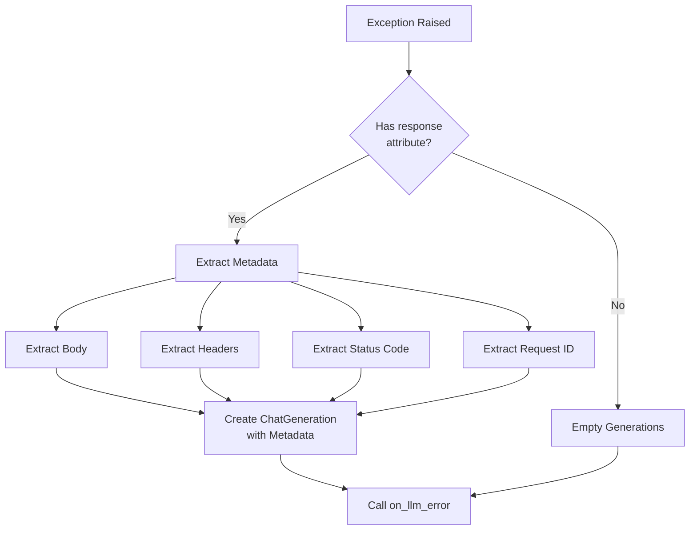

The `_generate_response_from_error` function extracts as much metadata as possible from error responses to aid in debugging and monitoring.

Sources: [chat_models.py:73-105](../../../libs/core/langchain_core/language_models/chat_models.py#L73-L105)

## Message Formatting for Tracing

The `_format_for_tracing` function normalizes messages for consistent tracing:

1. Converts image content blocks to OpenAI Chat Completions format for backward compatibility
2. Converts v1 base64 blocks to v0 format
3. Adds `type` key to content blocks with a single key

This ensures that traced messages follow a consistent format regardless of the input format variations.

Sources: [chat_models.py:108-169](../../../libs/core/langchain_core/language_models/chat_models.py#L108-L169)

## Summary

The `BaseChatModel` class provides a comprehensive, production-ready interface for chat models in LangChain. It handles the complexity of message-based conversations, streaming, caching, rate limiting, callbacks, and structured outputs while maintaining flexibility for different provider implementations. The architecture supports both synchronous and asynchronous operations with automatic fallbacks, making it suitable for a wide range of applications from simple chatbots to complex multi-model chains. Through its declarative methods like `bind_tools` and `with_structured_output`, it enables advanced use cases such as function calling and structured data extraction. The extensive testing utilities and clear implementation requirements make it straightforward for developers to create custom chat model integrations that seamlessly integrate with the LangChain ecosystem.