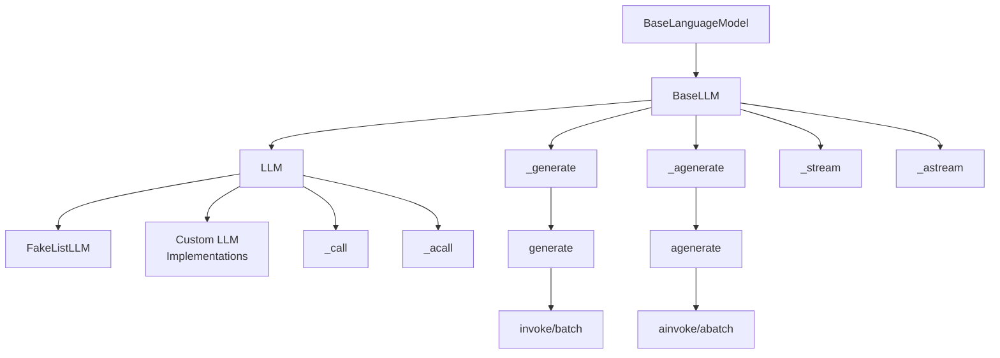
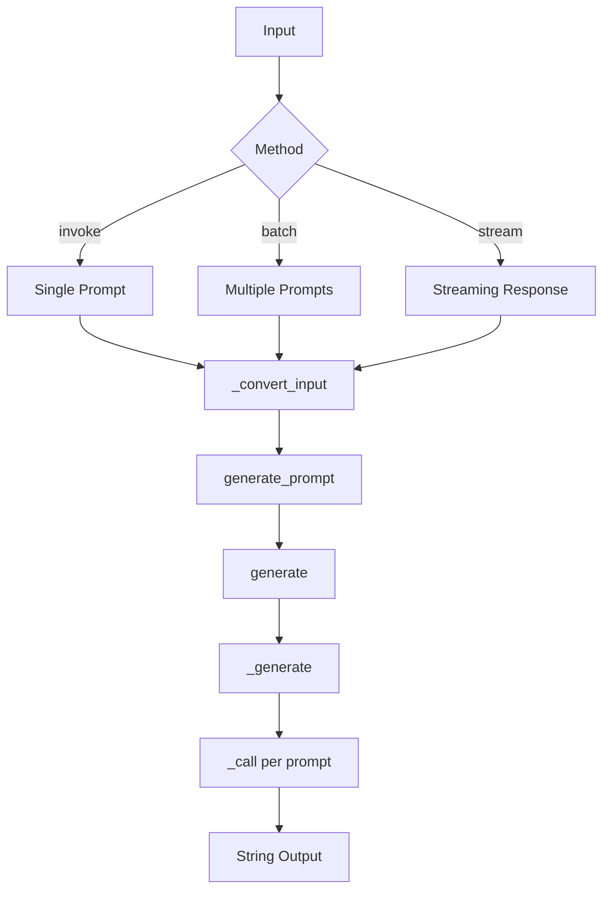
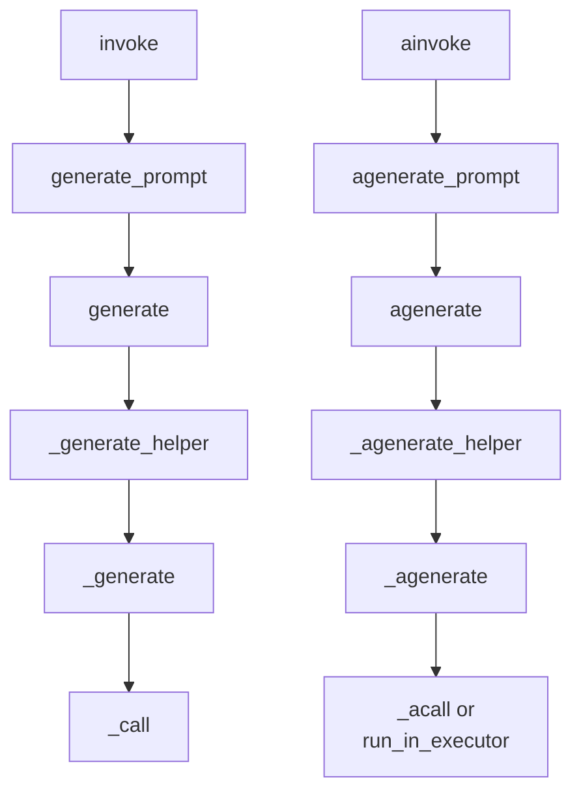
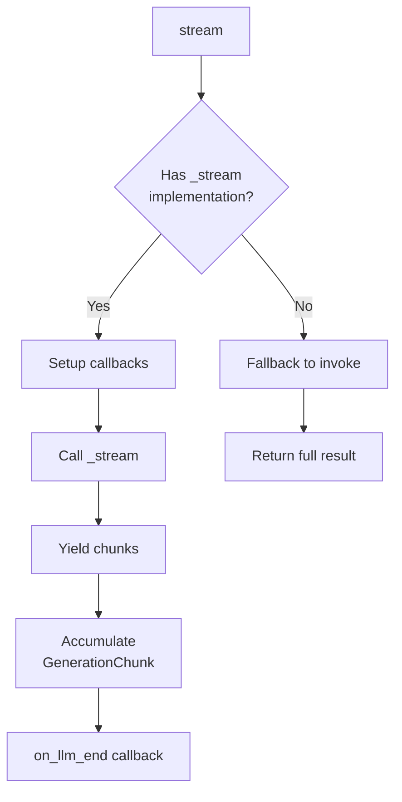
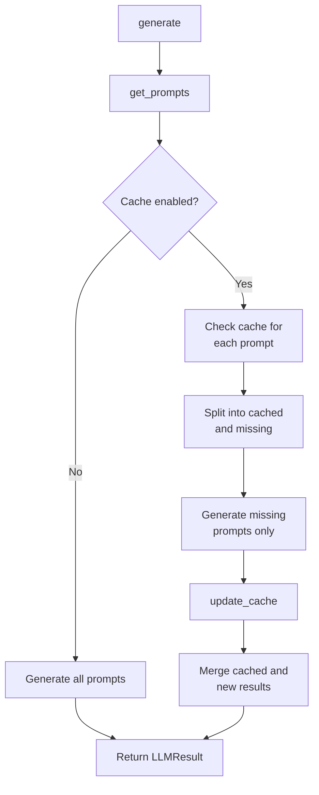
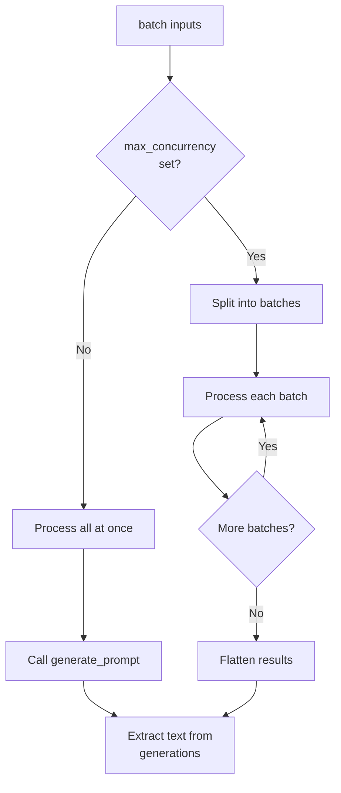
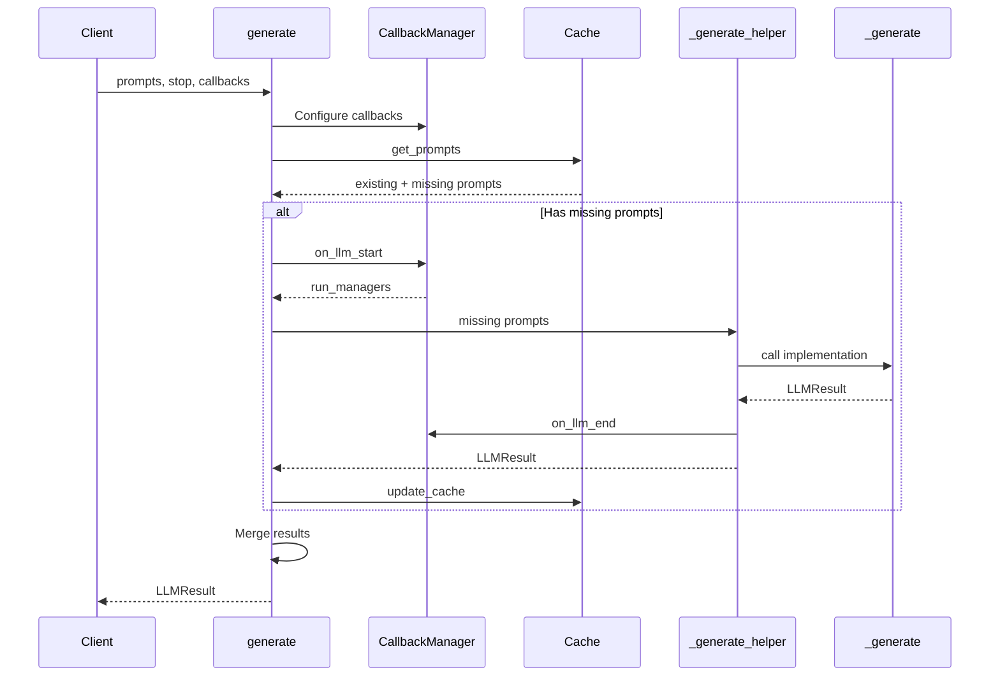
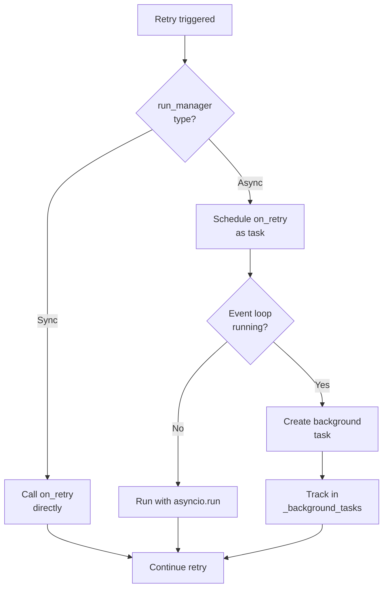

# LLM Interface (BaseLLM / LLM)

The LLM Interface in LangChain provides the foundational abstraction layer for interacting with traditional large language models (LLMs) that operate on a text-in, text-out paradigm. This interface is primarily designed for older generation models, as opposed to the more modern chat-based models. The core of this interface consists of two main classes: `BaseLLM`, which defines the abstract interface and comprehensive functionality including caching, callbacks, and batching; and `LLM`, which provides a simplified interface for custom implementations requiring only a `_call` method. These classes enable developers to integrate various LLM providers into LangChain applications while maintaining consistent behavior across different implementations.

The interface is built on top of the `BaseLanguageModel` class and implements the Runnable protocol, allowing LLMs to be seamlessly integrated into LangChain's composable chain architecture. It provides both synchronous and asynchronous execution paths, streaming capabilities, automatic retry logic, and sophisticated caching mechanisms to optimize performance and reduce API calls.

Sources: [llms.py:1-10](../../../libs/core/langchain_core/language_models/llms.py#L1-L10), [llms.py:368-373](../../../libs/core/langchain_core/language_models/llms.py#L368-L373)

## Architecture Overview

The LLM interface follows a hierarchical class structure with clear separation of concerns between the abstract base class and the concrete implementation class.



The architecture separates the high-level orchestration logic in `BaseLLM` from the low-level model invocation logic that implementers must provide. `BaseLLM` handles caching, callbacks, batching, and retry logic, while concrete implementations only need to define how to call their specific LLM provider.

Sources: [llms.py:368-1110](../../../libs/core/langchain_core/language_models/llms.py#L368-L1110)

## Core Classes

### BaseLLM

`BaseLLM` is the abstract base class that defines the complete interface for LLM interactions. It extends `BaseLanguageModel[str]` and provides comprehensive functionality for model invocation, caching, and callback management.

| Feature | Description |
|---------|-------------|
| Output Type | Always returns `str` as the output type |
| Caching | Supports optional caching via `BaseCache` integration |
| Callbacks | Full callback manager support for tracing and monitoring |
| Batching | Native support for batch processing of multiple prompts |
| Streaming | Optional streaming support via `_stream` method |
| Async | Complete async/await support for all operations |

Key abstract methods that must be implemented by subclasses:

- `_generate()`: Core synchronous generation method
- `_llm_type`: Property returning the LLM type identifier

Sources: [llms.py:368-373](../../../libs/core/langchain_core/language_models/llms.py#L368-L373), [llms.py:376-380](../../../libs/core/langchain_core/language_models/llms.py#L376-L380)

### LLM

`LLM` is a simplified subclass of `BaseLLM` designed to make custom LLM implementation straightforward. Implementers only need to override the `_call` method and provide identifying parameters.

```python
@abstractmethod
def _call(
    self,
    prompt: str,
    stop: list[str] | None = None,
    run_manager: CallbackManagerForLLMRun | None = None,
    **kwargs: Any,
) -> str:
    """Run the LLM on the given input.
    
    Returns:
        The model output as a string. SHOULD NOT include the prompt.
    """
```

The `LLM` class automatically implements `_generate` by calling `_call` for each prompt in the batch, simplifying the implementation burden for custom LLM providers.

Sources: [llms.py:1113-1146](../../../libs/core/langchain_core/language_models/llms.py#L1113-L1146), [llms.py:1148-1178](../../../libs/core/langchain_core/language_models/llms.py#L1148-L1178)

## Invocation Methods

### Runnable Interface

The LLM interface implements the Runnable protocol, providing standardized methods for invocation:



The invocation flow follows these steps:
1. Convert input to `PromptValue` using `_convert_input`
2. Route to appropriate generation method (`generate_prompt`, `agenerate_prompt`)
3. Execute core generation logic with caching and callbacks
4. Return formatted results

Sources: [llms.py:395-410](../../../libs/core/langchain_core/language_models/llms.py#L395-L410), [llms.py:440-469](../../../libs/core/langchain_core/language_models/llms.py#L440-L469)

### Input Conversion

The `_convert_input` method handles flexible input types:

| Input Type | Conversion |
|------------|------------|
| `PromptValue` | Passed through unchanged |
| `str` | Wrapped in `StringPromptValue` |
| `Sequence` (list of messages) | Converted to `ChatPromptValue` |

This allows LLMs to accept various input formats while maintaining internal consistency.

Sources: [llms.py:412-425](../../../libs/core/langchain_core/language_models/llms.py#L412-L425)

### Synchronous and Asynchronous Execution

The interface provides parallel sync and async execution paths:



The async methods (`ainvoke`, `agenerate`, `_agenerate`) provide native async support. If not overridden, they delegate to synchronous methods using `run_in_executor` to prevent blocking.

Sources: [llms.py:470-489](../../../libs/core/langchain_core/language_models/llms.py#L470-L489), [llms.py:596-625](../../../libs/core/langchain_core/language_models/llms.py#L596-L625)

## Streaming Support

### Stream Method Implementation

The streaming interface allows models to return results incrementally rather than waiting for complete generation:



The streaming implementation:
1. Checks if the subclass implements `_stream`
2. If not implemented, falls back to non-streaming `invoke`
3. If implemented, sets up callback managers and yields chunks
4. Accumulates chunks into a complete `GenerationChunk`
5. Fires completion callbacks with the full result

Sources: [llms.py:532-591](../../../libs/core/langchain_core/language_models/llms.py#L532-L591)

### Async Streaming

The async streaming method `astream` follows a similar pattern with additional fallback logic:

```python
async def astream(
    self,
    input: LanguageModelInput,
    config: RunnableConfig | None = None,
    *,
    stop: list[str] | None = None,
    **kwargs: Any,
) -> AsyncIterator[str]:
```

If neither `_astream` nor `_stream` is implemented, it falls back to `ainvoke`. If only `_stream` is implemented, it wraps the synchronous stream in an async iterator using `run_in_executor`.

Sources: [llms.py:593-664](../../../libs/core/langchain_core/language_models/llms.py#L593-L664), [llms.py:761-807](../../../libs/core/langchain_core/language_models/llms.py#L761-L807)

## Caching System

### Cache Resolution

The caching system supports multiple cache configuration options:

| Cache Value | Behavior |
|-------------|----------|
| `BaseCache` instance | Use the provided cache object |
| `None` | Use global cache from `get_llm_cache()` if available |
| `True` | Require global cache (raises error if not configured) |
| `False` | Disable caching completely |

```python
def _resolve_cache(*, cache: BaseCache | bool | None) -> BaseCache | None:
    """Resolve the cache."""
    llm_cache: BaseCache | None
    if isinstance(cache, BaseCache):
        llm_cache = cache
    elif cache is None:
        llm_cache = get_llm_cache()
    elif cache is True:
        llm_cache = get_llm_cache()
        if llm_cache is None:
            msg = (
                "No global cache was configured. Use `set_llm_cache`."
                "to set a global cache if you want to use a global cache."
                "Otherwise either pass a cache object or set cache to False/None"
            )
            raise ValueError(msg)
    elif cache is False:
        llm_cache = None
    else:
        msg = f"Unsupported cache value {cache}"
        raise ValueError(msg)
    return llm_cache
```

Sources: [llms.py:140-163](../../../libs/core/langchain_core/language_models/llms.py#L140-L163)

### Cache Lookup and Update Flow



The caching process:
1. `get_prompts()` checks cache for each prompt using an `llm_string` key derived from model parameters
2. Returns existing cached results and identifies missing prompts
3. Only missing prompts are sent to the model
4. `update_cache()` stores new results in the cache
5. Results are merged and returned in original order

Sources: [llms.py:166-201](../../../libs/core/langchain_core/language_models/llms.py#L166-L201), [llms.py:204-234](../../../libs/core/langchain_core/language_models/llms.py#L204-L234), [llms.py:237-267](../../../libs/core/langchain_core/language_models/llms.py#L237-L267)

## Batch Processing

The `batch` method enables efficient processing of multiple inputs:

```python
def batch(
    self,
    inputs: list[LanguageModelInput],
    config: RunnableConfig | list[RunnableConfig] | None = None,
    *,
    return_exceptions: bool = False,
    **kwargs: Any,
) -> list[str]:
```

### Batch Execution Strategy

The batch implementation handles concurrency control:



When `max_concurrency` is set, inputs are divided into batches of that size and processed sequentially. This prevents overwhelming the model provider with too many concurrent requests.

Sources: [llms.py:491-530](../../../libs/core/langchain_core/language_models/llms.py#L491-L530), [llms.py:666-705](../../../libs/core/langchain_core/language_models/llms.py#L666-L705)

## Generation Methods

### Core Generation Flow

The `generate` method is the primary entry point for batch generation:



The generation process includes:
1. Callback manager configuration with tags and metadata
2. Cache lookup for existing results
3. Batch generation for missing prompts
4. Callback invocation for tracing and monitoring
5. Cache update with new results
6. Result merging and return

Sources: [llms.py:809-1003](../../../libs/core/langchain_core/language_models/llms.py#L809-L1003)

### Generation Parameters

| Parameter | Type | Description |
|-----------|------|-------------|
| `prompts` | `list[str]` | List of string prompts to generate from |
| `stop` | `list[str] \| None` | Stop sequences to terminate generation |
| `callbacks` | `Callbacks \| list[Callbacks] \| None` | Callback handlers for monitoring |
| `tags` | `list[str] \| list[list[str]] \| None` | Tags for categorization |
| `metadata` | `dict \| list[dict] \| None` | Metadata for tracing |
| `run_name` | `str \| list[str] \| None` | Custom names for runs |
| `run_id` | `UUID \| list[UUID] \| None` | Explicit run IDs |

The method supports both single callbacks/tags/metadata for all prompts or individual values per prompt.

Sources: [llms.py:809-858](../../../libs/core/langchain_core/language_models/llms.py#L809-L858)

## Retry Mechanism

### Retry Decorator

The framework provides automatic retry logic for transient failures:

```python
def create_base_retry_decorator(
    error_types: list[type[BaseException]],
    max_retries: int = 1,
    run_manager: AsyncCallbackManagerForLLMRun | CallbackManagerForLLMRun | None = None,
) -> Callable[[Any], Any]:
```

The retry decorator uses exponential backoff with configurable parameters:

| Parameter | Value |
|-----------|-------|
| Min wait time | 4 seconds |
| Max wait time | 10 seconds |
| Multiplier | 1 (2^x seconds) |
| Reraise | True (exceptions propagate after exhausting retries) |

The decorator also integrates with callback managers to fire `on_retry` events, enabling monitoring and logging of retry attempts.

Sources: [llms.py:60-113](../../../libs/core/langchain_core/language_models/llms.py#L60-L113)

### Retry Callback Handling



The retry mechanism handles both sync and async callback managers, creating background tasks when necessary to avoid blocking the retry flow.

Sources: [llms.py:76-100](../../../libs/core/langchain_core/language_models/llms.py#L76-L100)

## Output Data Structures

### Generation

The `Generation` class represents a single text generation output:

```python
class Generation(Serializable):
    """A single text generation output."""
    
    text: str
    """Generated text output."""
    
    generation_info: dict[str, Any] | None = None
    """Raw response from the provider."""
    
    type: Literal["Generation"] = "Generation"
```

This is the fundamental unit of output from traditional LLMs, containing the generated text and optional provider-specific metadata.

Sources: [generation.py:1-62](../../../libs/core/langchain_core/outputs/generation.py#L1-L62)

### GenerationChunk

`GenerationChunk` extends `Generation` to support streaming by allowing concatenation:

```python
def __add__(self, other: GenerationChunk) -> GenerationChunk:
    """Concatenate two `GenerationChunk` objects."""
    if isinstance(other, GenerationChunk):
        generation_info = merge_dicts(
            self.generation_info or {},
            other.generation_info or {},
        )
        return GenerationChunk(
            text=self.text + other.text,
            generation_info=generation_info or None,
        )
```

This enables incremental accumulation of streamed output chunks into a complete generation.

Sources: [generation.py:64-89](../../../libs/core/langchain_core/outputs/generation.py#L64-L89)

### LLMResult

`LLMResult` is the container for complete generation results:

```python
class LLMResult(BaseModel):
    """A container for results of an LLM call."""
    
    generations: list[list[Generation | ChatGeneration | GenerationChunk | ChatGenerationChunk]]
    """Generated outputs. First dimension: different prompts. Second: candidates."""
    
    llm_output: dict | None = None
    """Provider-specific output."""
    
    run: list[RunInfo] | None = None
    """Metadata info for model call."""
```

The two-dimensional `generations` structure allows for multiple candidate generations per prompt, supporting scenarios like beam search or temperature-based sampling.

Sources: [llm_result.py:1-110](../../../libs/core/langchain_core/outputs/llm_result.py#L1-L110)

## LangSmith Integration

### Tracing Parameters

The interface automatically extracts parameters for LangSmith tracing:

```python
def _get_ls_params(
    self,
    stop: list[str] | None = None,
    **kwargs: Any,
) -> LangSmithParams:
    """Get standard params for tracing."""
    # get default provider from class name
    default_provider = self.__class__.__name__
    default_provider = default_provider.removesuffix("LLM")
    default_provider = default_provider.lower()
    
    ls_params = LangSmithParams(ls_provider=default_provider, ls_model_type="llm")
```

The method extracts:
- Provider name from class name
- Model name from `model` or `model_name` attributes
- Temperature from attributes or kwargs
- Max tokens from attributes or kwargs
- Stop sequences from parameters

This enables automatic instrumentation and tracing in LangSmith without manual configuration.

Sources: [llms.py:427-467](../../../libs/core/langchain_core/language_models/llms.py#L427-L467)

## Example Implementation: FakeListLLM

The `FakeListLLM` class demonstrates a minimal LLM implementation for testing:

```python
class FakeListLLM(LLM):
    """Fake LLM for testing purposes."""
    
    responses: list[str]
    """List of responses to return in order."""
    
    i: int = 0
    """Internally incremented after every model invocation."""
    
    @property
    def _llm_type(self) -> str:
        """Return type of llm."""
        return "fake-list"
    
    def _call(
        self,
        prompt: str,
        stop: list[str] | None = None,
        run_manager: CallbackManagerForLLMRun | None = None,
        **kwargs: Any,
    ) -> str:
        """Return next response."""
        response = self.responses[self.i]
        if self.i < len(self.responses) - 1:
            self.i += 1
        else:
            self.i = 0
        return response
```

This implementation cycles through a predefined list of responses, making it useful for testing chains and applications without making actual API calls.

Sources: [fake.py:1-68](../../../libs/core/langchain_core/language_models/fake.py#L1-L68)

## Serialization and Persistence

### Model Serialization

The `BaseLLM` class supports serialization for persistence and configuration management:

```python
def save(self, file_path: Path | str) -> None:
    """Save the LLM."""
    save_path = Path(file_path)
    directory_path = save_path.parent
    directory_path.mkdir(parents=True, exist_ok=True)
    
    prompt_dict = self.dict()
    
    if save_path.suffix == ".json":
        with save_path.open("w", encoding="utf-8") as f:
            json.dump(prompt_dict, f, indent=4)
    elif save_path.suffix.endswith((".yaml", ".yml")):
        with save_path.open("w", encoding="utf-8") as f:
            yaml.dump(prompt_dict, f, default_flow_style=False)
```

Models can be saved to JSON or YAML format, preserving their configuration and identifying parameters for later reconstruction.

Sources: [llms.py:1079-1110](../../../libs/core/langchain_core/language_models/llms.py#L1079-L1110)

### Identifying Parameters

The `dict()` method includes identifying parameters and type information:

```python
def dict(self, **kwargs: Any) -> dict:
    """Return a dictionary of the LLM."""
    starter_dict = dict(self._identifying_params)
    starter_dict["_type"] = self._llm_type
    return starter_dict
```

The `_identifying_params` property must be implemented by subclasses to return parameters that uniquely identify the model configuration, typically including the model name and key settings.

Sources: [llms.py:1070-1077](../../../libs/core/langchain_core/language_models/llms.py#L1070-L1077)

## Summary

The LLM Interface provides a robust, feature-rich foundation for integrating traditional language models into LangChain applications. Through the `BaseLLM` and `LLM` classes, it offers comprehensive support for synchronous and asynchronous execution, streaming, caching, batch processing, automatic retries, and extensive callback integration. The interface's design separates concerns between high-level orchestration and low-level model invocation, making it straightforward to implement custom LLM providers while benefiting from sophisticated built-in functionality. The integration with LangSmith for tracing and the support for serialization further enhance its utility in production environments. This interface serves as the backbone for text generation in LangChain, enabling developers to build sophisticated LLM-powered applications with consistent behavior across different model providers.