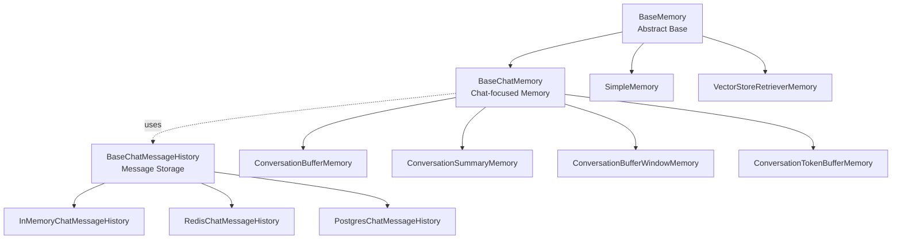
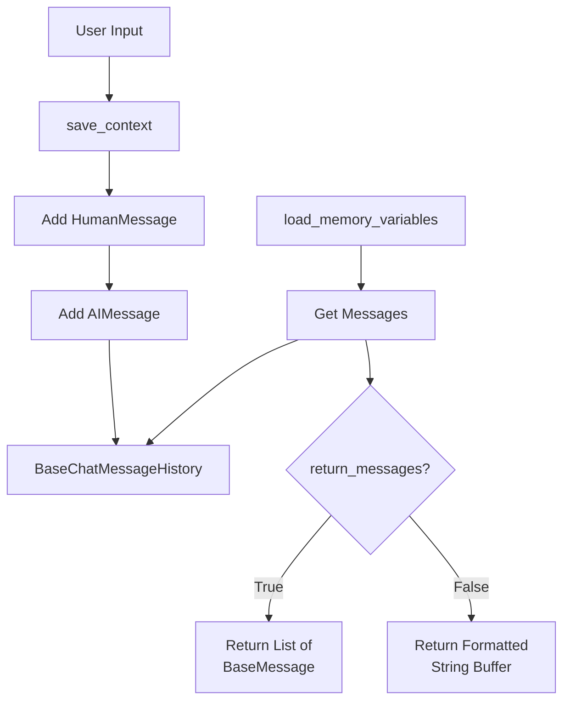
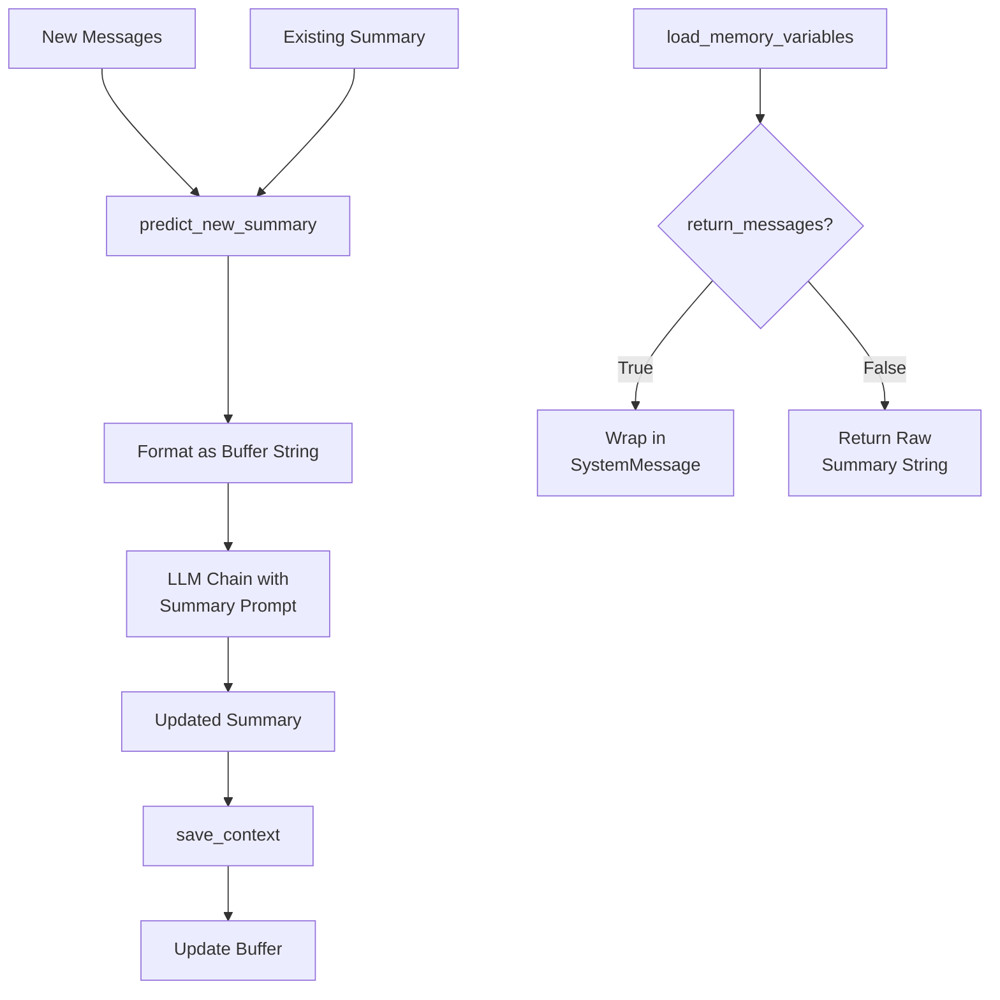
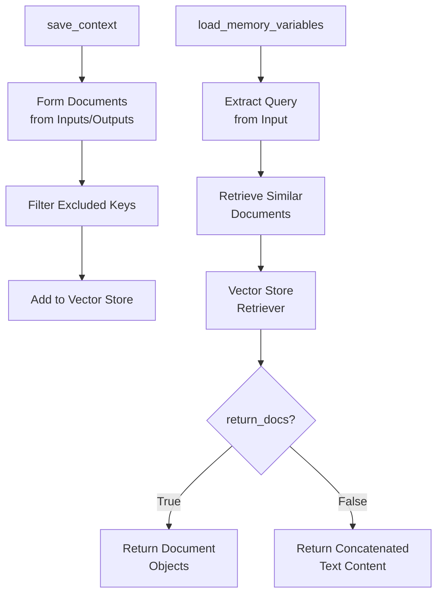
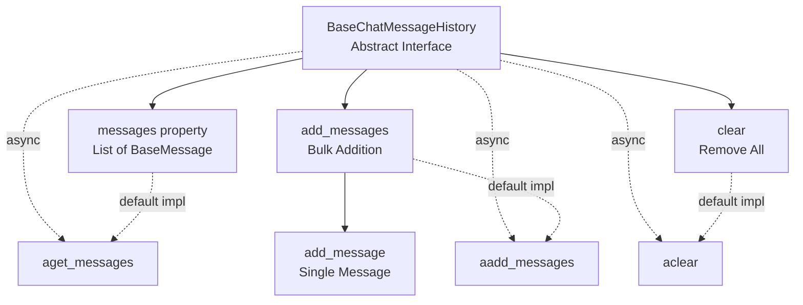
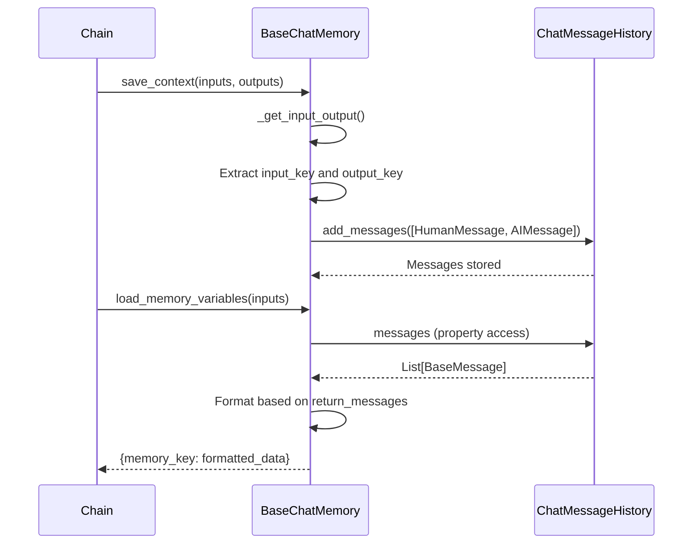
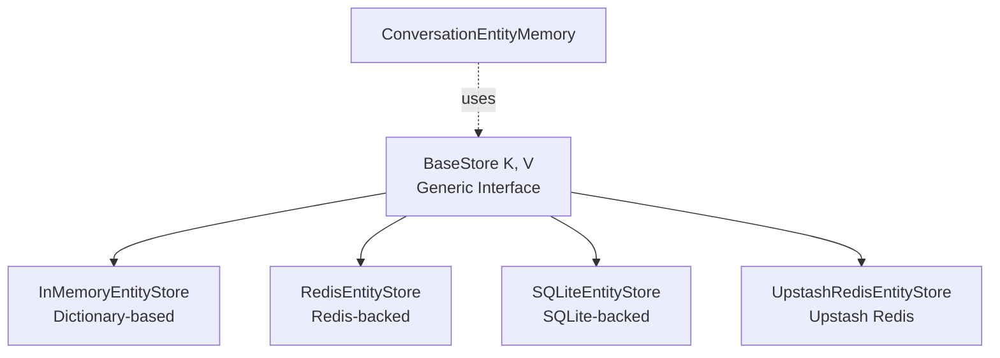

# Memory Types & Chat History

The LangChain Memory System provides mechanisms for maintaining conversational context and state across multiple interactions with language models. This system enables applications to remember past conversations, summarize lengthy interactions, and retrieve relevant historical context. The memory module offers various implementations ranging from simple buffer-based storage to sophisticated vector-backed retrieval systems, each designed to address different use cases and scalability requirements.

**Important Note:** As of version 0.3.1, most memory implementations in this module are deprecated, with removal planned for version 1.0.0. Users are encouraged to migrate to newer patterns as documented in the [migration guide](https://python.langchain.com/docs/versions/migrating_memory/).

Sources: [memory/__init__.py:1-2](../../../libs/langchain/langchain_classic/memory/__init__.py#L1-L2), [buffer.py:9-16](../../../libs/langchain/langchain_classic/memory/buffer.py#L9-L16)

## Architecture Overview

The memory system is built on a hierarchical class structure with clear separation of concerns between message storage and memory management:



The architecture separates **memory management** (how context is processed and loaded) from **message storage** (where messages are persisted). This design allows flexible combinations of memory strategies with different persistence backends.

Sources: [chat_memory.py:16-30](../../../libs/langchain/langchain_classic/memory/chat_memory.py#L16-L30), [chat_history.py:13-71](../../../libs/core/langchain_core/chat_history.py#L13-L71), [memory/__init__.py:6-32](../../../libs/langchain/langchain_classic/memory/__init__.py#L6-L32)

## Core Memory Types

### Buffer-Based Memory

Buffer-based memory implementations store conversation history without modification, providing complete access to past interactions.

#### ConversationBufferMemory

The simplest memory implementation that stores the entire conversation history without any processing or truncation.



**Key Features:**
- Stores complete conversation history
- Supports both message list and string buffer formats
- Configurable human/AI prefixes for string formatting
- No automatic pruning or summarization

Sources: [buffer.py:18-75](../../../libs/langchain/langchain_classic/memory/buffer.py#L18-L75)

#### ConversationStringBufferMemory

A variant optimized for string-based conversations rather than chat models, storing history as a simple string buffer.

| Property | Type | Default | Description |
|----------|------|---------|-------------|
| `buffer` | `str` | `""` | The string buffer storing conversation history |
| `human_prefix` | `str` | `"Human"` | Prefix for human messages |
| `ai_prefix` | `str` | `"AI"` | Prefix for AI responses |
| `memory_key` | `str` | `"history"` | Key name for memory variable |
| `input_key` | `str \| None` | `None` | Key for input extraction |
| `output_key` | `str \| None` | `None` | Key for output extraction |

Sources: [buffer.py:78-143](../../../libs/langchain/langchain_classic/memory/buffer.py#L78-L143)

### Summary-Based Memory

Summary-based memory uses language models to create condensed representations of conversation history, enabling management of longer conversations within context limits.

#### ConversationSummaryMemory

Continuously summarizes the conversation history after each turn, maintaining a rolling summary instead of complete message history.



The summary process uses a configurable prompt template to instruct the LLM on how to update the existing summary with new conversation turns.

Sources: [summary.py:91-149](../../../libs/langchain/langchain_classic/memory/summary.py#L91-L149), [summary.py:24-70](../../../libs/langchain/langchain_classic/memory/summary.py#L24-L70)

### Vector Store Memory

Vector store memory leverages semantic search to retrieve relevant historical context based on the current input, rather than returning all or recent history.

#### VectorStoreRetrieverMemory

Stores conversation turns as documents in a vector store and retrieves the most semantically relevant past interactions.



**Configuration Options:**

| Property | Type | Description |
|----------|------|-------------|
| `retriever` | `VectorStoreRetriever` | The vector store retriever instance |
| `memory_key` | `str` | Key for memory in loaded variables (default: "history") |
| `input_key` | `str \| None` | Key for extracting query input |
| `return_docs` | `bool` | Whether to return Document objects or text |
| `exclude_input_keys` | `Sequence[str]` | Keys to exclude when forming documents |

Sources: [vectorstore.py:15-123](../../../libs/langchain/langchain_classic/memory/vectorstore.py#L15-L123)

## Chat Message History

The `BaseChatMessageHistory` abstraction provides the persistence layer for storing and retrieving messages, separate from memory management logic.

### Interface Design



The interface defines both synchronous and asynchronous methods, with async variants defaulting to executing sync methods in an executor thread. Implementations can override async methods for true async support.

Sources: [chat_history.py:18-146](../../../libs/core/langchain_core/chat_history.py#L18-L146)

### Implementation Guidelines

Implementations should prioritize bulk operations to minimize round-trips to persistence layers:

**Core Methods to Implement:**

| Method | Purpose | Priority |
|--------|---------|----------|
| `add_messages` | Bulk addition of messages | High - Most efficient |
| `messages` | Property returning all messages | Required |
| `clear` | Remove all messages | Required |
| `aget_messages` | Async message retrieval | Optional - Override for true async |
| `aadd_messages` | Async bulk addition | Optional - Override for true async |

The `add_message` method is provided for backwards compatibility but should not be the primary implementation target. The default implementation of `add_messages` calls `add_message` for each message, which is inefficient.

Sources: [chat_history.py:73-139](../../../libs/core/langchain_core/chat_history.py#L73-L139)

### InMemoryChatMessageHistory

A simple in-memory implementation suitable for development and testing:

```python
class InMemoryChatMessageHistory(BaseChatMessageHistory, BaseModel):
    """In memory implementation of chat message history."""
    
    messages: list[BaseMessage] = Field(default_factory=list)
    
    def add_message(self, message: BaseMessage) -> None:
        """Add a self-created message to the store."""
        self.messages.append(message)
    
    def clear(self) -> None:
        """Clear all messages from the store."""
        self.messages = []
```

This implementation stores messages in a simple Python list with no persistence beyond the process lifetime.

Sources: [chat_history.py:149-181](../../../libs/core/langchain_core/chat_history.py#L149-L181)

### Persistent Storage Backends

LangChain provides numerous chat message history implementations backed by various persistence systems:

| Backend | Class | Module |
|---------|-------|--------|
| Redis | `RedisChatMessageHistory` | `langchain_community.chat_message_histories` |
| PostgreSQL | `PostgresChatMessageHistory` | `langchain_community.chat_message_histories` |
| MongoDB | `MongoDBChatMessageHistory` | `langchain_community.chat_message_histories` |
| DynamoDB | `DynamoDBChatMessageHistory` | `langchain_community.chat_message_histories` |
| Elasticsearch | `ElasticsearchChatMessageHistory` | `langchain_community.chat_message_histories` |
| File System | `FileChatMessageHistory` | `langchain_community.chat_message_histories` |
| Cassandra | `CassandraChatMessageHistory` | `langchain_community.chat_message_histories` |
| Cosmos DB | `CosmosDBChatMessageHistory` | `langchain_community.chat_message_histories` |
| Astra DB | `AstraDBChatMessageHistory` | `langchain_community.chat_message_histories` |

These implementations have been moved to the `langchain_community` package as part of the framework's modularization.

Sources: [memory/__init__.py:34-57](../../../libs/langchain/langchain_classic/memory/__init__.py#L34-L57), [memory/__init__.py:63-83](../../../libs/langchain/langchain_classic/memory/__init__.py#L63-L83)

## BaseChatMemory Implementation

The `BaseChatMemory` class provides common functionality for memory implementations that work with chat message histories.

### Message Processing Flow



### Key Configuration

| Property | Type | Default | Description |
|----------|------|---------|-------------|
| `chat_memory` | `BaseChatMessageHistory` | `InMemoryChatMessageHistory()` | The underlying message storage |
| `output_key` | `str \| None` | `None` | Key to extract output from chain results |
| `input_key` | `str \| None` | `None` | Key to extract input from chain inputs |
| `return_messages` | `bool` | `False` | Whether to return messages or formatted string |

The `_get_input_output` method handles automatic key detection when `input_key` or `output_key` are not explicitly set, with fallback logic for common patterns.

Sources: [chat_memory.py:30-111](../../../libs/langchain/langchain_classic/memory/chat_memory.py#L30-L111)

## Entity Storage

The memory system includes specialized storage for tracking entities mentioned in conversations, enabling entity-aware memory implementations.

### Entity Store Implementations



The `BaseStore` interface provides a key-value abstraction with batch operations:

**Core Operations:**

| Method | Purpose | Batch Support |
|--------|---------|---------------|
| `mget(keys)` | Retrieve multiple values | Yes |
| `mset(key_value_pairs)` | Set multiple key-value pairs | Yes |
| `mdelete(keys)` | Delete multiple keys | Yes |
| `yield_keys(prefix)` | Iterate keys with optional prefix | Streaming |

All methods have async equivalents (`amget`, `amset`, `amdelete`, `ayield_keys`) with default implementations that execute sync methods in an executor.

Sources: [stores.py:20-145](../../../libs/core/langchain_core/stores.py#L20-L145), [memory/__init__.py:11-16](../../../libs/langchain/langchain_classic/memory/__init__.py#L11-L16)

### InMemoryBaseStore Implementation

```python
class InMemoryBaseStore(BaseStore[str, V], Generic[V]):
    """In-memory implementation of the BaseStore using a dictionary."""
    
    def __init__(self) -> None:
        self.store: dict[str, V] = {}
    
    def mget(self, keys: Sequence[str]) -> list[V | None]:
        return [self.store.get(key) for key in keys]
    
    def mset(self, key_value_pairs: Sequence[tuple[str, V]]) -> None:
        for key, value in key_value_pairs:
            self.store[key] = value
    
    def mdelete(self, keys: Sequence[str]) -> None:
        for key in keys:
            if key in self.store:
                del self.store[key]
```

This implementation provides a simple in-memory store with O(1) lookups and efficient batch operations.

Sources: [stores.py:147-207](../../../libs/core/langchain_core/stores.py#L147-L207)

## Specialized Memory Types

### Combined Memory

The `CombinedMemory` class allows composition of multiple memory implementations, enabling hybrid memory strategies.

Sources: [memory/__init__.py:10](../../../libs/langchain/langchain_classic/memory/__init__.py#L10)

### Read-Only Shared Memory

`ReadOnlySharedMemory` provides a memory wrapper that prevents modifications, useful for sharing context across multiple chains without allowing writes.

Sources: [memory/__init__.py:17](../../../libs/langchain/langchain_classic/memory/__init__.py#L17)

### Simple Memory

`SimpleMemory` offers a basic key-value memory implementation without chat-specific features, suitable for storing arbitrary context data.

Sources: [memory/__init__.py:18](../../../libs/langchain/langchain_classic/memory/__init__.py#L18)

## Deprecation and Migration

As of version 0.3.1, the memory system is undergoing significant changes. Most memory implementations are deprecated with planned removal in version 1.0.0.

**Deprecation Timeline:**

| Component | Deprecated Since | Removal Version | Migration Guide |
|-----------|------------------|-----------------|-----------------|
| `ConversationBufferMemory` | 0.3.1 | 1.0.0 | [Migration Guide](https://python.langchain.com/docs/versions/migrating_memory/) |
| `ConversationStringBufferMemory` | 0.3.1 | 1.0.0 | [Migration Guide](https://python.langchain.com/docs/versions/migrating_memory/) |
| `ConversationSummaryMemory` | 0.3.1 | 1.0.0 | [Migration Guide](https://python.langchain.com/docs/versions/migrating_memory/) |
| `BaseChatMemory` | 0.3.1 | 1.0.0 | [Migration Guide](https://python.langchain.com/docs/versions/migrating_memory/) |
| `VectorStoreRetrieverMemory` | 0.3.1 | 1.0.0 | [Migration Guide](https://python.langchain.com/docs/versions/migrating_memory/) |

**Important Limitation:**

The `BaseChatMemory` abstraction was created before chat models had native tool calling capabilities and does **NOT** support them. It will fail silently if used with chat models that have native tool calling. This is a critical reason for the deprecation.

Sources: [buffer.py:9-16](../../../libs/langchain/langchain_classic/memory/buffer.py#L9-L16), [chat_memory.py:16-30](../../../libs/langchain/langchain_classic/memory/chat_memory.py#L16-L30), [vectorstore.py:15-23](../../../libs/langchain/langchain_classic/memory/vectorstore.py#L15-L23)

## Summary

The LangChain Memory System provides a comprehensive framework for managing conversational state and context across LLM interactions. The architecture separates memory management strategies (buffer, summary, vector-based retrieval) from persistence mechanisms (in-memory, Redis, PostgreSQL, etc.), enabling flexible composition of memory solutions. While the current implementation is being deprecated in favor of more modern patterns, understanding these abstractions remains valuable for maintaining existing applications and informing migration strategies. The core concepts of message history management, context window optimization, and semantic retrieval continue to be fundamental to building stateful LLM applications.