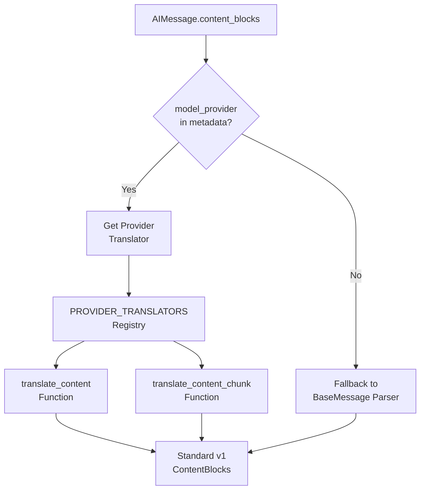
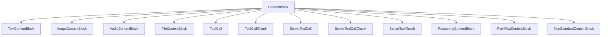
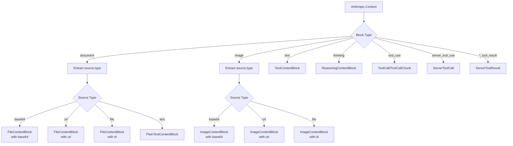
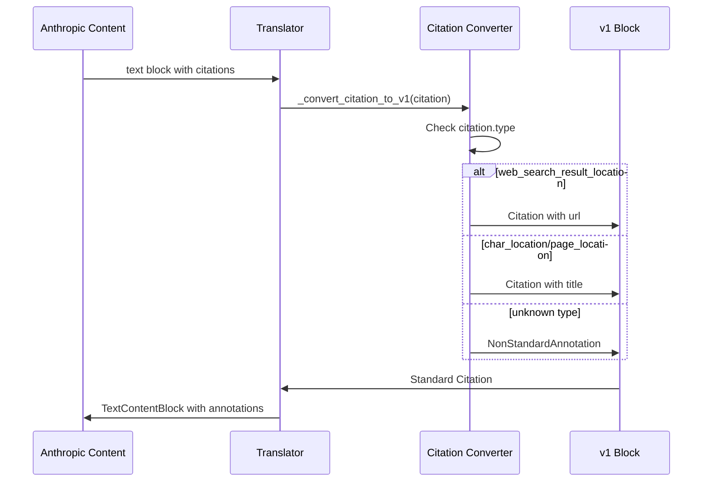
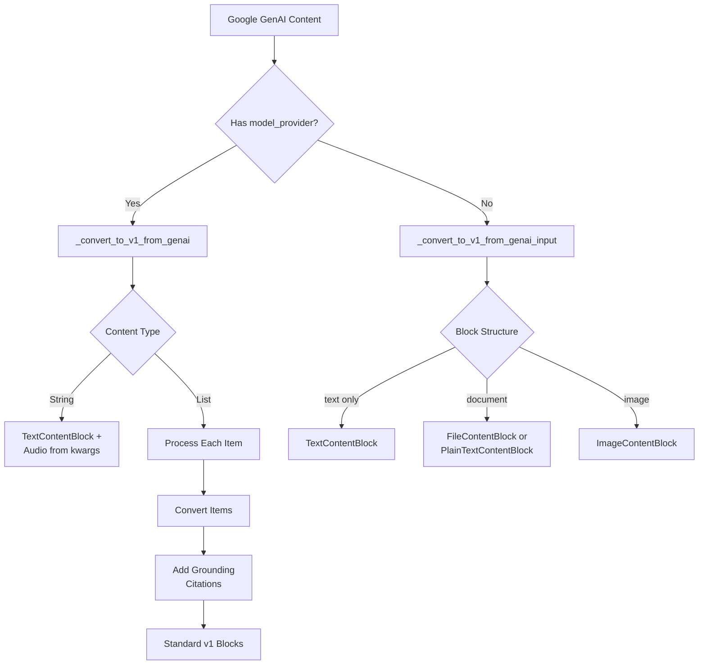
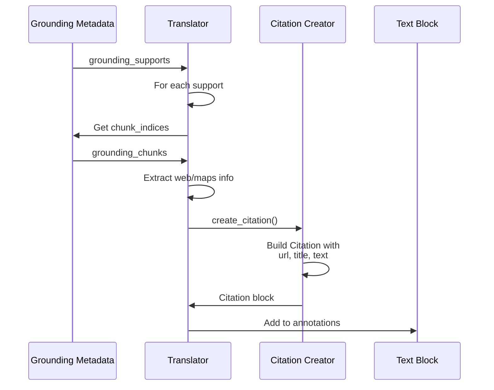
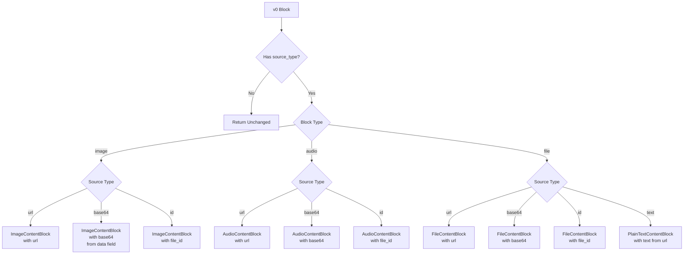

# Content Blocks & Block Translators

## Introduction

The Content Blocks & Block Translators system in LangChain provides a unified interface for representing and translating multimodal content from various LLM providers into a standardized format. This system enables seamless handling of text, images, audio, files, tool calls, reasoning blocks, and annotations across different AI model providers (OpenAI, Anthropic, Google GenAI, Bedrock, etc.). The core architecture consists of standardized content block types (v1 format) and provider-specific translators that convert provider-native formats into these standard blocks. When an `AIMessage` or `AIMessageChunk` calls `.content_blocks`, the system automatically selects the appropriate translator based on the `model_provider` field in `response_metadata`, falling back to best-effort parsing if no provider-specific translator is registered.

Sources: [block_translators/__init__.py:1-14](../../../libs/core/langchain_core/messages/block_translators/__init__.py#L1-L14)

## Architecture Overview

The block translator system follows a registry-based architecture where each provider registers translation functions for both complete messages (`AIMessage`) and streaming chunks (`AIMessageChunk`). The central registry maps provider names to translator functions, enabling dynamic dispatch based on message metadata.



The system supports bidirectional conversion: provider-specific formats can be translated to v1 standard blocks, and v1 blocks can be converted back to provider formats when needed for API calls.

Sources: [block_translators/__init__.py:16-35](../../../libs/core/langchain_core/messages/block_translators/__init__.py#L16-L35)

## Provider Translator Registry

### Registration Mechanism

The `PROVIDER_TRANSLATORS` dictionary serves as the central registry mapping provider names to their translation functions. Each provider must register two functions: one for complete messages and one for streaming chunks.

| Component | Type | Description |
|-----------|------|-------------|
| `PROVIDER_TRANSLATORS` | `dict[str, dict[str, Callable]]` | Maps provider names to translator function dictionaries |
| `translate_content` | `Callable[[AIMessage], list[ContentBlock]]` | Translates complete `AIMessage` content to v1 blocks |
| `translate_content_chunk` | `Callable[[AIMessageChunk], list[ContentBlock]]` | Translates streaming `AIMessageChunk` content to v1 blocks |

Sources: [block_translators/__init__.py:18-35](../../../libs/core/langchain_core/messages/block_translators/__init__.py#L18-L35)

### Registration Functions

```python
def register_translator(
    provider: str,
    translate_content: Callable[[AIMessage], list[types.ContentBlock]],
    translate_content_chunk: Callable[[AIMessageChunk], list[types.ContentBlock]],
) -> None:
    """Register content translators for a provider in `PROVIDER_TRANSLATORS`."""
    PROVIDER_TRANSLATORS[provider] = {
        "translate_content": translate_content,
        "translate_content_chunk": translate_content_chunk,
    }
```

The `register_translator` function provides the public API for registering new provider translators, while `get_translator` retrieves registered translators by provider name.

Sources: [block_translators/__init__.py:38-58](../../../libs/core/langchain_core/messages/block_translators/__init__.py#L38-L58)

### Supported Providers

The system automatically registers translators for the following providers during module initialization:

| Provider | Module | Auto-registered |
|----------|--------|-----------------|
| `anthropic` | `block_translators.anthropic` | Yes |
| `bedrock` | `block_translators.bedrock` | Yes |
| `bedrock_converse` | `block_translators.bedrock_converse` | Yes |
| `google_genai` | `block_translators.google_genai` | Yes |
| `google_vertexai` | `block_translators.google_vertexai` | Yes |
| `groq` | `block_translators.groq` | Yes |
| `openai` | `block_translators.openai` | Yes |

External integration packages can register additional translators by calling `register_translator` from within their own modules.

Sources: [block_translators/__init__.py:61-92](../../../libs/core/langchain_core/messages/block_translators/__init__.py#L61-L92)

## Standard Content Block Types (v1 Format)

The v1 format defines a comprehensive set of standardized content block types that represent all possible content types across different providers. These blocks are defined as TypedDict structures to ensure type safety while maintaining flexibility.

### Core Block Types



Each block type has specific required and optional fields that capture the semantics of that content type across providers.

Sources: [block_translators/anthropic.py:1-10](../../../libs/core/langchain_core/messages/block_translators/anthropic.py#L1-L10), [block_translators/google_genai.py:1-10](../../../libs/core/langchain_core/messages/block_translators/google_genai.py#L1-L10)

### Media Block Structure

Media blocks (images, audio, files) support three source types: URL-based, base64-encoded data, and file ID references.

| Field | Type | Required | Description |
|-------|------|----------|-------------|
| `type` | `Literal["image", "audio", "file"]` | Yes | Block type identifier |
| `url` | `str` | No | HTTP(S) URL to media resource |
| `base64` | `str` | No | Base64-encoded media data |
| `file_id` | `str` | No | Provider-specific file reference ID |
| `mime_type` | `str` | No | MIME type (e.g., "image/png", "audio/wav") |
| `id` | `str` | No | Unique block identifier |
| `index` | `int` | No | Position index in content sequence |
| `extras` | `dict[str, Any]` | No | Provider-specific additional fields |

Sources: [block_translators/anthropic.py:67-126](../../../libs/core/langchain_core/messages/block_translators/anthropic.py#L67-L126)

### Tool Call Blocks

The system distinguishes between client-side tool calls (user-defined functions) and server-side tool calls (provider-hosted tools like code interpreters).

| Block Type | Purpose | Key Fields |
|------------|---------|------------|
| `ToolCall` | Complete user-defined tool invocation | `name`, `args`, `id` |
| `ToolCallChunk` | Streaming fragment of tool call | `name`, `args`, `id` (all optional) |
| `ServerToolCall` | Complete server-side tool invocation | `name`, `args`, `id` |
| `ServerToolCallChunk` | Streaming fragment of server tool call | `name`, `args`, `id` |
| `ServerToolResult` | Result from server-side tool execution | `tool_call_id`, `status`, `output` |

Sources: [block_translators/anthropic.py:140-178](../../../libs/core/langchain_core/messages/block_translators/anthropic.py#L140-L178)

## Anthropic Content Translation

### Translation Flow

The Anthropic translator handles the conversion of Anthropic-specific content formats to standard v1 blocks. Anthropic uses a nested `source` structure for media content and specific block types for tool usage.



Sources: [block_translators/anthropic.py:36-126](../../../libs/core/langchain_core/messages/block_translators/anthropic.py#L36-L126)

### Document and Image Handling

Anthropic's document and image blocks use a nested `source` structure with a `type` field indicating the data source:

```python
# Anthropic format
{
    "type": "document",
    "source": {
        "type": "base64",
        "media_type": "application/pdf",
        "data": "base64_encoded_data"
    }
}

# Converted to v1
{
    "type": "file",
    "base64": "base64_encoded_data",
    "mime_type": "application/pdf"
}
```

The translator preserves unknown fields in the `extras` dictionary to prevent data loss during conversion.

Sources: [block_translators/anthropic.py:67-126](../../../libs/core/langchain_core/messages/block_translators/anthropic.py#L67-L126)

### Citation Conversion

Anthropic citations are converted to standard annotation blocks. The system supports multiple citation types including web search results, document locations, and page references.



Sources: [block_translators/anthropic.py:129-169](../../../libs/core/langchain_core/messages/block_translators/anthropic.py#L129-L169)

### Server Tool Handling

Anthropic's server-side tools (code execution, web search, MCP tools) are translated to standard server tool blocks:

| Anthropic Type | v1 Type | Name Mapping |
|----------------|---------|--------------|
| `server_tool_use` with `code_execution` | `ServerToolCall` | `code_interpreter` |
| `server_tool_use` with other name | `ServerToolCall` | Original name |
| `mcp_tool_use` | `ServerToolCall` | `remote_mcp` |
| `code_interpreter_tool_result` | `ServerToolResult` | N/A |
| `web_search_tool_result` | `ServerToolResult` | N/A |
| `mcp_tool_result` | `ServerToolResult` | N/A |

The translator detects error conditions by checking for `error_code` fields or `is_error` flags and sets the `status` field accordingly.

Sources: [block_translators/anthropic.py:230-294](../../../libs/core/langchain_core/messages/block_translators/anthropic.py#L230-L294)

### Streaming Chunk Handling

The Anthropic translator distinguishes between streaming chunks and complete messages by checking the `chunk_position` attribute and the state of `tool_call_chunks`:

```python
if (
    isinstance(message, AIMessageChunk)
    and len(message.tool_call_chunks) == 1
    and message.chunk_position != "last"
):
    # Isolated chunk - return ToolCallChunk
    chunk = message.tool_call_chunks[0]
    tool_call_chunk = types.ToolCallChunk(
        name=chunk.get("name"),
        id=chunk.get("id"),
        args=chunk.get("args"),
        type="tool_call_chunk",
    )
```

This ensures streaming fragments are properly represented as chunk blocks rather than complete tool calls.

Sources: [block_translators/anthropic.py:180-207](../../../libs/core/langchain_core/messages/block_translators/anthropic.py#L180-L207)

## Google GenAI Content Translation

### Translation Architecture

The Google GenAI translator handles two distinct input patterns: messages with `model_provider` set (using `_convert_to_v1_from_genai`) and input content without provider metadata (using `_convert_to_v1_from_genai_input`).



Sources: [block_translators/google_genai.py:138-249](../../../libs/core/langchain_core/messages/block_translators/google_genai.py#L138-L249)

### Document Format Handling

Google GenAI uses a nested document structure with format and source fields:

```python
{
    "document": {
        "format": "pdf",
        "source": {
            "bytes": "base64_data"
        }
    }
}
```

The translator converts these to standard file blocks, handling both PDF and text formats:

| GenAI Format | Source Field | v1 Block Type | MIME Type |
|--------------|--------------|---------------|-----------|
| `pdf` | `bytes` | `FileContentBlock` | `application/pdf` |
| `txt` | `text` | `PlainTextContentBlock` | `text/plain` |

Sources: [block_translators/google_genai.py:173-205](../../../libs/core/langchain_core/messages/block_translators/google_genai.py#L173-L205)

### Grounding Metadata and Citations

Google GenAI provides grounding metadata containing web search queries, grounding chunks, and grounding supports. The translator converts this metadata into standard Citation annotations:



The citation structure includes:
- `cited_text`: The text segment being cited
- `start_index` / `end_index`: Position in the original text
- `url`: Source URL (web or maps)
- `title`: Source title
- `extras.google_ai_metadata`: Additional metadata including web search queries, chunk index, confidence scores, and place IDs for maps

Sources: [block_translators/google_genai.py:21-117](../../../libs/core/langchain_core/messages/block_translators/google_genai.py#L21-L117)

### Image URL Handling

The Google GenAI translator handles multiple image URL formats, including data URIs and raw base64 strings:

```python
if url:
    # Extract base64 data
    match = re.match(r"data:([^;]+);base64,(.+)", url)
    if match:
        # Data URI provided
        mime_type, base64_data = match.groups()
        converted_blocks.append({
            "type": "image",
            "base64": base64_data,
            "mime_type": mime_type,
        })
    else:
        # Assume it's raw base64 without data URI
        decoded_bytes = base64.b64decode(url, validate=True)
        # Use filetype library to detect MIME type if available
```

The system optionally uses the `filetype` library to detect MIME types from decoded bytes when not explicitly provided.

Sources: [block_translators/google_genai.py:282-323](../../../libs/core/langchain_core/messages/block_translators/google_genai.py#L282-L323)

### Code Execution Blocks

Google GenAI's code execution blocks are translated to standard server tool call and result blocks:

| GenAI Type | v1 Type | Fields |
|------------|---------|--------|
| `executable_code` | `ServerToolCall` | `name="code_interpreter"`, `args={"code": ..., "language": ...}` |
| `code_execution_result` | `ServerToolResult` | `status` mapped from `outcome` (1=success, else error) |

The translator preserves the original `outcome` value in the `extras` field for reference.

Sources: [block_translators/google_genai.py:340-359](../../../libs/core/langchain_core/messages/block_translators/google_genai.py#L340-L359), [block_translators/google_genai.py:407-425](../../../libs/core/langchain_core/messages/block_translators/google_genai.py#L407-L425)

### Audio Content Handling

Audio data in Google GenAI messages is stored in `additional_kwargs` rather than the main content list. The translator extracts and converts this data:

```python
audio_data = message.additional_kwargs.get("audio")
if audio_data and isinstance(audio_data, bytes):
    audio_block: types.AudioContentBlock = {
        "type": "audio",
        "base64": _bytes_to_b64_str(audio_data),
        "mime_type": "audio/wav",  # Default to WAV for Google GenAI
    }
    converted_blocks.append(audio_block)
```

This ensures audio content is properly represented in the v1 block format even when the main content is a string.

Sources: [block_translators/google_genai.py:268-277](../../../libs/core/langchain_core/messages/block_translators/google_genai.py#L268-L277), [block_translators/google_genai.py:443-450](../../../libs/core/langchain_core/messages/block_translators/google_genai.py#L443-L450)

## Legacy v0 Format Conversion

### v0 to v1 Migration

The system supports backward compatibility with LangChain's v0 multimodal content format through automatic conversion. v0 blocks used a `source_type` field to distinguish between URL, base64, and ID-based content.



Sources: [block_translators/langchain_v0.py:8-33](../../../libs/core/langchain_core/messages/block_translators/langchain_v0.py#L8-L33)

### v0 Block Structure

The v0 format used different field names compared to v1:

| v0 Field | v1 Field | Notes |
|----------|----------|-------|
| `source_type` | N/A | Determines which v1 field to populate |
| `data` | `base64` | For base64-encoded content |
| `url` | `url` or `text` | URL for media, text content for file type="text" |
| `id` | `file_id` | For source_type="id", this is the file reference |
| `mime_type` | `mime_type` | Preserved directly |

Sources: [block_translators/langchain_v0.py:47-59](../../../libs/core/langchain_core/messages/block_translators/langchain_v0.py#L47-L59)

### Extras Preservation

The v0 converter preserves unknown fields as extras to avoid data loss during migration:

```python
def _extract_v0_extras(block_dict: dict, known_keys: set[str]) -> dict[str, Any]:
    """Extract unknown keys from v0 block to preserve as extras."""
    return {k: v for k, v in block_dict.items() if k not in known_keys}
```

This ensures that any custom or provider-specific fields in v0 blocks are retained in the v1 format.

Sources: [block_translators/langchain_v0.py:60-74](../../../libs/core/langchain_core/messages/block_translators/langchain_v0.py#L60-L74)

### File Type Text Handling

The v0 format had a special case for text files where `source_type="text"` indicated the `url` field contained the actual text content rather than a URL:

```python
if source_type == "text":
    # file-text
    v1_file_text: types.PlainTextContentBlock = types.PlainTextContentBlock(
        type="text-plain", 
        text=block["url"],  # In v0, URL points to the text file content
        mime_type="text/plain"
    )
```

This quirk is handled during conversion to ensure text content is properly extracted.

Sources: [block_translators/langchain_v0.py:202-221](../../../libs/core/langchain_core/messages/block_translators/langchain_v0.py#L202-L221)

## Content Block Processing Pipeline

### Non-Standard Block Wrapping

During the initial content parsing phase, blocks that don't match known v1 types are wrapped as `NonStandardContentBlock` with the original block stored in the `value` field. Provider translators then unwrap and attempt to convert these blocks:

```python
unpacked_blocks: list[dict[str, Any]] = [
    cast("dict[str, Any]", block)
    if block.get("type") != "non_standard"
    else block["value"]  # Unwrap non-standard blocks
    for block in content
]
```

If conversion succeeds, the block is replaced with a standard v1 block; otherwise, it remains as `NonStandardContentBlock`.

Sources: [block_translators/langchain_v0.py:14-27](../../../libs/core/langchain_core/messages/block_translators/langchain_v0.py#L14-L27)

### Extras Population Pattern

Provider translators use a common pattern to preserve provider-specific fields in the `extras` dictionary:

```python
def _populate_extras(
    standard_block: types.ContentBlock, 
    block: dict[str, Any], 
    known_fields: set[str]
) -> types.ContentBlock:
    """Mutate a block, populating extras."""
    if standard_block.get("type") == "non_standard":
        return standard_block
    
    for key, value in block.items():
        if key not in known_fields:
            if "extras" not in standard_block:
                standard_block["extras"] = {}
            standard_block["extras"][key] = value
    
    return standard_block
```

This ensures no information is lost when converting from provider-specific formats to v1 blocks.

Sources: [block_translators/anthropic.py:11-26](../../../libs/core/langchain_core/messages/block_translators/anthropic.py#L11-L26)

## Summary

The Content Blocks & Block Translators system provides a robust, extensible architecture for handling multimodal content across diverse LLM providers. By defining a comprehensive set of standard v1 block types and implementing provider-specific translators, the system ensures consistent representation of text, media, tool calls, reasoning, and annotations regardless of the underlying provider's native format. The registry-based architecture allows for easy extension to new providers while maintaining backward compatibility with legacy v0 formats. Key features include automatic translator selection based on message metadata, preservation of provider-specific fields in extras, proper handling of streaming chunks versus complete messages, and specialized support for citations, grounding metadata, and server-side tool execution. This unified content representation enables LangChain applications to work seamlessly across multiple AI providers without requiring provider-specific handling logic in application code.

Sources: [block_translators/__init__.py](../../../libs/core/langchain_core/messages/block_translators/__init__.py), [block_translators/anthropic.py](../../../libs/core/langchain_core/messages/block_translators/anthropic.py), [block_translators/google_genai.py](../../../libs/core/langchain_core/messages/block_translators/google_genai.py), [block_translators/langchain_v0.py](../../../libs/core/langchain_core/messages/block_translators/langchain_v0.py)