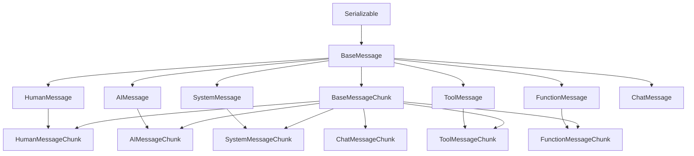
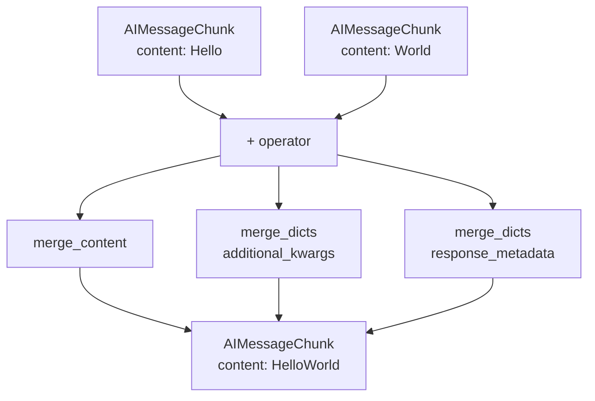
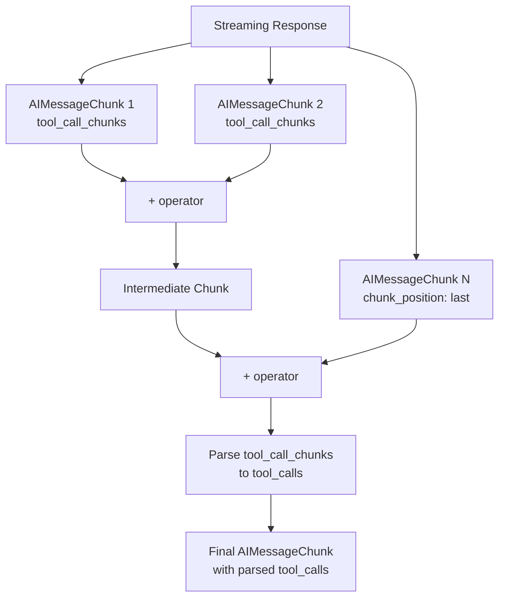

# Message Types & Base Classes

The Messages System in LangChain provides a structured framework for representing conversations between users, AI models, and tools. Messages are the fundamental objects used in prompts and chat conversations, serving as inputs and outputs for chat models. The system defines a hierarchy of message types built on abstract base classes, enabling type-safe communication patterns and supporting advanced features like tool calling, streaming, and multimodal content.

This document covers the core message types (`HumanMessage`, `AIMessage`, `SystemMessage`, `ToolMessage`, `FunctionMessage`), their base classes (`BaseMessage`, `BaseMessageChunk`), and the content block system that enables rich, structured message content including text, images, tool calls, and reasoning traces.

Sources: [__init__.py:1-2](../../../libs/core/langchain_core/messages/__init__.py#L1-L2), [base.py:1-20](../../../libs/core/langchain_core/messages/base.py#L1-L20)

## Architecture Overview

The message system is built on a hierarchical class structure with two primary base classes:



Sources: [base.py:67-157](../../../libs/core/langchain_core/messages/base.py#L67-L157), [base.py:271-328](../../../libs/core/langchain_core/messages/base.py#L271-L328)

## BaseMessage Class

`BaseMessage` is the abstract base class for all message types in LangChain. It provides core functionality for content management, serialization, and metadata handling.

### Core Fields

| Field | Type | Description |
|-------|------|-------------|
| `content` | `str \| list[str \| dict]` | The contents of the message, supporting both plain text and structured content blocks |
| `type` | `str` | Unique identifier for the message type (used for serialization/deserialization) |
| `additional_kwargs` | `dict` | Reserved for additional payload data (e.g., tool calls encoded by model providers) |
| `response_metadata` | `dict` | Metadata like response headers, logprobs, token counts, model name |
| `name` | `str \| None` | Optional human-readable name for the message |
| `id` | `str \| None` | Optional unique identifier, ideally provided by the model/provider |

Sources: [base.py:67-120](../../../libs/core/langchain_core/messages/base.py#L67-L120)

### Content Blocks Property

The `content_blocks` property provides a standardized way to access message content as typed `ContentBlock` objects. It handles multiple input formats including:

- Plain strings (converted to text blocks)
- Provider-specific formats (OpenAI, Anthropic, Google GenAI, Bedrock Converse)
- Legacy v0 multimodal formats
- Standard v1 content blocks

```python
@property
def content_blocks(self) -> list[types.ContentBlock]:
    blocks: list[types.ContentBlock] = []
    content = (
        [self.content]
        if isinstance(self.content, str) and self.content
        else self.content
    )
    for item in content:
        if isinstance(item, str):
            blocks.append({"type": "text", "text": item})
        elif isinstance(item, dict):
            item_type = item.get("type")
            if item_type not in types.KNOWN_BLOCK_TYPES:
                blocks.append({"type": "non_standard", "value": item})
            else:
                if "source_type" in item:
                    blocks.append({"type": "non_standard", "value": item})
                    continue
                blocks.append(cast("types.ContentBlock", item))
    # ... parsing steps for provider-specific formats
    return blocks
```

Sources: [base.py:143-200](../../../libs/core/langchain_core/messages/base.py#L143-L200)

### Text Access Pattern

The `text` property provides convenient access to text content, supporting both modern property access and legacy method calls through the `TextAccessor` class:

```python
@property
def text(self) -> TextAccessor:
    if isinstance(self.content, str):
        text_value = self.content
    else:
        blocks = [
            block
            for block in self.content
            if isinstance(block, str)
            or (block.get("type") == "text" and isinstance(block.get("text"), str))
        ]
        text_value = "".join(
            block if isinstance(block, str) else block["text"] for block in blocks
        )
    return TextAccessor(text_value)
```

The `TextAccessor` class maintains backward compatibility while deprecating method-style access:

Sources: [base.py:202-228](../../../libs/core/langchain_core/messages/base.py#L202-L228), [base.py:37-64](../../../libs/core/langchain_core/messages/base.py#L37-L64)

### Serialization Methods

`BaseMessage` provides methods for converting messages to and from dictionaries:

| Method | Purpose |
|--------|---------|
| `is_lc_serializable()` | Returns `True` to indicate serializability |
| `get_lc_namespace()` | Returns `["langchain", "schema", "messages"]` |
| `message_to_dict(message)` | Converts a message to `{"type": ..., "data": ...}` format |
| `messages_to_dict(messages)` | Converts a sequence of messages to a list of dicts |

Sources: [base.py:129-141](../../../libs/core/langchain_core/messages/base.py#L129-L141), [base.py:330-351](../../../libs/core/langchain_core/messages/base.py#L330-L351)

## BaseMessageChunk Class

`BaseMessageChunk` extends `BaseMessage` to support streaming scenarios where messages are yielded incrementally. The key feature is the ability to concatenate chunks using the `+` operator.

### Concatenation Behavior



The `__add__` method merges two chunks:

```python
def __add__(self, other: Any) -> BaseMessageChunk:
    if isinstance(other, BaseMessageChunk):
        return self.__class__(
            id=self.id,
            type=self.type,
            content=merge_content(self.content, other.content),
            additional_kwargs=merge_dicts(
                self.additional_kwargs, other.additional_kwargs
            ),
            response_metadata=merge_dicts(
                self.response_metadata, other.response_metadata
            ),
        )
```

Sources: [base.py:271-328](../../../libs/core/langchain_core/messages/base.py#L271-L328)

### Content Merging Logic

The `merge_content` function handles merging of string and list content:

- String + String → Concatenated string
- String + List → List with string prepended
- List + List → Merged lists using `merge_lists`
- List + String → String appended to last element if it's a string, otherwise added as new element

Sources: [base.py:230-269](../../../libs/core/langchain_core/messages/base.py#L230-L269)

## Message Type Hierarchy

### HumanMessage

Represents messages from the user to the model.

```python
class HumanMessage(BaseMessage):
    type: Literal["human"] = "human"
```

Example usage:
```python
from langchain_core.messages import HumanMessage, SystemMessage

messages = [
    SystemMessage(content="You are a helpful assistant! Your name is Bob."),
    HumanMessage(content="What is your name?"),
]
```

Sources: [human.py:1-61](../../../libs/core/langchain_core/messages/human.py#L1-L61)

### AIMessage

Represents responses from AI models, including tool calls and usage metadata.

#### Core Fields

| Field | Type | Description |
|-------|------|-------------|
| `tool_calls` | `list[ToolCall]` | Parsed tool calls associated with the message |
| `invalid_tool_calls` | `list[InvalidToolCall]` | Tool calls with parsing errors |
| `usage_metadata` | `UsageMetadata \| None` | Token usage information (input/output/total tokens) |
| `type` | `Literal["ai"]` | Message type identifier |

Sources: [ai.py:127-183](../../../libs/core/langchain_core/messages/ai.py#L127-L183)

#### Usage Metadata Structure

```python
class UsageMetadata(TypedDict):
    input_tokens: int
    output_tokens: int
    total_tokens: int
    input_token_details: NotRequired[InputTokenDetails]
    output_token_details: NotRequired[OutputTokenDetails]
```

`InputTokenDetails` can include:
- `audio`: Audio input tokens
- `cache_creation`: Tokens cached (cache miss)
- `cache_read`: Tokens read from cache (cache hit)

`OutputTokenDetails` can include:
- `audio`: Audio output tokens
- `reasoning`: Reasoning tokens (e.g., OpenAI o1 models)

Sources: [ai.py:25-119](../../../libs/core/langchain_core/messages/ai.py#L25-L119)

#### Content Blocks with Tool Calls

`AIMessage.content_blocks` automatically includes tool calls from the `tool_calls` field if they're not already in content:

```python
if self.tool_calls:
    content_tool_call_ids = {
        block.get("id")
        for block in self.content
        if isinstance(block, dict) and block.get("type") == "tool_call"
    }
    for tool_call in self.tool_calls:
        if (id_ := tool_call.get("id")) and id_ not in content_tool_call_ids:
            tool_call_block: types.ToolCall = {
                "type": "tool_call",
                "id": id_,
                "name": tool_call["name"],
                "args": tool_call["args"],
            }
            blocks.append(tool_call_block)
```

Sources: [ai.py:219-241](../../../libs/core/langchain_core/messages/ai.py#L219-L241)

### SystemMessage

Represents system messages for priming AI behavior, typically passed as the first message in a sequence.

```python
class SystemMessage(BaseMessage):
    type: Literal["system"] = "system"
```

Example:
```python
from langchain_core.messages import HumanMessage, SystemMessage

messages = [
    SystemMessage(content="You are a helpful assistant! Your name is Bob."),
    HumanMessage(content="What is your name?"),
]
```

Sources: [system.py:1-72](../../../libs/core/langchain_core/messages/system.py#L1-L72)

### ToolMessage

Represents the result of executing a tool, passed back to the model.

#### Core Fields

| Field | Type | Description |
|-------|------|-------------|
| `tool_call_id` | `str` | Associates response with the tool call request |
| `artifact` | `Any` | Full tool output (if different from content) |
| `status` | `Literal["success", "error"]` | Invocation status |
| `type` | `Literal["tool"]` | Message type identifier |

```python
class ToolMessage(BaseMessage, ToolOutputMixin):
    tool_call_id: str
    type: Literal["tool"] = "tool"
    artifact: Any = None
    status: Literal["success", "error"] = "success"
```

Example with artifact:
```python
tool_output = {
    "stdout": "From the graph we can see that the correlation between x and y is ...",
    "stderr": None,
    "artifacts": {"type": "image", "base64_data": "/9j/4gIcSU..."},
}

ToolMessage(
    content=tool_output["stdout"],
    artifact=tool_output,
    tool_call_id="call_Jja7J89XsjrOLA5r!MEOW!SL",
)
```

Sources: [tool.py:24-133](../../../libs/core/langchain_core/messages/tool.py#L24-L133)

### FunctionMessage

An older version of `ToolMessage` without the `tool_call_id` field. Used for legacy compatibility.

```python
class FunctionMessage(BaseMessage):
    name: str
    type: Literal["function"] = "function"
```

Sources: [function.py:1-45](../../../libs/core/langchain_core/messages/function.py#L1-L45)

## Tool Call Structures

### ToolCall TypedDict

Represents an AI's request to call a tool:

```python
class ToolCall(TypedDict):
    name: str  # Tool name
    args: dict[str, Any]  # Arguments as dictionary
    id: str | None  # Identifier for associating request/response
    type: NotRequired[Literal["tool_call"]]  # Discrimination field
```

Factory function for type-safe creation:
```python
def tool_call(*, name: str, args: dict[str, Any], id: str | None) -> ToolCall:
    return ToolCall(name=name, args=args, id=id, type="tool_call")
```

Sources: [tool.py:181-228](../../../libs/core/langchain_core/messages/tool.py#L181-L228)

### ToolCallChunk TypedDict

Represents a chunk of a tool call when streaming:

```python
class ToolCallChunk(TypedDict):
    name: str | None
    args: str | None  # JSON-parseable string (not parsed dict)
    id: str | None
    index: int | None  # Used for merging chunks
    type: NotRequired[Literal["tool_call_chunk"]]
```

Chunks are merged when their `index` values are equal and not `None`:

```python
left_chunks = [ToolCallChunk(name="foo", args='{"a":', index=0)]
right_chunks = [ToolCallChunk(name=None, args="1}", index=0)]

# Merging results in:
[ToolCallChunk(name="foo", args='{"a":1}', index=0)]
```

Sources: [tool.py:231-277](../../../libs/core/langchain_core/messages/tool.py#L231-L277)

### InvalidToolCall

Represents tool calls that failed to parse:

```python
def invalid_tool_call(
    *,
    name: str | None = None,
    args: str | None = None,
    id: str | None = None,
    error: str | None = None,
) -> InvalidToolCall:
    return InvalidToolCall(
        name=name, args=args, id=id, error=error, type="invalid_tool_call"
    )
```

Sources: [tool.py:280-302](../../../libs/core/langchain_core/messages/tool.py#L280-L302)

## AIMessageChunk Streaming

`AIMessageChunk` extends `AIMessage` with specialized streaming support, including tool call chunk aggregation and usage metadata accumulation.

### Chunk Aggregation Flow



### Tool Call Chunk Initialization

When an `AIMessageChunk` is created, it automatically initializes `tool_calls` from `tool_call_chunks`:

```python
@model_validator(mode="after")
def init_tool_calls(self) -> Self:
    if not self.tool_call_chunks:
        return self
    tool_calls = []
    invalid_tool_calls = []
    
    for chunk in self.tool_call_chunks:
        try:
            args_ = parse_partial_json(chunk["args"]) if chunk["args"] else {}
            if isinstance(args_, dict):
                tool_calls.append(
                    create_tool_call(
                        name=chunk["name"] or "",
                        args=args_,
                        id=chunk["id"],
                    )
                )
            else:
                # Add to invalid_tool_calls
        except Exception:
            # Add to invalid_tool_calls
```

Sources: [ai.py:338-398](../../../libs/core/langchain_core/messages/ai.py#L338-L398)

### Usage Metadata Accumulation

When adding `AIMessageChunk` objects, usage metadata is accumulated:

```python
def add_usage(left: UsageMetadata | None, right: UsageMetadata | None) -> UsageMetadata:
    if not (left or right):
        return UsageMetadata(input_tokens=0, output_tokens=0, total_tokens=0)
    if not (left and right):
        return cast("UsageMetadata", left or right)
    
    return UsageMetadata(
        **cast(
            "UsageMetadata",
            _dict_int_op(
                cast("dict", left),
                cast("dict", right),
                operator.add,
            ),
        )
    )
```

The system also supports subtracting usage metadata with `subtract_usage`, using `max(left - right, 0)` to prevent negative token counts.

Sources: [ai.py:501-588](../../../libs/core/langchain_core/messages/ai.py#L501-L588)

### Chunk ID Selection

When merging chunks, the system selects the best ID based on a ranking system:

| Rank | ID Type | Description |
|------|---------|-------------|
| 2 | Provider-assigned | IDs not starting with `lc_*` or `lc_run-*` |
| 1 | `lc_run-*` IDs | LangChain run identifiers |
| 0 | `lc_*` and others | Auto-generated LangChain IDs |

Sources: [ai.py:479-497](../../../libs/core/langchain_core/messages/ai.py#L479-L497)

## Tool Parsing Utilities

### Default Tool Parser

Parses raw tool call dictionaries (typically from OpenAI format) into `ToolCall` and `InvalidToolCall` objects:

```python
def default_tool_parser(
    raw_tool_calls: list[dict],
) -> tuple[list[ToolCall], list[InvalidToolCall]]:
    tool_calls = []
    invalid_tool_calls = []
    for raw_tool_call in raw_tool_calls:
        if "function" not in raw_tool_call:
            continue
        function_name = raw_tool_call["function"]["name"]
        try:
            function_args = json.loads(raw_tool_call["function"]["arguments"])
            parsed = tool_call(
                name=function_name or "",
                args=function_args or {},
                id=raw_tool_call.get("id"),
            )
            tool_calls.append(parsed)
        except json.JSONDecodeError:
            invalid_tool_calls.append(
                invalid_tool_call(
                    name=function_name,
                    args=raw_tool_call["function"]["arguments"],
                    id=raw_tool_call.get("id"),
                    error=None,
                )
            )
    return tool_calls, invalid_tool_calls
```

Sources: [tool.py:305-337](../../../libs/core/langchain_core/messages/tool.py#L305-L337)

### Default Tool Chunk Parser

Parses raw tool call chunks for streaming scenarios:

```python
def default_tool_chunk_parser(raw_tool_calls: list[dict]) -> list[ToolCallChunk]:
    tool_call_chunks = []
    for tool_call in raw_tool_calls:
        if "function" not in tool_call:
            function_args = None
            function_name = None
        else:
            function_args = tool_call["function"]["arguments"]
            function_name = tool_call["function"]["name"]
        parsed = tool_call_chunk(
            name=function_name,
            args=function_args,
            id=tool_call.get("id"),
            index=tool_call.get("index"),
        )
        tool_call_chunks.append(parsed)
    return tool_call_chunks
```

Sources: [tool.py:340-359](../../../libs/core/langchain_core/messages/tool.py#L340-L359)

## Message Chunk Concatenation

### ToolMessageChunk

`ToolMessageChunk` validates that chunks have matching `tool_call_id` values before merging:

```python
def __add__(self, other: Any) -> BaseMessageChunk:
    if isinstance(other, ToolMessageChunk):
        if self.tool_call_id != other.tool_call_id:
            msg = "Cannot concatenate ToolMessageChunks with different names."
            raise ValueError(msg)
        
        return self.__class__(
            tool_call_id=self.tool_call_id,
            content=merge_content(self.content, other.content),
            artifact=merge_obj(self.artifact, other.artifact),
            additional_kwargs=merge_dicts(
                self.additional_kwargs, other.additional_kwargs
            ),
            response_metadata=merge_dicts(
                self.response_metadata, other.response_metadata
            ),
            id=self.id,
            status=_merge_status(self.status, other.status),
        )
```

Status merging returns `"error"` if either chunk has error status, otherwise `"success"`.

Sources: [tool.py:149-177](../../../libs/core/langchain_core/messages/tool.py#L149-L177)

### FunctionMessageChunk

Similar to `ToolMessageChunk`, validates matching `name` fields:

```python
def __add__(self, other: Any) -> BaseMessageChunk:
    if isinstance(other, FunctionMessageChunk):
        if self.name != other.name:
            msg = "Cannot concatenate FunctionMessageChunks with different names."
            raise ValueError(msg)
        
        return self.__class__(
            name=self.name,
            content=merge_content(self.content, other.content),
            additional_kwargs=merge_dicts(
                self.additional_kwargs, other.additional_kwargs
            ),
            response_metadata=merge_dicts(
                self.response_metadata, other.response_metadata
            ),
            id=self.id,
        )
```

Sources: [function.py:31-57](../../../libs/core/langchain_core/messages/function.py#L31-L57)

## Reasoning Content Extraction

The system can extract reasoning content from `additional_kwargs` for models that support chain-of-thought reasoning:

```python
def _extract_reasoning_from_additional_kwargs(
    message: BaseMessage,
) -> types.ReasoningContentBlock | None:
    additional_kwargs = getattr(message, "additional_kwargs", {})
    
    reasoning_content = additional_kwargs.get("reasoning_content")
    if reasoning_content is not None and isinstance(reasoning_content, str):
        return {"type": "reasoning", "reasoning": reasoning_content}
    
    return None
```

This is used by `AIMessage.content_blocks` and `AIMessageChunk.content_blocks` to automatically include reasoning blocks at the start of the content block list.

Sources: [base.py:17-35](../../../libs/core/langchain_core/messages/base.py#L17-L35), [ai.py:243-249](../../../libs/core/langchain_core/messages/ai.py#L243-L249)

## Summary

The LangChain Messages System provides a comprehensive, type-safe framework for representing conversational interactions. The base classes (`BaseMessage`, `BaseMessageChunk`) establish core functionality for content management, serialization, and streaming support, while specialized message types (`HumanMessage`, `AIMessage`, `SystemMessage`, `ToolMessage`, `FunctionMessage`) handle specific roles in the conversation flow.

Key features include:
- **Flexible content representation** supporting both plain text and structured content blocks
- **Tool calling support** with parsed tool calls, invalid tool call tracking, and streaming chunks
- **Usage metadata tracking** for token consumption monitoring across streaming responses
- **Backward compatibility** through `TextAccessor` and support for legacy message formats
- **Provider-agnostic content blocks** with automatic translation from provider-specific formats
- **Streaming-first design** with chunk concatenation and incremental parsing

This architecture enables LangChain to support complex conversational patterns including multi-turn dialogues, parallel tool calls, multimodal content, and reasoning traces while maintaining type safety and extensibility.

Sources: [__init__.py:1-120](../../../libs/core/langchain_core/messages/__init__.py#L1-L120), [base.py:1-351](../../../libs/core/langchain_core/messages/base.py#L1-L351), [ai.py:1-588](../../../libs/core/langchain_core/messages/ai.py#L1-L588), [tool.py:1-362](../../../libs/core/langchain_core/messages/tool.py#L1-L362)