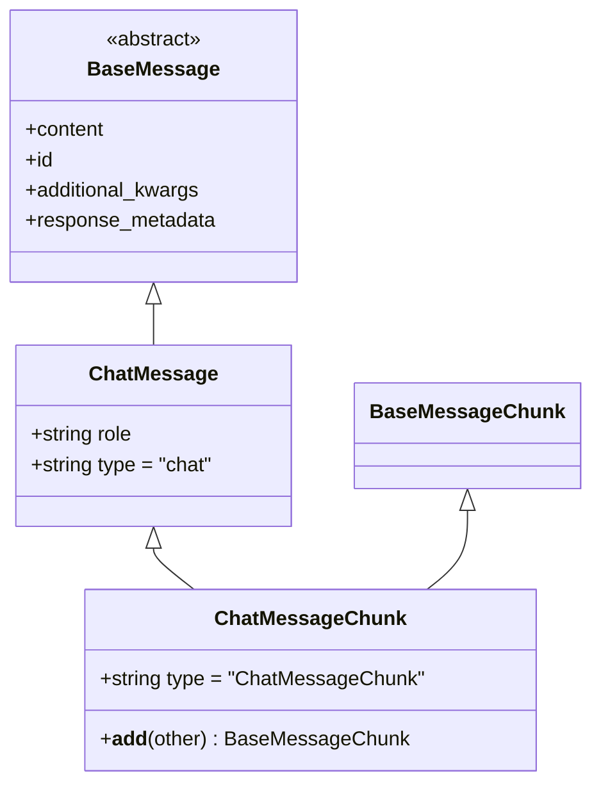
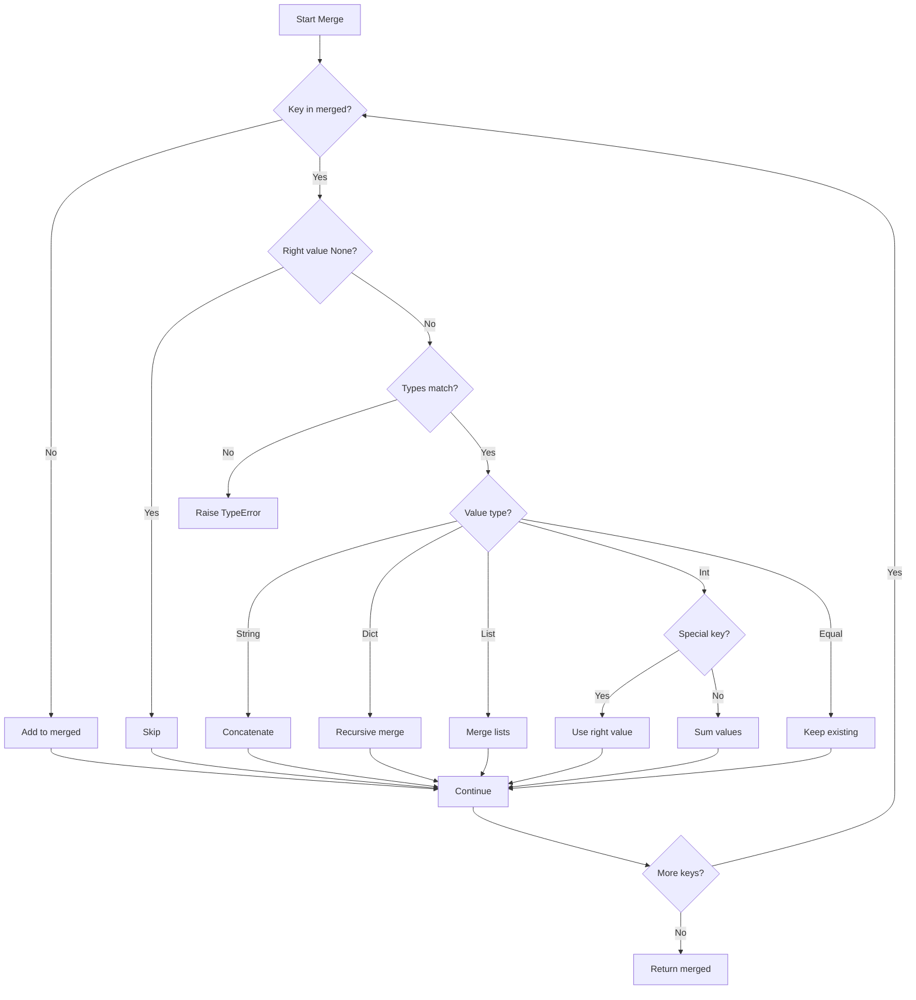
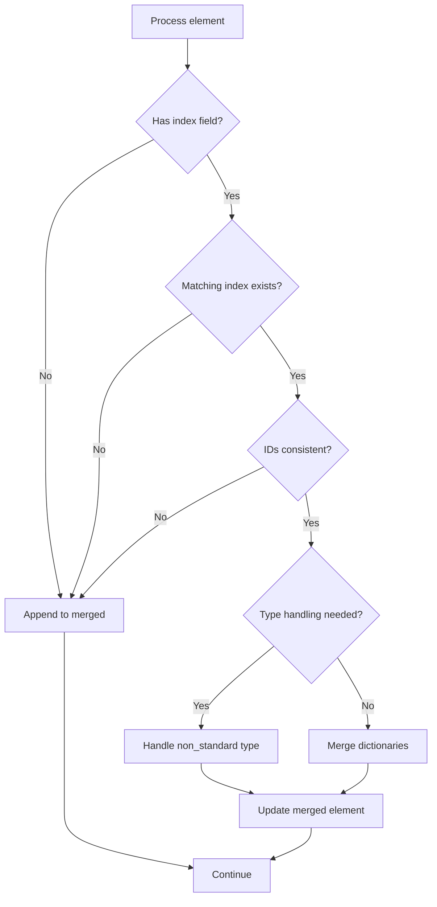
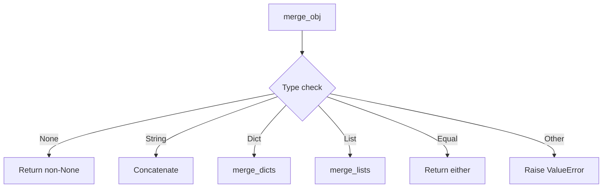
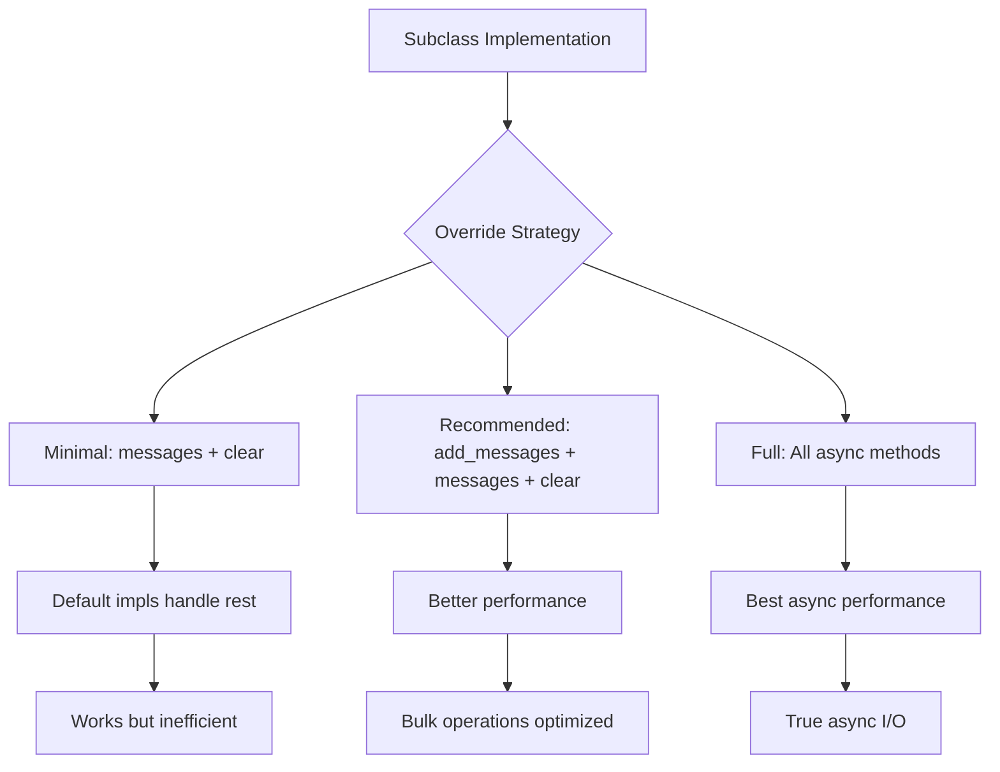
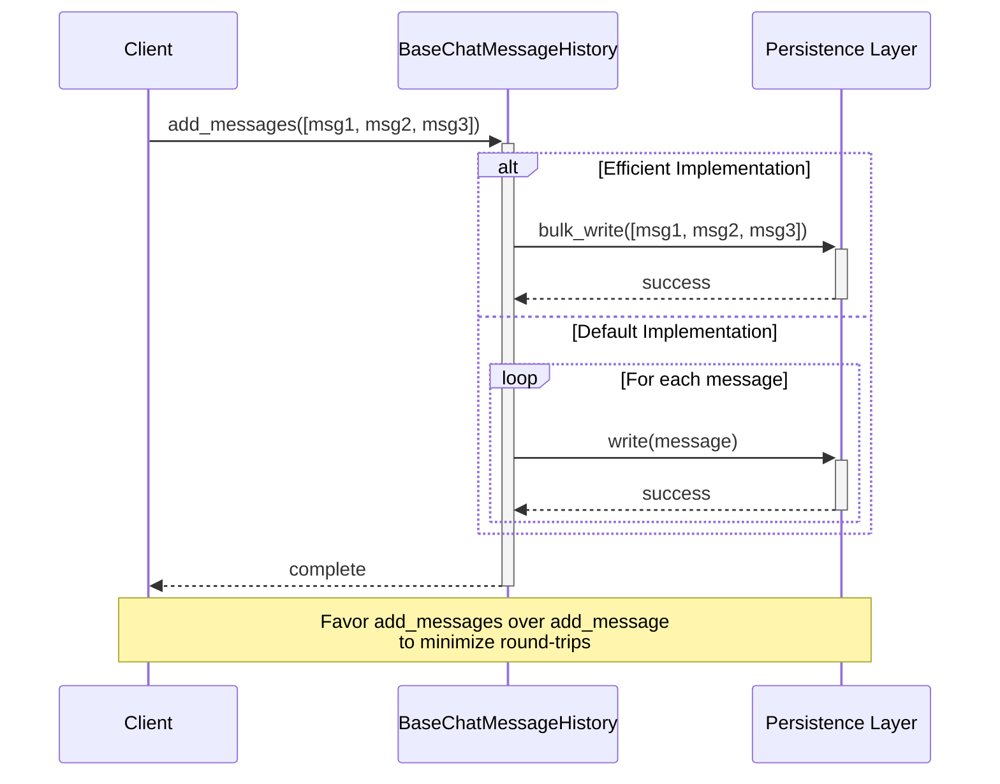

# Message Utilities & Modifiers

## Introduction

The Message Utilities & Modifiers system in LangChain provides essential functionality for manipulating, merging, and managing chat messages within LLM-powered applications. This system includes specialized message types for controlling message history, utilities for merging message content and metadata, and base abstractions for storing and retrieving chat message histories. These components work together to enable sophisticated conversation management, including the ability to remove messages from history, merge streaming message chunks, and maintain persistent chat sessions across different storage backends.

The system is primarily implemented in the `langchain_core` package and consists of three main areas: modifier messages (like `RemoveMessage`), chat message types with chunk merging capabilities, and the foundational chat history abstractions that define how messages are stored and retrieved.

Sources: [modifier.py](../../../libs/core/langchain_core/messages/modifier.py), [chat.py](../../../libs/core/langchain_core/messages/chat.py), [chat_history.py](../../../libs/core/langchain_core/chat_history.py)

## Message Modifier Types

### RemoveMessage

The `RemoveMessage` class is a specialized message type designed to signal the deletion of other messages from chat history. Unlike standard message types that carry conversational content, `RemoveMessage` serves a purely operational purpose in message management.

**Key Characteristics:**

| Property | Value | Description |
|----------|-------|-------------|
| Type | `"remove"` | Literal type used for serialization |
| Content | Not Supported | Raises `ValueError` if content is provided |
| Required Field | `id` | The ID of the message to remove |

The `RemoveMessage` constructor explicitly prevents content from being passed, enforcing its role as a control message rather than a content-bearing message. When initialized, it passes an empty string as content to the parent `BaseMessage` class while storing the target message ID.

```python
def __init__(
    self,
    id: str,
    **kwargs: Any,
) -> None:
    """Create a RemoveMessage.

    Args:
        id: The ID of the message to remove.
        **kwargs: Additional fields to pass to the message.

    Raises:
        ValueError: If the 'content' field is passed in kwargs.

    """
    if kwargs.pop("content", None):
        msg = "RemoveMessage does not support 'content' field."
        raise ValueError(msg)

    super().__init__("", id=id, **kwargs)
```

Sources: [modifier.py:1-34](../../../libs/core/langchain_core/messages/modifier.py#L1-L34)

## Chat Message Types

### ChatMessage and ChatMessageChunk

The chat message system includes two related classes: `ChatMessage` for complete messages and `ChatMessageChunk` for streaming message fragments that can be merged together.

#### ChatMessage

`ChatMessage` is a flexible message type that allows arbitrary speaker roles to be assigned, making it suitable for multi-party conversations beyond the typical human-AI interaction pattern.

**Structure:**



Sources: [chat.py:12-19](../../../libs/core/langchain_core/messages/chat.py#L12-L19)

#### ChatMessageChunk Merging

`ChatMessageChunk` extends `ChatMessage` with the ability to concatenate chunks using the `+` operator. The merging logic handles different scenarios:

1. **Same Type Merging**: When adding two `ChatMessageChunk` instances with the same role
2. **Base Type Merging**: When adding a generic `BaseMessageChunk` to a `ChatMessageChunk`
3. **Role Validation**: Prevents merging chunks with different roles

The merge operation combines:
- Content using `merge_content()`
- Additional kwargs using `merge_dicts()`
- Response metadata using `merge_dicts()`
- Preserves the ID from the first chunk

```python
@override
def __add__(self, other: Any) -> BaseMessageChunk:
    if isinstance(other, ChatMessageChunk):
        if self.role != other.role:
            msg = "Cannot concatenate ChatMessageChunks with different roles."
            raise ValueError(msg)

        return self.__class__(
            role=self.role,
            content=merge_content(self.content, other.content),
            additional_kwargs=merge_dicts(
                self.additional_kwargs, other.additional_kwargs
            ),
            response_metadata=merge_dicts(
                self.response_metadata, other.response_metadata
            ),
            id=self.id,
        )
```

Sources: [chat.py:22-60](../../../libs/core/langchain_core/messages/chat.py#L22-L60)

## Merge Utilities

### Dictionary Merging

The `merge_dicts` function provides sophisticated merging logic for combining metadata and additional keyword arguments from multiple message chunks. It handles various data types and special cases.

**Merge Flow:**



**Special Handling Rules:**

| Data Type | Behavior | Special Cases |
|-----------|----------|---------------|
| String | Concatenate values | Skip for `index` (if starts with "lc_"), `id`, `output_version`, `model_provider` (if equal) |
| Dictionary | Recursive merge | Uses `merge_dicts` recursively |
| List | Element-wise merge | Uses `merge_lists` with index matching |
| Integer | Sum values | Last-wins for `index`, `created`, `timestamp` |
| None | Use non-None value | Right value takes precedence if left is None |

Sources: [_merge.py:6-84](../../../libs/core/langchain_core/utils/_merge.py#L6-L84)

### List Merging

The `merge_lists` function handles merging of list-type metadata, with special logic for indexed elements commonly found in tool calls and function invocations.

**Index-Based Merging:**

The function identifies list elements with an `index` field and merges elements with matching indices rather than simply appending. This is crucial for streaming tool calls where multiple chunks contribute to the same tool invocation.



**Matching Criteria:**

Elements are considered for merging when:
1. Both have an `index` field
2. Index values match (integer or string starting with "lc_")
3. IDs are consistent (both empty/None, or equal)

Sources: [_merge.py:87-152](../../../libs/core/langchain_core/utils/_merge.py#L87-L152)

### Generic Object Merging

The `merge_obj` function provides a high-level interface for merging two objects of any supported type. It delegates to specialized merge functions based on the object types.

**Supported Types:**



The function enforces type consistency, raising a `TypeError` if the left and right objects have different types (excluding None), ensuring type safety during merge operations.

Sources: [_merge.py:155-188](../../../libs/core/langchain_core/utils/_merge.py#L155-L188)

## Chat Message History

### BaseChatMessageHistory

The `BaseChatMessageHistory` abstract base class defines the interface for storing and retrieving chat message histories across different persistence backends. It provides both synchronous and asynchronous methods for all operations.

**Core Interface:**

| Method | Type | Purpose | Default Implementation |
|--------|------|---------|----------------------|
| `messages` | Property | Get all messages | Must be implemented by subclass |
| `aget_messages()` | Async | Get messages asynchronously | Calls sync version in executor |
| `add_message()` | Sync | Add single message | Delegates to `add_messages` if available |
| `add_messages()` | Sync | Add multiple messages | Calls `add_message` for each |
| `aadd_messages()` | Async | Add messages asynchronously | Calls sync version in executor |
| `clear()` | Sync | Remove all messages | Must be implemented by subclass |
| `aclear()` | Async | Clear asynchronously | Calls sync version in executor |

**Implementation Strategy:**



**Convenience Methods:**

The class provides `add_user_message()` and `add_ai_message()` convenience methods, though the documentation notes these may be deprecated in favor of the bulk `add_messages()` interface to reduce round-trips to the persistence layer.

Sources: [chat_history.py:18-139](../../../libs/core/langchain_core/chat_history.py#L18-L139)

### InMemoryChatMessageHistory

`InMemoryChatMessageHistory` provides a simple in-memory implementation of chat message history, suitable for testing, prototyping, or scenarios where persistence is not required.

**Implementation Details:**

```python
class InMemoryChatMessageHistory(BaseChatMessageHistory, BaseModel):
    """In memory implementation of chat message history.

    Stores messages in a memory list.
    """

    messages: list[BaseMessage] = Field(default_factory=list)
    """A list of messages stored in memory."""
```

**Method Implementations:**

| Method | Implementation | Notes |
|--------|---------------|-------|
| `messages` | Direct field access | Pydantic field with default factory |
| `aget_messages()` | Returns `self.messages` | Synchronous despite async signature |
| `add_message()` | Appends to list | Simple list append operation |
| `aadd_messages()` | Calls `add_messages()` | Delegates to sync version |
| `clear()` | Resets to empty list | `self.messages = []` |
| `aclear()` | Calls `clear()` | Delegates to sync version |

This implementation demonstrates the minimal overhead approach, where async methods simply delegate to their synchronous counterparts since no I/O operations are involved.

Sources: [chat_history.py:142-179](../../../libs/core/langchain_core/chat_history.py#L142-L179)

### Usage Patterns

**Sequence Diagram for Message Addition:**



The documentation emphasizes that users should favor `add_messages()` over individual message addition methods to avoid unnecessary round-trips to the underlying persistence layer, particularly important for remote storage backends.

Sources: [chat_history.py:18-139](../../../libs/core/langchain_core/chat_history.py#L18-L139)

## Summary

The Message Utilities & Modifiers system provides a comprehensive framework for managing chat messages in LangChain applications. The `RemoveMessage` type enables explicit message deletion from history, while `ChatMessage` and `ChatMessageChunk` support flexible role-based messaging with sophisticated chunk merging capabilities. The merge utilities (`merge_dicts`, `merge_lists`, `merge_obj`) handle the complex task of combining streaming message fragments while preserving metadata integrity and handling special cases like indexed tool calls. Finally, the `BaseChatMessageHistory` abstraction and its in-memory implementation provide a flexible foundation for building persistence backends, with careful attention to both synchronous and asynchronous usage patterns. Together, these components enable robust conversation management, streaming message handling, and flexible storage options for LLM-powered applications.

Sources: [modifier.py](../../../libs/core/langchain_core/messages/modifier.py), [chat.py](../../../libs/core/langchain_core/messages/chat.py), [_merge.py](../../../libs/core/langchain_core/utils/_merge.py), [chat_history.py](../../../libs/core/langchain_core/chat_history.py)