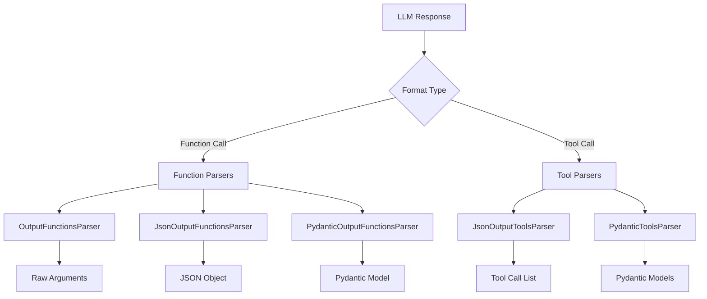
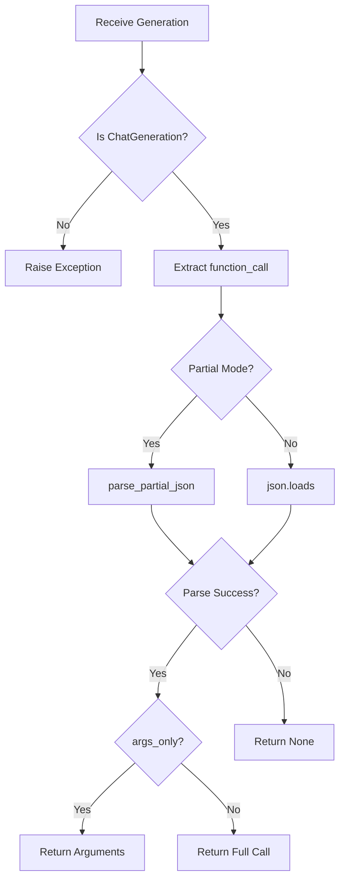
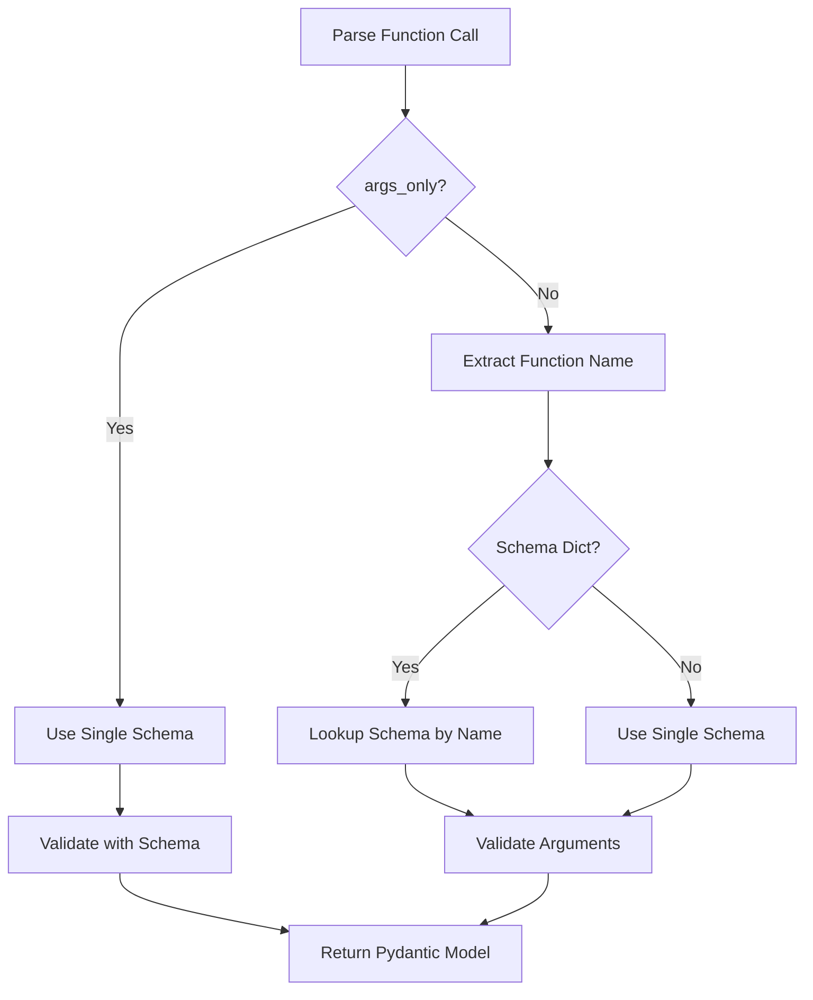
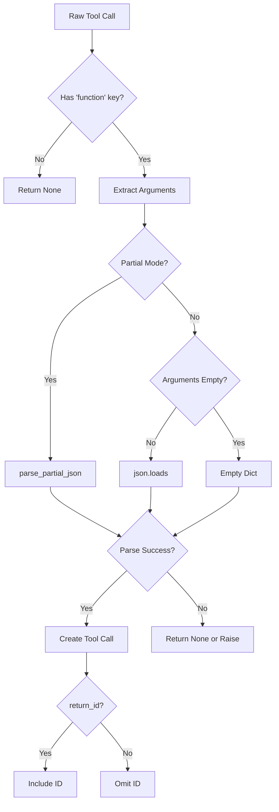
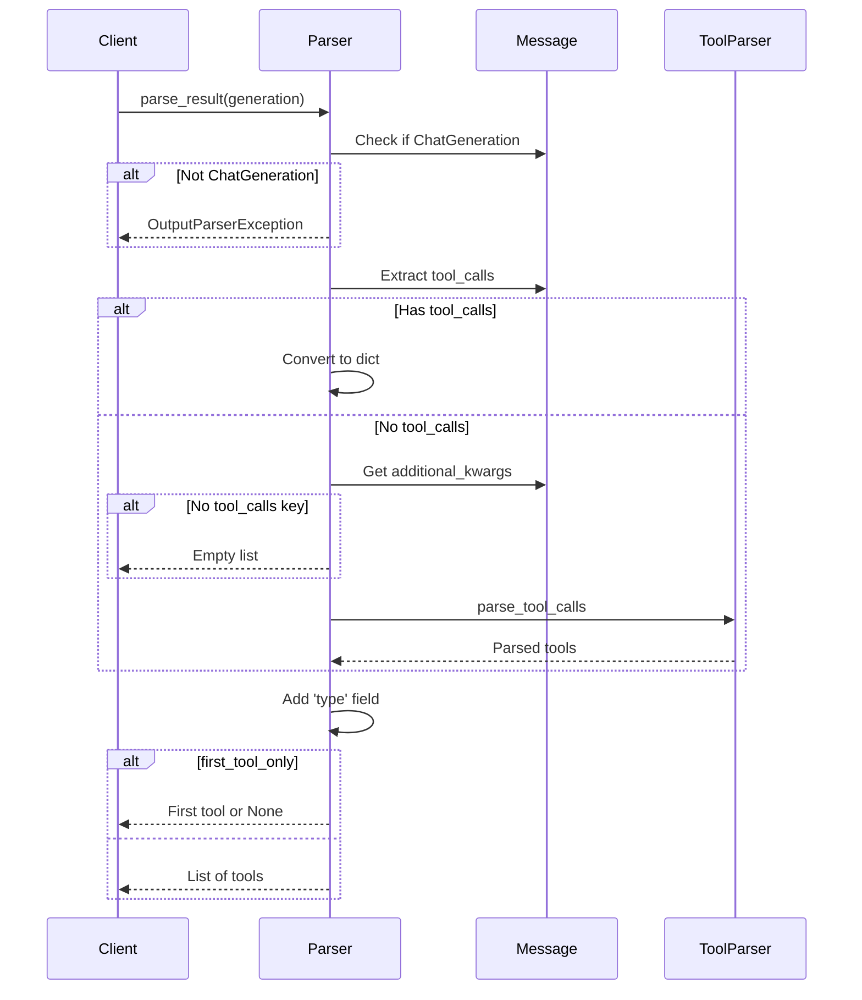
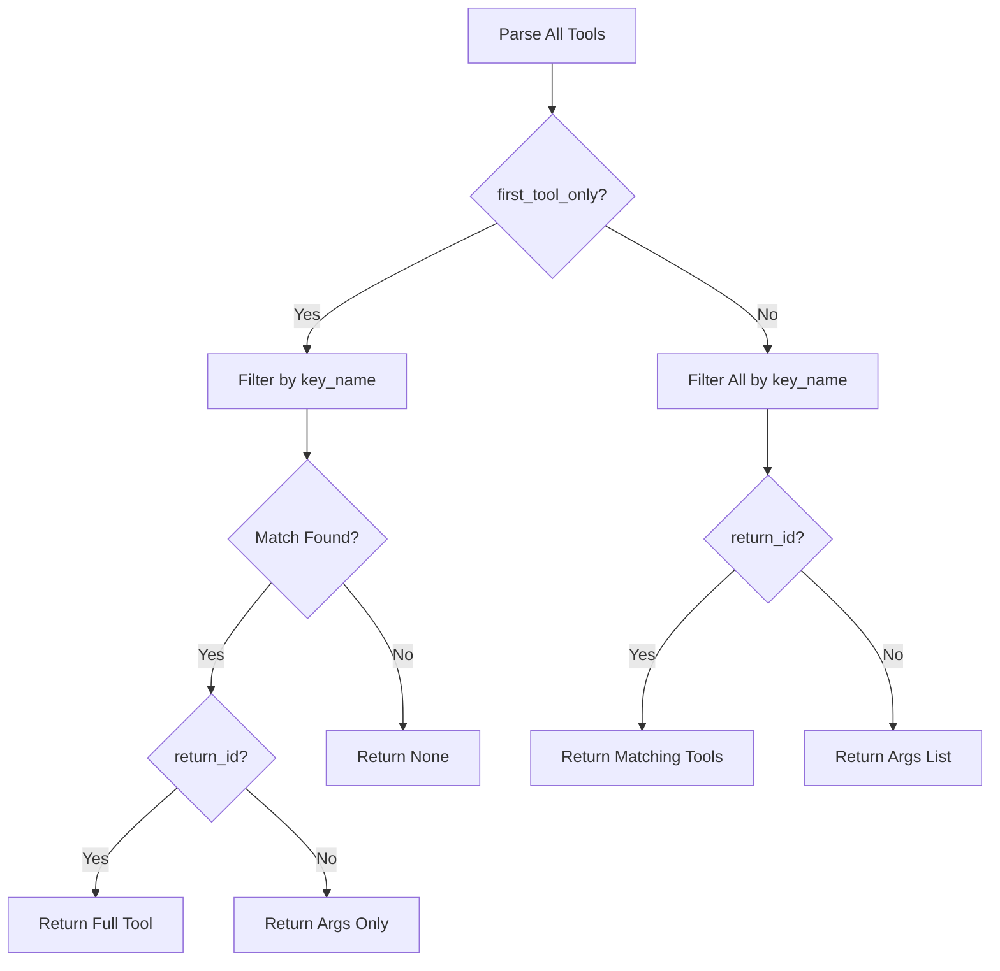
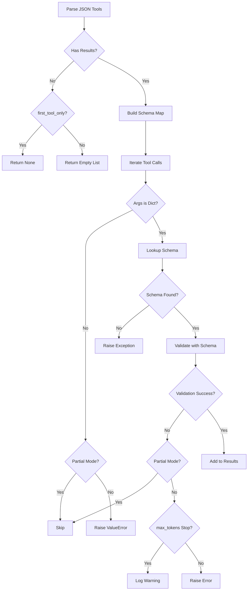
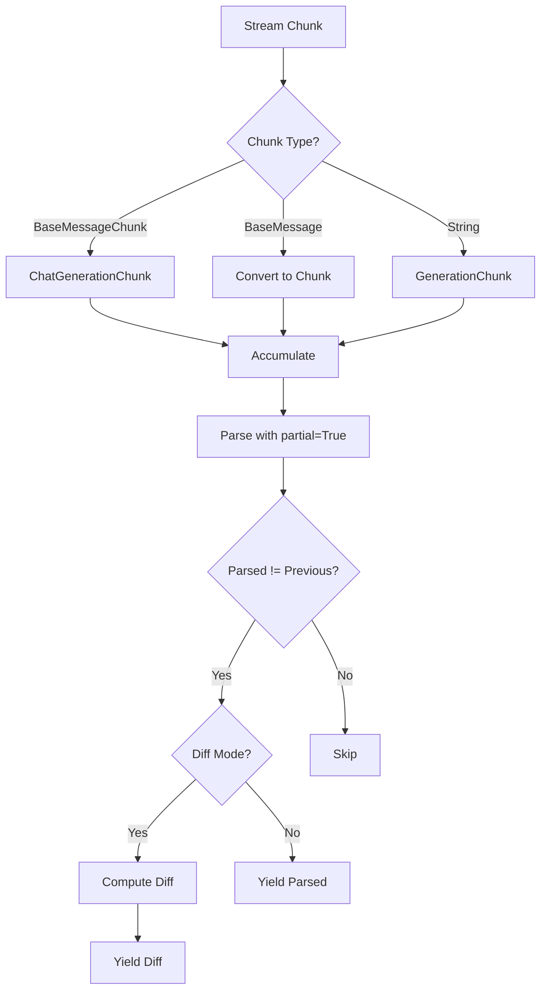
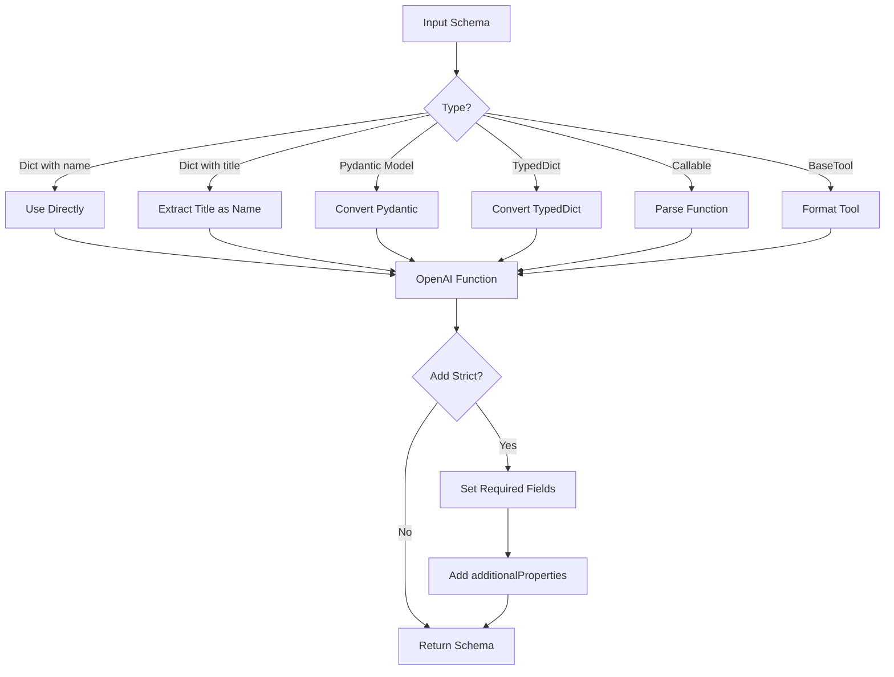

# OpenAI Function & Tool Output Parsers

The OpenAI Function & Tool Output Parsers module provides a comprehensive suite of parsers designed to extract and transform structured data from Large Language Model (LLM) responses that conform to OpenAI's function-calling and tool-calling APIs. These parsers handle the conversion of raw LLM outputs—specifically those containing function calls or tool invocations—into usable Python objects, JSON structures, or Pydantic models. The module supports both legacy OpenAI function-calling format and the newer tool-calling format, enabling seamless integration with chat models that support structured outputs.

This module is part of LangChain's core output parsing framework and extends base classes like `BaseGenerationOutputParser` and `BaseCumulativeTransformOutputParser` to provide streaming and incremental parsing capabilities. It handles edge cases such as partial JSON parsing during streaming, validation errors, and multiple tool calls in a single response.

Sources: [openai_functions.py:1-10](../../../libs/core/langchain_core/output_parsers/openai_functions.py#L1-L10), [openai_tools.py:1-10](../../../libs/core/langchain_core/output_parsers/openai_tools.py#L1-L10)

## Architecture Overview

The output parsers are organized into two primary categories based on the OpenAI API format they support:

1. **Function Output Parsers** (`openai_functions.py`) - Handle the legacy OpenAI function-calling format
2. **Tool Output Parsers** (`openai_tools.py`) - Handle the modern OpenAI tool-calling format

Both categories share common architectural patterns, including support for streaming, partial parsing, and Pydantic model validation.



Sources: [openai_functions.py:1-303](../../../libs/core/langchain_core/output_parsers/openai_functions.py#L1-L303), [openai_tools.py:1-290](../../../libs/core/langchain_core/output_parsers/openai_tools.py#L1-L290)

## Base Parser Classes

The output parsers inherit from two primary base classes that provide streaming and transformation capabilities:

| Base Class | Purpose | Key Features |
|------------|---------|--------------|
| `BaseGenerationOutputParser` | Parse complete generations | Single-pass parsing of full outputs |
| `BaseCumulativeTransformOutputParser` | Parse streaming chunks | Incremental parsing with diff support |

The `BaseCumulativeTransformOutputParser` provides critical streaming functionality through its `_transform` and `_atransform` methods, which accumulate chunks and parse partial results. The `diff` property controls whether parsers yield incremental changes or complete parsed outputs.

Sources: [transform.py:18-35](../../../libs/core/langchain_core/output_parsers/transform.py#L18-L35), [transform.py:73-100](../../../libs/core/langchain_core/output_parsers/transform.py#L73-L100)

## OpenAI Function Output Parsers

### OutputFunctionsParser

The `OutputFunctionsParser` is the simplest parser for OpenAI function calls, extracting raw function call data from chat generation messages.

**Key Properties:**
- `args_only` (bool): Whether to return only the function arguments (default: `True`)

**Behavior:**
- Extracts `function_call` from `message.additional_kwargs`
- Returns either the arguments string or the complete function call object
- Raises `OutputParserException` if used with non-chat generations

```python
def parse_result(self, result: list[Generation], *, partial: bool = False) -> Any:
    generation = result[0]
    if not isinstance(generation, ChatGeneration):
        msg = "This output parser can only be used with a chat generation."
        raise OutputParserException(msg)
    message = generation.message
    try:
        func_call = copy.deepcopy(message.additional_kwargs["function_call"])
    except KeyError as exc:
        msg = f"Could not parse function call: {exc}"
        raise OutputParserException(msg) from exc

    if self.args_only:
        return func_call["arguments"]
    return func_call
```

Sources: [openai_functions.py:20-50](../../../libs/core/langchain_core/output_parsers/openai_functions.py#L20-L50)

### JsonOutputFunctionsParser

The `JsonOutputFunctionsParser` extends the base parser with JSON parsing capabilities, supporting both complete and partial JSON parsing for streaming scenarios.

**Key Properties:**

| Property | Type | Default | Description |
|----------|------|---------|-------------|
| `strict` | bool | False | Allow non-JSON-compliant strings (unicode, newlines) |
| `args_only` | bool | True | Return only arguments vs. full function call |

**Parsing Flow:**



The parser uses `parse_partial_json` from `langchain_core.output_parsers.json` to handle incomplete JSON during streaming, and implements the `_diff` method using `jsonpatch` to compute incremental changes between parsed states.

Sources: [openai_functions.py:53-117](../../../libs/core/langchain_core/output_parsers/openai_functions.py#L53-L117)

### JsonKeyOutputFunctionsParser

This specialized parser extracts a specific key from the parsed JSON output, useful when only a subset of the function call data is needed.

**Key Property:**
- `key_name` (str): The name of the key to extract from the parsed JSON

**Implementation:**
```python
def parse_result(self, result: list[Generation], *, partial: bool = False) -> Any:
    res = super().parse_result(result, partial=partial)
    if partial and res is None:
        return None
    return res.get(self.key_name) if partial else res[self.key_name]
```

Sources: [openai_functions.py:127-145](../../../libs/core/langchain_core/output_parsers/openai_functions.py#L127-L145)

### PydanticOutputFunctionsParser

The `PydanticOutputFunctionsParser` validates and transforms function call arguments into Pydantic model instances, supporting both single and multiple schema definitions.

**Key Properties:**
- `pydantic_schema`: Either a single Pydantic model class or a dictionary mapping function names to model classes

**Schema Validation:**

The parser includes a `model_validator` that automatically sets `args_only` based on the schema type:

```python
@model_validator(mode="before")
@classmethod
def validate_schema(cls, values: dict[str, Any]) -> Any:
    schema = values["pydantic_schema"]
    if "args_only" not in values:
        values["args_only"] = (
            isinstance(schema, type)
            and not isinstance(schema, GenericAlias)
            and issubclass(schema, BaseModel)
        )
    elif values["args_only"] and isinstance(schema, dict):
        msg = (
            "If multiple pydantic schemas are provided then args_only should be"
            " False."
        )
        raise ValueError(msg)
    return values
```

**Multi-Schema Support:**

When a dictionary of schemas is provided, the parser uses the function name to determine which schema to apply:



The parser supports both Pydantic v1 (`parse_raw`) and v2 (`model_validate_json`) APIs for backward compatibility.

Sources: [openai_functions.py:148-246](../../../libs/core/langchain_core/output_parsers/openai_functions.py#L148-L246)

### PydanticAttrOutputFunctionsParser

This parser extends `PydanticOutputFunctionsParser` to extract a specific attribute from the parsed Pydantic model.

**Key Property:**
- `attr_name` (str): The name of the attribute to return from the Pydantic model

**Usage Example:**
```python
def parse_result(self, result: list[Generation], *, partial: bool = False) -> Any:
    result = super().parse_result(result)
    return getattr(result, self.attr_name)
```

Sources: [openai_functions.py:249-267](../../../libs/core/langchain_core/output_parsers/openai_functions.py#L249-L267)

## OpenAI Tool Output Parsers

### Tool Call Parsing Functions

The module provides utility functions for parsing individual and multiple tool calls:

**parse_tool_call:**

| Parameter | Type | Default | Description |
|-----------|------|---------|-------------|
| `raw_tool_call` | dict | - | Raw tool call from LLM response |
| `partial` | bool | False | Whether to parse partial JSON |
| `strict` | bool | False | Allow non-JSON-compliant strings |
| `return_id` | bool | True | Whether to include tool call ID |

**Parsing Logic:**



**Error Handling:**

The `make_invalid_tool_call` function creates `InvalidToolCall` instances when parsing fails, preserving error context:

```python
def make_invalid_tool_call(
    raw_tool_call: dict[str, Any],
    error_msg: str | None,
) -> InvalidToolCall:
    return invalid_tool_call(
        name=raw_tool_call["function"]["name"],
        args=raw_tool_call["function"]["arguments"],
        id=raw_tool_call.get("id"),
        error=error_msg,
    )
```

Sources: [openai_tools.py:23-98](../../../libs/core/langchain_core/output_parsers/openai_tools.py#L23-L98), [openai_tools.py:101-117](../../../libs/core/langchain_core/output_parsers/openai_tools.py#L101-L117)

### JsonOutputToolsParser

The `JsonOutputToolsParser` extracts and parses tool calls from OpenAI chat responses, supporting multiple tool invocations in a single response.

**Key Properties:**

| Property | Type | Default | Description |
|----------|------|---------|-------------|
| `strict` | bool | False | Allow non-JSON-compliant strings |
| `return_id` | bool | False | Include tool call IDs in output |
| `first_tool_only` | bool | False | Return only the first tool call |

**Parsing Sequence:**



**Backward Compatibility:**

The parser maintains backward compatibility by converting the `name` field to `type`:

```python
# for backwards compatibility
for tc in tool_calls:
    tc["type"] = tc.pop("name")
```

Sources: [openai_tools.py:120-177](../../../libs/core/langchain_core/output_parsers/openai_tools.py#L120-L177)

### JsonOutputKeyToolsParser

This specialized parser filters tool calls by a specific tool name, useful when multiple tools are available but only specific ones are of interest.

**Key Property:**
- `key_name` (str): The type/name of tools to filter and return

**Filtering Logic:**



The parser handles both single tool extraction (when `first_tool_only=True`) and multiple matching tools, with optional ID inclusion.

Sources: [openai_tools.py:180-235](../../../libs/core/langchain_core/output_parsers/openai_tools.py#L180-L235)

### PydanticToolsParser

The `PydanticToolsParser` validates tool call arguments against Pydantic schemas and returns validated model instances.

**Key Properties:**
- `tools`: List of Pydantic model classes that define the expected tool schemas

**Schema Resolution:**

The parser builds name-to-schema mappings supporting both Pydantic v1 and v2:

```python
name_dict_v2: dict[str, TypeBaseModel] = {
    tool.model_config.get("title") or tool.__name__: tool
    for tool in self.tools
    if is_pydantic_v2_subclass(tool)
}
name_dict_v1: dict[str, TypeBaseModel] = {
    tool.__name__: tool for tool in self.tools if is_pydantic_v1_subclass(tool)
}
name_dict: dict[str, TypeBaseModel] = {**name_dict_v2, **name_dict_v1}
```

**Validation Flow:**



**Error Handling for Token Limits:**

The parser includes special handling for `max_tokens` stop reasons, logging a helpful error message:

```python
has_max_tokens_stop_reason = any(
    generation.message.response_metadata.get("stop_reason")
    == "max_tokens"
    for generation in result
    if isinstance(generation, ChatGeneration)
)
if has_max_tokens_stop_reason:
    logger.exception(_MAX_TOKENS_ERROR)
```

Sources: [openai_tools.py:238-290](../../../libs/core/langchain_core/output_parsers/openai_tools.py#L238-L290), [openai_tools.py:11-16](../../../libs/core/langchain_core/output_parsers/openai_tools.py#L11-L16)

## Streaming and Partial Parsing

All cumulative transform parsers support streaming through the `BaseCumulativeTransformOutputParser` base class, which provides both synchronous and asynchronous transformation methods.

### Streaming Architecture



**Accumulation Logic:**

The transform methods accumulate chunks before parsing:

```python
acc_gen: GenerationChunk | ChatGenerationChunk | None = None
for chunk in input:
    chunk_gen: GenerationChunk | ChatGenerationChunk
    if isinstance(chunk, BaseMessageChunk):
        chunk_gen = ChatGenerationChunk(message=chunk)
    elif isinstance(chunk, BaseMessage):
        chunk_gen = ChatGenerationChunk(
            message=BaseMessageChunk(**chunk.model_dump())
        )
    else:
        chunk_gen = GenerationChunk(text=chunk)

    acc_gen = chunk_gen if acc_gen is None else acc_gen + chunk_gen
```

**Diff Mode:**

When `diff=True`, parsers yield only the changes between consecutive parsed states using the `_diff` method. For JSON parsers, this uses `jsonpatch`:

```python
def _diff(self, prev: Any | None, next: Any) -> Any:
    return jsonpatch.make_patch(prev, next).patch
```

Sources: [transform.py:73-149](../../../libs/core/langchain_core/output_parsers/transform.py#L73-L149), [openai_functions.py:63-66](../../../libs/core/langchain_core/output_parsers/openai_functions.py#L63-L66)

## Error Handling and Exceptions

The parsers implement comprehensive error handling for various failure scenarios:

### Common Error Cases

| Error Scenario | Exception Type | Parser Behavior |
|----------------|----------------|-----------------|
| Non-chat generation | `OutputParserException` | Immediate failure |
| Missing function_call key | `OutputParserException` | Failure or None (if partial) |
| Invalid JSON | `OutputParserException` | Failure or None (if partial) |
| Schema validation failure | `ValidationError` | Failure or skip (if partial) |
| Unknown tool type | `OutputParserException` | Immediate failure |
| Max tokens reached | `ValidationError` | Log warning and raise |

**Exception Messages:**

The parsers provide detailed error messages with context:

```python
msg = (
    f"Function {raw_tool_call['function']['name']} arguments:\n\n"
    f"{arguments}\n\nare not valid JSON. "
    f"Received JSONDecodeError {e}"
)
raise OutputParserException(msg) from e
```

**Partial Mode Behavior:**

In partial mode, parsers gracefully handle incomplete data:
- Return `None` instead of raising exceptions for incomplete JSON
- Skip validation errors and continue processing
- Only raise exceptions for structural issues (non-chat generation, missing required keys)

Sources: [openai_tools.py:66-75](../../../libs/core/langchain_core/output_parsers/openai_tools.py#L66-L75), [openai_functions.py:95-101](../../../libs/core/langchain_core/output_parsers/openai_functions.py#L95-L101), [openai_tools.py:273-279](../../../libs/core/langchain_core/output_parsers/openai_tools.py#L273-L279)

## Integration with Function Calling Utilities

The output parsers work in conjunction with the function calling utilities in `function_calling.py`, which provide conversion functions for creating OpenAI-compatible function and tool schemas.

### Key Conversion Functions

| Function | Purpose | Input Types |
|----------|---------|-------------|
| `convert_to_openai_function` | Convert to function schema | Dict, Pydantic, TypedDict, Callable, BaseTool |
| `convert_to_openai_tool` | Convert to tool schema | Same as above |
| `convert_to_json_schema` | Convert to JSON schema | Same as above |

**Schema Conversion Flow:**



**Strict Mode:**

When `strict=True`, the conversion ensures all fields are required and sets `additionalProperties=False` recursively:

```python
if strict:
    # All fields must be `required`
    parameters = oai_function.get("parameters")
    if isinstance(parameters, dict):
        fields = parameters.get("properties")
        if isinstance(fields, dict) and fields:
            parameters = dict(parameters)
            parameters["required"] = list(fields.keys())
            oai_function["parameters"] = parameters

    # As of 08/06/24, OpenAI requires that additionalProperties be supplied and
    # set to False if strict is True.
    oai_function["parameters"] = _recursive_set_additional_properties_false(
        oai_function["parameters"]
    )
```

Sources: [function_calling.py:247-344](../../../libs/core/langchain_core/utils/function_calling.py#L247-L344), [function_calling.py:508-558](../../../libs/core/langchain_core/utils/function_calling.py#L508-L558)

## Summary

The OpenAI Function & Tool Output Parsers module provides a robust, flexible framework for extracting structured data from LLM responses in OpenAI's function-calling and tool-calling formats. The module supports multiple output formats (raw arguments, JSON, Pydantic models), handles streaming with partial parsing, and includes comprehensive error handling. Key features include:

- **Multiple Parser Types**: From simple argument extraction to validated Pydantic models
- **Streaming Support**: Incremental parsing with diff computation for efficient streaming
- **Backward Compatibility**: Support for both legacy function calls and modern tool calls
- **Pydantic Integration**: Full support for both Pydantic v1 and v2 with automatic validation
- **Error Resilience**: Graceful handling of partial data, validation errors, and edge cases
- **Flexible Configuration**: Options for strict JSON parsing, ID inclusion, and single vs. multiple tool handling

This module is essential for applications that leverage LLM function calling to extract structured information, invoke tools, or build agent-based systems within the LangChain framework.

Sources: [openai_functions.py](../../../libs/core/langchain_core/output_parsers/openai_functions.py), [openai_tools.py](../../../libs/core/langchain_core/output_parsers/openai_tools.py), [transform.py](../../../libs/core/langchain_core/output_parsers/transform.py), [function_calling.py](../../../libs/core/langchain_core/utils/function_calling.py)