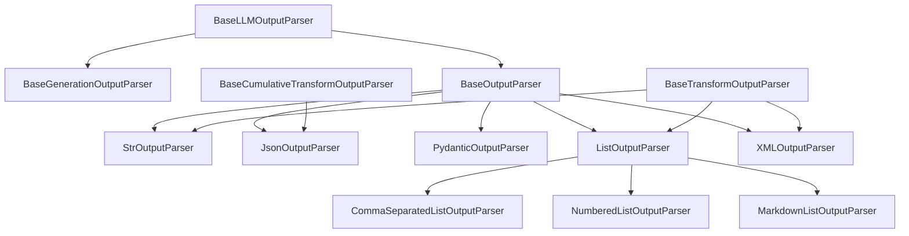
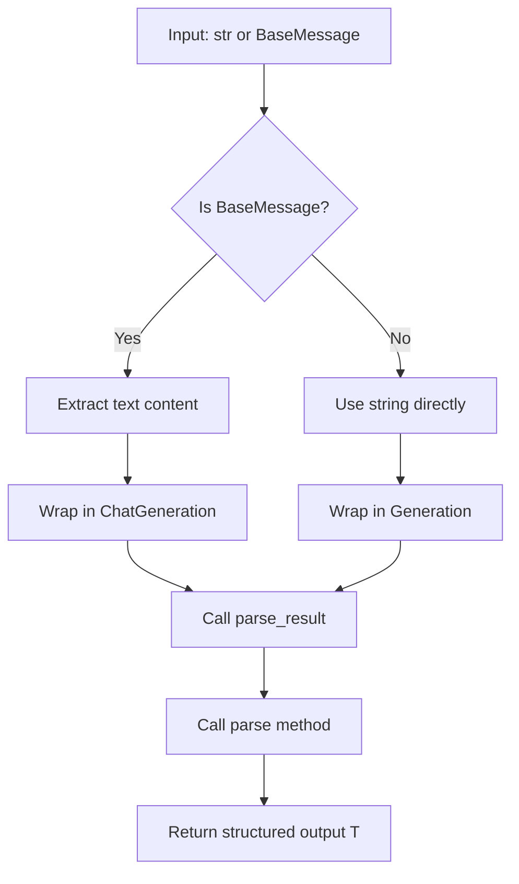
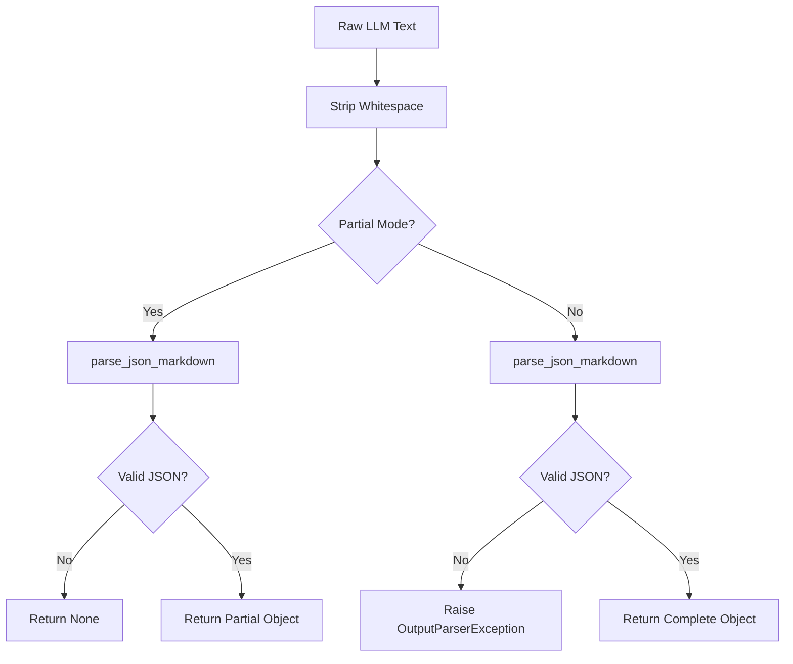
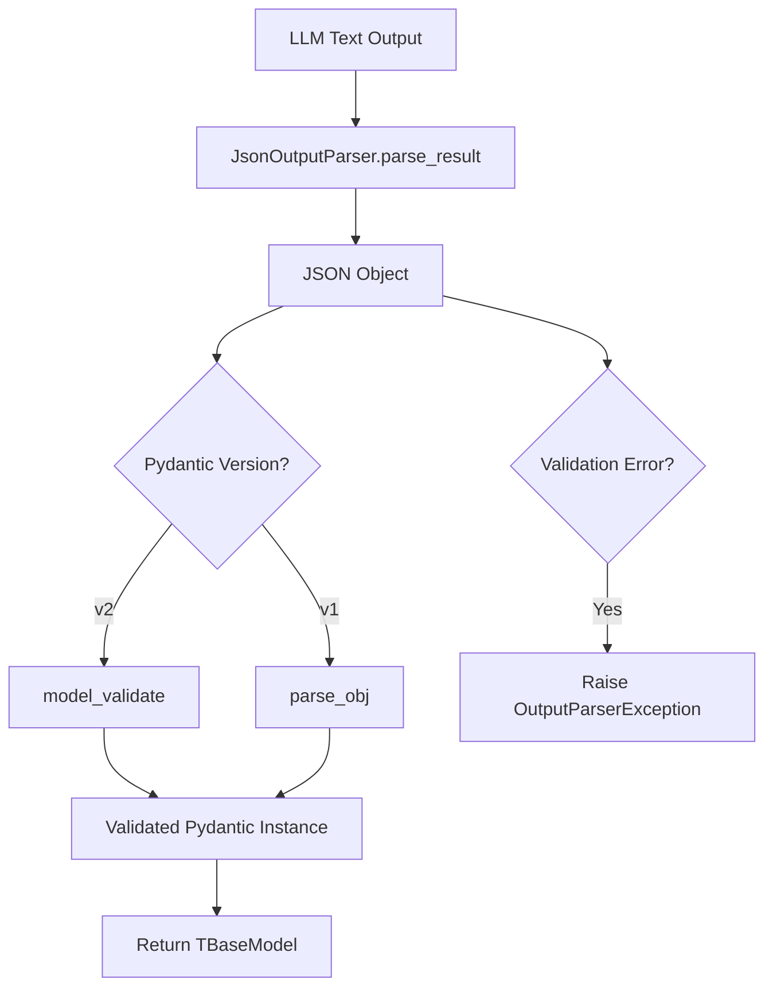
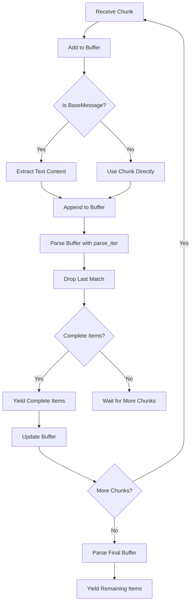
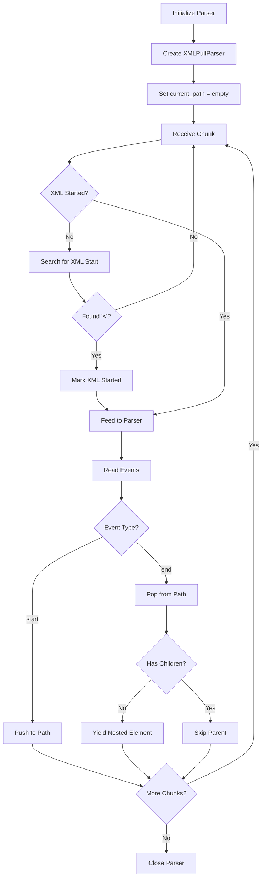
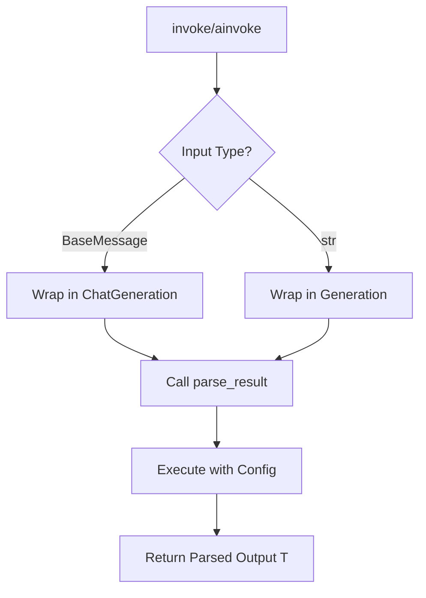

# Output Parser Base & Common Parsers

## Introduction

Output parsers in LangChain are components that transform unstructured LLM outputs into structured, typed data that applications can reliably consume. While modern LLMs increasingly support native structured output capabilities, output parsers remain valuable when working with models lacking this feature or when additional validation and transformation logic is required. The output parser system is built on a hierarchy of base classes that define common interfaces and behaviors, with specialized implementations for various output formats including strings, JSON, Pydantic models, lists, and XML.

The parser architecture integrates seamlessly with LangChain's `Runnable` protocol, enabling parsers to participate in chains with streaming support, configuration management, and async execution. This document covers the foundational base classes and the most commonly used parser implementations.

Sources: [output_parsers/__init__.py:1-10](../../../libs/core/langchain_core/output_parsers/__init__.py#L1-L10), [output_parsers/base.py:1-20](../../../libs/core/langchain_core/output_parsers/base.py#L1-L20)

## Architecture Overview

### Base Class Hierarchy

The output parser system is organized into a three-tier inheritance hierarchy that provides progressively specialized functionality:



Sources: [output_parsers/base.py:30-50](../../../libs/core/langchain_core/output_parsers/base.py#L30-L50), [output_parsers/__init__.py:20-45](../../../libs/core/langchain_core/output_parsers/__init__.py#L20-L45)

### Core Base Classes

| Class | Purpose | Key Methods |
|-------|---------|-------------|
| `BaseLLMOutputParser[T]` | Abstract foundation for all parsers | `parse_result()`, `aparse_result()` |
| `BaseGenerationOutputParser` | Adds `Runnable` integration | `invoke()`, `ainvoke()` |
| `BaseOutputParser[T]` | Primary base with string parsing | `parse()`, `aparse()`, `get_format_instructions()` |
| `BaseTransformOutputParser` | Enables streaming transformations | `_transform()`, `_atransform()` |
| `BaseCumulativeTransformOutputParser` | Streaming with cumulative state | `_diff()` for incremental updates |

Sources: [output_parsers/base.py:35-70](../../../libs/core/langchain_core/output_parsers/base.py#L35-L70)

## Base Parser Classes

### BaseLLMOutputParser

The foundational abstract class that defines the core parsing interface. It operates on `Generation` objects, which represent raw LLM outputs.

```python
class BaseLLMOutputParser(ABC, Generic[T]):
    """Abstract base class for parsing the outputs of a model."""

    @abstractmethod
    def parse_result(self, result: list[Generation], *, partial: bool = False) -> T:
        """Parse a list of candidate model `Generation` objects into a specific format.

        Args:
            result: A list of `Generation` to be parsed.
            partial: Whether to parse the output as a partial result.

        Returns:
            Structured output.
        """
```

The `partial` parameter enables parsers to handle incomplete outputs during streaming, allowing progressive parsing as tokens arrive.

Sources: [output_parsers/base.py:35-66](../../../libs/core/langchain_core/output_parsers/base.py#L35-L66)

### BaseOutputParser

The primary base class that most parsers extend. It adds string-based parsing methods and format instruction capabilities:



Key features include:

- **String Parsing**: The abstract `parse(text: str) -> T` method that subclasses implement
- **Format Instructions**: `get_format_instructions()` provides guidance for LLMs on expected output format
- **Prompt Context**: `parse_with_prompt()` allows parsers to access the original prompt for error recovery
- **Type Inference**: Automatically infers `OutputType` from generic type parameters

Sources: [output_parsers/base.py:69-170](../../../libs/core/langchain_core/output_parsers/base.py#L69-L170)

### Streaming Transform Parsers

Two specialized base classes enable streaming support:

**BaseTransformOutputParser**: Provides `_transform()` and `_atransform()` methods that process input iterators, enabling chunk-by-chunk parsing for streaming scenarios.

**BaseCumulativeTransformOutputParser**: Extends transform parsing with cumulative state tracking. The `_diff()` method computes incremental changes between parsing states, useful for JSON streaming where partial objects are progressively built.

Sources: [output_parsers/transform.py](../../../libs/core/langchain_core/output_parsers/transform.py) (referenced in [output_parsers/__init__.py:13-14](../../../libs/core/langchain_core/output_parsers/__init__.py#L13-L14))

## Common Parser Implementations

### StrOutputParser

The simplest parser that extracts plain text from model outputs without transformation:

```python
class StrOutputParser(BaseTransformOutputParser[str]):
    """Extract text content from model outputs as a string."""
    
    def parse(self, text: str) -> str:
        """Returns the input text with no changes."""
        return text
```

**Use Cases**:
- Converting `AIMessage` objects to plain strings
- Streaming text output chunk-by-chunk
- Simplest integration point for downstream text processing

**Example Usage**:
```python
from langchain_core.output_parsers import StrOutputParser
from langchain_openai import ChatOpenAI

model = ChatOpenAI(model="gpt-4o")
parser = StrOutputParser()

# Get string output from a model
message = model.invoke("Tell me a joke")
result = parser.invoke(message)
```

Sources: [output_parsers/string.py:1-50](../../../libs/core/langchain_core/output_parsers/string.py#L1-L50)

### JsonOutputParser

Parses LLM output into JSON objects with optional Pydantic validation:

| Feature | Description |
|---------|-------------|
| **Markdown Extraction** | Automatically extracts JSON from triple-backtick code blocks |
| **Partial Parsing** | Streams partial JSON objects as keys become available |
| **Diff Mode** | Yields JSONPatch operations describing incremental changes |
| **Schema Validation** | Optional Pydantic model validation via `pydantic_object` parameter |

**Parsing Flow**:



**Format Instructions**: When a Pydantic model is provided, `get_format_instructions()` generates schema-based instructions:

```python
def get_format_instructions(self) -> str:
    if self.pydantic_object is None:
        return "Return a JSON object."
    schema = dict(self._get_schema(self.pydantic_object).items())
    # Remove extraneous fields
    reduced_schema = schema
    if "title" in reduced_schema:
        del reduced_schema["title"]
    if "type" in reduced_schema:
        del reduced_schema["type"]
    schema_str = json.dumps(reduced_schema, ensure_ascii=False)
    return JSON_FORMAT_INSTRUCTIONS.format(schema=schema_str)
```

Sources: [output_parsers/json.py:1-120](../../../libs/core/langchain_core/output_parsers/json.py#L1-L120)

### PydanticOutputParser

Extends `JsonOutputParser` to parse LLM output directly into validated Pydantic models:



**Key Features**:
- Automatic validation using Pydantic's built-in validators
- Support for both Pydantic v1 and v2
- Type-safe output with generic type parameter `TBaseModel`
- Detailed error messages including the JSON that failed validation

**Validation Logic**:
```python
def _parse_obj(self, obj: dict) -> TBaseModel:
    try:
        if issubclass(self.pydantic_object, pydantic.BaseModel):
            return self.pydantic_object.model_validate(obj)
        if issubclass(self.pydantic_object, pydantic.v1.BaseModel):
            return self.pydantic_object.parse_obj(obj)
        msg = f"Unsupported model version for PydanticOutputParser"
        raise OutputParserException(msg)
    except (pydantic.ValidationError, pydantic.v1.ValidationError) as e:
        raise self._parser_exception(e, obj) from e
```

Sources: [output_parsers/pydantic.py:1-100](../../../libs/core/langchain_core/output_parsers/pydantic.py#L1-L100)

### List Output Parsers

A family of parsers for extracting lists from various text formats:

#### CommaSeparatedListOutputParser

Parses comma-separated values using Python's CSV reader:

```python
def parse(self, text: str) -> list[str]:
    try:
        reader = csv.reader(
            StringIO(text), quotechar='"', delimiter=",", skipinitialspace=True
        )
        return [item for sublist in reader for item in sublist]
    except csv.Error:
        # Keep old logic for backup
        return [part.strip() for part in text.split(",")]
```

**Format Instructions**: `"Your response should be a list of comma separated values, eg: \`foo, bar, baz\` or \`foo,bar,baz\`"`

Sources: [output_parsers/list.py:80-120](../../../libs/core/langchain_core/output_parsers/list.py#L80-L120)

#### NumberedListOutputParser

Extracts items from numbered lists using regex pattern matching:

| Property | Value |
|----------|-------|
| **Pattern** | `r"\d+\.\s([^\n]+)"` |
| **Format** | `"1. foo\n\n2. bar\n\n3. baz"` |
| **Streaming** | Supports incremental parsing via `parse_iter()` |

Sources: [output_parsers/list.py:125-155](../../../libs/core/langchain_core/output_parsers/list.py#L125-L155)

#### MarkdownListOutputParser

Parses Markdown-style bullet lists:

| Property | Value |
|----------|-------|
| **Pattern** | `r"^\s*[-*]\s([^\n]+)$"` |
| **Format** | `"- foo\n- bar\n- baz"` |
| **Flags** | `re.MULTILINE` for line-by-line matching |

Sources: [output_parsers/list.py:158-180](../../../libs/core/langchain_core/output_parsers/list.py#L158-L180)

#### Streaming Implementation

All list parsers support streaming through a sophisticated buffering mechanism:



The `droplastn()` utility ensures only complete list items are yielded during streaming, holding back the last partial match until more content arrives.

Sources: [output_parsers/list.py:25-85](../../../libs/core/langchain_core/output_parsers/list.py#L25-L85)

### XMLOutputParser

Parses XML-formatted LLM outputs with streaming support and security considerations:

**Parser Options**:

| Parser | Description | Security |
|--------|-------------|----------|
| `defusedxml` (default) | Secure wrapper around standard library | Protected against XML vulnerabilities |
| `xml` | Python standard library | Use only if distribution is known secure |

**Configuration**:
```python
class XMLOutputParser(BaseTransformOutputParser):
    tags: list[str] | None = None  # Expected XML tags
    parser: Literal["defusedxml", "xml"] = "defusedxml"
```

**Streaming Architecture**:

The `_StreamingParser` class maintains state across chunks:



**Security Warning**: The parser defaults to `defusedxml` to prevent XML vulnerabilities including billion laughs attacks, external entity expansion, and DTD retrieval. The standard library parser should only be used when the Python distribution is known to have secure `libexpat` bindings.

Sources: [output_parsers/xml.py:1-350](../../../libs/core/langchain_core/output_parsers/xml.py#L1-L350)

## Integration with Runnable Protocol

All output parsers implement the `Runnable` interface, enabling seamless integration into LangChain chains:

**Invocation Methods**:



**Configuration Support**:
- `_call_with_config()` provides tracing and callback integration
- `run_type="parser"` enables parser-specific monitoring
- Async execution via `_acall_with_config()` and `run_in_executor()`

Sources: [output_parsers/base.py:85-135](../../../libs/core/langchain_core/output_parsers/base.py#L85-L135)

## Format Instructions

Most parsers provide `get_format_instructions()` to guide LLMs on expected output format:

| Parser | Instructions Content |
|--------|---------------------|
| `StrOutputParser` | None (not implemented) |
| `JsonOutputParser` | JSON schema when Pydantic model provided |
| `PydanticOutputParser` | Detailed JSON schema with examples |
| `CommaSeparatedListOutputParser` | Comma-separated format examples |
| `NumberedListOutputParser` | Numbered list format with line breaks |
| `MarkdownListOutputParser` | Markdown bullet list format |
| `XMLOutputParser` | XML tag structure with well-formed examples |

**Example - PydanticOutputParser Instructions**:
```
The output should be formatted as a JSON instance that conforms to the JSON schema below.

As an example, for the schema {"properties": {"foo": {"title": "Foo", "description": "a list of strings", "type": "array", "items": {"type": "string"}}}, "required": ["foo"]}
the object {"foo": ["bar", "baz"]} is a well-formatted instance of the schema. The object {"properties": {"foo": ["bar", "baz"]}} is not well-formatted.

Here is the output schema:
```
{schema}
```
```

Sources: [output_parsers/pydantic.py:90-110](../../../libs/core/langchain_core/output_parsers/pydantic.py#L90-L110), [output_parsers/xml.py:35-55](../../../libs/core/langchain_core/output_parsers/xml.py#L35-L55)

## Error Handling

Output parsers raise `OutputParserException` when parsing fails, including the problematic LLM output for debugging:

```python
try:
    return parse_json_markdown(text)
except JSONDecodeError as e:
    msg = f"Invalid json output: {text}"
    raise OutputParserException(msg, llm_output=text) from e
```

The exception includes:
- **Message**: Human-readable error description
- **llm_output**: The raw text that failed parsing
- **Original Exception**: Chained for full traceback

Sources: [output_parsers/json.py:80-95](../../../libs/core/langchain_core/output_parsers/json.py#L80-L95)

## Summary

LangChain's output parser system provides a robust, extensible framework for transforming unstructured LLM outputs into typed, validated data structures. The three-tier base class hierarchy enables code reuse while supporting diverse parsing strategies from simple string extraction to complex XML streaming. Common parsers cover the most frequent use cases (strings, JSON, Pydantic models, lists, XML) with built-in streaming support, format instruction generation, and comprehensive error handling. Integration with the Runnable protocol ensures parsers work seamlessly in chains with configuration management, tracing, and async execution support.

Sources: [output_parsers/__init__.py:1-65](../../../libs/core/langchain_core/output_parsers/__init__.py#L1-L65), [output_parsers/base.py:1-170](../../../libs/core/langchain_core/output_parsers/base.py#L1-L170)