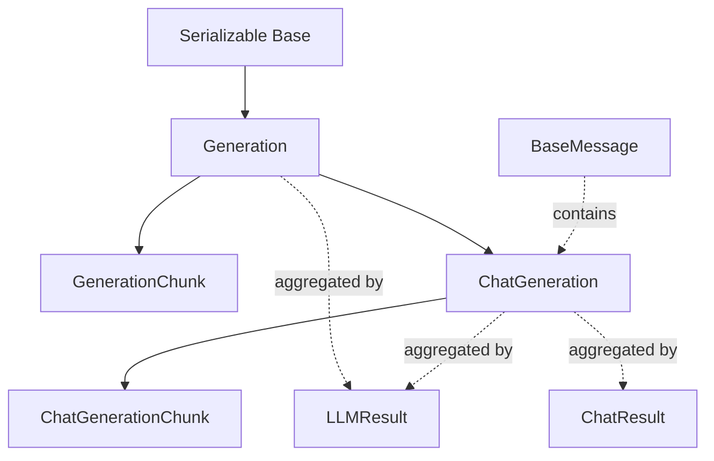
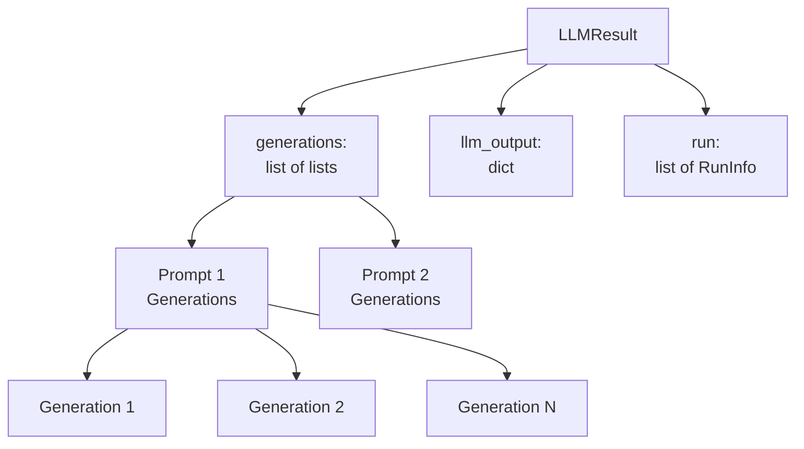
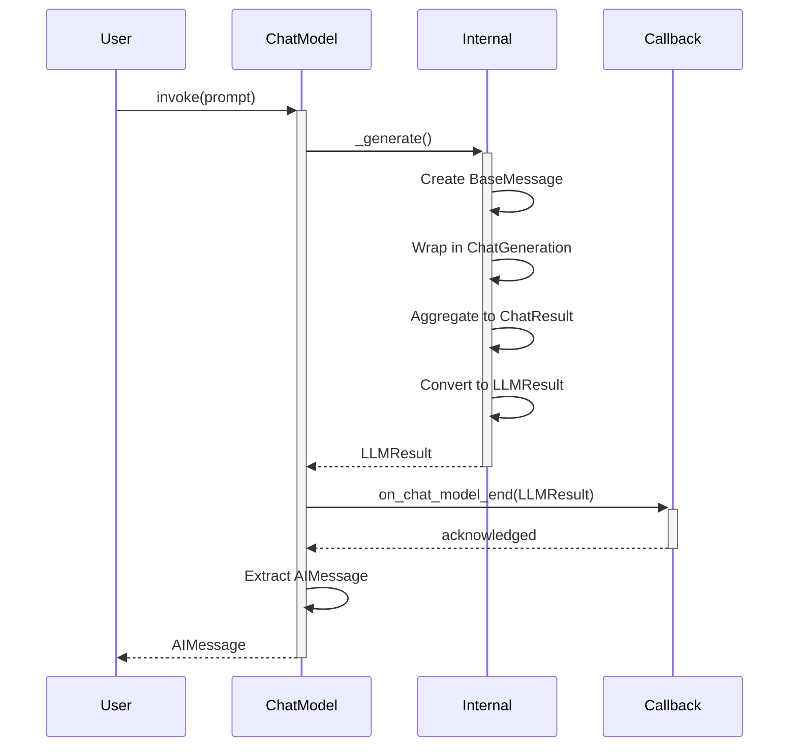
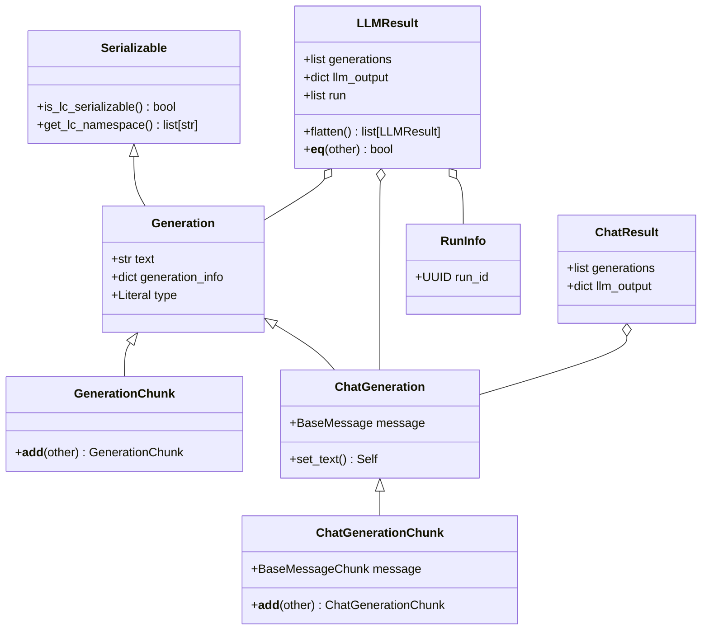

# Generation, LLMResult & Output Data Models

The LangChain framework defines a comprehensive set of output data models to represent responses from language models and chat models. These models provide a standardized way to capture generated text, structured messages, and provider-specific metadata across different LLM implementations. The output system consists of several hierarchical classes: `Generation` for traditional text-based LLM outputs, `ChatGeneration` for structured chat message outputs, and `LLMResult` as the top-level container that aggregates generations with additional metadata. These models support both streaming (via chunk variants) and batch operations, enabling flexible integration patterns throughout the LangChain ecosystem.

Users typically interact with these models indirectly through higher-level abstractions like `AIMessage` objects (returned from standard runnable methods) or via callbacks that provide access to the raw `LLMResult` objects. Understanding these output models is essential for implementing custom LLM integrations, handling streaming responses, and accessing provider-specific metadata.

Sources: [__init__.py:1-49](../../../libs/core/langchain_core/outputs/__init__.py#L1-L49)

## Architecture Overview

The output data model architecture follows a layered design with clear separation between basic text generation, chat-specific generation, and result aggregation:



The architecture distinguishes between two primary model types:

- **Traditional LLMs**: Return string outputs wrapped in `Generation` objects
- **Chat Models**: Return structured `BaseMessage` objects wrapped in `ChatGeneration` objects

Both types ultimately produce `LLMResult` objects accessible through callbacks, while standard runnable interfaces project these into simpler formats (`AIMessage` for chat models, plain strings for LLMs).

Sources: [__init__.py:3-23](../../../libs/core/langchain_core/outputs/__init__.py#L3-L23), [generation.py:1-12](../../../libs/core/langchain_core/outputs/generation.py#L1-L12)

## Generation Classes

### Generation

The `Generation` class represents a single text output from a traditional LLM that operates on string inputs and produces string outputs. It serves as the foundational output type for non-chat models.

| Field | Type | Description |
|-------|------|-------------|
| `text` | `str` | The generated text output |
| `generation_info` | `dict[str, Any] \| None` | Raw provider response including finish reasons, token log probabilities, etc. |
| `type` | `Literal["Generation"]` | Serialization type identifier |

The `Generation` class inherits from `Serializable`, enabling persistence and transmission across system boundaries. The `generation_info` field provides a flexible container for provider-specific metadata that doesn't fit into the standardized schema.

```python
class Generation(Serializable):
    """A single text generation output."""
    
    text: str
    """Generated text output."""

    generation_info: dict[str, Any] | None = None
    """Raw response from the provider."""

    type: Literal["Generation"] = "Generation"
    """Type is used exclusively for serialization purposes."""
```

Sources: [generation.py:13-46](../../../libs/core/langchain_core/outputs/generation.py#L13-L46)

### GenerationChunk

`GenerationChunk` extends `Generation` to support streaming scenarios where outputs arrive incrementally. It implements concatenation operations to merge sequential chunks into complete generations.

The concatenation operator (`__add__`) merges both the text content and generation metadata:

```python
def __add__(self, other: GenerationChunk) -> GenerationChunk:
    """Concatenate two `GenerationChunk` objects."""
    if isinstance(other, GenerationChunk):
        generation_info = merge_dicts(
            self.generation_info or {},
            other.generation_info or {},
        )
        return GenerationChunk(
            text=self.text + other.text,
            generation_info=generation_info or None,
        )
```

The `merge_dicts` utility intelligently combines metadata from both chunks, handling nested dictionaries and conflicting keys according to LangChain's merge semantics.

Sources: [generation.py:49-79](../../../libs/core/langchain_core/outputs/generation.py#L49-L79)

## Chat Generation Classes

### ChatGeneration

`ChatGeneration` is a specialized subclass of `Generation` designed for chat models that produce structured message objects rather than plain text. The key distinction is the `message` field containing a `BaseMessage` instance.

| Field | Type | Description |
|-------|------|-------------|
| `text` | `str` | Text contents extracted from the message (auto-populated) |
| `message` | `BaseMessage` | The structured message output by the chat model |
| `generation_info` | `dict[str, Any] \| None` | Provider-specific metadata (inherited) |
| `type` | `Literal["ChatGeneration"]` | Serialization type identifier |

The `text` field is automatically synchronized with the message content through a Pydantic validator:

```python
@model_validator(mode="after")
def set_text(self) -> Self:
    """Set the text attribute to be the contents of the message."""
    # Check for legacy blocks with "text" key but no "type" field.
    if isinstance(self.message.content, list):
        has_legacy_blocks = any(
            isinstance(block, dict)
            and "text" in block
            and block.get("type") is None
            for block in self.message.content
        )
        
        if has_legacy_blocks:
            blocks = []
            for block in self.message.content:
                if isinstance(block, str):
                    blocks.append(block)
                elif isinstance(block, dict):
                    block_type = block.get("type")
                    if block_type == "text" or (
                        block_type is None and "text" in block
                    ):
                        blocks.append(block.get("text", ""))
            self.text = "".join(blocks)
        else:
            self.text = self.message.text
    else:
        self.text = self.message.text
    
    return self
```

This validator handles both simple string content and complex list-based content with legacy block formats, ensuring backward compatibility.

Sources: [chat_generation.py:15-80](../../../libs/core/langchain_core/outputs/chat_generation.py#L15-L80)

### ChatGenerationChunk

`ChatGenerationChunk` enables streaming for chat models by extending `ChatGeneration` with concatenation capabilities. It supports merging individual chunks or lists of chunks:

```python
def __add__(
    self, other: ChatGenerationChunk | list[ChatGenerationChunk]
) -> ChatGenerationChunk:
    """Concatenate two `ChatGenerationChunk`s."""
    if isinstance(other, ChatGenerationChunk):
        generation_info = merge_dicts(
            self.generation_info or {},
            other.generation_info or {},
        )
        return ChatGenerationChunk(
            message=self.message + other.message,
            generation_info=generation_info or None,
        )
    if isinstance(other, list) and all(
        isinstance(x, ChatGenerationChunk) for x in other
    ):
        generation_info = merge_dicts(
            self.generation_info or {},
            *[chunk.generation_info for chunk in other if chunk.generation_info],
        )
        return ChatGenerationChunk(
            message=self.message + [chunk.message for chunk in other],
            generation_info=generation_info or None,
        )
```

The class also provides a utility function for batch merging:

```python
def merge_chat_generation_chunks(
    chunks: list[ChatGenerationChunk],
) -> ChatGenerationChunk | None:
    """Merge a list of `ChatGenerationChunk`s into a single `ChatGenerationChunk`."""
    if not chunks:
        return None
    
    if len(chunks) == 1:
        return chunks[0]
    
    return chunks[0] + chunks[1:]
```

Sources: [chat_generation.py:83-150](../../../libs/core/langchain_core/outputs/chat_generation.py#L83-L150)

## LLMResult Container

### LLMResult Structure

`LLMResult` serves as the top-level container for LLM and chat model outputs, aggregating multiple generations with associated metadata. Both traditional LLMs and chat models produce `LLMResult` objects, which are accessible through callback handlers.



| Field | Type | Description |
|-------|------|-------------|
| `generations` | `list[list[Generation \| ChatGeneration \| GenerationChunk \| ChatGenerationChunk]]` | Two-dimensional list where first dimension represents different input prompts and second dimension represents candidate generations per prompt |
| `llm_output` | `dict \| None` | Provider-specific output dictionary with arbitrary keys (non-standardized) |
| `run` | `list[RunInfo] \| None` | Metadata about the model call execution for each input |
| `type` | `Literal["LLMResult"]` | Serialization type identifier |

The nested list structure enables batch processing where multiple prompts can be processed simultaneously, each potentially producing multiple candidate outputs:

- **First dimension**: Different input prompts (batch dimension)
- **Second dimension**: Multiple candidate generations for a single prompt (n-best or temperature sampling)

Sources: [llm_result.py:11-47](../../../libs/core/langchain_core/outputs/llm_result.py#L11-L47)

### LLMResult Operations

The `LLMResult` class provides utility methods for manipulating and comparing results:

#### Flattening

The `flatten()` method unpacks the nested generation structure into a flat list of `LLMResult` objects, each containing a single generation list. This is particularly useful for downstream processing that operates on individual generations:

```python
def flatten(self) -> list[LLMResult]:
    """Flatten generations into a single list.
    
    Unpack `list[list[Generation]] -> list[LLMResult]` where each returned
    `LLMResult` contains only a single `Generation`. If token usage information is
    available, it is kept only for the `LLMResult` corresponding to the top-choice
    `Generation`, to avoid over-counting of token usage downstream.
    """
    llm_results = []
    for i, gen_list in enumerate(self.generations):
        # Avoid double counting tokens in OpenAICallback
        if i == 0:
            llm_results.append(
                LLMResult(
                    generations=[gen_list],
                    llm_output=self.llm_output,
                )
            )
        else:
            if self.llm_output is not None:
                llm_output = deepcopy(self.llm_output)
                llm_output["token_usage"] = {}
            else:
                llm_output = None
            llm_results.append(
                LLMResult(
                    generations=[gen_list],
                    llm_output=llm_output,
                )
            )
    return llm_results
```

The method implements special token usage handling: only the first (top-choice) generation retains token usage information, preventing double-counting in callback mechanisms like `OpenAICallback`.

#### Equality Comparison

The `__eq__` method provides semantic equality checking that ignores run metadata:

```python
def __eq__(self, other: object) -> bool:
    """Check for `LLMResult` equality by ignoring any metadata related to runs."""
    if not isinstance(other, LLMResult):
        return NotImplemented
    return (
        self.generations == other.generations
        and self.llm_output == other.llm_output
    )
```

This allows comparing results based on their actual content rather than execution metadata, useful for testing and caching scenarios.

Sources: [llm_result.py:49-99](../../../libs/core/langchain_core/outputs/llm_result.py#L49-L99)

## ChatResult Container

`ChatResult` is an intermediate container used internally by some chat model implementations. It represents the result of a single prompt (unlike `LLMResult` which handles multiple prompts) and is eventually mapped to `LLMResult` before being projected into `AIMessage` objects.

| Field | Type | Description |
|-------|------|-------------|
| `generations` | `list[ChatGeneration]` | List of chat generations for a single input prompt |
| `llm_output` | `dict \| None` | Provider-specific output metadata |

The single-prompt focus makes `ChatResult` simpler than `LLMResult`, but it serves primarily as an internal data structure. End users should rely on `AIMessage` or `LLMResult` for accessing output information.

```python
class ChatResult(BaseModel):
    """Use to represent the result of a chat model call with a single prompt.
    
    This container is used internally by some implementations of chat model, it will
    eventually be mapped to a more general `LLMResult` object, and then projected into
    an `AIMessage` object.
    """
    
    generations: list[ChatGeneration]
    """List of the chat generations."""
    
    llm_output: dict | None = None
    """For arbitrary model provider-specific output."""
```

Sources: [chat_result.py:1-31](../../../libs/core/langchain_core/outputs/chat_result.py#L1-L31)

## RunInfo Metadata

The `RunInfo` class captures execution metadata for individual model or chain runs. It provides backward compatibility with older LangChain versions and is considered likely for deprecation in favor of accessing run information through callbacks or the `astream_event` API.

```python
class RunInfo(BaseModel):
    """Class that contains metadata for a single execution of a chain or model.
    
    Defined for backwards compatibility with older versions of `langchain_core`.
    """
    
    run_id: UUID
    """A unique identifier for the model or chain run."""
```

The `run_id` field enables tracing and correlation of outputs with specific execution contexts, particularly useful in complex chains or agent systems where multiple LLM calls may occur.

Sources: [run_info.py:1-21](../../../libs/core/langchain_core/outputs/run_info.py#L1-L21)

## Data Flow and Usage Patterns

The following sequence diagram illustrates how output models flow through a typical chat model invocation:



### Standard Invocation Flow

1. **User calls standard runnable method** (`invoke`, `batch`, `stream`)
2. **Internal generation** creates `BaseMessage` objects
3. **Wrapping** in `ChatGeneration` or `Generation` objects
4. **Aggregation** into `ChatResult` or directly to `LLMResult`
5. **Callback notification** with complete `LLMResult`
6. **Projection** to user-facing format (`AIMessage` for chat models, string for LLMs)

### Streaming Flow

For streaming operations, the flow uses chunk variants:

1. **Incremental chunks** arrive as `ChatGenerationChunk` or `GenerationChunk`
2. **Concatenation** merges chunks using `__add__` operations
3. **Final aggregation** produces complete `LLMResult` at stream end
4. **Callbacks** receive both incremental chunks and final result

Sources: [__init__.py:11-23](../../../libs/core/langchain_core/outputs/__init__.py#L11-L23)

## Class Hierarchy and Relationships



The hierarchy demonstrates clear inheritance patterns:

- **Serializable** provides the foundation for persistence
- **Generation** serves as the base for all generation types
- **Chunk classes** add streaming concatenation capabilities
- **Chat classes** specialize for structured message outputs
- **Result containers** aggregate generations with metadata

Sources: [generation.py:13-79](../../../libs/core/langchain_core/outputs/generation.py#L13-L79), [chat_generation.py:15-150](../../../libs/core/langchain_core/outputs/chat_generation.py#L15-L150), [llm_result.py:11-99](../../../libs/core/langchain_core/outputs/llm_result.py#L11-L99)

## Summary

The LangChain output data models provide a robust, extensible framework for representing LLM and chat model responses. The architecture supports both traditional text-based LLMs and modern chat models through a unified interface, while accommodating streaming scenarios via chunk variants. The `LLMResult` container serves as the central aggregation point accessible through callbacks, while user-facing APIs project outputs into simpler formats like `AIMessage` objects or plain strings. This design enables consistent handling of diverse model providers while maintaining flexibility for provider-specific metadata through the `generation_info` and `llm_output` fields. Understanding these models is crucial for implementing custom integrations, handling streaming responses, and accessing detailed model output information beyond the standard message interface.